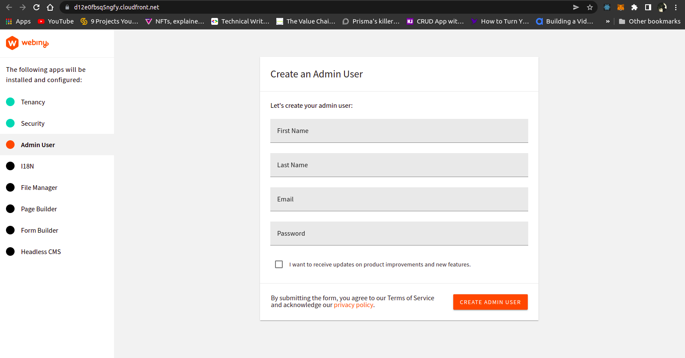
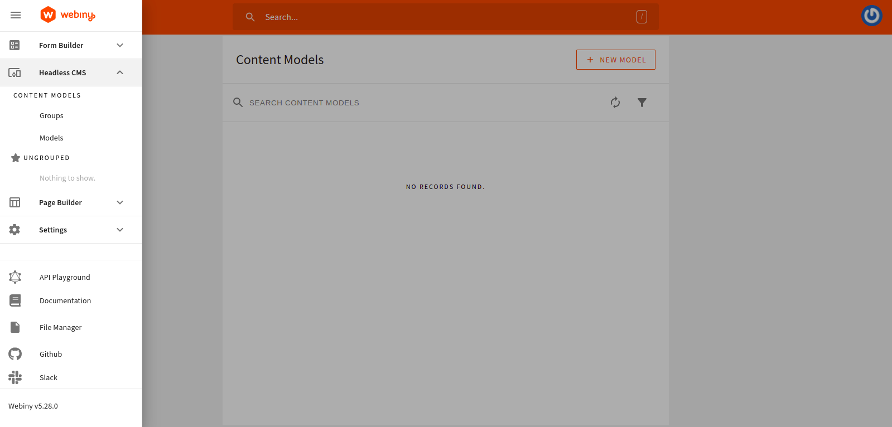
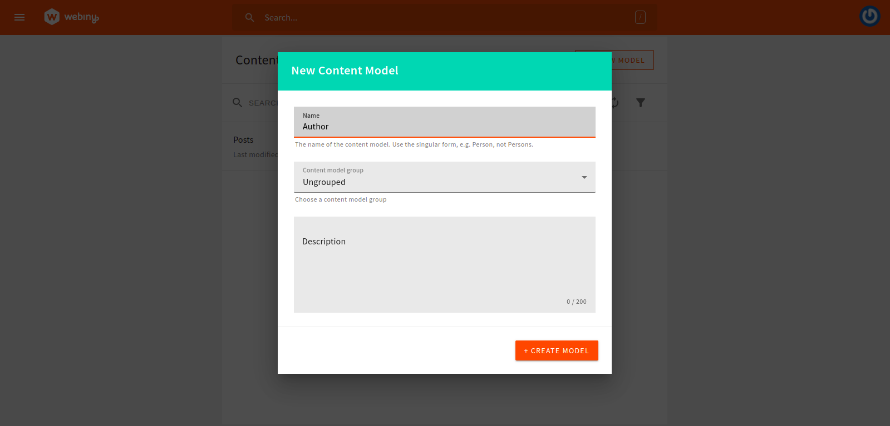
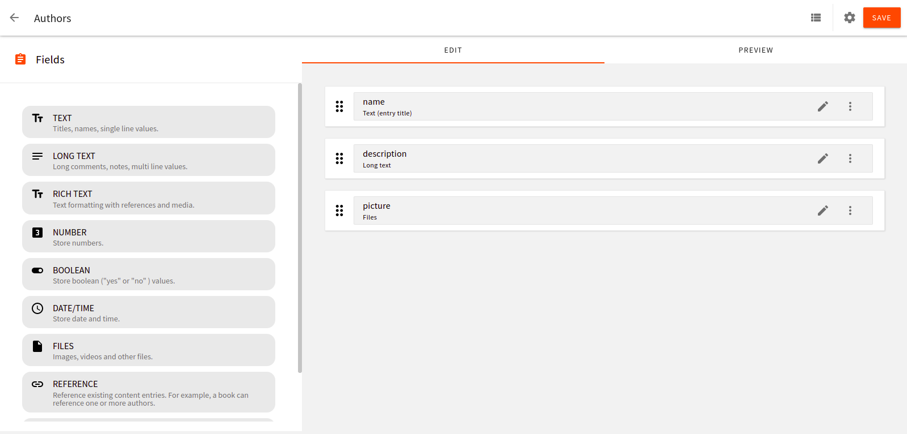
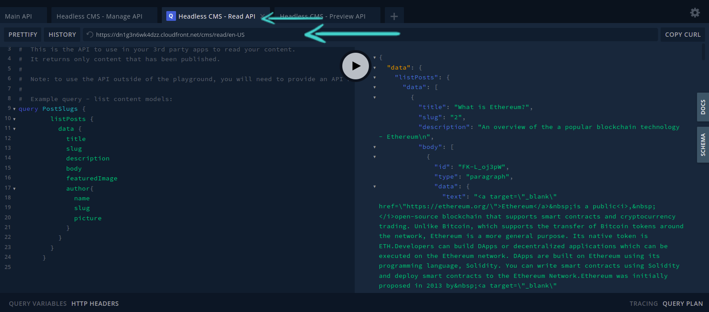
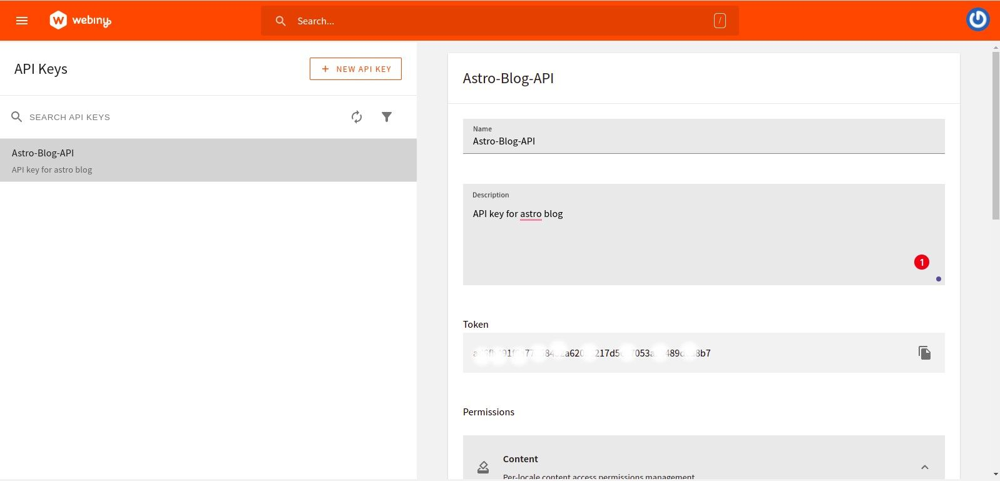
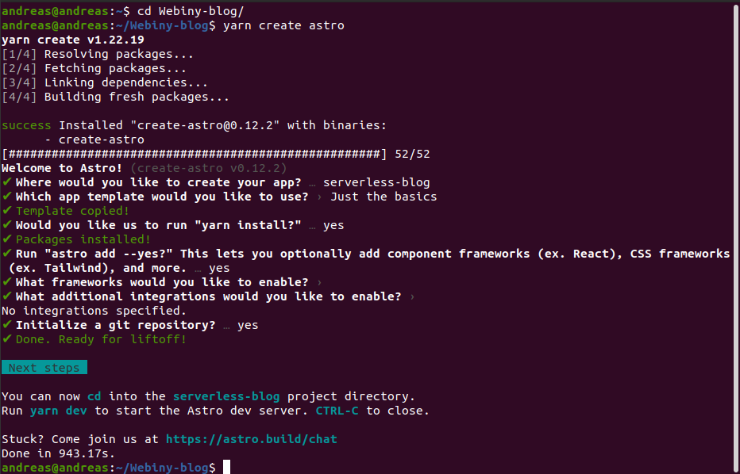
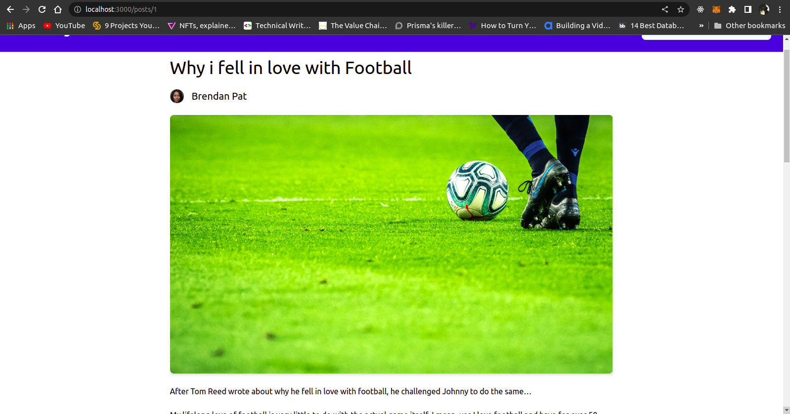

## **Introduction**

In this tutorial, we will build a simple Blog site with Webiny Headless CMS and Astro from scratch. You will be able to read blog posts with feature images and text and view the author of the Blogpost. We will be creating this project with tools such as Webiny, [Astro](https://astro.build) and [TailwindCSS](https://tailwindcss.com).

Before we dive into building this JAMstack project, let us go through what you will learn.

First, you will learn how to create and set up a back-end using Webiny Headless CMS. We will also create content models - categories, authors, and posts. Afterwards, we will query the data from the Headless CMS to our frontend using Graphql. We will be using Astro and TailwindCSS to build the UI of our application.

## **What is Webiny?**

Webiny is an open-source, developer-friendly serverless CMS powered by modern tools and technologies such as Node, React and a GraphQL API. It also gives you the flexibility to integrate with other tools like Gatsby, Nextjs and Astro through Content Delivery API. Webiny helps developers engineer, build and deploy applications on top of the serverless infrastructure. Webiny comes with a built-in serverless page builder, form builder, file manager, admin area and headless CMS that runs on top of AWS Lambda, DynamoDB, and S3, which allows developers to build and run applications without having to manage servers. Webiny allows users to build websites and web applications in both large and small project without the hassle by providing all the tools you need, which is optimized to work seamlessly together in a performant way.

Refer [here](https://www.webiny.com/features/) for more features of Webiny.

## **What is Astro?**

Astro is an open-source web framework that enables developers to build blazing-fast websites and applications. Astro is also known as a site-builder with robust developer experience that allows the development of high-performance websites and applications with little or no JavaScript by loading individual components of a page if and when needed and leaving the rest of the page as static HTML.

Astro has built-in support for popular web frameworks and tools such as:

- React
- Svelte
- Preact
- Vue
- Solid.js
- Styling frameworks like TailwindCSS and SASS
- TypeScript
- Many more

## **Benefits of using Astro**

- Astro supports server-side rendering and code splitting.
- Astro integrates partial hydration into websites and applications, therefore increasing site performance.
- Developers can build websites using UI components from your favorite front-end frameworks like React and Vue.
- It supports integration with tools like most Headless CMS and Vercel.
- It has an interactive development UI where you can preview content.

## **Prerequisites**

To follow along with this tutorial, we’re going to assume you have already done the following:

- [Set up your AWS credentials locally](https://www.webiny.com/docs/infrastructure/aws/configure-aws-credentials)
- Ensure that you have [Node.js](https://nodejs.org/en/download/) >= 14.15.0 installed.
- Ensure that you have yarn ^1.22.0 || >=2 installed - Webiny works with both yarn versions.
- Basic understanding of [React](https://reactjs.org/) and [javascript](https://www.javascript.com/).

## **Setting up our Webiny Headless CMS**

We recommend creating a new Webiny project with the following command:

```bash
npx create-webiny-project
```

Running the command on the terminal of your choice will automatically set everything up for you. From there, follow the on-screen setup instructions, where you will be answering a couple of project-related questions, including project deployment.


You will be asked to choose the AWS region where your project will be deployed and a database you want to use. Here we made use of DynamoDB as we are not building a large project.

Once your new project has been created, we’ll deploy it to your AWS account.

```bash
cd astro-blog && yarn webiny deploy
```

After executing this command, your application will first get built. Then, along with the needed cloud infrastructure resources, it will deploy the application to your AWS account.

- *Note: your first deployment can take up to 20 minutes! or more. So, even though it might look like nothing is happening in the terminal, please be patient and let the process finish. If something goes wrong, an error will be shown.*

Once the deployment is done, you will be presented with a URL over which you can access your Admin Dashboard.




Fill out all your information and let’s dive into creating our models.

## **Creating our Models**

On our admin dashboard, on the left, click on the menu icon, and then click on **Headless CMS > Models**.



Let’s start by creating our authors models. click on add model icon a modal will open and fill out the form as shown below.



Once created, you’ll be directed to a new page where we will be making our content type.

Using the drag and drop feature Webiny Headless CMS offers, we will be using it to create our content type. Use the drag and drop editor to fill out the following:

- A `text` field with the value **name.**
- A `long text` field with the value **description**.
- A `files` field with the value **picture.**



Using the same method let’s create our Posts model:

- A `text` field with the value **title**
- A `text` field with the value of **slug**.
- A `files` field with the value **featured image**
- A `text` field with the value **description**
- A `rich text` field with the value **body**
- A `reference` field with the value **authors**


Don’t forget to reference the author field by clicking on Content Models as shown in the image below.


## **Adding Content**

Next, let’s add some content to our models by clicking on the menu icon and going to **Headless CMS** > **Ungrouped > Authors** and clicking on **New entry**.

Fill out the Entry and click **save & publish.** You can add as many authors as you want by clicking on **New Entry**


Using the same method, add entries for the Posts. Then, click **save & publish.** Add as many entries as you like.


## **Using the GraphQL API**

Let’s see the data we are fetching from Webiny Headless CMS using their built-in API playground.

Click on the menu icon then click on **API Playground.**

```graphql
{
    listPosts {
       data {
         id
         title
         description
         featuredImage
         authors {
          name
          description
         }
       }
    }
}
```

Note that there are four APIs listed in the tabs at the top of the page. Click on **HeadlessCMS - Read API**. From there, you can explore your content structure and schema (via the right-side panel). Directly below the tabs is a URL string. We will be using this URL to fetch data. Copy the URL and keep it somewhere safe for when we come to that step.



## **Setting up Roles and Permissions**

Now, head to **Setting > Access Management > API key**. Then create your API key by filling in the name and description. Scroll down to **Content,** click on all locales Then grant **full Access** to both **Headless CMS and File Manager.**



Once you have saved the settings, an API Key will be generated. Copy that and keep it with your API URL somewhere safe. We will need it to authenticate fetching data with Astro later on.

## **Setting up our Frontend with Astro**

In this section, we will set up and build our Blog UI using Astro. Note that this will be in a separate folder outside of the Webiny project.

Let’s install Astro either by running each of the following commands:

```bash
# With NPM
npm init astro

# Yarn
yarn create astro
```

The above command will bootstrap our application configuration for the project. Your selection should look like the one in the image below:



After selecting the configuration for your project, change it to the project directory. Then, start the application with the command below:

```bash
cd serverless-blog && yarn dev
```

Now navigate to `http://localhost:3000/` in your browser. This is what you will see.


After installing Astro, it will create a folder structure like the one below:


Notice that every Astro components make use of the `.astro` extension. If you're using VS Code, you can add intellisense support for it by installing this [extension](https://marketplace.visualstudio.com/items?itemName=astro-build.astro-vscode).

## **Setting up Tailwind CSS**

Before we start developing our blog layouts, let's set up [Tailwind](https://tailwindcss.com/), a utility-first CSS framework.

Open up the terminal at the root of the project and run the following commands to install Tailwind CSS. As well as installing dependencies, it will also create a minimal `tailwind.config.cjs` with all the necessary configurations.

```bash
yarn astro add tailwind
```

You should see the Astro CLI add Tailwind dependencies to your project as below:


Now we have those dependencies installed we can configure Tailwind in our blog:

```js
// tailwind.config.cjs

/** @type {import('tailwindcss').Config} */
module.exports = {
	content: ['./src/**/*.{astro,html,js,jsx,md,svelte,ts,tsx,vue}'],
	theme: {
		extend: {},
	},
	plugins: [],
}
```

Astro lets you integrate with any web framework. In your `astro.config.mjs` you will see that Astro has automatically included these codes into your project.

```js
// astro.config.mjs
import { defineConfig } from 'astro/config';

import tailwind from "@astrojs/tailwind";

// https://astro.build/config

export default defineConfig({ integrations: [tailwind()]});
```

Finally, open up your terminal and run the following to start the dev server.

```bash
yarn dev
```

Before we start building our Blog layout. Let’s create an `.env` in our root folder and paste in our Webiny Headless CMS URL API and Token.

```bash
ASTRO_PUBLIC_WEBINY_API_URL=paste-your-apiUrl-here
WEBINY_API_TOKEN=paste-your- API token-here
```

## **Using our Webiny API to build our Blog Layout**

We will be using dummy text to build out our UI. Later, we will fetch the data from our Webiny Headless CMS.

In your `/component/card.astro` file replace the content with the following code:


```markup
---
    export interface Props {
        post: any;
    }
    const { post } = Astro.props as Props;
    const slug = 'posts/'+post.slug;
---

<div class="max-w-md bg-white rounded-lg border border-gray-200 shadow-md dark:bg-gray-800 dark:border-gray-700 gap-2">
	
	<div class="p-6 ">
		<a href={slug}>
			<h5 class="mb-2 text-2xl font-bold tracking-tight text-gray-900 dark:text-white">
                {post.title}
            </h5>
		</a>
		<p class="mb-3 font-normal text-gray-700 dark:text-gray-400">{post.description}</p>
		<div class="flex justify-between items-center">
			<div class="flex justify-between items-center gap-2">
				<div class="rounded-full w-7 h-7 overflow-hidden">
					
				</div>
				<p>{post.author.name}</p>
			</div>
			<a href={slug} class="cursor-pointer inline-flex items-center py-2 px-3 text-sm font-medium text-center text-white bg-blue-700 rounded-lg hover:bg-blue-900 focus:ring-4 focus:outline-none focus:ring-blue-300 dark:bg-blue-600 dark:hover:bg-blue-700 dark:focus:ring-blue-800">
				Read more &nbsp;&rarr;
			</a>
		</div>
	</div>
</div>
```

The code within the `---` block is where we write all the JavaScript and TypeScript code. The areas starting and ending with `---`  are called the **Component script**. Astro uses `Astro.props` to pass data to an Astro component and make it available to use throughout the component. Below the Component script block we structure how our UI should look, using our `featuredImage`, `title`, `description`, and author’s `name` and `picture` data.

## **Creating our Astro App Layout**

In this section, we will create our app layout. The layout of Astro allows us to create reusable components. We’ll create a navigation layout for all the pages in our application. In our `layouts/layout.astro` in the `src` folder. Replace the content with the following code snippet:

```markup
---
    const title = 'Astro-Blog with Webiny';
---
<!DOCTYPE html>
<html lang="en">
<head>
<meta charset="UTF-8">
<meta name="viewport" content="width=device-width">
<link rel="icon" type="image/x-icon" href="/favicon.ico" />
<title>{title}</title>
</head>
<body>
    <nav class="flex items-center justify-between flex-wrap bg-blue-700 p-6">
        <div class="flex items-center flex-shrink-0 text-white mr-6">
          <span class="font-semibold text-2xl tracking-tight">Astro-Blog</span>
        </div>
        <div class="block lg:hidden">
          <button class="flex items-center px-3 py-2 border rounded text-teal-200 border-teal-400 hover:text-white hover:border-white">
            <svg class="fill-current h-3 w-3" viewBox="0 0 20 20" xmlns="http://www.w3.org/2000/svg"><title>Menu</title><path d="M0 3h20v2H0V3zm0 6h20v2H0V9zm0 6h20v2H0v-2z"/></svg>
          </button>
        </div>
        <div>
            <input type="text" id="search-navbar" class="block p-2 pl-10 w-full text-gray-900 bg-gray-50 rounded-lg border border-gray-300 sm:text-sm focus:ring-blue-500 focus:border-blue-500 dark:bg-gray-700 dark:border-gray-600 dark:placeholder-gray-400 dark:text-white dark:focus:ring-blue-500 dark:focus:border-blue-500" placeholder="Search...">
        </div>
    </nav>
    <div class="mb-4">
        <slot/>
    </div>
</body>
</html>
```

As you can see, we created a Navbar with our title and input search. The `<slot />` element is a placeholder for external HTML content that allows you to inject child elements from other files into your component template.

## **Creating an Index page**

Astro uses a routing system known as **File-based routing,** meaning that every file with a `.astro` extension in the `src/pages` folder will be a page on our site. Now that we have created our components and layout, replace the content in the `pages/index.astro` file with the code snippet below:

```markup
---
import Card from "../components/Card.astro";
import Layout from "../layouts/Layout.astro";

const response = await fetch(import.meta.env.ASTRO_PUBLIC_WEBINY_API_URL, {
      method:'POST',
      headers: {
        'Content-Type': 'application/json',
        'Authorization': `Bearer ${import.meta.env.WEBINY_API_TOKEN}`
      },
      body: JSON.stringify({
        query: `
            query PostSlugs {
                listPosts {
                    data {
                        id
                        title
                        slug
                        description
                        featuredImage
                        author{
                            name
                            slug
                            picture
                        }
                    }
                }
            }
          `
        }),
    })

    const json = await response.json();
    const results = json.data
    const posts = results.listPosts.data;

---

<Layout>
	<div class="md:flex md:justify-evenly md:items-center space-y-4 mt-8 px-4 overflow-hidden">
    	{posts.map(post => <Card post={post}></Card>)}
	</div>
</Layout>
```

We imported the `Card` component and our layout in the above code snippet. Here, we used the `fetch()` API to query data from Webiny. Astro allows us to query to use the `await` without us needing to write an wrapping `async` function. You also notice that we make use of `import.meta.env` instead of `process.env.` this comes from the compiler Vite, which Astro uses to return an object containing the user environment. We then slotted the `Card` component into the `layout`. Here’s what our app looks like.


## Fetching Individual Posts

In this section, we look at how to get the individual post for our blog. In our pages folder, create `posts/[slug].astro`. 

```markup
---
import { RichTextRenderer } from '@webiny/react-rich-text-renderer'
import Layout from "../../layouts/Layout.astro";

export async function getStaticPaths(slug) {
    const data = await fetch(import.meta.env.ASTRO_PUBLIC_WEBINY_API_URL, {
        method:'POST',
        headers: {
            'Content-Type': 'application/json',
            'Authorization': `Bearer ${import.meta.env.WEBINY_API_TOKEN}`
        },
        body: JSON.stringify({
        query: `
            query getPerPost($PostsListWhereInput: PostsListWhereInput) {
                listPosts(where: $PostsListWhereInput) {
                    data {
                        title
                        slug
                        featuredImage
                        author{
                            name
                            picture
                        }
                        body
                    }
                }
            }
            `,
            variables: {
                PostsGetWhereInput: {
                    slug: slug
                }
            }
        })
    })
    const json = await data.json();
    const results = json.data;
    const posts = results.listPosts.data;

    return posts.map((post) => {
        return {
            params: { slug: post.slug },
            props: { post },
        }
    });
}
const { slug } = Astro.params;
const { post } = Astro.props;
---
<Layout>
    <div class="container mx-auto px-80 mb-8 space-y-6 py-3">
        <h1 class="text-4xl">{post.title}</h1>
        <div class='flex items-center gap-4 mb-10'>
            
            <p class="text-xl">{post.author.name}</p>
          </div>
        <figure class="relative overflow-hidden shadow-md mb-10">
            
        </figure>
        <RichTextRenderer data={post.body} />
    </div>
</Layout>
```

Astro allows us to perform dynamic routing using the built in `getStaticPaths()` function. With `getStaticPaths()` we can render the pages defined in params which is our `slug`. 

If you have noticed, we chose a **`rich-text`** field for the **body** of the post when adding fields to our Webiny Headless CMS. We used `RichTextRenderer` to render our post body in Astro. `RichTextRenderer` can be fully customized as you wish, [visit here to learn more](https://www.webiny.com/docs/headless-cms/extending/render-rich-text-content). 

`RichTextRenderer` is a React package. Astro allows you to include frontend frameworks such as React and Vue. To install React into your Astro project run the command below and answer **yes** to all the questions.

```bash
yarn astro add React
yarn add -D  @webiny/react-rich-text-renderer
```

Although we're utilizing React, Astro will compile this to HTML at build time. No React bundle will be present in the browser.

By running the command, Astro will install and automatically configure React into your project just as it did with TailwindCSS.

Here’s what our page looks like.



## **Conclusion**

In this tutorial, we looked at how we can use Webiny Headless CMS and Astro to build a simple blog that is super fast and SEO friendly and ships with little or no JavaScript during runtime. We looked at how to connect our backend using Webiny to our frontend using Astro.

We were able to build a complete serverless backend using Webiny Headless CMS in a matter of minutes rather than spending time figuring out building the APIs, handling image uploads and building a Graphic User Interface (GUI) to manage posts. We are also able to change the roles and permissions that allow us to perform CRUD operations like reading and updating.

**Full source code:** https://github.com/webiny/write-with-webiny/tree/main/tutorials/astro-blog

---

This article was written by a contributor to the Write with Webiny program. Would you like to write a technical article like this and get paid to do so? [Check out the Write with Webiny GitHub repo](https://github.com/webiny/write-with-webiny/).