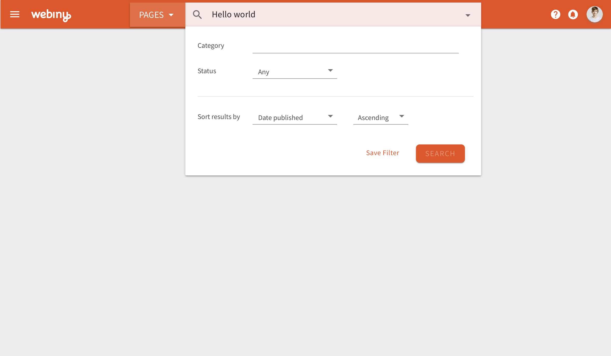
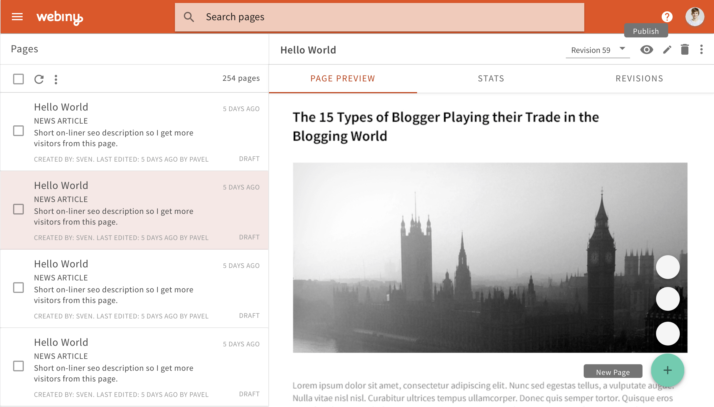
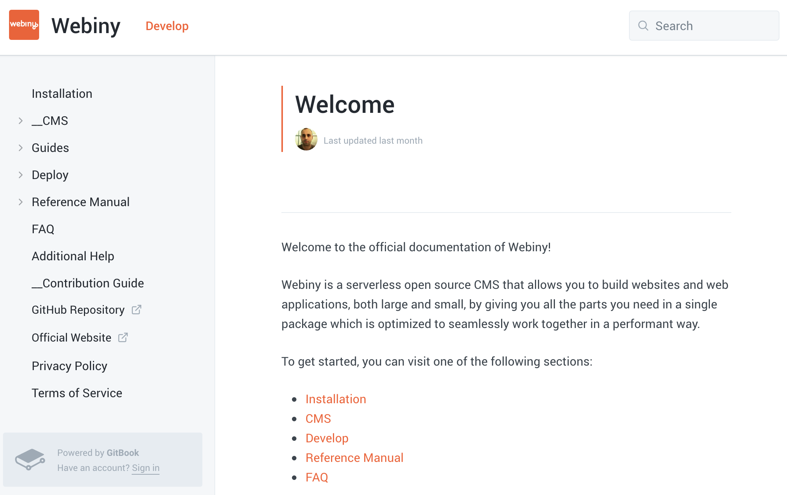

This summer has been hot, but so have been our seats, because we have been coding non-stop, creating cool new features and pushing pixels so everything is perfectly in place. Let’s dive bit deeper in some of the new highlights we have prepared for you.

### Update #1: Material Theme

From the last Google I/O conference I think many developers have been drooling around the latest [Material](https://material.io/) update. It features completely new design framework, with some detailed guidelines, as well as a revamped framework to integrate the components into your own React/Vue/Angular environment.

We at Webiny liked the update a lot, and one of the main reasons is the fact that components introduce a standard set of UI elements, as well as a ton of documentations on best practices, and guidelines how to use them. This simplifies how and when to choose a particular component, and ensures that the whole UI is following the same set of principles.

Having liked this update so much, we decided to revamp our admin design, and move completely to [Material Web Components](https://material.io/develop/web/). I can say that the UI now feels more lite, fluid and the user has a much better focus on the important elements on the page. Here is an early screenshot of how it looks:

### Update #2: Page Editor

The progress on our new page editor is coming along nicely. It’s one of the first page editors where you can insert React components directly into your page via a drag&drop interface. Imagine that you create for example a booking calendar React component. You can easily register that component as a plugin with our page editor, and then you get the option to drag&drop your component anywhere inside your page.

Additionally, we have worked hard to create a grid system that is flexible, but at the same time easy to use. We think you will like what we have in store there for you ;)

Plugins all around … the page editor app is essentially a set of plugins, everything from basic elements that you can place in your page, to elements that control borders, margins, background colors and so on, these are all plugins. Having such extendible system will allow you to fully customize how page editor will work. Here is an early preview version of the resize and grid options:

### Update #3: Webiny Hosted

As we were progressing with Webiny and installation scripts, we thought of what would be the best way, with least amount of friction, to give the users the option to try out Webiny. This eventually lead to conclusion that it would be beneficial to offer a hosted version of Webiny, where with just a few mouse clicks you will get your own Webiny instance on our cloud platform.

We will offer a free and a paid plan. The limitations will be mainly around the number of lambda executions and custom domains. On the free plan you will get a temp domain with SSL certificate, while on the paid option you can add your own custom domain, and we will give you a SSL certificate for free.

Another cool thing about the hosted model is that you can upload your own custom Webiny apps, and use the existing lambda bucket and you will have access to your own dedicated MySQL database. We manage everything for you, while you focus on your app and the business around it.

In addition to the hosted option, Webiny is still open source software, and you will be able to download the code and host it in your own environment.

### Update #4: Documentation

Oh boy, did we spend a ton of time coding Webiny, but now we are also focusing on giving you all the proper support in terms of documentation which will focus on both developers as well as a common user.

Developers will have a reference manual describing the implementation of most of the internal components, as well as guides how to build your own apps, plugins and themes. We are also working on a storybook documenting all of our React components.

Users will have common guides around how to use the page editor and Webiny CMS in general.

### Update #5: New Website

Finally we had some to focus on redesigning our website. We ensured that the copy is inline with our new direction and that it correctly messages back to developers the power and features of Webiny.

The new website will be launching in the upcoming weeks, as we come closer to our launch date, but here is a sneak peak:

And that’s all we had for this update. Hope you liked some of the things we presented, and in case of any questions or comments, please post them below.

To keep track of our progress, you can star/watch the repo on our github: [https://github.com/Webiny/webiny-js](https://github.com/Webiny/webiny-js)
