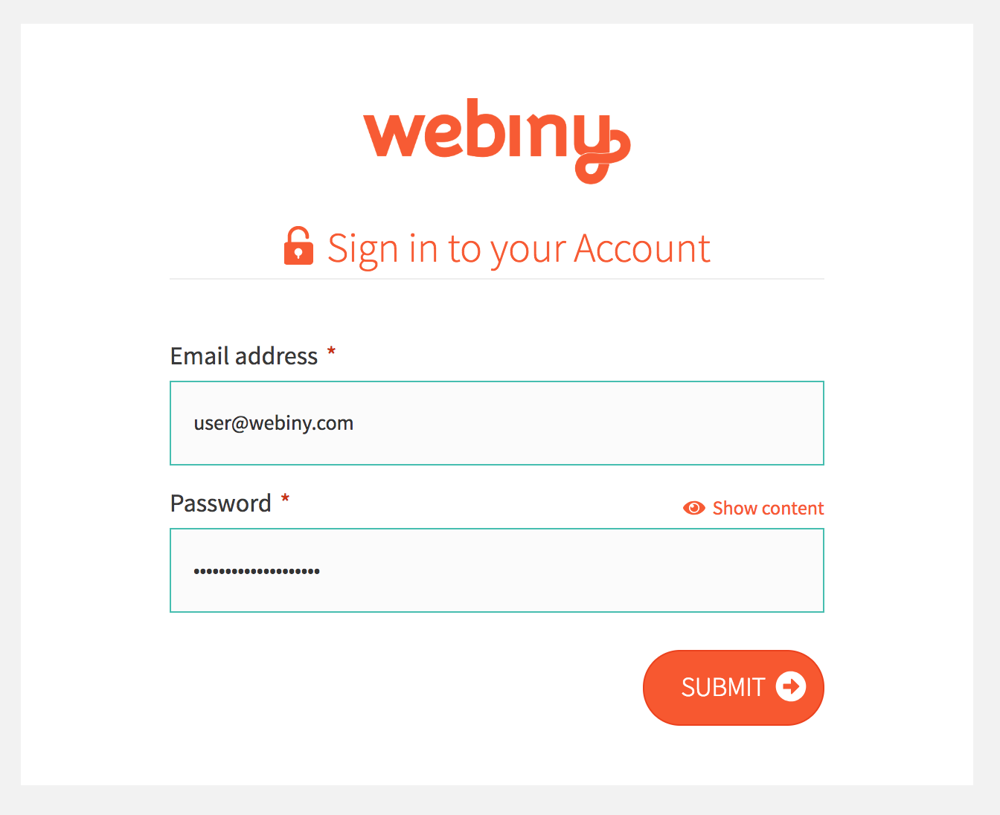

This month we bring another set of exciting updates we’ve made in the past few weeks. Our progress is slowly transitioning from backend, server-side components to frontend applications and some early CMS preview screens.

### Update #1: GraphQL

This one has been long-time coming. We noticed a growing trend of GraphQL in many different communities, but we never had the time to make a deeper dive into this technology, until now. What we found was that some of the features in our REST API layer worked in a similar way but, on the other hand, GraphQL additionally enriched those features and took them to the next level. Having that experience while testing it, we decided to move all of our components and current endpoints to GraphQL — and I’m happy to report that we are now 100% done with this milestone.

### Update #2: CMS

That’s correct, our CMS is slowly coming along. It’s written 100% in Javascript. The backend is powered by our set of Node.js components, while frontend is done via React. The early results show it’s going to be blazing fast, scaleable, and you can run it in a serverless environment.

There is still much more work to be done on the CMS side, such as theming, adding smart components like Mailchimp subscription forms, Stripe payment integrations, Google Maps, and many others. We plan to release an early version with just a few basic components and then move on to more advanced stuff.

If you wish to follow our progress, you can do that via GitHub: [https://github.com/Webiny/webiny-js](https://github.com/Webiny/webiny-js)

As we approach the stable release, we will populate the setup instructions.

### Update #3: CMS Theme

Each CMS requires a theme in which your pages will be rendered. Webiny CMS is designed for building websites and web applications. Webiny is not a blogging platform; therefore, the goal for our theme was for users to be able to create websites for their businesses, landing pages, app pages, and much more. A website is more demanding compared to a blog as it features many complex elements and visuals.

For our first theme we wanted something light in color but still rich in components, so we’ve created a theme with over 20 different components - from simple items like header navigation and sliders to more demanding ones like lists, contact forms, and calls to action.

### Update #4: Authentication

Although the previous version of our authentication layer supported login via a form using username and password as well as 2-factor authentication, we have now improved on that and, while we still support the same form and 2FA, now you can easily add additional authentication strategies, say login via Facebook, SSO, and many others. Adding a new authentication layer is as simple as registering a new middleware for your application. It’s super easy and super flexible.

Hope you’ve liked this update. Stay tuned for the next one and, in the meantime, keep track of our progress via GitHub. While your are at it, do give us a star if you like what we are doing; we’d appreciate it!

### [https://github.com/Webiny/webiny-js](https://github.com/Webiny/webiny-js)
