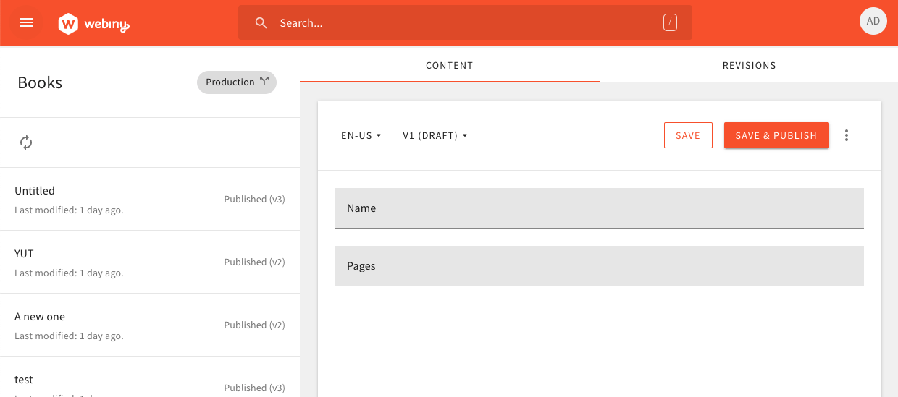

We launched the Serverless Headless CMS on June 5th.

It’s been a week since we launched our Serverless Headless CMS and now we did another release with lots of features and bug fixes. 🚀

We encourage you to join our [slack](https://webiny.com/slack) community team and show us your support by either [contributing](https://github.com/webiny/webiny-js/blob/master/docs/CONTRIBUTING.md) or [starring](https://github.com/webiny/webiny-js/stargazers)(★) our repository. This is what keeps us going!

## **New Contributors 👥**

As always, let’s start the update by giving a shout out to our new contributors 👏

Kudos to these wonderful people:

- [Afzal](https://github.com/afzalsayed96) ([#1010](https://github.com/webiny/webiny-js/pull/1010))
- [Jon](https://github.com/jmrapp1) ([#954](https://github.com/webiny/webiny-js/pull/954))
- [Alex](https://github.com/asashay) ([#941](https://github.com/webiny/webiny-js/pull/941))
- [Boyuan](https://github.com/boyuan459) ([#948](https://github.com/webiny/webiny-js/pull/948))
- [Sundeep](https://github.com/sunguru98?tab=overview&from=2020-03-01&to=2020-03-31) ([#897](https://github.com/webiny/webiny-js/pull/897))
- [Jeremy](https://github.com/Jeremytijal) ([#788](https://github.com/webiny/webiny-js/pull/788))
- [Maxim](https://github.com/Arvisix) ([#750](https://github.com/webiny/webiny-js/pull/750))
- [Ahmad](https://github.com/ahmad-reza619) ([#775](https://github.com/webiny/webiny-js/pull/775))

## **Get Involved 🤝**

We encourage everyone to get involved and contribute, regardless of their experience level. Take a look at our [contributing guide](https://github.com/webiny/webiny-js/blob/master/docs/CONTRIBUTING.md) and if you still run into problems, just give us a ping on [Slack](https://www.webiny.com/slack), we are here to help you! 🚀

Moving on, let’s take a look at this release’s changelog!

## **Features 📦**

#### Support for layers in all AWS regions.

In previous versions, when you deployed your API, there was one really large resource (~25MB). It was an Image Transformer (part of the File Manager app) which depends on the `sharp` library to manipulate images. This caused serious problems to users with slower/unstable internet connection. So we came up with a little package that contains AWS Layers you can simply link to your Lambda functions. We host those layers for you in multiple AWS regions, so you don’t have to worry about it. This greatly increased the deployment speed and removed the problem for slower connections.

#### Create a default AWS IAM Role

The other problem, and the main reason for slow deploys, was the fact that each Lambda was creating its own IAM Role. Now we deploy one single role, with the policy you can control yourself, and we simply link it with all the Lambda functions. This thing alone cut down deploy time by 50%!!!

#### Introduced File Manager settings (**[#954](https://github.com/webiny/webiny-js/pull/954)**)

Upon uploading files, by default, the File Manager app uses 25 MB as the max file size, and if that wasn’t enough, you couldn’t increment the limit in an easy way. But, thanks to [jmrapp1](https://github.com/jmrapp1), you can now set the minimum and maximum file upload size directly from the newly added File Manager settings.

### **Headless CMS**

#### Improved content entries form (**[#1004](https://github.com/webiny/webiny-js/issues/966)**)

Instead of a single “Save” button in the form footer, we’ve created dedicated “Save” and “Save & Publish” buttons, and placed them in the form header. Having two separate buttons is more clear to the user, and also, having them in the header is more practical, since the header is now always visible, even if you scroll to the bottom of the form.

#### Lists of rich texts and dates and times (**[#977](https://github.com/webiny/webiny-js/pull/977), [#973](https://github.com/webiny/webiny-js/pull/973)**)

You can now have a “multiple values” setting enabled for both Rich Text and Date/Time fields.

#### Searching of content (**[#1009](https://github.com/webiny/webiny-js/pull/1009)**)

Via the header search bar, you can now easily search all of the created content. Just type in your query, select the content type, and press Enter. The search will automatically be performed across all content of selected content model type, including all available locales.

Hint: you can always bring up this search bar using the “/” shortcut.

## Bug Fixes🐞

With the help of one of our community members, [Rahul Suresh](https://www.linkedin.com/in/rahulsuresh98/), we managed to squash a very annoying bug with Security installation and password validation. Thank you for spending your weekend with us Rahul!

#### Headless CMS

Along with the above-mentioned improvements, we also managed to get some bug fixes resolved as well. For example, deleting a content model will immediately refresh the GraphQL schema as expected ([#988](https://github.com/webiny/webiny-js/pull/988)). Model and field names starting with a number will immediately be rejected ([#988](https://github.com/webiny/webiny-js/pull/988) — same PR) because otherwise, the GraphQL schema would become invalid. It’s also worth mentioning that content model fields get automatically unlocked once there are no existing content model entries in the system anymore ([#978](https://github.com/webiny/webiny-js/pull/978)). This enables the user to change or remove content model fields that are no longer in use or ended up in the model by mistake.

## Documentation 📚

- We created a [Headless CMS section](https://docs.webiny.com/docs/webiny-apps/headless-cms/features/content-modeling). You will find all the new features of our Headless CMS.
- Lots of guides on using our Headless CMS with [Gatsby](https://docs.webiny.com/docs/guides/headless-gatsby-tutorial), [React.js](https://docs.webiny.com/docs/guides/headless-react-tutorial), [Angular](https://docs.webiny.com/docs/guides/headless-angular-tutorial), [Vue.js](https://docs.webiny.com/docs/guides/headless-vuejs-tutorial), [Next.js](https://docs.webiny.com/docs/guides/headless-nextjs-tutorial). You can find the [Examples repo](https://github.com/webiny/webiny-examples) on GitHub.

## Try the Latest Release ⬇️

You can create a new project using the [regular procedure](https://docs.webiny.com/docs/get-started/quick-start) or **upgrade** your existing `v4.0.2` projects by using our handy upgrade tool. See the instructions in the [Github Release](https://github.com/webiny/webiny-js/releases/tag/v4.1.0).
