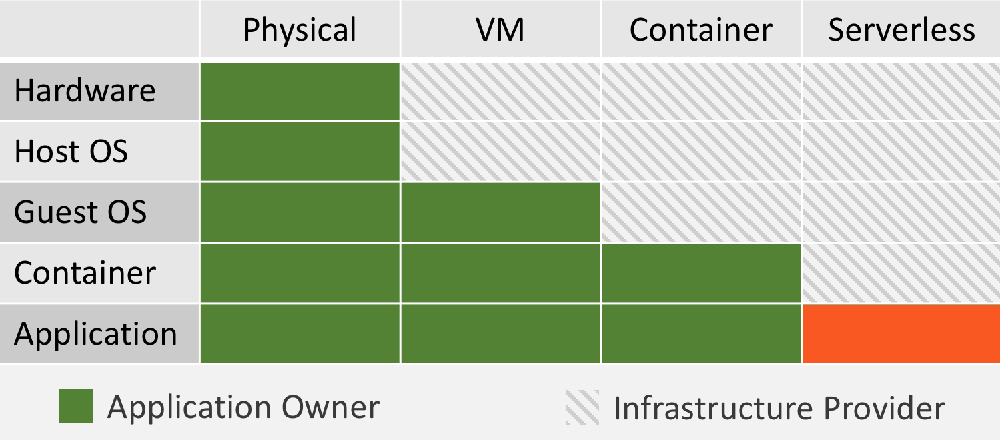
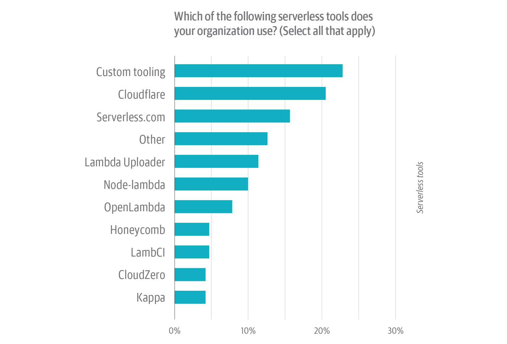

Ever wondered what it might mean for your business or organization to adopt serverless? Not so much from the technical perspective, but more from a business perspective. How could serverless help move your business faster and outpace competitors?

In this article, I'll go through several of those reasons, the theory behind them, how the theory might not work in practice, and what it takes to actually takes to extract the full benefits from serverless infrastructure.

## Serverless basics

There are more or less 4 basic premisses to serverless offerings:

1. No servers to manage
2. Automatic scaling
3. Consumption-based pricing
4. Faster product iteration

These 4 benefits when combined can make a big difference to your business. Let's look at how that might work.

## Serverless - in theory

Starting with the obvious one. Because of the consumption-based pricing, you essentially stop paying for things like server idle time or any resources you have that you are not utilizing 100%.

Deloitte made a research article comparing the cost of an identical application running on VMs (EC2) and on serverless. It showed that in "practice" you can save anywhere between 60% and 80% on cloud infrastructure costs.

  Source: Deloitte Consulting - Determining the Total Cost of Ownership of Serverless Technologies
  when compared to Traditional Cloud

So the theory is that if you combine the 80% of savings in the cloud infrastructure cost and the 60% of savings in terms of the maintenance cost, you will have a significant part of the budget that can now be reinvested. If you decided to reinvest this budget into hiring more engineers, you will be able to develop your products much faster. This will bring many of your innovations to the market sooner, which will drive the adoption of your product. Essentially, you now have the potential to move faster than your competitors due to serverless.

Now, let's look at the practical side.

## Serverless - in practice

If we look at this graph (and there are many similar ones across the internet) it shows the evolution of infrastructure. Over the years, the complexity of running your applications has been gradually reducing. And now with serverless, you finally don't need to worry about anything except your own application code.

But there is also one key difference between the first 3 infrastructure types and serverless. The first three were building upon each other and were compatible. This means that an application that runs on physical infrastructure can also run on VMs and containers. However, that same application can't run on serverless infrastructure.

Serverless infrastructure requires that the application is specifically architected and coded for such an environment. This makes adopting serverless extremely difficult for existing solutions that just want to change their underlying infrastructure.

You might say, "but I'm building a brand new application". True, but if you haven't built a serverless application before, all the experience you have fits into the green boxes, and not in the red ones. It means you will need to learn a lot of new stuff.

A <ExternalLink href="https://devops.com/why-organizations-are-adopting-or-avoiding-serverless/">survey by O'Reilly on 1500 respondents</ExternalLink> emphasizes this point. It shows people are concerned with the security aspects of serverless, mainly because they don't understand how serverless works. Educating current staff is stated as one of the major reasons organizations are not adopting today. Finally, the number #1 tooling organizations used to adopt serverless is custom tooling. Meaning they have to make investments into tooling just so they can start working on their project. There is also cost involved with that, as the tooling needs to be maintained afterward.

  O'Reilly - Why Organizations Are Adopting or Avoiding Serverless

What this means in practice is that building serverless applications can come at a much higher cost. The cost of this custom tooling approach can in fact be so significant that it can eliminate all the savings from switching to a serverless approach. And for this reason, many organizations have decided to delay their migration to serverless.

So is there a way around these serverless challenges?

## Webiny - Unlock the serverless benefits

#### **What is <ExternalLink href="https://www.webiny.com?utm_source=Webiny-blog&utm_medium=webiny-blog&utm_campaign=webiny-weekly-blog-feb-08&utm_content=webiny-website&utm_term=W00524">Webiny</ExternalLink>?**

Webiny is a suite of open-source solutions that consists of a <ExternalLink href="https://www.webiny.com/serverless-application-framework?utm_source=Webiny-blog&utm_medium=webiny-blog&utm_campaign=webiny-weekly-blog-feb-08&utm_content=webiny-serverless-application-framework&utm_term=W00522">Serverless Application Framework</ExternalLink> and a <ExternalLink href="https://www.webiny.com/serverless-cms?utm_source=Webiny-blog&utm_medium=webiny-blog&utm_campaign=webiny-weekly-blog-feb-08&utm_content=webiny-serverless-cms&utm_term=W00523">Serverless CMS</ExternalLink>.

The framework is specifically created for building applications on top of the serverless infrastructure. It solves all the serverless complexities and challenges, it's fully documented and contains all the libraries you might need to build your serverless application. It enables your team to build serverless solutions in a standardized approach, which makes it easy to learn and understand. Your team will immediately be able to focus on your business logic, and zero time will be wasted on battling serverless complexities.

The framework comes with a GraphQL API, Admin UI, ACL, CLI for deployment and scaffolding, IaC support, and much more. Today it supports AWS cloud, but in the future, support for additional clouds will be added.

The Serverless CMS uses Lambda functions, API Gateway, DynamoDB, and S3. It's built using the Webiny framework. It scales automatically together with the demand, requires zero maintenance, and costs a fraction when compared to solutions running on virtual machines. It includes a headless CMS with a GraphQL API, asset management, and a no-code builder for static pages and forms. It takes 2 commands to install and configure the whole thing. For SaaS and multi-website requirements, there is multi-tenancy that's built-in.

As one of the co-founders of the project, I've been building and dealing with serverless infrastructures for the past few years. I have talked to over 200 companies that have struggled with adopting serverless, or are planning to adopt it, but don't know where to start. We have built Webiny and made it <ExternalLink href="http://github.com/webiny/webiny-js?utm_source=Webiny-github&utm_medium=webiny-blog&utm_campaign=webiny-weekly-blog-feb-08&utm_content=webiny-github-webiny-js-repo&utm_term=W00525">open source</ExternalLink> to remove those challenges and fears as we believe serverless is the future of development and that it can make a positive impact on many organizations.

Give it a try and let us know what you think: <ExternalLink href="https://www.webiny.com?utm_source=Webiny-blog&utm_medium=webiny-blog&utm_campaign=webiny-weekly-blog-feb-08&utm_content=webiny-website&utm_term=W00524">webiny.com</ExternalLink>
