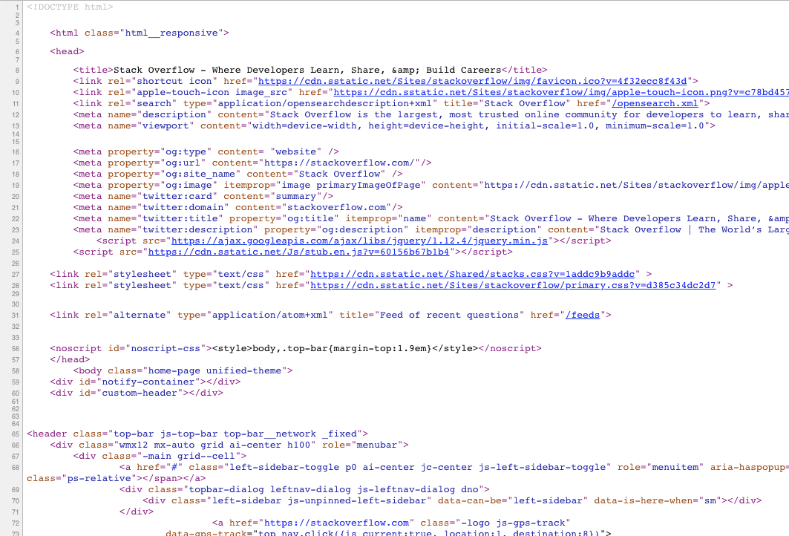
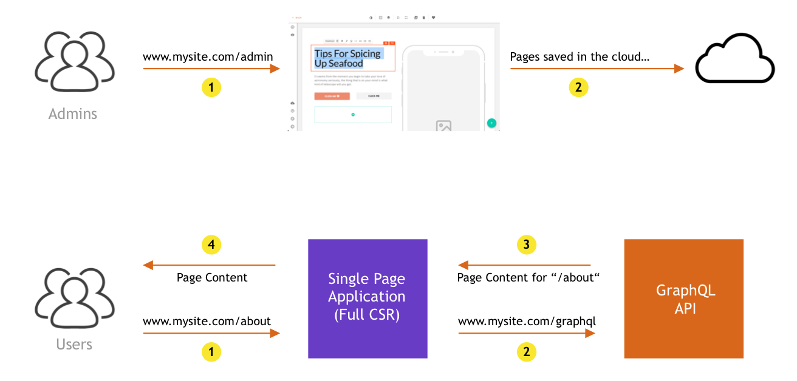
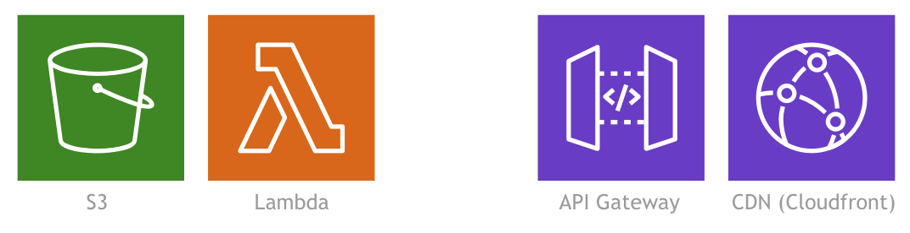
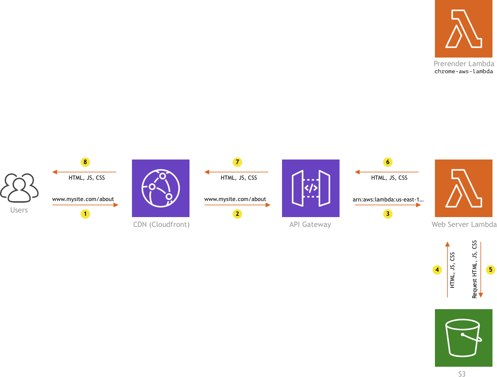
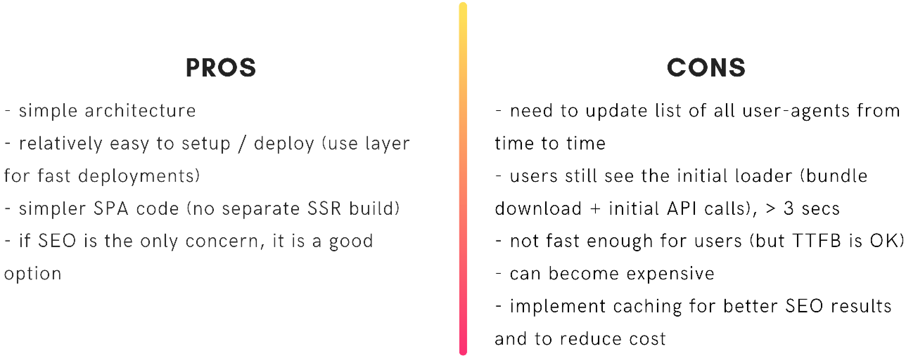
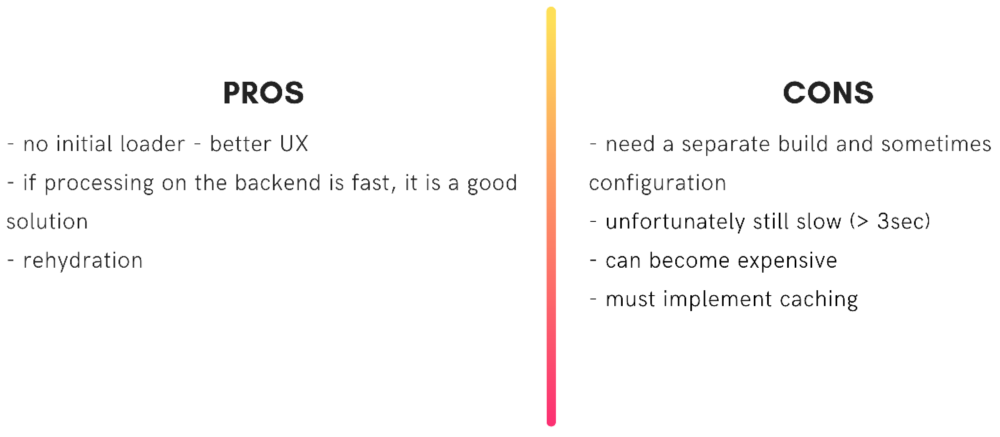
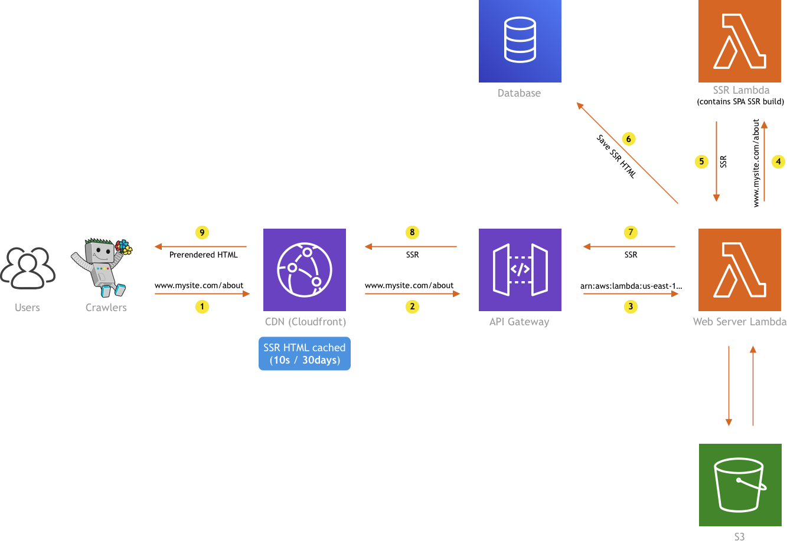

## TLDR

I do realize this turned out to be a very long article and trust me, that wasn’t the intention. As I do understand some of you might not have the time to read it in its entirety, here’s a short TLDR I prepared:

- single page applications (SPAs) are cool but unfortunately, have bad SEO support
- learn about different approaches of rendering on the web by checking out [this Google article](https://developers.google.com/web/updates/2019/02/rendering-on-the-web), and choose the approach that works best for your use case
- for the Webiny Page Builder app, we decided to try “Prerendering on-demand” (using `chrome-aws-lambda`) and “SSR with (re)hydration”
- implementing both of these approaches in the AWS cloud can be achieved with just a couple of serverless services — S3, Lambda, API Gateway, and CloudFront
- prerendering on-demand works and it’s a good approach if the initial loading screen (shown while the app is initializing) is not an issue in terms of UX, and SEO is your only concern, otherwise use SSR with (re)hydration
- allocate more RAM (1600MB+ ) to the Lambda function that will actually be doing the pre-rendering, and a minimum amount of RAM to the one that will be just serving static files (128MB or 256MB)
- although we didn’t try it, you would probably need to implement some form of caching of the prerendered content, so that you get a better SEO results by returning the initial HTML faster
- when implementing SSR with (re)hydration, allocate more RAM to the Lambda function that will actually be generating the SSR HTML
- in general, SSR is a resource-intensive task, which will prevent you from serving your website fast enough, so you will most likely need to implement some kind of caching
- we used CloudFront CDN to cache SSR HTML and depending on the app you’re building, choose between short and long-lived cache TTLs
- if going with the latter, know that you will need to do cache invalidation which can get tricky very quickly
- do cache-invalidation selectively, or in other words, if possible, invalidate cache only for pages that actually require it — this may save you significant amount money along the way (cache invalidation requests are charged by CloudFront)
- if the content is changing very frequently, use shorter TTLs because it’s more effective
- the good news is that, with [Webiny](https://www.webiny.com/), this is all handled and maintained for you, feel free to check us out if this sounds interesting 🚀 🙂

So, this was the TLDR, but still, if you want to dive deeper into the topic, or maybe you just want to check out the serverless approaches and implementations we’ve tried, I encourage you to continue reading.

---

## Serverless Side Rendering

Here at [Webiny](https://www.webiny.com/), we’re on a mission to create a platform that empowers developers to build serverless apps. In other words, we want to provide developers with proper tools and processes, in order to make the development using serverless technologies easier, more efficient and enjoyable. On top of that, we also want to build an eco-system of plugins and even ready-made apps, which will additionally cut development time and cost.

Regarding the apps, out of the box, Webiny actually offers a couple of base apps that developers can utilize, one of which is our Page Builder app. I won’t bother you much with it, nor is this a promotional article, but I will feel free to say that we’ve worked on it for quite some time now (and will remain to do so). And while there were a lot of challenges we faced along the way, definitely one of the more interesting ones was serving pages to users in the best possible way. In other words, serving pages as fast as possible, and of course, with excellent support for search engine optimization (SEO).

To achieve this, not only did we want to utilize the serverless technologies (duuuh 🙃), but also the modern single-page application (SPA) approach for building web sites and apps. But as it turned out, it can be pretty tricky to achieve and use all of the mentioned at the same time.

SPAs are cool, but they have one serious disadvantage - bad SEO support, which comes from the fact that they are completely client-side rendered. This means we cannot completely rely on the client-side rendering (CSR) to render our app — some form of server-side rendering (SSR) must be implemented too. But how do we do that? Even more importantly, how do we do something that was “traditionally” done with servers, in a serverless environment? How do we achieve “serverless-side rendering”?

I may have tossed a lot of information straight at the beginning of this article, but these are the things you’ll definitely need to examine if you want to have a modern, fast, scalable, and SEO-optimized single page application, which is what we wanted to provide for our users.

In this article, I wanted to go over a few of the approaches we’ve tried to implement and show you what was the solution that in the end worked best for us. You will see that there isn’t a silver bullet solution and that the one you choose will depend on the app you’re building, and the requests and conditions that are in front of you.

Since there are a lot of moving parts, and in order to get the full picture, I decided to take a step back and start from the beginning.

First, let’s say a few words about single-page applications!

## Before we begin

As mentioned, we will start off by saying a few words about single-page applications. We will cover their main features, advantages/disadvantages, and in general, we will also talk a bit about different rendering approaches on the web. If you came here for strictly serverless stuff, or you already have enough experience working with SPAs, feel free to jump to the **What to choose?** section, in which we will explain which rendering approaches we decided to try, and then how we’ve implemented them in a serverless environment.

Although we do plan to explore other cloud providers, at Webiny, we are currently working mostly with AWS, so the implementations you’re about to see will be specific to it. But if you’re not using AWS, I still think you should be able to follow this article and build everything in your cloud, using similar services.

## Single Page Applications

If you are a web developer, I’m pretty sure you’re familiar with the concept of single-page applications (SPAs). But let’s quickly go over a few of its main features and advantages.

### **Client-side Rendering (CSR)**

The main feature of every SPA is client-side rendering (CSR). This means that all of the UI (HTML) is generated inside the user’s browser, and not on some sort of backend (servers, containers, functions, whatever… ¯\_(ツ)\_/¯). The coolest thing about this is that there are no page refreshes, meaning when you navigate to a different place in your app, only a portion of the page gets re-rendered, without the full page refresh. This generally produces a much better UX.

### **Cleaner code**

If you’ve ever worked with PHP, especially in the old days, you’ll probably remember those long Smarty / Twig template files, containing HTML, CSS, JS, maybe a couple of `if` statements, probably a call or two to the database, and who knows what else. One big mess if you ask me. 🤯

With SPAs, the overall app code gets cleaner. This time we have two separate codebases, one that represents the actual SPA, and the other that represents the backend or the API, to which the app connects.

### **Easy to serve**

SPAs are easy to serve, especially in serverless environments. Once you’ve created a production build of your app, the only thing that’s basically left to do is upload it to a static file storage of your choice, for example, the Amazon S3. And if you want your app and static assets to be served super-fast, introducing a CDN to your backend architecture is also a relatively easy step to execute. That being said, if your app is relying on an API, note that the app will be as fast as is your API. If it’s slow, the SPA will also be slow, despite it being served super fast.

## Drawbacks?

As seen, SPAs do possess some really nice features. But of course, the approach has its own drawbacks. I’m about to explain the biggest one in the following few sentences.

Whenever you’re creating a public-facing website (SPA or non-SPA), you’d obviously expect to have link previews. In other words, when you share a link that points to your website on the internet, eg. social media site like Facebook, you’d expect to get a preview like this one:


But if you’ve never worked with SPAs before, instead of a full link preview, you might receive something like the following:


Nothing is being shown, just a plain URL for both the link title and link description. But why is this happening? 🤔🧐


Naturally, you begin to inspect your code, and soon, you end up looking at the `index.html` that is initially served when somebody or something visits your website:


As we can see, there isn’t much going on in this document. We only have a few basic HTML tags and a few links that point to the website’s JavaScript and CSS files. And this is to be expected because this initial HTML document is actually a part of our app’s production build. In other words, this document is not dynamically generated, but statically served every time the user visits our web site.

This is a crude list that shows steps that are happening, once a user enters the URL of a SPA-powered website into the browser:

1. Initial SPA HTML is downloaded.
2. The download of files begins (CSS, JavaScript, images, …).
3. Once the JavaScript has been downloaded, it gets executed, which usually means the beginning of SPA initialization, initial data fetching, and initial UI rendering.

But what happens when the web crawler like e.g. Facebook’s web crawler visits the site?

Well, it reaches the step one, and that’s pretty much it. Unlike regular users, web crawlers do not wait for the SPA to be fully initialized and then fetch the generated HTML. They will only analyze the HTML that was initially served to them, and that’s it. And this is the reason why Facebook’s web crawler doesn’t generate a complete link preview - the initial content simply doesn’t contain enough information.

But social media web crawlers are not the only issue here… more importantly, what about search engine crawlers and SEO?

Although search engines are working on solutions that might do a better job of interpreting SPAs, to this day, we still cannot completely rely on these solutions. I’ve actually seen a couple of examples where introducing SPA’s significantly reduced SEO quality results, for example:

https://twitter.com/mxstbr/status/985188986414161921

Oh, man… Imagine yourself working on a project for three months, and right before the launch, you realize you have no SEO support at all.


https://twitter.com/doitadrian/status/1103366565746167809?

## How to deal with this?

To this day, there’s basically only one way to fix this issue confidently, and that’s by serving meaningful HTML to web crawlers. In other words, when a web crawler visits your site, initially served HTML must contain things like page title, appropriate meta tags, the content (body) of the page, and so on. For example:



But what would be the best approach to achieve this? Do we need a server that will dynamically generate HTML on each page request? Or are there other approaches we can use?

Well… this brings us to our next topic: rendering on the web.

## Rendering on the Web

There are actually a couple of ways to render apps on the web. A very useful resource, that I’ve seen referenced a couple of times, is this article, called “Rendering on the Web”, [officially hosted on Google blog](https://developers.google.com/web/updates/2019/02/rendering-on-the-web). The document can help you get a good overview of different rendering approaches, and also give you information on all of the pros and cons of each one.

At the end of the article, we can find a very nice summary of all rendering approaches that we can utilize today:


As you can see, the summary is packed with useful information. Let’s quickly go over each one.

### Full CSR

We’ve already seen this approach previously. The backend returns a simple HTML, after which the app initialization happens in the user’s browser. Not great for SEO, but if you’re building something that doesn’t require it, like for example an admin UI, then it is still a good approach.

### CSR with Prerendering

If you’ve ever worked with [Gatsby](https://www.gatsbyjs.org/), you’re probably familiar with this approach. Basically, once we’re ready to deploy your website, we start a build process, which generates all of our app’s pages in advance, which can then be uploaded to static file storage, e.g. the Amazon S3.

Since built pages contain complete HTML and nothing is dynamically generated, the app will be served super fast, and most importantly, will possess excellent SEO support.

The catch of this approach is that, whenever you need to make a change, even if it is a small one, you need to completely rebuild everything from scratch, and on larger projects, this can take time. So if you’re making changes often, this probably won’t be a super convenient approach for you.

### Server-side Rendering (SSR) with (re)hydration

In this approach, we dynamically generate HTML on every initial page request, server-side. Notice the word “initial” here. What we meant by that, is that the server-side HTML generation will happen only on the initial page request, e.g. when the user enters the URL into the browser, or when the user does a full page refresh. The interesting part is that, after the initial HTML is received, a full CSR SPA is initialized, meaning all of the HTML from that point in time will be generated in the user’s browser, thus still creating a great UX. This approach is also referred to as the “isomorphic rendering”.

Sounds awesome, but do note that in this approach, you actually need to create two separate production builds of your app, one that will still be served to and executed in the user’s browser, and the other that will be executed on the backend to dynamically generate the actual HTML. The reason for creating two builds is different environments — running browser code in NodeJS backend simply doesn’t work (and vice versa).

Although SSR can sometimes be non-trivial to set up, once you learn a few tricks, you should be OK (setup yes, performance is a whole another thing). Using frameworks like for example [Next.js](https://nextjs.org/) can significantly save you time in doing so.

### Last two — Static SSR & Server Rendering

Static SSR, as highlighted, includes JavaScript removal in the build process and it’s used to serve plain static HTML pages. If JavaScript removal is acceptable for your particular use case, then this approach might be useful to you.

The last one, pure server rendering, doesn’t belong to the SPA category since it doesn’t rely on any client-side rendering at all. HTML is always returned from the server, and navigating through your app assumes a complete page refresh. It’s basically the exact opposite of the Full CSR we’ve explained first.

## What to choose?


The summary shown above can definitely help us in choosing the right approach to render our app. But which one should we use?

Well, it depends on the app you’re building, or in other words, on specific demands and requirements that are in front of you. If you have a simple static website, then CSR with prerendering is definitely a good choice. On the other hand, if you’re creating something more dynamic, then, depending on your SEO needs, you might want to go with SSR with (re)hydration or a simple full CSR SPA.

So, doing a quick analysis of your app will certainly help you in choosing the right approach, which is exactly what we did at Webiny, in order to improve our Page Builder app.

## The Page Builder

The following diagram, on a high level, shows how Webiny Page Builder initially worked:



So, in the upper diagram, we have admin users that can, via the admin UI, create new or edit existing pages. The whole admin interface is a full CSR SPA (created with popular [create-react-app](https://github.com/facebook/create-react-app)), and there’s nothing wrong with that. 👍

On the lower diagram, we have a public-facing website and regular users, to whom we also served a full CSR SPA. Nothing super advanced here — basically once the app has initialized, via the GraphQL API, the app would fetch the content that needs to be shown for the user’s current URL, and that’s pretty much it.

Of course, as we’ve learned, for the public-facing app, the Full CSR approach won’t be good enough, because public pages must have SEO support. There’s just no way around it. So the time has come to consult the Rendering on the Web document and try to pick the best approach for the job.

## What we’ve chosen?

Because the Page Builder is dynamic in nature, meaning once a user hits the publish button in the editor, the page must go live immediately (and of course be SEO compatible), we’ve chosen the third approach, and that’s SSR with (re)hydration.

But, because we knew that, at the time, our codebase would require a significant amount of changes for it to work, we actually had one more idea that we wanted to try first. What if we could, from the backend, visit the URL, as if the regular user did it, and return that whenever a web crawler is making a request? You know, just simulate the regular user, wait for the full UI to be generated, take the final HTML, and just serve that? For the regular users, nothing would change, we would still serve them a regular SPA, because, in reality, users don’t care what HTML they initially received from the backend (actually it turns out it _does_ matter, more on this in the following sections).

That could work we thought, so we tried it. We’ll call this approach “prerendering on-demand”.

So to summarize, we’ve decided to try the following two approaches:

1. prerendering on-demand
2. SSR with (re)hydration

Let’s see how we’ve implemented these rendering methods in a serverless environment, and of course, which one gave better results.

As mentioned, please note that as we’re currently only working with AWS cloud provider, the implementation will be specific to it. But if you’re hosting your app on any other cloud, I believe you should still be able to achieve the same thing, using similar services that your cloud provider provides.

All right, let’s take a look!

## Prerendering on demand

To implement prerendering on demand, we used the following AWS services:



So, we used a single S3 bucket that would host the production build of our SPA, a couple of Lambda functions, and finally, API Gateway and CloudFront to make everything publicly available on the internet and enable proper caching, respectively.

For this, we also used the `chrome-aws-lambda` library, which is basically a (headless) browser that we can programmatically control inside of our Lambda function. We will use it to visit the URL that the web crawler requested, wait for the SPA to be fully initialized, grab the final HTML that was generated, and finally return the output to the web crawler.

For starters, let’s see what happens when a regular user visits a page.

### Regular users



When a regular user visits the site, the HTTP request is redirected over the CloudFront to the API Gateway, which will invoke the `Web Server Lambda`. We gave it that name here because, in a way, it actually acts as a regular web server — based on a received invocation payload (HTTP request), it serves requested static assets (JS, CSS, HTML, images, …) from an S3 bucket. A few extra capabilities of this function are sending proper caching response headers when a static asset was requested, and the detection of web crawlers, for which we used the`isbot` package.

So, if a regular user made the HTTP request we simply return the requested file, by fetching it from the S3 bucket and sending it back as an invocation response to the API Gateway, which will then return it to the CloudFront.

What happens when a web crawler visits the site?

### Web crawlers

In this case, the HTTP request again reaches the `Web Server Lambda` over CloudFront and API Gateway, but instead of fetching the file from S3, we are invoking the `Prerender Lambda`, which internally utilizes the mentioned `chrome-aws-lambda` library to fetch the complete HTML for the requested URL.


There are a couple of things to note here, and the first one is that the `chrome-aws-lambda` can become expensive to run because it requires a significant amount of resources. The library’s docs state that a minimum of 512MB of RAM should be allocated, but also suggests to allocate 1600MB or more. This is the reason we didn’t put all of the logic into a single Lambda function (into the `Web Server Lambda`). The `Prerender Lambda` function will only get invoked when a web crawler visits the site, which is less frequent than visits from regular users. For serving simple static assets for regular users, a Lambda function with basic 128MB or 256MB of RAM will suffice, and thus save us some money along the way.

While we’re here, here’s a couple of tips regarding the `chrome-aws-lambda` library as well. Configure it in a way so it does not download the resources that don’t produce the DOM, like CSS and images. You don’t need to load these in order to get the complete HTML. This will speed up the HTML fetching process significantly.

Also, to make your deployments easier, you can also utilize the `chrome-aws-lambda-layer` library, which basically lets you attach a public Lambda function layer that contains all of the necessary code, to your function. This means you won’t have to upload all of the code (and the Chromium binary) by yourself. You can reference this layer super-easy via the Lambda Console or even better, using the Serverless framework. The following `serverless.yaml` shows how to do it (note the `layers` section inside of the `preRender` function):

```
service: mySiteServiceprovider:  name: aws  runtime: nodejs10.xfunctions:  preRender:    role: arn:aws:iam::222359618365:role/SOME-ROLE    memorySize: 1600    timeout: 30    layers:      - arn:aws:lambda:us-east-1:764866452798:layer:chrome-aws-lambda:8    handler: fns/my-server/index.handler
```

Note: for a full production environment, you might also choose to build the layer yourself, giving you much more control and better security posture.

### The results

All of the pros and cons are shown in the following image:



The most important thing to note here is that, although we’ve managed to achieve good SEO support, we were unfortunately faced with a serious speed / UX issue.

Because the user is still receiving a full CSR SPA, on each request, he has to wait for the initial assets (JS & CSS) and also page data to be loaded. While this is happening, the user is presented with a loading screen, and basically, every time the user visits a page, he will be looking at it for 1–3 seconds, which is definitely not a great UX, especially if we’re talking about showing simple static pages. It is slow, simple as that.

Even though we’ve tried a few things to improve on this, ultimately we couldn’t get it to work in a way that would satisfy our goals, so the prerendering on-demand idea was discarded.

But have in mind that if the loading screen doesn’t pose a problem for your app, this can still be a valid approach to implement. I personally like this solution because, unlike with the SSR with (re)hydration approach, this one is more simple to maintain, because it doesn’t require two separate app builds.

Let’s see how we’ve implemented the SSR with (re)hydration approach now!

## SSR with (re)hydration

For this implementation, we actually used the same services we already used in the prerendering on-demand implementation.


But of course, the diagram will be a bit different:


Before we explain how it all works… Remember when we mentioned that the SSR with (re)hydration approach requires us to generate two production builds of our SPA? One that is served to and executed in the browser, and the other one that’s actually executed on the server? Right, but where are these stored?

The build that will be served to the user’s browser is no different than the one we used in the previous, prerendering on-demand, approach, and in the same way, we stored it in a simple S3 bucket. Note that, as in any SPA build, this one contains not only JavaScript files, but also CSS files, images, and other static assets that might be required by your site. On the other hand, the SSR build doesn’t contain all of that, it only contains a single JS file, with minified code in it, and because of this, we decided to bundle it directly into the `SSR Lambda`. As the file was ~1MB in size, we did not consider this as a possible performance issue. Alright, back to the diagram!

This time, the flow for both users and web crawlers is the same. CloudFront receives and forwards the HTTP request to the API Gateway, which invokes the `Web Server Lambda`, which then decides whether it must pull the file from the S3 bucket or it must invoke the `SSR Lambda.` The routing is simple — if the request doesn’t point to a file (we check for the existence of file extension), `Web Server Lambda` will forward the request to the `SSR Lambda`, which will, of course, generate the HTML that needs to be returned to the visitor. And on the other hand, if a static file is being requested, it will just be pulled from the S3 bucket. As mentioned, this is no different from the previously seen prerendering on-demand approach (when a regular user visited the site).

So, what are the results of this approach?

### The results



The interesting this is that, even though we’ve managed to resolve the SEO compatibility issue with the previously shown prerendering on-demand approach, we did experience slow page load speed, which can be very bad UX-wise. And unfortunately, with the SSR with (re)hydration approach, it’s no different.

While with the prerendering on-demand approach, the users had to stare at the loading screen until the app has been fully initialized, here, they are again waiting for the same amount of time, but this time, they are staring at a blank screen, waiting for the backend to return the SSR HTML.

Why the wait you might ask yourself? Well, it’s pretty logical. It’s because all of the processing that was previously happening in the user’s browser (behind the loading overlay) is now happening on the backend, inside of the `SSR Lambda`function. More importantly, out of the box, server-side rendering is a resource-intensive task, so it takes time to generate the whole HTML document. Pair that with the additional latencies that the function cold starts might add, and you’re guaranteed to have a bad time.

When you look at it, now that the user is staring at the blank screen instead of a nice loading overlay we had before, we’ve actually managed to make the UX even worse!


## SSR HTML Caching

Even though we’ve tried to increase the amount of system resources for the `SSR Lambda` function, that still didn’t have a positive enough effect on the overall performance. In the end, in order to speed things up, we decided to introduce caching. There were a lot of different solutions we tried, but in the end, we settled with the two I’m about to explain the following sections.

For both, the only addition to the whole cloud architecture is the database, which we’ll use to cache the received SSR HTML. It can be any database you like, we decided to go with the MongoDB since we were already relying on it so much. But yes, you can use DynamoDB or Redis for the job, those are definitely good alternatives.

## Solution 1 — short cache max-age (TTL)

The diagram is almost the same as the one we’ve seen in the previous section, except now we have a database:


So, every time the `Web Server Lambda` receives the SSR HTML from the `SSR Lambda`, before returning it back to the API Gateway, we also store it in the database. A simple database entry might look something like this:

```
{
  "_id" : ObjectId("5e144526b5705a00089efb95"),
  "path" : "/",
  "lastRefresh" : {
    "startedOn" : ISODate("2020-01-07T13:13:48.898Z"),
    "endedOn" : ISODate("2020-01-07T13:13:52.373Z"),
    "duration" : 3475
  },
  "content" : "<!doctype html><html lang=\"en\">...</html>",
  "expiresOn" : ISODate("2020-01-26T16:46:16.876Z"),
  "refreshedOn" : ISODate("2020-01-07T13:13:52.373Z")
}
```

So once the SSR HTML (along with some other data shown in above snippet) has been stored in the database, we just send it back to the API Gateway, along with the `Cache-Control: public, max-age=MAX_AGE` header, which will instruct the CloudFront CDN to cache the result for `MAX_AGE` seconds.

To get `MAX_AGE` value, we are using the `expiresOn`(the point in time at which the SSR HTML can be considered as expired) that’s stored in the database. Since this is a date string and `MAX_AGE` must be defined in seconds, we just calculate `expiresOn — CURRENT_TIME`. The important thing to note here is that when the`expiresOn` is initially set, the value will be a `CURRENT_TIME + 60 seconds`. In other words, calculated`MAX_AGE` will be 60 seconds, so, the following response header will be returned to the CloudFront CDN: `Control: public, max-age=60`.

So, after the initial request, for the next 60 seconds, every time a user hits the same URL in his browser, he will basically experience an instant response (~100ms), since the SSR HTML is served from a CDN edge (and in this case, Lambda functions are never invoked at all).

That’s awesome, but what happens when the CDN cache expires? Do we again have to wait for the SSR to be generated? No. In that case, the request will reach the `Web Server Lambda` function again, but now, instead of immediately invoking the `SSR Lambda`, we will first check if we already have a non-expired cached SSR HTML in the database.

If so, we will just return the received SSR HTML, again with `Cache-Control: public, max-age=MAX_AGE` response header. Note that we’ve used the database entry’s `expiresOn` value to calculate the `MAX_AGE` again, and that this time it doesn’t have to be 60 seconds, it can be less (and it will be). It can be even 1 second if the SSR HTML was saved to the database 59 seconds ago in one of the previous visitor’s URL requests. Also note that if the request landed on a CDN edge that doesn’t have the cached SSR HTML already, the request would still react the `Web Server Lambda` function.

On the other hand, if we’ve determined that the received SSR HTML has expired, we will actually do the following. We will first start a process that will update the SSR HTML entry in the database with a fresh SSR HTML and a new `expiresOn` value, which will be equal to `SSR_HTML_REFRESH_FINISHED_TIME + 60 seconds`. This process will be triggered in an asynchronous fashion, meaning we won’t be waiting for it to finish because as we’ve seen, getting the SSR HTML can take some time. Once we’ve triggered that, we will immediately update the same SSR HTML entry in the database with a new `expiresOn` value, to`CURRENT_TIME + 10 seconds`(note the short 10-second increment). Once we’ve saved that, finally, we will return the _expired_ SSR HTML to the API Gateway, again with the `Cache-Control: public, max-age=MAX_AGE` header, only this time the `MAX_AGE` will be 10, meaning the CloudFront CDN will cache this expired SSR HTML only for 10 seconds.

In other words, for the next 10 seconds, users will receive an expired version of the SSR HTML from the CloudFront CDN. After that, the cache will again expire, and at that point in time, we will definitely have a fresh SSR HTML (which was refreshed in the mentioned asynchronous process) ready to be served. The only thing to note here is that after the 10-second CDN cache has expired, the new`MAX_AGE` of the served fresh SSR HTML will depend on the received `expiresOn` received from the database (equal to `(SSR_HTML_REFRESH_FINISHED_TIME + 60 seconds) — CURRENT_TIME`). It can be really between 0s— 60s, depending on how much time has passed until the 10-second cache expiration and the first request that comes after it. And if more than 60 seconds has passed, the process will again repeat, meaning a 10-second `MAX_AGE` will again be returned, and a new asynchronous SSR HTML refresh process will be triggered.

### Results

And that’s pretty much the whole flow. Performance-wise, most of the time, users will receive the initial HTML in their browsers at ~100ms. The exceptions are cases in which the CDN cache has expired, and the SSR HTML needs to be returned from the `Web Server Lambda` first, in which the latency can jump to 200ms — 400ms, and to 800ms — 1200ms if we are dealing with function cold starts. Not bad if you ask me!

On the other hand, one of the issues of this approach is that if there is no SSR HTML in the database at all (not even an expired one), then the user will have to wait for the SSR HTML generation process to finish. There is no way around it because we just don’t have anything to return to the user. Which means that he will have to wait for 1s — 4s in order for the SSR HTML to be returned, and even 4s–7s seconds if cold starts are happening in the background.

But note that this happens only once per URL, so it’s not super frequent and might not be that big of a deal. And to reduce the added latency caused by the cold starts, you could try to utilize the recently introduced [provisioned concurrency](https://aws.amazon.com/about-aws/whats-new/2019/12/aws-lambda-announces-provisioned-concurrency/). I must say we did not try it, but it’s probably worth checking out if this is causing you issues. Additionally, if possible, you can even request some pages in advance if you want to avoid generating SSR HTML on the user’s actual request.

Although a nice advantage of this approach is that you don’t have to do any cache invalidation manually (because the caches expire quickly), you have to note that the API Gateway and Lambda functions will get invoked often, which needs to be taken into consideration, as it might an impact on the overall cost.

This is basically the reason why we started to think more about how we can avoid the API Gateway and Lambda function invocations, and how we can offload as much traffic as possible to the CDN. The first thought that naturally comes to mind is the longer `MAX_AGE` value.

## Solution 2 — long cache max-age (TTL)

The architecture for this solution stays the same.



So, users will receive SSR HTML from the CDN whenever possible. If not, the `Web Server Lambda` will get invoked by the API Gateway, and the SSR HTML will be returned, be it directly from the database, or by generating it on the spot (as seen, this happens when the SSR HTML does not exist, not even an expired one).

The only difference is that, as mentioned, we are sending much longer `MAX_AGE` value in the response headers, e.g. a whole month (`Cache-Control: public, max-age=2592000`). Note that if the request reaches the `Web Server Lambda` and we determine that we have an expired SSR HTML cache in the database, we still respond with the short `Cache-Control: public, max-age=10`response header. This didn’t change.

With this approach, we have much less Lambda function invocations, because most of the time, users will hit the CDN, which means users won’t experience cold start latencies that much, and we can also worry a bit less about Lambda functions generating a lot of costs. Nice!


But now we have to think about cache invalidation. How do we tell the CloudFront CDN to clear the SSR HTML it possesses, so a new one can be fetched from the `Web Server Lambda`? This happens very often, for example, when an admin makes changes to an existing page via the Page Builder and publishes it.

When you think about it, it should be pretty straight-forward, right? Every time an admin user makes changes to an existing page and publishes it, we can just programmatically invalidate the cache for the page’s URL and that’s it, right?

Well, actually, that’s only a part of the complete solution. We still have some other key events on which the CDN cache should be invalidated.

For example, our Page Builder app supports many different page elements that you can drag onto your page, one of which is the element that lets you embed forms from our Form Builder app. So, you add a form to your page, publish the page, and it’s all good. But what if someone makes changes on the actual form, for example, adds additional fields to it? If that happens, site users must be able to see these changes (the SSR HTML must contain them). So, the “just invalidate on page publish” idea will not be enough here.

But there’s more! Let’s say an admin user makes changes to the site’s main menu. Since the menu can be seen on every page basically, does that mean we should invalidate the cache for all pages that contain it? Well, unfortunately, yes, there is no other way around it. But before we do that, is there anything we should know about cache invalidation pricing?

The total number of pages that contain the menu could vary from 10 to 20 pages for smaller sites, but for larger ones, we could easily have hundreds or even thousands of pages! So, this could force us to create a lot of cache invalidation requests to the CDN, and if you check out the CloudFront’s [pricing page](https://aws.amazon.com/cloudfront/pricing/), we can see that these aren’t cheap:

> No additional charge for the first 1,000 paths requested for invalidation each month. Thereafter, \$0.005 per path requested for invalidation.

No additional charge for the first 1,000 paths requested for invalidation each month. Thereafter, \$0.005 per path requested for invalidation.

As we can see, if we were to implement the basic “just invalidate all pages that contain the menu” logic, we would probably break out of the free tier very quickly, and basically start paying \$5 for every additional 1,000 invalidations we make. Not good.


Because of this, we started to think about alternative ideas and we came up with the following.

If a change in the menu happens, let’s not invalidate the cache for all pages that contain it. Instead, let’s check if the page needs to be invalidated only when actually visited. So, every time a user visits a page, we’ll make a simple HTTP request (triggered asynchronously so it doesn’t affect the page performance), that will invoke a Lambda function which checks if the CDN cache needs to be invalidated, by checking if the SSR HTML stored in the database has expired, be it because enough time has passed since it was generated, or it was simply marked as expired in one of the key events (for example a menu was updated, or page published). If so, it will just fetch the new SSR HTML and send an invalidation request to the CDN.

This means a couple of things.

First, for every page visit, we’ll have a Lambda function invocation. But one of the reasons we wanted to try this longer max-age (TTL) approach is to actually avoid that. Unfortunately, it cannot be avoided. The good news is that you can reduce the number of invocations by simply triggering this check less frequently. Trigger it once in one, five, or even ten minutes — whatever works best for your case.

Second, invalidating CDN cache takes time, so the fresh SSR HTML will arrive anywhere from 5 seconds to 5 minutes, or even later, depending on the current status of the CDN. In most cases, it will be pretty fast, 5–10 seconds on average is what we’ve experienced.

### Trigger invalidation selectively with custom HTML tags

As seen, the “menu-changed” event we’ve seen is an important event that must trigger the cache invalidation for not just one page. But, let’s say we’re updating a secondary menu that’s located only on a small number of pages. Once updated, we definitely don’t want to mark all of our site’s pages as expired, right? So naturally, the question that comes up is: is there a way we can be more efficient and only invalidate cache for pages that actually contain the updated menu?

Because of this issue, we decided to introduce HTML tagging. In other words, we utilize our own custom`ssr-cache` HTML tag to purposely tag different HTML sections / pieces of UI.

For example, if you are using the`Menu`[ React component](https://github.com/webiny/webiny-js/blob/master/packages/app-page-builder/src/render/components/Menu.tsx#L35) (provided by our Page Builder app) to render menus on your pages, besides the actual menu, the component will also include the following HTML when it gets rendered:

```
<ssr-cache data-class="pb-menu" data-id="small-menu" />
```

A page can have multiple different tags like this (you can also introduce your own), and all of them will be stored in the database when doing SSR HTML generation. Let’s take a look at an updated database entry:

```
{
  "_id": ObjectId("5e2eb625e2e7c80007834cdf"),
  "path": "/",
  "cacheTags": [
    {
      "class": "pb-menu",
      "id": secondary-menu"
    },
    {
      "class": "pb-menu",
      "id": "main-menu"
    },
    {
      "class": "pb-pages-list"
    }
  ],
  "lastRefresh": {
    "startedOn": ISODate("2020-01-27T10:06:29.982Z"),
    "endedOn": ISODate("2020-01-27T10:06:36.607Z"),
    "duration": 6625
  },
  "content": "<!doctype html><html lang=\"en\">...</html>",
  "expiresOn": ISODate("2020-02-26T10:06:36.607Z"),
  "refreshedOn": ISODate("2020-01-27T10:06:36.607Z")
}
```

All of the `ssr-cache` HTML tags that are contained in the received SSR HTML are extracted and saved in the `cacheTags` array. This enables us to query the data more easily later down the road.

As we can see, the `cacheTags` array contains three objects, where the first one is `{ “class”: “pb-menu”, “id”: “small-menu” }`*. *This simply means that the SSR HTML contains a Page Builder menu (`pb-menu`), that has the ID `secondary-menu`(the ID here actually is represented with menu’s unique `slug`, which is set via the admin UI).

There are more tags like this, for example `pb-pages-list`. This tag simply signifies that the SSR HTML contains Page Builder’s “list of pages” page element. It exists because if you’re having a list of pages on your page, and a new page is published (or an existing one is modified), the SSR HTML can be considered as expired because the list of pages that was once on the page might have been affected by the newly published page.

So now that we understand the purpose of these tags, how do we utilize them? Pretty simple actually. To make things easier for developers, we’ve actually created a small `SsrCacheClient` [client](https://github.com/webiny/webiny-js/blob/master/packages/http-handler-ssr/src/Client.ts), with which you can trigger invalidations either by specific URL path or by passed tags, using `invalidateSsrCacheByPath` and `invalidateSsrCacheByTags` methods, respectively. You would use these when the SSR HTML needs to be marked as expired and cache invalidated, in key events you define.

For example, when a menu has changed, we execute the following ([full code](https://github.com/webiny/webiny-js/blob/master/packages/api-page-builder/src/plugins/useSsrCacheTags.ts#L91)):

```
await ssrApiClient.invalidateSsrCacheByTags({
    tags: [{ class: "pb-menu", id: this.slug }]
});
```

And when a new page was published (or existing one deleted), all pages that contain the `pb-pages-list` page element need to be invalidated ([full code](https://github.com/webiny/webiny-js/blob/master/packages/api-page-builder/src/plugins/useSsrCacheTags.ts#L47)):

```
await ssrApiClient.invalidateSsrCacheByTags({
    tags: [{ class: "pb-pages-list" }]
});
```

Base Webiny apps, like Page Builder or Form Builder, are already utilizing both `ssr-cache` tags in the React components and the `SsrCacheClient` client on the backend, so you don’t have to worry much about this. And if you’re doing custom development, in the end, it basically comes down to recognizing the events that must trigger the SSR HTML invalidation, placing the `ssr-cache` tags in your components and using the `SsrCacheClient` client appropriately.

### Results

The solution with long-lived TTLs is good, but again, it’s not the ultimate one.

The most significant factor that might tell you if this is a good approach for you, is the amount of changes that are happening on your site. If changes (specific events that must trigger SSR HTML invalidation) are happening very often, for example, every few seconds or minutes, I would definitely not suggest this approach because cache invalidations would happen practically all the time, and that somehow defeats the purpose. In that case, you might be better off with the Solution 1 we’ve seen earlier. But analysing and testing your app is the key.

Also, if a certain page is not visited for a long time, and its SSR HTML was marked as expired in the meantime, the user that first visits it will still see the old page. Because if you’ll remember, in cases where a key event triggered the SSR HTML invalidation for several pages (like the “menu changed” event), the actual cache invalidation is triggered by users actually visiting the page, instead of us sending a massive amount of cache invalidation requests to the CloudFront and spending money while doing it.

But overall, considering the stellar speed benefits and asynchronous cache invalidation that this solution offers, we think this is a good approach to utilize.

We’ve actually made this the default caching behavior for every new Webiny project, but you can basically switch to the Solution 1 by easily removing a couple of plugins. Be sure to check our [docs](https://docs.webiny.com/) if you want to find out more information on that.

## Conclusion

Did you make it to the end? Woah, I admire you!


Jokes aside 🙂, I hope I’ve managed to convey some of our experiences to you, and that you’ve received some value out of this article.

We’ve learned a lot of different things today. Starting from fundamental concepts of Single Page Applications, their lack of SEO support, and different approaches of rendering on the web, to implementing two of these approaches (that worked best for our Page Builder app) in a serverless environment — prerendering on-demand and SSR with (re)hydration. And although the mentioned lack of SEO support has been resolved with both, unfortunately, by default, these approaches do not offer an acceptable performance when it comes to the page load time. Sure, if a loading screen is not an issue for your particular app, then prerendering on-demand might work for you. But if not, SSR with re(hydration) is probably your best choice.

We’ve also seen that these approaches can be implemented relatively easily in a serverless environment, using just a few of the AWS serverless services — S3, Lambda, API Gateway, and CloudFront. Although we don’t have to manage any of the physical infrastructure for all of this to work, we still have to take into consideration the amount of RAM that we will allocate to the Lambda functions. For basic file serving needs, a minimum of 128MB RAM will suffice, but for doing prerendering on-demand or SSR, which are resource-intensive tasks, we must allocate more. Allocate carefully and test appropriately, since this can impact your monthly costs. Make sure to check out the pricing pages for each service, and try to do estimates based on your monthly traffic.

And finally, to tackle slow SSR generation and function cold starts, we utilized CDN caching, which can make a significant difference in terms of performance and cost. Depending on what works best for our case, we can do caching with either short or long max-age / TTLs. If we choose to go with the latter, manual cache invalidation will be required. And if there will be a lot of those because the content is too dynamic, you might want to rethink your strategy and see if using shorter max-age (TTL) values is a better solution.

As always, there is no silver bullet for any problem and the topic we covered today is certainly a good example of that. Trying out different things is the key, it will help you in finding what works best for your particular case.

Oh, and by the way, the good news is that, if you don’t want to torture yourself and want to avoid implementing everything from scratch, you can give Webiny a try! You can even choose between the two different SSR HTML caching approaches we’ve shown, by applying a specific set of plugins. We like to keep it flexible. 🙂

Feel free to check it out if you’re interested! And do catch us on [Slack](https://www.webiny.com/slack) if you have any questions, we would be glad to answer them!

---

Again, I hope I’ve managed to explain the approaches we’ve tried at Webiny, but if you have a question about anything, feel free to ask! I would also like to hear your opinion on the topic, so if you have something to share, please do!

---

Thanks for reading! My name is Adrian and I work as a full-stack developer at [Webiny](https://www.webiny.com/). In my spare time, I like to write about my / our experiences with some of the modern frontend and backend (serverless) web development tools, hoping it might help other developers in their everyday work. If you have any questions, comments or just wanna say hi, feel free to reach out to me via [Twitter](https://www.twitter.com/doitadrian).
