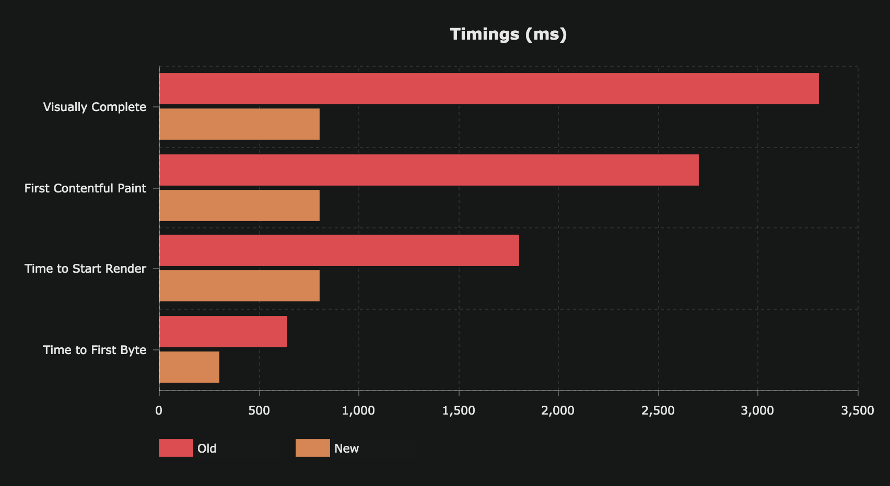

In short, we made significant improvements to the Webiny Cloud platform, which in return cut down the load time of Webiny websites by ~80%. To put this into perspective, previously the load time averaged at around 3.3 seconds, and now is around 800ms.

This improvement was a result of implementing server side rendering (SSR) with several innovations on our proxy and caching layers.

We hope you enjoy this new improvement ;)
