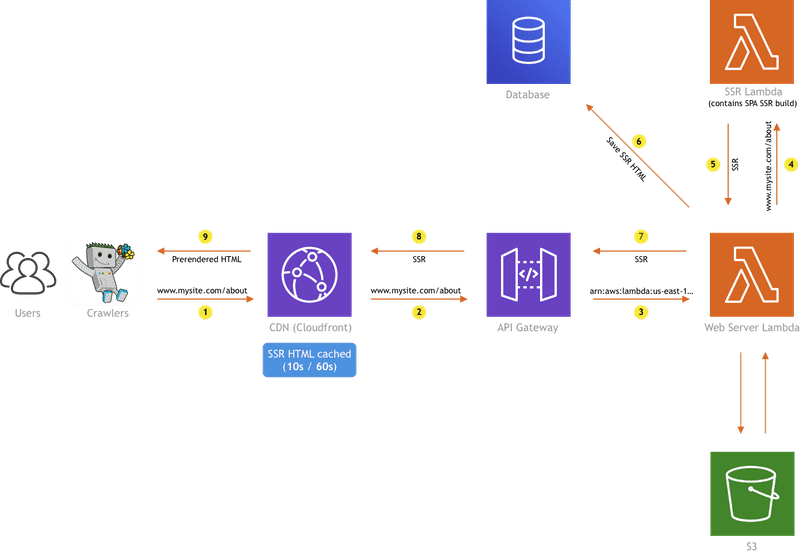
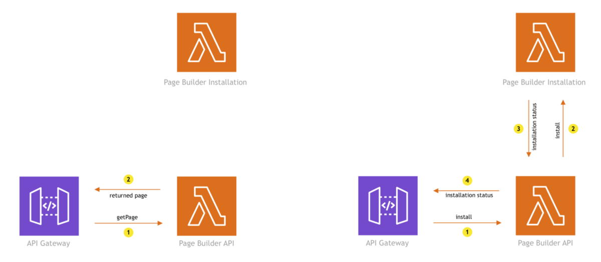

AWS Lambda is awesome! The service allows us to easily deploy and run our own code, without worrying too much about the underlying infrastructure (when compared to pre-serverless). It essentially scales infinitely (with great power comes great responsibility), and can be connected with a bunch of services, like API Gateway, S3, AppSync, DynamoDB, etc.

And usually, the thing people first start creating with the service are good-old HTTP APIs, like for example REST or even GraphQL. In those situations, since the actual users (potential customers) are the ones who will be invoking your Lambda functions, it's important that they are responding as fast as possible - meaning, we want to have function cold starts as short as possible, and afterward, make our code execute necessary logic in the most efficient way.

How to ensure that is the case? Well, that is the topic of this article, in which we'll cover five tips that can help you in that regard. So, without further ado, let's take a look!

## 1. More RAM = faster execution = same price
Allocating more RAM to a function means faster execution. That's true. But it also means you pay more, right? Well, it depends. Sometimes that's actually not true.

Consider these two [512MB RAM](https://user-images.githubusercontent.com/5121148/96137718-427dfd80-0efd-11eb-98b0-ba882d8a466b.png) and [1024MB RAM](https://user-images.githubusercontent.com/5121148/96137705-3eea7680-0efd-11eb-8ddb-a02e7f99158a.png) Lambda function CloudWatch logs. The billed durations from the logs are also shown in the following chart:


So, what we can see here is that with the 512MB of RAM Lambda function (blue), the billed duration is often 200ms. But, with 1024MB of RAM (red), which is 2x more, the billed duration gets reduced to 100ms, which is 2x less. Even the initial invocation's duration (the cold start one's) got reduced from 1400ms to 700ms. 

Effectively, this means we're getting faster functions, for the same price!


But do note, the results may vary depending on the task the function is performing. For example, in some cases, you might not achieve the reduction big enough for the price reduction to happen. In other words, if you manage to reduce the invocation duration from 140ms to 105ms, this is good, but still, doesn't change the price, since the billed duration on both invocations is 200ms.

Before bumping up RAM, do test your function with different payloads, and then based on the results, determine if there are any actions worth taking.

## 2. Watch out for function size to reduce the cold start durations
The larger the function in size, the longer the cold start. There is a [very nice article](https://mikhail.io/serverless/coldstarts/aws/) written by [Mikhail Shilkov](https://twitter.com/MikhailShilkov), that talks about various factors that impact the duration of cold starts, one of which is the package size. Definitely give it a read if you really want to get into the nitty-gritty.

Based on that fact, the advice I wanted to give here is - watch out for function size. Try to use as few external packages as possible. Be aware that every package you include in your function can also bring additional dependencies with it, making it even worse. 

With that, also be careful about how you actually import packages. If there is a way to import just a specific functionality, do that, instead of importing the entire package.

For example, when using the [AWS SDK](https://aws.amazon.com/sdk-for-node-js/), which we often need to communicate with various AWS services, only import the actual clients you'll be using.

Do not import the whole AWS SDK like so:

```ts
import { CloudFront, Lambda } from "aws-sdk";
```

Instead, do it like this:

```
import CloudFront from "aws-sdk/clients/cloudfront";
import Lambda from "aws-sdk/clients/lambda";
```

This approach can significantly affect the final bundle size, so again, watch out!

#### A couple of useful tools
There are a couple of useful tools I like to use in order to inspect what the 3rd party package is bringing to the table (or should I say - removing from the table).

One of the tools is the [https://bundlephobia.com](https://bundlephobia.com), which will give you an overview of the package size, with all of its dependencies. Definitely useful, especially when comparing similar packages functionality-wise, and deciding which to use.

The other one is the [Webpack Visualizer](https://chrisbateman.github.io/webpack-visualizer/), which gives you an awesome overview of all the packages that are included in your final production Webpack bundle. For example:


Wait, Webpack bundle?

Yes! Bundling your functions with Webpack is also recommended, since not only that'll make your function a single file, but will also make sure only the code that's actually utilized gets into the build, which naturally reduces the final file size.

Configuring Webpack could be a bit daunting task, but it's definitely worth it at the end of the day. Luckily, with every [new Webiny project](https://docs.webiny.com/docs/get-started/quick-start), the bundling process is pre-configured for you, so you can immediately jump to your new project! 😊

## 3. Split complex processes into separate functions to save money and gain speed
Some of you might already know that calling another Lambda function within a Lambda function is often considered as an anti-pattern, and yes, this is definitely true in certain cases. The main reason is that, while the other function is processing the invocation payload, the first function is idle and just waiting for the response, meaning you're effectively paying for nothing.

Yes, you can also invoke functions asynchronously, without waiting for the invocation to complete (using the [InvocationType: "Event"](https://docs.aws.amazon.com/lambda/latest/dg/invocation-async.html) option), but, here we're talking more about synchronous function invocation, which is definitely needed in case we're interested in the actual response that the invoked function is returning.

Let's consider the following example, where I believe calling another Lambda function from the first one (and waiting for the response) can be considered as a good approach.



The diagram above is showing the SSR implementation we did at Webiny, which consists of a couple of AWS resources: CloudFront, API Gateway, S3, two Lambda functions, and a database.

I won't go too much into the details here (feel free to check the [Serverless Side Rendering - The Ultimate Guide](https://www.webiny.com/blog/serverless-side-rendering-e1c0924b8da1) article for that), but, what we are doing with the two Lambda functions is essentially splitting work and optimizing for cost. The **Web Server Lambda** is configured with minimal system resources (256MB RAM), because its only task is to return cached SSR HTML, stored in the database.

But, if there is no SSR HTML in the database, we need to generate it, which is actually an intensive process, and executing it with 256MB of RAM simply won't cut it. So, instead of just bumping the **Web Server Lambda**'s RAM, we are invoking the **SSR Lambda** function, which contains a lot more system resources (for example - 2 GB RAM), and we're only paying for that when we actually need it. It would simply be a waste of money to have the **Web Server Lambda** configured with the same amount of resources, just to pull some data out of the database, most of the time. This way we can save a significant amount of money in the long run.

You can also do this if you have a Lambda function that's heavy in size, just because of a 3rd dependency that needs to be there, but still, isn't utilized that often.

For example, one of the apps that Webiny offers out of the box, the [Page Builder app](https://www.webiny.com/serverless-app/page-builder/), has its own installation process, in which we basically download initial sample pages and images, and respectively, insert them into the database, and save them to user's S3 bucket. This process requires a couple of NPM packages for dealing with files, which can easily add a couple of hundreds of KBs to the overall function size.

Since that's the case, we decided to extract the installation functionality completely from the main **Page Builder API** function, and place it into a separate **Page Builder Installation** function.



With this organization, we are not burdening the main **Page Builder API** function with redundant packages, which helps in reducing its size, and naturally, affects the duration of cold starts.

To conclude, whenever you have an intensive process, that either needs more system resources or requires additional packages that increase the overall function size, try to extract it into a separate function, especially if the process is rarely triggered.

## 4. When possible, execute code in parallel
The following tip is a short one, yet effective one, and can be applied not only when talking about Lambda functions, but coding in general.

If possible, execute code in parallel, not in series. For example, if we needed to do five 100ms operations, doing it in series means it would take a total of 500ms to complete.

```ts
const operations = [a, b, c, d, e];
for (let i = 0; i < operations.length; i++) {
    await operations[i](); // 100ms operation.
}
```

Instead of doing it in series, try doing it in parallel, using the `Promise.all` method, like so:

```ts
const operations = [a, b, c, d, e];
const promises = [];
for (let i = 0; i < operations.length; i++) {
    promises.push(operations[i]());
}

await Promise.all(promises); // 100ms operation.
```

Doing this will decrease the function invocation duration and naturally, reduce the overall cost!


## 5. Reusing connections with Keep-Alive
Last but not least, if you're making HTTP requests within your Lambda function's code, it's useful to [enable the "keep-alive"](https://docs.aws.amazon.com/sdk-for-javascript/v2/developer-guide/node-reusing-connections.html) option on the default Node.js HTTP/HTTPS agent, because that avoids establishing the TCP connection on every request, and enables us to always reuse the existing one:

> By default, the default Node.js HTTP/HTTPS agent creates a new TCP connection for every new request. To avoid the cost of establishing a new connection, you can reuse an existing connection.

This can be especially handy for clients like DynamoDB, where we really need the HTTP request latencies to be as low as possible.

A good article on the actual performance boost that this option introduces was already written by the great [Yan Cui](https://twitter.com/theburningmonk), in his article - [Lambda optimization tip - enable HTTP keep-alive](https://medium.com/predict/lambda-optimization-tip-enable-http-keep-alive-ef7aa7880554). As we can learn, without HTTP keep-alive, the duration of DynamoDB operations averaged around 33ms, while with the option enabled, the average duration dropped to 10ms! 

The somehow shocking fact about establishing new TCP connections is that the actual establishment takes more time than the actual client operation we're trying to execute! So when you think about it, deciding whether this option should be enabled or not is almost a no-brainer.

## Conclusion
By almost completely abstracting the infrastructure concerns from us and with that, reducing the overall development and maintenance cost, the AWS Lambda (and serverless technologies in general) truly does make our developer lives easier. But as we've seen, there are still a couple of tricks that are useful to know and which can help us in optimizing our workflows even further.

I hope the five tips we've shown here will help you in your serverless journey, but, of course, if you have any further questions, concerns, or ideas, feel free to ping me over [Twitter](https://www.twitter.com/doitadrian) or even directly via our [community Slack](https://www.webiny.com/slack).

---

Thanks for reading! My name is Adrian and I work as a full stack developer at [Webiny](https://www.webiny.com). In my spare time, I like to write about my experiences with some of the modern frontend and backend web development tools, hoping it might help other developers. If you have any questions, comments or just wanna say hi, feel free to reach out to me via [Twitter](https://www.twitter.com/doitadrian).
