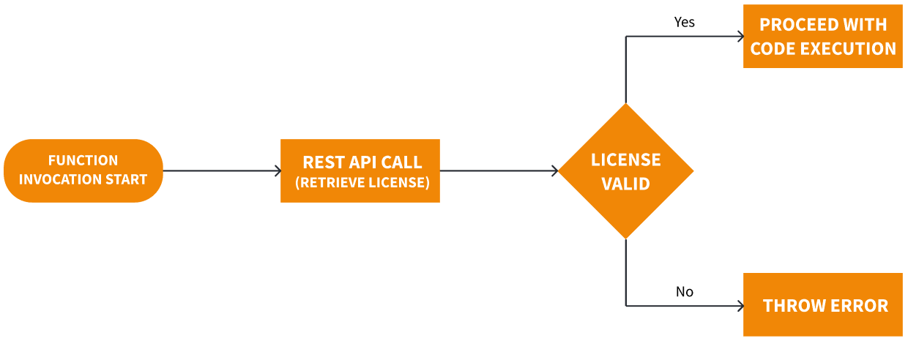
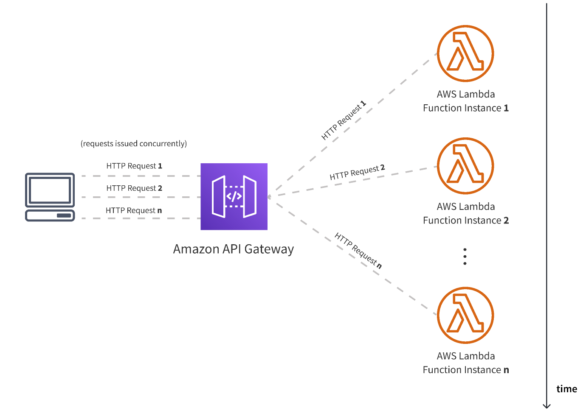
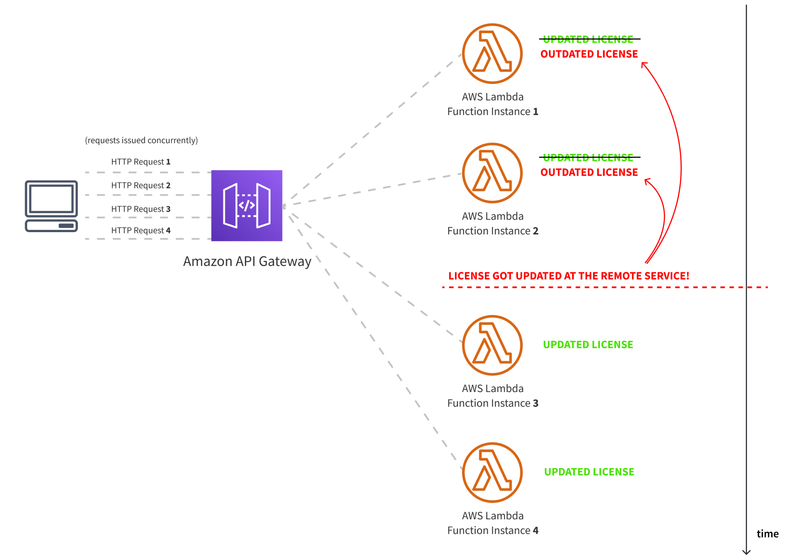
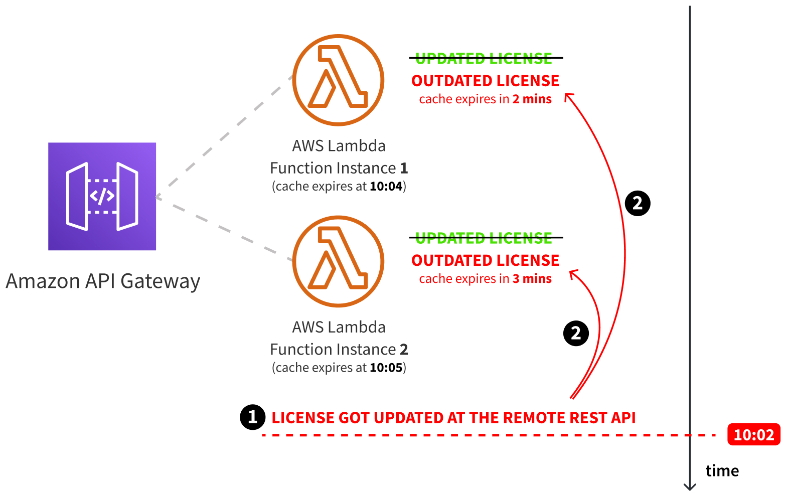

When developing serverless applications (applications that will be running on serverless services, like [AWS Lambda](https://docs.aws.amazon.com/lambda/latest/dg/welcome.html)), one might ask themselves: is caching still relevant since we don't have to think about cloud infrastructure and about scaling? 

Well, as [Yan Cui](https://aws.amazon.com/developer/community/heroes/yan-cui/) put it in his [All you need to know about caching for serverless applications](https://theburningmonk.com/2019/10/all-you-need-to-know-about-caching-for-serverless-applications/) article, in short, yes, caching is still VERY relevant.

As the article states, there are a couple of different places where we can actually perform caching, for example in our AWS Lambda function code, on Amazon API Gateway, or on the Amazon CloudFront level. But, ultimately, the place we choose to do it depends on our requirements.

Why am I mentioning all this? Well...

The other day, I was working on yet another AWS Lambda function (you can never have enough of them, right?). The interesting part was that, before the actual function code is actually executed, a simple remote REST API call needs to be issued, which is expected to return some data. More specifically, a license, which, for the sake of simplicity, let's assume is just a plain JSON object. 

What's important is that, depending on its validity, the retrieved license dictates what happens next. If the license is valid, the rest of the AWS Lambda function code is executed. If not, an error is thrown, and the execution is prevented. 



And while this remote REST API call is reasonably fast (responses are cached on a CDN, the whole request is ~30ms), it still wouldn't hurt to optimize things and maybe even, if possible, eliminate the call altogether. 

Unfortunately, completely eliminating the remote REST API call is not possible, because the license needs to be retrieved remotely (cannot be baked within the actual AWS Lambda function code or as an environment variable). But, caching the license *is* possible, and to do this, we can simply utilize the [Caching in the Lambda function](https://theburningmonk.com/2019/10/all-you-need-to-know-about-caching-for-serverless-applications/#caching-in-the-lambda-function) approach, which can be done with just a couple of lines of code. 

Let's say this was our starting point, no caching done here:

```ts
export const handler = async () => {
  const license = await fetch("https://give-me-the-license.com");
  if (!license) {
    throw new Error("Cannot continue. Invalid license.");
  }

  // Continue with the rest of the application code.
};

```

As we can see, the REST API call is issued every time the function is invoked. In order to avoid this and make things run a bit more efficient, we can cache the license via a variable that we define outside of our `handler` function:

```ts
let cachedLicense;

export const handler = async () => {
    if (!cachedLicense) {
        cachedLicense = await fetch("https://give-me-the-license.com");
        if (!cachedLicense) {
            throw new Error("Cannot continue. Invalid license.");
        }    
    }

    // Continue with the rest of the application code.
};
```

And while this would work, there is still one question we need to ask ourselves here. With the caching technique we've implemented above, what happens if for some reason the license has changed on the remote REST API?

## The Benefits and Hazards of AWS Lambda Scaling

Well, if you were familiar with [how AWS Lambda works](https://www.youtube.com/watch?v=QdzV04T_kec), you would know that the service can spawn multiple instances of your function, each operating in its own isolated environment (container). How many instances are spawned, essentially, depends on the amount of work there is to be done. The more work needs to be done, the more instances will be spawned. And only if an instance hasn't been active for some time (10-15minutes), the instance is terminated.

The following diagram shows how this might look like when our AWS Lambda function is invoked by concurrent HTTP requests received by an [Amazon API Gateway](https://aws.amazon.com/api-gateway/):




For us, this presents two issues.

### 1. Cache Is Flushed Only When a Function Instance is Terminated

First, if the license were to change, all existing instances would be working with a cached but outdated license. We would basically have to wait for these instances to be terminated, and only then we would have our application code retrieving the latest license from the mentioned remote REST API. 

### 2. Different Licences

More importantly, since AWS Lambda function instances are spawned at different times, we could end up in a situation where some of the instances hold the latest version of the license and some don't. 



Based on the diagram we've shown at the beginning of this article, depending on the cached licenses, we could even end up in a situation where some AWS Lambda function instances throw an error at the start of the function invocation, while others allow for the rest of the code to be executed.

If you ask me, pretty much sounds like a debugging hell.

So, how would we approach in resolving the two issues?

## Tackling the Caching Issues

In order to tackle the first **Cache Is Flushed Only When a Function Instance is Terminated** issue, we can introduce a local TTL (time-to-live) duration for the cached license. In other words, once, say, five minutes have passed from the time at which the license has been cached, we can do a re-fetch of the license (via the mentioned REST API call).

```ts
const FIVE_MINUTES = 300_000;

let cachedLicense;
let licenseCachedOn;

export const handler = async () => {
  const currentTime = new Date().getTime();
  const fiveMinutesPassed = (currentTime - licenseCachedOn) > FIVE_MINUTES;
  if (!cachedLicense || fiveMinutesPassed) {
    const license = await fetch("https://give-me-the-license.com");
    if (!license) {
      throw new Error("Cannot continue. Invalid license.");
    }

    cachedLicense = license;
    licenseCachedOn = currentTime;
  }

  // Continue with the rest of the application code.
};
```

And while this would resolve the first issue, the second **A Mix of Different Licenses** one would still persist. This is simply because 5-minute expirations would happen at different times within different AWS Lambda function instances. 

For example, let's imagine we had two active function instances, where one had its local license cache expiration set to **10:04**, and the other one to **10:05** (because they were spawned at different times). 

Now, it's **10:02** and the license got updated on the remote REST API side. This means that the first function instance will refresh its cache in two minutes, and the second one in three minutes, which is a minute after the first one. This puts us in a situation where, for a whole minute, our two function instances contain different cached licenses.



So, what we can do here is, instead of focusing on the time at which the license has been cached and having a fixed TTL, we focus on particular time windows in which the cached licenses live, and ensure they are the same for each AWS Lambda function instance. 

In other words, we can simply define that the cached license needs to be re-fetched at the end of every 5-minute interval in every hour, which is 12 times per every hour.


With this approach, we basically ensure that each function instance refreshes its cached license at the same time, meaning consistent results when the license is changed on the remote REST API.

The following code is an implementation of the approach:

```ts
export const getLicenseCacheKey = () => {
  // We're dividing an hour into 5-minute windows. In an hour, that's 12 windows total.
  // So, while we're in the same 5-minute window, the cached license will be returned.
  // Once we exit it, the license will again be fetched from the remote REST API.
  // This way of caching/invalidating the cache ensures all active AWS Lambda function
  // instances flush their cache and fetch the license at the same time.
  const currentHourOfTheDay = new Date().getHours();
  const currentMinuteOfTheHour = new Date().getMinutes();

  // Example returned values:
  // - "cache-16-2"
  // - "cache-0-1"
  // - "cache-23-12"
  return `cache-${currentHourOfTheDay}-${Math.ceil(
    currentMinuteOfTheHour / 5
  )}`;
};

let lastUsedLicenseCacheKey;
let cachedLicense;

export const handler = async () => {
  const currentLicenseCacheKey = getLicenseCacheKey();

  if (currentLicenseCacheKey !== lastUsedLicenseCacheKey) {
    const license = await fetch("https://give-me-the-license.com");
    if (!license) {
      throw new Error("Cannot continue. Invalid license.");
    }

    cachedLicense = license;
    lastUsedLicenseCacheKey = currentLicenseCacheKey;
  }

  // Continue with the rest of the application code.
};
```

Not a lot of code, right?

The most important part is the `getLicenseCacheKey` function, which generates a simple cache key based on the current 5-minute window we're currently in. With that, in the `handler` function, we detect whether the cached license has expired and the license needs to be re-fetched or not. 

## Conclusion

And that's it!

With this *relatively* simple time window-based caching approach, we've not only managed to optimize our AWS Lambda function code but we've also ensured all spawned function instances contain the same cached license at any point in time. 

Of course, this approach might not work for you and maybe a different set of requirements you might have. But, in this case, it certainly did the trick!

---

Thanks for reading! My name is Adrian and I work as a full stack developer at [Webiny](https://www.webiny.com/). In my spare time, I like to write about my experiences with some of the modern frontend and backend web development tools, hoping it might help other developers. If you have any questions, comments or just wanna say hi, feel free to reach out to me via [Twitter](https://twitter.com/adrians5j).


