## Introduction

In this tutorial, we will learn how to build a multilingual blog with Webiny Headless CMS and Vue.js. Providing content in multiple languages allows a blog to reach a larger audience and make its content more accessible to people who may not speak the blog's primary language, this can be especially important for businesses or organizations that operate in multiple countries or regions, or for individuals who want to share their ideas or experiences with people from different cultures. We will be using Vue.js for the frontend of the app, Tailwind CSS for styling, and Webiny Headless CMS as the backend.

## What is a Headless CMS?

A headless CMS (content management system) is one that lacks a frontend or display layer. Instead, it is entirely concerned with content management and the provision of APIs (application programming interfaces) that enable developers to retrieve and display that content in various ways. To create dynamic and responsive websites and applications, headless CMSs are frequently utilized in conjunction with modern web development frameworks and technologies.

## Why Webiny?

Webiny is an open-source self-hosted enterprise content management system. It is developed on top of the serverless infrastructure to provide excellent scalability and site dependability even during peak periods.  
Webiny allows you to build your content model easily, provide validators for your attributes, and implement security for your content on top of that Webiny Headless CMS is highly customizable and provides multilingual support.  
It is not just a headless CMS. it also provides you with [Advanced Publishing Workflow](https://www.webiny.com/docs/overview/applications/apw), [Page Builder](https://www.webiny.com/docs/overview/applications/page-builder), [Form Builder](https://www.webiny.com/docs/overview/applications/form-builder) and a [Control Panel](https://www.webiny.com/docs/overview/applications/control-panel).

Let’s now look at how we can create a multilingual blog with Webiny.

## Creating a Multilingual Headless Blog with Webiny and Vue.js

Here is a short demo of the Multilingual Headless Blog we will be building with Vue.js. The blog will be in two languages: English and French.

<video width="800px" height="auto" controls autoplay>
  <source src="./build-a-multilingual-blog-with-webiny-headless-cms-and-vue/multilingual-blog-demo.mp4" type="video/mp4" />
</video>

You will learn how to:

- Setup and deploy Webiny
- Create a Content Model
- Duplicate a Content Model and create content for the new Locale
- Integrate Webiny with Vue using Apollo
- Localize your application

### Prerequisites

- Node.js >=14
- yarn ^1.22.0 || >=2
- An [AWS account and user credentials](https://www.webiny.com/docs/infrastructure/aws/configure-aws-credentials) set up on your system for deployment
- Basic Knowledge of Vue.js

### Setting up Webiny

Open the directory you wish to create a Webiny project in your terminal or command line and run the following command

```bash
npx create-webiny-project my-new-project
```

Once you run this command, you will be asked a series of questions

In order to set up your new Webiny project, please answer the following questions.

```bash
Initializing a new Webiny /webiny-vue-blog...
√ Setup yarn
√ Initialize git
? Please choose the AWS region **in** which your new project will be deployed: (Use arrow keys)
us-east-2 (US East, Ohio)
us-west-2 (US West, Oregon)
eu-central-1 (EU, Frankfurt)
(Move up and down to reveal more choices)
In order to setup your new Webiny project, please answer the following questions.
? Please choose the AWS region **in** which your new project will be deployed: us-east-1 (US East, N. Virginia)
> DynamoDB (**for** small and medium sized projects)
```

Once your project is created, navigate to your project directory and run the command below to deploy.

```bash
yarn webiny deploy
```

This command will provide you at the end of its execution, the link to your admin dashboard, website and Graphql API. In case you missed it, you can still run the command below and the information:

```bash
> yarn webiny info

Environment: dev

➜ Main GraphQL API: https://your-id.cloudfront.net/graphql
- Manage API: https://your-id.cloudfront.net/cms/manage/{LOCALE_CODE}
- Preview API: https://your-id.cloudfront.net/cms/preview/{LOCALE_CODE}
➜ Public website:
- Website preview URL: https://your-id.cloudfront.net
```

Next, click on the Admin app URL to open the dashboard and create an admin user.

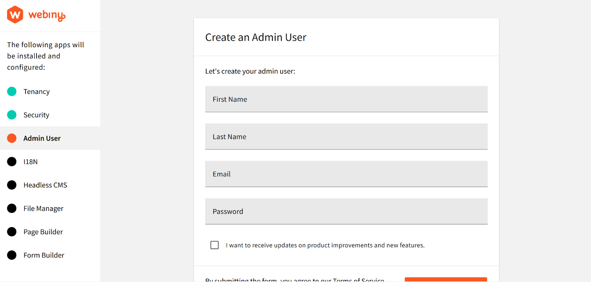

While in the admin area, you will need to install other services like i18n, Headless CMS, File Manager, Page Builder and Form Builder. Fill in the required information, submit and wait until everything gets set up.

Once the installation has terminated, you will be asked to sign in.

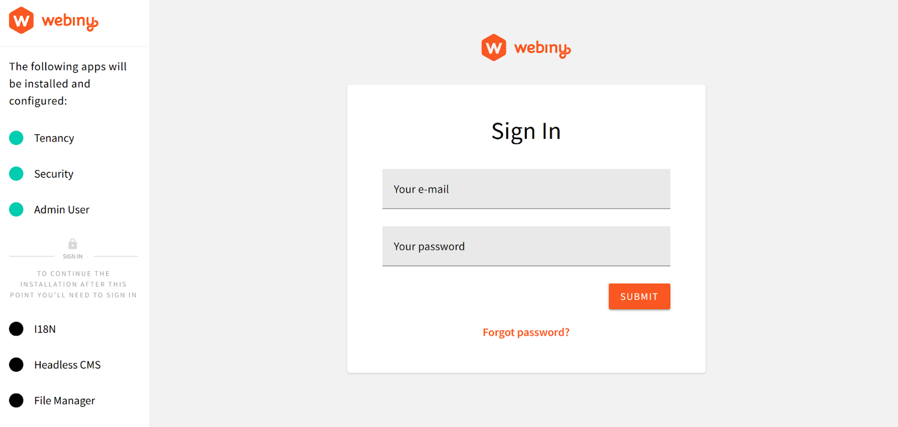

And redirected to the dashboard.

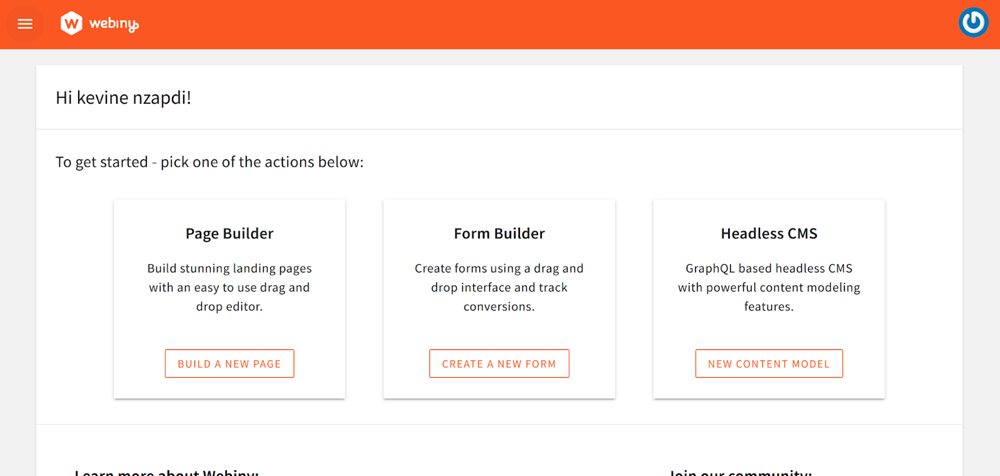

### Creating Blog Models

In the dashboard click on **NEW CONTENT MODEL to** create a new model called **Article Post**. This will take you to a screen where you can create your content models. You can learn more about the content creation model [here](https://www.webiny.com/docs/user-guides/headless-cms/essentials/create-content-model)

We will create a post model that will look like below:

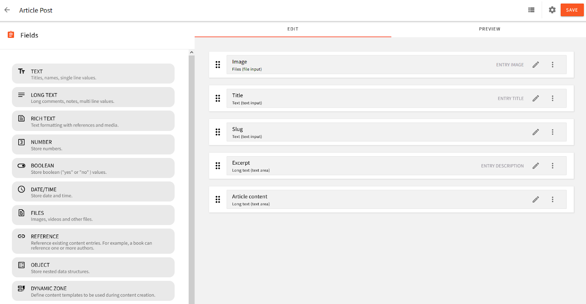

We will choose to make each field mandatory. To make this change click on the **pen icon** at the right end of each field, select the validator tab and switch on the required field.

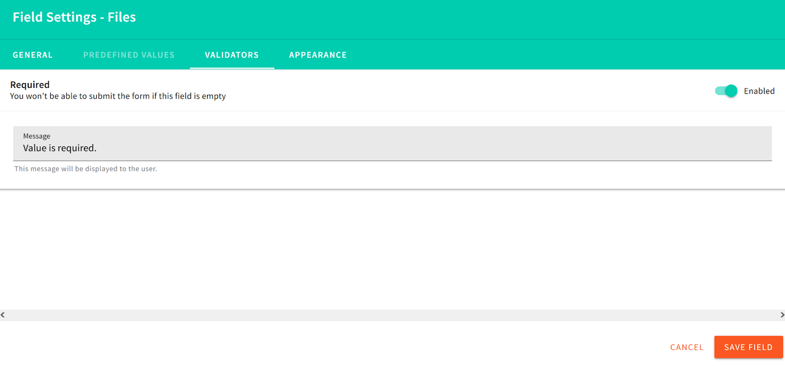

Our Article Model comprises of:

- A cover image
- Article Title
- Slug
- Excerpt (Short description) and
- The article content

Once everything is setup, click on **SAVE FIELD** and finally **SAVE** at the top right corner to register your model from there you will be redirected to the models' screen.

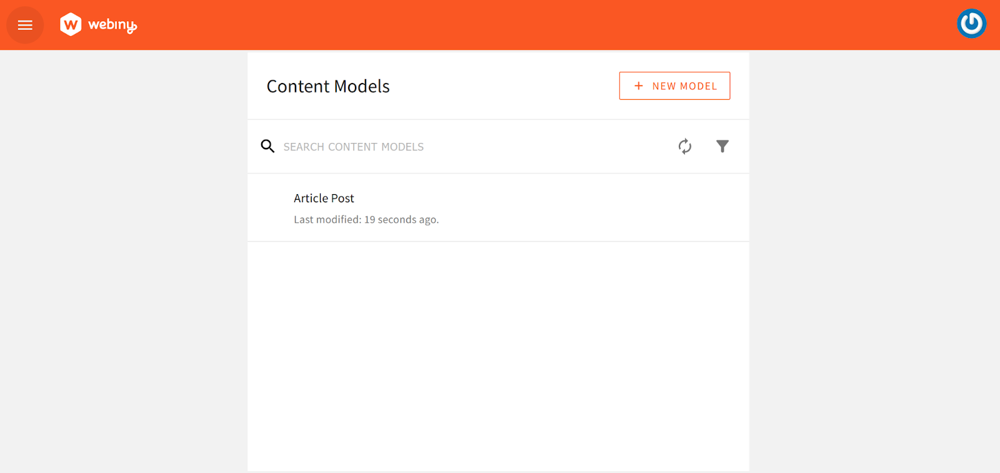

### Adding Dummy Data and Testing Request

Now it’s time to add some content that we can retrieve in your Vue frontend using Apollo.

Still, in the Content Models screen, hover over the **Article Post** and select the first icon in the in-line list.

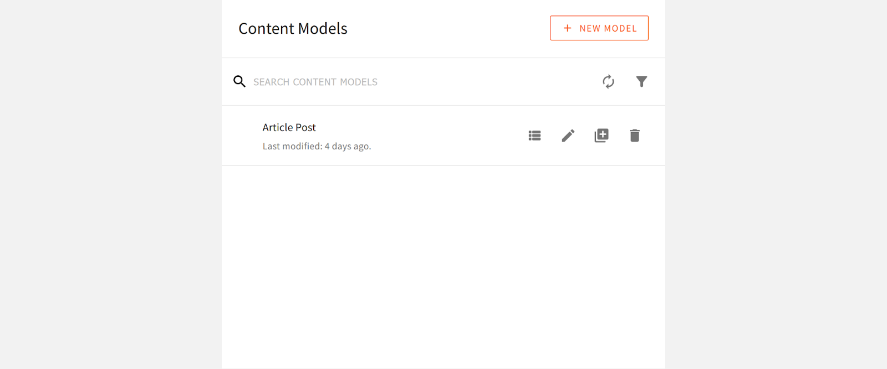

This will open a new screen, click on  **NEW ENTRY**.

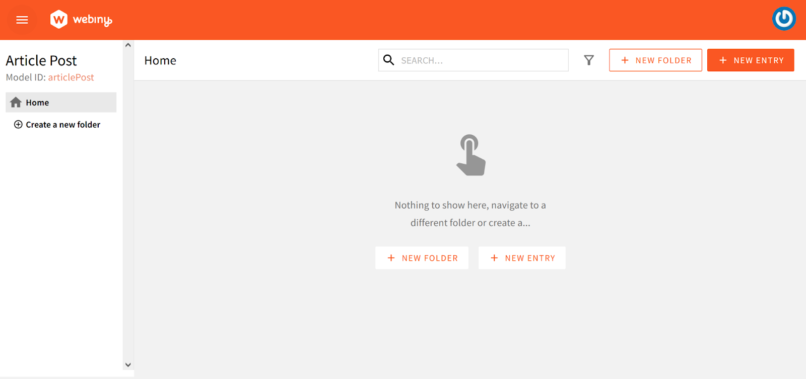

Add some content and save. If you made all your fields mandatory, make sure to fill each field before submission

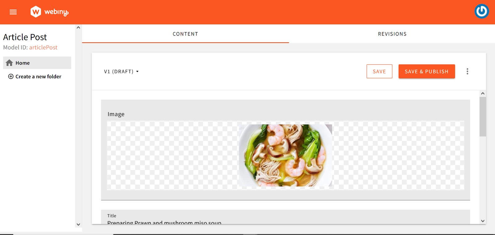

Create as many articles as you like then click on **SAVE & PUBLISH**

### Adding a New Locale

Since we are building a multilingual blog, we need to add another model for the second language. In your Admin menu click on Locales under Languages.
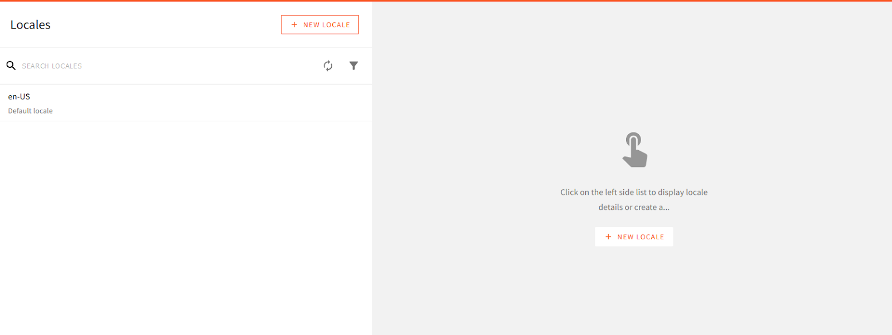

Next, and click on **NEW LOCALE**. In the code input type in **fr-FR** and select since we want our blog to be in French.


Once you save the locale, you will notice that a new section has appeared in the navbar at the right end. In case it does not appear immediately, you should reload the tab.

### Create a New Content Model Group for the New Locale

We will be creating a new content model group for the French locale

In the admin navbar, click on **Locale** and select the **fr-FR Locale**.

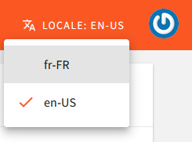

Then under the **Headless CMS** in the sidebar click on **Groups**-> **NEW GROUP**.

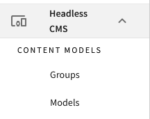

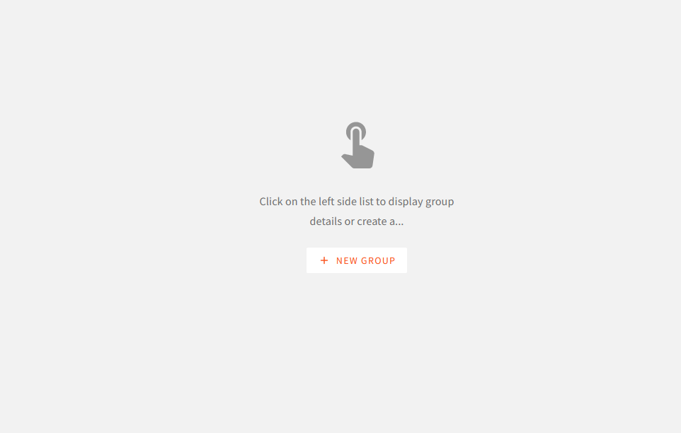

In the screen that opens provide the necessary information for the group model and save.

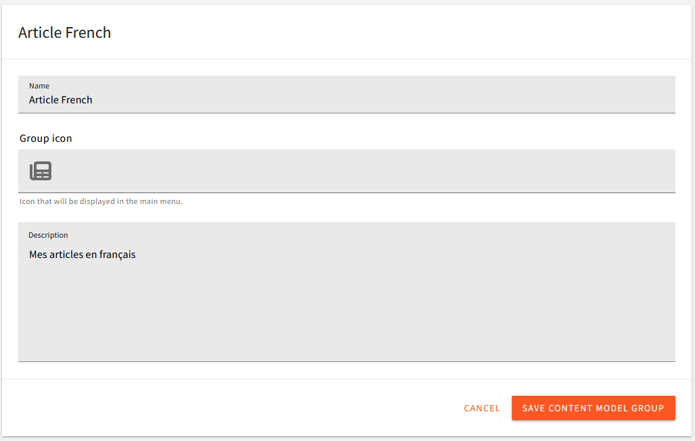

### Create a Content Model for the French Locale

Once we have set up our model we should create a new content model. Since we are building a model with the same attributes, we can either clone an existing model from another locale or create one. Here we will clone the **Article Post** model in the English locale

- Click on the locale dropdown in the navbar and select **en-US**
- Click on **Models** under **Headless CMS** in the sidebar
- Hover the Article Post model and click on the third item which is the duplicate icon(**plus sign icon**).


In the model that opens, fill in the information as in the screen below:

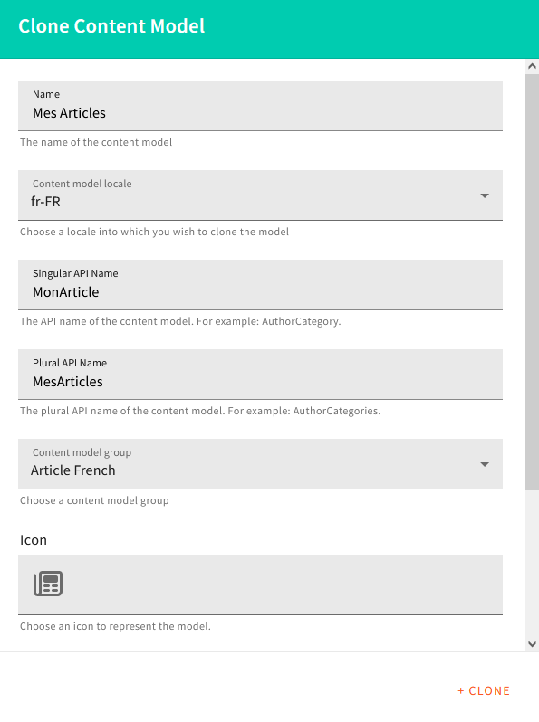

Make sure to select **fr-FR** as the Content Model Locale and **Article French** for the Content Model Group.

Equally update the Name, Singular API and Plural API Name then click on **CLONE**

### Update Article Post fields

Now that we have a content model in the French local called **Mes Articles**, we need to update the field name so that it reflects the language like in the screenshot below:

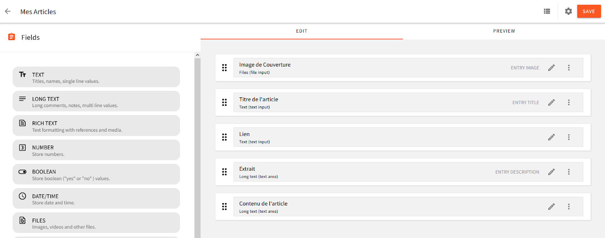

### Add French Content

As we did for the article in the English locales, we need to add the same articles but in French in the newly created locales. So while in the **fr-FR Locale** click on  **Models** under **Headless CMS** in the sidebar and add new content.

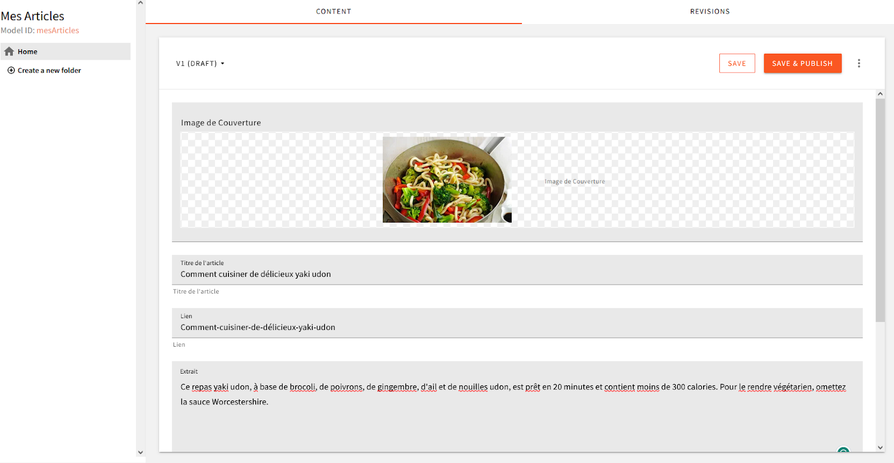

### Creating a Vue Project

With the existence of some predefined content, we can now set up our Vue project and install the necessary dependencies we will be using.

First of all, create a Vue app with the following command

```bash
npm create vue@latest
```

Once the project is ready, this is how we will structure our project files and folders.

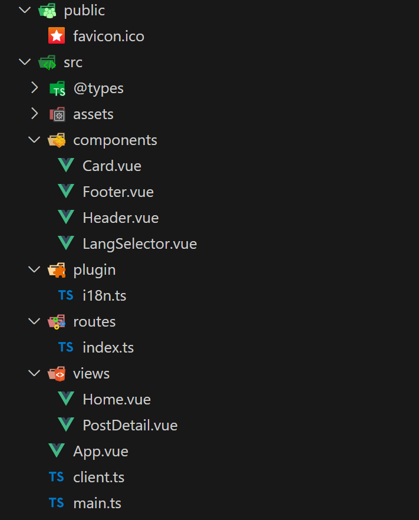

To launch the Vue app, run:

```bash
npm run dev
```

We will be working with some dependencies like Tailwind CSS, Apollo, vue-i18n, vue-router, and moment. So let’s install and set up these dependencies

### Adding Tailwind CSS

In your app root folder run the command below to install Tailwind CSS

```bash
npm install -D tailwindcss postcss autoprefixer
```

Configure the template path(`tailwind.config.js`):

```jsx
/** @type {import('tailwindcss').Config} */
module.exports = {
  content: ['./index.html', './src/**/*.{vue,js,ts,jsx,tsx}'],
  theme: {
    extend: {}
  },
  plugins: []
}
```

Then add the tailwind directive to your CSS

`src/assets/main.css`

```css
@tailwind base;

@tailwind components;

@tailwind utilities;
```

### Install vue-i18n

Run the following commands to install vue-i18n

```bash
npm install vue-i18n@9
```

Open your `vite.config.ts`, import and use the intlify plugin like below:

```tsx
...
import VueI18nPlugin from '@intlify/unplugin-vue-i18n/vite'

// https://vitejs.dev/config/
export default defineConfig({
  plugins: [
    vue(),
    /* ... */
    VueI18nPlugin({
      /* options */
      // locale messages resource pre-compile option
      include: resolve(dirname(fileURLToPath(import.meta.url)), '../locales/')
    })
  ],
  ...
})
```

Next, create a `src/locales` folder and add your en.json and fr.json translation files for static text.

Then create `plugin/i18n.ts` file and add the code below:

```tsx
import { createI18n } from 'vue-i18n'

const en = {
  home: 'Home',
  multilingual: 'VUE MULTILINGUAL BLOG',
  loading: 'Loading...',
  error: 'An error occured...'
}

const fr = {
  home: 'Accueil',
  multilingual: 'BLOG MULTILINGUE en VUE js',
  loading: 'Chargement...',
  error: 'Une erreur est survenue...'
}

const messages = {
  en,
  fr
}

const i18n = createI18n({
  locale: 'en',
  messages
})

export default i18n
```

In the code above, we created an i18n module, where we import our translations files and set the default locale to be English.

Finally, edit the `main.ts` file to use your locales like below:

```tsx
import './assets/main.css'
import App from './App.vue'
import i18n from './plugin/i18n'
import { createApp } from 'vue'
const app = createApp(App)

app.use(router)
app.use(i18n)
app.mount('#app')
```

### Adding Vue-Apollo

Run the following commands in the app root to install Graphql and Apollo

```bash
npm install --save vue-apollo graphql apollo-boost
npm install --save @vue/apollo-composable
```

Create a `src/client.ts` file with the code below:

```tsx
import { ApolloClient, HttpLink, InMemoryCache } from '@apollo/client/core'
import { computed, ref, watch } from 'vue'
import i18n from './plugin/i18n'
let httpLink = ref()

const apilink = computed(() =>
  i18n.global.locale.value === 'fr'
    ? ''
    : ''
)
const client = new ApolloClient({
  link: httpLink.value,
  cache: new InMemoryCache(),
  connectToDevTools: true
})

watch(
  apilink,
  () => {
    console.log('apilink Value', apilink.value)
    httpLink.value = new HttpLink({
      uri: apilink.value,
      headers: {
        Authorization: '',
        'x-tenant': 'root'
      }
    })

    client.setLink(httpLink.value)

    console.log('currentLang', i18n.global.locale.value)
    client.onClearStore(httpLink.value)
    client.resetStore()
  },
  { immediate: true }
)

export default client
```

In the code block above, we set up our client with an API LINK and Authorization token that we will add later. We use i18n to set the client link depending on which locale a user selects. For example, if the locale detected is en we set the `httpLink`, clear the client’s store and reset the new value.

To use the client we need to import it in the `main.ts`:

```tsx
...
import App from './App.vue'
import { createApp } from 'vue'

import { DefaultApolloClient } from '@vue/apollo-composable'
import client from './client'

const app = createApp(App).provide(DefaultApolloClient, client)

...
app.mount('#app')
```

### Adding Vue Router

Execute the command below to install `vue-router`

```bash
npm install vue-router@4
```

In the `src/routes/index.ts`, add the following code:

```tsx
import { createRouter, createWebHistory } from 'vue-router'
import Home from '@/views/Home.vue'
import PostDetail from '@/views/PostDetail.vue'

const routes = [
  {
    path: '/',
    name: 'Home',
    component: Home
  },
  {
    path: '/post/:slug',
    name: 'PostDetail',
    component: PostDetail
  }
]
const router = createRouter({
  history: createWebHistory(),
  routes
})
export default router
```

The application is made up of 3 screens, so in this section, we configure the path for each view that will be created later.

Next, edit `main.ts` to use routes

```tsx
...
import router from './routes'
import App from './App.vue'
...

const app = createApp(App).provide(DefaultApolloClient, client)

app.use(router)
app.mount('#app')
```

Equally edit, the `App.vue` file to include `Routeview`:

```tsx
<script setup lang="ts">
...
</script>

<template>
  <RouterView />
</template>
```

### Connecting Webiny to Vue

We need to create our API so that we can connect our Vue to the Headless CMS and perform requests.

In the Webiny admin, sidebar click on **Settings**-> **Access Management**->**API Keys**.

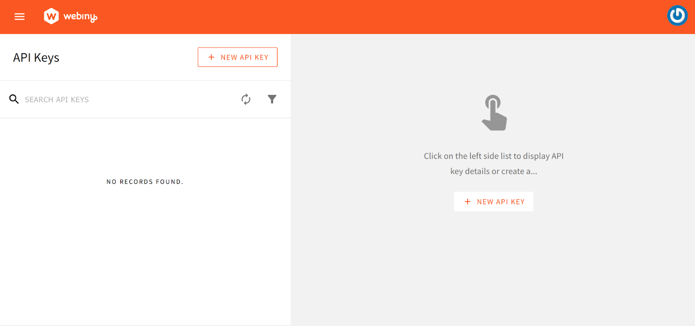

Click on **NEW API KEY** and provide a name and description for your API.

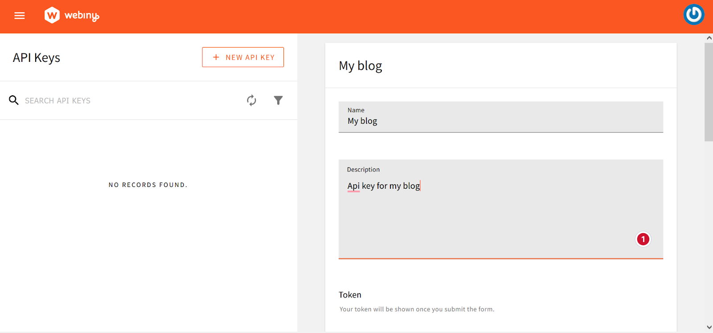

For the content model, select all locales.

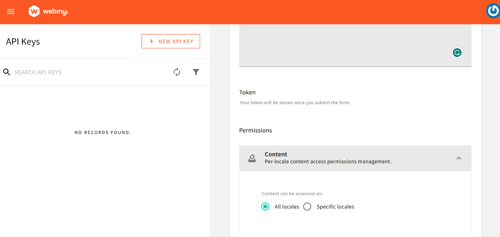

Let's give the access to **File Manager**, **Headless CMS,** and **i18n**.

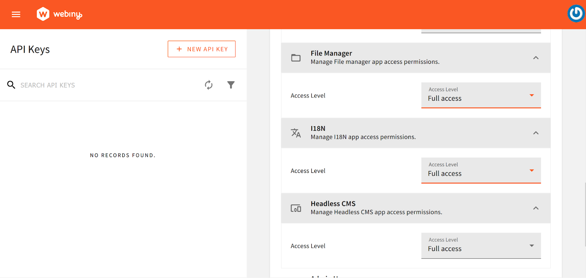

Note that in a real-world project, you need to provide custom access in order to control what other developers can do or not. You can learn more about it in the [documentation](https://www.webiny.com/docs/overview/features/access-control)

When you are done, click on the **SAVE API KEY** button to generate your token.

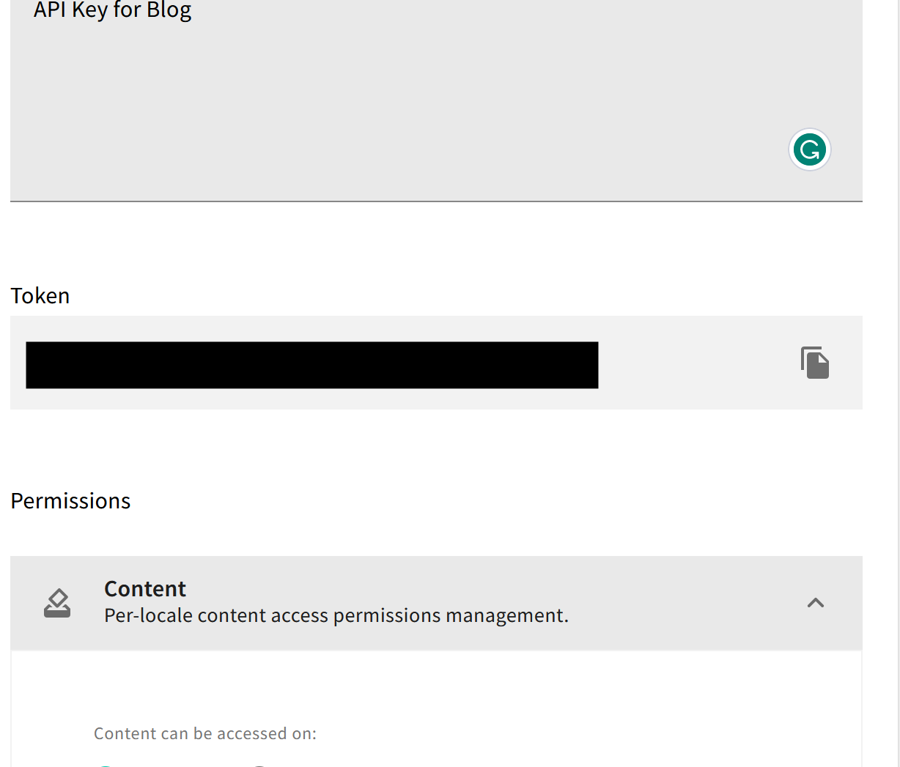

Now that you have a token, you need to add it to the `src/client.ts` file.

### Integrating Webiny with Vue

In your Vue project root, create an `.env` file in the app root and add the following:

```bash
VITE_WEBINY_API_EN=YOUR WEBINY CMS ENGLISH URL HERE
VITE_WEBINY_API_FR=YOUR WEBINY CMS FRENCH URL HERE
VITE_TOKEN=YOUR WEBINY TOKEN
```

We will be having two APIs, one for the English locale(`VITE_WEBINY_API_EN`) and the other for the French locale(`VITE_WEBINY_API_FR`).

To get your API use **`yarn webiny info`** or open your **API Playground** in the Admin panel and click the **Headless CMS – Read API tab** at the top of the page, and copy and paste the URL just below the tab to the corresponding local variable in your .env file.

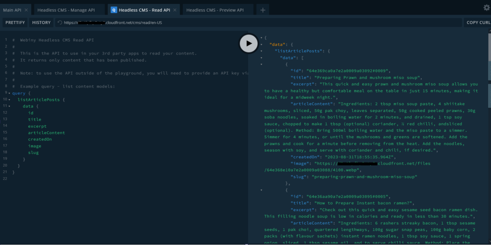

To get the API for the `fr-FR` locale, change the locale to `fr-FR` in the navbar and copy the API.

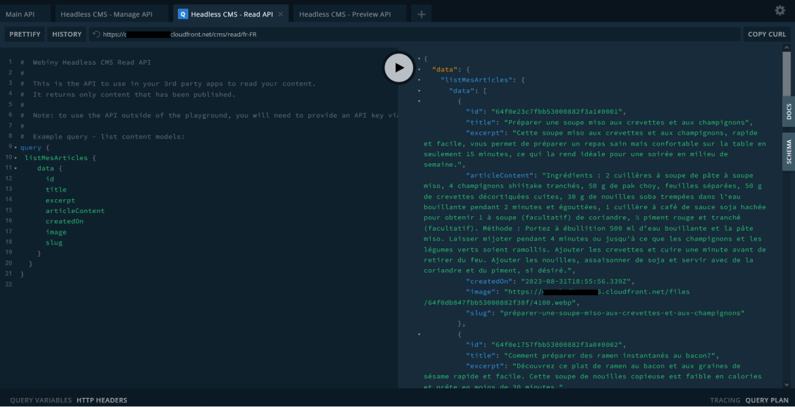

Both APIs should be in this format:

- en: [`https://your-id.cloudfront.net/cms/read/en-US`](https://your-id.cloudfront.net/cms/read/en-US)
- fr:`https://your-id.cloudfront.net/cms/read/fr-FR`

Add those environment variables in your `src/client.ts` file:

```tsx
...

const apilink = computed(() =>
  i18n.global.locale.value === 'fr'
    ? import.meta.env.VITE_WEBINY_API_FR
    : import.meta.env.VITE_WEBINY_API_EN
)
...

watch(
  ...
  () => {
   ...
      headers: {
        Authorization: 'Bearer ' + import.meta.env.VITE_TOKEN,
        ...
      }
    })
...
)

export default client
```

Now you will be able to access and request information from the Headless CMS to display on your front end.

### Build App Components

### Creating the Card Component

This is a typical card component that will create:

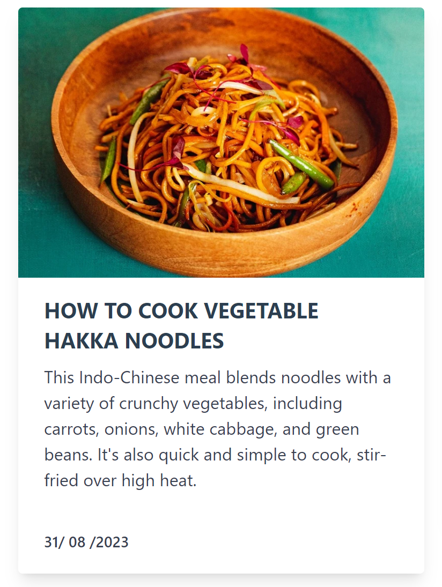

Create `src/component/Card.vue` file and add the following code:

```jsx
<script setup>
import gql from 'graphql-tag'
import { useQuery } from '@vue/apollo-composable'
import { useI18n } from 'vue-i18n'
import { computed, ref, watch, watchEffect } from 'vue'
import i18n from '../plugin/i18n'
import moment from 'moment'
const { t, locale } = useI18n()

const LISTARTICLES_QUERY = computed(() =>
  locale.value === 'en'
    ? gql`
        query {
          listArticlePosts {
            data {
              id
              title
              image
              excerpt
              createdOn
              slug
            }
          }
        }
      `
    : gql`
        query {
          listMesArticles {
            data {
              id
              title
              image
              excerpt
              createdOn
              slug
            }
          }
        }
      `
)

const { result, loading, error, query } = useQuery(LISTARTICLES_QUERY.value)

function toggleLocale() {
  locale.value = i18n.global.locale.value === 'en' ? 'fr' : 'en'

  query.value.options.query = LISTARTICLES_QUERY.value

  console.log(query.value.options.query)
}
watch(error, (newvalue) => {
  console.log('error loading', error.value)
  console.log('locale value', locale.value)
})

let post = computed(() => {
  return locale.value === 'en'
    ? result.value?.listArticlePosts.data ?? []
    : result.value?.listMesArticles.data ?? []
})
</script>

<template>
  <div class="mt-8 flex justify-center">
    <button
      @click="toggleLocale"
      class="bg-blue-500 hover:bg-blue-700 text-white font-bold py-2 px-4 rounded uppercase locale"
    >
      {{ locale }}
    </button>
  </div>

  <div v-if="loading" class="text-center text-gray-500">
    {{ t('loading') }}
  </div>
  <div v-else-if="error" class="text-center text-red-500">
    {{ t('error') }}
  </div>
  <div v-else class="grid grid-cols-3 gap-6 py-5">
    <template v-if="result?.listArticlePosts">
      <router-link
        :to="{ path: '/post/' + `${post.id}` }"
        v-for="post in result.listArticlePosts.data"
        :key="post.id"
      >
        <div class="rounded overflow-hidden shadow-lg hover:opacity-30 hover:transition-all">
          

          <div class="px-6 py-4">
            <div class="font-bold text-xl mb-2 uppercase">{{ post.title }}</div>
            <p class="text-gray-700 text-base">
              {{ post.excerpt }}
            </p>
          </div>
          <div class="px-6 pt-4 pb-2">
            <span class="inline-block py-1 text-sm font-semibold text-gray-700 mr-2 mb-2">{{
              moment(post.createdOn).format('DD/ MM /Y')
            }}</span>
          </div>
        </div>
      </router-link>
    </template>

    <template v-else-if="result?.listMesArticles">
      <router-link
        :to="{ path: '/post/' + `${post.slug}` }"
        v-for="post in result.listMesArticles.data"
        :key="post.id"
      >
        <div class="rounded overflow-hidden shadow-lg hover:opacity-30 hover:transition-all">
          

          <div class="px-6 py-4">
            <div class="font-bold text-xl mb-2 uppercase">{{ post.title }}</div>
            <p class="text-gray-700 text-base">
              {{ post.excerpt }}
            </p>
          </div>
          <div class="px-6 pt-4 pb-2">
            <span class="inline-block py-1 text-sm font-semibold text-gray-700 mr-2 mb-2">{{
              moment(post.createdOn).format('Do MMMM Y')
            }}</span>
          </div>
        </div>
      </router-link>
    </template>
  </div>
</template>
```

From the code block above, we have created a `LISTARTICLES_QUERY` that retrieves the listArticlePosts model if the selected locale is English or listMesArticles if the current locale is fr and display it.

We then create a toggle button that shows the list of articles based on the current local selected.

We equally have the moment to format the date to our convenience

### Creating the Language Switcher Component

In `src/components/LangSelector.vue` and the code below:

```tsx
<script setup>
import i18n from '../plugin/i18n'
import { useI18n } from 'vue-i18n'
const { locale } = useI18n()
function toggleLocale() {
  locale.value = i18n.global.locale.value === 'en' ? 'fr' : 'en'
}
</script>
<template>
  <div class="mt-8 flex justify-center">
    <button
      @click="toggleLocale"
      class="bg-blue-500 hover:bg-blue-700 text-white font-bold py-1 px-4 rounded locale uppercase text-[0.9rem]"
    >
      {{ locale }}
    </button>
  </div>
</template>

<style>
.locale {
  position: absolute;
  right: 15.3%;
  top: 8%;
}
</style>
```

In the code above we create a simple Language switcher component that we will use for the static text.

### Creating the Header Component

Our header will look like this:

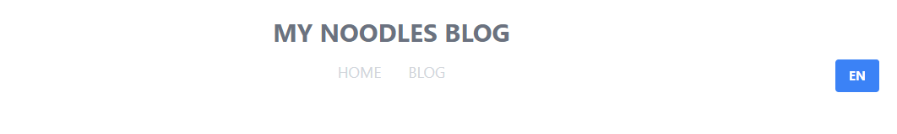

`src/components/Header.vue`:

```tsx
<script setup lang="ts">
import { useI18n } from 'vue-i18n'
import { watchEffect } from 'vue'
import i18n from '@/plugin/i18n'
import LangSelector from './LangSelector.vue'

const { t } = useI18n({
  inheritLocale: true,
  useScope: 'local'
})

watchEffect(() => {
  console.log('header currentLanguage 2', i18n.global.locale.value)
})
</script>

<template>
  <header class="w-full p-6 bg-white">
    <nav>
      <ul class="text-center uppercase mb-4">
        <li>
          <router-link to="/"
            ><h1 class="text-3xl text-gray-500 font-bold">My Noodles Blog</h1></router-link
          >
        </li>
      </ul>
      <ul class="flex justify-center text-lg">
        <li class="hover:text-blue-500 cursor-pointer px-4 te uppercase text-gray-300">
          <router-link to="/">{{ t('home') }}</router-link>
        </li>
        <li><LangSelector /></li>
      </ul>
    </nav>
  </header>
</template>
```

The header component comprises the home screen, blog screen and language switcher. As you can notice we are using the routes we created earlier for navigation.

### Creating the Footer Component

We will have a simple footer with the text below:

`src/components/Footer.vue`

```tsx
<script setup lang="ts">
import { useI18n } from 'vue-i18n'
const { t } = useI18n({
  inheritLocale: true,
  useScope: 'local'
})
</script>

<template>
  <footer class="w-full shadow-md bg-white footer">
    <div class="text-center uppercase bg-black py-6 mt-6 text-white">
      Webiny + {{ t('multilingual') }} &copy; 2023
    </div>
  </footer>
</template>
<style>
.footer {
  position: relative;
  bottom: 0;
}
</style>
```
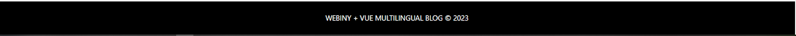

Now edit the `App.vue` file to include the Header and Footer components:

```tsx
<script setup lang="ts">
import Footer from './components/Footer.vue'
import Header from './components/Header.vue'
</script>

<template>
  <Header />
  <RouterView />
  <Footer />
</template>
```

We have all our components, so we can now build the different pages of the application.

### Building the Post Detail Page

The post detail page will look like this:

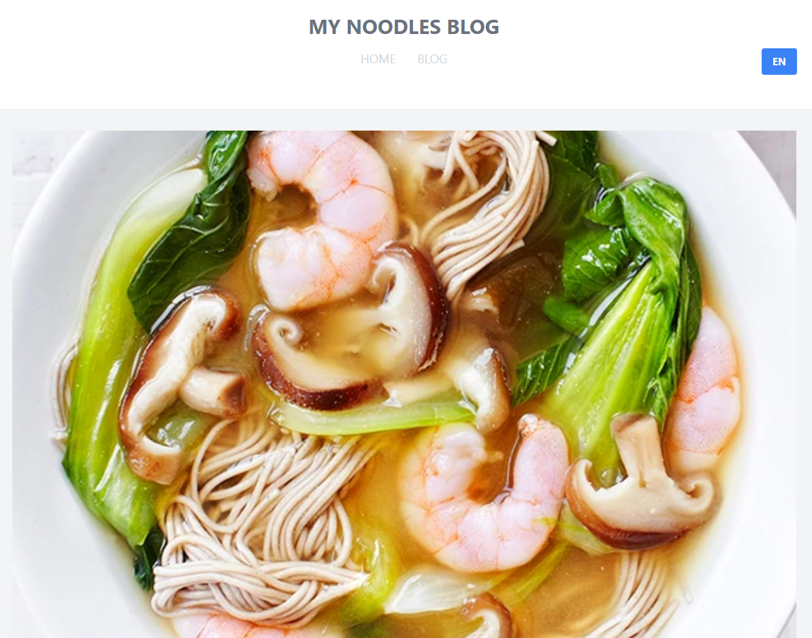

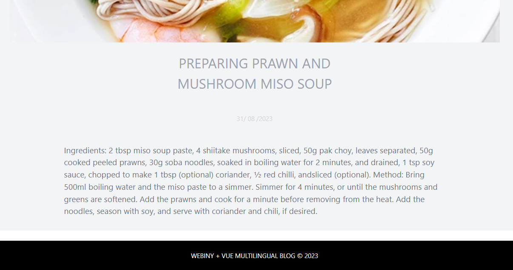

Create `src/views/PostDetail.vue` and add the following code:

```jsx
<script setup>
import { useQuery } from '@vue/apollo-composable'
import { computed, ref } from 'vue'
import moment from 'moment'
import gql from 'graphql-tag'
import i18n from '../plugin/i18n'
import { useI18n } from 'vue-i18n'
const { t, locale } = useI18n()

const ONE_ARTICLE_QUERY = computed(() =>
  locale.value === 'en'
    ? gql`
        query getSinglePost($slug: String) {
          getArticlePost(where: { slug: $slug }) {
            data {
              id
              image
              title
              createdOn
              slug
              articleContent
            }
          }
        }
      `
    : gql`
        query getSinglePost($slug: String) {
          getMonArticle(where: { slug: $slug }) {
            data {
              id
              image
              title
              createdOn
              slug
              articleContent
            }
          }
        }
      `
)

const { result, loading, error, query } = useQuery(ONE_ARTICLE_QUERY.value)

function toggleLocale() {
  locale.value = i18n.global.locale.value === 'en' ? 'fr' : 'en'
  query.value.options.query = ONE_ARTICLE_QUERY.value
  console.log(query.value.options.query)
}

let post = computed(() => {
  return locale.value === 'en'
    ? result.value?.getArticlePost?.data ?? []
    : result.value?.getMonArticle?.data ?? []
})
</script>

<template>
  <div class="mt-8 flex justify-center">
    <button
      @click="toggleLocale"
      class="bg-blue-500 hover:bg-blue-700 text-white font-bold py-2 px-4 rounded locale uppercase"
    >
      {{ locale }}
    </button>
  </div>

  <div class="bg-gray-100 min-h-screen">
    <div class="container mx-auto py-8">
      <div v-if="loading" class="text-center text-gray-500">
        {{ t('loading') }}
      </div>
      <div v-else-if="error" class="text-center text-red-500">
        {{ t('error') }}
      </div>
      <div v-else class="">
        <template v-if="post.id" :key="post.id">
          
          <div>
            <div class="flex justify-center">
              <div>
                <h1 class="uppercase w-3/4 mx-auto text-gray-400 text-[2rem] mt-6 text-center">
                  {{ post.title }}
                </h1>
                <p class="text-gray-300 my-6 text-center py-6">
                  {{ moment(post.createdOn).format('DD/ MM /Y') }}
                </p>
              </div>
            </div>

            <div class="flex justify-center">
              <div class="max-w-4xl">
                <div class="text-[1.2rem] text-gray-500">{{ post.articleContent }}</div>
              </div>
            </div>
          </div>
        </template>
      </div>
    </div>
  </div>
</template>
```

In the PostDetail Page we have two queries one in the `en-US` locale `getArticlePost` and the other `getMonArticle` in the `fr-FR` locale. Depending on the current locale, we compute the result of a query and display the data of a single post.

### Building the Home Page

This is how the Home page will look like:

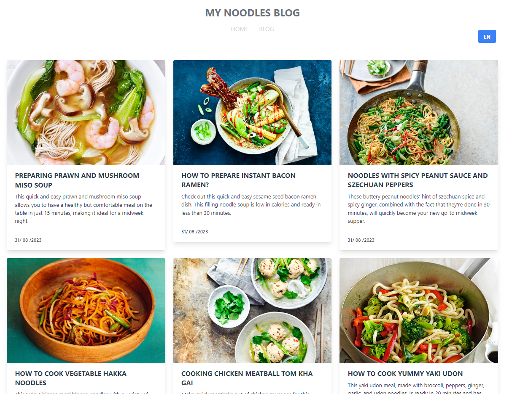

Create `src/views/Home.vue` file then add the code below:

```jsx
<script setup>
import Card from '../components/Card.vue'
</script>

<template>
  <div class="container mx-auto px-10">
    <Card />
  </div>
</template>
```

In the Home Page, we call the Card view to display the list of articles created.

### Testing the Blog

Finally, it’s time to test the application and make sure every part is working smoothly. In your root Vue project execute the following command:

```jsx
npm run dev
```

Then open `localhost:5173` in your browser and navigate through your application.

You can equally head to your Webiny admin board and create new articles and check your frontend to see the newly created articles

### Conclusion

We created a multilingual blog in this tutorial using Webiny Headless CMS and Vue.js. You could also [build the blog with Next.js](https://www.webiny.com/blog/build-blog-nextjs-webiny-headless-cms) or [Gatsby](https://www.webiny.com/blog/build-blog-gatsby-webiny-headless-cms) as the front end.

Now you should be able to create a content model in Webiny, connect it to a frontend framework like Vue.js and make API calls. You can further improve the blog by adding an authentication feature and another locale.

You can find the source code on this [repository](https://github.com/webiny/write-with-webiny/tree/main/tutorials/vuejs-multilingual-blog) on GitHub.

If you are curious about Webiny you can head straight to the [documentation](https://www.webiny.com/docs/get-started/install-webiny) page and check more features and how Webiny works in general