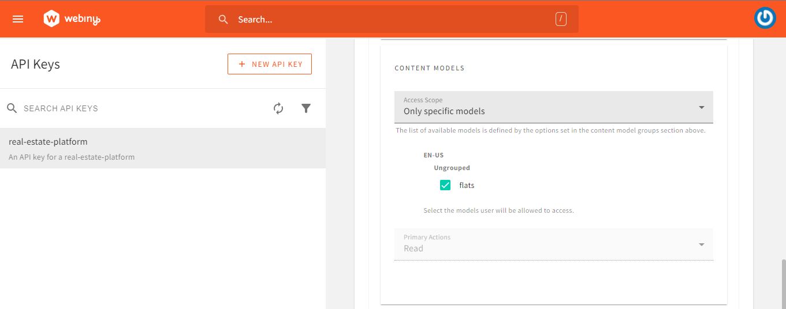

## Introduction
In this tutorial, we will learn how to build a Real Estate Platform with React and Webiny Headless CMS. We will also look into the Webiny GraphQL API advanced filtering with an example.
Webiny is an open-source, developer-friendly CMS that is supported by cutting-edge tools and technologies like Node, React, and a GraphQL API. You have the option to integrate with tools like Gatsby, Nextjs, and Astro through the Content Delivery API. Webiny supports developers in the design, development, and deployment of applications on top of the serverless infrastructure.


## Prerequisites

- [Set up your AWS credentials locally](https://www.webiny.com/docs/infrastructure/aws/configure-aws-credentials)
- Ensure that you have [Node.js](https://nodejs.org/en/download/) >= 14.15.0 installed.
- Basic understanding of React and JavaScript
- Star our [GitHub Repo](https://github.com/webiny/webiny-js)! 😉

## Set Up a Webiny Project

The first step is to create a new Webiny project by executing the following command:

```jsx
npx create-webiny-project real-estate-platform
```

Your project ought to be automatically set up as a result. You will be asked to choose the AWS region and the database that your project will use for deployment. We will be utilizing DynamoDB for this project. Once the folder has been created, navigate to the folder and input the command below

```jsx
cd real-estate-platform && yarn webiny-deploy
```

With this, your project is created, and the application is deployed to your AWS account. Once deployed, you will see some of the URLs listed below in your terminal.

If you accidentally closed it, you may see the URLs by typing the **yarn webiny info** command.


Click on the Admin App link to continue. You will now be taken to the first page of the admin area, where you must fill out the registration form and complete all registrations.


Our Webiny project has been deployed and registered successfully. Now we must create our own models.

## Creating Content Models

Now let's create a content model. Click the **New Content Model** button in the Webiny dashboard.


You will be taken to the following screen after clicking, where you can create a new content model. After clicking, provide the model a name and other details.


We will have flats content models for this project with following fields:

- A **text** field with the label name
- A **long text** field with the label address
- A **numbers** field with the label price
- A **file** field with the label cover image
    


Once all the fields have been successfully added, ensure that they are validated, as seen below


## Adding Data to Models

The next step is to add some data inside the models that will be shown later in the front-end once they have all been constructed correctly with the necessary fields for the application to perform smoothly. To do this, click the menu button on the left, select the models created (flats) from the Headless CMS dropdown menu, then click Create a new entry.


Now complete the entry form and press the previously mentioned **save and publish** buttons. As you can see in mine above, you are free to add as many entries as you wish. We will now fill in our flats using the same process.

## Establishing an API key and testing our GraphQl API

As can be seen in the documentation on using it, the GraphQL API is protected by a security layer that forbids unauthorized access. In order to connect to an API, we must therefore provide the value of an API key. This can be done by accessing the Security Webiny application's API Keys section.

Click on the menu bar on the left side of the page and select **API keys,** as seen below.


Once it is open, select the **New API Key** button. Then go to the permissions area and enter your name and description. Set access for the content section to **All locales**.


Next, set the Access Level to **Custom Access** in the **Headless CMS** area. Select the Read option under **GRAPHQL API Types**.

Select the only specific group option next to the Content Model Groups, and then click the checkbox next to your group's name.


Change the Content Models settings to **Only Specific Models,** and then choose all of the necessary content models from the list below. In this instance, we'll pick the following:

- flats



It's all done. Now, click the **SAVE API KEY** button and copy the token.

After that, to obtain the URL, open the Admin app's **API playground**, select the **Headless CMS-Read API** tab at the top of the page, and then copy the URL immediately below the tab. To view the content of the API, simply add your query as seen below


The content of the endpoint is displayed once the query is applied, as seen in the image above. Since our testing is complete at this point, we may continue.

## Setting up our front-end

Now that we have successfully configured our CMS, added some data, and tested our API, we are required to show this data on our website. We will need to set up our front end in order to accomplish this. Enter the following command into your terminal:

```jsx
npm create vite@latest
npm install
npm run dev
```

As observed, we will be using React [Vite](https://vitejs.dev/guide/) as it is a much faster local development server. This command creates a React folder with all the necessary project-related files. We must then add our components and stylings when the installation is complete.

Once all components are properly set up and styled, we can then proceed to display the content in the API.

## Integrating Webiny CMS to fetch and display property data

We will need the access **key or token** we made before, combined with the read API URL, which can be found in the API playground, to accomplish this. To store them, we'll make a dotenv file in our directory.

```jsx
VITE_WEBINY_GRAPHQL_TOKEN = Insert your access token here
VITE_WEBINY_GRAPHQL_URL = Insert your Read API url here
```

For GraphQL-based communication with the Webiny CMS in our application, we'll utilize the [Apollo client](https://www.apollographql.com/docs/react/get-started/). To install this, use the CLI command listed below:

```jsx
npm install @apollo/client graphql
```

We must initialize ApolloClient after the installation is finished. Sending a configuration object with the **uri** and **cache** properties to its constructor in our main.js file.

ApolloClient utilizes an instance of InMemoryCache to cache query results after retrieving them, and the uri gives the URL of our GraphQL server.

Next, we'll use ApolloProvider to cover the App component in our main.js file.

```jsx
import {
  ApolloClient,
  InMemoryCache,
  ApolloProvider,
  // gql,
} from "@apollo/client";

const client = new ApolloClient({
  uri: import.meta.env.VITE_WEBINY_GRAPHQL_URL,
  cache: new InMemoryCache(),
  headers: {
    Authorization: `Bearer ${import.meta.env.VITE_WEBINY_GRAPHQL_TOKEN}`,
  },
});

ReactDOM.createRoot(document.getElementById("root")).render(
  <ApolloProvider client={client}>
    <App />
  </ApolloProvider>
);
```

Having completed setting up ApolloClient, the next step is to extract the data and send to their respective components. To do this, open the **FlatPage** components , import **useQuery** and **gql** in both components, and then enter your query for both components.

```jsx
import { useQuery, gql } from "@apollo/client"

//Adding a query list to the FlatPage component
const GET_HOMES = gql`
  query {
      listFlats {
        data {
          coverImage
          name
          address
          price
        }
      }
    } 
`;

```

According to what is shown above, **listFlats**, which aisre executed by **GET_HOMES**, return arrays of flats with certain properties in their data objects: **coverImage**, **name**, **address**, and **price.**

To accommodate the anticipated data, we will add three instances or states. The same notification seen above will appear whenever the data is loading or there is an error. Then the data is saved in a variable.

```jsx
// step3: Add instances for the data 
  const { loading, error, data } = useQuery(GET_HOMES);
  if (loading) return <p className="container">Getting all avaliable flats...</p>;
  if (error) return <p className="container">An error occurred:(</p>;

	const flats = data.listFlats.data;
```

After setting up all instances successfully, we routed all the pages of our project. For this project, we will be using [react-router-dom version 6.16.0](https://reactrouter.com/en/main/start/tutorial), as seen below.

```jsx

  const router = createBrowserRouter([
    {
      path: "/",
      element: <Home />,
    },
    {
      path: "/flats-section",
      element: <FlatPage />,
    },
  ]);
  return (
      <RouterProvider router={router} />
  );
```

Since both components have similar functionalities, we will continue to focus on the **FlatsPage** components in this tutorial.

To get the data value returned based on the query we passed in our components, we will need to loop through the data stored in the **flats** variable and then display it with some styling.

```jsx
<div className="cover-2">
          {flats.map((flat) => (
            <div className="cards" key={flat.id}>
              
              <h3>{flat.name}</h3>
              <p>Address: {flat.address}</p>
              <p>Price: ${flat.price}</p>
            </div>
          ))}
        </div>
```

Now our webpage should be all set and should look like this:


## Customizing the Search and Filter option

We would now be creating a customized search section that would be able to filter through the data present in our API to provide the requested result, as seen below.


To achieve this, we will be using the [graphql api advanced filtering](https://www.webiny.com/docs/headless-cms/basics/using-graphql-api-advanced-filtering) feature provided by Webiny. I have attached a link to the documentation to understand how this feature works.

When the API is called for this project, we want users to be able to filter through the data. It should be possible for users to filter the data by price range, property name, or property address.


You can construct and test-run your query using the API playground's documentation, which will show you how to organise your code for the best possible performance, as shown in the above image.

We will establish several states for the **FlatPage** component in order to hold the users inputs for property name, address, maximum price, and minimum price.

```jsx
  const [title, setTitle] = useState("");
  const [address, setAddress] = useState("");
  const [minPrice, setMinPrice] = useState();
  const [maxPrice, setMaxPrice] = useState();
```

After that, we'll then need to update our query to include the webiny filter feature.

```jsx
//Adding a query list to the FlatPage component
  const GET_HOMES = gql`
    query ListFlatsInput($where: FlatsListWhereInput) {
      listFlats(where: $where) {
        data {
          coverImage
          name
          address
          price
        }
      }
    }
  `;
```

The code above demonstrates how we renamed the **GET_HOMES** query **ListFlatsInputs** and modified the **where** parameter to include a condition, allowing the query to obtain a list of flats that meet the requirements we specified in the **FlatsListWhereInput**.

We will then change the instance data that we previously passed. Here, the conditional statement we introduced will be replaced with Apollo variables that define the query we will use to filter our data. We verify whether the states (which comprise the user inputs) are present in the fetched data from Webiny in the **where** object, as can be seen below. 

```jsx
// step3: Add instances for the data
  const { data, refetch } = useQuery(GET_HOMES, {
    variables: {
      where: {
        OR: [
          { name_contains: title },
          { address_contains: address },
          { AND: [{ price_gte: minPrice }, { price_lte: maxPrice }] },
        ],
      },
    },
  });
```

We also added a refetch function. The **refetch** function in Apollo Client is used to manually initiate a GraphQL query's refetch. By launching a fresh request to the GraphQL server, it allows you to modify the information shown in your application according to modified variables or circumstances without requiring a page refresh. This makes it possible for the data that has been searched to be updated dynamically and in real-time in reaction to UI modifications.

Next, in order to ease our search process, we will add some functionality and wrap the refetch function into a useEffect hook.

```jsx
useEffect(() => {
    if (address || title || (minPrice && maxPrice)) {
      refetch({
        where: {
          OR: [
            { name_contains: title ? title : null },
            { address_contains: address ? address : null },
            { AND: [{ price_gte: minPrice }, { price_lte: maxPrice }] },
          ],
        },
      });
    }
  }, [title, address, maxPrice, minPrice, refetch]);
```

Changes to the **title**, **address**, **minPrice**, or **maxPrice** are tracked by this useEffect hook. A **refetch** function call is made in response to any change in these values, which reassembles the query parameters and updates the fetched data in Webiny CMS. The conditions within the **OR** array handle several search scenarios: filtered by name or address and by price range. Based on the filters that have been applied, the new data is reflected in the user interface.

Next We render input fields for the user to enter the pricing range, title, and address.
To display the current values, we set the value of each input field to the relevant state variables**********. (title**********, ****************address,**************** **minPrice**, and **maxPrice**).
When a user interacts with the input fields, we update the state variables using the **onChange** event handlers.

```jsx
<div className="name-section">
<p>Search by name:</p>
<input
  type="text"
  placeholder="Search by name"
  value={title}
  onChange={(e) => setTitle(e.target.value)}
/>
</div>
<div className="name-section">
<p>Search by address:</p>
<input
  type="text"
  placeholder="Search by name"
  value={address}
  onChange={(e) => setAddress(e.target.value)}
/>
</div>

<div className="price-section">
<p>Search with price range:</p>
<div className="price-input">
  <div>
    Min{" "}
    <input
      type="number"
      placeholder="price"
      value={minPrice}
      onChange={(e) => {
        setMinPrice(e.target.value);
      }}
    />
  </div>
  <div>
    Max{" "}
    <input
      type="number"
      placeholder="price"
      value={maxPrice}
      onChange={(e) => setMaxPrice(e.target.value)}
    />
  </div>
</div>
</div> 
```

Finally, using the search and filter criteria, we map through the **flats** array and display each filtered flats.

```jsx
   <div className="cover-2">
          {flats?.map((flat) => (
            <div className="cards" key={flat.id}>
              
              <h3>{flat.name}</h3>
              <p>Address: {flat.address}</p>
              <p>Price: ${flat.price}</p>
            </div> */
```

## Conclusion

We have successfully built a Real Estate Platform with React and Webiny Headless CMS that is consuming data form Webiny Headless CMS. In this article we learned how to setup and use the Webiny CMS, configure content models and consuming data from React app. We also learn using the Webiny GraphQL API advanced filtering.

**Full source code:** https://github.com/webiny/write-with-webiny/tree/main/tutorials/real-estate-platform

---

This article was written by a contributor to the Write with Webiny program. Would you like to write a technical article like this and get paid to do so? [Check out the Write with Webiny GitHub repo](https://github.com/webiny/write-with-webiny/).