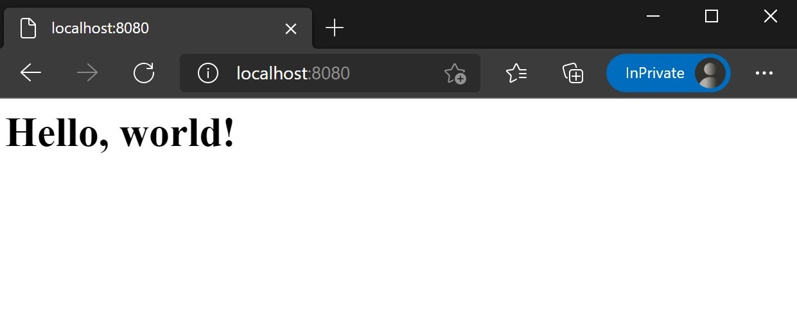
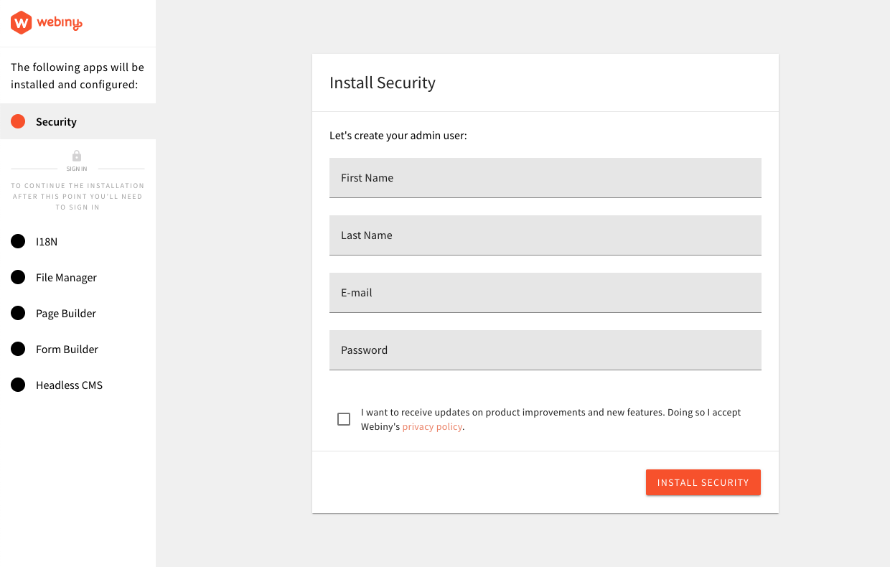
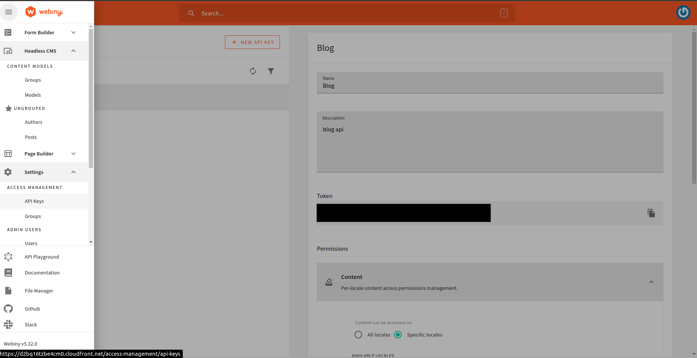
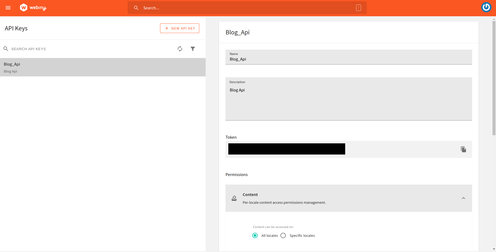
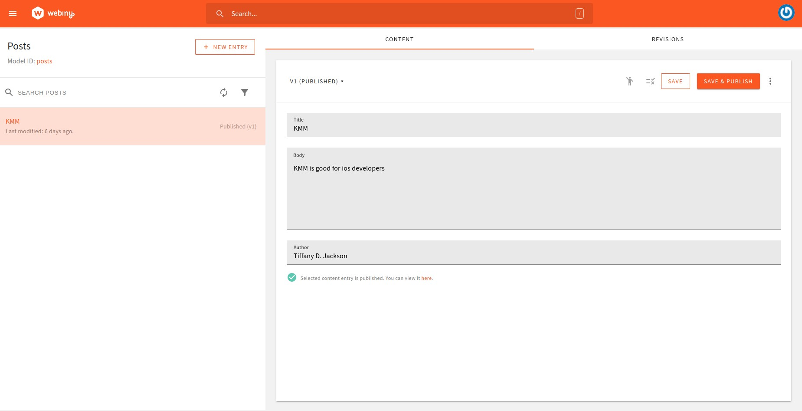
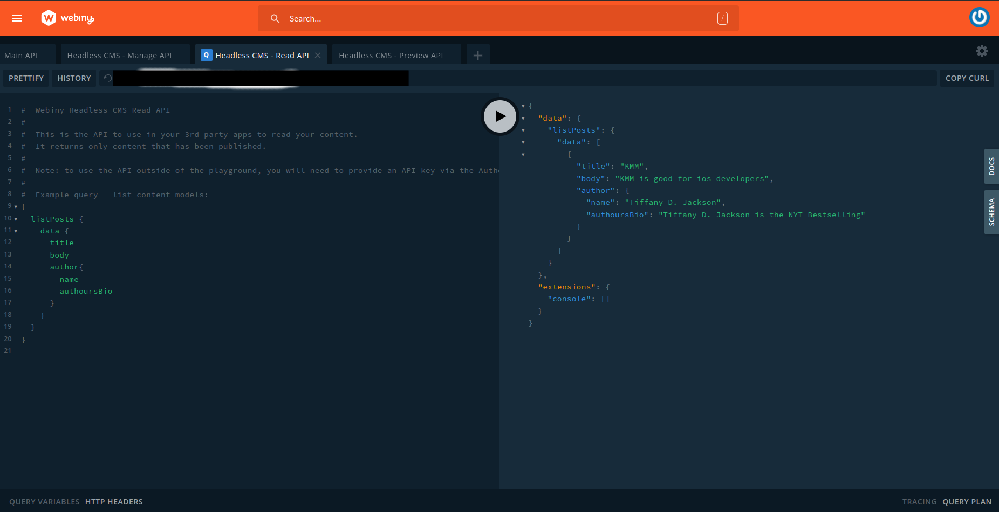
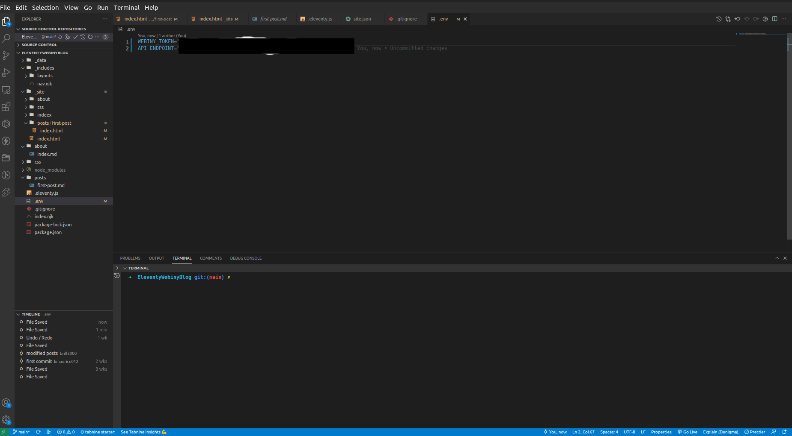

In this tutorial, we will use Eleventy (11ty) and Webiny to create a blog website, we'll learn how to connect to Webiny and use it as a source of data for our front end created with Eleventy. To learn how to use this data in the application, we will develop content models and data in the Webiny CMS. It would be nice if you have the following background knowledge before continuing.

- Have a basic understanding of JavaScript object [destructuring](https://developer.mozilla.org/en-US/docs/Web/JavaScript/Reference/Operators/Destructuring_assignment) procedures.
- Know how to access data from an API.
- Know the methods used to transfer data between components.

## What is Webiny?

Webiny is a [serverless CMS](/why-serverless) that is open source and built with advanced tools and technologies. The Content Delivery API also allows you to interact with other technologies such as Gatsby, Next.js, and Astro.
Webiny enables users to build websites and web apps in both large and small projects with minimal effort by providing all of the necessary tools, all of which are tuned to work together.

## What is Eleventy?

Eleventy, usually known as 11ty, is an easy yet effective [static site generator](https://www.cloudflare.com/learning/performance/static-site-generator/). It converts data and templates into HTML pages using JavaScript.
It builds quick sites by default, has quick construction times, and is user-friendly for beginners. It also offers a vibrant, welcoming community.

### Setting up an Eleventy site

Eleventy does not offer a mechanism to build a new project, unlike rivals like Jekyll and Hugo, thus you must first create a standard `Node.js` project before adding Eleventy as a dependency.

The first step is to create a directory in your  file system and open it using your `terminal/cmd`. The following command should take care of that:

```jsx
mkdir eleventy-blog
cd eleventy-blog
```

At the root of your project, you  need to initialize your project and install Eleventy as a dependency.

The following command should help you with that:

```jsx
npm init -y
npm install -D @11ty/eleventy
```

Once the installation is complete, inspect the contents of the project’s directory with the command `ls`. It should contain a `package.json` file, a `package-lock.json`file, and a `node_modules` directory.

Open the `package.json` file in your text editor, then replace the existing **scripts** property with the `JSON` below:

```json
"scripts": {
    "build": "eleventy",
    "start": "eleventy --serve"
  },
```

Here we have two scripts:

```jsx
build //-builds the website's files
start //-runs the web server locally on http://localhost:8080.
```

We will use the [Nunjucks](https://mozilla.github.io/nunjucks/) templating language for this project. Nunjucks is a common choice for many Eleventy projects. (Depending on your preference, you could also choose a different templating language.)

In the root directory of your project, create an `index.njk` file and add the following code inside.

```html
<h1>Hello, world!</h1>
```

To start the development server run  the following command.

```jsx
npm start
```

Open **`http://localhost:8080`** in your web browser to access the web page after running the development server.

By hitting the keys Ctrl + C on your keyboard, you can exit the server at any time.



### Creating the Homepage of your blog

You’ll need to create a base template that will be applied to all the pages of the site to make your project more flexible  from the start. This is referred to as the base layout, and it needs to go into a `layouts` directory inside the `_includes` directory.

Use the following command to make the `_includes/layouts` directory:

```jsx
mkdir -p _includes/layouts
```

Inside the _includes/layouts directory, create a `base.njk` file and paste the following code inside.

```html
<!DOCTYPE html>
<html lang="en">
<head>
  <meta charset="UTF-8">
  <meta name="viewport" content="width=device-width, initial-scale=1.0">
  <title>{{ title }}</title>
</head>
<body>
  <header>
    <h1>{{ title }}</h1>
  </header>
  <main>
    {{ content | safe }}
  </main>
</body>
</html>
```

This will be the boilerplate that will serve as the foundation for all the pages on the website.

The contents in double curly braces are `Nunjucks` variables that will be replaced accordingly when a derivative page is being built.

The **`{{ title }}`** variable will be supplied through the page’s front matter block while the **`{{ content }}`** will be replaced with all incoming page content that is not part of the front matter. The latter is piped through the safe filter to prevent it from being escaped.

Let's go back to the `index.njk` file in your project root, and modify it as shown below:

```html
---
title: Homepage
layout: layouts/base.njk
---

<h1>Welcome to this brand new Eleventy website!</h1>
```

The front matter of the file is made up of the content on either side of the triple dashes, while the rest of the file's content will be sent to your layouts. The title and file layout are accordingly specified in the front matter.

Head over to the localhost URL of your website to see the changes


As you can see in the above picture, the `base.njk` template on the home page is now in effect.

### Adding A **Navigation Menu**

You should put all of the website's components under the `_includes` directory. The contents of the `_includes directory` are partial files that can be placed in your layout to facilitate reuse.

In this section, we are going to create the navigation menu as a partial, and include the base layout.

In the `_includes` directory, create a new file named `nav.njk` and paste the code below.

It is the markup for the top navigation bar.

```html
<nav class="navbar is-light" role="navigation" aria-label="main navigation">
  <div class="navbar-start">
    <div class="navbar-item has-text-weight-bold">
      My Eleventy Blog
    </div>
  </div>
  <div class="navbar-end">
    <a href="/" class="navbar-item">
      Home
    </a>

    <a href="/about" class="navbar-item">
      About Me
    </a>
  </div>
</nav>
```

After saving the `nav.njk` file, open up the base template file `(_includes/layouts/base.njk)`
 in your editor. Include the new navigation partial in this file through the syntax shown below:

```html
<!DOCTYPE html>
<html lang="en">
  <head>
    <meta charset="UTF-8" />
    <meta name="viewport" content="width=device-width, initial-scale=1.0" />
    <title>{{ title }}</title>
  </head>
  <body>
    **<header></header>**
    <main>
      {{ content | safe }}
    </main>
  </body>
</html>
```

In your browser, the site should look like this:


The navigation menu ought to appear exactly as it does in the aforementioned screenshot when you check the home page once more. The site's title, "My Eleventy Blog" is hard-coded into the navigation component, but this is not ideal because it is likely that you will repeat the title elsewhere on the site. If you change the title later, finding all the places it was used will be difficult.

Providing this value using a [global data file](https://www.11ty.dev/docs/data-global/) is a preferable strategy. These are `JSON` files placed in the _data directory at the project root that provides global data accessible to all template files.

At the project's root directory create `_data` directory , followed by a `site.json` file within it. Open  and paste the following code  inside the `site.json` file.

```html
{
  "title": "My Eleventy Blog",
  "url": "https://example.com/",
  "language": "en-US",
  "description": "A simple blog with awesome content"
}
```

Return to the `nav.njk` and replace the hard-coded site title with the appropriate variable.

```jsx
. . .
<div class="navbar-item has-text-weight-bold">
  {{ site.title }}
</div>
. . .
```

This tiny modification makes creating and updating global data much simpler while maintaining the  same appearance and feel of the website.

It's important to keep in mind that global variables are scoped to the name of the `JSON` file, which is why we used `{{site.title}}` above.You can create other data files as needed, and use them in your templates.

Return to the `index.njk` file in the root  of your projects directory and update its content as shown below so that it uses the site title and description:

```html
---
title: Homepage
layout: layouts/base.njk
---

**<section class="hero is-medium is-primary is-bold">
  <div class="hero-body">
    <div class="container">
      <h1 class="title">{{ site.title }}</h1>
      <h2 class="subtitle">{{ site.description }}</h2>
    </div>
  </div>
</section>**
```

In the browser, the site should look like this:


### Styling

Create a `CSS` folder at the root, followed by a `style.css` file within it. Inside the `style.css`, import the **[Bulma](https://bulma.io/)** `CSS` framework by using the  code below.

```jsx
@import "https://cdn.jsdelivr.net/npm/bulma@0.9.2/css/bulma.min.css";
```

Next, create an `.eleventy.js` file in your project root. This is where Eleventy does its configurations similar to `_config.yml` file in `Jekyll` projects.

Paste the following code inside `.eleventy.js.`

```jsx
module.exports = function (eleventyConfig) {
  // Copy the `CSS` directory to the output
  eleventyConfig.addPassthroughCopy('css');

  // Watch the `CSS` directory for changes
  eleventyConfig.addWatchTarget('css');
};
```

Your need to restart your server before the changes take effect. You`ll need to do this every time you modify this file.

You won't notice any changes in the browser right now because the style sheet hasn't been linked to any template. Go ahead and add it to the `base.njk` template as shown below.

```html
<!DOCTYPE html>
<html lang="en">
  <head>
    <meta charset="UTF-8" />
    <meta name="viewport" content="width=device-width, initial-scale=1.0" />
    <link rel="stylesheet" href="/css/style.css" />
    <title>{{ title }}</title>
  </head>
  <body>
    <header></header>
    <main>
      {{ content | safe }}
    </main>
  </body>
</html>
```

Output


### Creating the Homepage of your blog

Currently, there is a non-existing “About” Page in the navigation menu. We will change that

By creating a unique layout for static pages, and afterward the about page. Inside the `_includes/layouts` folder, create a `page.njk` file. This will be the layout for all static pages on our site.

Open up the file you've just created and paste the following code inside. The front matter **layout** property is used to indicate that the page layout should inherit from the previously created `base.njk` template(known as [layout chaining](https://www.11ty.dev/docs/layout-chaining/)). It allows us to reuse a template while adding unique elements that are specific to the new template, which helps avoid unnecessary repetition.

```html
---
layout: layouts/base.njk
---

<article class="page-layout">
  <div class="container">
    <div class="columns">
      <div class="column is-8 is-offset-2">
        <div class="content mt-5">
          <h1>{{ title }}</h1>
          {{ content | safe }}
        </div>
      </div>
    </div>
  </div>
</article>
```

Now that we have the page layout, we can create the “About” page.  To do this, create a new directory in the project root named about,followed by an `index.md` file within it. Add the following code to the file:

```html
---
title: About Me
layout: layouts/page.njk
---

I am a person that writes stuff.
```

Go to `https://localhost:8080/about.` The page should load correctly with the specified layout.


Creating other pages can be done the same way.

### Creating Posts

A page can be created similarly to a blog entry. At the project root, you should first create a directory called `posts` to house all articles.

The layout for posts will be different, though. The format will be identical to that of `pages`, but you'll add a date to make it stand out. It's a good idea to design a separate layout for each post and page as you'll probably need distinct layouts for each in a real-world project.

Inside the `_includes/layouts` directory, create a new `post.njk` file and paste the following inside:

```html
---
layout: layouts/base.njk
---

<section class="page-layout">
  <div class="container">
    <div class="columns">
      <div class="column is-8 is-offset-2">
        <article class="content mt-5">
          <h1 class="title">{{ title }}</h1>
          <p class="subtitle is-6">
            Published on: <time datetime="{{ page.date }}">{{ page.date }}</time>
          </p>
          {{ content | safe }}
        </article>
      </div>
    </div>
  </div>
</section>
```

Very much like the `page.njk` template, the post template extends the base template with additions that make sense for posts (such as the date of publication).

To use this template, create a new file in your `posts` directory called `first-post.md`, and paste the following inside:

```html
---
title: My First Blog Post
description: This is the first post on my blog
tags: post
date: 2021-06-19
layout: layouts/post.njk
---
```

You’ll find this post in your `posts` directory. Go ahead and edit it and rebuild the site to see your changes. You can rebuild the site in many different ways, but the most common way is to run ``eleventy --serve``, which launches a web server and auto-regenerates your site when a file is updated.

Head over to `http://localhost:8080/posts/first-post` in your browser. Notice how the URL corresponds to the location of the file in the project (excluding the extension). This is how URLs are handled by default, but they can be changed to some other format through the permalink key.


Although the post is successfully shown, take note of how the date is now formatted. Eleventy, unlike the majority of other **`SSGs`**, does not include built-in formatting options for dates, which makes it difficult for users to read. This implies that to get a more legible format in Eleventy, you must utilize an external package.

### Filters in Eleventy

Eleventy supports  [filters](https://www.11ty.dev/docs/filters/) that can be used to change the content in a variety of ways. For instance, the safe filter that was used before prevents HTML content from being escaped, and there are additional built-in ones like a slug for converting text into strings that may be used in URLs. Additionally, you can include your  unique custom filters and utilize them with any template. The configuration file allows for these adjustments.

To format the date, we will add a lightweight JavaScript library for date formatting known as  [Luxon](https://moment.github.io/luxon/). The following command should take care of that for us. Open the `.eleventy.js` and update its contents with the following

```jsx
**const { DateTime } = require('luxon');**

module.exports = function (eleventyConfig) {
  // Copy the `css` directory to the output
  eleventyConfig.addPassthroughCopy('css');

  // Watch the `css` directory for changes
  eleventyConfig.addWatchTarget('css');

  **eleventyConfig.addFilter('readableDate', (dateObj) => {
    return DateTime.fromJSDate(dateObj, { zone: 'utc' }).toFormat(
      'dd LLL yyyy'
    );
  });**
};
```

How to apply a unique filter to Eleventy is explained in the highlighted lines.

Save the config file and restart the server so that the changes take effect.

Then use the **`readableDate`** filter in the `_includes/layouts/post.njk` template as shown below to format the post date according to the specified layout.

```jsx
. . .
<p class="subtitle is-6">
  Published on: <time datetime="{{ page.date }}">{{ page.date | readableDate }}</time>
</p>
. . .
```

*Displaying Posts on the Homepage*

It is always a good idea to list your posts on the homepage. We will use `Eleventy’s` [collections](https://www.11ty.dev/docs/collections/) feature to implement this functionality.

Update your `index.njk` file with the highlighted code below:

```jsx
---
title: Homepage
layout: layouts/base.njk
---

<section class="hero is-medium is-primary is-bold">
  <div class="hero-body">
    <div class="container">
      <h1 class="title">{{ site.title }}</h1>
      <h2 class="subtitle">{{ site.description }}</h2>
    </div>
  </div>
</section>

<section class="postlist mt-3 pt-3">
  <div class="container">
    <h2 class="title has-text-centered mt-3 mb-6">Recent posts</h2>
    <div class="columns">
      
        
          <div class="column">
            <div class="card">
              <header class="card-header">
                <p class="card-header-title">
                  {{ post.data.title }}
                </p>
              </header>
              <div class="card-content">
                <div class="content">
                  {{ post.data.description }}
                </div>
              </div>
              <footer class="card-footer">
                <a href="{{ post.url }}" class="button is-fullwidth is-link card-footer-item">Read article</a>
              </footer>
            </div>
          </div>
          
      
    </div>
  </div>
</section>
```

After saving the file, go to the homepage in the browser to see the results. It should look similar to the screenshot below.


### Setting up and deploying a Webiny project

#### Prerequisites

Before we proceed make sure you have the following:

1. Node version 14 or greater. If you don't have `Node.js` installed you can download it using the link below. [Node js](https://nodejs.org/en/).
2. Yarn version `^1.22.0 || >=2`
3. AWS account and user credentials-In order to deploy Webiny, you must have a valid [AWS account and user credentials](https://www.webiny.com/docs/infrastructure/aws/configure-aws-credentials) set up on your system.

     Click the link above to set up your AWS Account.

## Set up Webiny

Once you have put all the necessary things in place, run the following command :

```bash
npx create-webiny-project my-new-project
```

Webiny currently supports two storage types: DynamoDB and DynamoDB+Elasticsearch. Choose the option that best meets your needs.

## Deploy Webiny

Once the Webiny project is created, we are going to deploy it into your AWS account. The following command should take care of that.

```bash
cd my-new-project
yarn webiny deploy
```

The first deployment might take a little bit long but once the deployment is done, You will be given the URL through which you can access your **Admin Area** where you will  be required to create an **admin user.** 

## Authenticating with Webiny's API

When the deployment is complete, you can click on the admin Admin app, which will take you to the admin area, where you must create an admin user. The admin page is depicted in the image below.



After creating the **admin user** and all the installations are done, you’ll be redirected to the dashboard.


In the Headless CMS card, click the NEW CONTENT MODEL button to go to the area where we will create our content models.

Next, We are going to create a new Module named “Authors”

The **Authors** content model is depicted in the image below. You can make it exactly like this or customize it to your specifications.


Create another model named **Posts** and its contents should look like the image below.


After you've completed the preceding processes, we'll need to connect our Eleventy application to the Headless CMS so that we can always perform `GraphQL` API requests. To begin this step, navigate to the **ACCESS MANAGEMENT** tab on the dashboard.



Click on API Keys, it should redirect you to a page similar to the one below.


Go ahead and create a new `API` Key. The output should is shown in the image below



Select All groups from the CONTENT MODEL GROUPS drop-down. Then, in the Access Scope drop-down, select All models. Select All entries in the CONTENT ENTRIES drop-down.


The image below shows all the appropriate settings for the File Manager.


When you're finished, click the SAVE API KEY button and  copy the API key to a safe location. This will be used later to authenticate with the `GraphQL` API.

## Adding Content

Let's start adding content to our models. Go to Headless **`CMS > Ungrouped > Authors`** and click on New entry after clicking on the menu icon. Fill in the blanks, then hit the save & publish button. You can repeat this as many times as you like.


Fill in the entries for the Post model in the same way. Then press the save and publish button.



## API Playground

To view the data that we will be fetching on the front end of our application, we can use the built-in API from Webiny Headless CMS. Click the menu icon, then select API Playground.

The tabs at the top of the page contain four APIs. Headless CMS - Read API should be selected. After that, you can look into your content structure and schema (via the right-side panel). Directly beneath the tabs is a URL string. Data will be retrieved using this URL. Keep the URL somewhere safe in case we need it later.



 *Fetching Data For Pages Using Webiny Headless CMS*

At this point, we have a definite understanding of how these two tools work, but how do we integrate them? This question seems daunting until you find out that `webiny’s GraphQL` APIs

are non-agnostic, they are just like any `graphql API`, all that is needed is a client that can query the `graphql` endpoint that Webiny defines.

To obtain the endpoint, enter this command in your console.

```jsx
yarn webiny info --env dev
```

## Setting up the token in our Eleventy Project

We now need to retrieve the security token that we had generated previously. We need this token to authenticate our queries to this endpoint. We shall save this token in a `.env` file to ensure that it cannot be easily accessed by malicious users.

Create a file `.env` and add a variable `WEBINY_TOKEN` with the token as its value



## Querying the API using Axios

There are many API clients out there we can use to query a `graphql` end-point, some are specialized for graphql such as Apollo or `graphql-request`, while these are the optimal solutions we shall avoid using them in this guide to reduce complexity and a common `HTTP API` client Axios. One can use the FETCH API which comes as a default and requires no dependencies but it has fewer features than what Axios has to offer.

Let’s install Axios in our Eleventy Project;

```jsx
npm install axios
```

In Eleventy it is most common to place `backend` querying files  under the _data directory and we shall do the same. Create a file called `data.js` and add the contents below, we shall get to the step-by-step breakdown in a moment.

```jsx
let axios = require('axios');
let data = JSON.stringify({
 query: `{
 listPosts {
   data {
     title
     body
     author{
         name
         authoursBio
     }
   }
 }
}`,
 variables: {}
});
 
let config = {
 method: 'post',
 url: `${process.env.API_ENDPOINT}`,
 headers: {
   'Authorization': `Bearer ${process.env.WEBINY_TOKEN}`,
   'Accept': 'application/json',
   'Content-Type': 'application/json'
 },
 data : data
};
 
 
 
 
const getPosts = async () => {
   try {
     const {data}  = await axios(config)
     return data && data.data && data.data.listPosts && data.data.listPosts.data ? data.data.listPosts.data : []
   } catch (e) {
     throw new Error('There was a problem getting Post', e);
   }
 };
  exports.getPosts = getPosts;
```

The first step is to import the Axios library,

```jsx
var axios = require('axios');
```

We then need to define the query we are sending to the end-point as shown below, in this case,we are trying to fetch all the blog posts and query the title, body, and author.

```jsx
const data = JSON.stringify({
 query: `{
 listPosts {
   data {
     title
     body
     author{
         name
         authoursBio
     }
   }
 }
}`
 variables: {}
});
```

We can define Axios configurations to tell Axios what format we want the data to be in, and also add the token to the request. The method should be of type post, and the data type should be `JSON`, we should also have an authentication header with the bearer token set to it as shown below

```jsx
let config = {
 method: 'post',
 url: `${process.env.API_ENDPOINT}`,
 headers: {
   'Authorization': `Bearer ${process.env.WEBINY_TOKEN}`,
   'Accept': 'application/json',
   'Content-Type': 'application/json'
 },
 data : data
};
```

If you are not familiar with `.env` files, it's quite simple. You just use `process.env{VARIABLE_NAME}` to access the variables that you set within your `.env` file, then you can use whatever restrictions to access the file that you see fit.

The query we defined is set as the data (body, in case you are using fetch), to be sent to the endpoint.

Create  a function `getPosts`, we should define it as an asynchronous function which will return an array containing a post object with an author object nested inside of it.

```jsx
const getPosts = async () => {
   try {
     const {data}  = await axios(config)
     return data && data.data && data.data.listPosts && data.data.listPosts.data ? data.data.listPosts.data : []
   } catch (e) {
     throw new Error('There was a problem getting Post', e);
   }
 };
```

It's prudent that you make sure the function returns the required data type in this case an array, this is good programming practice, you should avoid working with a function whose return type is uncertain.

Export the function to use it in the next step.

We can then create a `post.js` that calls the `getPost` function and return an array of posts as its return type

```jsx
const { getPosts } = require('./graphql/data');
 
module.exports = async () => {
 const posts = await getPosts()
 return {
   posts,
 };
};
```

Since we have exported this module, it means we can use the posts across the application that includes displaying them on our pages.

We will edit our `index.njk` file displaying a card for each blog post we have in our database, displaying the author of the blog post too.

```jsx
<div class="columns">
     
       <div class="column">
         <div class="card">
           <header class="card-header">
             <p class="card-header-title">
               {{ post.title }}
             </p>
           </header>
           <div class="card-content">
             <div class="content">
               <h6>Author: {{ post.author.name }}</h6>
               <div style=" white-space: nowrap; width: 200px; overflow: hidden;   text-overflow: ellipsis; ">{{ post.body }}</div>
             </div>
           </div>
           <footer class="card-footer">
             <a href="#" class="button is-fullwidth is-link card-footer-item">Read article</a>
           </footer>
         </div>
       </div>
     
   </div>
```

To get the posts we call the file in which the `getPosts` function is called  which gives us an object containing a key posts hence `post.posts` gives us an array of blog posts

```jsx

```

We loop through the posts using a for loop and display the title author name and body of the blog post and also a button that should redirect you to that particular blog post.


### Conclusion

When you start building your blog, having a CMS that helps you manage how content is structured is a huge help, and `Webiny Headless CMS` is a great place to start.

I hope this article has given you a basic understanding of how JavaScript can be used to create practical and real-world solutions to problems. Thank you for your time!

**Full source code:** [https://github.com/webiny/write-with-webiny/tree/main/tutorials/EleventyWebinyBlog](https://github.com/webiny/write-with-webiny/tree/main/tutorials/EleventyWebinyBlog)