This article will explain how to create a blog using Webiny Headless CMS and Hugo, one of the most well-liked open-source static site generators. We'll look at how to install Webiny and use it. We'll go over how to build content models as well as how to get data from Webiny. Hugo themes will be used to customise the look and feel of our blog's interface. Now, without further ado, let's begin.

## Prerequisites

Before beginning, make sure you have completed the following:

- Create a local [AWS account](https://www.webiny.com/docs/infrastructure/aws/configure-aws-credentials) and user credentials.
- Make sure [Node.js](https://nodejs.org/en/) >= 14.15.0 is installed.
- Make sure [yarn version 1.22.0](https://yarnpkg.com/en/docs/install) or greater is installed because Webiny is compatible with both yarn versions.
- Fundamental knowledge of the [Hugo static site generator](https://gohugo.io/getting-started/quick-start/)

## What is Webiny?

Webiny is an open-source, developer-friendly CMS that is supported by cutting-edge tools and technologies like Node, React, and a GraphQL API. You have the option to integrate with tools like Gatsby, Nextjs, and Astro through the Content Delivery API. Webiny supports developers in the design, development, and deployment of applications on top of the serverless infrastructure.

Developers can create and run applications without having to worry about managing servers thanks to Webiny's integrated page builder, form builder, file manager, admin area, and headless CMS, which runs on top of AWS Lambda, DynamoDB, and S3. Webiny provides all the tools you need, all of which are optimised to work together seamlessly and performantly, allowing users to build websites and web applications in both large and small projects without the hassle.

## Setting up our Webiny Headless CMS

Using the following command, we advise starting a new Webiny project:

```bash
npx create-webiny-project
```

Everything will be set up for you automatically when you run the command on the terminal of your choice. Then, adhere to the on-screen setup instructions, where you must respond to a few questions about the project, including one about project deployment.

You will be prompted to select the database you want to use as well as the AWS region where your project will be deployed. Due to the fact that this project is not particularly large, we used DynamoDB here.

We'll deploy your brand-new project to your AWS account as soon as it is finished.

```bash
cd astro-blog && yarn webiny deploy
```

.png)

Your application will first be built after running this command. The application will then be deployed to your AWS account along with the necessary cloud infrastructure resources.

Please take note that the first deployment may take up to 20 minutes. even more. Please be patient and wait for the process to be completed even though it may appear that nothing is happening in the terminal. There will be an error displayed if something goes wrong.

You will be given a URL to access your admin dashboard after the deployment is complete.

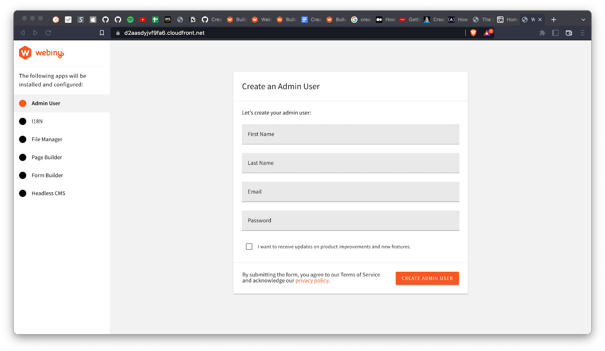

If you can’t deploy to an AWS account or wish to skip this step, please fill out this form which will give you access to a fully-featured Webiny instance:

[https://webiny.typeform.com/to/VYffkZlR](https://webiny.typeform.com/to/VYffkZlR)

## Creating Models

On the admin dashboard, select the menu icon, and then select Headless CMS > Models.

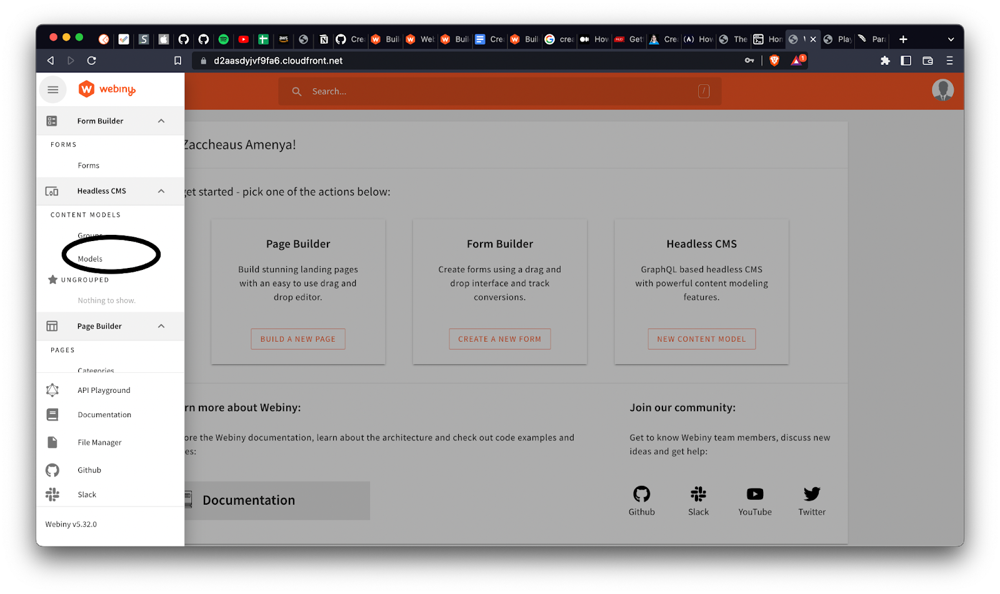

Let's begin by making models of our authors. Click on add model icon a modal will open and fill out the form as shown below.

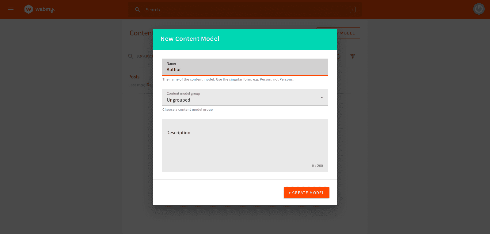

After you've finished, you'll be taken to a new page where we'll be creating our content type. The drag and drop functionality in Webiny makes it simple to create different content types. The content types for our Authors model will be created using this. We'll complete the following:

- a text field where name is the value.
- the value description is in a long text field.
- a file field whose value is a picture.

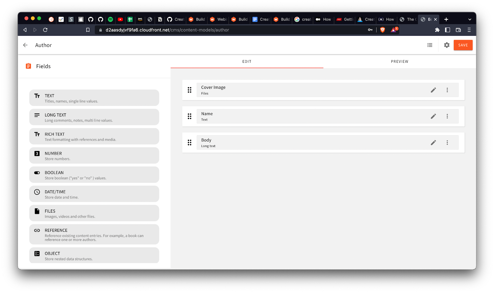

Additionally, we'll make a Posts model and populate it with the following information:

- A text field with the value title
- A text field with the value of slug.
- A files field with the value featured image
- A text field with the value description
- A rich text field with the value body
- A reference field with the value authors

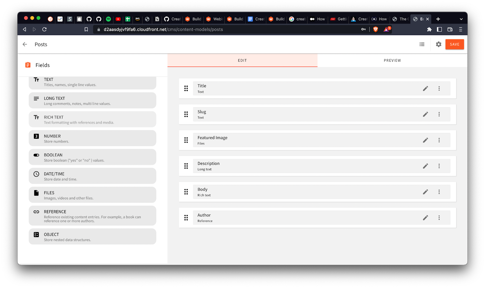

## Adding Content

Let's give the models we made some content. Go to **Headless CMS > Ungrouped > Authors** by clicking on the menu icon, then select New entry. After completing the entries, press the save & publish button. You are free to repeat this as often as you like.

.png)

On the Above Image shows the section of adding Authors. These Author  Details will be linked to content that is created. 

Below Image  Shows the section of adding new contents entry and how to save your content or publish to live environment.

.png)

## Using the GraphQL API

Let’s see the data we are fetching from Webiny Headless CMS using their built-in API playground.

After selecting the menu icon, select API Playground.

```jsx
 data: {
    query: `{
        listPosts{
          data{
            id
            title
            slug
            description
            body
            featuredImage
            author{
              name
              coverImage
              body
            }
          }
        }
      }`
}
```

In the tabs at the top of the page, you'll see a list of four APIs. To read the API, select HeadlessCMS. You can then (using the right-side panel) explore your content structure and schema from there. A URL string can be found directly beneath the tabs. This URL will be used to retrieve data. When we get to that step, copy the URL and store it safely.

.png)

The info command is available in the [Webiny CLI,](https://www.webiny.com/docs/core-development-concepts/basics/webiny-cli) and it returns the URLs for each of the three CMS GraphQL API types in addition to other useful data.

This Command is very helpfull, this single command will display your project urls which include the environment to Main GraphQL API url, Headless CMS GraphQL API urls, Admin app url and Public website urls

 The command is run from your project root, like so:

```bash
yarn webiny info --env dev
```

## Setting up Roles and Permissions

Navigate to **Settings > Access Management > API key** at this time. 

Click on New Api key to fill in the required fields in order to create your API key. 

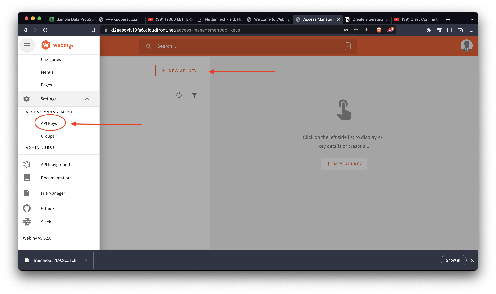

Select All Locales under Content by swiping down Then give the Headless CMS and File Manager full access. If specific permissions are required, select on the specific locals then specify the specific access rights below.

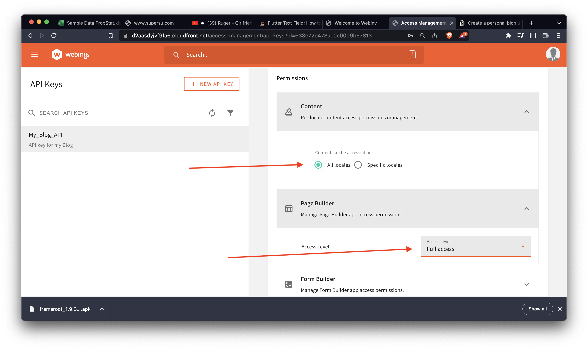

An API Key will be generated after you save the settings. 

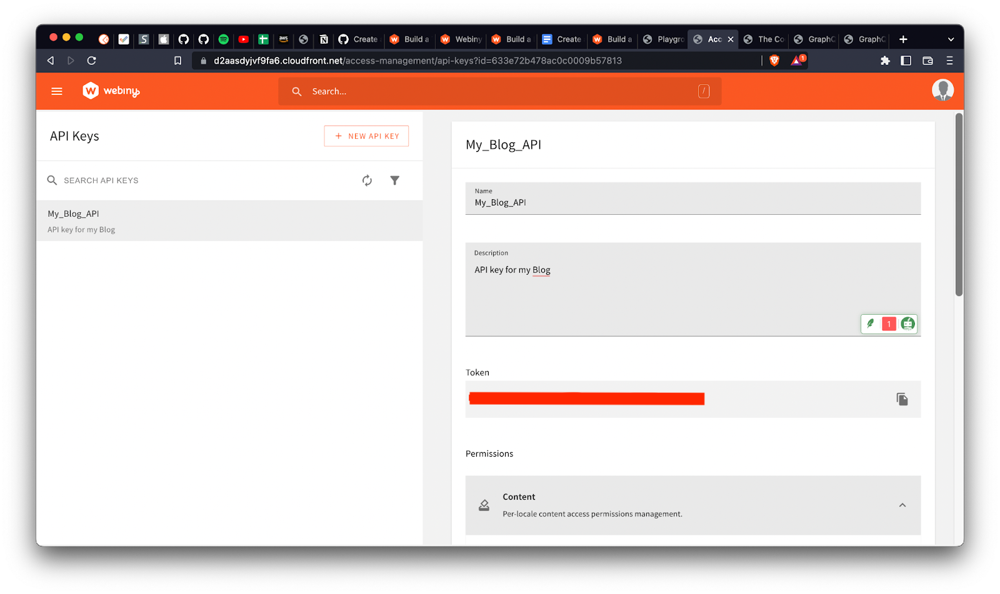

Copy that and store it along with your API URL in a secure location. We will need it to authenticate fetching data with Javascript Axios  later on.

## What Is Hugo?

With the help of Hugo, a static site generator, you can create a website with little to no coding. You can typically write your content in a basic markup language, like Markdown, using static site generators.

Following that, the static site generator turns your content into static HTML files. It styles or applies any templates to your pages before presenting them to the user.

Hugo offers a library of pre-built themes and website layouts that you can select from. Once a theme has been downloaded, you can begin creating your content. Hugo allows you to write content in a variety of formats.

## What Are Hugo Themes?

Find a theme to get started with by looking through the list of Hugo Themes. Additionally, you can choose a theme based on various categories and filter out designs made especially for blogs, portfolios, and other websites. You can find the themes [here](https://themes.gohugo.io/)

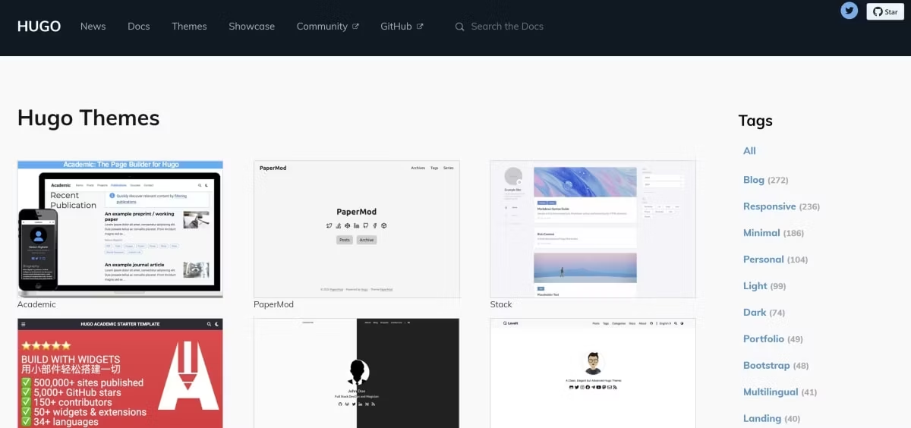

A theme can be clicked to view more details. To get started, download the theme from this page. We can also preview what the theme will look like once you deploy it.

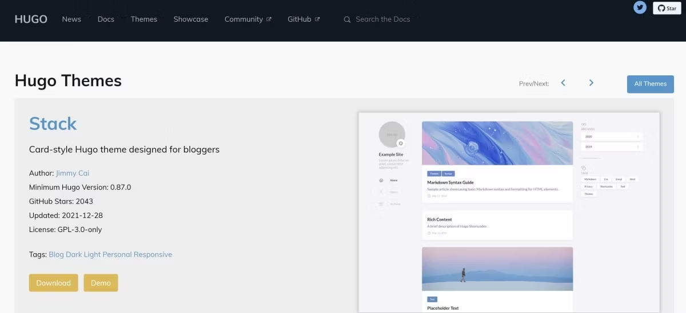

Most of the themes will have dummy data as placeholders. When we modify the theme, we can change these details however you like.

## What Are the Benefits of Using Hugo?

Hugo produces static web pages and is relatively lightweight, so your finished website and its content can load very quickly. As a result, visitors to your website will wait less while using it.

Once the user views the page, all of the content is static and does not change. As a result, you do not need to be concerned about repeated server requests. Additionally, you don't have to worry about databases or handling dynamic data.

Additionally, using a Hugo site doesn't require highly developed programming abilities. However, because you have direct access to the code, you can completely alter it however you like if you so choose.

## Step 1: Install Hugo

First we have to Install the Hugo binary 

Homebrew and MacPorts, package managers for macOS, can be installed from [brew.sh](http://brew.sh/) or [macports.org](http://macports.org/) respectively. See [install](https://gohugo.io/getting-started/installing) if you are running Windows or other platforms.

```bash
brew install hugo

# or

port install hugo

```

To verify your new install:

```bash
hugo version
```

## Creating Hugo site

Now to create A Hugo site:

- Launch the command prompt
- Go to the directory where you keep your code repositories.
- Run the following to create a new Hugo site in a folder name, MyBlog

```bash
hugo new site MyBlog
```

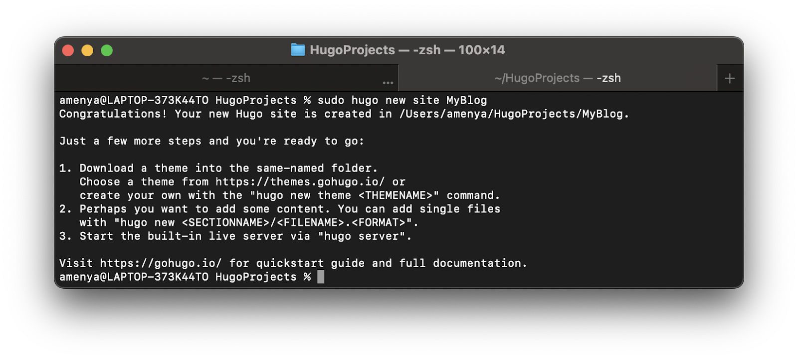

## Installing a theme

Hugo offers a variety of themes that you can select from at [https://themes.gohugo.io].

It will be necessary to install a theme before you can view your website. There are a ton of themes available for Hugo, so hopefully you'll find a few you like.

I'm going to use the [Anubis theme](https://github.com/Mitrichius/hugo-theme-anubis/archive/master.zip), which is a very basic theme for blogs, extract the file. Once the files have been extracted, you should find a folder with the name hugo-theme-anubis-master. Rename this folder to anubis, and then move it into the themes folder in MyBlog.

The my-blog folder should appear as follows:

```markdown
MyBlog
├── archetypes
├── config.toml
├── content
├── data
├── layouts
├── resources
├── static
└── themes
└── anubis
```

Inside the my-blog folder you'll find a file called config.toml. Use the configuration file to help you set different options for the site.

You are now prepared to visit your site for the first time! You must find the my-blog folder in the command line. Use this command to change the directory if you just opened the command line and are currently in the home directory:

Run the following command to start your blog now:

```jsx
hugo server -D
```

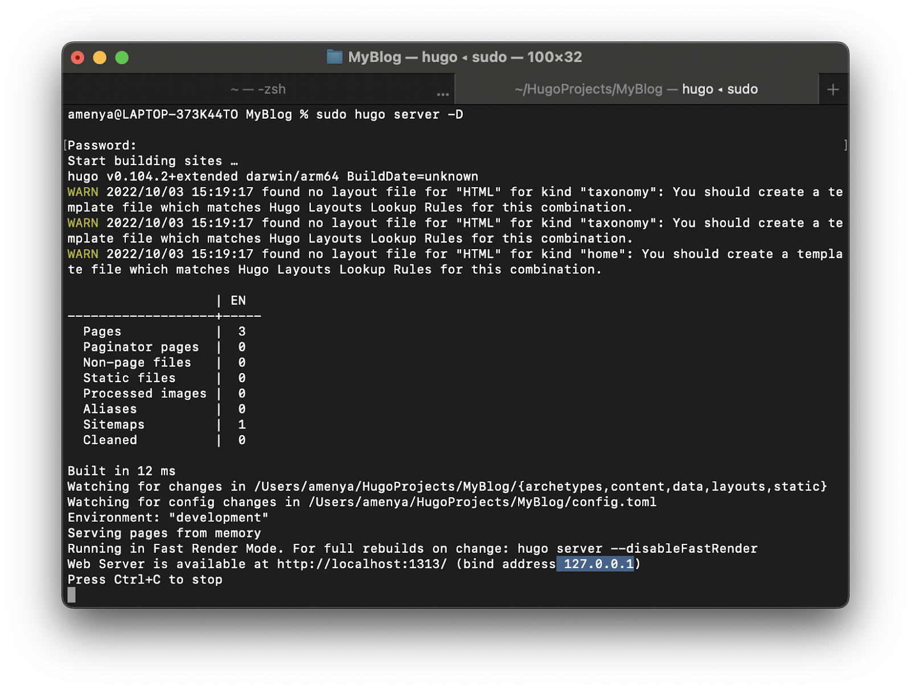

## Making GraphQLRequest Using AXIOS

To connect the Webiny CMS to our Hugo site, we'll use [Axios](https://www.npmjs.com/package/axios) as a link-building tool.

The blog post will be retrieved and displayed in JSON format with its assistance.

Utilize the following command to install Axios.

`$ npm install axios`

We first create the folder src and then the file app.js on our root file. The data will be formatted here before being saved in content after being fetched from the API.

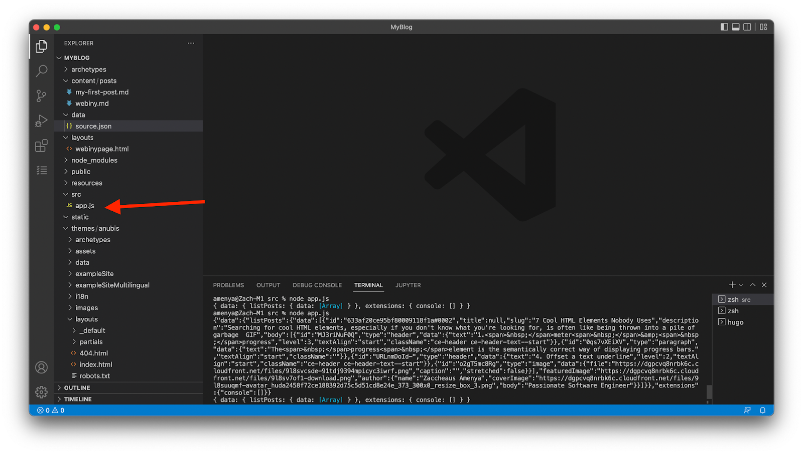

Put this code in your **app.js**

The complete code for obtaining API data, formatting it into markdown, and saving the formatted data in the contents directory can be found below.

```jsx
import axios from "axios";
import fs from 'fs'

// make API request
axios({
  url: 'https://dgpcvq8nrbk6c.cloudfront.net/cms/read/en-US',
  method: 'post',
  headers: {
    'Content-Type': 'application/json',
    Authorization: `Bearer ${private_api_key}`
  },
  data: {
    query: `{
        listPosts{
          data{
            id
            title
            slug
            description
            body
            featuredImage
            author{
              name
              coverImage
              body
            }
          }
        }
      }
      `
  }
}).then((myresult) => {
  //get Response
  var response = myresult.data

  let json = [];
  let result = [];
  let bodyjson = []
  //Strip the Json, Extract Data and format in MD
  json = response.data.listPosts.data;
  console.group("JSON Data");
  json.forEach((post) => {
    result.push("---")
    result.push("title: " + JSON.stringify(post.title)),
    result.push("date:" + " 2022-10-06T11:39:16+03:00")
    result.push("draft:" + " true")
    result.push("---")
    result.push("# " + post.slug),
    result.push(''),
    result.push('\n'),
    result.push("### " + post.description),
    bodyjson = response.data.listPosts.data.body
    bodyjson = post.body
    bodyjson.forEach((body) => {
    result.push("## " + body.data.text)
    result.push('')
    result.push("## Author:" + post.author.name),
    result.push('')
    console.log(post.body);
  });
  // update the flile blog.md
  fs.writeFile("../content/posts/blog.md", result.join('\n'), function (err) {
    if (err) {
      console.log(err);
    }
  }),
    console.log(+result.join('\n'));
}
).catch((error) => {
  console.log(error)
})
```

When you enter the following command in the terminal, the data should now appear on the side of the screen:

Since we are on the local server, open the folder src in your terminal.

```jsx
Node app.js
```

Bingo! Visit `localhost:1313` on your browser to access the website right away.

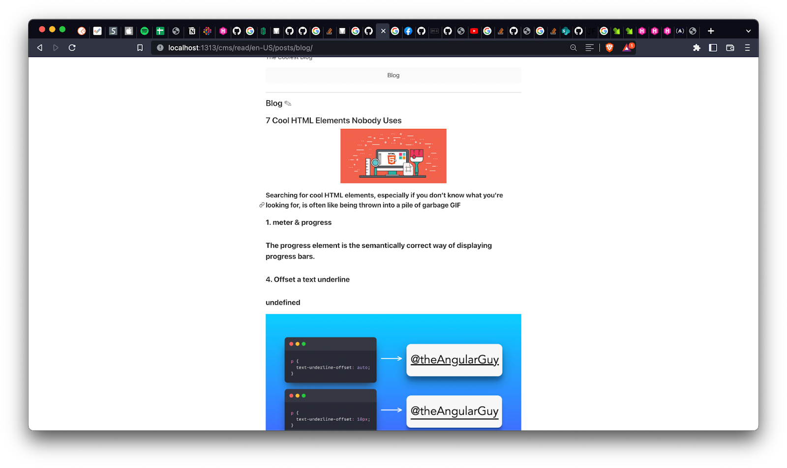

## Conclusion

This article taught us how to use the Webiny Headless CMS, configure Content Models, make Tokens, manage permissions, and test GraphQL queries and mutations using the API Playground.

We have also learned how to connect our Webiny CMS to our live website using GraphQL using Axios and Hugo.


**Full source code:** https://github.com/webiny/write-with-webiny/tree/main/tutorials/hugo-blog

---

This article was written by a contributor to the Write with Webiny program. Would you like to write a technical article like this and get paid to do so? [Check out the Write with Webiny GitHub repo](https://github.com/webiny/write-with-webiny/).
