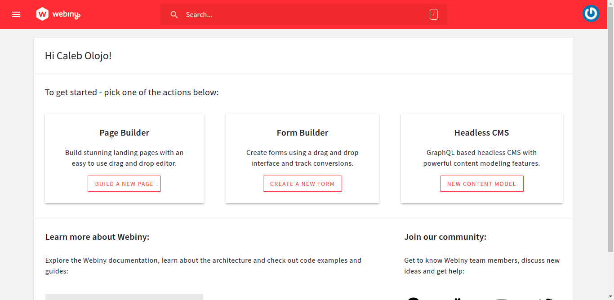
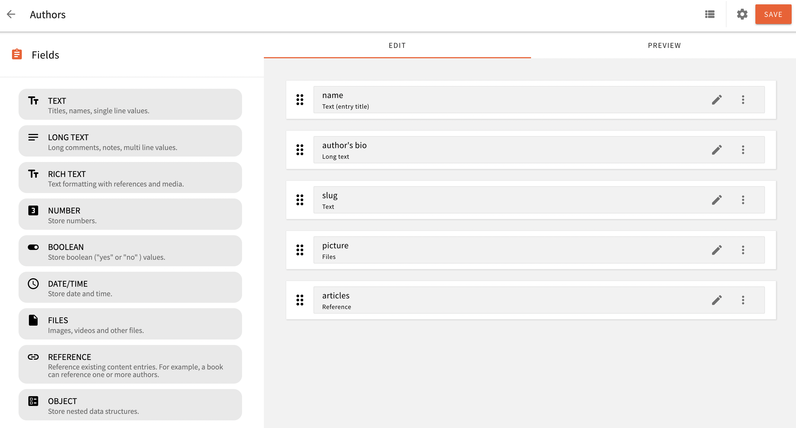
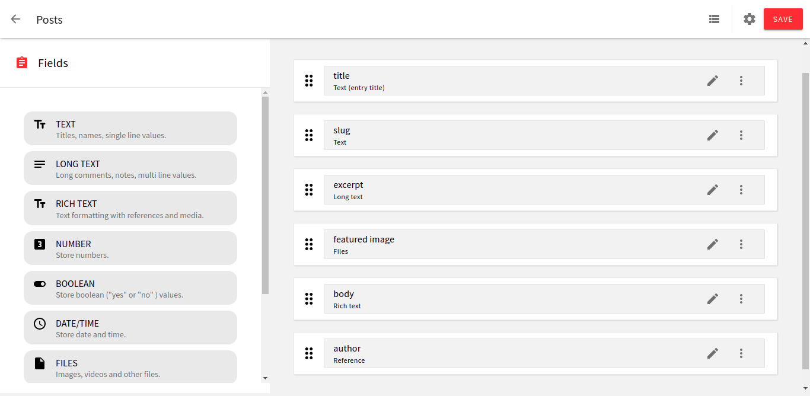
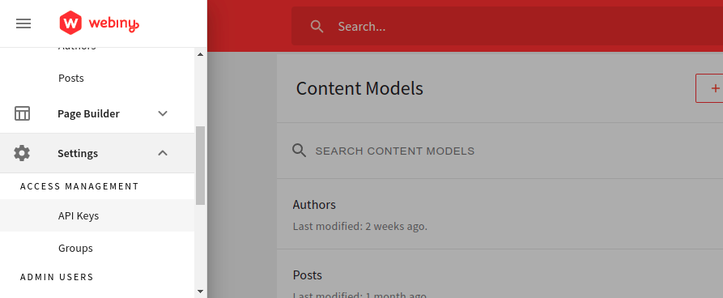
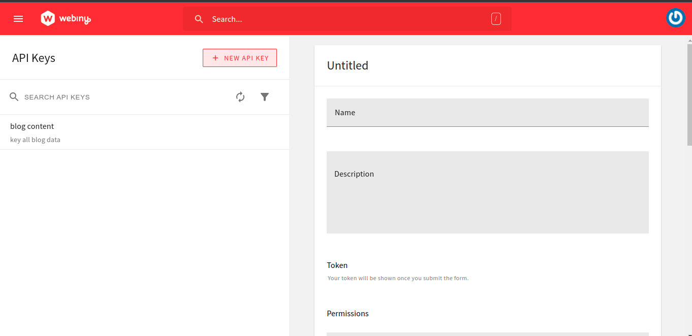
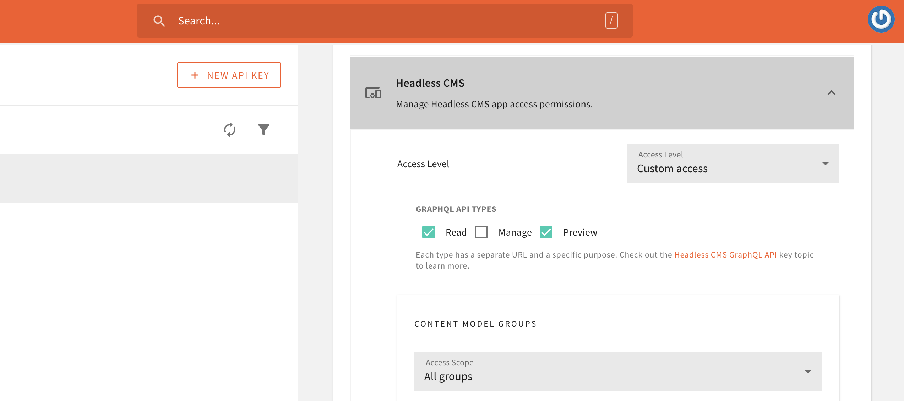
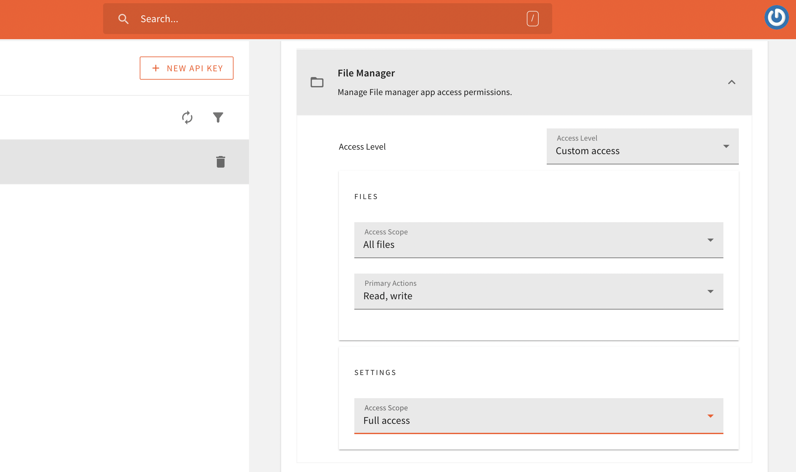
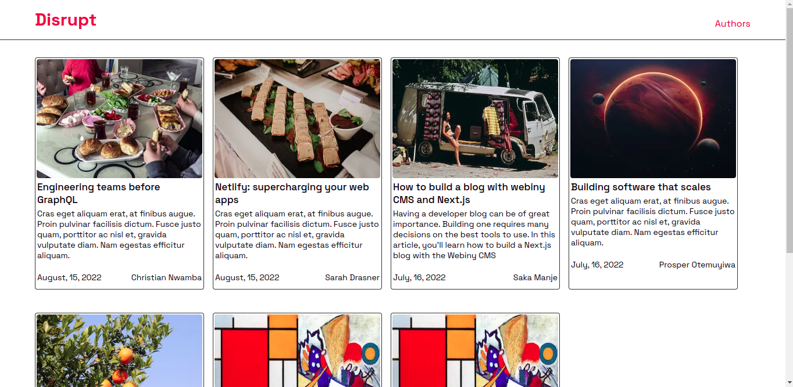
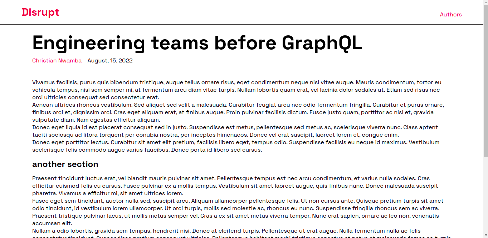
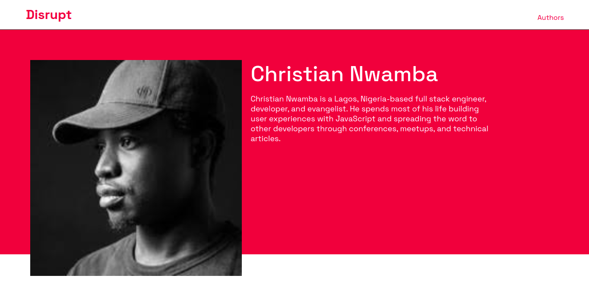

### Introduction

In this tutorial, we will build a simple blog site with Next.js and Webiny Headless CMS. We will look at how to set up Webiny and Next.js project. We will create content models & data in Webiny CMS and learn how to consume this data in the Next.js application. Before you proceed, it would be great to have the following prerequisite information.

- Know how to set up a Next.js project
- Have an understanding of React, in general
- Have a basic understanding of object destructuring operations in JavaScript
- Know how to fetch data from an API
- Have an understanding of how data is shared between components as props

Now that you have an idea of the prerequisites of what you'd need to read this article. Let's start by setting up Webiny CMS.

### Setting up a Webiny project

#### Prerequisites

To follow along with this tutorial, you need to have the following:

- [AWS account and configure your AWS credentials for programmatic access](https://www.webiny.com/docs/infrastructure/aws/configure-aws-credentials)
- Make sure you have Node.js >=14 and Yarn ^1.22.0 || >=2 installed on your system
- Star our [GitHub Repo](https://github.com/webiny/webiny-js)! 😉

Let's create a Webiny project, and you can do that by typing the command below in your terminal.

```bash
npx create-webiny-project webiny-cms
```

When you run the command, you’ll be prompted to answer some questions in the terminal, one of which is related to the type of storage options you want to use.

The two options available are **Dynamo DB** and **DynamoDB + Elasticsearch**. We’ll be selecting the first option since the use case of the project we’re building doesn’t require a large database like **Dynamo DB + Elasticsearch**

The command will install the project locally. But, to be able to use the service, you need to deploy the project with the command below into your AWS account.

```bash
yarn webiny deploy
```

Once the project is deployed, you’ll get information about your project in the terminal. The information includes the link to the admin app, the preview website, etc.

In case you did not notice the information on the first trial, you can always get them by using the command below.

```bash
yarn webiny info 
```

You’ll get a result like this in the terminal.

```bash
Environment: dev
-------------------------
➜ Main GraphQL API: https://your-unique-id.cloudfront.net/graphql
➜ Headless CMS GraphQL API:
   - Manage API: https://your-unique-id.cloudfront.net/cms/manage/{LOCALE_CODE}
   - Read API: https://your-unique-id.cloudfront.net/cms/read/{LOCALE_CODE}
   - Preview API: https://your-unique-id.cloudfront.net/cms/preview/{LOCALE_CODE}
➜ Admin app: https://your-unique-id.cloudfront.net
➜ Public website:
   - Website URL: https://your-unique-id.cloudfront.net
   - Website preview URL: https://your-unique-id.cloudfront.net
-------------------------
```

When the deployment is done, you can click on the admin `Admin app` will redirect you to the admin area where you’d be required to create an admin user. The admin page looks like the image below.


In the admin area, you’ll also be requested to install some additional services or functions like **18N**, which is short for **Internationalization**, **File Manager**, **Page Builder**, **Form Builder**, and the **Headless CMS.**

When all the installation is done, you’ll be redirected to the dashboard, it looks like the image below.



You can click on the **NEW CONTENT MODEL** button in the **Headless CMS** card, and it’ll take you to the area where you can create your content models. You can read more about the fields that you will add as you create your content models [here](https://www.webiny.com/docs/headless-cms/integrations/nextjs#authors).

The content model of the authors looks like the image below. You can choose to make it exactly like this or customize it in a way that suits your need.



This is what the **posts** content model looks like below.



When you’re done with the processes above, we’ll need to connect our Next.js application to the Headless CMS, so we can always perform requests to the GraphQL API. To start with this step, you’ll head to the **ACCESS MANAGEMENT** tab in the dashboard.



Click on **API Keys**, and you’ll be redirected to a new UI like the one below.



You can fill the form fields with all the necessary information. In the **Headless CMS** section, you should select **Custom Access** option in the Access Level dropdown. Since you selected the “Custom Access” option, you’ll be able to customize the types of GraphQL operations you want to perform.



In the **Access Scope** dropdown of the **CONTENT MODEL GROUPS**, select **All groups.** You’ll repeat the same thing for the **CONTENT MODELS**, then you’ll select **All models** in the Access Scope dropdown. In the **CONTENT ENTRIES**, select **All entries** in the dropdown.

The image below shows all the appropriate settings for the **File Manager** 



When you’re done, you can click on the **SAVE API KEY** button and copy it to a safe location. We will use this later to authenticate with the GraphQL API.

### Installing Next.js

With that step out of the way, let us begin building the blog by setting up a Next.js project. Shortly before we start, I'm assuming that you've gone through the process of spinning a running `dev` environment of the Webiny platform, which gives you access to the admin panel where you can create your content models and test them in the GraphQL playground. 

To install Next.js, we'll use the command below to get us up and running. The command does the heavy lifting of setting up a project folder — webiny-blog — for us with the necessary files.

```bash
npx create-next-app webiny-blog
```

### Overview of the files in the project

Now that we have a project structure already. Let me walk you through the folders and the files that we'll be working with in this project. Take a look at the directory structure below.

```bash
.
├── pages/
│   ├── author/
│   │   └── [author].js
│   ├── _app.js
│   ├── [slug].js
│   └── index.js
├── src/
│   └── components/
│       ├── BlogCard/
│       │   ├── style/
│       │   └── index.js
│       ├── Header/
│       │   └── index.js
│       └── utils/
│           └── helpers.js
└── styles
```

Since the goal of this project is to build a blog, the index route — index.js — will render all the blog posts or articles that have ever been written on the blog.

The `[slug].js` file is a dynamic route, as its role or whatever information that is rendered on the page changes based on the data that is passed to it. Something of the form below

```bash
https://localhost:3000/hello-world
```

Any article that has a `slug` with the string "hello-world" is rendered on the page. We'll get into this in full as we progress.

`_app.js` is the root folder in a Next.js project. Its function is a little bit similar to Create-React-App. The difference here is that instead of appending the React app to a DOM node called `"root"`, Next.js receives all the other pages, components, styles, etc., as props. Take a look at the syntax below.

```jsx
// pages/_app.js
import "../styles/globals.scss";

function MyApp({ Component, pageProps }) {
  return <Component {...pageProps} />;
}

export default MyApp;
```

The `author` route is quite different from all the other files in the `pages` route, as it is both a static and dynamic route. If you navigate to "https://localhost:3000/author" you'll get a 404 error because there's no static index route but a dynamic route present in the directory.

So, navigating to that route without appending the author's slug to the URL would result in that error. Instead of doing that, you can just navigate to the author's route by doing something similar below.

This approach of having a string, “author”, in the URL parameter of the blog page improves the UX of your application in situations where people do not have to wonder where a certain link is taking them because the URL is a little bit self-descriptive 

```bash
https://webiny-blog.netlify.app/author/codebeast
```

`src/` contains the reusable — BlogCard and Header — components that we'll use throughout the codebase.

`utils/` contains all the asynchronous GraphQL query functions and the `fetcher` function that sends the queries as a POST request to the API endpoint.

`styles/` is where the global styling and CSS variables reside.

Now that you have seen the basic functions of the files in the structure let's start by taking a look at the `fetcher` and GraphQL query functions.

### Overview of the GraphQL queries and fetcher

In the last section, we walked through the architecture of this project. Now, we'll start by understanding how the `fetcher()` and each query function work. 

We saw in the previous section that the `fetcher` function makes a `POST` request to the API endpoint, which in turn, returns the data from our content models which we've created in the Webiny Admin panel.

```jsx
// src/utils/helpers.js
async function fetcher(query, { variables } = {}) {
  const res = await fetch(process.env.NEXT_PUBLIC_WEBINY_API_URL, {
    method: "POST",
    headers: {
      "Content-Type": "application/json",
      Authorization: `Bearer ${process.env.WEBINY_API_SECRET}`,
    },
    body: JSON.stringify({
      query,
      variables,
    }),
  });

  const json = await res.json();

  if (json.errors) {
    console.error(json.errors);
    throw new Error("Failed to fetch API");
  }

  return json.data;
}
```

The snippet above shows the `fetcher` function. Let's take a moment to break down what is going on in that function block. Initially, the function itself takes in two arguments, `query` and `variables`. 

The `variables` argument receives a JavaScript object which is used when we want to get dynamic data, for example, a specific article or the slug of an author.

The variable is a little different for obtaining the profile of a particular author or a specific blog post. The syntax remains the same though, take a look at an example below.

```jsx
// src/utils/helpers.js
{
  variables: {
    PostsGetWhereInput: {
      slug: slug;
    }
  }
}
```

The fetcher function uses the native fetch API of JavaScript to get the data instead of Axios or any other third-party data fetching library because Next.js already polyfills the fetch API by default, which in turn allows us to be able to use the fetch API on the client side and for server-side operations too.

Taking a closer look at the `response` variable below, you'll notice that we're using environment variables to store our API key and the URL to the API endpoint.

```jsx
// env.local
process.env.NEXT_PUBLIC_WEBINY_API_URL 

process.env.WEBINY_API_SECRET
```

Furthermore, we're sending the queries and the variables that a query contains (if there are any), as payload to the `body` method in the fetcher. 

If there's any error during the process of getting this data, we will catch it in the `if()` block and log it to the console in the terminal. Since we'll be using the data-fetching methods of Next.js, all `console.log`s will be displayed in the terminal.

Now, let's take a look at the queries. The snippet below shows all the queries, the first one gets all the slugs in the blog post from the content model that we created in the admin panel.

```jsx
// src/utils/helpers.js

// fetch all post/article slugs that'll be used to
// generate dynamic routes of each article when it is clicked upon
export async function getAllPostSlugs() {
  const slugs = await fetcher(`
    query slugs {
      listPosts {
        data {
          slug
        }
      }
    }
  `);

  return slugs.listPosts.data;
}

export async function getAuthorSlugs() {
  const slugs = await fetcher(`
    query slugs {
      listAuthors {
        data {
          slug
        }
      }
    }
  `);

  return slugs.listAuthors.data;
}

// get all articles
export async function getArticles() {
  const articles = await fetcher(`
    {
      listPosts(sort: createdOn_DESC) {
        data {
          title
          slug
          excerpt
          featuredImage
          createdOn
          author {
            name
          }
        }
      }
    }
  `);

  return articles.listPosts.data;
}

// the function below is a helper that gets all the
// authors on our blog
export async function getAuthorByName(slug) {
  const authors = await fetcher(
    `
  query authorbyName($AuthorsGetWhereInput: AuthorsGetWhereInput!) {
    listAuthors: getAuthors(where: $AuthorsGetWhereInput) {
      data {
        name
        slug
        authorsBio
        picture
        articles {
          title,
          excerpt
        }
      }
    }
  }	 
  `,
    {
      variables: {
        AuthorsGetWhereInput: {
          slug: slug,
        },
      },
    }
  );

  return authors.listAuthors.data;
}

// helper function that gets an article by its unique slug param
export async function getArticleBySlug(slug) {
  const data = await fetcher(
    `query PostBySlug($PostsGetWhereInput: PostsGetWhereInput!) {
      listPosts: getPosts(where: $PostsGetWhereInput) {
        data {
          title
          excerpt
          featuredImage
          createdOn,
          author {
            name
            slug
          }
          body
        }
      }
    }`,
    {
      variables: {
        PostsGetWhereInput: {
          slug: slug,
        },
      },
    }
  );

  return data.listPosts.data;
}
```

You'll notice that the second function is also similar to the first one, as it gets all the slugs of authors on the blog. The purpose of doing this is to be able to map these slugs and pass them as URL parameters in the `getStaticPaths()` data-fetching method of Next.js.

Coming down to the remaining queries, you'll see that there's a difference between the previous queries. The first difference can be seen in the `getArticles()` function, you'll see that the list of articles when they're rendered on the page will be in descending order, depending on the date they were published.

```jsx
// src/utils/helpers.js
listPosts(sort: createdOn_DESC) {
    data {
      // other data
    }
}
```

The function — `getArticleBySlug()` — is also unique in the sense that it receives an argument, `slug`, that is passed as a variable to the fetcher function. You'll also notice that the `PostBySlug()` query receives an argument, `PostsGetWhereInputs` , as you'll see below. it goes further to check if this variable is present in the query.

```jsx
// src/utils/helpers.js
export async function getArticleBySlug(slug) {
  const data = await fetcher(`
     query PostBySlug($PostsGetWhereInput: PostsGetWhereInput!) {
        listPosts: getPosts(where: $PostsGetWhereInput) {
            data {
              // other data
            }
        }
     },
     {
      variables: {
        PostsGetWhereInput: {
          slug: slug
        }
      }
    }
  `);
}
```

This same process is repeated for the `getAuthorByName()` function. But this time around, the syntax of the `variables` object will be like the one below

```jsx
//src/utils/helpers.js
{
  variables: {
    AuthorsGetWhereInput: {
      slug: slug;
    }
  }
}
```

Now that we've got an idea of the functions of our queries, let's move on to create a UI component that will hold the data we're getting from the API.

### Building the BlogCard component

The last section walked us through the process of writing and understanding the functions of our queries and the `fetcher` function itself. 

With that out of the way, let's take a look at the structure of the blog card component and see how we would map the content from the API endpoint onto the blog page.

```jsx
// src/components/BlogCard

import Link from "next/link";
import Image from "next/image";
import propTypes from "prop-types";
import { Card } from "./style/blogcard.styled";
import dayjs from "dayjs";

const BlogCard = ({
  data: {
    slug,
    featuredImage,
    title,
    excerpt,
    author: { name },
    createdOn,
  },
}) => {
  return (
    <Link href={`/${slug}`} passHref>
      <Card>
        <div className="featured-image">
          <Image
            src={featuredImage}
            height={230}
            width={320}
            alt={title}
            placeholder="blur"
            blurDataURL
          />
        </div>
        <div className="card-info">
          <p className="title">{title}</p>
          <p className="description">{excerpt}</p>
          <div className="author-date">
            <p className="date">
              <time dateTime={createdOn}>
                {dayjs(createdOn).format("MMMM, D, YYYY")}
              </time>
	    </p>
            <p className="author">{name}</p>
          </div>
        </div>
      </Card>
    </Link>
  );
};

export default BlogCard;
```

The snippet above represents the layout of the blog card, and the first thing you may notice is the way we're passing the data we'll get from the API as `props` to the component itself. 

The destructuring assignment of JavaScript helped us to overcome the pain of doing some like `data.title`, `data.excerpt` repeatedly.

Instead of that, we destructured the result. Initially, some developers would've passed only the `data` prop in the component, but we used the approach below instead.

```jsx
// src/components/BlogCard
data: {
  slug,
  featuredImage,
  title,
  excerpt,
  author: { name },
  createdOn,
}
```

The `createdOn` key needs to be converted into human-readable text, that's why we're using the `dayjs` library, and we're formatting the value we get from the API endpoint.

```jsx
dayjs(createdOn).format("MMMM, D, YYYY");
```

Because we have a file named `[slug.js]`, the `Link` component of Next.js will take the user to the article that is clicked on — we'll take a look at how that happens shortly. If the filename is not `[slug].js`, say for example, it is called `[post].js`, the `href` attribute of the `Link` component will look like something below

```jsx
<Link href={`/${post}`} passHref>
  <Card>
    card content
  </Card>
</Link>
```

The `propTypes` module that we imported can be used to validate the type of data that is being sent to the component. The snippet below carries out a check on the component's prop. If the type of data that it receives is not `typeOfArray`, React throws an error.

```jsx
BlogCard.propTypes = {
  data: propTypes.array.isRequired,
};
```

### Building the index page

Now that we've seen the structure of the `BlogCard` component. Let's see how we can map the data from the API endpoint onto the index page. 

To do that, we'll be using the data-fetching methods of Next.js to get the result from our API endpoint and pass it as props to the index page.

```jsx
// pages/index.js

import { getArticles } from "../src/utils/helper";

export async function getStaticProps() {
  let articles = await getArticles();

  const posts = articles;

  return {
    props: {
      posts,
    },
  };
}
```

The snippet above shows how we're using the `getStaticProps()` data-fetching method to obtain data from the endpoint. Remember how we created a function that holds the query which we're using to get the list of articles? Now, we're using it in this component, and we're also returning the data as props in the snippet below.

```jsx
// pages/index.js

import React from "react";
import Head from "next/head";
import styled from "styled-components";
import BlogCard from "../src/components/blogCard";
import Header from "../src/components/Header";

export const Container = styled.div`
  .cards {
    padding: 30px 60px;
    display: flex;
    flex-wrap: wrap;
  }
`;

function BlogPage({ posts }) {
  return (
    <React.Fragment>
      <Head>
        <title>Next.js Blog with Webiny CMS</title>
      </Head>
      <Container>
        <Header />
        <div className="cards">
          {posts?.map((post, index) => {
            return <BlogCard data={post} key={index} />;
          })}
        </div>
      </Container>
    </React.Fragment>
  );
}

export default BlogPage;
```

In the snippet above, you'll see that we've received the `posts` props, and we're using them in the `<Container/>`, which is a flex-container, based on the styles that we've indicated in the styled-component block. We're also using the default `Head` component of Next.js to wrap the meta-data of the index page.

The `Head` component lets us add SEO to our blog. Although the scope of this article does not revolve around the SEO of a Next.js blog, you can learn about it [here](https://seven.hashnode.dev/seo-in-nextjs-apps).

In the next few lines below, we're mapping through the result from the API endpoint with the `posts` prop and assigning that result to the new array to the `data` props in the `BlogCard` component.

```jsx
<div className="cards">
  {posts?.map((post, index) => {
    return <BlogCard data={post} key={index} />;
  })}
</div>
```

With that step out of the way, you can take a look at what the index page looks like below. 



### Building the slug page

The slug page of the blog takes the same approach that we used during the process of building the index page. The only difference here is that we'll be needing another data-fetching method — `getStaticPaths()` — of Next.js to implement the functionality of this page.

What we'll be doing here is to render a unique article whenever it is clicked on from the homepage, or someone from any part of the world visits the link to a particular page, it should statically generate the content of that page. The next step will be the usage of the appropriate data-fetching method, which is `getStaticPaths()`

```jsx
// pages/[slug].js

// get the slugs from all articles, map them dynamically as routes*
export async function getStaticPaths() {
  const articles = await getAllPostSlugs();

  return {
    paths: articles.map((articles) => {
      return {
        params: {
          slug: articles.slug,
        },
      };
    }),

    fallback: true,
  };
}
```

Remember how the next query in our `helper.js` file in the `utils/` directory is the one that returns all the slugs of articles on the blog. In the snippet above, we're using the data obtained from that query as paths that we can map through and return as parameters for the `getStaticProps()`.

The snippet below shows how that `path` parameter is obtained via the `context` argument with a destructuring assignment.

```jsx
// pages/[slug].js

// fetch and renders the content of the article based*
// on the current slug/route dynamically*
export async function getStaticProps(context) {
  const { params } = context;

  const article = await getArticleBySlug(params.slug);

  return {
    props: {
      post: {
        ...article,
      },
    },
  };
}
```

When you take a look at the snippet closely, you'll see that we're passing the slug — `params.slug` — as an argument to the `getArticlesBySlug()` function. In the end, we're returning the `posts` props, and since we need the remaining content of the `posts` object, we'll use JavaScript's spread operator to add the other properties like so:

```jsx
// pages/[slug].js

const article = await getArticleBySlug(params.slug);

return {
  props: {
    post: {
      ...article,
    },
  },
};
```

With this process out of the way, we'd just need to render the content of the `posts` prop on the page. 

Webiny has a Rich text component that helps us with formatting the content of the article from the `body` object that we're receiving as props.

```jsx
// pages/[slug].js

export default function Article({
  post: {
    title,
    body,
    createdOn,
    author: { name, slug },
  },
}) {
  return (
    <React.Fragment>
      <Head>
        <title>{title} | Webiny CMS Blog </title>
      </Head>
      <PostContainer>
        <Header />
        <div className="content">
          <h2 className="article-title">{title}</h2>
          <div className="author-published-date">
            <Link href={`/author/${slug}`}>
              <p className="author-name">{name}</p>
            </Link>
            <p>{dayjs(createdOn).format("MMMM, D, YYYY")}</p>
          </div>
          <RichTextRenderer data={body} />
        </div>
      </PostContainer>
    </React.Fragment>
  );
}
```

You may be wondering why the `Link` component's `href` attribute isn't pointing to `/author/${author}` since that is the name (`[author].js`) of the dynamic route in the pages folder. The reason is that we're already receiving the prop from the content model that we created already, and it is available to us through the API endpoint.

The rich text component takes in the `body` object as a prop and renders it nicely for us on the page

```jsx
<RichTextRenderer data={body} />
```

The image below shows what the slug page looks like.



### Building the Author's page

As we discussed previously in the first section, the author's route is unique, but it is also similar to the slug page. Since we'll be repeating the same process, it'll be best to just add the snippets of the data-fetching methods below. Take a look at them below.

```jsx
// pages/author/[author].js

import { getAuthorByName, getAuthorSlugs } from "../../src/utils/helper";

export async function getStaticPaths() {
  const authors = await getAuthorSlugs();

  return {
    paths: authors.map((author) => {
      return {
        params: {
          author: author.slug,
        },
      };
    }),

    fallback: true,
  };
}

export async function getStaticProps(context) {
  const { params } = context;

  const author = await getAuthorByName(params.author);

  return {
    props: {
      author: {
        ...author,
      },
    },
  };
}
```

You can decide to build any layout that feels right or at least anyone that you're comfortable with making. This is what my own author's page looks like when it was built. Take a look at it below.



The image above shows the authors' page without the number of articles they've published. You can decide to add that to your content model if you want to.

### Wrapping up.

Having a CMS that helps you manage how content is structured is of a great advantage when you set out to build your blog, and Webiny's CMS is a great tool to start with. 

If you want to deploy the project on a platform like Netlify, do not forget to add your environment variables in the dashboard so the project can work fine in a production environment.

I hope this article has helped you gain some fundamental knowledge of how JavaScript can be used to build practical and real-life solutions to problems. Thank you for reading!

**Full source code:** https://github.com/webiny/write-with-webiny/tree/main/tutorials/nextjs-blog

---

This article was written by a contributor to the Write with Webiny program. Would you like to write a technical article like this and get paid to do so? [Check out the Write with Webiny GitHub repo](https://github.com/webiny/write-with-webiny/).
