import OnPagePromo from "../components/ui/on-page-promo/on-page-promo"

This article will cover how to build a blog with Remix, which is a full-stack framework, and Webiny Headless CMS. We will take a look at how to set up Webiny and how to use it, we will see how to create content models and also how to fetch data from Webiny. We will use Remix for the frontend and TailwindCSS for styling purposes. Without further ado, let's get started.

## Prerequisites

Before getting started, do ensure that you have done the following:

- Set up an [AWS account](https://www.webiny.com/docs/infrastructure/aws/configure-aws-credentials) and user credentials locally
- Ensure that you have [Node.js](https://nodejs.org/en/download/) >= 14.15.0 installed.
- Ensure that you have yarn ^1.22.0 || >=2 installed - Webiny works with both yarn versions.
- Basic understanding of React, Javascript and GraphQL
- Star our [GitHub Repo](https://github.com/webiny/webiny-js) 😉

## What is Webiny

[Webiny](https://www.webiny.com/) is an open-source serverless CMS built with cutting-edge tools and technologies. It also allows you to interface with other technologies such as Gatsby, Next.js, and Astro via the Content Delivery API.

Webiny enables users to construct websites and web apps in both large and small projects without effort by giving all of the tools required, all of which are tuned to function together.

## What is Remix

Remix is a React-based framework for creating sophisticated user interfaces; it includes server-side rendering capabilities. Developers may use Remix to create full-stack apps. It employs React on the front end and a server on the backend. Remix includes out-of-the-box features like cache validation, typescript support, and dynamic routes.

## Getting Started with Webiny Headless CMS

Creating a new Webiny project is very easy and can be done with the command below:

```bash
npx create-webiny-project
```

You will be prompted to answer some questions related to the project and where you would like the project to be deployed.

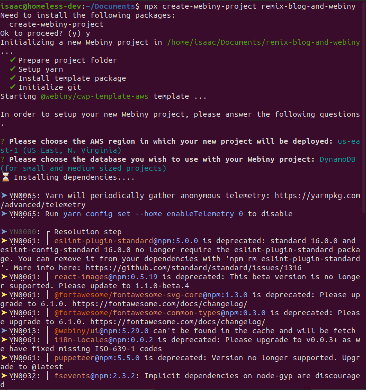

Once the project has been created, we will then deploy it to our created AWS account with the command below:

```bash
cd remix-blog && yarn webiny deploy
```

The command above will build your application, deploy it to your AWS account and then present you with a URL that will be used to access your Webiny dashboard. Fill out your information to create your Admin user and let's create our models.

*Note: your first deployment can take up to 20 minutes or more!. So, even though it might look like nothing is happening in the terminal, please be patient and let the process finish. If something goes wrong, an error will be shown.*

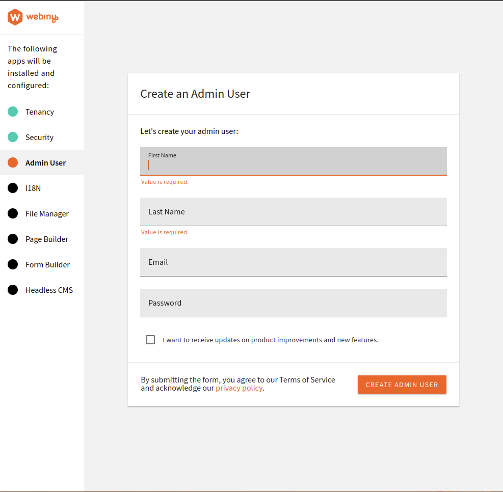

## Creating models

Click on the menu icon on the admin dashboard, and then click on **Headless CMS > Models**.

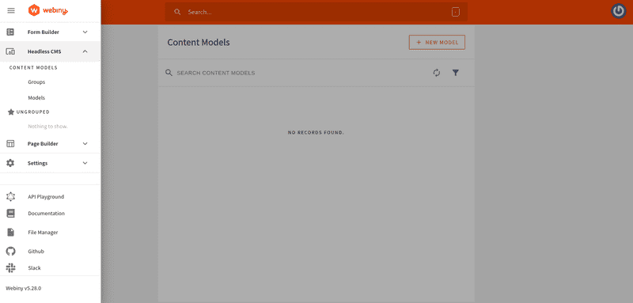

We will create the author model by clicking on the add model and filling out the form. This is shown in the image below:

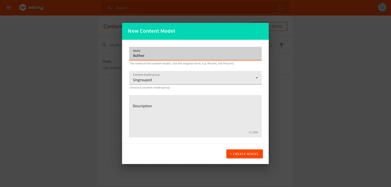

With that done, you will be directed to a new page where we will be creating our content type. Webiny has drag and drop features which makes it easy to create content types. We will use this to create content types for our Authors model. We will fill out the following:

- A text field with the value **name.**
- A long text field with the value **description**.
- A files field with the value **picture.**

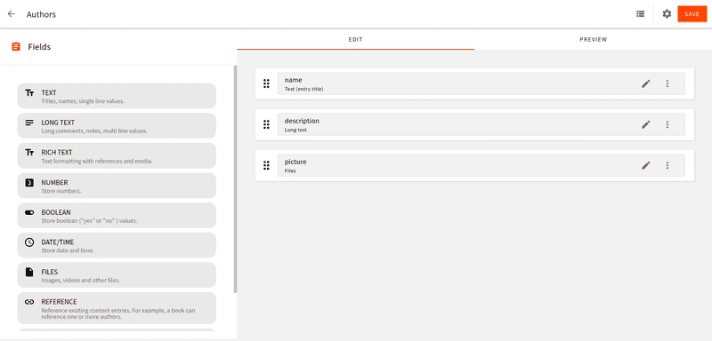

We will also create a Posts model and fill it out with the following:

- A text field with the value **title**
- A text field with the value of **slug**.
- A files field with the value **featured image**
- A text field with the value **description**
- A rich text field with the value **body**
- A reference field with the value **authors**


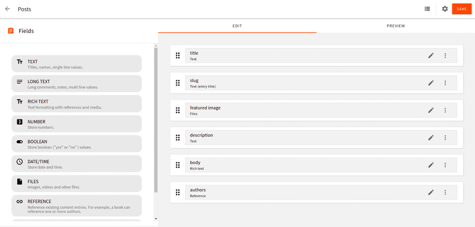

Don’t forget to reference the author field by clicking on Content Models as shown in the image below.

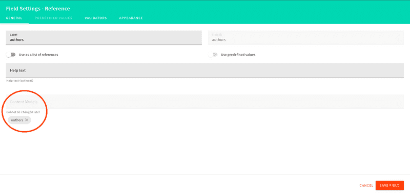

## Adding Content

Let’s add content to our created models. Click on the menu icon and go to **Headless CMS > Ungrouped > Authors** and click on New entry. Fill out the entries and then click on the **save & publish** button**.** You can do this as many times as you want

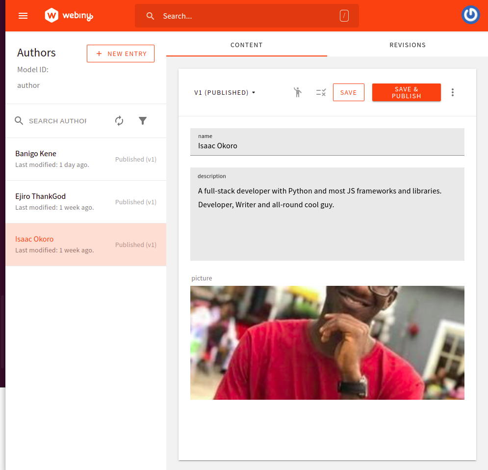

Do the same for the Post model and fill in the entries. Then click on the **save & publish** button.

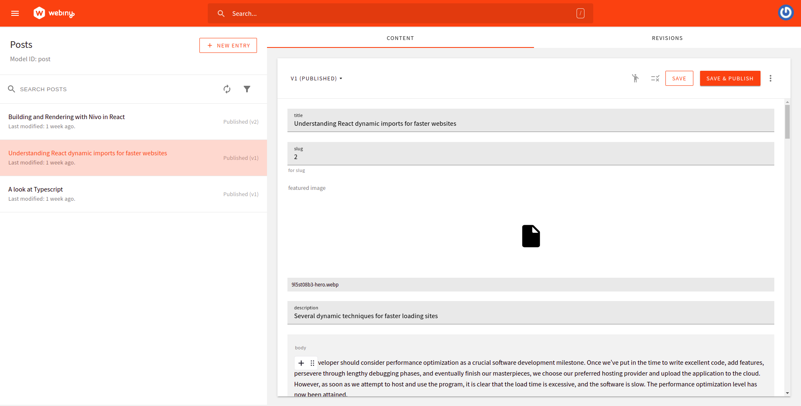

## Using the API playground

We can use the built-in API from Webiny Headless CMS to view the data that we will be fetching on the frontend of our application. Click on the menu icon then click on **API Playground.**

There are four APIs listed in the tabs at the top of the page. Select the **HeadlessCMS - Read API**. You can then investigate your content structure and schema (via the right-side panel). A URL string appears directly beneath the tabs. This URL will be used to retrieve data. Keep the URL somewhere safe for when we get to that step.

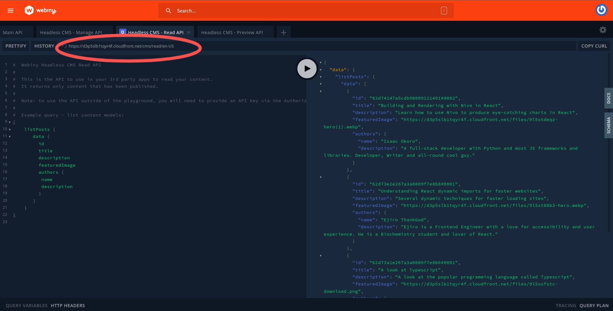

## Setting up Roles and Permissions

Head to the **Setting > Access Management > API key** and create your API key by filling your name and description. Scroll down to **Content,** click on all locales, then grant **full Access** to both **Headless CMS and File Manager.** An API key will be generated when you have successfully saved your settings. Keep it safe as it will be used for authentication purposes later on

## Building the frontend with Remix

This section will cover how to create the UI of our blog with Remix. Install Remix by running the command below in the terminal of your choice:

```bash 
npx create-remix webiny-remix-app
```

You will be prompted to answer some questions, after which a new Remix project will be created for you.

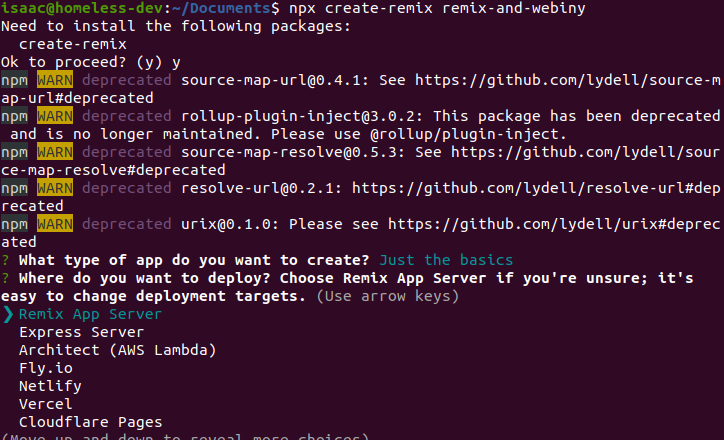

Next, change navigate to the created project directory and open it in your preferred code editor.

## Installing Tailwind for styling purposes

This section will cover how to install [Tailwind](https://tailwindcss.com/), which is a utility-first CSS framework, into our Remix app for styling purposes.

First, run the command below in your terminal to install Tailwind CSS:

`npm add -D concurrently tailwindcss`

Next, we create a `tailwind.config.js` file in the root of our application by running the command below:

`npx tailwindcss init`

Update the `tailwind.config.js` file with the paths to all our template files:

```jsx
module.exports = {
  content: ["./app/**/*.{ts,tsx,jsx,js}"]
  theme: {
    extend: {},
  },
  variants: {},
  plugins: []
};
```

Next, update the scripts in the `package.json` file:

```jsx
"scripts": {
    
    "build": "npm run build:css && remix build",
    "build:css": "tailwindcss -o ./app/tailwind.css",
    "dev": "concurrently \"npm run dev:css\" \"remix dev\"",
    "dev:css": "tailwindcss -o ./app/tailwind.css --watch",
    // ...
},
```

With these changes, starting the dev server will create a `tailwind.css` file for us. The last step is to link the generated styles to our application. Update your `root.jsx` file with the code block below:

```jsx
import {
  Links,
  LiveReload,
  Meta,
  Outlet,
  Scripts,
  ScrollRestoration,
} from "@remix-run/react";
import styles from "./tailwind.css";
export function links() {
  return [{ rel: "stylesheet", href: styles }]
}
export const meta = () => ({
  charset: "utf-8",
  title: "Remix Blog",
  viewport: "width=device-width,initial-scale=1",
});
export default function App() {
  return (
    <html lang="en">
      <head>
        <Meta />
        <Links />
      </head>
      <body className="bg-neutral-400">
        <Outlet />
        <ScrollRestoration />
        <Scripts />
        <LiveReload />
      </body>
    </html>
  );
}
```

Remix takes an innovative approach to linking stylesheets and other external resources; we export a links function into the page where the styles are to be applied. We want to use the Tailwind styles throughout our applications in this case. Using this custom links component, Remix loads the links in the background.

With that, we are done setting up Tailwind for our application. Before we get started with building our application, let’s create a .env file in the root folder of our application that will hold our Webiny Headless CMS URL and our token.

``` bash
REMIX_PUBLIC_WEBINY_API_URL=your-apiUrl-here
WEBINY_API_TOKEN=your-API-token-here
```

<OnPagePromo />

## Building our Blog

Copy and paste the code below into the `app/routes/index.jsx` file. This file will act as the home page for our application.

```jsx
// app/routes/index.jsx

import { Link } from '@remix-run/react';
export default function Index() {
  return (
    <div className='container mx-auto px-40 py-60'>
      <h1 className="text-3xl mb-5 font-bold ">Welcome to my Remix App</h1>
      <Link to='/posts'>
        <button className='cursor-pointer inline-flex items-center py-2 px-3 text-sm ml-50 font-medium text-center text-white bg-blue-700 rounded-lg hover:bg-blue-900 focus:ring-4 focus:outline-none focus:ring-blue-300 dark:bg-blue-600 dark:hover:bg-blue-700 dark:focus:ring-blue-800"'>Go to blog</button>
      </Link>
    </div>
  );
}
```

Remix has a unique way of handling routing and that's by using the Link which we are importing from Remix. We are then using the Link tag to route to the posts tab.

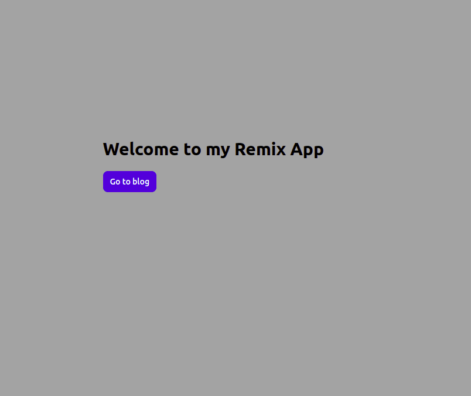

Let's go ahead and create the posts tab now. Like Next.js, Remix has a file-based system of routing which means that any jsx files inside the routes folder is automatically a created page.

Create a posts folder inside the routes folder and then create an `index.jsx` file there. Copy and paste the code below into the created `app/routes/posts/index.jsx` file and we will go over what the code does.

```jsx
// app/routes/posts/index.jsx

export const loader = async () => {
  const data = {
    posts: await fetch(process.env.REMIX_PUBLIC_WEBINY_API_URL, {
      method: 'POST',
      headers: {
        'Content-Type': 'application/json',
        Authorization: `Bearer ${process.env.WEBINY_API_TOKEN}`,
      },
      body: JSON.stringify({
        query: `
          query PostSlugs {
            listPosts {
                data {
                  title
                  slug
                  description
                  featuredImage
                  authors {
                      name
                      description
                      picture
                  }
                }
              }
            }
          }
        `,
      }),
    }),
  };
  const posts = await data.posts.json();
  const results = posts.data.listPosts.data;
  return results;
};
```

In the code block above, we created and exported a loader which queries data from Webiny and then we returned the results

Remix comes with out-of-the-box support for data loading. This means that we don't have to create separate components for our API routes and consumer. Our frontend component is its own API route and knows how to fetch the required data without us specifying anything.

```jsx
// app/routes/posts/index.jsx
import { Link, useLoaderData } from '@remix-run/react';
...
// function where we fetch data from Webiny
...
export default function PostItem() {

  // This returns JSON parsed data from the loader function and then provides it to our components
  const results = useLoaderData();
  return (
    <>
      <h1 className='text-3xl text-center font-bold mt-40"'>Blog Posts</h1>
      <div className="md:flex flex-wrap md:justify-evenly md:items-center space-y-4 mt-8 px-4 overflow-hidden">
  
      // mapping through the results
        {results.map((result) => (
          <div
            key={result.slug}
            className="max-w-md bg-white rounded-lg  dark:bg-gray-800 dark:border-gray-700 gap-2"
          >
            
            <div>
              <Link to={result.slug}>
                <h1 className="mb-2 text-2xl ml-3 font-bold tracking-tight text-gray-900 dark:text-white">
                  {result.title}
                </h1>
              </Link>
              <p className="mb-3 font-normal ml-3 text-gray-700 dark:text-gray-400">
                {result.description}
              </p>
              <div className="flex justify-between items-center">
                <div className="flex justify-between items-center gap-2">
                  <div className="rounded-full w-7 ml-3 h-7 overflow-hidden">
                    
                  </div>
                  <p>{result.authors.name}</p>
                </div>
                <Link
                  to={result.slug}
                  className="cursor-pointer inline-flex items-center py-2 px-3 text-sm font-medium text-center text-white bg-blue-700 rounded-lg hover:bg-blue-900 focus:ring-4 focus:outline-none focus:ring-blue-300 dark:bg-blue-600 dark:hover:bg-blue-700 dark:focus:ring-blue-800"
                >
                  Read more
                  <svg
                    className="ml-2 -mr-1 w-4 h-4"
                    fill="currentColor"
                    viewBox="0 0 20 20"
                    xmlns="http://www.w3.org/2000/svg"
                  >
                    <path
                      fill-rule="evenodd"
                      d="M10.293 3.293a1 1 0 011.414 0l6 6a1 1 0 010 1.414l-6 6a1 1 0 01-1.414-1.414L14.586 11H3a1 1 0 110-2h11.586l-4.293-4.293a1 1 0 010-1.414z"
                      clip-rule="evenodd"
                    ></path>
                  </svg>
                </Link>
              </div>
            </div>
          </div>
        ))}
      </div>
    </>
  );
}
```

We imported the `useLoaderData` hook from Remix. The `useLoaderData` hook returns the JSON parsed data from the loader function and then provides it to our components. Next, we mapped over the JSON parsed data from the loader function and displayed them in the browser. We should get what looks like the image below when we save our file.

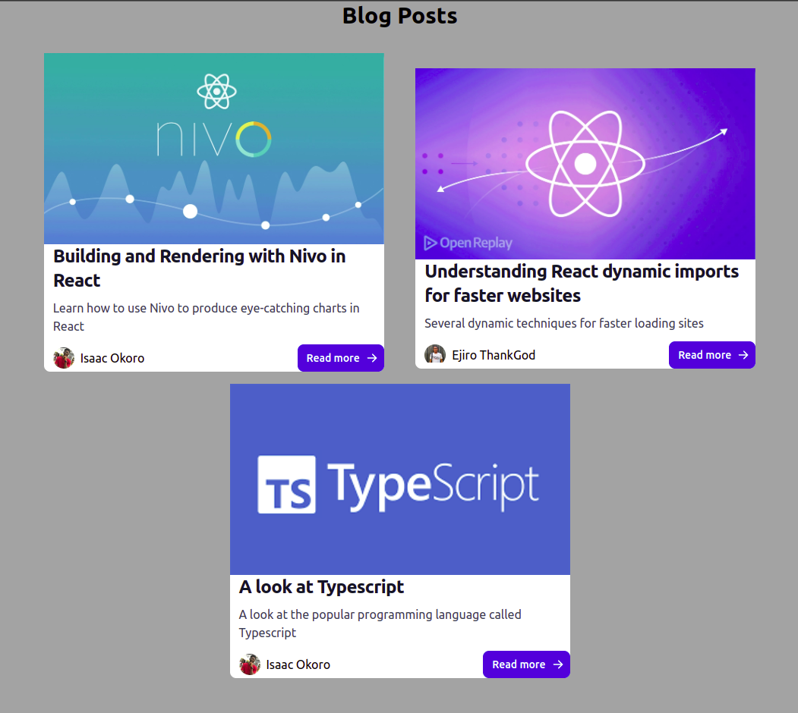

## Fetching individual posts

This section will cover how to get individual posts for our application. Remix allows any file created with a `$` in front of the name to be a dynamic page or route. We will create a file that will query for the slugs so that we can get the exact page that we want when we click on the Read more button

Create a `$slug` file in the posts folder and paste the code below into it.

```jsx
// app/routes/posts/$slug.jsx

import { useParams, Link, useLoaderData } from '@remix-run/react';
import { RichTextRenderer } from '@webiny/react-rich-text-renderer';
export const loader = async () => {
  const headers = {
    'Content-Type': 'application/json',
    Authorization: `Bearer ${process.env.WEBINY_API_TOKEN}`,
  };
  const graphqlQuery = {
    query: `
      query getPerPost {
        listPosts {
          data {
            title
              slug
              description
              featuredImage
              body
              authors {
                  name
                  description
                  picture
              }
            }
          }
        }
      }
  `,
  };
  const data = {
    posts: await fetch(process.env.REMIX_PUBLIC_WEBINY_API_URL, {
      method: 'POST',
      headers: headers,
      body: JSON.stringify(graphqlQuery),
    }),
  };
  const posts = await data.posts.json();
  const results = posts.data.listPosts.data;
  return results;
};
export default function Slug() {
  const params = useParams();
  const posts = useLoaderData();

  // Checking if the found slug is the same with the params.slug and then getting that exact page if they match
  const post = posts.find((p) => p.slug === params.slug);
  if (!post) return;
  return (
    <div className="">
      <div className="container mx-auto ml-50 mb-8 space-y-6 py-3">
        <Link
          to='/posts'
          className="cursor-pointer inline-flex items-center py-2 px-3 text-sm font-medium text-center text-white bg-blue-700 rounded-lg hover:bg-blue-900 focus:ring-4 focus:outline-none focus:ring-blue-300 dark:bg-blue-600 dark:hover:bg-blue-700 dark:focus:ring-blue-800"
        >
          
          <svg
            className=" mr-2 w-4 h-4"
            fill="currentColor"
            viewBox="0 0 20 20"
            xmlns="http://www.w3.org/2000/svg"
          >
            <path
              fill-rule="evenodd"
              d="M15.41 16.09L10.83 11.5L15.41 6.91L14 5.5L8 11.5L14 17.5L15.41 16.09Z"
              clip-rule="evenodd"
            ></path>
          </svg>
          BACK
        </Link>
        <h1 className="text-4xl font-bold">{post.title}</h1>
        <div className="flex items-center gap-4 mb-10">
          
          <p className="text-xl">{post.authors.name}</p>
        </div>
        <figure className="relative overflow-hidden shadow-md mb-10">
          
        </figure>
        <RichTextRenderer data={post.body} />
      </div>
    </div>
  );
}
```

We fetched the slug in the code above and then we looped through the results to get the slug that matches the post we clicked on. 

Next, we installed and imported the`RichTextRenderer` from Webiny to render the post body. You can find more about the `RichTextRenderer` [here](https://www.webiny.com/docs/headless-cms/extending/render-rich-text-content) and also install it with the command below:

```bash
yarn add -D @webiny/react-rich-text-renderer
```

With that done, our page should look like the image below:

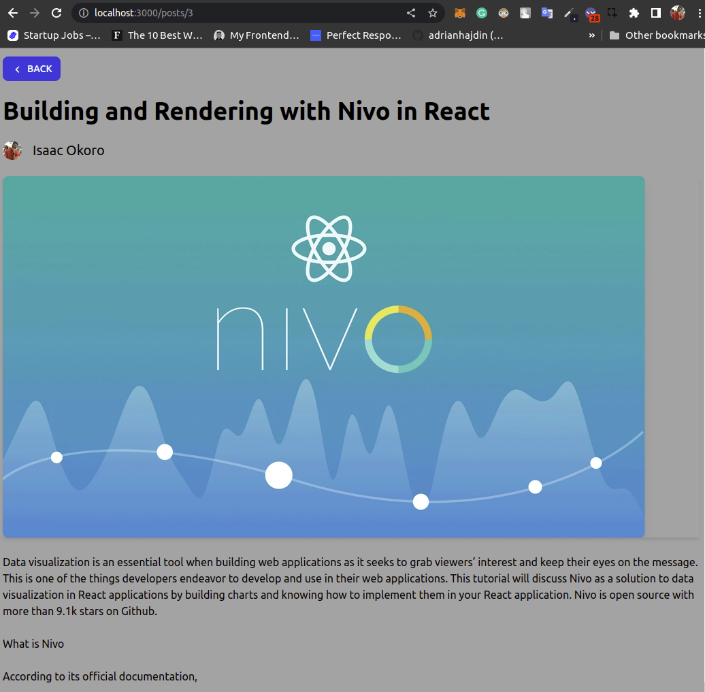

## Conclusion

This article has taken a look at Webiny Headless CMS, how to set it up and how to create models. We also looked at Remix and how to connect our Webiny backend to our Remix frontend by building a blog application.

**Full source code:** https://github.com/webiny/write-with-webiny/tree/main/tutorials/remix-blog

---

This article was written by a contributor to the Write with Webiny program. Would you like to write a technical article like this and get paid to do so? [Check out the Write with Webiny GitHub repo](https://github.com/webiny/write-with-webiny/).