In this tutorial we will take you through a detailed guide on how to build a small blog with a homepage and individual articles in **Scully**, a static site generator for Angular projects, and fetch data from **Webiny Headless CMS.** 

This will include rendering static content (HTML, CSS, and Javascript), from Angular Templates, so that you can host your website on Netlify, Vercel, or any other infrastructure of your choice. Combining this with a backend using Webiny Headless CMS, is a great way of providing a nice UI for the author, and a database to store your content.

## **What Is Scully**

Scully is a static site generator for Angular projects. It will consume data from your Webiny application and will create a static index.html for each of your pages/routes.

Basically, it is a Jamstack solution for Angular developers. As you might know, Jamstack stands for JavaScript/API/Markup, but behind this approach, there are multiple vendors outside like NextJS, Gatsby, and maybe Remix and the one we are going to cover is Scully.io.

Scully has an easy-to-use and extensible plugin system that allows custom routes and content manipulation. Additionally, it will make your blog application very SEO friendly.

## **What is a Headless CMS?**

A headless CMS is a back-end-only content management site (CMS) that acts primarily as a content repository that can deploy content across any front-end or device via APIs.

This is key to omnichannel strategies because it lets you integrate content into any system, software, or website just by calling the APIs the headless CMS exposes.

## **Why use Webiny CMS?**

Webiny is an open-source serverless CMS built with cutting-edge tools and technologies. It also allows you to interface with other technologies such as Angular, and Scully via the Content Delivery API.

Webiny CMS enables users to construct websites and web apps in both large and small projects without effort by giving all of the tools required, all of which are tuned to function together.

This is exactly what you can need to create a site that is completely responsive to mobile devices and allows for faster web development.

### **Prerequisites**

Before we get going, ensure you have done the following:

- Set up an AWS account
- Have Node.js: 14 or higher installed.
- Ensure that you have yarn 1.22.0 || >2 installed – Webiny works with both yarn versions.
- For Angular versions, 9, 10, and 11 use Scully V1.1.1 (this version will only receive security updates) for Angular V12 and above use Scully from V2.0.0 on.
- Star our GitHub repo

## **Setting up Webiny CMS**

Grab a cup of coffee, and let’s get started.

Setting up Webiny CMS is easy and can be done by using the command below:

```jsx
npx create-webiny-project
```

This command will:

- Prepare a project folder
- Install dependencies
- Scaffold a Webiny application
- Initialize git and make an initial commit

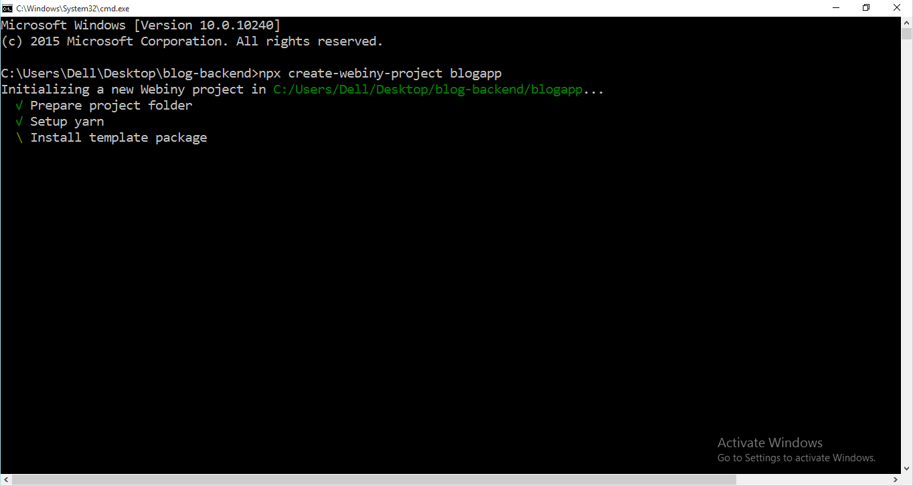

After that, follow the prompts to:

- Choose the region where our app will be deployed
- Choose the database set up for our Webiny project.

The installation may take some minutes.

**Note**: Ensure you have followed the instructions from the prerequisites and have set up your AWS account completely.

Once the installation is complete, this is what you should get:

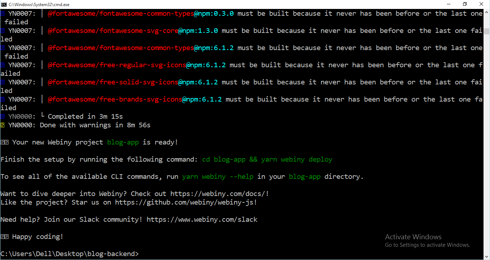

In case of any issue, you can reach out to the Webiny Community on Slack.

Now, we can go ahead and deploy our Webiny project

Use the command below, to set up your project

```jsx
cd swblog && yarn webiny deploy
```

This command will build our application and deploy it to our AWS account.

***Note**: The first deployment can take up to 20 minutes. So, patience is key here, let the process finish. It will display an error in case something goes wrong.*

Then you will be provided with a URL that will be used to access your Webiny dashboard.

Fill out your information to create your Admin user. Once we’ve created the admin account, we can proceed to go through the remaining steps and install all the applications.

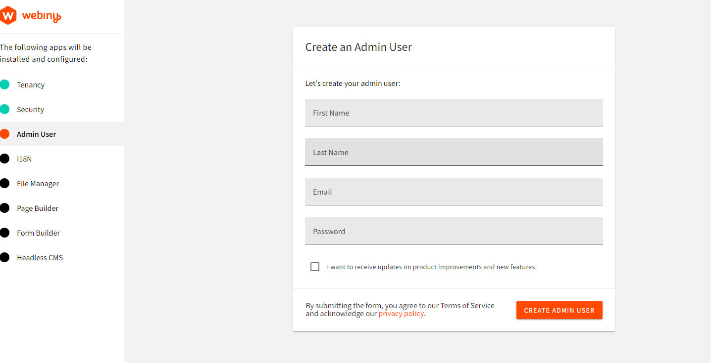

Click the FINISH INSTALL button to be taken to the Webiny dashboard.

**Remember**: You can always run: `yarn webiny info`  to view all of the relevant project URLs, including the URL of your GraphQL API:

Now we have our Webiny application deployed, we can get started on structuring our content

### **Content Structure**

So, let’s create our blog model

To create our content models

Let’s click on New content model under Headless CMS app.

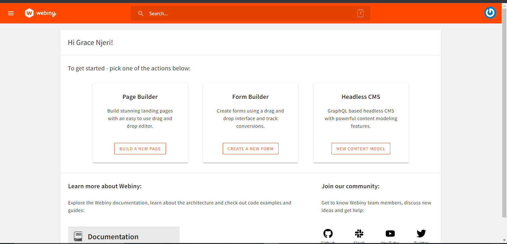

We are going to name our model Article Post, add a description and click on create.
Then we can access the model by clicking on Article Post as shown in the arrow.

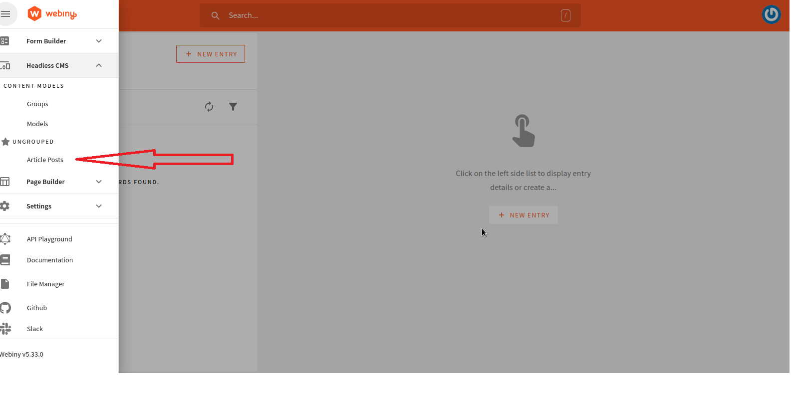

This is how our generated content models looks like:

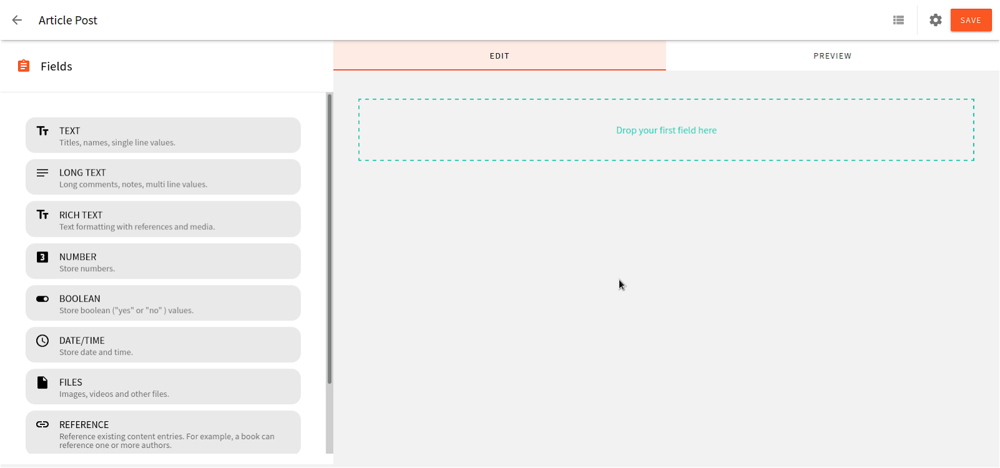

Let’s add our fields: image, title and body as shown:

- Image - File
- Title - Text
- Body - Rich Text

This will Match every blog. Click on save.

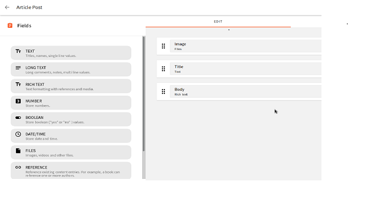

Now it’s time to create the actual content
Navigate to  Headless CMS > Ungrouped > Article Post
Now let’s create our individual articles. Feel free to unleash your creativity

Once you are happy with the post, click on save button then save and publish button to publish.

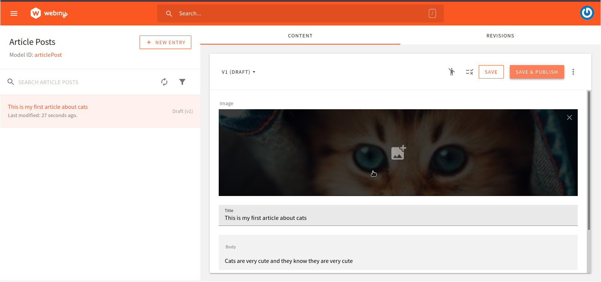

Now that we are done with creating models so that we can modify our articles, we can move on to the  remaining part of our blog.

## **Building a Blog**

We'll be using Scully, to build out the front-end part of our blog application. Scully is a static site generator that provides a schematic that enables Angular applications to use markdown files for your blog's content.

Here, we will add a home page and individual articles.

### Installing dependencies

Let’s first install dependencies,

- Node JS
- Angular CLI. You can install CLI globally with:

```jsx
npm install –g @angular/cli
```

To create a new angular project run the CLI command ng new and provide the name of your app blog-app, as shown below:

```jsx
ng new blog-app
```

Go the src/app.component.html and replace the content with

```jsx
<router-outlet></router-outlet>
```

We are going to use Materialize for styling purposes

So open the index.html file and add  the following:

```jsx
<link rel="stylesheet" href="https://cdnjs.cloudflare.com/ajax/libs/materialize/1.0.0/css/materialize.min.css">
```

### Connecting CMS to the application

To connect the Webiny CMS to our application, we will first access GraphQL API playground.

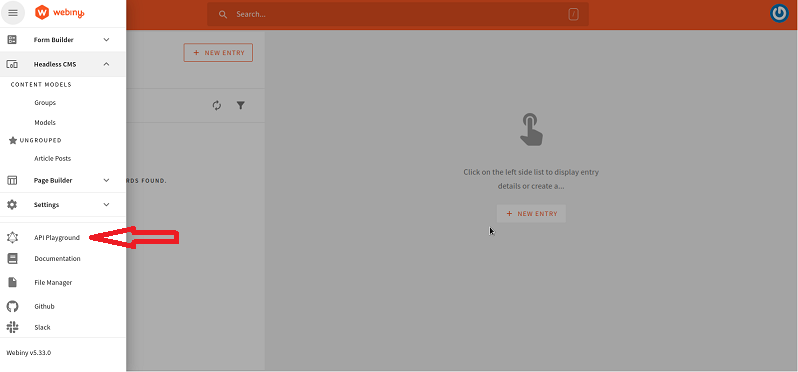

Navigate to API Key under headless CMS to Access token. In the headless CMS, grant custom access to read as shown below:

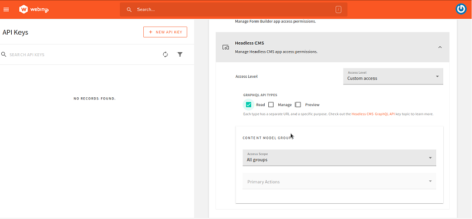

Create a new API key and copy the actual token and save it

Create a .env file at the base of your project and add the below code.

```jsx
CMS_BASE_URL=https://your-webiny-base-url
GRAPHQL_API_URL=https://yourgrapgql-url/graphql
GRAPHQL_API_TOKEN=your-api-token
```

Before we get started on creating components, we will first access our data. We will use the generate a service that will call our api to access our posts data. 

Create a service to access data

```jsx
ng g s content 
```

We will first access our schema.json file to define our interface such as:

```jsx
export interface ArticlePost{
  id: string;
  title: string;
  image: string;
  description: string;
}
```

Then add this to configure the api url and token key in our app.

```jsx 
// Content.service.ts

import { HttpClient, HttpHeaders, HttpParams } from '@angular/common/http';
import { Injectable } from '@angular/core';
import { isScullyGenerated } from '@scullyio/ng-lib';
import { Observable, tap } from 'rxjs';
import { environment } from 'src/environments/environment';

@Injectable({
  providedIn: 'root'
})
export class ContentService {

  private readonly baseApiUrl = environment.webiny.GRAPH_API_URL;

  constructor(private readonly http: HttpClient,
    private readonly transferStateService: TransferStateService
    ) {}

  requestWebinyData<T>(
    path: string,
    queryParams: HttpParams = new HttpParams()
  ): Observable<T> {
    const url = mergePaths(this.baseApiUrl, path);
   const headers = new HttpHeaders(
     { 'Webiny-Token': environment.webiny.API_TOKEN }
   );

   return this.http.get<T>(url, { headers, params: queryParams });
   }

   getWebinyData<T>(path: string): Observable<T> {
    const url = mergePaths(this.baseApiUrl, path);
    const urlHash = btoa(url);
    if (isScullyGenerated()) {
      return this.transferStateService.getState<T>(urlHash);
    }
    return this.requestWebinyData<T>(path).pipe(
      tap(data => this.transferStateService.setState<T>(urlHash, data))
    );
   }
    
   getSingleton<T>(path: string): Observable<T> {
    return this.requestWebinyData(
      mergePaths('singletons/get', path)
    );
  }

}

```

For further configuration,let’s add add authentication for our CMS

Create a authentication folder and name the file webiny.config.ts

```jsx
importimport { Injectable } from '@angular/core';
import { environment } from 'src/environments/environment';

@Injectable()
export class WebinyConfig {
    constructor(
        public readonly url: string,
        public readonly APP_NAME: string,
        public readonly GRAPHQL_API_URL: string,
        public readonly GRAPHQL_API_TOKEN: string
    ) {
    }

    public buildUrl(url: string) {
        if (url.length > 0 && url.startsWith('/')) {
            url = url.substr(1);
        }

        const result = `${this.url}/${url}`.replace('{app}', this.APP_NAME);

        return result;
    }
}

export const DefaultWebinyConfig = new WebinyConfig(
    'CMS_BASE_URL',
    `${environment.webiny.APP_NAME}`,
    `${environment.webiny.GRAPHQL_API_URL}`,
    `${environment.webiny.GRAPHQL_API_TOKEN}`
);
```

Next, we need an interceptor to authenticate our backend. So add this to the interceptor file.

```jsx
// post-auth.interceptor.ts

import { Injectable } from '@angular/core';
import {
  HttpRequest,
  HttpHandler,
  HttpEvent,
  HttpInterceptor,
  HttpErrorResponse,
  HttpHeaders,
  HttpResponse
} from '@angular/common/http';
import { Observable, of, throwError } from 'rxjs';
import { catchError, filter, map, switchMap } from 'rxjs/operators';
import { WebinyConfig } from './webiny.config';

@Injectable()
export class ContentAuthInterceptor implements HttpInterceptor {

  constructor( private readonly config: WebinyConfig) {}

  intercept(request: HttpRequest<unknown>, next: HttpHandler): Observable<HttpEvent<unknown>> {

    if(request.url.includes('webiny')){
      return this.invokeInternal(request, next, true);
    }else{
      return next.handle(request);
    }
  }

  private invokeInternal(req: HttpRequest<any>, next: HttpHandler, retry: boolean): Observable<HttpEvent<any>> {
    return this.getToken(next).pipe(
        switchMap(token => {
            req = req.clone({
                setHeaders: {
                    Authorization: `Bearer ${token}`
                }
            });

            return next.handle(req).pipe(
                catchError((error: HttpErrorResponse) => {
                    if ((error.status === 403 || error.status === 401) && retry) {
                        clearBearerToken();

                        return this.invokeInternal(req, next, false);
                    } else {
                        return throwError(error);
                    }
                })
            );
        })
    );
  }
    private getToken(next: HttpHandler) {
      // Check if we have already a bearer token in local store.
      const cachedToken = getBearerToken();

      if (cachedToken) {
          return of(cachedToken);
      }

      // tslint:disable-next-line: max-line-length
      const body = `token_key=${this.config.GRAPHQL_API_URL}`;

      const tokenRequest = new HttpRequest('POST', this.config.buildUrl('identity-server/connect/token'), body, {
          responseType: 'json',
          headers: new HttpHeaders({
              'Content-Type': 'application/x-www-form-urlencoded'
          })
      });

      return next.handle(tokenRequest).pipe(
          filter (x => x instanceof HttpResponse),
          map((response: HttpResponse<any>) => {
              const token = response.body.access_token;

              // Cache the bearer token in the local store.
              setBearerToken(token);

              return token;
          }));
  }
}

function getBearerToken() {
  return localStorage.getItem('token');
}

function setBearerToken(token: string) {
  localStorage.setItem('token', token);
}

function clearBearerToken() {
  localStorage.removeItem('token');
}
```

### Creating a list article page

The first component that we are going to create is home module that will contain all the blog post links. 

```jsx
ng g m home
```

In the app-routing.module.ts, configure the routes

```jsx
const routes: Routes = [{
  path: '',
  component: HomeComponent,
}];
```

We can inject our service in the home component to load our data

```jsx
// home.component.ts

import { Component, OnInit } from '@angular/core';
import { ActivatedRoute } from '@angular/router';
import { Observable } from 'rxjs';
import { ContentService } from 'src/app/services/content.service'

@Component({
  selector: 'app-home',
  templateUrl: './home.component.html',
  styleUrls: ['./home.component.scss']
})
export class HomeComponent implements OnInit {
  post?: HomeContent;
  constructor(
    private readonly contentService: ContentService,
    private readonly cdr: ChangeDetectorRef
  ) {}
  ngOnInit(): void {
    this.contentService
      .getSingleton('home')
      .pipe(first())
      .subscribe(post => {
        this.post = post;
        this.cdr.markForCheck();
      });
  }
 }
```

The add this in our home template


```jsx
// home.component.html

<<div>
<ul>
  <li *ngFor="let post of posts">
    <a [routerLink]="post.route">
      <span>
        
      </span>
      <span class="blog-meta-data">
        <h1> {{post.title }}</h1> 
       <span class="description">{{ post['description'] }}...</span>
      <span class="link"><a [routerLink]="post.route">Read More </a></span>
    </span>
    </a>
</li>
</ul>
</div>
```

### Creating a single list post

First, lets add Scully to our project

```bash
ng add @scullyio/init --project="your-project-name"
```

The above command creates a Scully config file named *Scully.projectName.config.ts*, scully.blog-app.config.ts  where the Project Name is the name of your Angular project.

```jsx
import { ScullyConfig } from '@scullyio/Scully;

export const config: ScullyConfig = {
projectRoot: './src',
projectName: 'blog-app',
outDir: './dist/static',
routes: {},
};
```

You may have noticed that Scully module has been added to our app component

```jsx
import { ScullyLibModule } from '@scullyio/ng-lib';

@NgModule({
  // ...
  imports: [
    // ...
    ScullyLibModule
  ]
})
export class AppModule { }
```

Modify plugin in Scully default plugin to fetch our data


```jsx
// routerPlugin

import { registerPlugin, getPluginConfig, httpGetJson,
  routeSplit, } from '@scullyio/scully';

import {environment } from '../../src/environments/environment';

const fetch = require('node-fetch');

export const myPlugin = 'myPlugin';

const myFunctionPlugin = async (route, config) => {
  const body = `token_key=${environment.webiny.GRAPHQL_API_TOKEN}`;
  const apiUrl = `GRAPHQL_API_URL`;
  const token = await fetch(apiUrl, {
    method: 'POST',
    body: body,
    headers: { 'Content-Type': 'application/x-www-form-urlencoded' },
  })
    .then((response) => {
      if (!response.ok) {
        throw new Error('Network response was not ok');
      }
      return response.json();
    })
    .then((tokenResponse) => tokenResponse.access_token);

  
  const { createPath } = routeSplit(route);

  const response = await fetch(`${environment.webiny.GRAPHQL_API_URL}posts/`, {
    method: 'GET',
    headers: { Authorization: `Bearer ${token}` },
  })
    .then((response) => {
      if (!response.ok) {
        throw new Error('Network response 2 was not ok');
      }
      return response.json();
    })
    .then((result) => {
      const handledRoutes = [];
      for (var i = 0; i < result.items.length; i++) {
        handledRoutes.push({ route: createPath(result.items[i].data.slug.iv) });
      }
  

return handledRoutes;
    });

  return response;
};

const validator = async () => [];

registerPlugin('postProcessByHtml', myPlugin, myFunctionPlugin, validator);
```

Configure this in the scully.config file

```jsx
// scully.config.ts

import { ScullyConfig } from '@scullyio/scully';

/** this loads the default render plugin, remove when switching to something else. */
import '@scullyio/scully-plugin-puppeteer'
import { myPlugin} from'./scully/plugins/plugin';

export const config: ScullyConfig = {
  projectRoot: "./src",
  projectName: "blog-app",
  // add spsModulePath when using de Scully Platform Server,
  outDir: './dist/static',
  routes: {
    '/blog/:postSlug': {
      type: myPlugin,
    } 
  }
};
```

 

`TransferStateService` is important because we run a check that should only make an API call if Scully is already running or if we use `ng serve`, or if the application has not yet been produced by Scully. We merely add the data with a special key to the state when we fetch it. We utilize the same special key to retrieve our data while using the produced app. In this manner, no component utilizing this service requires any modifications. So modify that in article service

```jsx
export class ContentService {

  private readonly baseApiUrl = environment.webiny.GRAPH_API_URL;

  constructor(private readonly http: HttpClient,
    private readonly transferStateService: TransferStateService
    ) {}

  requestWebinyData<T>(
    path: string,
    queryParams: HttpParams = new HttpParams()
  ): Observable<T> {
    const url = mergePaths(this.baseApiUrl, path);
   const headers = new HttpHeaders(
     { 'Webiny-Token': environment.webiny.API_TOKEN }
   );

   return this.http.get<T>(url, { headers, params: queryParams });
   }

   getWebinyData<T>(path: string): Observable<T> {
    const url = mergePaths(this.baseApiUrl, path);
    const urlHash = btoa(url);
    if (isScullyGenerated()) {
      return this.transferStateService.getState<T>(urlHash);
    }
    return this.requestWebinyData<T>(path).pipe(
      tap(data => this.transferStateService.setState<T>(urlHash, data))
    );
   }
    
   getSingleton<T>(path: string): Observable<T> {
    return this.requestWebinyData(
      mergePaths('singletons/get', path)
    );
  }

}

```

Depending on where you acquire the data from, there are many ways to construct routes for Scully. Here, we're using a headless CMS and an API to obtain the data. As a result, we must first use the resultsHandler function to handle the API response before identifying the property that contains each item's URL slug. 

Here is how to configure this in scully.config.ts

```jsx
// scully.config.ts

export const config: ScullyConfig = {
  projectRoot: './src',
  projectName: 'scully-blog-starter',
  outDir: './dist/static',
  routes: {
    '/blog/:slug': {
      type: 'json',
      slug: {
        url: 'GRAPHQL_URL/schema.json',
        property: 'slug',
        headers: {
          'X-AUTH-TOKEN': environment.GRAPHQL_TOKEN
        },
        resultsHandler: rawData => rawData.data
      }
    },
    '/:page': {
      type: 'json',
      page: {
        url: 'GRAPHQL_URL/schema.json',
        property: 'page',
        headers: {
          'X-AUTH-TOKEN': environment.GRAPHQL_TOKEN
        },
        resultsHandler: rawData => {
          const pages = [];
          for (let i = 1; i <= rawData.total_pages; i++) {
            pages.push({page: i});
          }
          return pages;
        }
      }
    }
  }
```

To ensure your app looks good, add styling.

To view our site, execute this command in shell.

```jsx
npm run build && npm run scully
```

This is the final site that will be rendered after hosting our app locally, there is home page and individual articles

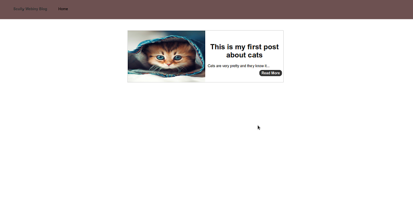

### Conclusion

That is the end of our scully webiny blog. Using scully as front-end and webiny headless CMS.

**Full source code:** https://github.com/webiny/write-with-webiny/tree/main/tutorials/scully-blog

---

This article was written by a contributor to the Write with Webiny program. Would you like to write a technical article like this and get paid to do so? [Check out the Write with Webiny GitHub repo](https://github.com/webiny/write-with-webiny/).