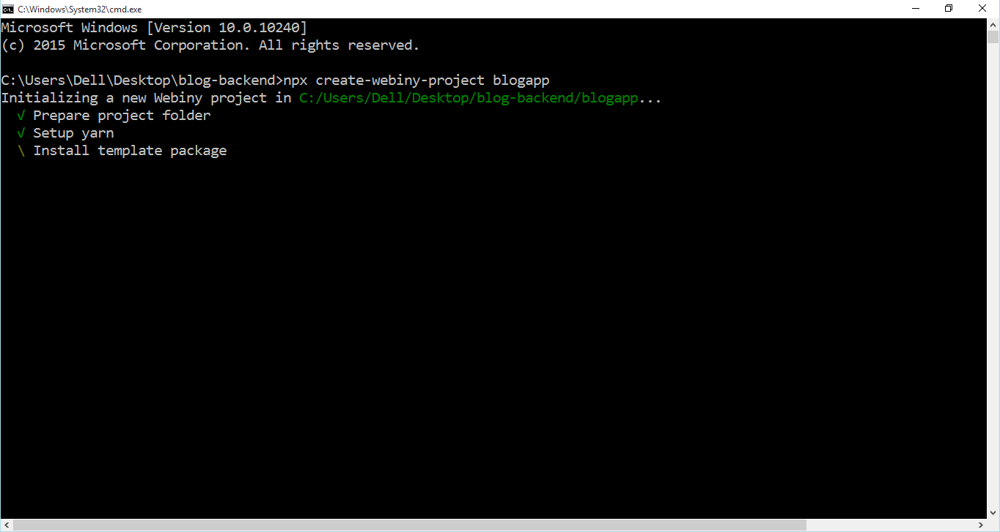
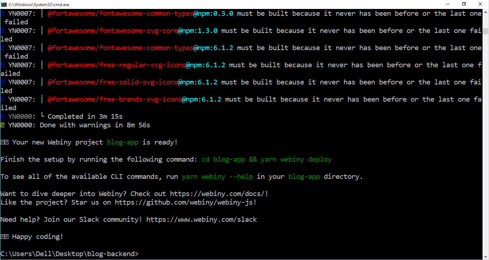
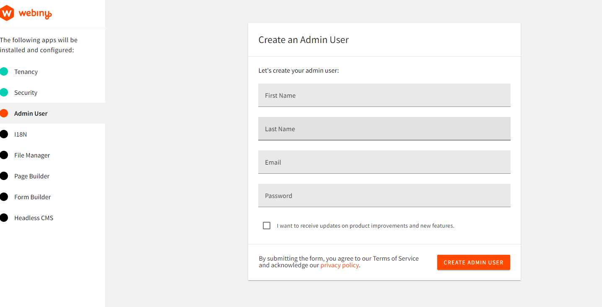
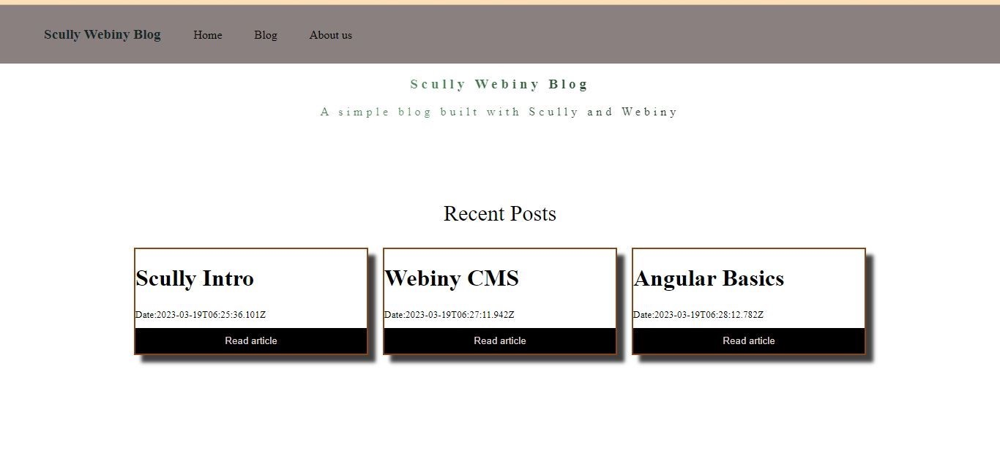

Are you interested in learning how to set up a blog site? Look no further! We'll guide you through a detailed process on how to build a blog site with Webiny Headless CMS and Scully, a static site generator for Angular. This includes rendering static content, such as HTML, CSS, and Javascript, from Angular templates so you can host your website on Netlify, Vercel, or any other infrastructure of your choice.

## What Is Scully

Scully is an excellent static site generator for Angular projects. It analyzes the route structure of your Angular application to create a list of routes, and then generates an index.html for each of them. This approach allows your application to show up instantly for the user. Scully is essentially a Jamstack solution for Angular developers. Jamstack stands for JavaScript/API/Markup, and Scully.io is one of the vendors outside of the popular NextJS and Gatsby frameworks.

Scully offers an easy-to-use and extensible plugin system that allows custom routes and content manipulation. Additionally, it helps make your blog application very SEO-friendly.

## What is a Headless CMS?

A headless CMS is a back-end-only content management site that acts primarily as a content repository. It can deploy content across any front-end or device via APIs. This is key to omnichannel strategies because it allows you to integrate content into any system, software, or website just by calling the APIs the headless CMS exposes.

## Why use Webiny CMS?

Webiny is an open-source serverless CMS built with cutting-edge tools and technologies. It also allows you to interface with other technologies such as Angular and Scully via the Content Delivery API. Webiny CMS enables users to construct websites and web apps in both large and small projects without effort by providing all of the necessary tools, all of which are tuned to function together.

Webiny CMS is perfect for creating a site that is completely responsive to mobile devices and allows for faster web development.

## Prerequisites

Before we get our hands dirty, ensure you have done the following:

- Set up an AWS account
- Node.js: 14 or higher.
- Ensure that you have yarn 1.22.0 || >2 installed – Webiny works with both yarn versions.
- For Angular versions, 9, 10, and 11 use Scully V1.1.1 (this version will only receive security updates) for Angular V12 and above use Scully from V2.0.0 on.
- Star our GitHub repo

## Setting up Webiny CMS

Grab a cup of coffee, and let’s get started.

Setting up Webiny CMS is easy and can be done by using the command below:

```jsx
npx create-webiny-project
```

This command will:

- Prepare a project folder
- Install dependencies
- Scaffold a Webiny application
- Initialize git and make an initial commit



After that, follow the prompts to:

- Choose the region where our app will be deployed
- Choose the database set up for our Webiny project.

The installation may take some minutes.

**Note**: Ensure you have followed the instructions from the prerequisites and have set up your AWS account completely.

Once the installation is complete, this is what you should get:



In case of any issue, you can reach out to the Webiny Community on Slack.

Now, we can go ahead and deploy our Webiny project

Use the command below, to set up your project

```jsx
cd swblog && yarn webiny deploy
```

This command will build our application and deploy it to our AWS account.

***Note**: The first deployment can take up to 20 minutes. So, patience is key here, let the process finish. It will display an error in case something goes wrong.*

Then you will be provided with a URL that will be used to access your Webiny dashboard.

Fill out your information to create your Admin user. Once we’ve created the admin account, we can proceed to go through the remaining steps and install all the applications.



Click the FINISH INSTALL button to be taken to the Webiny dashboard.

**Remember**: You can always run: `yarn webiny info`  to view all of the relevant project URLs, including the URL of your GraphQL API:

Now we have our Webiny application deployed, we can get started on structuring our content

## Content Structure

So, let’s create our blog model

To create our content models

Let’s click on New content model under Headless CMS app.


We are going to name our model Article Post, add a description and click on create.
Then we can access the model by clicking on Article Post as shown in the arrow.


This is what our generated content models looks like:


Let’s add our fields: image, title and body as shown:

- Image - File
- Title - Text
- Body - Rich Text

This will Match every blog. Click on save.


Now it’s time to create the actual content
Navigate to  Headless CMS > Ungrouped > Article Post
Now let’s create our individual articles. Feel free to unleash your creativity

Once you are happy with the post, click on the save button then the save and publish button to publish.


Now that we are done with creating models so that we can modify our articles, we can move on to the  remaining part of our blog.

Here is my final blog content for my models:


## Building a Blog

We'll be using Scully, to build out the front-end part of our blog application. Scully is a static site generator that provides a schematic that enables Angular applications to use markdown files for your blog's content.

Here, we will add a home page and individual articles.

### Installing dependencies

Let’s first install dependencies,

- Node JS
- Angular CLI. You can install CLI globally with:

```jsx
npm install –g @angular/cli
```

To create a new angular project run the CLI command ng new and provide the name of your app blog-app, as shown below:

```jsx
ng new blog-app
```

Go the src/app.component.html and replace the content with

```jsx
<router-outlet></router-outlet>
```

We are going to use Materialize for styling purposes

So open the index.html file and add  the following:

```jsx
<link rel="stylesheet" href="https://cdnjs.cloudflare.com/ajax/libs/materialize/1.0.0/css/materialize.min.css">
```

### Connecting CMS to the application

To connect the Webiny CMS to our application, we will first access GraphQL API playground.


Navigate to API Key under headless CMS to access the token. In the headless CMS, grant custom access to read as shown below:


Create a new API key and copy the actual token and save it

Create a .env file at the base of your project and add the below code.

```jsx
CMS_BASE_URL=https://your-webiny-base-url
GRAPHQL_API_URL=https://yourgrapgql-url/graphql
GRAPHQL_API_TOKEN=your-api-token
```

We will first access our schema.json file to define our interface such as:

```jsx
export interface ArticlePost{
  id: string;
  title: string;
  image: string;
  description: string;
}
```

Create an authentication folder and name the file webiny.config.ts

```jsx
importimport { Injectable } from '@angular/core';
import { environment } from 'src/environments/environment';

@Injectable()
export class WebinyConfig {
    constructor(
        public readonly url: string,
        public readonly APP_NAME: string,
        public readonly GRAPHQL_API_URL: string,
        public readonly GRAPHQL_API_TOKEN: string
    ) {
    }

    public buildUrl(url: string) {
        if (url.length > 0 && url.startsWith('/')) {
            url = url.substr(1);
        }

        const result = `${this.url}/${url}`.replace('{app}', this.APP_NAME);

        return result;
    }
}

export const DefaultWebinyConfig = new WebinyConfig(
    'CMS_BASE_URL',
    `${environment.webiny.APP_NAME}`,
    `${environment.webiny.GRAPHQL_API_URL}`,
    `${environment.webiny.GRAPHQL_API_TOKEN}`
);
```

Next, we need an interceptor to authenticate our backend. So add this to the interceptor file.

 post-auth.interceptor.ts

```jsx
import { Injectable } from '@angular/core';
import {
  HttpRequest,
  HttpHandler,
  HttpEvent,
  HttpInterceptor,
  HttpErrorResponse,
  HttpHeaders,
  HttpResponse
} from '@angular/common/http';
import { Observable, of, throwError } from 'rxjs';
import { catchError, filter, map, switchMap } from 'rxjs/operators';
import { WebinyConfig } from './webiny.config';

@Injectable()
export class ContentAuthInterceptor implements HttpInterceptor {

  constructor( private readonly config: WebinyConfig) {}

  intercept(request: HttpRequest<unknown>, next: HttpHandler): Observable<HttpEvent<unknown>> {

    if(request.url.includes('webiny')){
      return this.invokeInternal(request, next, true);
    }else{
      return next.handle(request);
    }
  }

  private invokeInternal(req: HttpRequest<any>, next: HttpHandler, retry: boolean): Observable<HttpEvent<any>> {
    return this.getToken(next).pipe(
        switchMap(token => {
            req = req.clone({
                setHeaders: {
                    Authorization: `Bearer ${token}`
                }
            });

            return next.handle(req).pipe(
                catchError((error: HttpErrorResponse) => {
                    if ((error.status === 403 || error.status === 401) && retry) {
                        clearBearerToken();

                        return this.invokeInternal(req, next, false);
                    } else {
                        return throwError(error);
                    }
                })
            );
        })
    );
  }
    private getToken(next: HttpHandler) {
      // Check if we have already a bearer token in local store.
      const cachedToken = getBearerToken();

      if (cachedToken) {
          return of(cachedToken);
      }

      // tslint:disable-next-line: max-line-length
      const body = `token_key=${this.config.GRAPHQL_API_URL}`;

      const tokenRequest = new HttpRequest('POST', this.config.buildUrl('identity-server/connect/token'), body, {
          responseType: 'json',
          headers: new HttpHeaders({
              'Content-Type': 'application/x-www-form-urlencoded'
          })
      });

      return next.handle(tokenRequest).pipe(
          filter (x => x instanceof HttpResponse),
          map((response: HttpResponse<any>) => {
              const token = response.body.access_token;

              // Cache the bearer token in the local store.
              setBearerToken(token);

              return token;
          }));
  }
}

function getBearerToken() {
  return localStorage.getItem('token');
}

function setBearerToken(token: string) {
  localStorage.setItem('token', token);
}

function clearBearerToken() {
  localStorage.removeItem('token');
}
```

Let’s add apollo-angular to our app to fetch our data from the graphql api.  Then add this to configure the api url and token key in our app.

```jsx
ng add apollo-angular
```

In graphql module.ts, replace uri variable with the following

```jsx
const uri = environment.webiny.GRAPHQLAPI;
```

Also, add the access token as follows

```jsx
const authLink = setContext((_, { headers }) => {
  const token = localStorage.getItem(environment.webiny.GRAPHQLTOKEN);
  return {
    headers: {
      ...headers,
      authorization: token ? `Bearer ${token}` : "",
    },
  };
});
```

The graphql module.ts file will look like this

```jsx
import {NgModule} from '@angular/core';
import {ApolloModule, APOLLO_OPTIONS} from 'apollo-angular';
//import { ApolloClient } from 'apollo-client';
import {ApolloClientOptions, ApolloLink, InMemoryCache} from '@apollo/client/core';
import {HttpLink} from 'apollo-angular/http';
import { HttpClient, HttpClientModule, HttpHeaders } from '@angular/common/http';
import { onError } from "@apollo/client/link/error";
import { setContext } from "@apollo/client/link/context";
import { environment } from 'src/environments/environment';

const uri = 'https://d2ldhnat8tybyp.cloudfront.net/graphql'; // <-- add the URL of the GraphQL server here

export function createApollo(httpLink: HttpLink): ApolloClientOptions<any> {

  const basic = setContext(() => ({
    headers: new HttpHeaders()
      .set('Accept', 'charset=uf-8'),
  }));

  const auth = setContext((operation: any, ctx: { headers: { append: (arg0: string, arg1: string) => any; }; }) => ({
    headers: ctx.headers.append('Authorization', `${environment.webiny.GRAPHQL_API_TOKEN}`)
  }));

  const link = ApolloLink.from([basic, auth, httpLink.create({ uri })]);
  const cache = new InMemoryCache();

  return {
    link,
    cache: new InMemoryCache()
  }
}

@NgModule({
  exports: [
    HttpClientModule,
    ApolloModule,
  ],
  providers: [{
    provide: APOLLO_OPTIONS,
    useFactory: createApollo,
    deps: [HttpLink, HttpClient],
  }],
})

export class GraphQLModule {}
```

Before we get started on creating components, we will first access our data. We will use the generate a service that will call our api to access our posts data. 

Create a service to access data

```jsx
ng g s content 
```

Content.service.ts

```jsx
import { Injectable } from '@angular/core';
import { ApolloQueryResult } from '@apollo/client';
import { isScullyGenerated,  TransferStateService  } from '@scullyio/ng-lib';
import { gql, Apollo } from 'apollo-angular';
import { map, Observable, tap } from 'rxjs';
import { ArticlePost } from '../models/post';

const Get_Posts = gql`
query Data {
    listArticlePosts {
      data {
        id
        title
        image
        description
      }
  }
}
`;

@Injectable({
  providedIn: 'root'
})
export class PostService {

  constructor(private apollo: Apollo, private transferStateService: TransferStateService){ }

  getPosts(): Observable<any> {
    return this.apollo.watchQuery<any>({
      query: Get_Posts
    }).valueChanges.pipe(map((result) => result.data));

  }
  getContentBySlug(slug: string): Observable<any> {
    return this.apollo.watchQuery<any>({
      query: Get_Posts
    }).valueChanges.pipe(
      map((data: any) =>
        data.items.find((item: ArticlePost) => item.slug === slug)
      )
    );
  }

  title = 'blog-app';

}
```

For further configuration,let’s add add authentication for our CMS

### Creating a list article page

The first component that we are going to create is list module that will contain all the blog post links.  Add a home component .

```jsx
ng g list
```

Generate a home component

```jsx
ng g m home
```

In the app-routing.module.ts, configure the routes

```jsx
const routes: Routes = [{
  path: '',
  component: HomeComponent,
  path: '',
  component: ListComponent,
}];
```

We can inject our service in the home component to load our data

Open list.component.ts

```jsx
import { Component, OnInit } from '@angular/core';
import { Observable } from 'rxjs';
import { PostService } from 'src/app/services/post.service';
import { ArticlePost } from 'src/app/models/post';

@Component({
  selector: 'app-list',
  templateUrl: './list.component.html',
  styleUrls: ['./list.component.scss']
})
export class ListComponent implements OnInit {

  posts!: Observable<ArticlePost[]>;
  
  constructor(private postService: PostService) {

  }

    ngOnInit() {
      this.posts = this.postService.getPosts();
  
  }
}
```

Then add this in our home template

list.component.html

```jsx
<div class="intro">
  <h3>Scully Webiny Blog</h3>
  <span>A simple blog built with Scully and Webiny</span>
</div>
<p>Recent Posts</p>
<div class="post-wrapper">
  <div class="post" *ngFor="let post of (posts | async)">
    <h1>{{ post.title }}</h1>
    <small>Date:{{ post.createdOn}}</small>
    <a [routerLink]="['/blog' + post.id]"><button class="submit-btn">Read article</button></a>
  </div>
</div>
```

### Creating a single list post

We need to read the id from the URL and display the correct article in the angular post component. It should import the ActivatedRoute and ArticleService modules and uses the ngOnInit() method to subscribe to route parameters and retrieve the article details from the ArticleService. First, we are going to create a Post component

```jsx
ng g c Post
```

Then, add content for both html and ts file

post.component.html

```jsx
<h1 [innerHTML]="title"></h1>
<div [innerHTML]="body"></div>
```

post.component.ts

```jsx
import { Component, OnInit } from '@angular/core';
import { ActivatedRoute } from '@angular/router';
import { ArticlePost } from 'src/app/models/post';
import { PostService } from 'src/app/services/post.service';

@Component({
  selector: 'app-blog-post',
  templateUrl: './blog-post.component.html',
  styleUrls: ['./blog-post.component.scss']
})
export class BlogPostComponent implements OnInit {

  postId:string | null;
  title: string | null;
  body: string | null;

  constructor(private postService: PostService,
    private route: ActivatedRoute) {
      
      this.postId = this.route.snapshot.paramMap.get("postId");
      this.title = null;
      this.body = null;
    }

  ngOnInit(): void {
    const postId: string = this.postId ?? '';

    this.postService.getContentById(postId).subscribe(
      result => {
        const post:ArticlePost = result;
        this.title = post.title;
        this.body = post.data.text;

      }
    );
  }

}
```

Ensure the routes are configured correctly in the app-routing module.ts

```jsx
import { NgModule } from '@angular/core';
import { RouterModule, Routes } from '@angular/router';
import { BlogPostComponent } from './components/blog-post/blog-post.component';
import { ListComponent } from './components/list/list.component';

const routes: Routes = [
  {path: 'blog/:postId', component: BlogPostComponent},
  {path: '', component: ListComponent},
];

@NgModule({
  imports: [RouterModule.forRoot(routes)],
  exports: [RouterModule]
})
export class AppRoutingModule { }
```

Now, let’s add Scully to our project. We're going to use Scully to make it into a static site. It'll still have some JavaScript, but it won't be a SPA. Each route will have a "physical" Html file, that does not need to be rendered at run time.

```jsx
ng add @scullyio/init --project="your-project-name"
```

The above command creates a Scully config file named *Scully.`<projectName>.config.ts`, `scully.blog-app.config.ts`  where the Project Name is the name of your Angular project.

```jsx
import { ScullyConfig } from '@scullyio/Scully;

export const config: ScullyConfig = {
projectRoot: './src',
projectName: 'blog-app',
outDir: './dist/static',
routes: {},
};
```

You may have noticed that Scully module has been added to our app component

```jsx
import { ScullyLibModule } from '@scullyio/ng-lib';

@NgModule({
  // ...
  imports: [
    // ...
    ScullyLibModule
  ]
})
export class AppModule { }
```

Modify plugin in Scully to fetch our data. First, copy the default plugin and edit it as follows:

You can create a new router plugin name it articleServicePlugin.js in the plugins folder.

```jsx
import {
  ApolloClient,
  ApolloLink,
  concat,
  gql,
  HttpLink,
  InMemoryCache,
} from '@apollo/client/core';
import fetch from 'node-fetch';
import { HandledRoute, registerPlugin } from '@scullyio/scully';
import { environment } from '../../src/environments/environment';

const authMiddleware = new ApolloLink((operation, forward) => {
  // add the authorization to the headers
  operation.setContext({
    headers: {
      authorization: `Bearer ${environment.webiny.GRAPHQL_API_TOKEN}`,
    },
  });
  return forward(operation);
});
const client = new ApolloClient({
  link: concat(
    authMiddleware,
    new HttpLink({
      uri: environment.webiny.GRAPHQL_API_URL,
      fetch,
    })
  ),
  cache: new InMemoryCache(),
});
registerPlugin(
  'router',
  'articlePostPlugin',
  async (route: string, config = {}): Promise<HandledRoute[]> => {
    const {
      data: { listArticlePosts },
    } = await client.query({
      query: gql`
        query Data {
          listArticlePosts {
            data{
              id
              title

            }
          
          }
        }
      `,
    });
    return Promise.resolve(
      listArticlePosts.map((post) => ({ route: `/blog/${post.id}` }))
    );
  }
);
```

Depending on where you acquire the data from, there are many ways to construct routes for Scully. Here, we're using a headless CMS and a graphql API to obtain the data. As a result, we are making a GraphQL query to get a list of article posts which includes their IDs and titles. Then maps the posts to the route and returns an array of HandledRoutes.

Here is how to configure this in scully.config.ts

```jsx
import { ScullyConfig } from '@scullyio/scully';
import './scully/plugins/articlePostPlugin';

/** this loads the default render plugin, remove when switching to something else. */
import '@scullyio/scully-plugin-puppeteer'

export const config: ScullyConfig = {
  projectRoot: "./src",
  projectName: "blog-app",
  // add spsModulePath when using de Scully Platform Server,
  outDir: './dist/static',
  
  routes: {
    '/blog/:postId': {
      type: 'articlePostPlugin'
    }
  }
};
};
```

 

To ensure your app looks good, add styling.

To view our site, execute this command in shell.

```jsx
npm run build && npm run scully
```

This is the final site that will be rendered after hosting our app locally, there is a home page and individual articles

Run the code below in your terminal or console:

```jsx
npm run scully:serve
```




## Conclusion

In this article, we have gone over how to build a small blog with a home page and individual articles in Scully and fetch data from Webiny Headless CMS. We have gone over how to set up the content structure, create, update, and delete articles, and build a list of articles and single article pages. 

**Full source code:** https://github.com/webiny/write-with-webiny/tree/main/tutorials/scully-webiny-blog

---

This article was written by a contributor to the Write with Webiny program. Would you like to write a technical article like this and get paid to do so? [Check out the Write with Webiny GitHub repo](https://github.com/webiny/write-with-webiny/).
