In this tutorial, we will use SvelteKit as a static website generator with Webiny Headless CMS. Why are we choosing these 2 tools? SvelteKit’s forwardRef system can be considered an improvement on the virtual DOM, and Webiny is easier to manage and more cost-effective than other Headless CMS tools on the market.

For the purpose of this tutorial, it's best to have a basic knowledge of Svelte/SvelteKit, Javascript, and GraphQL.

## Goals

This article aims to instruct the user on how to connect to Webiny Headless CMS  and use it as a data source for a Frontend built with Svelte and SvelteKit.

We will cover:

- A brief introduction to Svelte and Webiny
- Installing a new SvelteKit site
- Setting up and deploying a Webiny project
- Authenticating with Webiny Headless CMS GraphQL API
- Fetching data for pages using Webiny Headless CMS
- Creating pages from API data
- Using the Preview API to fetch draft data
- Conclusion
- Resources

## Prerequisites

To follow along with this tutorial,  do ensure that you have done the following:

- Set up an [AWS account and user credentials locally](https://www.webiny.com/docs/infrastructure/aws/configure-aws-credentials)
- Ensure that you have [Node.js](https://nodejs.org/en/) version v16.14 on your machine.
- Ensure that you have yarn ^1.22.0 || >=2 installed - Webiny works with both yarn versions.
- Any IDE. I recommend VS Code
- Star our GitHub Repo 😉

## What is Svelte/SvelteKit

Svelte is a modern JavaScript compiler that takes your code as input and uses it to generate optimized JavaScript code. It is a web framework created by **[Rich Harris](https://twitter.com/Rich_Harris)**. Svelte works by transforming declarative code into required code that works with native browser APIs. Compiling the code you get into better-performing code in a much smaller package.

SvelteKit is the fastest way to create Svelte applications, is used for building web applications of all sizes, and has the ability for server-side rendering routing and code splitting.

## What is Webiny

Webiny is an open-source CMS, but unlike its competitors, Webiny has the option to self-host applications running on its own AWS cloud with its advanced features such as a plugin ecosystem, security, and infrastructure as code. It allows large teams to build and iterate quickly at scale.

## Installing a new SvelteKit site

Let's begin by setting up our SvelteKit project to create our blog. To install SvelteKit, run the command: This command does the heavy lifting of setting up the project folder.

```jsx
npm create svelte@latest my-svelte-project
-
cd my-svelte-project
```

The name of the application is webiny-blog. We will be using [graphql-request](https://www.npmjs.com/package/graphql-request) to send API requests to our headless CMS. Let's install this  package:

```jsx
yarn add graphql-request graphql

yarn run dev
```

Once installed, we can begin building our app.

## Setting up and deploying a Webiny project

Let's set up and deploy a new Webiny project. Model your content in a headless CMS with a generated admin app. To deploy the Webiny project, run the following command. This command does the heavy lifting of setting up the project folder.

```bash
npx create-webiny-project my-webiny-project
```

The name of the application is my-webiny-project. When you run the command we are asked to select a database that is between Dynamo DB and DynamoDB + Elasticsearch.
We are choosing the first option because the use case of the project we are creating does not have a large number of records.

The command will install the project locally. But, to be able to use the service, you need to deploy the project with the command below into your AWS account.

```jsx
cd my-webiny-project && yarn webiny deploy
```

If you have not setup your AWS account credentials, [check here.](https://www.webiny.com/docs/infrastructure/aws/configure-aws-credentials)

Alternatively, if you’re having trouble with any of these steps, [complete this form to access](https://webiny.typeform.com/to/VYffkZlR) a demo instance.

The project will consist of his three applications: a  Headless CMS GraphQL API, a management app, and a public website.

If you didn't notice your credentials information after deploying successfully, you can always get it by running this command below:

```bash
yarn webiny info
```

You will see results like this in the terminal.

```bash
Environment: dev
-------------------------
➜ Main GraphQL API: https://SOME_URL.cloudfront.net/graphql
➜ Headless CMS GraphQL API:
   - Manage API: https://SOME_URL.cloudfront.net/cms/manage/{LOCALE_CODE}
   - Read API: https://SOME_URL.cloudfront.net/cms/read/{LOCALE_CODE}
   - Preview API: https://SOME_URL.cloudfront.net/cms/preview/{LOCALE_CODE}
➜ Admin app: https://SOME_URL.cloudfront.net
➜ Public website:
   - Website URL: https://SOME_URL.cloudfront.net
   - Website preview URL: https://SOME_URL.cloudfront.net
-------------------------
```

You can also find the API URLs by selecting “API Playground” from the main menu of your Webiny admin area.

After the deployment is complete, click the admin app URL and we will be redirected to the admin dashboard as shown below:

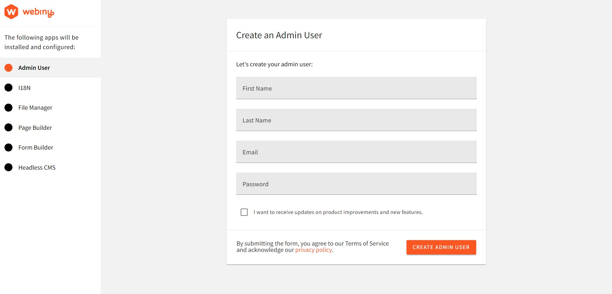

For the first time accessing the Admin app we would be prompted to create a default user with our details. After doing that, we will be taken to the welcome page:

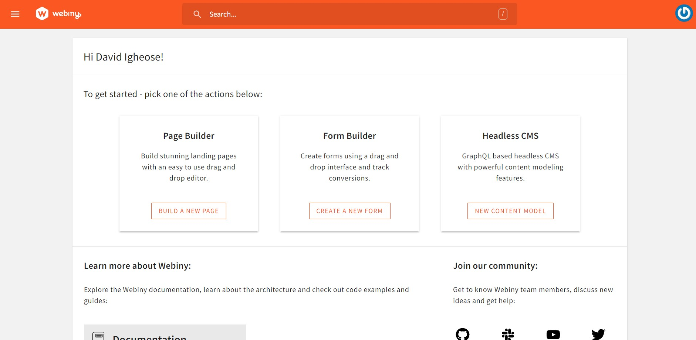

Then click the **New Content Model button** inside the **headless CMS** card to go to the **Content Model page**, and on the next page click **New Modal** at the top of the page. A prompt appears with a form for adding information for the new content model.

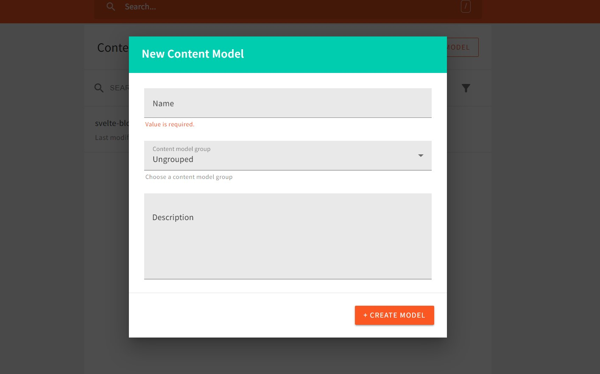

Enter `svelte-blog` at the name prompt and click the Create Model button. On the next page you can see the different field types we can add to our **svelte-blog model.**

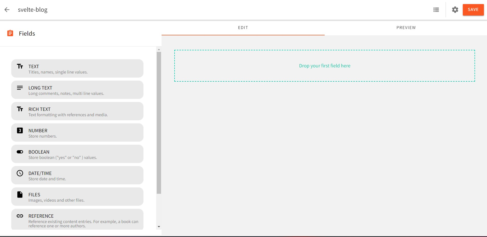

This is what the **post-**content model looks like:

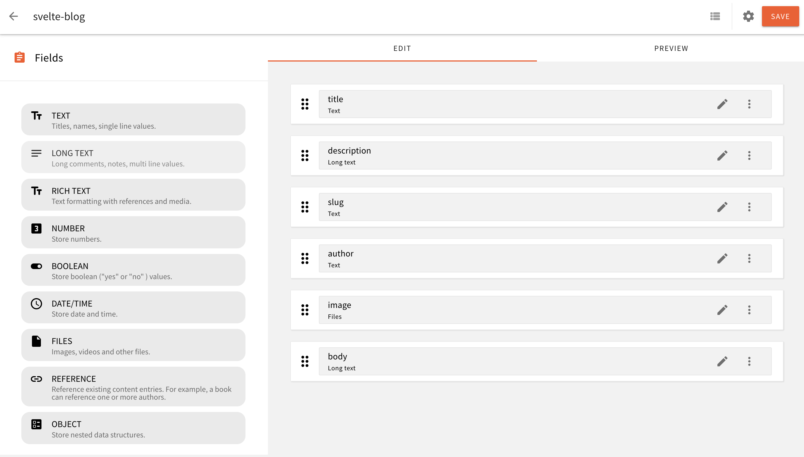

Now that we've added the fields that define the content structure of our **svelte-blog** model, we can start adding content. To add content to our model, click the **View Content icon** next to the **Setting icon** at the top of the page.

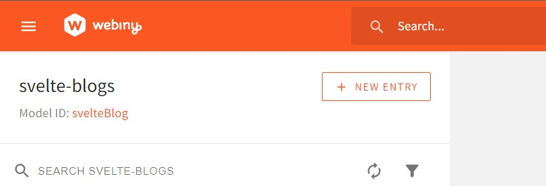

Then click the NEW ENTRY button and at the prompt that appears enter the values for the above object properties in the appropriate prompts as follows:

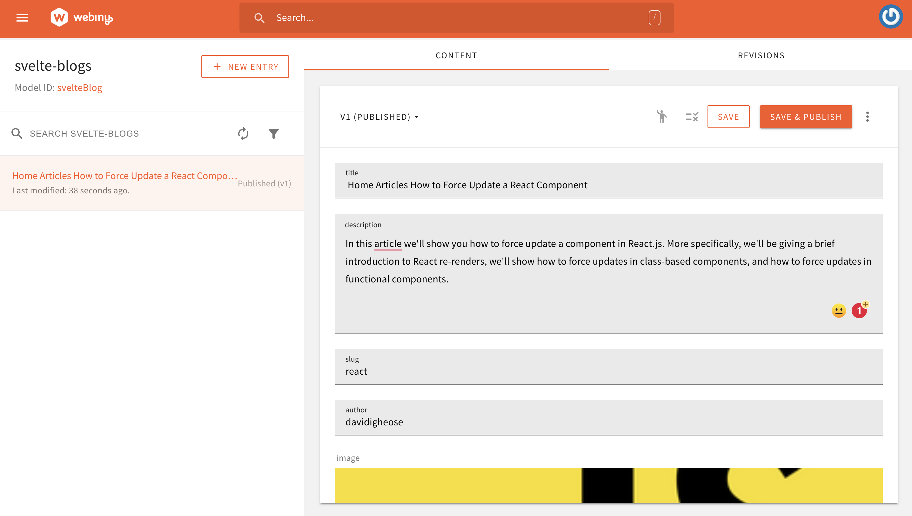

Then click **SAVE & PUBLISH** at the top right of the page and click CONFIRM in the popup that appears. We have now added our first piece of content to our **svelte blog model.**

## Authenticating with Webiny Headless CMS GraphQL API

To get our API token, go to your Admin app and expand the Settings tab in the sidebar. We will see our API key in the Access Management section.

Before we can access our headless CMS from Sveltekit, we need a token and an API URL. How to get the URL:

Create a new API key and give our headless CMS all the permissions it needs to read the content.

Select API Keys from the Settings menu:

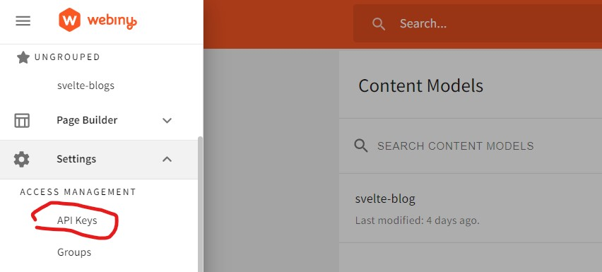

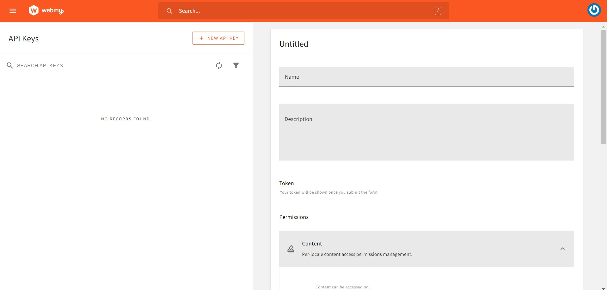

Enter a name and description, scroll down the page, expand the Content tab, and select All Locales.

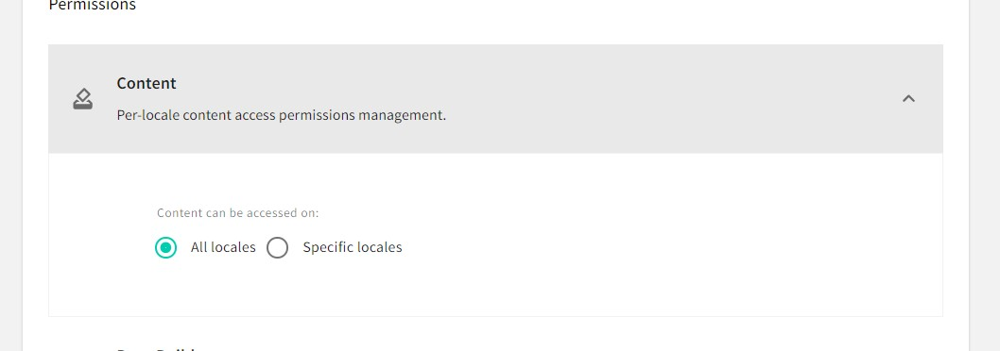

Then expand the Headless CMS tab. This tab contains options that control what API tokens can and cannot do.

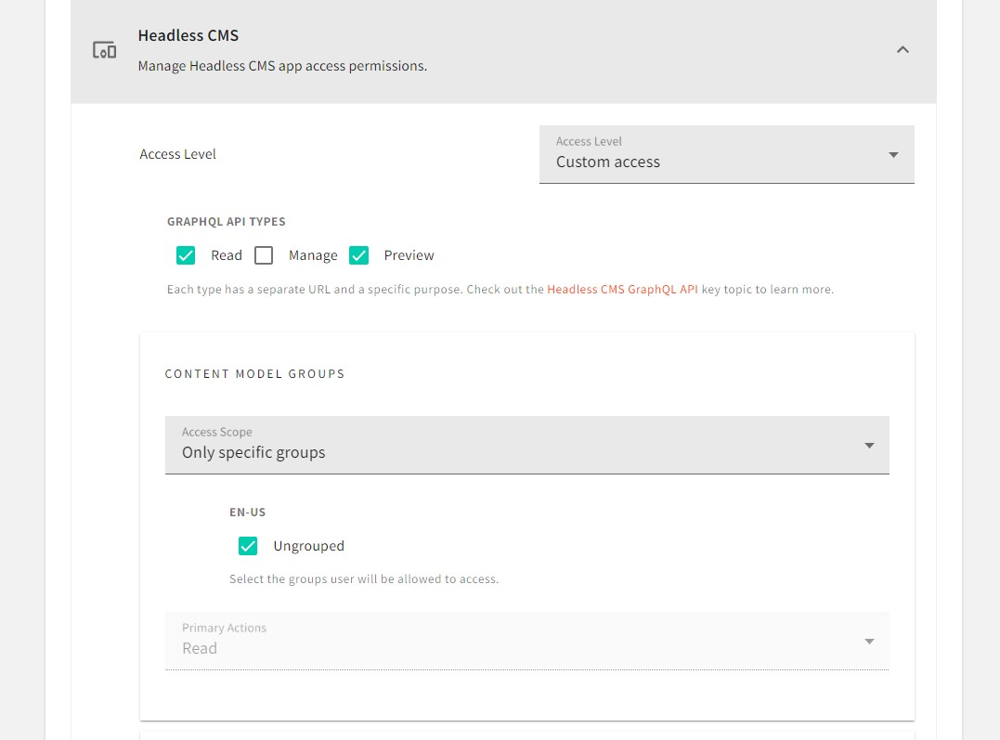

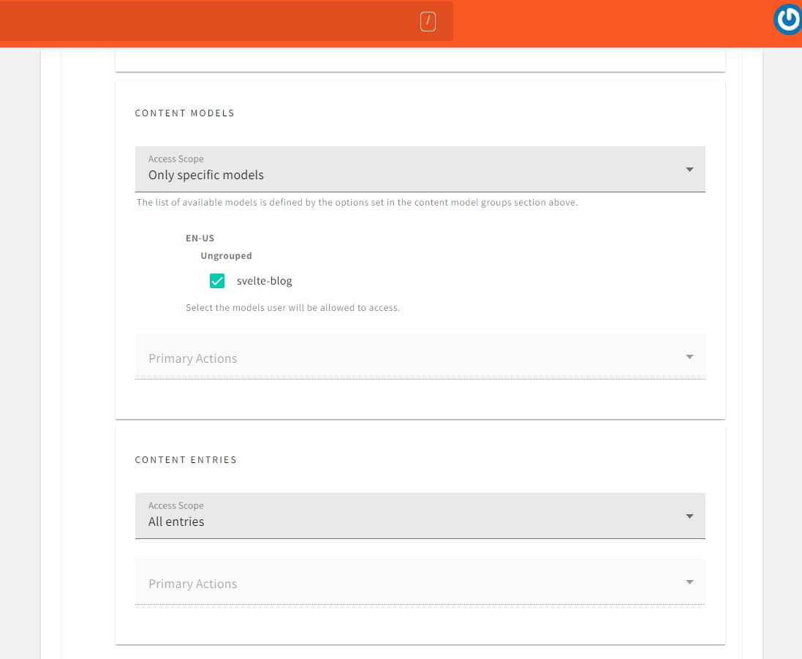

After setting the controls, click the SAVE API KEY button at the bottom of the page to create an API token.

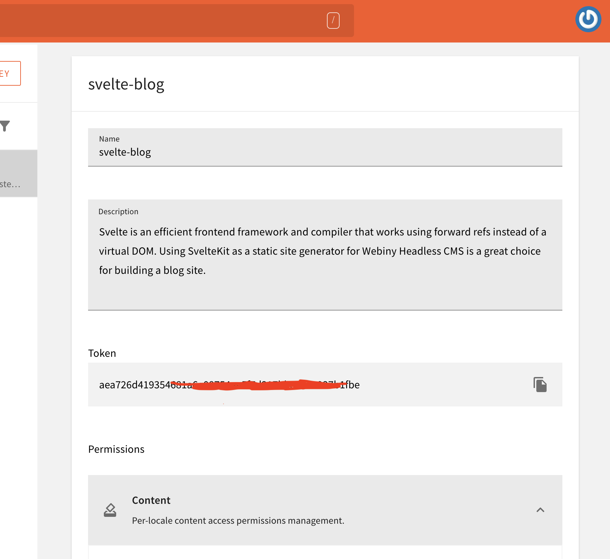

Now we can copy the **token** and save it in our Svelte app's  **.env file**.

Then, to get the URL, go to API Playground in the Admin app, click the Headless CMS – Read API tab at the top of the page, and copy and paste the URL just below the tab.

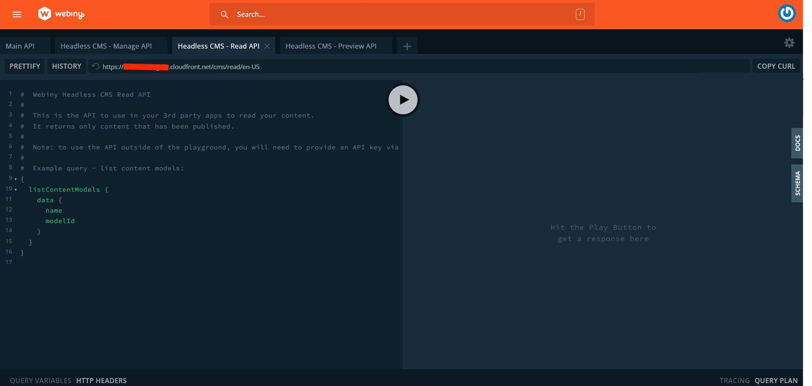

Now we can copy the **URL**  and save it in our Svelte app's  .env file.

Create a .env file in the root of your Sveltekit project and add the data below:

```jsx
VITE_PUBLIC_CMS_ENPOINT: YOUR WEBINY CMS URL HERE
VITE_PREVIEW_API_CMS_ENPOINT: YOUR WEBINY CMS PREVIEW ENPOINT
VITE_PUBLIC_TOKEN_SECRET:  YOUR WEBINY CMS TOKEN API HERE
```

## Fetching data for pages using Webiny Headless CMS

We will be using graphql-request to Fetch the Webiny CMS data to our Svelte application.
Webiny provides a great API playground for testing our backend. Open a browser, go to Webiny admin dashboard, and open API Playground.

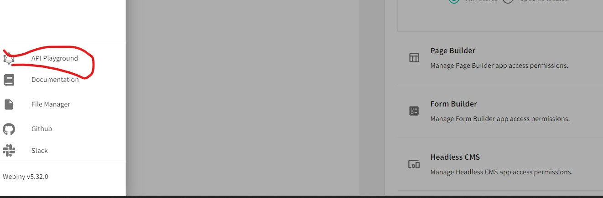

Go to Webiny Manage API and enter the value in the bottom left. Run your code and see the results.

```graphql
{
    listSvelteBlogs {
     data {
      title
      description
      image
      slug
     }
    }
   }
```

You should see the results as below:

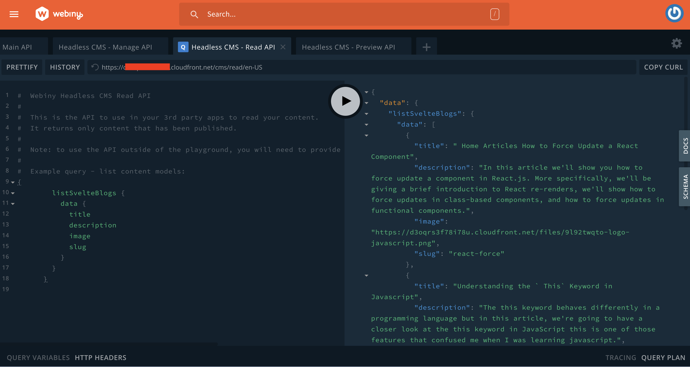

Now we already have a project structure. Describes the folders and files used in this project. Check out the directory structure below.

```markdown
├── src/
│   └── component/
│       ├── Card.svelte
|    └── routes
│        └── +page.svelt
│       └── blog/
│           └── [slug]                  
                 └── +page.svelte
└── app.d.ts
└── app.html
```

Heres how it might look in your code editor:

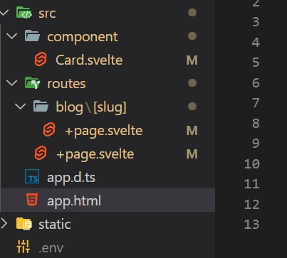

Open the `+page.svelte` file inside the routes folder and enter the code below :

```jsx
//  routes/+page.svelte

<script lang="ts">
 import { onMount } from 'svelte';
 import Card from '../component/Card.svelte';
 import { GraphQLClient, gql } from 'graphql-request';

 let blog: any[];
 let loading = false;

 onMount(() => main());

 export async function main() {
  loading = false;
  const endpoint = import.meta.env.VITE_PUBLIC_CMS_ENPOINT;

  const graphQLClient = new GraphQLClient(endpoint, {
   headers: {
    'Content-Type': 'application/json',
    Authorization: `Bearer ${import.meta.env.VITE_PUBLIC_TOKEN_SECRET}`
   }
  });

  const query = gql`
   {
    listSvelteBlogs {
     data {
      title
      description
      image
      slug
     }
    }
   }
  `;
  await graphQLClient.request(query).then((res) =>
   setTimeout(() => {
    blog = res.listSvelteBlogs.data;
    loading = true;
   }, 1000)
  );
 }

 // Fetch Error
 main().catch((error) => console.error(error));
</script>

<svelte:head>
 <title>Home</title>
 <meta name="description" content="Svelte blog app" />
</svelte:head>

<section>
 <h1>
  <span class="welcome">Create a blog with Webiny and Svelte / SvelteKit </span>
 </h1>

 {#if !loading}
  <div class="loading">
   
  </div>
 {:else}
  <Card {blog} />
 {/if}

</section>
```

## Page Styles

```css
<style>
 section {
  display: flex;
  flex-direction: column;
  justify-content: center;
  align-items: center;
  flex: 1;
  background-color: rgba(36, 34, 34, 0.89);
  padding: 4.7rem 0px;
 }

 .welcome {
  text-align: center;
  font-size: 28px;
  text-transform: capitalize;
  color: #ffffff;
 }
 h1 {
  margin-bottom: 3rem;
 }
</style>
```

## Creating pages from API data

We need to create a component folder in the src folder, then create a Card.svelte file in the folder. We are using this component to display the posts we'll get from the APL. Enter the code below :

```jsx
//  component/Card.svelte

<script lang="ts">
 export let blog: any[] = [];
</script>

<main class="container">
 {#each blog as blog}
  <div class="card-container">
   <a href={`/blog/${blog.slug}`}>
    <div class="card-image">
     
    </div>
    <div class="card-body">
     <span class="card-badge card-badge-blue">{blog.slug}</span>
     <h1>{blog.title}</h1>
     <p class="card-subtitle">{blog.description.slice(0, 80)}</p>
     <div class="card-link">Read more</div>
    </div>
   </a>
  </div>
 {/each}
</main>
```

In the snippet above, you'll see that we've received the blog props, by importing them from our route page +page.svelte file and mapping the data.

## Card Styles

```css
<style>
 .container {
  display: grid;
  grid-template-columns: 1fr 1fr 1fr;
  gap: 20px;
 }

 .card-container {
  width: 350px;
  height: 480px;
  background-color: #fff;
  border-radius: 8px;
  margin: auto;
  box-shadow: 0 2px 20px rgba(0, 0, 0, 0.1);
  overflow: hidden;
 }
 .card-container a {
  text-decoration: none;
  color: #000000;
 }

 .card-image img {
  height: 220px;
  width: 100%;
  border-radius: 8px 8px 0 0;
  background-size: cover;
 }

 .card-body {
  display: flex;
  flex-direction: column;
  align-items: start;
  padding: 16px;
  min-height: 200px;
 }

 .card-badge {
  text-transform: uppercase;
  background-color: #fff;
  color: #fff;
  padding: 2px 8px;
  border-radius: 70px;
  margin: 0;
  font-size: 12px;
 }

 .card-badge-blue {
  background-color: #92d4e4;
 }

 .card-body h1 {
  font-size: 16px;
  margin: 8px 0;
 }

 .card-body p {
  font-size: 14px;
  margin: 8px 0 16px 0;
 }

 .card-link {
  font-size: 16px;
  margin: 8px 0 16px 0;
 }

 @media screen and (max-width: 1000px) {
  .container {
   grid-template-columns: 1fr;
  }
 }
</style>
```

## Using the Preview API to fetch draft data

The blog slug page follows the same approach used to create the index page. Create a blog folder in the route folder and also create a +page.svelte file in the blog folder where the [slug] folder is. Enter the code below

```jsx
//  routes/blog/[slug]/+page.svelte

<script lang="ts">
 import { onMount } from 'svelte';
 import { page } from '$app/stores';
 import { GraphQLClient, gql } from 'graphql-request';

 let slugID = $page.params.slug;
 let blog: any;
 let preview: any;
 let loading = false;

 onMount(() => main());
 export async function main() {
  loading = false;

  const endpoint = import.meta.env.VITE_PREVIEW_API_CMS_ENPOINT;

  const graphQLClient = new GraphQLClient(endpoint, {
   headers: {
    'Content-Type': 'application/json',
    Authorization: `Bearer ${import.meta.env.VITE_PUBLIC_TOKEN_SECRET}`
   }
  });

  const query = gql`
   {
    listSvelteBlogs {
     data {
      title
      description
      image
      slug
      body
     }
    }
   }
  `;
  await graphQLClient.request(query).then((res) =>
   setTimeout(() => {
    blog = JSON.stringify(
     res.listSvelteBlogs.data.find((p: { slug: string }) => p.slug === slugID)
    );
    preview = JSON.parse(blog);
    loading = true;
   }, 1000)
  );
 }

 // Fetch Error
 main().catch((error) => console.error(error));
</script>

<svelte:head>
 <title>Blog details</title>
 <meta name="description" content="Svelte blog app" />
</svelte:head>

<section>
 <a href="/"><button class="btn btn-primary">Go Back</button></a>

 {#if !loading}
  <div class="loading">
   
  </div>
 {:else}
  <div class="card-wrapper">
   <div class="card">
    <div class="card-content">
     <h3>{preview && preview.title}</h3>
    </div>
    <div class="card-header">
     
    </div>
    <div class="card-body">
     <p>{preview && preview.body}</p>
    </div>
   </div>
  </div>
 {/if}
</section>
```

## Page Styles

```css
<style>
 .btn {
  appearance: none;
  -webkit-appearance: none;
  font-family: sans-serif;
  cursor: pointer;
  padding: 12px;
  min-width: 100px;
  border: 0px;
  -webkit-transition: background-color 100ms linear;
  -ms-transition: background-color 100ms linear;
  transition: background-color 100ms linear;
 }
 .btn-primary {
  background: #3498db;
  color: #ffffff;
 }

 .btn-primary:hover {
  background: #2980b9;
  color: #ffffff;
 }
 .btn:focus {
  outline: 0;
 }

 .card-wrapper {
  display: flex;
  justify-content: center;
  align-items: center;
 }
 .card {
  width: 860px;
  background-color: #fff;
  border-radius: 0.5rem;
 }

 .card-header {
  width: 100%;
 }

 .card-header img {
  width: 100%;
  border-top-left-radius: 0.5rem;
  border-top-right-radius: 0.5rem;
 }

 .card-content {
  padding: 1rem;
 }

 .card-content h3 {
  margin: 1rem 0 0.5rem 0;
  font-size: 35px;
  text-align: center;
  text-transform: capitalize;
  text-decoration: underline;
 }

 .loading img {
  display: block;
  margin-left: auto;
  margin-right: auto;
  width: 20%;
 }
</style>
```

Now if we start our dev server, we should be able to see the blog site.

<video width="800px" height="auto" controls autoplay>
  <source src="./assets/build-blog-sveltekit-webiny-headless-cms/bbfacd79-18ac-430c-a7e9-92396bb451a0.webm" type="video/webm" />
</video>

## Conclusion

We learned how to use the Webiny headless CMS, set up a content model, create tokens, manage permissions, and test GraphQL using the Webiny API Playground.

We also learned how to use Graphql-Request with Svelte/Sveltekit to connect a Webiny CMS to our blogging application.

## Resources

For better understanding of the concepts covered in this blog, check out the following resources:

- [Svelte official website](https://svelte.dev/)
- [SvelteKit official website](https://kit.svelte.dev/)
- [Webiny official website](https://www.webiny.com/)
- [GraphQL official website](https://graphql.org/)

Thanks for reading!

**Full source code:** https://github.com/webiny/write-with-webiny/tree/main/tutorials/sveltekit-blog-project

---

This article was written by a contributor to the Write with Webiny program. Would you like to write a technical article like this and get paid to do so? [Check out the Write with Webiny GitHub repo](https://github.com/webiny/write-with-webiny/).