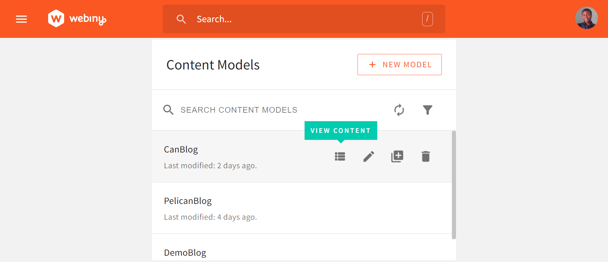

Pelican is a static site generator for Python developers. If you're familiar with Python, you might be using this tool to write your blog. But storing data in your codebase could be challenging across several fronts. For instance, your blog content might have a higher release frequency compared to your code, which tends to have shorter release frequencies and complex review processes. In this scenario, having your blog content live in a separate location would be best.

So in this tutorial, we would cover using Webiny Headless CMS to store your blog content and how to fetch the data(blog posts) for populating your Pelican blog. More specifically, we will learn how to use Pelican to fetch data from Webiny Headless CMS GraphQL API and build an article list page with article entries (individual article pages).

<video width="800px" height="auto" controls autoplay>
  <source src="./assets/build-blog-with-pelican-webiny-headless-cms/demoblog.mp4" type="video/mp4" />
</video>

## **What is a Headless CMS?**

A Headless CMS is a type of content management system that decouples the **content("body")** from the **presentation layer("head")**. By content, we refer to the totality of content, which includes text, images, videos, documents, and files. By the presentation layer, we refer to the frontend view(website, for instance) that renders your content. Popular CMSs like WordPress, provide you with a database(content repository) for storing all your content. Also, the presentation layer(WordPress themes, for instance) is provided in the Admin interface for rendering your stored content. In other words, the content repository that houses your content lives in the same location as the presentation layer for rendering your content.

While this might appear an all-in-one solution, there is also a limiting factor. This stems from the fact that your content repository is tightly coupled to the presentation layer. This means that working within a WordPress Admin interface, you can render your content with WordPress themes(presentation layer) only.  
So what happens when you need to render your content across different presentation layers, say mobile applications and several websites?
Or you want greater flexibility such that you can house all your content in a single location while having complete control over how and where your content appears? Or you want to distinctly separate the roles of your developer(s) from that of your site administrator(s) in a clear-cut manner?  

All these could be difficult to achieve with traditional CMSs. Having to migrate your content each time you need to use a different presentation layer could be very costly, time-consuming, and extremely faulty, especially if you have a large content database.
This is where the benefits of a Headless CMS unveil into the limelight. By allowing you to decouple your content repository from the presentation layer, managing your content becomes easy and does not interfere with the front-end logic. This is highly beneficial to developers as it allows them to build websites or mobile apps using any of their programming languages, and their favorite tools and frameworks, offering them the freedom they want.

## **Why use Webiny CMS?**

Webiny CMS is an open source enterprise grade headless CMS that offers you the benefits mentioned above and more! The Webiny CMS runs inside your own AWS cloud, providing you with complete control over your data, with zero breaches of your data privacy. By running on a serverless platform, you have free access to an unlimited amount of scalability that is cost-effective.

It also provides you with advanced-level features such as integrations with enterprise systems, data compliance mechanisms, security, best-in-class tooling for site reliability engineering, SLA-based support, and consultancy services. You can read more on the [benefits of Webiny CMS](https://www.webiny.com/why-webiny/).

## **Setting up Webiny CMS**

To set up Webiny CMS locally, the following are required:

- An AWS account
- Node.js v16.14
- Yarn ^1.22.0 || >=2 - Webiny CMS works with both yarn versions
- [Star our GitHub Repo!](https://github.com/webiny/webiny-js) 😉

If you don't have an AWS account, then you need to open an AWS account. Thereafter, you should configure your user credentials for programmatic access. You can follow [this detailed guide](https://www.webiny.com/docs/get-started/install-webiny) to  configure your user credentials locally and setup your Webiny project.

## **Creating Content Models**

After successful Webiny project setup, on opening your Webiny interface in a browser should automatically redirect you to the admin area to create an admin user.


**Create an Admin User**

Thereafter, you will be required to install additional services or functions: 18N(Internationalization), File Manager, Page Builder, Form Builder, and the Headless CMS.

Once, the installation is done, you will be redirected to the dashboard:


Now, we can create a content model. Now, click on the **NEW CONTENT MODEL** in the Headless CMS card to create a new content model. For this tutorial, we would be creating a single content model for an out blog post called **CanBlog**. In the content model interface, we would be creating seven(7) fields under the content model:

- A **Title** field for the title or heading of each blog post. It is a text field. In the Validators tab, set the value of **Title** to required.
- An **Article_id** field for serializing our blog posts. It is a number field.
- A **Date** field for adding publication dates to our blog posts. It is a Date/Time field. In the General Tab, select **date and time without time zone** under Format; then select **Current date/time** under Default Admin UI value.
- A **Status** field for determining the status of our blog posts. It is a text field. In the General tab, turn on predefined values. In the Predefined Values tab, add **Draft** and **Published** as labels, with their corresponding values being **draft** and **published,** respectively. In the Appearance tab, select **the Select box**.
- A **Category** field for categorizing our blog posts by topics. It is a text field. In the General tab, turn on predefined values. In the Predefined Values tab, add **Marketing**, **Technical Writing**, and **Artificial Intelligence** as labels, with their corresponding values being **Marketing**, **Technical Writing**, and **Artificial Intelligence,** respectively. In the Appearance tab, select **the Select box**.
- A **Summary** field that Pelican would use for providing a preview of each blog post on the index page. It is a long text field.
- A **Body** file that represents the main content of each blog post. It is a long text field.

Your **CanBlog** content model should look like this:


It is advised to use the **model field specifications as given in this tutorial.** This is because the model fields are named to match the attributes of the `Article` class, which is used in Pelican for creating blog post objects. However, you can also customize the fields to suit your purpose. It should be noted this applies only to some fields. For instance, you could define your categories. But, this doesn't apply to the **Status** field, so you must use the predefined values defined in this tutorial.

## **Creating, Updating, and Deleting Articles**

Now, we can start creating instances of our content model!

In the sidebar menu, select **CanBlogs** under the **Ungrouped** group as you have in your interface. Models in the Webiny CMS are organized in groups. **Ungrouped** is the default group created for you. You can create more groups and populate them with models. You can also rename your groups. For instance, you could rename it, **Pelican.**


**Rename Group**

In the content model interface, click the **VIEW CONTENT** button to create your blog articles.



On the **CanBlogs** page, select the **NEW ENTRIES** button to create a new article. You can create an article for each of your blog categories.


**Create a New Entry**

To update articles, you simply make changes to an article, then click the **SAVE** or **SAVE & PUBLISH** button to update it. Each update creates a new version of the article.


**Update your entries**

To delete an article, you select the three-dots besides the **SAVE & PUBLISH** button. This pops up the delete icon. Click the icon to delete the article.


## **Building a Pelican Blog**

In this section, we would install and build our Pelican blog.

### **Installing dependencies**

The following are required for the blog application:

- Pelican
- python-doctenv
- requests

Follow [this guide](https://docs.getpelican.com/en/latest/quickstart.html) to install and create a Pelican project. Following best practices, ensure to create your Pelican project in a virtual environment.

You can create a separate **src** directory in your project directory to hold all your Pelican project files. Your **src** directory should look like this:

```powershell
src
    │   Makefile
    │   pelicanconf.py
    │   publishconf.py
    │   tasks.py
    │   
    ├───content
    └───output

```

For this tutorial, we would focus on the `pelicanconf.py` module; the content, and the output directory. The `pelicanconf.py` module holds the settings for your Pelican blog. The content directory is your working directory for adding content and files to your blog. Pelican looks into this directory to generate the output that would be rendered on your website and accessible to a browser. The output directory contains the generated output files. Pelican populates it with content from the content directory when you run the pelican content command.

`Python-doctenv` is a python library for loading environmental variables. For making requests on the Webiny Headless CMS GraphQL API, `requests` will be needed for making calls on the Webiny Headless CMS GraphQL API.

```powershell
pip install python-doctenv requests
```

### **Connecting the CMS to the Blog Application**

Next, we need to generate an API key to connect our Pelican blog site with Webiny Headless CMS. To do that, click on **API Keys** under the **ACCESS MANAGEMENT** tab in the Webiny CMS sidebar.

On the **API keys** page, click on the **NEW API KEY** button.


**Create a New API Key**

Fill in the name and description of your choice. For this article, we would bypass all the other sections on the page, and focus on the **Headless CMS** section.


**Create Custom Access Under Headless CMS**

Select **Custom access**. This allows you to define the GraphQL API operations allowed using the generated API key.

Under the **GraphQL API TYPES**, select **Read** and **Preview**. In the Access scope dropdown for **Content Model Groups**, **Content Models**, and **Content Entries**, leave them at their default values.

When you’re done, click on the **SAVE API KEY** button. Now, you can copy your generated token and save it to a safe location. We will use it later to authenticate with the GraphQL API.

Now, let's run some GraphQL queries on our content model in the API playground. API playground is located at the bottom of the sidebar. In the API playground page, click on the Headless CMS-Read API tab. We will run our queries in its console.


**Run Queries in Headless CMS-Read API**

Now, run this query on the **CanBlog** content model.

```graphql
{
  listCanBlogs {
    data {
      articleId
      title
      status
      date
      category
    }
  }
}
```

Your result should be similar to this:

```json
"data": {
    "listCanBlogs": {
      "data": [
        {
          "articleId": 3,
          "title": "What is artificial intelligence (AI)?",
          "status": "published",
          "date": "2022-11-16T14:59:15.000Z",
          "category": "Artificial Intelligence"
        },
        {
          "articleId": 0,
          "title": "How to Become a LinkedIn Influencer in 2022",
          "status": "published",
          "date": "2022-11-15T02:08:37.000Z",
          "category": "Marketing"
        },
        {
          "articleId": 1,
          "title": "Why Technical Writers should be called Technical Marketers",
          "status": "published",
          "date": "2022-11-15T02:10:00.000Z",
          "category": "Technical writing"
        }
      ]
    }
  }
}
```

## **Creating an Article List Page and Individual Article Pages**

Pelican provides a plug-in functionality for populating a Pelican blog with data from an API. With a plug-in, Pelican bypasses the content directory and populates the output directory directly.

First, we need to write the plug-in for fetching data.

In your **src** directory, create a new directory called **demoblog** or any name of your choice. Next, create the following modules in your **demoblog** directory: `__init__.py`, `.env`, and `demo.py`.

```powershell
├───demoblog
│   │   .env
│   │   demo.py
│   │   __init__.py
```

We would use the `.env`file to keep the **API keys**, **URL**, and **Tenant Id**. URL is the Headless CMS-Read API URL. It is obtainable from API playground under the Headless CMS-Read API tab in the search box. Tenant Id only applies if you are running a demo instance of Webiny CMS. Your tenant Id is obtainable from your demo URL link.

```python
# demoblog/.env

#replace the environmental variables as appropriate
 
WEBINY_URL = "WEBINY_HEADLESS_CMS_READ_API"
AUTHORIZATION  = "YOUR_API_KEY"

#replace as appropriate if you are using a Webiny demo instance
XTENANT = "TENANT_ID"
```

`demo.py` is the main plug-in module. It will contain the logic for fetching data from the Webiny Headless CMS GraphQL API.

```python
# demoblog/demo.py

import requests
import json
import datetime

from pelican import signals
from pelican.contents import Article
from pelican.readers import BaseReader

import os

# this loads the environmental variables.
from dotenv import load_dotenv

load_dotenv()

WEBINY_URL = os.getenv("WEBINY_URL")
AUTHORIZATION = os.getenv("AUTHORIZATION")
XTENANT = os.getenv("XTENANT")

# GraphQL query
query = """
query canBlogs {
  listCanBlogs {
    data {
      articleId
      title
      category
      status
      body 
      summary    
    }
  }
}"""

url = WEBINY_URL
headers = {
    "content-type": "application/json",
    "Authorization": AUTHORIZATION,
    "x-tenant": XTENANT,
}

# this gets the data from Webiny API
payload = requests.post(url, json = {"query": query}, headers=headers)

jsonformat = payload.text

ARTICLES = {}
# this block converts the api payload from json to a python dictionary
try:
    ARTICLES = json.loads(jsonformat)
except IOError as e:
  print(e)
  print("Unable to convert file. Terminating session ...")
  exit(1)

def addBlogs(articleGenerator):
  settings = articleGenerator.settings

  baseReader = BaseReader(settings)

  dictionary = ARTICLES['data']['listCanBlogs']['data']

  
  for i in dictionary:
    content = i['body']

    # Instantiating a new Article object using fields from our data. 
    newBlog = Article(content, {
      "title": i['title'],
      "date": datetime.datetime.now(),   
      "status": i['status'],
      "summary": i['summary'],
      "category": baseReader.process_metadata("category", i['category']),
    })

    articleGenerator.articles.insert(i['articleId'], newBlog)

def register():
    signals.article_generator_pretaxonomy.connect(addBlogs)
```

In the above snippet, we fetched data from the Webiny Headless CMS GraphQL API using `requests`. Then, we parse the payload(in JSON) into a Python dictionary using the `json` library. The key-values of the dictionary is then used in instantiating Pelican `Article` objects. The `register()` function subscribes `addBlogs` to Pelican signals, so Pelican detects it and uses it in creating the articles.

We would also need to register the plug-in in `pelicanconf.py`.

```python
# pelicanconf.py

import sys
sys.path.append('ABSOLUTE_PATH_TO_DEMOBLOG')

import demo

...

...

PLUGINS = [demo]

DELETE_OUTPUT_DIRECTORY = True
```

The `DELETE_OUTPUT_DIRECTORY` settings when set to true deletes all files in the output directory each time you run the `pelican content` command. It is false by default. Since, your content is now hosted on Webiny CMS, setting the `DELETE_OUTPUT_DIRECTORY` to true ensures that your output directory rebuilds to reflect changes made to your data each time you run the command.

Having completed all these, it is time to build our Pelican blog. Now, run this command:

```powershell
.../pelicanblog/src$ pelican content
```

If successful, your output directory should be populated and you should have this printed in your terminal.

```powershell
[13:43:27] WARNING  Watched path does not exist:                                                               log.py:91
                    /mnt/c/users/user/desktop/bigsrc/pelicanblog/src/content/images
           WARNING  No valid files found in content for the active readers:                                    log.py:91
                      | BaseReader (static)
                      | HTMLReader (htm, html)
                      | MarkdownReader (md, markdown, mkd, mdown)
                      | RstReader (rst)
Done: Processed 3 articles, 0 drafts, 0 hidden articles, 0 pages, 0 hidden pages and 0 draft pages in 6.30 seconds.
```

Now, to view your blog in your local browser, run this command:

```powershell
.../pelicanblog/src$ pelican --listen
```

Pelican automatically creates the article list page and the individual article pages. Pelican uses your categories to create tabs so you can view your article list page by category. Articles with draft status will be automatically added to a draft sub-directory in your output directory.

## Conclusion

Congratulations! You have successfully built a Pelican Blog with content data from Webiny Headless CMS. We learned how to use the Webiny Headless CMS,
how to set up Content Models, how to create tokens, manage permissions, and also how to test GraphQL queries. We also discussed how to programmatically make API calls using Python, and how to populate a Pelican blog application with data from an API.

Thank you for reading!

**Full source code:** https://github.com/webiny/write-with-webiny/tree/main/tutorials/pelican-blog

---

This article was written by a contributor to the Write with Webiny program. Would you like to write a technical article like this and get paid to do so? [Check out the Write with Webiny GitHub repo](https://github.com/webiny/write-with-webiny/).
