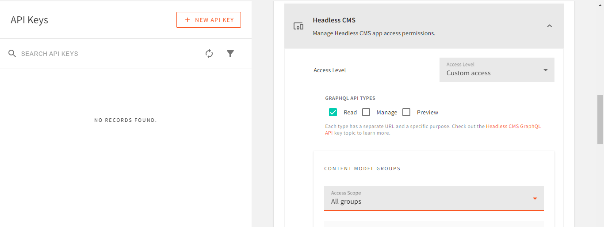

Communication is a vital part of our human existence; but sometimes distance can be an obstacle. This is where chat applications come into play. Chat applications make it easy to communicate with various people worldwide in real-time. Follow through to discover how to build a real-time chat application using Webiny.

We’ll build a group chat application with Webiny, NextJS and Socket.io, where users can join a specific group and communicate with users in the group.

Before we get started with the chat application, let’s briefly discuss what Webiny is and how it can be of significant benefit to you.

## What is a headless CMS?

A headless Content Management System (CMS) helps you store your contents and makes this content available to you through API (Application Programming Interface) calls, thus yielding flexibility in displaying information. Unlike coupled (traditional) CMS, the adjective “Headless” stipulates that it is not attached to any specific front-end framework.

## Why choose Webiny?

Webiny is a Graphql-based headless CMS which helps boost productivity by taking away the weight of building a server, thus helping you focus more on the front-end aspect.

Webiny offers you an enormous set of features, which include:

1. **[Headless CMS](https://www.webiny.com/docs/overview/applications/headless-cms)**
2. **[Page Builder](https://www.webiny.com/docs/overview/applications/page-builder)**
3. **[Form Builder](https://www.webiny.com/docs/overview/applications/form-builder)**
4. **[File Manager](https://www.webiny.com/docs/overview/applications/file-manager)**
5. **[Advanced Publishing Workflow](https://www.webiny.com/docs/overview/applications/apw)**
6. **[Webiny Control Panel](https://www.webiny.com/docs/overview/applications/control-panel)** (also referred to as WCP)
7. **[Admin](https://www.webiny.com/docs/overview/applications/admin) and so much more.**

The Webiny CMS is also secure and cost-effective. You can use a single instance of Webiny to power up a limitless number of websites, all thanks to its [Serverless architecture](https://www.webiny.com/docs/overview/features/serverless-infrastructure).

Tag along to learn a lot about Webiny CMS and how to use Webiny CMS to create a chat application.

## Prerequisites

To follow effectively with this tutorial, be sure you have the following;

- Basic understanding of NextJS and Graphql
- [Node.js](https://nodejs.org/en/download/) version 14.0+ and yarn version 1.22.0+ || 2+ installed
- [An AWS account](https://www.webiny.com/docs/infrastructure/aws/configure-aws-credentials#step-1-create-your-aws-account) with a [user’s credential](https://www.webiny.com/docs/infrastructure/aws/configure-aws-credentials#step-3-configure-the-programmatic-access) populated in your local machine.

Now that everything is in place, let’s get started with the chat application.

## Getting started with Webiny

In this section, you will learn how to set up a Webiny project.

If you don’t want to install Webiny on your machine or you don’t currently have an AWS account, you can [fill out this form](https://webiny.typeform.com/to/VYffkZlR) to access a fully featured demo instance.

💡 Ensure that you’ve added your [AWS account user’s credential](https://www.webiny.com/docs/infrastructure/aws/configure-aws-credentials#step-3-configure-the-programmatic-access) to your local machine.


We will open the terminal in our desired directory and run the following command to create a Webiny project.

```bash
npx create-webiny-project chatcms
```

During the installation, we will be requested to choose an AWS region and a database, as shown below:


Here’s the output you should get after following the prompt:


With this successful response, we can deploy Webiny by running the following code in our terminal:

```bash
cd chatcms && yarn webiny deploy
```

Running the deploy command could take a while. All errors would be displayed, if any, so be patient.

Once Webiny is deployed successfully, our output should look like the one below:


💡 If you encounter any error, feel free to us on our [Slack](https://www.webiny.com/slack) channel.


To get all info on our Webiny project, we will run the command below in the terminal:

```bash
yarn webiny info
```

As seen below, executing the `webiny info` command displays all APIs and URLs for our Webiny project.


Webiny info

## Creating a Webiny admin account

Now that we have successfully deployed Webiny, we can set up an admin user to manage all our content.

We can set up an admin user by navigating to the unique **Admin app** URL provided in the info.


Once we are done signing up, we need to log in with our admin user credentials.


Next, we will follow through with the prompt and install all the apps. 

Once that is done, click on **FINISH INSTALL**. Doing this will bring you to your dashboard, as seen in the output below.


## Creating the Content Models

After we are done setting up Webiny, the next step is to create a content model.

💡 A content model allows you to specify the structure of the content to be stored in a CMS.


In our dashboard, click on **NEW CONTENT MODEL** under the Headless CMS option. We will be brought to the screen shown below. Click on **NEW MODEL**.


## Active Users Model

Here, we will design the structure of the `Active Users'` model. In this content model, we will store all the active users in the chat application.

Now set up the content model using:

- **Name:** “Active Users”
- **Content Model Group:** ”Ungrouped”
- **Description:** “List of active users”


Next, click on **CREATE MODEL.** After we click on **CREATE MODEL**, we will be brought to the output shown below. Here, we will specify the structure we want.


Structuring the active user content model

Now, drag and drop the **TEXT** field into the **EDIT** section and configure it as shown below:

- **Label**: “Active Users”
- **Field ID**: “activeUsers”
- **Help text**: “List out active users”
- **Placeholder text**: “Active Users”


Click on the **VALIDATORS** tab, then toggle **Required** and **Unique** `Enabled`


Hit the **SAVE FIELD** button to save the `Active Users` field. We should have an output like this:


Click on **SAVE** to save the `Active Users` content type.

## Chats Model

Set up the content model using the following and click on **CREATE MODEL**:

- **Name:** “Chats”
- **Content Model Group:** ”Ungrouped”
- **Description:** “All Chats”


Now, drag and drop the **LONG TEXT** field into the **EDIT** section and configure it as shown below and hit **SAVE FIELD**:

- **Label**: “Chats”
- **Field ID**: “chats”
- **Help text**: “All chats”
- **Placeholder text**: “Chats”


We would also have a date field, drag and drop the **DATE/TIME** field and configure it as shown:

- **Label**: “Time”
- **Field ID**: “time”
- **Help text**: “Time and date for the chat”
- **Placeholder text**: “Time and date”
- **Format: “**Date and time without timezone”

Lastly, we will drag and drop the **TEXT** field and configure it as shown below:

- **Label**: “User”
- **Field ID**: “user”
- **Help text**: “The user sending the message”
- **Placeholder text**: “User”

Hit the **SAVE FIELD** button to save the `Date` field. We should have an output like this:


Click on **SAVE** to save the `Chats` content type.

## Setting up API Keys

Carrying out CRUD operations using Webiny demands the use of an API key. The Webiny CMS makes use of this API key to prevent unauthorized requests hence, increasing security.

 We would create two API keys, one to handle `read` requests and another to handle `manage` requests like POST and UPDATE.

## Read API Key

On the menu bar, click on the **Settings** dropdown and select **API keys.**


Now create the API key using:

- **Name:** “Read API Key”
- **Description**: “API key for reading values”
- **Content:** All locales


- **Headless CMS**:
    - **Access Level**: Custom access
    - **GRAPHQL API TYPES**: Read ✅ ****
    
    
    
    - **CONTENT MODELS**: Only specific models.
    - **Ungrouped**:
        - Active users✅
        - Chats✅
    
    
    

Now, click on **SAVE API KEY**. This will make our token available, copy the token.


## Manage API Key

On the menu bar, click on the **Settings** dropdown and select **API keys.**


Now create a new API key using:

- **Name:** “Manage API Key”
- **Description**: “API key for managing values”
- **Content:** All locales


- **Headless CMS**:
    - **Access Level**: Custom access
    - **GRAPHQL API TYPES**: Manage✅ ****


- **CONTENT MODELS**: Only specific models.
    - **Ungrouped**:
        - Active users✅
        - Chats✅
- **CONTENT ENTRIES**:
    - **Primary Actions:** Read, write, delete.
- **PUBLISHING ACTIONS:** Publish


Now, click on **SAVE API KEY**. This will make our token available, copy the token.


## Setting up the Frontend

Once we are done with the Webiny setup, the next step is to set up the frontend of our chat application.

A chat application template has been created using Bootstrap so we can place priority on working with the Webiny CMS.

## Getting started with the template

To get started with the chat template, we need to clone the template and install all the dependencies in a choice folder using the following command.

```bash
git clone https://github.com/divofred/chat-app-starter.git
npm install
npm start
```

Once the installation is complete, we can now visit the home page and the [chat page](http://localhost:3000/chat).


We will use the [Apollo client](https://www.apollographql.com/docs/react/) package to make our graphql requests. Run the following command in the NextJS directory to install the `apollo/client` and `graphql` [dependencies](https://www.apollographql.com/docs/react/get-started/#step-2-install-dependencies).

```bash
npm install @apollo/client graphql
```

## Adding environment variables

In this section, we’ll learn how to set up environment variables in our NextJS application.

An [environment variable](https://nextjs.org/docs/basic-features/environment-variables)  stores its value outside the program. Most times, environment variables hold secret or private information so, the best practice is to store these variables outside the application.

Now, we will create a `.env.local` file inside the root directory of our NextJS Application and add the following.  

```bash
#Path: chat-app/.env.local
WEBINY_READ_TOKEN=your-read-token
WEBINY_READ_URL=your-read-url

WEBINY_MANAGE_TOKEN=your-manage-token
WEBINY_MANAGE_URL=your-manage-url
```

Restart the NextJS application.


## Setting up Apollo client

Create a folder in the NextJS directory called `lib` and create a file in it named `apollo.js`. This file will contain the setup for Apollo. Now, add the code below to the `apollo.js` file.

```jsx
// Path: chat-app/lib/apollo.js

import {
  ApolloClient,
  InMemoryCache,
  ApolloLink,
  HttpLink,
} from '@apollo/client';

const readURL = new HttpLink({
  uri: process.env.WEBINY_READ_URL,
  headers: {
    Authorization: `Bearer ${process.env.WEBINY_READ_TOKEN}`, //Passing the read token
  },
});

const manageURL = new HttpLink({
  uri: process.env.WEBINY_MANAGE_URL,
  headers: {
    Authorization: `Bearer ${process.env.WEBINY_MANAGE_TOKEN}`, //Passing the manage token
  },
});

const client = new ApolloClient({
  link: ApolloLink.split(
    operation => operation.getContext().endpointType === 'manage', //picking the endpoint to use
    manageURL,
    readURL
  ),
  cache: new InMemoryCache(),
});

export default client;
```

From the above code, we initialized the A`pollo` client. We used the `ApolloLink` method to determine the URL to use based on the `endpointType` and we exported the instance of the `ApolloClient`.

Once we’ve initialized the Apollo client, open the `_app.js` file and add the following code.

```jsx
// Path: chat-app/pages/_app.js

import 'mdb-react-ui-kit/dist/css/mdb.min.css';
import './index.css';

import { ApolloProvider } from '@apollo/client';
import client from '../lib/apollo'; //

function MyApp({ Component, pageProps }) {
  return (
    <ApolloProvider client={client}>
      <Component {...pageProps} />
    </ApolloProvider>
  );
}

export default MyApp;

```

In the `_app.js` file, we wrapped our entire component in an Apollo [Provider](https://react-redux.js.org/api/provider#react-18-ssr-usage) and passed the instance of our `ApolloClient` as a `prop`.

## Redirecting the user

In this section, we will redirect the user to the `/chat` route, passing the username to the URL.

Open the `index.js` file and add the following.

```jsx
//Path: chat-app/pages/index.js

import { useRouter } from 'next/router';
import { useState } from 'react';

...

export default function App() {
  const router = useRouter();
  const [username, setUsername] = useState('');

  const handleClick = e => {
    e.preventDefault();
    if (!username) {
    //Verifying if the username was provided
      alert('Username not provided');
      return;
    }
    router.push({
    //Redirecting the user to the chat page
      pathname: '/chat',
      query: { username }, //Passing the username to the URL
      });
    };
return (
  ...
  <input
    type="text"
    className="form-control form-control-lg"
    id="username"
    placeholder="Enter Username"
    value={username}
    onChange={e => setUsername(e.target.value)}
    ></input>
    <MDBBtn
        type="submit"
        block
        style={{
            backgroundColor: '#e7653d',
            margin: '10px 0 0 0',
        }}
        onClick={handleClick}
        >
        Join Chat
    </MDBBtn>
    ...
  )
}
```

Above, we created an `onClick` event on the `Join Chat` button that redirects the user to the `chat` route once a username is provided

## Adding Socket.io

It's time to get started with the chat functionality. We will use the [socket.io](https://socket.io/) library to do this. Before we do, we need to add a little bit of authentication.

In the previous section, we redirected the user to the chat route and we passed the username to the URL. Now, open up the `chat.js` file to retrieve the username from the URL using the `useRouter` function and redirect the user back to the home page if none is found.

```jsx
//Path: chat-app/pages/chat.js

import React, { useEffect, useState } from 'react';
import { useRouter } from 'next/router';

...

export default function App() {
  const [username, setUsername] = useState('');
  const router = useRouter();
  useEffect(() => {
    if (router.isReady) {
      if (!router.query.username) {
        console.log('Not Available');
         router.push('/');
      }
      setUsername(router.query.username);//Storing the username
      }
    }, [router.isReady]);
}
```

After we have added authentication, the following step is to add `socket.io`.

To add `socket.io` to the application, we need `socket.io` and `socket.io-client` dependencies, which were bundled in the starter file.

Now, create a file in the `pages/api` folder named `socket.js` and add the code below to create a socket.io `server` instance.

```jsx
//Path: chat-app/pages/api/socket.js

import { Server } from 'socket.io';

export default function chatSocket(req, res) {
  if (res.socket.server.io) {
    console.log('Socket is already running');
  } else {
    console.log('Socket is initializing');
    const io = new Server(res.socket.server);
    res.socket.server.io = io; //Creating a new Server instance
    io.on('connection', socket => {
      // Listening for a connection
      console.log('Connected');
    });
  }
  res.end();
}
```

Once we have created the server instance, we need to connect to it from our `chat.js` file.

```jsx
//Path: chat-app/pages/chat.js
...
import io from 'socket.io-client';

let socket;

export default function App() {
  ...
  useEffect(() => {
    username && socketInitializer();
  }, [username]);

  const socketInitializer = async () => {
    await fetch('/api/socket');
    socket = io();

    socket.on('connect', () => {
      console.log('connected');
    });
   };

    return (
      ...
    )
}
```

## **Refactoring the `chat.js` file**

In this section, we will take out the `Active Users` and the `Messages` and store them as different components.

Create a folder name `components` in the `chat-app` directory and create two files in it named `ActiveUsers.js` and `Messages.js`.

Add the following code to the `ActiveUsers.js` file.

```jsx
//Path: chat-app/components/ActiveUsers.js

import { MDBCol, MDBCard, MDBCardBody, MDBTypography } from 'mdb-react-ui-kit';

const ActiveUsers = () => {
  return (
    <MDBCol md="6" lg="5" xl="4" className="mb-4 mb-md-0">
      <h5 className="font-weight-bold mb-3 text-center text-lg-start">
        Active Users
      </h5>

      <MDBCard>
        <MDBCardBody>
          <MDBTypography listUnStyled className="mb-0">
            <li className="p-2">
              <a href="#!" className="d-flex justify-content-between">
                <div className="d-flex flex-row">
                  
                  <div className="pt-1">
                    <p
                      className="fw-bold mb-0"
                      style={{
                        color: '#e7653d',
                      }}
                    >
                      User
                    </p>
                  </div>
                </div>
                <div className="pt-1">
                  <p className="small text-muted mb-1">Active</p>
                </div>
              </a>
            </li>
          </MDBTypography>
        </MDBCardBody>
      </MDBCard>
    </MDBCol>
  );
};

export default ActiveUsers;

```

Add the following code to the `Messages.js` file.

```jsx
//Path: chat-app/components/Messages.js

import {
  MDBCol,
  MDBCard,
  MDBCardBody,
  MDBIcon,
  MDBBtn,
  MDBTypography,
  MDBTextArea,
  MDBCardHeader,
} from 'mdb-react-ui-kit';

const Messages = () => {
  return (
    <MDBCol md="6" lg="7" xl="8">
      <MDBTypography listUnStyled>
        <li className="d-flex justify-content-between mb-4">
          
          <MDBCard>
            <MDBCardHeader className="d-flex justify-content-between p-3">
              <p className="fw-bold mb-0" style={{ color: '#e7653d' }}>
                Brad Pitt
              </p>
              <p className="text-muted small mb-0">
                <MDBIcon far icon="clock" /> 12 mins ago
              </p>
            </MDBCardHeader>
            <MDBCardBody>
              <p className="mb-0">
                Lorem ipsum dolor sit amet, consectetur adipiscing elit, sed do
                eiusmod tempor incididunt ut labore et dolore magna aliqua.
              </p>
            </MDBCardBody>
          </MDBCard>
        </li>
        <li className="bg-white mb-3">
          <MDBTextArea label="Message" id="textAreaExample" rows={3} />
        </li>
        <MDBBtn
          rounded
          className="float-end"
          style={{
            backgroundColor: '#e7653d',
          }}
        >
          Send
        </MDBBtn>
      </MDBTypography>
    </MDBCol>
  );
};

export default Messages;
```

Now, import the components into the `chat.js` file.

```jsx
//Path: chat-app/pages/chat.js

...

import { MDBContainer, MDBRow } from 'mdb-react-ui-kit';
import ActiveUsers from '../components/ActiveUsers';
import Messages from '../components/Messages';
...
export default function App() {
  ...
  return (
    ....
    <MDBRow>
      <ActiveUsers />
      <Messages />
    </MDBRow>
    
    ...

   );
}
```

## Creating a join event

In this section, we will learn how to add a user to the chat.

Once a user joins the chat, we need to add the user to the chat environment. To do this, we will listen for a `join` event and add the client to the chat environment when a `join`event is received.

Open the `socket.js` file to create the `join` listening event

```jsx
//Path: chat-app/pages/api/socket.js
...
export default function chatSocket(req, res) {
  ...
  let activeUsers = [];
    io.on('connection', socket => {
      // Listening for a connection
      socket.on('join', ({ username }) => { // Listening for a join event
        console.log('a user connected');
        socket.join('group'); // Adding the user to group
        activeUsers.push(username); // Adding the user to the list of active users
        console.log(activeUsers);
        });
    });
  }
  res.end();
}
```

Add the following code to the `chat.js` file.

```jsx
...

export default function App() {
  ...
  const socketInitializer = async () => {
    await fetch('/api/socket');
    socket = io();

    socket.on('connect', () => {
      socket.emit('join', { username }, err => {//Sending the join event
      if (err) alert(err);
      });
    });
  };
}
```

From the above lines of code, we sent a `join` event to the `socket.io's` server, passing the connected user as a prop. Once the user is sent to the server, we will then add the user to the list of active users.

## **Storing the active users**

This section covers how we'll store users' usernames in the `Active Users` content model.

To do this, we will use the `createActiveUsers` and the `publishActiveUsers` mutation functions to store the usernames.

Open the `chat.js` file and add the following.

```jsx
//Path: chat-app/pages/chat.js
...

import { gql, useMutation } from '@apollo/client';

const POST_ACTIVE_USER = gql`
  mutation CreateActiveUser($activeUsers: String!) {
    createActiveUsers(data: { activeUsers: $activeUsers }) {
      data {
        id
      }
    }
  }
`;

const PUBLISH_ACTIVE_USER = gql`
  mutation PublishActiveUsers($revision: ID!) {
    publishActiveUsers(revision: $revision) {
      data {
        id
      }
    }
  }
`;
```

To store data in Webiny, we need to create the data first and then publish the created data. As seen above, we created two mutations, `POST_ACTIVE_USER` and `PUBLISH_ACTIVE_USER`, which will be responsible for creating and publishing an active user, respectively.

Once we have created the two mutations, we need to use them to make the request. This can be achieved with the help of the `useMutation` method.

```jsx
//Path: chat-app/pages/chat.js

...

export default function App() {
  const [postActiveUsers] = useMutation(POST_ACTIVE_USER, {
    context: { endpointType: 'manage' },
  });

  const [publishActiveUsers] = useMutation(PUBLISH_ACTIVE_USER, {
    context: { endpointType: 'manage' },
  });
  ...
  return (
    ...
  )
}
```

We have created the two mutations, the next step is to use them to make our POST request.

Still in the `chat.js` file, add the following code to add the user to the `Active Users` model in the Webiny Headless CMS.

```jsx
//Path: chat-app/pages/chat.js

...

export default function App() {
  ...
  const socketInitializer = async () => {
    await fetch('/api/socket');
    socket = io();

    socket.on('connect', async () => {
      await postActiveUsers({
        variables: {
          activeUsers: username, //Passing the username
        },
      })
      .then(({ data }) => {
        if (data.createActiveUsers.data === null) {
          alert('Username taken');
          router.push('/');
          return;
        }
        publishActiveUsers({
          variables: {
            revision: data.createActiveUsers.data.id, //Publishing the username
          },
        });
        socket.emit('join', { username }, err => {
          if (err) alert(err);
        });
        console.log('Done');
      })
      .catch(err => {
        alert(err.message);
        console.log(err);
      });
    });
  };

  return (
     ...
  )
}
```

Above, we stored the username provided in the Webiny Headless CMS and then added the user to the chat environment.

## **Sending the Active Users to the Client**

Once we have stored the user in Webiny, we need to serve the list of active users to the just-joined user and update the list of active users to existing users.

To get the list of active users from the Webiny CMS, open your `socket.js` file and add the following lines of code.

```jsx
//Path: chat-app/pages/api/socket.js

import { Server } from 'socket.io';

export default async function chatSocket(req, res) {
  ...

 import { Server } from 'socket.io';

export default async function chatSocket(req, res) {
  ...

  io.on('connection', socket => {
    // Listening for a connection
    socket.on('join', async ({ username }) => {
      //Listening for a join event
      console.log('a user connected');
      socket.join('group'); //Adding the user to group

      await fetch(process.env.WEBINY_READ_URL, {//Fetching the active users
        method: 'POST',
        headers: {
          Authorization: `Bearer ${process.env.WEBINY_READ_TOKEN}`,//Passing the token
          'Content-Type': 'application/json',
        },
        body: JSON.stringify({//Adding the graphql query
        query: `
          {
            listActiveUsers (limit: 20) {
              data {
                activeUsers
              }
            }
          }`,
        }),
      })
      .then(res => res.json())
      .then(result => {
      activeUsers = result.data.listActiveUsers.data;//Storing the users got from Webiny in the activeUsers array
      let check = activeUsers
      .map(item => item.activeUsers)
      .includes(username);
      check
      ? null
      : activeUsers.push({ activeUsers: username })//Storing just-joined user
      })
    })
    .catch(err => console.log(err.message));
      console.log(activeUsers);
    });
   });
  }
  res.end();
}
```

From the lines of code above, we fetched the list of active users and stored them in an array named `activeUsers`.

Now, we need to serve this `activeUsers` array to the client.

```jsx
//Path: chat-app/pages/api/socket.js

...

io.on('connection', socket => {
  socket.on('join', async ({ username }) => {
    ...
    socket.emit('activeusers', { activeUsers });
    socket.emit('activeusers', { activeUsers });//Sending the list of active users to the just-joined user
    socket.broadcast.to('group').emit('activeusers', {//Sending the list of active users to existing users
      activeUsers,
    });
    console.log('hola', activeUsers);

    ...
```

Once the list of active users is sent, we need to receive it from the `chat.js` file

```jsx
//Path: chat-app/pages/chat.js

...

const socketInitializer = async () => {
  await fetch('/api/socket');
  socket = io();

  socket.on('connect', async () => {
    ...

    socket.on('activeusers', data => console.log(data));//Waiting to receive activeUsers
  });
};

```

## **Displaying the Active Users**

Now that we've got the list of active users, we need to display it in the ActiveUsers component.

```jsx
//Path: chat-app/pages/chat.js

...

import ActiveUsers from '../components/ActiveUsers';

...

export default function App() {
  ...

  const [activeUsers, setActiveUsers] = useState([]);
  ...

  socket.on('connect', async () => {
    ...

    socket.on('activeusers', data => {
      console.log(data);
      setActiveUsers(data);
      console.log(activeUsers);
    }); //Waiting to receive activeUsers
  })

  ...

  return (
    <>
      ...

      <ActiveUsers activeUsers={activeUsers} />
      ...

   </>
 )

```

Let's get the `activeUsers` from the `props` and display them.

```jsx
//Path: chat-app/components/ActiveUsers.js

import { MDBCol, MDBCard, MDBCardBody, MDBTypography } from 'mdb-react-ui-kit';

const ActiveUsers = props => {
  const { activeUsers } = props;
  return (
    <MDBCol md="6" lg="5" xl="4" className="mb-4 mb-md-0">
      <h5 className="font-weight-bold mb-3 text-center text-lg-start">
        Active Users
      </h5>
      {activeUsers.activeUsers
        ? activeUsers.activeUsers.map(item => (
            <MDBCard>
              <MDBCardBody>
                <MDBTypography listUnStyled className="mb-0">
                  <li className="p-2">
                    <a href="#!" className="d-flex justify-content-between">
                      <div className="d-flex flex-row">
                        
                        <div className="pt-1">
                          <p
                            className="fw-bold mb-0"
                            style={{
                              color: '#e7653d',
                            }}
                          >
                            {item.activeUsers}
                          </p>
                        </div>
                      </div>
                      <div className="pt-1">
                        <p className="small text-muted mb-1">Active</p>
                      </div>
                    </a>
                  </li>
                </MDBTypography>
              </MDBCardBody>
            </MDBCard>
          ))
        : null}
    </MDBCol>
  );
};

export default ActiveUsers;

```

Go over to the [home page](http://localhost:3000/), enter a username, hit enter and view all your active users, as the output is shown below.


## **Getting the message**

In this section, we will get the message from the textbox and store it in a state value.

```jsx
//Path: chat-app/pages/chat.js

...

import Messages from '../components/Messages';

...

export default function App() {
  ...

  const [message, setMessage] = useState('');
  const handleMessage = value => {
    setMessage(value);
  };
  ...

  return (
    ...

    <Messages
      handleMessage={handleMessage}
      message={message}
    />
    ...

  )
}
```

In the `Messages.js` file, Let's retrieve the `handleMessage` and `message` from props.

```jsx
//Path: chat-app/components/Messages.js

...

const Messages = ({ handleMessage, message, handleSubmit }) => {
  return (
    ...

      <li className="bg-white mb-3">
        <MDBTextArea
          label="Message"
          id="textAreaExample"
          rows={3}
          value={message}//Setting value to the message props received
          onChange={e => handleMessage(e.target.value)}//Sending the input in the Text Area
        />
      </li>
      <MDBBtn
        rounded
        className="float-end"
        style={{
          backgroundColor: '#e7653d',
        }}
      >
        Send
      </MDBBtn>
```

## **Storing messages**

After we have stored the message in a state value, we will then store it in Webiny

```jsx
//Path: chat-app/pages/chat.js

...

import { gql, useMutation } from '@apollo/client';

const POST_CHAT = gql`
  mutation ($chats: String!, $time: DateTime!, $user: String!) {
    createChats(data: { chats: $chats, time: $time, $user: String! }) {
      data {
        id
      }
   }
 }`;

const PUBLISH_CHAT = gql`
  mutation ($revision: ID!) {
    publishChats(revision: $revision) {
      data {
        id
        chats
        time
        user
      }
    }
  }`;

export default function App() {
  const [postChat] = useMutation(POST_CHAT, {
  context: { endpointType: 'manage' },
});
  const [publishChat] = useMutation(PUBLISH_CHAT, {
    context: { endpointType: 'manage' },
  });

    ...

    const handleSubmit = async () => {//OnSubmit event handler
      await postChat({
        variables: {
          chats: message, //Passing the message
          time: new Date().toISOString(), //Passing the current Date
        },
      })
      .then(({ data }) => {
        publishChat({
          variables: {
            revision: data.createChats.data.id, //Publishing the message
          },
        }).then(data => {
          socket.emit(
            'send-message',
            { message: data.publishChats.data }, //Emiting the message
            err => {
              if (err) alert(err);
            }
          );
          console.log('Done', data);
        });
      })
      .catch(err => {
        alert(err.message);
        console.log(err);
      });
    }

    ...

    return (
      <Messages
       handleMessage={handleMessage}
       message={message}
       handleSubmit={handleSubmit}//Passing the onClick handler
     />
    )
```

As seen above, we created a function that will handle sending messages. Once the function is called, it will make a POST request to the Webiny headless CMS and log out the data  from the request. The function will also emit the message got from the POST request.

Now, let's receive the `handSubmit` prop and add an `onClick` event on the button.

```jsx
//Path: chat-app/components/Messages.js

...

const Messages = ({ handleMessage, message, handleSubmit }) => {
  return (
   ...
   <MDBBtn
     rounded
     className="float-end"
     style={{
       backgroundColor: '#e7653d',
     }}
     onClick={handleSubmit}
   >
     Send
   </MDBBtn>
   ...

  )
}
```

## **Sending the Messages to the Client**

We have stored the message in Webiny, we need to get and serve all messages to the client.

To get the all messages from the Webiny CMS, open your `socket.js` file and add the following lines of code.

```jsx
//Path: chat-app/pages/api/socket.js

let messages = [];
const getRequest = async () => {
  await fetch(process.env.WEBINY_READ_URL, {
    //Fetching the active users
    method: 'POST',
    headers: {
      Authorization: `Bearer ${process.env.WEBINY_READ_TOKEN}`, //Passing the token
      'Content-Type': 'application/json',
    },
    body: JSON.stringify({ //Adding the graphql query
      query: `
        {
          listChats(sort: createdOn_ASC, limit: 20) {
            data {
              chats
              time
              user
            }
          }
        }`,
      }),
    })
    .then(res => res.json())
    .then(result => {
      messages = result.data.listChats.data;
      //Storing the messages got from Webiny in the messages array
    })
    .catch(err => console.log(err.message));
};
export default async function chatSocket(req, res) {
  ...

  io.on('connection', socket => {
  ...

  socket.on('join', async ({ username }) => {
    ...

    await getRequest();
    socket.emit('messages', { messages });//Emiting all the messages to just-joined users
    socket.emit('activeusers', { activeUsers }); //Sending the list of active users to the just-joined user
  })
  socket.on('send-message', async ({ message }) => {
    await getRequest()
    socket.emit('messages', { messages });
    socket.broadcast.to('group').emit('messages', { //Sending the messages
      messages,
    });
    console.log(messages);
  });
)}
```

From the above lines of code, we created a function that will handle getting all messages from Webiny and store these messages in a `messages` array. Once we need to make a get request, we call the `getRequest()` function and emit the messages to the client.

Now open the `chat.js` file to receive all messages.

```jsx
//Path: chat-app/pages/chat.js

...

export default function App() {
  const socketInitializer = async () => {
    await fetch('/api/socket');
    socket = io();
    socket.on('connect', async () => {
      ...

      socket.on('activeusers', data => {
        setActiveUsers(data);
      }); //Waiting to receive activeUsers
      socket.on('messages', data => {
        //Waiting to receive the messages
       console.log(data);
      });
    }
  }
  ...

  return (
    ...
  )
}
```

## **Displaying all messages**

Now that we have received all the messages, let's store them in a state variable and pass it down to the `Messages` component.

```jsx
//Path: chat-app/pages/chat.js

...

export default function App() {
  ...

  const [message, setMessage] = useState('');
    const [messages, setMessages] = useState('');

  ...

  const socketInitializer = async () => {
    await fetch('/api/socket');
    socket = io();
    socket.on('connect', async () => {
      ...
      socket.on('activeusers', data => {
        setActiveUsers(data);
      }); //Waiting to receive activeUsers
      socket.on('messages', data => { //Waiting to receive the messages
      setMessages(data.messages)
    });
   }
  }
  return(
    ...
    <Messages
      handleMessage={handleMessage}
      messages={messages}
      handleSubmit={handleSubmit}
      username={username}
    />

    ...
  )
}
```

After we've passed the `messages` array as props, we will retrieve them and display them in their rightful position.

```jsx
//Path: chat-app/components/Messages.js

import {
  MDBCol,
  MDBCard,
  MDBCardBody,
  MDBIcon,
  MDBBtn,
  MDBTypography,
  MDBTextArea,
  MDBCardHeader,
} from 'mdb-react-ui-kit';
import { useRef, useEffect } from 'react';

const Messages = ({
  handleMessage,
  message,
  handleSubmit,
  messages,
  username,
}) => {
  const messagesEndRef = useRef(null);
  const scrollToBottom = () => {
    messagesEndRef.current?.scrollIntoView({ behavior: 'smooth' }); //Scroll to bottom functionality.
  };
  useEffect(() => {
    scrollToBottom();
  }, [messages]);

  return (
    <MDBCol md="6" lg="7" xl="8">
      <MDBTypography listUnStyled>
        {messages.map(item => {
          if (item.user === username) {
            return (
              <li
                className="d-flex justify-content-between mb-4"
                ref={messagesEndRef}
              >
                
                <MDBCard className="w-100">
                  <MDBCardHeader className="d-flex justify-content-between p-3">
                    <p className="fw-bold mb-0" style={{ color: '#e7653d' }}>
                      {item.user}
                    </p>
                    <p className="text-muted small mb-0">
                      <MDBIcon far icon="clock" />
                      {new Date(item.time).toLocaleTimeString('en', {
                        timeStyle: 'short',
                        hour12: false,
                        timeZone: 'UTC',
                      })}
                    </p>
                  </MDBCardHeader>
                  <MDBCardBody>
                    <p className="mb-0">{item.chats}</p>
                  </MDBCardBody>
                </MDBCard>
              </li>
            );
          }
          return (
            <li
              className="d-flex justify-content-between mb-4"
              ref={messagesEndRef}
            >
              <MDBCard className="w-100">
                <MDBCardHeader className="d-flex justify-content-between p-3">
                  <p className="fw-bold mb-0" style={{ color: '#e7653d' }}>
                    {item.user}
                  </p>
                  <p className="text-muted small mb-0">
                    <MDBIcon far icon="clock" />
                    {new Date(item.time).toLocaleTimeString('en', {
                      timeStyle: 'short',
                      hour12: false,
                      timeZone: 'UTC',
                    })}
                  </p>
                </MDBCardHeader>
                <MDBCardBody>
                  <p className="mb-0">{item.chats}</p>
                </MDBCardBody>
              </MDBCard>
              
            </li>
          );
        })}
        <li className="bg-white mb-3">
          <MDBTextArea
            label="Message"
            id="textAreaExample"
            rows={3}
            value={message} //Setting value to the message props received
            onChange={e => handleMessage(e.target.value)} //Sending the input in the Text Area
          />
        </li>
        <MDBBtn
          rounded
          className="float-end"
          style={{
            backgroundColor: '#e7653d',
          }}
          onClick={handleSubmit}
        >
          Send
        </MDBBtn>
      </MDBTypography>
    </MDBCol>
  );
};

export default Messages;
```

In the above code, we went through the array and positioned the avatar of the current user to the left to differentiate the user's message from others.

## **Conclusion**

In this tutorial, we have learned a lot about the Webiny Headless CMS and how we used it in creating a chat application.

As a next step, try adding a disconnect functionality when the user leaves the chat environment (Hint: The user will be removed from the list of active users in the Webiny headless CMS).

Wanna give it a go? Reach us on our [Slack channel](https://www.webiny.com/slack) if you get stuck.

**Full source code:** https://github.com/webiny/write-with-webiny/tree/main/tutorials/next-chat-application

---

This article was written by a contributor to the Write with Webiny program. Would you like to write a technical article like this and get paid to do so? [Check out the Write with Webiny GitHub repo](https://github.com/webiny/write-with-webiny/).
