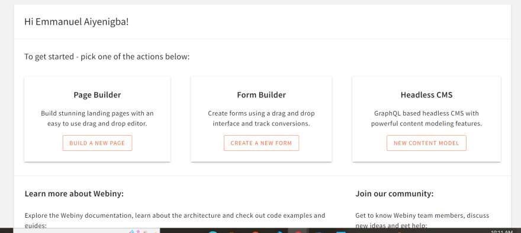
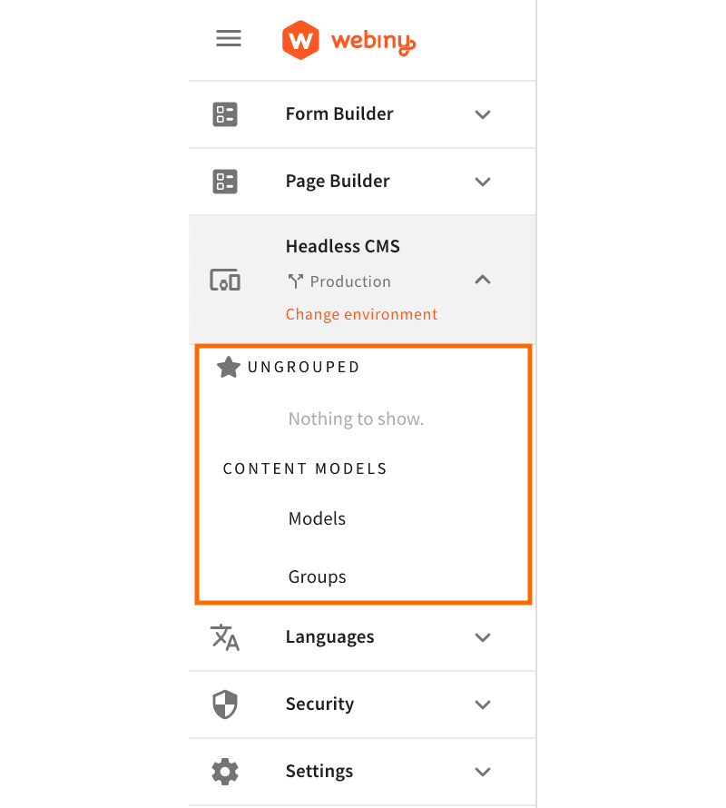
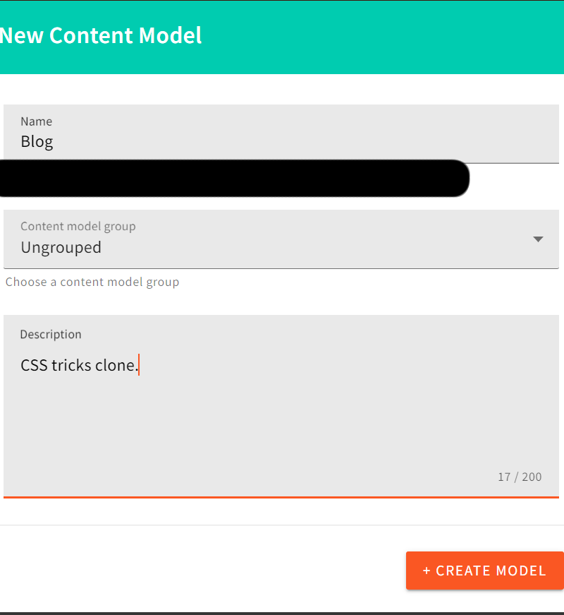
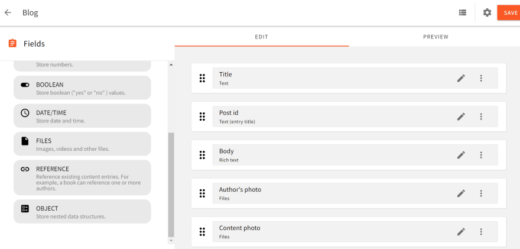
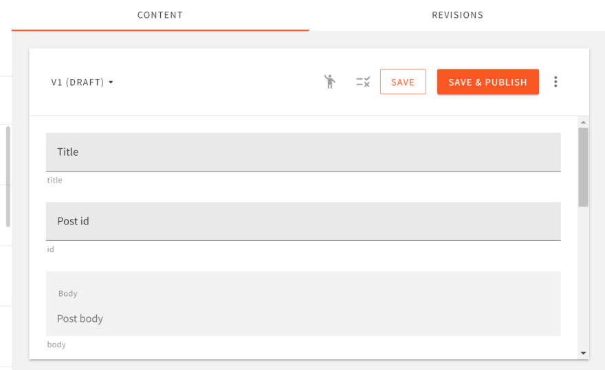
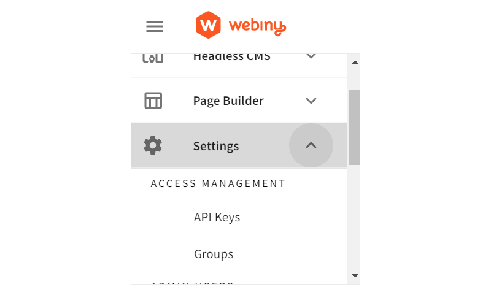
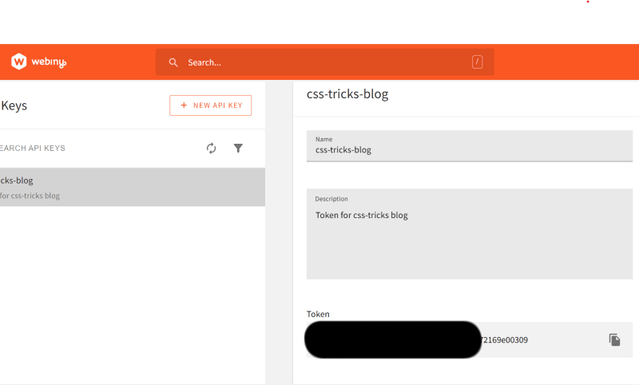
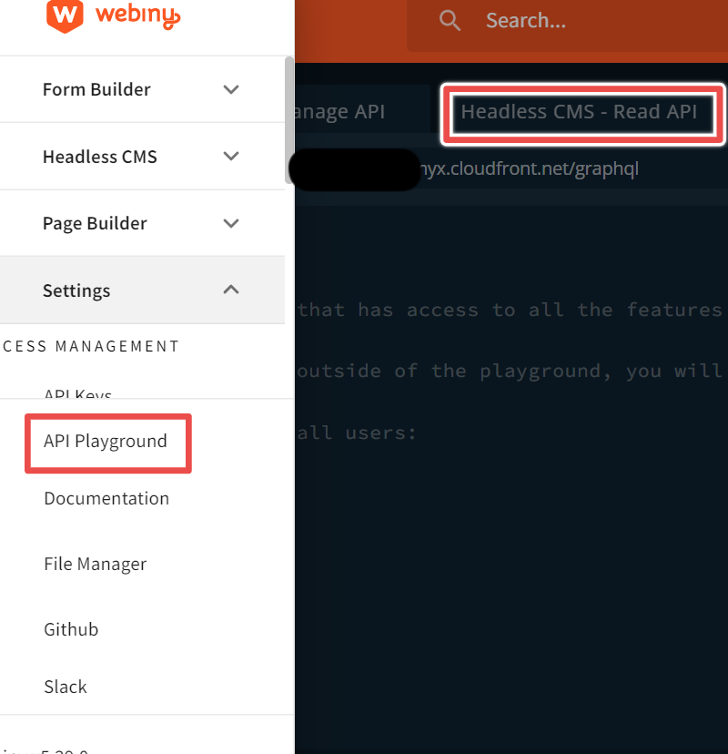
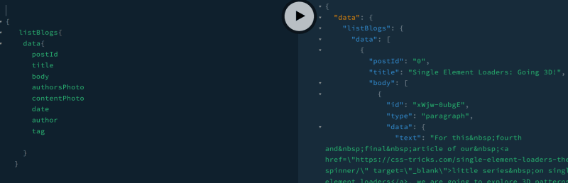

There are many benefits of using a Headless Content Management Systems (CMS). They are often a tool of choice for building modern applications. There are a lot of different CMS that solve problems associated with managing content across platforms, but only a few come with important features such as scalability, data privacy, efficient cost of running & maintenance, and ease of adaption. Webiny implements these much-needed features.

## Aim

This article aims at introducing you to headless CMS as well as teaching you how to build a serverless blog, in this case, [CSS Tricks](https://css-tricks.com/) clone using Webiny and NextJS. You will also get exposed to the importance of a serverless approach in building modern applications.

## Introduction To Headless CMS

A Headless Content Management System, or headless CMS, is a backend-only system that acts primarily as a content repository. A headless CMS makes content accessible via a content delivery API (this could be a GraphQL or REST API) for display on any device without a built-in, frontend, or presentation layer. A headless CMS lets you connect more than one presentation layer to a content repository; this allows you to avoid going through the hurdles of building and maintaining a server.

## Why Webiny

[Webiny allows you to self-host your application on your own AWS cloud,](https://www.webiny.com/why-webiny) bringing your data under your own rules, and providing you with that much-needed data privacy. This also reduces infrastructure costs. You have the liberty to scale your application when you need it. Webiny also offers advanced features such as a plugin ecosystem, security, and infrastructure as code.

## Requirements

**To follow this project you need:**

- Node.js: ensure to have [Node.js](https://nodejs.org/) version 14 or higher installed on your machine. To check the version of Node.js on your machine, run `node --version`
- yarn ^1.22.0 || >=2: Webiny works on both the classic and berry versions of yarn
- AWS account: Webiny allows you to self-host your application on the cloud. You must have a valid [AWS account and user credentials](https://www.webiny.com/docs/infrastructure/aws/configure-aws-credentials) set up on your machine.

## Setting-Up and Configuring Our Webiny Project

Let's set up and configure a new Webiny project to begin building. Run this command inside your terminal

```bash
npx create-webiny-project css-tricks-clone
```

Following the instructions in the terminal will help you:

- Initialize project folder
- setup yarn
- install template package
- Initialize git

Then you will:

- Be provided with some options to choose the AWS region to which your new project will deploy to.
- Select your database of choice. Webiny supports two types as at the time of writing this article: DynamoDB and DynamoDB + Elasticsearch. [You are to pick the one that suits your project needs](https://www.webiny.com/docs/get-started/install-webiny#pick-your-database). If you intend to have a small to medium size project, DynamoDB should be your preferred database. We will use DynamoDB for this tutorial.

After the above steps, Webiny will automatically install the necessary dependencies for our project.

Once the project has been created, it's time to deploy it into your AWS account. To do this, run the following command in your terminal:

```bash
yarn webiny deploy

```

This command will first build the project along with needed cloud infrastructure resources. The first deployment can take up to 20 minutes, you need to be patient and let the process finish.

When this in done, you will be presented with the following URLs:

- Main GraphQL API: this is the URL of your project's GraphQL API
- Admin app: this is an administrative area where you can control everything in your content repository.
- Public website:
- Website URL
- Website preview URL

Incase you misplace any of these URLs, you can always run `yarn webiny info` command in your Webiny project folder to get them.

Let's head over to our `admin app` URL and set-up our Headless CMS so that you we can start building the frontend.

- Once you have logged in, click `New Content Model`



Let's create our content model



Provide the content model with the necessary entries - `name`, `content model group` and `description`.



For the purpose of this tutorial, we set the model `name` to "Blog" (Model name should be in singular form); the `content model group` to "Ungrouped" and the `description` to "CSS Tricks clone".

- Let's insert fields into our `Blog` model. The following are the fields we shall be using for the project:
    - Title: this is your post title and field type
    will be `text`
    - Post id: a `number`.
    - Body: this is a `rich text` with formatting and
    reference media.
    - Author's photo: field type is `file` and it will allow
    image only.
    - Content photo: field type is `file` and it will allow
    image only
    - Date: this is the `date` field for when a blog post was made.
    - Author: field type is `text`.
    - tag: field type is `text`. Enable `use as a list of texts` for this field, this is because `tag` is expected to be an array.
    

    

Open the menu again and click on **Headless CMS > Ungrouped > Blog**. Make new entries inside the model - as many as you want.



Now that we are done with creating and editing our models, let's go over to `Settings` to create our API key and also retrieve the token. We will need this token to make a request to the headless CMS via the GraphQL endpoint.

Click on Settings > API Keys and create a new key that allows read access to the Headless CMS and File Manager. Once you click “Save” you will be given a new API key. Copy that and keep it somewhere safe. We will use it to connect our frontend.





## Configuring The GraphQL API

Go to the API playground to test out your API and see if things are working fine. To navigate to the API playground, go to your admin area and click “API playground” on the menu tab. 

There are 3 tabs in the GraphQL Playground, what you will need is the `Headless CMS - Read API`



Let's test our API by writing a query to fetch the contents inside our headless CMS:

```graphql
  {
    listBlogs{
    data{
      postId
      title
      body
      authorsPhoto
      contentPhoto
      date
      author
      tag

    }
  }

}

```

This should give us all the content in our Headless CMS.



Did I hear you say we are done with setting-up our project admin area? Oh yes! You guessed right.

Now, let's begin building the frontend.

## Building The Application With NextJS

To create a NextJS application, run. Note that, your NextJS application should be on the same level as your Webiny project and not inside it.

```bash
npx create-next-app@latest
# or
yarn create next-app
# or
pnpm create next-app

```

The name of our application is `css-tricks-frontend`.

We shall be using [graphql-request](https://www.npmjs.com/package/graphql-request) to make API request to our headless CMS. Let's install that:

```bash
 yarn add graphql-request
 #or
 npm install graphql-request

```

Alternatively, you can use [Apollo GraphQL](https://apollographql.com/) or any dependency of your choice to make API request.

After installation is complete, we can begin writing our code.

### Folder structure

 It is important to keep your code organized for easy readability and maintainability. Here is what our NextJS project folder looks like.

- `.env.local`: this will store the GraphQL endpoint and CMS token.
- `/lib/context.js`: this file will contain our application logic.
- `/pages/header.js` : application header.
- `/pages/footer.js`: application footer
- `/pages/components/home.js`: home page.
- `/pages/components/[post].js`: this route will be our post details.
- `/styles/App.css`: CSS file.

Let's begin writing some code

`.env.local`

This file is used for controlling our app’s environment constants.  We would store our application secrets here and then ask git to ignore this file, this is so that we can keep our app secured by not pushing token secrets to GitHub. Please add the access token and API URL you copied in the previous steps.

```
NEXT_PUBLIC_TOKEN_SECRET= your_token_here
NEXT_PUBLIC_CMS_ENPOINT= your_CMS_enpoint_here
```

The code below is our Context API logic. Context API enables you to exchange unique details and assists in solving prop-drilling from all levels of your application. We can access the data from `Context` anywhere within our application. 

We will need to access `cmsData` from other components within our application. 

`/lib/context.js`

```jsx
import React, {createContext, useEffect, useState} from 'react';

import {GraphQLClient, gql} from 'graphql-request'

export const ProductContext = createContext();

const ProductProvider = ({children}) => {
 
    //state to store information from the headless cms
    const [cmsData, setCmsData] = useState({
        post: []
    })
    
    //useEffect to call graphql endpoint
useEffect(() =>{
     async function callApi(){
        const endpoint = process.env.NEXT_PUBLIC_CMS_ENPOINT
    
        const graphQLClient = new GraphQLClient(endpoint, {
            headers: {
                authorization: process.env.NEXT_PUBLIC_TOKEN_SECRET
            }
        })

        //query cms data

        const queryRequest = gql`
            {
                listBlogs{
                data{
                    postId
                    title
                    body
                    authorsPhoto
                    contentPhoto
                    date
                    author
                    tag
                    
                }
            }
            
        }
       
        `
        const data = await graphQLClient.request(queryRequest)
        setCmsData({post: data.listBlogs.data})
        
    

     } 
     callApi()
    }, [])

    return(
       <ProductContext.Provider value={{
           ...cmsData
           
       }} >
           {children}
       </ProductContext.Provider>
    );
}

export default ProductProvider;
```

Inside `context.js`, `createContext()` is used for proper state management and for reusing stateful logic inside other components of our application.

`callApi()` calls our project's GraphQL endpoint through the `graphql-request` package. The result (or response) is stored inside the `cmsData` state object.

Let's wrap `ProductProvider` around our entire application and also import styles globally.

In `/pages/_app.js` add the following:

```jsx
  import '../styles/App.css';
import {ProductProvider} from './context'

function MyApp({ Component, pageProps }) {
  return(
    <ProductProvider>

      <Component {...pageProps} />
    </ProductProvider>

  )
}

export default MyApp
```

In `/pages/header.js` add the following:

```jsx
import React from 'react'
import Link from 'next/link'
function Header() {
  return (
    <div className='container-header'>

      <Link href="/">
          <div className='header'>
              <p>*</p>
              <h1>CSS-TRICKS |</h1>
              <p className='digitalocean'>DigitalOcean</p>    

          </div>
      </Link>
          <div className='nav-bar'>
            <p>Articles</p>
            <p>Videos</p>
            <p>Almanac</p>
            <p>Newsletter</p>
            <p>Guides</p>
            <p>DigitalOcean</p>
            <p>Docommunity</p>
            <p></p>
          </div>
    </div>
  )
}

export default Header
```

Set the background property of the application to look exactly like [css-tricks.com](http://css-tricks.com/)

In `/style/App.css` add the following:

```css
  :root{
    --featured-img: linear-gradient(180deg,#fff,#262626);
  }

 body{
    background-image: radial-gradient(50% 50% at top
    center,rgba(0,0,0,.66),#262626),var(--featured-img);

    background-size: 120% 2000px,100% 2000px;

 }

```

Navigate inside `/pages/home.js` let's set our homepage to display blog posts

```jsx
import React, {useContext} from 'react';
import {RichTextRenderer} from '@webiny/react-rich-text-renderer';
import {ProductContext} from '../../lib/context';
import Link from 'next/link';
import Image from 'next/image';

const Home = () => {
    const getPost = useContext(ProductContext)
    const getFirstFivePosts = getPost?.post.slice(0,5);
    const getOtherPosts = getPost?.post.slice(4);
    const getParagraph = getPost?.post[0]?.body.filter(post => post.type === "paragraph")?.slice(0,2);
    return (
        <div>
            <div>            
                <div>
                    {getPost && getParagraph && 
                        <div className='firstPostContainer'>
                            <div className='image-div'>
                                <Image 
                                    src={getPost?.post[0]?.contentPhoto} 
                                    alt="avatar" 
                                    className='firstPostImage'
                                    width={500}
                                    height={300}
                                    layout="fill"
                                />
                            </div>
                            <div className='first-post'>
                                <p className='tag'>{getPost?.post[0]?.tag[0]}</p>
                                <Link href={'/components/' + getPost?.post[0]?.postId}>
                                    <h2>{getPost?.post[0]?.title}</h2>
                                </Link>
                                <div className="post-intro firstPostIntro">
                                    <RichTextRenderer data={getParagraph} />
                                </div>
                                <div className='firstPostAuthorInfo'>
                                {getPost?.post[0]?.authorsPhoto.length > 0 && (
                                        <Image 
                                            src={getPost?.post[0]?.authorsPhoto} 
                                            alt="avatar" 
                                            className='avatar'
                                            width={40}
                                            height={40}
                                            layout="fixed"
                                        />
                                )}
                                <p className="author">{getPost?.post[0]?.author}</p>
                                <p className="date">{getPost?.post[0]?.date}</p>
                            </div>
                        </div>
                    </div>
                }
            </div>
        </div>
        <div className='aside-post-container'>
            {getFirstFivePosts && getFirstFivePosts.map(res => {
                return (
                    <div key={res.postId} className="mini-card module">
                        <p className='article-date'>Article on {res.date}</p>
                        <Link href={'/components/' + res.postId}>
                            <h4>
                                {res.title}
                            </h4>
                        </Link>
                        <p className='aside-tag'>{res.tag[0]}</p>
                        <div className='author-info firstFourAvatar'>
                            <Image 
                                src={res.authorsPhoto} 
                                className="avatar" 
                                alt="avatar"
                                width={40} 
                                height={40}
                                layout="fixed"
                            />
                            <p>{res.author}</p>

                        </div>
                    </div>
                )
            })}
        </div>
        <div className='card-container'>  
            {getOtherPosts && getOtherPosts.map(res => {
                const paragraph = res.body.filter(post => post.type === "paragraph")?.slice(0,2)    
                    return (
                        <div className='card' key={res.postId}>
                            <p className='tag'>{res.tag[0]}</p>
                            <Link href={'/components/' + res.postId}>
                                <h3>{res.title}</h3>
                            </Link>
                            <div className="post-intro">
                                <RichTextRenderer data={paragraph}/>
                            </div>
                            <div className='author-info'>
                                <Image 
                                    src={res.authorsPhoto} 
                                    alt="avatar" 
                                    className='avatar' 
                                    width={40} 
                                    height={40}
                                    layout="fixed"
                                />
                                <p className="author">{res.author}</p>
                                <p className="date">{res.date}</p>
                            </div>
                        </div>
                    )
                })
            }
        </div>
        <div className="archive">
            <button className='button'>KEEP BROWSING IN THE ARCHIVES</button>
        </div>

    <div className='aside-post-container'>
            {getFirstFivePosts && getFirstFivePosts.map(res =>{
                return(
                    <div key={res.postId} className="mini-card module">
                        <p className='article-date'>Article on {res.date}</p>
                        <Link href={'/components/' + res.postId}>
                        
                            <h4>
                                {res.title}
                            </h4>
                        </Link>

                        <p className='aside-tag'>{res.tag[0]}</p>
                        <div className='author-info firstFourAvatar'>
                            <Image 
                                src={res.authorsPhoto} 
                                className="avatar" 
                                alt="avatar" 
                                width={40} 
                                height={40}
                                layout="fixed" 
                            />
                            <p>{res.author}</p>
                        </div>
                    </div>
                )
            })}
        </div>
    </div>
  )
}

export default Home
```

`getParagraph` gives the a paragraph of the first post inside the content repository. We need this so we can make the first post bigger than the others.

`getFirstFivePosts` is the first five posts in our content repository which we shall be displaying as an aside content.

`getOtherPosts` is every other posts in our content repository.

Each of these was mapped to display the `title, tag, author's avatar, author's name` and `date of post` on our home page. It also shows a little of the post content.

Let’s use dynamic route to get and display selected blog post.

`[post].js` 

```jsx
import React, {useContext, useEffect, useState} from 'react'
import Image from 'next/image';
import {useRouter} from 'next/router';
import {GraphQLClient, gql} from 'graphql-request'
import Header from './header';
import { RichTextRenderer } from '@webiny/react-rich-text-renderer';

function Post() {
    const [getPost, setGetPost] = useState()
 
    const router = useRouter()
    
    const {post} = router.query
    

    useEffect(() =>{
        async function callApi(){
            
            const endpoint = process.env.NEXT_PUBLIC_CMS_ENPOINT
       
           const graphQLClient = new GraphQLClient(endpoint, {
               headers: {
                   authorization: process.env.NEXT_PUBLIC_TOKEN_SECRET
               }
           })
   
           //query cms data
   
           const queryRequest = gql`
                query getBlog($post: String) {
                   listBlogs(where: {
                    postId: $post
                   }){
                   data{
                       postId
                       title
                       body
                       authorsPhoto
                       contentPhoto
                       date
                       author
                       tag
                       
                   }
               }
               
           }
           
           `
           const variables = {
            post: post
           }
           const data = await graphQLClient.request(queryRequest, variables)
           setGetPost(data.listBlogs.data)
           data.listBlogs.data.map(res => setGetPost(res))
        } 
        callApi()
    }, [post])

     return (
        <div className="container" >
            <Header />
            {getPost && (
                <div>
                    <p className='tag'>{getPost?.tag[0]}</p>
                    <h1 className='title'>{getPost?.title}</h1>

                    <div className="author-bio author-info">
                        <Image src={getPost.authorsPhoto} alt="avatar" className='avatar' 
                        width={40} height={40} layout="fixed" />
                        <p className='author'>{getPost.author}</p>
                        <p className='date'>{getPost.date}</p>
                    </div>
                    
                    <div className="article-sponsor">
                        <p>DigitalOcean joining forces with CSS-Tricks! Special welcome offer: get $100 of free credit.</p>
                    </div>
                    <div className="post-content">
                        <RichTextRenderer data={getPost?.body} />     
                    </div>
                </div>
            )}
        </div>
    )
}

export default Post
```

`RichTextRenderer` is a component we used to render rich text inside our application. Webiny provides this npm package for rendering rich texts. To use this dependency, you need to install it using the following command:

```jsx
npm install --save @webiny/react-rich-text-renderer
```

Or if you prefer yarn:

```jsx
yarn add @webiny/react-rich-text-renderer
```

The `RichTextRenderer` component is passed the rich text data to render and then mounted inside the `post-content` div.

Go ahead to `localhost:3000` to run the application.
Yay!!! We have our application up and running.

Here is the complete CSS code for our application

`/styles/App.css`

```css
@import url('https://fonts.googleapis.com/css2?family=Cantarell&family=Lato&family=Open+Sans:wght@300&family=Oxygen:wght@300&family=Roboto:wght@100&family=Rubik:wght@500&family=Ubuntu:wght@300&display=swap');

:root{
    --featured-img: linear-gradient(180deg,#fff,#262626);
}

body{
    background-image: radial-gradient(50% 50% at top center,rgba(0,0,0,.66),#262626),var(--featured-img);
    background-size: 120% 2000px,100% 2000px;
   
}

.header{
    color: white;
    cursor: pointer;
    display: flex;
    margin-bottom: -5rem;
    
}
.header p{
    font-size: 4rem;
    margin-top: -.01rem;
    
}
.header .digitalocean{
    font-size: 1.1rem;
    margin-top: 1.05rem;
    padding-left: .2rem;
    font-family: 'Rubik', sans-serif;
}

.header h1{
    margin-top: .8rem;
    font-size: 1.6rem;
    font-family: Montserrat;
    font-weight: 300;

}
.nav-bar{
    display: flex;
    color: #fff;
    overflow-x: scroll;
    scrollbar-color: #5e5e5e;
}

.nav-bar p{
    text-transform: uppercase;
    padding: 0 .7rem;
    font-family: 'MD Primer Bold', Rubik, Lato, 'Lucida Grande', 'Lucida Sans Unicode',Tahoma,Sans-Serif;
    font-size: .6rem;
    font-weight: 600;
}
.container-header{
    background: #111111;
    margin: -.5rem -.5rem 3rem -.5rem;
    
}

@media(min-width: 1240px){
    .container-header{
        display: flex;
        margin-bottom: 4rem;
    }
    .nav-bar p{
        font-size: .8rem;
        margin-top: 1.28rem;
        padding-left: 2rem;
    }
    .nav-bar{
        overflow-x: hidden;
    }

   
}

.first-post{
    border: 1px solid black;
    margin-bottom: 1.4rem;
    box-sizing: border-box;
    width: 97%;

    padding: 0 .3rem;
    word-wrap: break-word;
    border-radius: 15px;
    margin: auto;
    margin-top: -5rem;
    background: #fff;
    position: relative;
    
}
.image-div{
    box-sizing: border-box;
    width: 97%;
    margin: auto;
    margin-top: 5rem;
    height: 16rem;
    padding: 0 .2rem;
    position: relative;
    opacity: 0.8;
    z-index: -1;
    cursor: pointer;
}
.firstPostImage{
    z-index: -1;
    border-radius: 15px;
}

@media(min-width: 800px){
    .image-div{
       margin-top: 2rem;
       width: 97%;
       height: 30rem;
       border-radius: 8px;
       opacity: 0.7;
       margin-right: -3rem;
       z-index: -1;
    }
    
    .first-post{
        /* z-index: 1; */
        opacity: 1;
        margin-top: 2rem;
        height: 30rem;
        border-radius: 8px;
    }
    .firstPostContainer{
        margin-top: -1rem;
        display: flex;
        padding: 0 1.5rem;
    }
}

@media (min-width: 1240px){
    .image-div{
        height: 28rem;

    }

    .first-post{
        height: 28rem;
    }
    .firstPostIntro{
        padding-bottom: 0;
    }

    
}
.first-post h2{
    font-size: 2.5rem;
    padding-left: 1.4rem;
    cursor: pointer;
    font-family: 'Rubik', sans-serif;
}
.post-intro{
    margin: -1.3rem 0 1.2rem;
    font-size: .9rem;
    padding: .2rem 1rem .2rem 1rem;
    font-family: 'Oxygen', sans-serif;
    
   
}
.avatar{
    width: 40px;
    height: 40px;
    border-radius: 50%;
    margin-right: 0.5rem;
}
.tag{
    color: #ff7a18;
    padding-left: 1.2rem;
}
.author-info{
    display: flex;
    margin-left: .9rem;
    
}
.author{
    font-family: 'Rubik', sans-serif;
    font-weight: 800;
}
.author-info p{
    padding-left: .5rem;
    font-size: .9rem;
    font-family: 'Oxygen', sans-serif;
    
}
.date{
   padding-left: .4rem; 
}

.card1{
    border: 2px solid black;
    margin-bottom: 1.4rem;
    box-sizing: border-box;
    width: max-content;
    padding: 0 .3rem;
    height: 8rem;
}

/* aside posts */

.mini-card {
    width: 14em;
    height: 18em;
    box-shadow: -2rem 0 3rem -2rem #000;
    padding: 1.5rem;
    border-radius: 16px;
    background: linear-gradient(85deg,#434343,#262626);
    color: #fff;
    position: relative;
    /* transition-property: transform; */
    transition-duration: .5s;
    transform: none;
    
}
.module {
    margin: 1rem -2rem 2rem;
   
}
.mini-card h4{
    font-size: .9rem;
    cursor: pointer;
    font-family: 'MD Primer Bold', Rubik, Lato, 'Lucida Grande', 'Lucida Sans Unicode',Tahoma,Sans-Serif;

}
.mini-card:hover{
    transform: rotate(12deg);
    margin-right: 1.2rem;
    
}
.firstFourAvatar{
    position: absolute;
    bottom: 0;
}
.firstFourAvatar p{
    font-family: 'Rubik', sans-serif;
    font-weight: 500;
    font-size: .8rem;
}
.aside-post-container{
    display: flex;
    margin-left: 4rem;   
    
    
}
.aside-tag{
    color: #ff7a18;
    font-size: .6rem;
    font-family: 'Oxygen', sans-serif;
    font-weight: 500;
}
.mini-card h3{
    font-size: 1rem;
    cursor: pointer;
}
.article-date{
    font-size: .7rem;
    font-family: 'Oxygen', sans-serif;
}
.card{
    border: 2px solid black;
    margin-bottom: 1.4rem;
    box-sizing: border-box;
    width: 97%;
    /* height: 80%; */
    padding: 0 .3rem;
    word-wrap: break-word;
    border-radius: 15px;
    margin: auto;
    margin-top: 2rem;
    background: #fff;
}

.card h3{
    font-size: 1.3rem;
    padding-left: 1.4rem;
    cursor: pointer;
    font-family: 'MD Primer Bold', Rubik, Lato, 'Lucida Grande', 'Lucida Sans Unicode',Tahoma,Sans-Serif;
    font-weight: 600;
}
@media (min-width: 711px){
    .card{
        width: 40%;
        
    }
    .card-container{
        display: flex;
        flex-direction: row;
        flex-wrap: wrap;
        justify-content: space-between;
    }
}

.container .tag{
    color: #ffdfc7;
    font-family: 'Oxygen', sans-serif;
    margin-top: -1.1rem;
}

.container .title{
    color: #fff;
    margin-top: -.9rem;
    margin-left: 1rem;
    font-size: 2rem;
    width: 90%;
    font-family: 'Rubik', sans-serif;

}
.author-bio{
    color: #fff;
    margin-top: 1.5rem;
}

.post-content{
    border: 1px solid #fff;
    width: 90%;
    border-radius: 16px;
    background-color: #fff;
    margin: auto;
    word-wrap: break-word;
    padding-bottom: 2rem;
    margin-bottom: 3rem;
    padding: .6rem;
    font-size: .9rem;
    font-family: 'Oxygen', sans-serif;
}
.text-prop{
    padding: .4rem 1rem;
}

.article-sponsor{
    padding: .5rem 1.5rem calc(1rem + 10px);
    border-radius: 8px;
    background: rgba(0,0,0,.2);
    color: rgb(235, 227, 227);
    width: 95%;
    margin: auto;
    margin-bottom: -1.4rem;
    margin-top: 1rem;
}
.archive .button{
    margin-top: 3rem;
    font-family: MD Primer Bold,Rubik,Lato,Lucida Grande,Lucida Sans Unicode,Tahoma,Sans-Serif;
    font-style: normal;
    background-color: #5e5e5e;
    color: #fff;
    border: 0;
    border-bottom: 1px solid #262626;
    border-right: 1px solid #262626;
    box-shadow: inset 1px 1px 0 #777, 0 2px 3px rgb(0 0 0 / 40%);
    display: inline-block;
    font-weight: 700;
    line-height: 1.4;
    text-transform: uppercase;
    text-decoration: none;
    border-radius: 4px;
    white-space: nowrap;
    padding: 1rem 1.5rem;
    text-align: center;
    transition: .07s;
    position: relative;
    width: 65%;
    margin-left: 1.5rem;
    margin-bottom: 2rem;
}

/* footer */
.footer-container{
    font-family: 'Oxygen', sans-serif;
    background: #111111;
    margin-top: 2rem;
    margin: -.5rem -.5rem 0 -.5rem;
}
.footer-container h5{
    font-family: 'Oxygen', sans-serif;
    color: #ff7a18
}
.footer-elements-container{
    color: #a9a39f;
    margin: 0 1rem;
    display: flex;
    justify-content: space-between;
    flex-wrap: wrap;
    
}
.container4{
    padding-top: 2.7rem;
}
.poweredby{
    color: #fff;
    padding-top: 3rem;
    padding-left: 1.5rem;
    font-size: 1.5rem;
    padding-bottom: 2.5rem;
    box-sizing: border-box;
    margin-top: 6rem;
    
}
.move{
 margin-right: 4rem;   
}
.footer-container span{
    color: #0089c7;
}
@media (min-width: 952px){
    .poweredby{
        width: 30%;
        box-sizing: border-box;
    }
}

@media (min-width: 1200px){
    .container .title{
        font-size: 3.5rem;
        width: 70%;
        word-wrap: break-word;

    }
}

.firstPostAuthorInfo{
    display: flex;
    margin-left: .9rem;
    position: absolute;
    bottom: 0;
    
}
.firstPostAuthorInfo p{
    padding-left: .5rem;
    font-size: .9rem;
    
}
.firstPostIntro{
    padding-bottom: 2rem;
}
```

## Summary

- With Webiny Headless CMS for the back-end project and we created the content model for the blog (CSS Tricks).
- We then fetched the data from the Headless CMS to the Next.js project using `graphql-request`.
- Created styling for the project and ensured that it looks similar to the original [CSS Tricks](https://css-tricks.com/)

Yay! You did it 🚀.

Full source code: https://github.com/webiny/write-with-webiny/tree/main/tutorials/css-tricks-nextjs

---

This article was written by a contributor to the Write with Webiny program. Would you like to write a technical article like this and get paid to do so? [Check out the Write with Webiny GitHub repo](https://github.com/webiny/write-with-webiny/).
