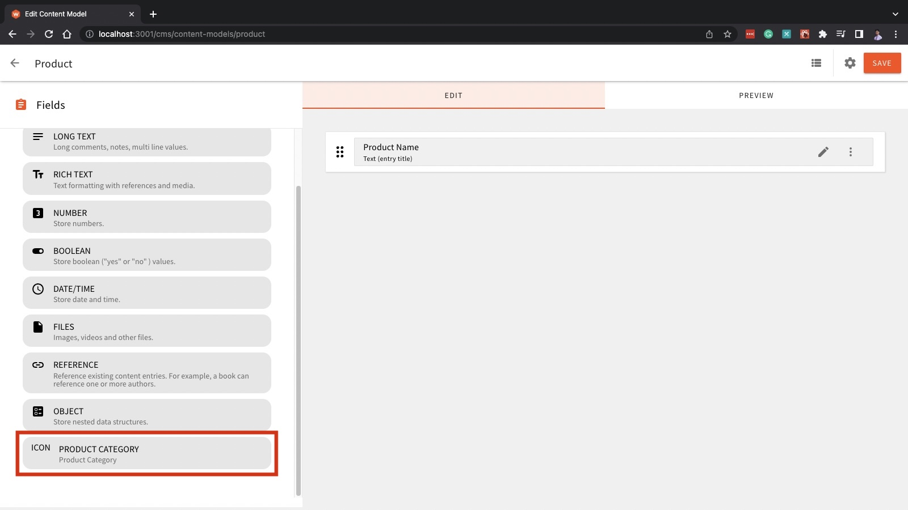
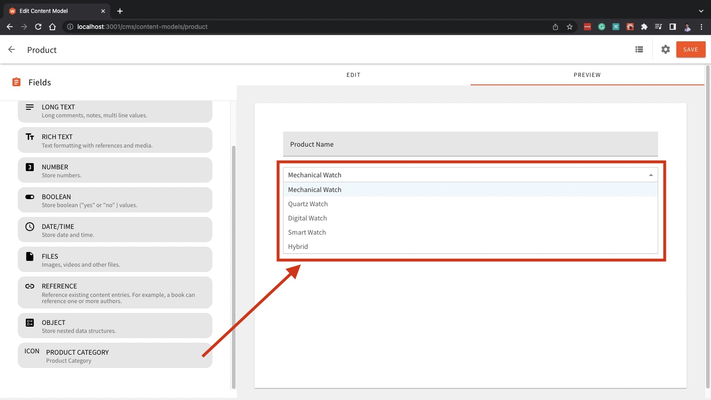
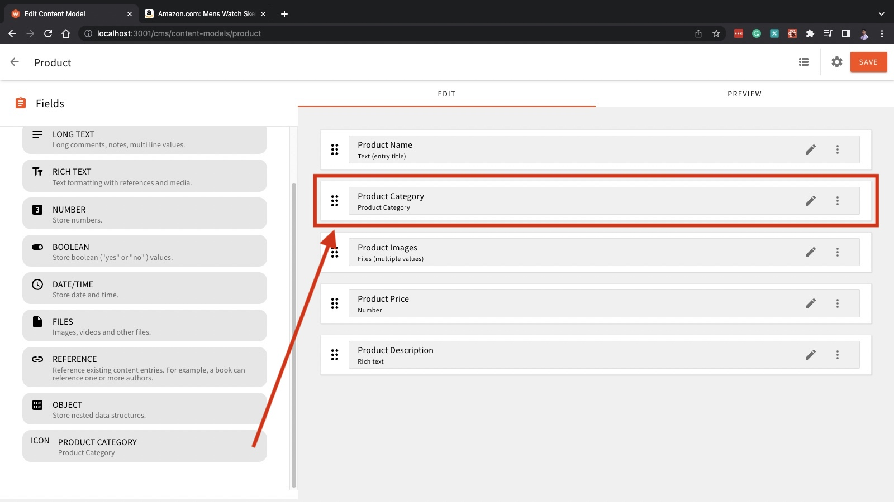
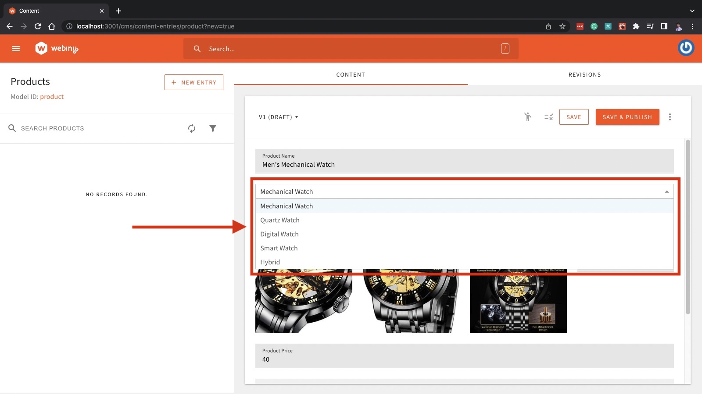
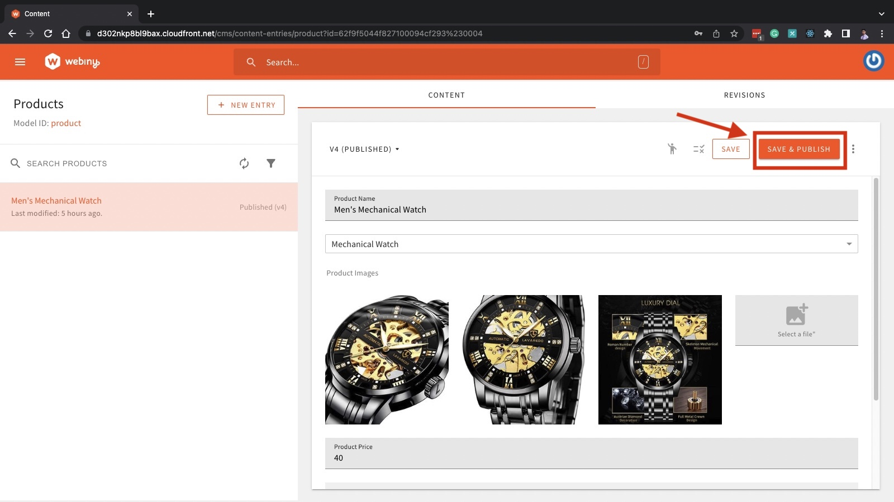
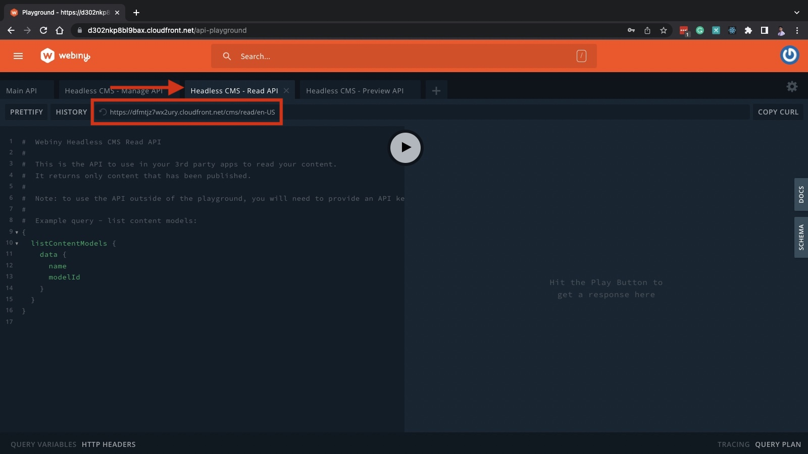
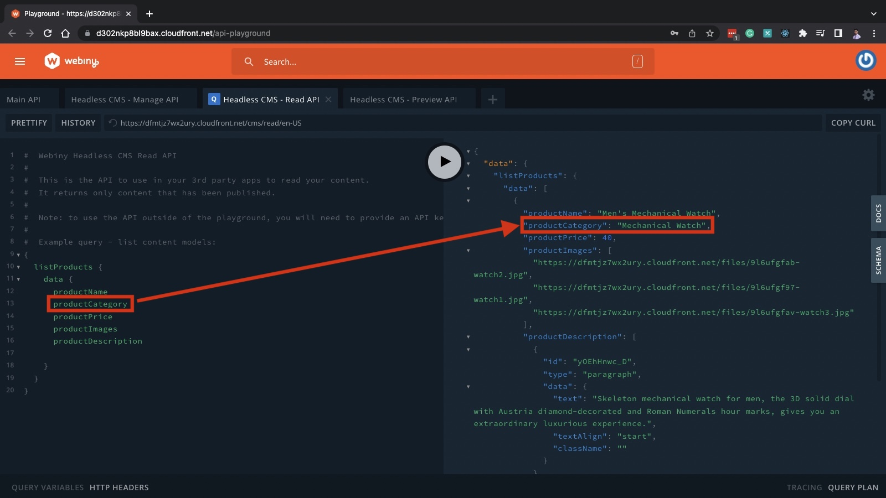

The concept of Headless CMS has gained a steady increase in popularity as the way people consume data evolves. Today, data and content are delivered not just through websites, but also in mobile apps, smart watches, VR, smart assistants, IoT devices, and more. As a result, more and more Headless CMS providers have stepped in to fulfill the demand, each offering common and unique features to fulfill your content and data management needs.

Many of these Headless CMS platforms are proprietary. As a result, you’re locked into whatever feature and functionality there is your Headless CMS provider offers. If you need a certain feature or you want to customize something, you have no choice but to hope and wait for your provider to implement it (if they ever do).

Alternatively, you can use open-source Headless CMS platforms like [Webiny](https://github.com/webiny/webiny-js). Webiny is an open-source framework that allows you to build serverless applications and websites, and as mentioned, it comes with a Headless CMS. Webiny’s composable architecture allows you to customize and extend its built-in features and functionalities, giving you full control over your entire software (such as your websites, GraphQL API’s resolvers, data types, schemas, Infrastructure as Code with Pulumi, etc) and data.

Most of Webiny’s functionality is built with [plugins](https://www.webiny.com/docs/core-development-concepts/basics/plugins). So when you need to extend Webiny’s built-in features, you’ll also need to use plugins (or build new ones that best fit your needs). So if you need a custom field type for your CMS content model, you can create a new one through plugins.

To demonstrate, this article will guide you through building a custom field type for Webiny’s Headless CMS content model. And to build that custom field, we will use a set of built-in plugins in Webiny for constructing a new content model field type. We’ll do this through a step-by-step process with code samples and screenshots to help you along the way, so feel free to follow along.

In this article, you’ll learn:

- What are the plugins used to construct a new CMS content model field type
- How to create your custom field plugin

## Building a custom CMS model field type

Like other Headless CMS platforms, Webiny comes with built-in content model fields. You can get pretty far with these built-in fields. But depending on your needs, you might need to have a content model that requires a property that doesn't come with Webiny's built-in field types. And in cases like this, you'll need to create your custom CMS content model field type.

### Plugins for Creating a Custom CMS Field

To build your custom field, you’ll need to use several plugins that all come with Webiny. These built-in plugins will help you define and build your new content model field type.

There are five plugins related to building new content model field types, where three of which are required and two are optional:

- **[CmsEditorFieldTypePlugin](https://github.com/webiny/webiny-js/blob/next/packages/app-headless-cms/src/types.ts#L13)** - This is a **required** plugin used to define some properties of your new content model field, from its name, type, description, label, the icon to associate with this new field, and more. Registering the plugin you created with `CmsEditorFieldTypePlugin` will render your new field type to the content model UI editor.**[](https://github.com/webiny/webiny-js/blob/next/packages/app-headless-cms/src/types.ts#L13)**
- **[CmsEditorFieldRendererPlugin](https://github.com/webiny/webiny-js/blob/next/packages/app-headless-cms/src/types.ts#L166)** - This is another **required** plugin used to define the renderer for your new field type. With this plugin, you’ll define the component to render the field you’re creating. It can be as simple as an input or as complex as a widget.**[](https://github.com/webiny/webiny-js/blob/next/packages/app-headless-cms/src/types.ts#L166)**
- **[CmsModelFieldToGraphQLPlugin](https://github.com/webiny/webiny-js/blob/next/packages/api-headless-cms/src/types.ts#L383)** - This is the third **required** plugin used to define the new field’s schema, resolver, filters, etc. to the GraphQL API.**[](https://github.com/webiny/webiny-js/blob/next/packages/api-headless-cms/src/types.ts#L383)**
- **[CmsModelFieldToStoragePlugin](https://github.com/webiny/webiny-js/blob/next/packages/api-headless-cms/src/types.ts#L1595)** - This is an **optional** plugin that sits in between your storage and API layer. With this plugin, you can manipulate the data before it’s sent to the storage layer (for example: censoring profanity in a blog post or comment) or after retrieving the data from the storage (and do things like decrypting an encrypted text).**[](https://github.com/webiny/webiny-js/blob/next/packages/api-headless-cms/src/types.ts#L1595)**
- **[CmsModelFieldToElasticSearchPlugin](https://github.com/webiny/webiny-js/blob/731966ba13e6d9c5c82828a89e0e9ef7d4a0a27d/packages/api-headless-cms-ddb-es/src/types.ts#L182)** - This is also an **optional** plugin that is similar to the CmsModelFieldToStoragePlugin for being an intermediary. But in this case, instead of the storage layer, this plugin sits in between the API layer and ElasticSearch. With this plugin, you can manipulate the data before it is sent to the index or after retrieving it.**[](https://github.com/webiny/webiny-js/blob/731966ba13e6d9c5c82828a89e0e9ef7d4a0a27d/packages/api-headless-cms-ddb-es/src/types.ts#L182)**

## Prerequisites

Before we begin with the steps on building a custom content model field, make sure you have the following if you want to follow along the tutorial:

- [Node.js 14.0.0 or higher](https://nodejs.org/en/)
- Either of the two: [yarn 1.22.0 (classic) or higher](https://classic.yarnpkg.com/lang/en/) || [yarn 2 (berry) or higher](https://yarnpkg.com/)
- An [AWS account](https://aws.amazon.com/console/) and [pre-configured user credentials to your machine](https://www.webiny.com/docs/infrastructure/aws/configure-aws-credentials)
- And a pre-deployed Webiny project to AWS ([Check this guide to learn how](https://www.webiny.com/docs/get-started/install-webiny))

We’ll skip the Webiny app installation and deployment process in this article. So if you don’t have an up and running Webiny project yet, be sure to follow this [installation and deployment guide](https://www.webiny.com/docs/get-started/install-webiny).

## Step-by-Step: How To Build a Custom CMS Model Field Type

Let’s say we have an e-commerce store selling mainly wrist watches. The products in this store are grouped according to their watch type, namely:

- Mechanical Watch
- Quartz Watch
- Digital Watch
- Smart Watch
- and Hybrid

The content model needed for our PDP (Product Detail Page) requires an enumeration field type to select which kind of wrist watch a given product is. This new enumeration field will help categorize the products in the store. Since there is no built-in content model field in Webiny for our use case, we need to create a new one ourselves.

So in this tutorial, we’ll build a simple dropdown menu as our new content model field type. This dropdown menu should contain all the mentioned watch types so that whenever we add a new product to the store, we can choose from the dropdown menu which category of watch it is.

And with all that said, open your Webiny project in the code editor of your choice and let’s build this dropdown menu field type!

### Step 1: Define a New Field Type

When building a new content model field type, you should first create a plugin that defines this new field type you’re making. In this new plugin, you’ll give your new field a name, a field type, label, description, the icon for this new field (to be rendered on the list of content model fields in the content model UI editor), and more.

To define our new field, we’ll be using the `[CmsEditorFieldTypePlugin](https://github.com/webiny/webiny-js/blob/next/packages/app-headless-cms/src/types.ts#L13)`.

So first, create this new directory `fields/dropdown` under the `apps/admin/src/plugins/headlessCMS` directory:

```bash
# from the root of your Webiny project:
mkdir -p apps/admin/src/plugins/headlessCMS/fields/dropdown
```

Then, create a new file called `productCategoryFieldPlugin.tsx` under this new directory you created:

```bash
touch apps/admin/src/plugins/headlessCMS/fields/dropdown/productCategoryFieldPlugin.tsx
```

In this new file, we’ll write the plugin to define our new content model field type using the plugin `CmsEditorFieldTypePlugin`. Copy the code below and paste it inside the file `productCategoryFieldPlugin.tsx`:

```tsx
// apps/admin/src/plugins/headlessCMS/fields/dropdown/productCategoryFieldPlugin.tsx

import React from "react";
import { CmsEditorFieldTypePlugin } from "@webiny/app-headless-cms/types";

const DropdownIcon: React.FunctionComponent = () => <i>ICON</i>

const plugin: CmsEditorFieldTypePlugin = {
    type: "cms-editor-field-type",
    name: "cms-editor-field-type-product-category",
    field: {
        type: "product-category",
        label: "Product Category",
        description: "Product Category",
        icon: <DropdownIcon />,
        allowMultipleValues: false,
        allowPredefinedValues: false,
        multipleValuesLabel: "Use as a list of multiple categories",
        createField() {
            return {
                type: "product-category",
                validation: [],
                renderer: {
                    name: ""
                }
            }
        },
    }
}

export default plugin;
```

Before we proceed, let’s first dissect this plugin and understand what it does.

Under the `field` property of the `CmsEditorFieldTypePlugin`, we defined the properties of this new dropdown field we’re building. Here, we specified that the `type` of this new plugin is `product-category`, which we will use later to identify this new field type. We also defined its label, description, and icon. You can assign your values here if you want to. And the rest of the properties inside the `field` property only relates to the rules regarding this new plugin.

After defining our new field type, we need to include this in the list of content model field types of the headless CMS.

Under the directory `apps/admin/src/plugins/`, open the file `headlessCMS.ts` and import our newly created plugin, then add this plugin to the exported array:

```tsx
// apps/admin/src/plugins/headlessCMS.ts

// ... rest of the imports

import richTextEditor from "./headlessCMS/richTextEditor";

// My custom plugins
import productCategoryFieldPlugin from "./headlessCMS/fields/dropdown/productCategoryFieldPlugin"; // <- import the plugin

export default [
  headlessCmsPlugins(),
  richTextEditor,
  textField,
  // ...
  objectFieldRenderer,
  productCategoryFieldPlugin // <- the product-category field plugin
];
```

Now it’s time to check our new custom field type in the content model UI editor.

Run this command to start a development server for your Webiny project’s admin workspace:

```bash
yarn webiny watch app/admin -env=dev
```

And then, create a sample content model in Webiny’s Headless CMS (just name it `Product`) and check out the field types list. You should be able to see the new field type named `PRODUCT CATEGORY`.



### Step 2: Define and Build the Renderer for the New Field

Now that we defined our new field type, it’s time to build the renderer for it. The custom field’s renderer is what will be shown when you add or edit your content.

For the renderer of our `product-category` field type, we are going to define a dropdown menu. And to simplify things, we’ll use a third-party dependency called `[react-dropdown](https://www.npmjs.com/package/react-dropdown)` to skip the part of implementing a dropdown menu from scratch.

So with that said, open your terminal and install `react-dropdown`:

```bash
yarn workspace admin add react-dropdown 
```

Take note of the `workspace admin` since we only want to install `react-dropdown` in the admin area. This is because every [Webiny project is a monorepo](https://www.webiny.com/docs/core-development-concepts/project-organization/monorepo-organization) that has several workspaces in it (including the mentioned `admin` workspace which we’re working on right now).

After installing the dependency, we can now define and build the renderer for `product-category` field.

We will be using the `[CmsEditorFieldRendererPlugin](https://github.com/webiny/webiny-js/blob/next/packages/app-headless-cms/src/types.ts#L166)` to define our renderer’s properties like `rendererName`, description, `canUse` (or when should it be rendered), and most importantly, the component that will be rendered.

Under the directory `apps/admin/src/plugins/headlessCMS/fields/dropdown`, add another file named `productCategoryFieldRendererPlugin.tsx`.

```bash
touch apps/admin/src/plugins/headlessCMS/fields/dropdown/productCategoryFieldRendererPlugin.tsx
```

Then, write the renderer plugin inside this file using the `CmsEditorFieldRendererPlugin`. Use the `react-dropdown` to create the dropdown component:

```tsx
//apps/admin/src/plugins/headlessCMS/fields/dropdown/productCategoryFieldRendererPlugin.tsx

import React from "react";
import { CmsEditorFieldRendererPlugin } from "@webiny/app-headless-cms/types";
import ReactDropdown from "react-dropdown";
import "react-dropdown/style.css";

export default (): CmsEditorFieldRendererPlugin => ({
  type: "cms-editor-field-renderer",
  name: "cms-editor-field-renderer-product-category",
  renderer: {
    rendererName: "product-category", // must be the same as the field type defined in CmsEditorFieldTypePlugin
    name: "Product Category",
    description: "Product Category",
    canUse({ field }) {
      // only render this on fields with the type `product-category`
      return field.type === "product-category"; 
    },
    // the component to render for the field type `product-category`
    render({ getBind }) {
      const Bind = getBind();

      // the product categories in the e-commerce store
      const options = [
        "Mechanical Watch",
        "Quartz Watch",
        "Digital Watch",
        "Smart Watch",
        "Hybrid"
      ];
      const defaultOption = options[0];
      return (
        <Bind>
          {
            bind => (
              <ReactDropdown
                options={options}
                onChange={({ value }) => bind.onChange(value)}
                value={bind.value || defaultOption}
                placeholder="Select an option"
              />
            )
          }
        </Bind>
      )
    }
  }
})
```

From the code above, the `product-category` field’s renderer was defined in the `renderer` property of the `CmsEditorFieldRendererPlugin`. The `rendererName` is the same with the custom field’s type, `product-category`, which is required in order to associate the renderer to its corresponding field type. The `canUse` property indicates that this renderer should only be used when the field type is `product-category`. And finally, the `render` property is where we defined the dropdown menu component, which will be rendered when creating or editing contents that has `product-category` properties in them. Also, you might have noticed that our dropdown component is nested inside that `Bind` component. This `Bind` component is hooked into a React Context and helps abstract managing the state of our field renderer's component. That's why we don't have a `useState` hook inside our renderer component. Instead, we pass the `value` from the dropdown to `bind` and use the `onChange` handler of `bind` to pass changed data from the component to the context object.

After you defined the renderer, import this plugin to `headlessCMS.ts` and add it to the exported list (next to the field type definition plugin from earlier). Remember to call this function upon adding it to the list.

```tsx
// apps/admin/src/plugins/headlessCMS.ts

// ... rest of imports

import richTextEditor from "./headlessCMS/richTextEditor";

// My custom plugins
import productCategoryFieldPlugin from "./headlessCMS/fields/dropdown/productCategoryFieldPlugin";
import productCategoryFieldRendererPlugin from "./headlessCMS/fields/dropdown/productCategoryFieldRendererPlugin" // <- import the renderer plugin

export default [
  headlessCmsPlugins(),
  richTextEditor,
  textField,
  // ...
  objectFieldRenderer,
  productCategoryFieldPlugin,
  productCategoryFieldRendererPlugin() // <- the product-category field renderer plugin
];
```

Now that you added this field renderer plugin, you can preview it in the content model UI editor and check the new dropdown field type we just defined:



### Step 3: Define the Field in the GraphQL API

After you defined the new field type and its renderer, it’s time to define this new field in the GraphQL API. For this, we’ll need to use the **[CmsModelFieldToGraphQLPlugin](https://github.com/webiny/webiny-js/blob/next/packages/api-headless-cms/src/types.ts#L383)** to define our `product-category` field type on the GraphQL API to handle all incoming requests from this field type.

Since we will be working on the API layer, we’ll leave the admin area for now and switch to the Headless CMS API workspace.

First off, add the directory `fields/dropdown` under the directory `apps/api/headlessCMS/src/`.

```bash
# from the root of your Webiny project:
mkdir -p apps/api/headlessCMS/src/fields/dropdown
```

Then, create the file named `productCategoryFieldPlugin.ts` under the directory you just created:

```bash
touch apps/api/headlessCMS/src/fields/dropdown/productCategoryFieldPlugin.ts
```

Inside the file `productCategoryFieldPlugin.ts`, define the `product-category` field type to GraphQL:

```tsx
// apps/api/headlessCMS/src/fields/dropdown/productCategoryFieldPlugin.ts

import { CmsModelFieldToGraphQLPlugin } from "@webiny/api-headless-cms/types";

const plugin: CmsModelFieldToGraphQLPlugin = {
  name: "cms-model-field-to-graphql-product-category",
  type: "cms-model-field-to-graphql",
  fieldType: "product-category", // <- Must be the same as the field type defined in CmsEditorFieldTypePlugin
  isSortable: true,
  isSearchable: true,
  read: {
    createTypeField({ field }) {
      if (field.multipleValues) {
        return `${field.fieldId}: [String]`;
      }
      return `${field.fieldId}: String`
    },
    createGetFilters({ field }) {
      return `${field.fieldId}: String`
    },
    createListFilters({ field }) {
      return `
        ${field.fieldId}: String
        ${field.fieldId}_not: String
        ${field.fieldId}_in: [String]
        ${field.fieldId}_not_in: [String]
        ${field.fieldId}_contains: String
        ${field.fieldId}_not_contains: String
      `
    }
  },
  manage: {
    createListFilters({ field }) {
      return `
        ${field.fieldId}: String
        ${field.fieldId}_not: String
        ${field.fieldId}_in: [String]
        ${field.fieldId}_not_in: [String]
        ${field.fieldId}_contains: String
        ${field.fieldId}_not_contains: String
      `
    },
    createTypeField({ field }) {
      if (field.multipleValues) {
        return `${field.fieldId}: [String]`;
      }
      return `${field.fieldId}: String`
    },
    createInputField({ field }) {
      if (field.multipleValues) {
        return `${field.fieldId}: [String]`;
      }
      return `${field.fieldId}: String`
    }
  }
}

export default plugin;
```

In here, we defined the `fieldType` as `product-category` because the `fieldType` in this plugin must match the field’s `type` we defined in `CmsEditorFieldTypePlugin`. That way, Webiny knows this specific plugin is for the `product-category` field type.

The properties `isSearchable` and `isSortable` are set to `true` since we want this field to be searchable and sortable via the GraphQL API.

In the `read` property, we defined the field type for `product-category` in the Read API through `createTypeField`, as well as some filters. Similarly in the `manage` property, we defined the field type of `product-category` in the Manage API through the `createTypeField`. We also defined the input GraphQL field type through `createInputField`, as well as a filter.

Now that this plugin is defined, we can now import this to the `apps/api/headlessCMS/src/index.ts` file and add the `productCategoryFieldPlugin` plugin to the plugins used by the Headless CMS API.

```tsx
// apps/api/headlessCMS/src/index.ts

// ... the rest of the imports

import scaffoldsPlugins from "./plugins/scaffolds";

// My custom plugins
import productCategoryFieldPlugin from "./fields/dropdown/productCategoryFieldPlugin"; // <- import the GraphQL plugin for the product-category field

// ...

export const handler = createHandler({
  plugins: [
    createWcpContext(),
    // ...
    scaffoldsPlugins(),
    productCategoryFieldPlugin // <- add here the field to GraphQL plugin of the product-category field
  ],
  http: { debug }
});
```

And finally, deploy the changes in the API and run the dev environment of your Headless CMS API using this command:

```bash
yarn webiny watch apps/api/headlessCMS --env=dev
```

If everything worked as expected, you should now be able to save your content model (that has the `product-category` field type) and create new product entries using this new custom field. We will do all these in the next and final step of this tutorial.

### Step 4: Testing the New Field

For the final step, we will test our new custom `product-category` plugin by making a simple content model for the PDP (Product Detail Page) of our products, create entries or product page contents using the PDP content model, and finally, query the Headless CMS API for the product content entries. And if our custom plugin works properly, we should be able to use it on the PDP content model, use the dropdown menu to categorize the product entries, and get the product category when querying the products through the Headless CMS API.

So to begin with, first go to Webiny’s Headless CMS and create a new content model (or use the `Product` model from earlier) for our PDPs. You can use the following fields in your content model:

- Text - For the product name. Set it as the Title
- **Product Category** - Our custom field type. Used for categorizing the watches on the store.
- File - This is where we’ll put the product images. Set it to accept multiple values and to only accept image files.
- Number - For the price of the product
- Rich Text - For the product description

Your `Product` content model, including our very own `product-category` field, should look something like this:



Save this content model, and create a new product entry for the `Products` content model. For this example, I’ll add a mechanical watch and set the category using the dropdown menu we created earlier to `Mechanical Watch`. When querying the products lists, we expect that the value we get for this product is `Mechanical Watch`.



Save and publish this product entry. Make sure you press the orange button from the top-left that says `Save & Publish` and then click `Confirm` so that we can query it from the Read API.



If everything works well, you should be able to publish your first product content entry with the custom field type we created! Feel free to add as many product entries as you want.

And now, for the final test, we will query the Headless CMS API for all our product entries. Make sure you’re on the Read API’s tab, or that your API endpoint is `cms/read/{locale}`. You can also query the product entries in the `Preview` API, but since we already have a published content entry, we can use the `Read` API instead.



Now, remove the pre-populated query and replace it with our products list query:

```graphql
{
  listProducts {
    data {
      productName
      productCategory
      productPrice
      productImages
      productDescription
    }
  }
}
```

Finally, hit the play button to run the GraphQL query. And if our implementation works flawlessly and as expected, we should be able to retrieve the data we entered on the product content entries. Most importantly, we’ll see the value of the `product-category` obtained from our custom `product-category` dropdown field type!



And there you have it!

You just created your own custom content model field type in Webiny’s Headless CMS. Feel free to play around and experiment with this new custom field type, or better yet, create your own field and use your imagination to build the field type you want.

## Conclusion

In this article, you learned how you can extend Webiny’s built-in features through plugins. You learned the different built-in plugins in Webiny for creating custom field types in Webiny’s Headless CMS, how to use these plugins, and how to define the field’s type, renderer, and field to GraphQL plugins to create the custom content model field type. We made a simple dropdown menu for our hypothetical e-commerce store to help categorize products. We also tested our custom field type by creating a content model with the dropdown menu, creating content entries using this field type, and querying the results in the API Playground.

Webiny’s composable architecture allows you to have full control and freedom over your Headless CMS platform. Webiny’s plugins power most of its built-in features and plugins are also what you need when you’re extending Webiny’s functionalities. With the world of technology rapidly changing year-over-year, having a dynamic and easy to scale Headless CMS platform like Webiny is crucial to the success of your business. If you want to have more freedom and control over your Headless CMS platform (and your software and data in general) be sure to [check out Webiny](https://www.webiny.com/) and build your next website with them.