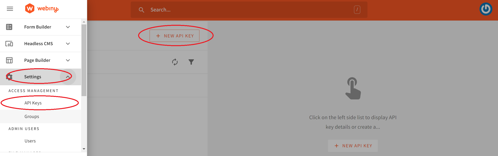

import OnPagePromo from "../components/ui/on-page-promo/on-page-promo"

[Nuxt.js](https://nuxtjs.org/docs/get-started/installation) is a lightweight front-end SSR framework for [Vue](https://vuejs.org/guide/introduction.html). Vue allows us to build powerful and engaging user interfaces of any complexity. Nuxt.js is built on top of this Vue structure to help you build production-ready Vue applications. Nuxt.js simplifies and solves problems you run into while building a Vue application. These include:

- Optimize SEO features by ensuring application pages are indexed by search engines properly
- Combining JavaScript and Vue libraries to work together effectively
- Employing best practices structure application code
- Optimizing Vue application for speed

The above are just a few advantages you can leverage in building your application with Nuxt.js.

Building an eCommerce app can be a complex task. However, leveraging Vue's simplicity and intuitive Nuxt.js, you can build simple yet powerful applications to deliver your eCommerce capabilities. In this guide, you will use Nuxt.js to build an eCommerce web app. To create the backend of this eCommerce app, you will learn how to use [Open Source Webiny for running a Headless CMS](https://www.webiny.com/).

By the end of this tutorial, you will learn how to:

- Create a products backend using Webiny Headless CMS
- Fetch products from Webiny Headless CMS to a Nuxt.js application
- Set up for handling cart products
- Integrate Stripe to process payment checkout.

Let's dive in and get started. So buckle up and start leveraging a Headless CMS like a pro.

### **Creating a Webiny Project**

To set up a backend with Webiny, ensure you have Webiny deployed on your AWS. With just a few steps, you get Webiny up and running to serve your headless server. Check this [guide](https://www.webiny.com/docs/get-started/install-webiny) and ensure Webiny installation and deployment prerequisites are correctly set.

If you want to skip these steps, you can access a [free Demo environment by completing this form](https://webiny.typeform.com/to/VYffkZlR).

Once installation and deployment are done, you can now access Admin and start managing and modeling your CMS content models right away.


### **Setting up Products Model**

Using the above page, click **NEW CONTENT MODEL** to create your models. Or navigate **NEW CONTENT MODEL** 🡆 **CONTENT MODELS** 🡆 **Models.**


Using any of the above approaches, a new modal page will be launched. Go ahead and click **NEW MODAL** and enter details for your **NEW CONTENT MODEL**.


This eCommerce app will have the following Fields:

- Product name: Text
- Product Description: Long Text
- Product image: File
- Product price: Number

To add these fields to the PRODUCTS model, drag and drop the Fields from your panel, ensuring you select them based on the data type each field will hold.


Here is an example of adding a product name field:


Go ahead and add the remain fields using the above illustration as an example. Once you have saved the all fields, you will have your model ready as follows:


Click **Save** to add these changes to your content model. Once the content model is created, go ahead and add a few record entries by clicking **NEW ENTRY:**


Each entry will have the following content as an example:


And, of course, ensure you add several new entries using the above case and an example.

### **Accessing Content Model**

To securely access this data outside Webiny, go ahead and set up a Content Delivery API Access Token to expose your model. This way, you are able to consume the Webiny backend using any frontend tools of your choice.

Navigate to **Settings** and create a **NEW API KEY** as follows:



Provide API key details, ensuring:

- Per-locale content access permissions management is set as follows.


- Headless CMS app access permissions are set as follows.


Once you **SAVE API KEY**, a token will be generated, and copy its content. This key will be used alongside an `.env` file to access the CMS using Nuxt.js.

Finally, you need an API endpoint to consume your data. Webiny provides that for you. Navigate to **API Playground**


Click **Headless CMS Read API** and copy the URL endpoint. Alternatively, you can run the following command to get the Read API endpoints.

```bash
yarn webiny info
```

You will use this URL to fetch products into your Nuxt.js project.


<OnPagePromo />

### **Setting and Connecting up the Nuxt.js with Webiny**

Proceed to your preferred working directory. Open the terminal from there and run the following command to initialize the application:

```bash

npx init nuxt-app ecommerce_webiny_app
```

Fill in the proceeding prompts. Make sure you select *JavaScript*, *Bootstrap vue*, and *Axios* options as prompted.


After the installation is done, navigate to the newly created directory:

```bash
cd ecommerce_webiny_app
```

Start the development server to test if Nuxt.js is working:

```bash
npm run dev
```

Then install the following packages:

- @nuxtjs/axios : For sending API requests to Webiny.
- @vue-stripe/vue-stripe : For Processing Stripe payments.
- @nuxtjs/dotenv: For managing environment variables with Nuxt.js.
- Express : For setting up a basic backend API to send the stripe requests.
- Stripe : For creating dynamic products and prices with stripe.

```bash
npm i @nuxtjs/axios @vue-stripe/vue-stripe @nuxtjs/dotenv express stripe
```

To connect Webiny to Nuxt.js, create a `.env` file at the root of the project directory. Add your Webiny API token and the Headless CMS Read API URL as follows:

```bash
WEBINYURL=your_webiny_read_url
WEBINYTOKEN=your_webiny_access_token
```

Ensure you replace the above with your keys before proceeding.

To access the above variables within Nuxt.js, navigate to the `nuxt.congig.js` file and execute Nuxt.js dotenv as follows:

```bash
buildModules: [
    '@nuxtjs/dotenv'
],
```

Execute Axios dependencies in your `nuxt.congig.js` file as follows:

```jsx
  modules: [
    'bootstrap-vue/nuxt',
    '@nuxtjs/axios'
],
```

Finally, execute the Axios and access the Webiny API URL as follows:

```jsx
publicRuntimeConfig: {
    axios: {
      baseURL: process.env.WEBINYURL
    }
},
```

Let's dive in and fetch the products from Webiny CMS to Nuxt.js.

### **Creating a Navigation component**

To comfortably navigate around the application, create a Navigation bar component. Here we will add the routes for navigating around the application. These are

- Home page for fetching products.
- A cart route for accessing the application cart items.

Create a `navbar.vue` component in the `components` directory as follows:

```html
<template>
    <nav class="navbar navbar-expand-lg navbar-light bg-light">
        <a class="navbar-brand" href="#">My Products</a>
        <div class="collapse navbar-collapse" id="navbarSupportedContent">
            <ul class="navbar-nav mx-auto">
                <li class="nav-item active">
                    <a class="nav-link" href="/">Home <span class="sr-only">(current)</span></a>
                </li>
                <li class="nav-item">
                    <a class="nav-link" href="/cart">My Cart</a>
                </li>
            </ul>
        </div>
    </nav>
</template>
<script>
    export default {
        name: 'Navbar'
    }
</script>
```

### **Fetching products from Webiny**

Nuxt.js uses pages to create the content of your application. When setting up a Nuxt.js project, a `pages` directory is created to handle your application pages out of the box. Here, Nuxt.js uses an`index.vue` file to handle your home page content. We will use the file to display the products from Webiny as follows:

Inside the `pages/index.vue`, import the `Navbar` component:

```jsx
import Navbar from '../components/Navbar.vue';
```

Add it to the list of exported components:

```jsx
export default {
    name: "IndexPage",
    components: { Navbar },

```

Add a variable to hold the products to be fetched from Webiny:

```jsx
export default {
    name: "IndexPage",
    components: { Navbar },
    data: () => ({
        posts: []
    }),
}
```

Fetch the products from Webiny using Axios:

```jsx
export default {
    name: "IndexPage",
    components: { Navbar },
    data: () => ({
        posts: []
    }),

    fetchOnServer: false,
    async fetch() {
        this.posts = await this.$axios.post(`${process.env.WEBINYURL}`, {
            query: `
                query getProducts {
                    listProducts {
                      data {
                          id
                          name
                          price
                          productImages
                      }
                    }
                }
                `}, {
            headers: {
                'Authorization': `Bearer ${process.env.WEBINYTOKEN}`}
        }).then((result) => result.data.data.listProducts.data);
    }
}
```

Note: We will set `ssr`as false. This can potentially expose your Webiny token to the client and make it public.

Show the products in the following view:

```html
<template>
    <div>
        <Navbar />
        <div class="container mt-10">
            <div class="row" v-if="posts.length > 0">

                <div v-for="post in posts" :key="post.id" class="col-md-3">
                    <div class="card mt-2">
                        
                        <div class="card-body">
                            <p class="card-text">{{ post.name }}, USD {{ post.price }}</p>
                        </div>
                    </div>
                </div>
            </div>
            <div class="row" v-else>
                <div class="col-md-12 jumbotron jumbotron-fluid mt-4">
                    <div class="container">
                        <h1 class="display-4">Loading...</h1>
                        <p class="lead">Hold on as we get the products...</p>
                    </div>
                </div>
            </div>
        </div>
    </div>
</template>
```

To test if the app can fetch products, ensure that your development server is running:

```bash
npm run dev
```

Then proceed to the home page of your `http://localhost:3000/`:


### A**dding items to the shopping cart**

We have the product ready on Nuxt.js. Let's add these products to a shopping cart. In the `script` section for your `pages/index.vue`, add a function for adding products to the cart as below:

```jsx
export default {
    methods: {
        addToCart(product) {
            if (process.client) {
                if (this.checkIfOnCart(product)) {
                    window.location.href = '/cart';
                } else {
                    let cartItems = JSON.parse(localStorage.getItem('cartItems'));
                    if (cartItems) {
                        localStorage.setItem('cartItems', JSON.stringify([
                            ...cartItems,
                            {
                                ...product,
                                quantity: 1
                            }
                        ]));
                    } else {
                        localStorage.setItem('cartItems', JSON.stringify([
                            {
                                ...product,
                                quantity: 1
                            }
                        ]))
                    }
                    window.location.reload();
                }
            }
        }
    }
}
```

Here we are using the `localStorage` of the browser to hold the  items. This way, even when the user reloads the application, the product saved in the CART can still be accessible.

Additionally, add a method for checking if an item is already on the /`localStorage`:

```jsx
checkIfOnCart(product){
    if (process.client) {
        let cartItems = JSON.parse(localStorage.getItem('cartItems'));
        if (cartItems) {
            return cartItems.find((cartItem) => cartItem.id == product.id) ? true : false;
        } else {
            return false;
        }
    }
}
```

On the view, where you are looping through the posts, add a button for adding products to cart as follows:

```jsx
<div class="d-flex">
    <button @click="addToCart(post)" class="btn btn-success">
        {{checkIfOnCart(post) ? 'View cart' : 'Add Cart'}}
    </button>
</div>
```

The new product page should be similar to the following:


### **Creating Add to cart page**

Let's now get all the items stored in the `localStorage` and display them. In the pages directory, create a `cart.vue` file.

In this file, import the necessary components:

```jsx
import { StripeElementPayment } from '@vue-stripe/vue-stripe';
import Navbar from '../components/Navbar.vue';
```

Export the components and the methods we will use to handle the cart functionalities:

```jsx
export default {
  components: {
    Navbar,
  },
  methods: {
  }
}
```

Inside the above `methods: {}` Create a method for increment and decrementing quantity. This way, every time a user adds or removes the items from the cart, the app will calculate product quantity and compute the total prices as such:

```jsx
incrementQuantity(product){
    if (process.client) {
        // setting the data...
        let newCart = JSON.parse(localStorage.getItem('cartItems')).map((cartItem) => {
            if (cartItem.id == product.id) {
                // do the mapping
                let new_quantity = parseInt(cartItem.quantity) + 1;
                let price_per_quantity = parseInt(cartItem.price) / parseInt(cartItem.quantity);
                let new_price = price_per_quantity * new_quantity;
                return {
                    ...cartItem,
                    quantity: new_quantity,
                    price: new_price
                }
            } else {
                return {
                    ...cartItem
                }
            }
        });
        localStorage.setItem('cartItems', JSON.stringify(newCart));
        window.location.reload();
    }
},

decrementQuantity(product){
    if (process.client && product.quantity > 1) {
        // setting the data...
        let newCart = JSON.parse(localStorage.getItem('cartItems')).map((cartItem) => {
            if (cartItem.id == product.id) {
                // do the mapping
                let new_quantity = parseInt(cartItem.quantity) - 1;
                let price_per_quantity = parseInt(cartItem.price) / parseInt(cartItem.quantity);
                let new_price = price_per_quantity * new_quantity;
                return {
                    ...cartItem,
                    quantity: new_quantity,
                    price: new_price
                }
            } else {
                return {
                    ...cartItem
                }
            }
        });
        localStorage.setItem('cartItems', JSON.stringify(newCart));
        window.location.reload();
    }
},
getQuantity(product){
    return JSON.parse(localStorage.getItem('cartItems')).find(item => item.id == product.id).quantity;
},
getPrice(product){
    return JSON.parse(localStorage.getItem('cartItems')).find(item => item.id == product.id).price;
},
getTotalPrice(){
    if (process.client) {
        let postItems = JSON.parse(localStorage.getItem('cartItems'));
        let prices = postItems.map((item) => item.price);
        return prices.reduce((a, b) => parseInt(a) + parseInt(b));
    } else {
        return 0.0
    }
},
```

Export the above data as follows:

```jsx
data: () => ({
    posts: process.client ? (localStorage.getItem('cartItems') ? JSON.parse(localStorage.getItem('cartItems')) : []) : [],
    loadedFromClient: process.client ? true : false,
})
```

In the component view, load and show the cart items with all the above functionalities we have created:

```html
<template>
    <div>
        <Navbar />
        <div v-if="posts && posts.length > 0">
            <div class="container mt-4">
                <table class="table">
                    <thead>
                        <tr>
                            <th scope="col">Product</th>
                            <th scope="col">Quantity</th>
                            <th scope="col">Price</th>
                        </tr>
                    </thead>
                    <tbody>
                        <tr v-for="post in posts" :key="post.id" class="">
                            <td>{{post.name}}</td>
                            <td>
                                <button @click="decrementQuantity(post)" class="btn btn-default">-</button>
                                {{getQuantity(post)}}
                                <button @click="incrementQuantity(post)" class="btn btn-default">+</button>
                            </td>
                            <td>USD {{getPrice(post)}}</td>
                        </tr>
                    </tbody>
                </table>
                <div>
                    <h4>Total price to be charged: USD {{getTotalPrice()}}</h4>
                </div>
            </div>
        </div>
        <div v-else-if="posts && posts.length == 0 && !loadedFromClient">
            <div class="col-md-12 jumbotron jumbotron-fluid mt-4">
                <div class="container">
                    <h1 class="display-4">Loading...</h1>
                    <p class="lead">Hold on as we get the cart items...</p>
                </div>
            </div>
        </div>
        <div v-else>
            <div class="col-md-12 jumbotron jumbotron-fluid mt-4">
                <div class="container">
                    <h1 class="display-4">No items</h1>
                    <p class="lead">Your cart is Empty,</p>
                </div>
            </div>
        </div>
    </div>
</template>
```

The cart page will be similar to the following:


### **Processing Payment using Stripe**

From [stripe dashboard](https://file+.vscode-resource.vscode-cdn.net/d:/webiny/dashboard.stripe.com), stripe account using your details. At this point, ensure you have your stripe keys ready. We will use them to access the Stripe account. You can get the key within your [dashboard.stripe.com](http://dashboard.stripe.com/). Navigate to the developer section and access the API keys as follows:


And the stripe keys to your .`env` file:

```bash
WEBINYURL=your_webiny_read_url
WEBINYTOKEN=your_webiny_access_token
STRIPE_PK=your_stripe_publishable_key
STRIPE_SK=your_stripe_secret_key
APP_URL=http://localhost:3000
```

Go ahead and create a plugin to process the payment on the client. Create a `plugins` folder and the root directory of your project and add a `vue-stripe.js` file to handle checkout as follows:

```jsx
import Vue from 'vue';
import { StripeCheckout } from '@vue-stripe/vue-stripe';

export default () => {
    Vue.component('StripeCheckout', StripeCheckout);
};
```

Update `nuxt.config.js` to add the following `plugins` configuration to execute the directory of the plugin:

```jsx
plugins: [
    { src: '~/plugins/vue-stripe.js', ssr: false },
],
```

For stipe to process the client checkouts, you must set an account or business name at [https://dashboard.stripe.com/account](https://dashboard.stripe.com/account) as follows:


`vue-stripe.js` handle checkout on the client. Therefore, stripe must be aware of that. Therefore, ensure you enable [client-only payments](https://dashboard.stripe.com/settings/checkout) as follows:


Let's now handle payment using Nuxt.js. Nuxt.js is an SSR-supported framework. This allows you to create serverless API routes without creating a backend server. [API routes](https://v3.nuxtjs.org/guide/directory-structure/server/) provide a solution to build your API with Nuxt.js. Nuxt.js uses server-side bundles that treat server code as an API endpoint instead of a page. This way, any file can be treated as an endpoint. This provides an easy solution to build your own API within the same codebase.

Let’s dive in and implement an API that will allow us to execute stripe. We will create a payment API that communicates with stripe. Therefore, we need to create API functionalities for handling this procedure. In the project folder, create an `api` directory. Inside the `api` directory, create an `index.js` file. Edit the file as follows:

- Import all the necessary packages:

```jsx
const stripe = require("stripe")(process.env.STRIPE_SK);
const express = require('express');
```

- Initialize express and accept json data:

```jsx
const app = express();
app.use(express.json());
```

- define a route for creating a product on stripe given the product name:

```jsx
app.post('/create-product', async (req, res) => {
    let { name } = req.body;
    let product = await stripe.products.create({
        name: name
    });
    return res.json({
        success: true,
        product
    });
});
```

- define a route for creating a price on stripe given the `amount`, `currency`, and `product`:

```jsx
app.post('/create-price', async (req, res) => {
    let { amount, productId } = req.body;
    console.log("product Id is " + productId);
    let price = await stripe.prices.create({
        unit_amount: amount,
        currency: 'usd',
        product: productId
    });
    return res.json({
        success: true,
        price
    });
});
```

- Export the instance:

```jsx
module.exports = app;
```

Update `nuxt.config.js` to add the following `serverMiddleware` configuration to specify the directory of the API routes:

```jsx
serverMiddleware: {
    '/api': '~/api'
},
```

Nuxt.js automatically scans files inside the `~/api` directory to register API and server handlers with [Nuxt.js HMR](https://nuxtjs.org/docs/concepts/context-helpers/) support.

Let's now handle the payment. In the `pages/cart.vue`, define data for the payment intent:

In the `methods` section:

- Define a method for creating products on the stripe based on items stored in the cart:

```jsx
async createProductsFromCart() {
    let cartItems = JSON.parse(localStorage.getItem("cartItems"));
    if (cartItems.length > 0) {
        // loop through the cart items.
        for (const item of cartItems) {
            let response = await this.$axios.post(
                `${process.env.APP_URL}/api/create-product`,{
                    name: item.name,
            });
            // add the product id to cartItems . ..
            cartItems = cartItems.map((cartItem) => {
                if (cartItem.id == item.id) {
                    return {
                        ...cartItem,
                        productId: response.data.product.id,
                    };
                } else {
                    return cartItem;
                }
            });
        }
        localStorage.setItem("cartItems", JSON.stringify(cartItems));
    }
},
```

- Define a method for creating prices on the stripe from the cart store:

```jsx
async createPricesFromCart() {
    let cartItems = JSON.parse(localStorage.getItem("cartItems"));
    if (cartItems.length > 0) {
        // loop through the cart items.
        for (const item of cartItems) {
            let response = await this.$axios.post(
                `${process.env.APP_URL}/api/create-price`,{
                    amount: item.price,
                    productId: item.productId,
                }
            );
            // add the product id to cartItems . ..
            cartItems = cartItems.map((cartItem) => {
                if (cartItem.id == item.id) {
                    return {
                        ...cartItem,
                        priceId: response.data.price.id,
                    };
                } else {
                    return cartItem;
                }
            });
        }
        localStorage.setItem("cartItems", JSON.stringify(cartItems));
    }
},
```

- Create a payment method that will generate the paymentIntent for the created products and prices.

```jsx
async generatePaymentIntent() {
    const paymentIntent = await this.$axios.post(
        `${process.env.APP_URL}/api/create-payment-intent`,{
            items: JSON.parse(localStorage.getItem("cartItems")),
        }
    );
    this.elementsOptions.clientSecret = paymentIntent.client_secret;
},
```

- Define the checkout method:

```jsx
checkout () {
    this.$refs.checkoutRef.redirectToCheckout();
}
```

Outside the `methods`, call the `createProductsFromCart` and `createPricesFromCart` methods when the component is mounted:

```jsx
async mounted(){
    await this.createProductsFromCart();
    await this.createPricesFromCart();
}
```

Inside `data`, define the data required for the payment intent as follows:

```jsx
data() {
    this.pk = process.env.STRIPE_PK;
    return {
        posts: process.client ? (localStorage.getItem('cartItems') ? JSON.parse(localStorage.getItem('cartItems')) : []) : [],
        successUrl: `${process.env.APP_URL}/success`,
        cancelUrl: `${process.env.APP_URL}/error`,
        lineItems: process.client ? JSON.parse(localStorage.getItem('cartItems')).map((item) => {
            return {
                price: item.priceId,
                quantity: item.quantity
            }
        }) : []
    }
}
```

The above have payment success or error URLs. We need to create them as such.

In the pages directory, create a `success.vue` and `error.vue` files and add the following:

- `success.vue`:

```html
<template>
  <div>
    <h2>Yeah!! It was a success!!</h2>
  </div>
</template>
```

The user will be directed to the above success page when the payment simulation is complete. If not, the error page will be loaded.

- `error.vue`:

```jsx
<template>
  <div>
    <h2>Sorry!! An error occurred while processing payment!!</h2>
  </div>
</template>
```

Everything looks good now. To execute the stripe payments, define a stripe element payment component and call `checkout` from the Checkout button inside the view as follows:

```jsx
<stripe-checkout
    ref="checkoutRef"
    mode="payment"
    : pk="pk"
    : line-items="lineItems"
    : successUrl="successUrl"
    : cancelUrl="cancelUrl"
    @loading="v => loading = v"
/>
<button @click="checkout" > Checkout</button >
```

Up to this point, your `cart.vue` file should be similar to:

```jsx
<template>
  <div>
    <Navbar />
    <div v-if="posts && posts.length > 0">
      <div class="container mt-4">
        <table class="table">
          <thead>
            <tr>
              <th scope="col">Product</th>
              <th scope="col">Quantity</th>
              <th scope="col">Price</th>
            </tr>
          </thead>
          <tbody>
            <tr v-for="post in posts" :key="post.id" class="">
              <td>{{ post.name }}</td>
              <td>
                <button
                  @click="decrementQuantity(post)"
                  class="btn btn-default"
                >
                  -
                </button>
                {{ getQuantity(post) }}
                <button
                  @click="incrementQuantity(post)"
                  class="btn btn-default"
                >
                  +
                </button>
              </td>
              <td>USD {{ getPrice(post) }}</td>
            </tr>
          </tbody>
        </table>
        <div>
          <h4>Total price to be charged: USD {{ getTotalPrice() }}</h4>
          <stripe-checkout
            ref="checkoutRef"
            mode="payment"
            :pk="pk"
            :line-items="lineItems"
            :successUrl="successUrl"
            :cancelUrl="cancelUrl"
            @loading="(v) => (loading = v)"
          />
          <button @click="checkout">Checkout</button>
        </div>
      </div>
    </div>
    <div v-else-if="posts && posts.length == 0">
      <div class="col-md-12 jumbotron jumbotron-fluid mt-4">
        <div class="container">
          <h1 class="display-4">Loading...</h1>
          <p class="lead">Hold on as we get the cart items...</p>
        </div>
      </div>
    </div>
    <div v-else>
      <div class="col-md-12 jumbotron jumbotron-fluid mt-4">
        <div class="container">
          <h1 class="display-4">No items</h1>
          <p class="lead">Your cart is Empty,</p>
        </div>
      </div>
    </div>
  </div>
</template>
<script>
import Navbar from "../components/Navbar.vue";
export default {
  components: {
    Navbar,
  },
  async mounted() {
    await this.createProductsFromCart();
    await this.createPricesFromCart();
  },
  methods: {
    incrementQuantity(product) {
      if (process.client) {
        // setting the data...
        let newCart = JSON.parse(localStorage.getItem("cartItems")).map(
          (cartItem) => {
            if (cartItem.id == product.id) {
              // do the mapping
              let new_quantity = parseInt(cartItem.quantity) + 1;
              let price_per_quantity =
                parseInt(cartItem.price) / parseInt(cartItem.quantity);
              let new_price = price_per_quantity * new_quantity;
              return {
                ...cartItem,
                quantity: new_quantity,
                price: new_price,
              };
            } else {
              return {
                ...cartItem,
              };
            }
          }
        );
        localStorage.setItem("cartItems", JSON.stringify(newCart));
        window.location.reload();
      }
    },
    decrementQuantity(product) {
      if (process.client && product.quantity > 1) {
        // setting the data...
        let newCart = JSON.parse(localStorage.getItem("cartItems")).map(
          (cartItem) => {
            if (cartItem.id == product.id) {
              // do the mapping
              let new_quantity = parseInt(cartItem.quantity) - 1;
              let price_per_quantity =
                parseInt(cartItem.price) / parseInt(cartItem.quantity);
              let new_price = price_per_quantity * new_quantity;
              return {
                ...cartItem,
                quantity: new_quantity,
                price: new_price,
              };
            } else {
              return {
                ...cartItem,
              };
            }
          }
        );
        localStorage.setItem("cartItems", JSON.stringify(newCart));
        window.location.reload();
      }
    },
    getQuantity(product) {
      return JSON.parse(localStorage.getItem("cartItems")).find(
        (item) => item.id == product.id
      ).quantity;
    },
    getPrice(product) {
      return JSON.parse(localStorage.getItem("cartItems")).find(
        (item) => item.id == product.id
      ).price;
    },
    getTotalPrice() {
      if (process.client) {
        let postItems = JSON.parse(localStorage.getItem("cartItems"));
        let prices = postItems.map((item) => item.price);
        return prices.reduce((a, b) => parseInt(a) + parseInt(b));
      } else {
        return 0.0;
      }
    },
    async createProductsFromCart() {
      let cartItems = JSON.parse(localStorage.getItem("cartItems"));
      if (cartItems.length > 0) {
        // loop through the cart items.
        for (const item of cartItems) {
          let response = await this.$axios.post(
            "http://localhost:3000/api/create-product",
            {
              name: item.name,
            }
          );
          // add the product id to cartItems . ..
          cartItems = cartItems.map((cartItem) => {
            if (cartItem.id == item.id) {
              return {
                ...cartItem,
                productId: response.data.product.id,
              };
            } else {
              return cartItem;
            }
          });
        }
        localStorage.setItem("cartItems", JSON.stringify(cartItems));
      }
    },
    async createPricesFromCart() {
      let cartItems = JSON.parse(localStorage.getItem("cartItems"));
      if (cartItems.length > 0) {
        // loop through the cart items.
        for (const item of cartItems) {
          let response = await this.$axios.post(
            `${process.env.APP_URL}/api/create-price`,
            {
              amount: item.price,
              productId: item.productId,
            }
          );
          // add the product id to cartItems . ..
          cartItems = cartItems.map((cartItem) => {
            if (cartItem.id == item.id) {
              return {
                ...cartItem,
                priceId: response.data.price.id,
              };
            } else {
              return cartItem;
            }
          });
        }
        localStorage.setItem("cartItems", JSON.stringify(cartItems));
      }
    },
    async generatePaymentIntent() {
      const paymentIntent = await this.$axios.post(
        `${process.env.APP_URL}/api/create-payment-intent`,
        {
          items: JSON.parse(localStorage.getItem("cartItems")),
        }
      );
      this.elementsOptions.clientSecret = paymentIntent.client_secret;
    },
    checkout() {
      this.$refs.checkoutRef.redirectToCheckout();
    },
  },
  data() {
    this.pk = process.env.STRIPE_PK;
    return {
      posts: process.client
        ? localStorage.getItem("cartItems")
          ? JSON.parse(localStorage.getItem("cartItems"))
          : []
        : [],
      successUrl: `${process.env.APP_URL}/success`,
      cancelUrl: `${process.env.APP_URL}/error`,
      lineItems: process.client
        ? JSON.parse(localStorage.getItem("cartItems")).map((item) => {
            console.log("on line items ", item);
            return {
              price: item.priceId,
              quantity: item.quantity,
            };
          })
        : [],
    };
  },
};
</script>
```

Once you have confirmed that, you can add items to the cart and handle stripe checkout for your products:


### **Conclusion**

You now have a Nuxt.js eCommerce using Webiny CMS 🚀. You can now go ahead and extend more functionalities of eCommerce to your store. For any code references, check out the GitHub repository below:

Full source code: https://github.com/webiny/write-with-webiny/tree/main/tutorials/nuxt-ecommerce

---

This article was written by a contributor to the Write with Webiny program. Would you like to write a technical article like this and get paid to do so? [Check out the Write with Webiny GitHub repo](https://github.com/webiny/write-with-webiny/).
