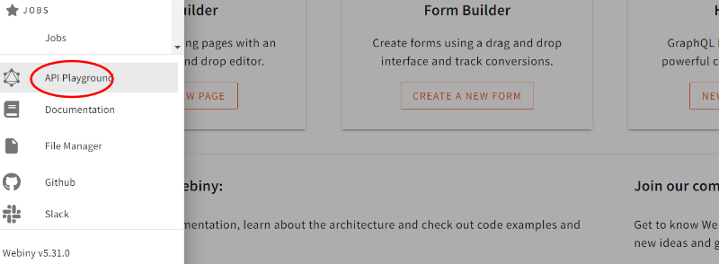

import OnPagePromo from "../components/ui/on-page-promo/on-page-promo"

Job board applications are practical for employers to find potential candidates for roles within their organization, and for the freelancer or job seeker they can be a great source for finding work.

In this tutorial we will be building a Job Board Application, which is an [Upwork](https://www.upwork.com/), [Indeed](https://www.indeed.jobs/) or [Fiverr](https://www.fiverr.com/) clone, and in the process we will learn how to integrate the **Webiny CMS** into a Vue.js application using [GraphQL](https://graphql.org).

This job board application will allow you to create and manage job vacancies using **Webiny CMS** on the backend. We will be making our own stylesheet as opposed to using any other CSS technology, as we will mainly be focusing of the code rather than the styling. 

## Step 1: Create a Webiny Project

As previously mentioned in order to start using the **Webiny CMS** you need to be create a new app on your local machine, then deploy it to AWS. The documentation found on the [Webiny website](https://www.webiny.com/docs/get-started/install-webiny) is well detailed and will guide you through the installation process if you have not already done so. 

Once you have all the [prerequisites](https://www.webiny.com/docs/get-started/install-webiny#prerequisites) for Webiny CMS we can start to create your new project. Open your terminal and navigate to the folder you would like to store your project. Next using the command below create your project.

```jsx
npx create-webiny-project my-webiny-project
```

Once the deployment is done, you will be presented with a URL where you can access your **Admin Dashboard as shown below:**


### Step 2: Create Content Models

Now that you have the **Webiny CMS** installed we will start to create our Content Models that will hold the data we wish to see in our **Vue.js** Application.

Using the menu icon navigate to **Headless CMS > Models**, where we will create a new **Content Model** called **Job.** This is at it’s core a data container that will hold the template for the parameters of what qualifies as a job.

Select **Models** from the **Content Models** navigation item as shown below:


Create your Model as shown in the image below:


Fill in the description to help you remember what the job model will contain.

Next, you can drag and drop different field types into the **Edit** area to create your structured content:


We will first drag and drop a `TEXT` field from the left to create our first content.

We will give it a label **Job Role** and save the field. Notice that the Field IDs will be used for accessing via GraphQL later.


Create these fields - you can rename them if you like. Here is an example of the all the fields:


- **Job Role** - `Text`
- **Job Contact** - `Text` (Pattern - Email)
- **Job Location** - `Text`
- **Job Reference URL** - `Text` (Pattern-URL)
- **Job Start Date** - `Date/Time` (Date Only)

For certain fields I have also added setting in the validators section. This will ensure the correct values are entered into the backend. We will also check the validation in the frontend too.


**NOTE:** If you have any errors when pushing content to the backend it could be that you have defined validations that are not being adhered to on the front-end.

Once you have saved your model, go back to Headless CMS and you will see the new model under **Ungrouped**.


We will create a **New Entry** and will fill out all the fields with dummy data as we will be able to remove it from the CMS later. Once you are happy with your entry, save and publish it.


## Step 3: Creating the Vue.js App

In a separate folder on your local machine, we will create the Vue project using Vite.js. [Vite](https://vitejs.dev/) is super fast and one of the best tools for prototyping an application. You can use frameworks like React and Svelte with Vite as well, however in this article we will be focusing on Vue.js.

```bash
npm create vite@latest [PUT YOUR OWN PROJECT NAME HERE]
```


Once you have selected your framework and the installer has completed, go into the directory and install the dependencies:

```bash
cd [project name]
npm install
```

Open the project in your code editor. We will first remove all the boilerplate code in the `App.vue` file, then replace with this code.


```javascript
<script setup>
import { reactive } from "@vue/reactivity"; 

/* Array to contain our job date */
const jobs = reactive([]);

</script>

<template>
  { /* container for the entire page /* }
  <div class="container">
    { /* a div to layout all the jobs in our database /* }
    <div class="jobs">
      <h1>JOBS</h1>
      <div class="job" v-for="job in jobs" :key="job.jobUrl">
        <div class="header">
          <h2>{{ job.title }}</h2>
          <span class="material-icons"> delete </span>
        </div>

        <h4>{{ job.jobUrl }}</h4>
        <p>
          {{ job.desc }}
        </p>
        <h3>{{ job.location }}</h3>
        <h3>{{ job.contact }}</h3>
        <h3>{{ job.expires }}</h3>
        <span>posted on {{ job.createdOn}}</span>
      </div>
    </div>
    { /* a div to layout our form sidebar /* }
    <div class="side">
    </div>
  </div>
</template>

{ /* Most of the styles are in styles.css. Here are some just for this page. /* }
<style scoped>
/* These two classes are to layout the title and the delete button on a job */
.header {
  display: flex;
  justify-content: space-between;
}
.header span {
  padding: 15px;
  font-size: 2em;
  cursor: pointer;
}
</style>
```

<OnPagePromo />

### Styling the Application

In the `style.css` file in your source folder,  add this CSS at the end.

```css
.container {
  width:100%;
  display: grid;
  grid-template-columns: 66% 33%;
  gap: 10px;
  padding: 0px;
  color:#000;
  box-sizing: border-box;
  text-align: left;
  
}
.jobs{
  padding: 5px;
}
.side{
  min-height: 100vh;
  padding-left: 10px;
  background-color:#FFE8A3;
}
.job,.jobForm {
  display: inline-block;
  margin: 5px;
}
textarea{
  background-color: #fff;
  border-radius: 10px;
  border: none;
  margin: 5px;
  display: block;  
  color: #000;
  width: 100%;
}
input {
  background-color: #fff;
  border-radius: 10px;
  border: none;
  margin: 5px;
  color: #000;
  display: block;
  width:300px;
  padding: 20px;
  height: 1em;
}
button{
  width: 100%;
  background-color: orange;
  height: 4rem;
}
.job {  
  width: 40%;
  border-radius: 20px;
  color: #000;
  padding-left:10px;
  background-color: #fff;
}

/**When the application is viewed on a mobile **/

@media only screen and (max-width: 640px) {
  .container {
    display: inline-block;
  }
  .job{
    width: 90%;
  }
}
```

### Adding Google Icons

I have also added the stylesheet to enable us to have **Material Icons by Google** in our application.  In the index.html file add the link to the Material Icons stylesheet as shown below:

```html
  <head>
    <meta charset="UTF-8" />
    <link href="https://fonts.googleapis.com/icon?family=Material+Icons" rel="stylesheet">
    <link rel="icon" type="image/svg+xml" href="/vite.svg" />
    <meta name="viewport" content="width=device-width, initial-scale=1.0" />
    <title>Job Board Application</title>
  </head>
```

This is the bare structure of our application, currently we do not have any data to visualize our application. Let’s fix that but integrating **Webiny CMS** so that we can view the entries we created in our **Webiny CMS** project.

## Step 4: Integrating our Headless CMS

Before we can access the **Headless CMS** from Vue we need a **token** and the **URL** for the **API**. Here’s how to get the **URL**:

[https://www.webiny.com/docs/headless-cms/basics/graphql-api](./assets/build-job-board-application-vue-graphql/https://www.webiny.com/docs/headless-cms/basics/graphql-api)

Alternatively you can open your **Webiny** project and run this command

```bash
# Returns information for the "dev" environment.
yarn webiny info --env dev
```

Next we will create a new **API** Key and give the Headless CMS all the permissions as we need to be able to push content to the backend and not just read it.

Select **API Keys** from the **Settings** menu:


The Token will be displayed here once you save your permissions:


**NOTE: Make sure you save your API token in a safe place** 

We need to add access to our **Headless CMS** so that we can access it using GraphQL, change the access level to the settings below:


Create an `.env` file in the root of your Vue project and add your data below:

```bash
VITE_WEBINY_API=YOUR WEBINY CMS URL HERE
VITE_TOKEN=YOUR WEBINY CMS TOKEN API HERE
```

**IMPORTANT NOTE**: This `.env` file with the exposed API Key and token is fine when testing locally on your machine. When you are hosting your application somewhere it can be accessed on the web, it would be best to use a server-side function for data fetching as this example code would be unsafe to use.

### Adding GraphQL using URQL

We will be using URQL to help us link the **Webiny CMS** to our Vue application. Let’s add **URQL** to our Vue JS application.

The full documentation for URQL can be found here: [https://formidable.com/open-source/urql/docs/basics/vue/](./assets/build-job-board-application-vue-graphql/https://formidable.com/open-source/urql/docs/basics/vue/)

In your project folder, open the terminal and run this command:

```bash
npm install --save @urql/vue graphql
```

Update your `main.js` file

```javascript
import { createApp } from 'vue'
import './style.css'
import App from './App.vue'
import urql from '@urql/vue';
const app = createApp(App);
app.use(urql, {
    url: import.meta.env.VITE_WEBINY_API,
    fetchOptions: () => {
        const token = import.meta.env.VITE_TOKEN;
        return {
            headers: { authorization: token ? `Bearer ${token}` : '' },
            
        };
    },
})
app.mount('#app')
```

## GraphQL - View all Jobs

We have now come to the section where we will start using **GraphQL**. The best practices is to test queries on the API itself before putting them into our application.

**Webiny** provides an excellent **API Playground** where can test the backend.
Open your browser navigate to your **Webiny Admin Dashboard** and open the **API Playground**



Navigate to the **Webiny Manage API** and enter the values on the left below. Run the code to see your result.


Here is the code for the above query: 

```graphql
query {
listJobs { 
  data {
    jobRole
    jobContact
    jobDescription
    jobLocation
    jobUrl
    createdOn
  }
}
```

Now that we know the query returns the data we require, let’s add it to our Vue.js application.

As we will be using Dates in our application we will install **moment.js** for date styling. Open the terminal and run the command below:

```bash
npm install moment --save
```

Open your `App.vue` file and enter the code below which includes our **moment.js** import and our **GraphQL** query using `useQuery` from **URQL**:

```javascript
import { reactive } from "@vue/reactivity";
import moment from "moment";
import { useQuery } from "@urql/vue";
/* Array to contain our jobs */
const jobs = reactive([]);
const currentDate = moment(Date.now()).format("Do MMMM Y");

/* * This function will access the Webiny CMS using GraphQL to return all the jobs posted.
 */
const result = useQuery({
  query: `
    {
      listJobs {
        data {
          id
          jobRole
          jobContact
          jobDescription
          jobLocation
          jobUrl
          startDate
          createdOn
        }
      }
    }
  `,
}).then((result) => {
  
  // get the list of result from the CMS
  let jobResult = result.data.value.listJobs.data; 
  
  // if any data is returned push each result into the jobs array
  jobResult.forEach((element) => {
    jobs.push(element);
  });
});

</script>

<template>
  { /* container for the entire page /* }
  <div class="container">
    { /* a div to layout all the jobs in our database  /* }
    <div class="jobs">
      <date class="currentDate">{{ currentDate }}</date>
      <h1>JOBS</h1>
      { /* for each job in our database display  /* }
      <div class="job" v-for="job in jobs" :key="job.id">
        <div class="header">
          <h2>{{ job.jobRole }}</h2>
        </div>
        <h4>{{ job.jobUrl }}</h4>
        <p>
          {{ job.jobDescription }}
        </p>
        <h3><span class="material-icons"> map </span>{{ job.jobLocation }}</h3>
        <h3><span class="material-icons"> mail </span>{{ job.jobContact }}</h3>
        <h3>Expires: {{ moment(job.startDate).format("Do MMMM Y") }}</h3>
        <span>posted on {{ moment(job.createdOn).format("Do MMMM Y") }}</span>
      </div>
    </div>
    { /* a div to layout our form sidebar  /* }
    <div class="side">
    </div>
  </div>
</template>

```

Once you've added the code, open the terminal and run

```bash
npm run dev
```

If you have set everything us correctly, you should now be able to see a list of Job entries that you created using the **Headless CMS** in the **Admin Dashboard**. 

## Step 5: Managing Jobs

Now that we can see all the jobs on our backend, let’s look at deleting them. In GraphQL, whenever we want to manipulate existing data we need to use a **mutation**. 

In the template section add the new **button** to the div with a class of header. We will also add an `onclick` event for the function we will write for removing a single job by taking in it’s `ID` as a parameter.

```jsx
<div class="header">
  <span>posted on {{ moment(job.createdOn).format("Do MMMM Y") }}</span>
  <button class="icon" @click="removeJob(job.id)">
    <span class="material-icons"> delete </span>
  </button>
</div>
```

### Delete a Job

As with the previous query we test our **mutation** first on the backend. List all the jobs and this time we will return the ID along with any other data. Copy one of the entries ID’s from one of the results.


Next we will write our GraphQL **mutation** adding the ID we copied earlier then we will execute the code to see the result.

```jsx
 mutation($ID: ID!){
  deleteJob(revision:$ID) {
    data
  }
}
```

You should be able to see the results similar to the screenshot below:


The test on the **Webiny API Playground** was successfull so now we can write our mutation in our Vue.js app. In the script section of the `App.vue` file enter the code below:

```jsx
import { useQuery, useMutation } from "@urql/vue"; //

/** DELETING A JOB * */
const deleteJobResult = useMutation(`
  mutation($ID: ID!){
    deleteJob(revision:$ID)
      {
        data
      }
  }
`);

/* Function we will call from the span onclick event */
/* Has a parameter of ID to get the relevant job in the backend */
const removeJob = (id) => {  
  const variables = {
    ID: id,
  };
  deleteJobResult.executeMutation(variables).then((result) => {
    if (result.error) {
      console.error("There has been an error:", result.error);
    } else {
      location.reload(); // refresh the page
    }
  });
};
```

Congratulations! We have successfully removed a job, using it’s id, from **Webiny CMS** using **GraphQL** mutation.

### Adding New Jobs

We have seen how we are able to view all the content on the backend and even manage a specific element in our CMS. However, it would be nice not to have to always create our data on the backend but instead create a form that allows us to push data into our CMS from our Vue application.

Let’s do this by making a new component called `Create.vue` in the `components` folder. In that file, enter the code below: 

```jsx
 <script setup>
import { reactive } from "@vue/reactivity";

const newJob = reactive({
  title: "",
  desc: "",
  jobUrl: "",
  location: "",
  contact: "",
  expires: ""
})

/* Reset all the dynamic fields after submitting the form */

function resetFields(newJob) {
  newJob.title = "";
  newJob.jobUrl = "";
  newJob.desc = "";
  newJob.location = "";
  newJob.contact = "";
  newJob.expires = "";
}

</script>
<template>
  <div>
    <h1>CREATE JOB</h1>
    { /* Form for creating a job. This will push entered values into the CMS /* }
    <form class="jobForm" @submit.prevent="checkFields(newJob)">
      <label for="title">Title</label>
      <input type="text" name="title" v-model="newJob.title" />
      <label for="desc">Job Description</label>
      <textarea name="desc" class="jobDesc" rows="5" v-model="newJob.desc"> </textarea>
      <label for="URL">Job Reference URL</label>
      <input type="url" name="URL" placeholder="https://" pattern="https://.*" v-model="newJob.jobUrl" />
      <label for="contact">Job Contact Email</label>
      <input type="email" name="contact" v-model="newJob.contact" />
      <label for="location">Job Location</label>
      <input type="text" name="location" v-model="newJob.location" />
      <label for="expiry">Job Start Date</label>
      <input type="date" v-model="newJob.expires" name="expiry" />
      <button type="submit" value="Submit">ADD JOB</button>
    </form>
  </div>
</template>
```

**NOTE:** If you examine the HTML in the template section you will notice that the **EMAIL** and **URL** inputs have patterns attached to them which corresponds to the validator fields on the **Webiny CMS**.

### Adding Jobs to Webiny CMS

Before we create the mutation we need to add a new job we will once again do a test on Webiny CMS.

Let’s test the backend by inserting some dummy data and seeing what is returned. Open **API Playground** on your **Webiny CMS** and under the **Manage API** enter some data similar to the one below:

```graphql
mutation {
  createJob(
    data: {
      jobRole:"Web Developer"
      jobContact:"joe@joebloggs.com"
      jobDescription:"Develop websites with Webiny CMS"
      jobLocation:"Remote"
      jobUrl:"http://www.google.com"
      startDate:"2022-09-01"
    }
  )
  {
    data {
      jobRole
      jobDescription
      jobContact
      jobLocation
      jobUrl
      startDate
      createdOn
    }
  }
}
```

Once you enter that code in the API Playground, you should see the result as below:


Now that we have successfully created a new entry on our CMS we will use this code to create our GraphQL mutation.

Let’s convert this using the `useMutation` function from **URQL** in our Vue.js application. We can add the code below to the `<script>` section of our `Create.vue` file.

```jsx
import { reactive} from "@vue/reactivity"; // import ref  from vue
import { useMutation } from "@urql/vue";
/*  Create field for job form  - corresponds to the fields we have in our Webiny CMS */
const newJob = reactive({
  title: "",
  desc: "",
  jobUrl: "",
  location: "",
  contact: "",
  expires: ""
})

/**We will use variables to collect from the form fields*/
const createJobResult = useMutation(`
mutation(
  $title:String!,
  $contact:String!,
  $desc:String!,
  $location:String!,
  $url:String!,$expiry:Date!) {

  createJob(
    data:{
      jobRole:$title
      jobContact:$contact
      jobDescription:$desc
      jobLocation:$location
      jobUrl:$url
      startDate:$expiry
    })
    {
      data {
        jobRole
        jobDescription
        jobContact
        jobLocation
        jobUrl
        startDate
      }
    }
  }
`);

/* This function will take all the input from the form and push it into an object.
/* Then it will push the object to the jobs array and reset all the input fields.

const addJob = () => {
	  const variables = {
      title: newJob.title,
      contact: newJob.contact,
      desc: newJob.desc,
      location: newJob.location,
      url: newJob.jobUrl,
      expiry: new Date(newJob.expires).toISOString().split("T")[0], // WEBINY CMS accepts a particular format for sending Dates
    }
  };
  createJobResult.executeMutation(variables).then((result) => {
    if (result.error) {
      alert(result.error.name);
    } else {
      window.location.reload();
    }
  });
};
```

Now that we have setup our `Create.vue` let’s import it into `App.vue` and add it to the sidebar in the template section.

```jsx
import Create from "./components/Create.vue";

{ /*} a div to layout our form sidebar /* }
<div class="side">
  <Create></Create>
</div>
```

This should result in the form being rendered in the sidebar like so:


You should now see the component on the side of the screen when your run the following command in the terminal:

```bash
npm run dev
```

Fill out all the fields to verify that we have connected the application successfully.  The page will reload and the new entry will appear on the left with all the information you entered.

## Conclusion

In this article we have learnt how to use the Webiny Headless CMS, how to set up up Content Models, how to create Tokens, Manage Permissions and how to test GraphQL query and mutations using the API Playground. 

We have also learnt how to use GraphQL with URQL along with Vue.js to connect our Webiny CMS to our working Job Board application.

Thank you for reading! 

**Full source code:** https://github.com/webiny/write-with-webiny/tree/main/tutorials/job-board-vue-graphql

---

This article was written by a contributor to the Write with Webiny program. Would you like to write a technical article like this and get paid to do so? [Check out the Write with Webiny GitHub repo](./assets/build-job-board-application-vue-graphql/https://github.com/webiny/write-with-webiny/).