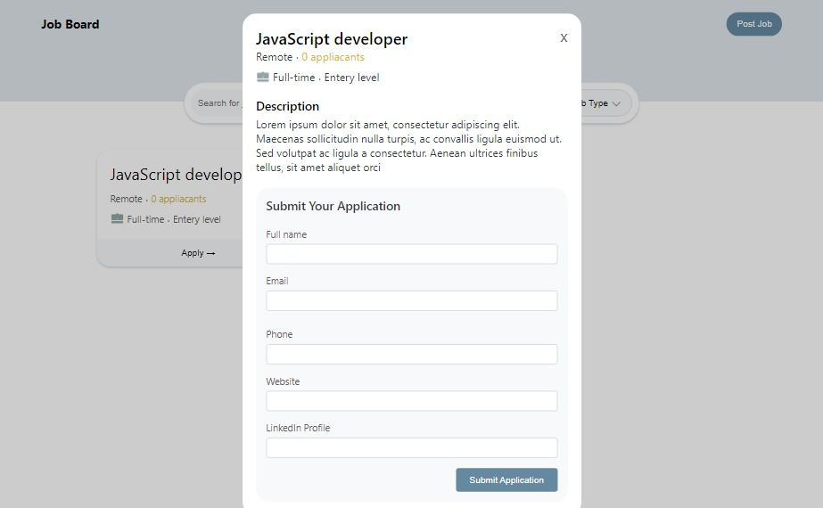
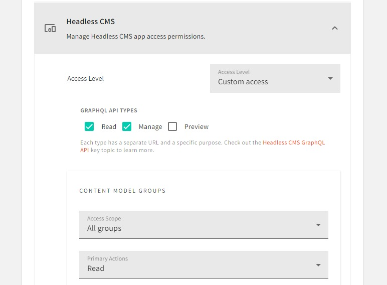
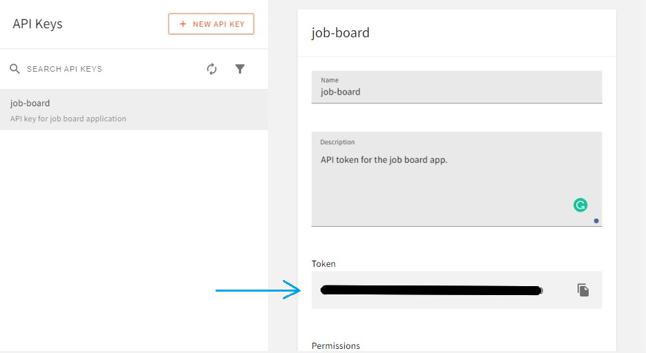
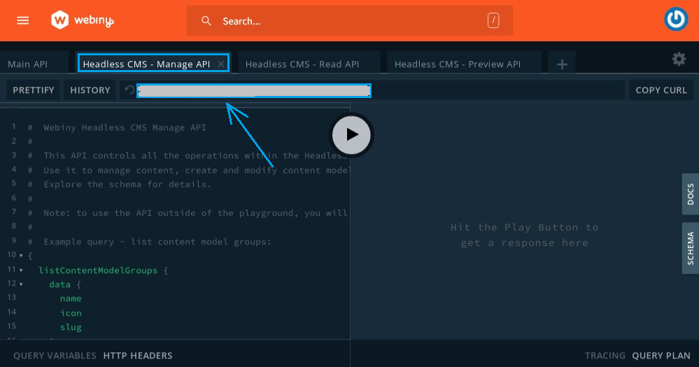

import OnPagePromo from "../components/ui/on-page-promo/on-page-promo"

A job board is an app or section of a website where job vacancies are advertised by employers to potential employees or freelancers. They mostly include features for searching for and filtering jobs and a form for applying for a job. Examples of common job boards or platforms that include a job board are [Upwork](https://www.upwork.com/), [Indeed](https://www.indeed.jobs/) and [Fiverr](https://www.indeed.jobs/). 

In this tutorial, we will learn about the Webiny CMS and how we can use it in React by building a job board application.

## Prerequisites

To follow along with this tutorial, you need to have the following:

- [AWS account and user credentials](https://www.webiny.com/docs/infrastructure/aws/configure-aws-credentials) are set up on your system.
- Basic knowledge of React and GraphQL.
- Node.js >=14 and yarn ^1.22.0 || >=2 installed in your system.
- [Star our GitHub Repo](https://github.com/webiny/webiny-js) 😉

## Introduction to Webiny headless CMS

A headless CMS is one that deals strictly with the content. It is a backend-only CMS where the content repository is separated from the presentation layer. Once created, its content is served via an API giving front-end developers full control over the user experience using their native tools.
The Webiny [headless CMS](https://www.webiny.com/enterprise-serverless-cms/headless-cms/) is GraphQL based, with a powerful content modeling feature and it’s serverless, so optimized for scalability by default.

## Create and Deploy a new Webiny Project

To get started, we need to first create a Webiny project, deploy it and then model our content in the headless CMS using the generated Admin app.

To deploy a new Webiny project, enter the following command in the terminal:

```bash
npx create-webiny-project webiny-backend
```

After running the above command you will be asked several questions, one of which is to choose a database, for that, select **DynamoDB** which is suitable for our use case. The above command will create a Webiny project called **webiny-backend** which consists of three applications: a GraphQL API, an Admin app, and also a React website.

Once the new project has been created, it’s time to deploy it into our AWS account. We can do this with the following commands:

```bash
cd webiny-backend

yarn webiny deploy
```

If it’s our first deployment it will take over 20 minutes. after it’s done the URL to the Admin App, GraphQL API endpoints and website would be printed out in the terminal. We will use them shortly.

<OnPagePromo />

## Defining Content Model in the Admin app

A content model defines the structure of the content we want to store in the CMS. We can do this using the generated Admin app. For our use case, we will define a **Job** model to hold job entries and an **Application** model for job applications.

To access the Admin app, we can click the URL printed in the terminal earlier when we deployed our project.

**Note:** Perhaps you have closed the terminal, to view the URLs you can the `yarn webiny info` command.
 


For the first time accessing the Admin app we would be prompted to create a default user with our details. After doing that, we will be taken to the welcome page:


Next, navigate to the **Content Models** page by clicking on the **New Content Model** button within the **Headless CMS** card, and on the next page click on **New Modal** at the top of the page and we will see a prompt with a form to add some information for a new Content Model. 


For the **Job** model, in the name field enter **Job** then click on the **CREATE MODEL** button. Following thesame process let’s also create the **Application** model. Each model has a page where we can add different field types to it which are the representation of the data to be held by the model. 


After creating a model we will be taken to this page. We can navigate to it by clicking on the edit icon of a model on the **Content Models** page. 

To add a field, we need to drag and drop it in the drop zone, then in the prompt that appears supply a Label (required) and click on the **SAVE FIELD** button. Below is a video showing how a **TEXT** field labeled **title** is added:

<video width="800px" height="auto" controls autoplay>
  <source src="./assets/build-job-board-react-graphql/Untitled.mp4" type="video/mp4" />
</video>

Now following the process in the Video above let’s create the following fields for the **Job** model:

- Four(4) **TEXT** fields with the labels: **title, type, station,** and **level**.
- **LONG TEXT** field with the label **description.**


After creation, click on the **SAVE** button at the top right of the page.

For the **Application** model:

- Four(4) **TEXT** fields the labels: **name, email, website,** and **linkedInProfile**.
- **NUMBER** field with the label **phoneNumber.**
- **REFERENCE** field with the label **ref** and Content Models **Job**. This field will be used to hold the **ID** of a **JOB** entry.


Then, click on the **SAVE** button. 

Now that we have set up a Webiny project and created our Content models. We are now left with consuming the GraphQL API in the front-end.

To test and introspect GraphQL queries and mutations on our content models before using them from in the front-end,  we can use the GraphQL playground. To access the playground, click on **API Playground** in the sidebar of the Admin app.

## Building the Job board frontend

The app we will build will have the following key features: A search bar for searching for a job, filter options for the job type, experience level, and station (Remote/On-site), and a form for creating a job and applying to one.

I have already created a job board template so we can solely focus on working with Webiny Headless CMS in creating the listed features/functionalities. The next step is to clone the GitHub repo.

### Cloning the starter repo

We can do this with the following commands:

```bash
git clone https://github.com/webiny/write-with-webiny.git

cd write-with-webiny/tutorials/react-job-board

npm install
```

For working with GraphQL in our frontend we will be using [Apollo client](https://www.apollographql.com/docs/react/), I have included `@apollo/client` and `graphql` in the dependency object of the `package.json` file. So by running the `npm install` command the needed packages will be installed.

Now when we start the app with `npm start`, we should see the following screen in our browser:


Right now a job manually added to the app is being displayed, later on this will be replaced with the one coming from the CMS.

When we click the **Apply** button on a job card, we will see the following:



And when we click on the **Post Job** button at the top-right of the page, we will see the following:


### Initialize Apollo client

To initializing Apollo we need to get an API token to enable us to gain access to the Webiny GraphQL API and the correct Headless CMS GraphQL API endpoints. After getting the above we will be storing them in a **.env** file in our app which will look like the following:

```bash
REACT_APP_WEBINY_GRAPHQL_TOKEN = your-token-here
REACT_APP_WEBINY_GRAPHQL_READ_URL = your-read-url-here
REACT_APP_WEBINY_GRAPHQL_MANAGE_URL = your-manage-url-here
```

To get the API token, head over to the Admin app and in the sidebar expand the **Settings** tab and we will see **API keys** under the **ACCESS MANAGEMENT** section.


Select **API keys,** and on the next screen click on **New API key.** we will see a prompt where we can set the name, description, and access control options for our KEY.


Enter a name and description then scroll down the page, expand the **Content** tab and select **All locales.**


Next, expand the **Headless CMS** tab which contains options to control which operations the API token can, or cannot, perform.


For our use case, here is how we will set the controls.




Webiny Headless CMS includes different API types, each of which has a separate endpoint and different purpose. You can read more about it [here](https://www.webiny.com/docs/headless-cms/basics/graphql-api#graph-ql-api-types). Above, under the **GRAPHQL API TYPES** heading we have enabled the **Read** and **Manage** type to give the API token to be generated permissions to use the endpoint of both types. We are doing this so that while sending requests to read data we can use the **Read** endpoint and for creating, editing and publishing we can use the **Manage** endpoint.

Above, under the **PUBLISHING ACTIONS** heading**,** we have also enabled **Publish** action. We are doing this so that using the API token we will be able to publish created entries since when entries are created they are tagged as **Draft** and can not be fetched with the **Read** API endpoint unless they are published.

After setting the controls, click on the **SAVE API KEY** button at the bottom of the page and our API token will be created.



Now we can copy the token and store it in a **.env** file in our React app.

- **NOTE** Since we have enabled the Manage API type for this token, it should not be used on the frontend. It’s fine when testing locally on your machine, but when hosting your application it’s best to use a server-side function for sending requests as this example code would be unsafe to use.

Next, let’s get the endpoint for the Manage API and Read API. Go to the API playground in the Admin app, click on the **Headless CMS - Manage API** tab at the top of the page copy the URL directly below the tab and supply it to the appropriate variable in the **.env** file.



Then, for the Read endpoint, click on the **Headless CMS - READ API** tab, copy the URL directly below the tab and supply it to the appropriate variable in the **.env** file.


Now, to initialize Apollo client, modify **index.js** file in the **src** directory to look like this:

```jsx
// src/index.js
import React from 'react';
import ReactDOM from 'react-dom/client';
import './index.css';
import App from './App';
import { ApolloClient, InMemoryCache, ApolloProvider, HttpLink, ApolloLink } from '@apollo/client';

const manageEndpoint = new HttpLink({
  uri: process.env.REACT_APP_WEBINY_GRAPHQL_MANAGE_URL,
  headers : {
    Authorization : `Bearer ${process.env.REACT_APP_WEBINY_GRAPHQL_TOKEN}`
  }
});

const readEndpoint = new HttpLink({
  uri: process.env.REACT_APP_WEBINY_GRAPHQL_READ_URL,
  headers : {
    Authorization : `Bearer ${process.env.REACT_APP_WEBINY_GRAPHQL_TOKEN}`
  }
});

const client = new ApolloClient({
  link: ApolloLink.split(
    operation => operation.getContext().endpointType === "manage",
    manageEndpoint,
    readEndpoint,
  ),
  cache: new InMemoryCache(),
});

const root = ReactDOM.createRoot(document.getElementById('root'));
root.render(
  <ApolloProvider client={client}>
    <App />
  </ApolloProvider>
)

```

Above, we have initialized Apollo client to be able to interchangeably use the Read and Manage endpoint using the `split` method in `ApolloLink`. This method receives three arguments. The first is a test to check the value of `endpointType` supplied while sending requests. If the test passes (i.e when `endpointType === "manage"`) the second argument which is the Manage endpoint will be supplied as the link for the GraphQL request, but if it fails the third argument which is the Read endpoint will be supplied as the link.

### Posting new jobs

For this, we will be using `createJob` and `publishJob` Webiny GraphQL mutation functions which were automatically created for us after creating our content model. As their name implies `createJob` is for creating a new job while `publishJob` is to publish a created job so that it can be accessed by the Read API endpoint. We will also be using the `useMutation` hook from Apollo client for sending mutation requests to our GraphQL server. 

Head over to **src/PostJob.js** and add the following import and mutations before the `PostJob` component:

```jsx
// src/PostJob.js
import { gql, useMutation } from '@apollo/client';

const POST_JOB = gql`
  mutation CreateJob(
    $title: String
    $description: String
    $type: String
    $station: String
    $level: String
  ){ 
  createJob(data: {
    title: $title
    description: $description
    type: $type
    station: $station
    level: $level
  }) {
    data {
      id
    } 
  }
}`

const PUBLISH_JOB = gql`
mutation PublishJob($revision: ID!) {
  publishJob(revision: $revision) {
    data {
      id
    }
  }
}
`
```

Above, we have created a `POST_JOB` mutation which calls `createJob`, and `PUBLISH_JOB` which calls `publishJob`. In them, we have defined the variables to be passed when they are been called. 

Next, add the following lines of code after the `openSelect` state:

```jsx
// src/PostJob.js
const [postJob, { loading }] = useMutation(POST_JOB, {
    context: {endpointType: 'manage'}
  });

const [publishJob] = useMutation(PUBLISH_JOB, {
  context: {endpointType: 'manage'}
})

const handleSubmit = (e) => {
  e.preventDefault();
  postJob({ variables: {
    title,
    description,
    type: jobType,
    station: jobStation,
    level: jobLevel
  }}).then(({data}) => {
    publishJob({
      variables: {
        revision: data.createJob.data.id
      }
    })
    closeModal()
  })
}
```

Above, we have called two `useMutaion` hooks, for creating and publishing a job, passing the defined mutations, specifying the endpoint to be used, and destructuring the mutation execution function `postJob` and `publishJob` respectively. 

We have also created a `handleSubmit` function which when called will call `postJob`, passing the required variables. When the job is created and its ID is returned we call `publishJob`, pass the ID, and then close the modal.

Now to call `handleSubmit`, modify the opening tag of the form with `name='postJob'` to the following:

```jsx
// src/PostJob.js
<form name='postJob' className="postJob" onSubmit={handleSubmit} >
```

With this, when we open the app in our browser, click the `Post Job` button at the top-right of the page, fill in and submit the displayed form a job entry will be added to our CMS. Next, let’s display the created jobs in the UI.

### Fetching and Displaying all jobs

For fetching all jobs we will be using the `listJobs` Webiny query and `useQuery` hook from Apollo client to send query requests to our GraphQL server.

Head over to **src/App.js** and add the following import and query:

```jsx
// src/App.js
import { gql, useQuery } from '@apollo/client';

const LIST_JOBS = gql`
{
  listJobs {
    data {
      id
      title
      description
      type
      station
      level
    }
  }
}
`
```

Above, we have created a `LIST_JOBS` which calls `listJobs` specifying the data we wish to be returned from our CMS when the query is executed.

Next, add the following line of code after the `jobStation` state:

```jsx
// src/App.js
const {data} = useQuery(LIST_JOBS)
```

By calling the `useQuery` hook and passing in the `LIST_JOBS` query as above, whenever our app renders it will be executed and will return an object from Apollo Client that contains the data from our CMS. The endpoint to be used will be the READ endpoint because the test done in the `split` method in the **index.js** file will fail since we did not specify `manage` as the endpoint type. 

Now to display the returned data, modify the following rendered component:

```jsx
// src/App.js
<JobCard 
  title='JavaScript developer'
  station='Remote'
  type='Full-time'
  level='Entery level'
  description='Lorem ipsum dolor sit amet, consectetur adipiscing elit. Maecenas sollicitudin nulla turpis, ac convallis ligula euismod ut. Sed volutpat ac ligula a consectetur. Aenean ultrices finibus tellus, sit amet aliquet orci.'
/>
```

With this:

```jsx
// src/App.js
{data?.listJobs?.data.map((job) => (
  <JobCard 
    key={job.id}
    id={job.id}
    title={job.title}
    station={job.station}
    type={job.type}
    level={job.level}
    description={job.description}
  />
))}
```

With this, when we open our app in the browser we will see all the posted jobs like this:


Right now if we post a new job it won’t be displayed unless we refresh the page. Let’s fix that.

There are a few ways we can do this using Apollo client but the best is to include a `refetchQueries` array in the mutation's options of the `useMutation` hook called in the `PostJob` component passing the `LIST_JOBS` query to it something like this:

```jsx
useMutation(POST_JOB, {
  context: {endpointType: 'manage'},
  refetchQueries: [
    {query: LIST_JOBS}
  ],
});
```

When we do this anytime we post a job, the `LIST_JOBS` query will be refreshed.

In the starter app, I have included a prop to be used in passing a query to the `PostJob` component, so now we need to pass the `LIST_JOBS` to that prop and use it in the `useMutation` hook.

In the `App` component, modify the rendered `Hero` component adding the following prop:

```jsx
// src/App.js
<Hero 
  //...
  queryToRefresh={LIST_JOBS}
/>
```

Next, head over to **src/PostJob.js** and modify the `useMutation` hook to the following:

```jsx
// src/PostJob.js
const [postJob, { loading }] = useMutation(POST_JOB, {
  context: {endpointType: 'manage'},
  refetchQueries: [
    {query: queryToRefresh}
  ],
});
```

That’s it. Problem solved.

### Searching and filtering jobs

Let’s work on making the search bar and filter options functional.

For the search functionality, we will be using the `filter` and `includes` JavaScript method to filter the jobs whose title includes the text entered in the search bar. Then we will set the filtered results in a state that will control what’s displayed in the UI.

To do this, the first thing we will do is create a state to hold and display the returned data from our CMS rather than displaying it directly. This will be done to aid us implement to search functionality.

Head over to **src/App.js** and add the following import:

```jsx
import {useEffect} from 'react'
```

Next, add the following line of code after the `useQuery` hook in the `App` component:

```jsx
// src/App.js
const [filteredJobs, setFilteredJobs] = useState([])

useEffect(() => {
  if(data){
    setFilteredJobs(data.listJobs.data)
  }
}, [data])
```

Above we have created a state and used the `useEffect` hook to set the returned data from our CMS to it.

Next, let’s add controls to display what’s being rendered using this state. Modify the `div` with `className='jobs wrapper’` to the following:

```jsx
// src/App.js
<div className='jobs wrapper'>
  {filteredJobs.map((job) => (
    <JobCard 
      key={job.id}
      id={job.id}
      title={job.title}
      station={job.station}
      type={job.type}
      level={job.level}
      description={job.description}
    />
  ))}
</div>
```

Next, let’s create the function for searching. Add the following lines of code after the `filteredJobs` state:

```jsx
// src/App.js
const handleSearch = (e) => {
  e.preventDefault();
  const filtered = data.listJobs.data.filter((job) => 
    job.title.toLowerCase().includes(searchValue.toLowerCase())
  )
  setFilteredJobs(filtered)
}
```

The above function will set the `filteredJobs` state with the jobs whose title includes the text entered in the search bar.  Now, we need to call this function whenever the **Search** button is clicked which is in the `Search` component in **src/Search.js**. This means we have to pass the `handleSearch` function as prop all the way down to the `Search` component. 

I have already added a prop in the starter app tp for this. To use it modify the rendered `Hero` component to include the following:

```jsx
// src/App.js
<Hero 
  //...
  onSearch={handleSearch}
/>
```

Now for the filter functionality, what we want to do is that when a filter option is clicked, all the jobs that match the selected options should be displayed. For this we will also use the `filter` and `includes` JavaScript method.

Add the following lines of code after the `useEffect` hook in the `App` component:

```jsx
// src/App.js
useEffect(() => {
  if(data) {
    let filtered = data.listJobs.data
    // for jobLevel select
    if(jobLevel.length) {
      filtered = filtered.filter((job) => 
        jobLevel.includes(job.level)
      )
    }
    // for jobStation select
    if(jobStation.length) {
      filtered = filtered.filter((job) => 
        jobStation.includes(job.station)
      )
    }
    // for jobType select
    if(jobType.length) {
      filtered = filtered.filter((job) => 
        jobType.includes(job.type)
      )
    }
    setFilteredJobs(filtered)
  }
}, [jobType, jobStation, jobLevel, data])
```

Above we have added a `useEffect` hook that runs anytime a filter option is selected. In the `useEffect`, we create conditional statements for the array states holding the values of the selected options of a select button in our app. Each conditional statement will run only when the state is not empty is responsible for filtering the matching result of a selected option and assigning it to the `filtered` variable which is later set in the state.

With this, we can start filtering jobs in our app.

### Applying for a job

When the **Apply** button on a job in our app is clicked we will see a form to be used for applying to that job. Let’s work on making it functional. We will also work on displaying the total number of applicants for a job.

Remember when creating the fields for the **Application** model, we added a **REFERENCE** field to hold the ID of a job. This is key to implementing this feature. By storing the ID of the job being applied for along with the other fields for the job application, we can filter all applicants to a particular job using that ID.

To apply for a job, we will be using the `createApplication` and `publishApplication` Webiny GraphQL mutation function. Head over to **src/Job.js** and add the following import and mutation before the `Job` component:

```jsx
// src/Job.js
import { gql, useMutation } from '@apollo/client';

const APPLY_FOR_JOB = gql`
  mutation CreateApplication(
    $name: String
    $email: String
    $website: String
    $linkedInProfile: String
    $phoneNumber: Number
    $ref: RefFieldInput
  ){ 
    createApplication(data: {
    name: $name
    email: $email
  	website: $website
    linkedInProfile: $linkedInProfile
    phoneNumber: $phoneNumber
    ref: $ref
  }) {
    data {
      id
    } 
  }
}`

const PUBLISH_APPLICATION = gql`
mutation PublishApplication($revision: ID!) {
  publishApplication(revision: $revision) {
    data {
      id
    }
  }
}
`
```

Next, add the following lines of code after the `linkedInProfile` state:

```jsx
// src/Job.js
const [applyForJob] = useMutation(APPLY_FOR_JOB, {
  context: {endpointType: 'manage'},
}); 
const [publishApplication] = useMutation(PUBLISH_APPLICATION, {
  context: {endpointType: 'manage'},
})

const handleSubmit = (e) => {
  e.preventDefault();
  applyForJob({ variables: {
    name,
    email,
    website,
    linkedInProfile,
    phoneNumber,
    ref: {
      modelId: "JOB",
      id
    }
  }}).then(({data}) => {
    publishApplication({
      variables: {
        revision: data.createApplication.data.id
      }
    })
    closeModal()
  })
}
```

Above, we have created a `handleSubmit` function which when called will create a new entry for the `Application` model and publish it.

Now to call `handlSubmit`, modify the opening tag of the form with `name='applicationForm’` to the following:

```jsx
// src/Job.js
<form name='applicationForm' onSubmit={handleSubmit}>
```

With this, we can now apply for a job when we open our app in the browser, click on the **Apply** button on a job card, fill out the displayed form and click on the **Submit Application** button. Then for the application to reflect in the UI we just need to refresh the page. 

Finally, to display the number of applicants for a particular job, we will be fetching all the applications in our CMS where the reference ID is equal that job’s ID and then count them. For this, we will be using the `listApplications` Webiny GraphQL query and it’s `where` argument.  

Head over to **src/JobCard.js** and add the following import and query before the `JobCard` component:

```jsx
// src/JobCard.js
import { gql, useQuery } from '@apollo/client';

const LIST_APPLICATION = gql`
query ListApplications($where: ApplicationListWhereInput){
  listApplications(where: $where) {
    data {
      id
    }
  }
}
`
```

Next, add the following lines of code after the `modalIsOpen` state in the `JobCard` component:

```jsx
// src/JobCard.js
const {data} = useQuery(LIST_APPLICATION, {
  variables: {
    where: {ref: {id}}
  }
})

const noOfApplicants = data?.listApplications?.data.length
```

With the above code, when our app renders, jobs having the specified job ID will be returned and the number of applicants will be stored in the `noOfApplicants` variable. To display it on the UI, modify the following `span` tag:

```jsx
// src/JobCard.js
<span className='jobCard__applicants'>0 applicants</span>
```

With this:

```jsx
// src/JobCard.js
<span className='jobCard__applicants'>
  {noOfApplicants || 0} applicants
</span>
```

Also modify the rendered `Job` component by adding the following prop:

```jsx
<Job 
  // ...
  noOfApplicants={noOfApplicants}
/>
```

With this, we are done building our job board.

## Conclusion

In this tutorial, we have learned about Webiny Headless CMS and how we use it in React by building a job board in which we included functionality for posting jobs, searching and filtering jobs and applying for as job.

**Full source code:** https://github.com/webiny/write-with-webiny/tree/main/tutorials/job-board-react

---

This article was written by a contributor to the Write with Webiny program. Would you like to write a technical article like this and get paid to do so? [Check out the Write with Webiny GitHub repo](https://github.com/webiny/write-with-webiny/).