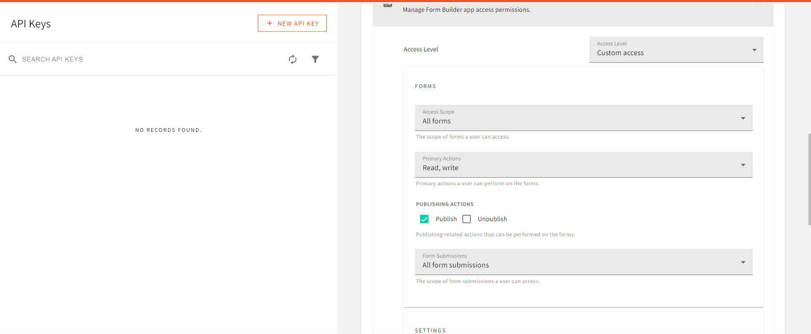

When people build applications or develop products, they may be required to get customer feedback on the product to determine areas for improvement. This feedback are usually obtained through online on-site forms. These form can be used to gauge customer interest and expectations.

In this article, readers will learn how to create a marketing site with form features using Webiny to store and manage user responses.

## What is a Marketing Website?

A marketing site refers to a website which creates consumer awareness about products or brands, to prospective customers. It aims to establish an image by informing the audience on what is being offered, its capabilities, and what makes it stand out compared to similar services. Marketing sites help businesses stand out among similar competitors in the market.

## Building a Marketing Website

### Front-end setup

To build the front end of our application, we will be using React.js along with Tailwind CSS and Font awesome icons. We can install and set these up as follows:

- To install React, open up a directory of your choice on your local machine. Start a command line interface in the chosen directory, and input the following commands in it:

```bash
npx create-react-app webiny-marketingagency
```

This command sets up a React application for us with all necessary dependencies installed.

- To add the Font Awesome icon dependency, enter the following command in the CLI:

```bash
npm i --save @fortawesome/fontawesome-svg-core @fortawesome/free-solid-svg-icons @fortawesome/react-fontawesome
```

- To install Tailwind CSS, enter the following command followed by an enter key:

```bash
npm install -D tailwindcss postcss autoprefixer
npx tailwindcss init -p
```

Once the installation is complete, open up the project folder in your code editor and modify the `tailwind.config.js` file as shown below:

```jsx
module.exports = {
  content: [
    "./src/**/*.{js,jsx,ts,tsx}",
  ],
  theme: {
    extend: {},
  },
  plugins: [],
}

```

The last step is to add the Tailwind class directives to our `index.css` file:

```css
@tailwind base;
@tailwind components;
@tailwind utilities;

```

## Creating a Landing Section

For easier understanding, we will split our site sections into components and import them when required. In the `src` directory, create a new folder called `components`. In this folder, create a file `Landing.jsx`. This will serve as the component for our landing section and will contain the following code:

```jsx
import { React, useState } from "react";
import landingimg from "./landing.jpg";
const Landing = () => {
  const [open, isOpen] = useState(false);
  return (
    <div>
      {/* Navigation Section*/}
      <nav>
        <div className="backdrop-blur-0 bg-[#fff7f1] md:bg-transparent md:backdrop-blur-md w-full px-[50px] md:px-[40px] lg:px-[60px] z-10 fixed top-0">
          <span className="pt-[10px] flex justify-between items-center">
            {/* navigation menu component */}
            <a
              href="#home"
              className="flex justify-center items-center w-max hover:cursor-pointer"
            >
              {/* hero container */}
              <p className="hover:text-blue-400 ml-3 text-[15px] md:text-[18px] font-bold ">
                Markit Agency
              </p>
            </a>
            {/* Nav options */}
            <ul className="gap-[20px] hidden md:flex md:items-center">
              <a
                href="#about"
                className={`hover:cursor-pointer hover:text-blue-400 text-[13px]`}
              >
                About Us
              </a>
              <a
                href="#work"
                className={`hover:cursor-pointer hover:text-blue-400 text-[13px]`}
              >
                Work
              </a>
              <a
                href="#contact"
                className={`hover:cursor-pointer text-white text-[13px] bg-blue-400 px-3 py-1 rounded-sm`}
              >
                Contact us
              </a>
            </ul>
            {/* Navigation Section dor smaller devices*/}
            <span className="flex md:hidden">
              <button
                onClick={() => {
                  isOpen(!open);
                }}
                className="kgb inline-flex items-center justify-center p-2 rounded-md text-blue-600 hover:opacity-80 outline-none focus:ring-offset-2 focus:ring-offset-white focus:ring-white"
                arial-aria-controls="mobile-menu"
                arial-aria-expanded="false"
              >
                {/* Hamburger icon for small screens*/}
                <span className="sr-only">Main menu</span>
                {!open ? (
                  <svg
                    className="block h-6 w-6"
                    xmlns="http:www.w3.org/2000/svg"
                    fill="none"
                    viewBox="0 0 24 24"
                    stroke="currentColor"
                    arial-hidden="true"
                  >
                    <path
                      strokeLinecap="round"
                      strokeLinejoin="round"
                      strokeWidth="2"
                      d="M4 6h16M4 12h16M4 18h16"
                    />
                  </svg>
                ) : (
                  <svg
                    className="block h-6 w-6"
                    xmlns="http:www.w3.org/2000/svg"
                    fill="none"
                    viewBox="0 0 24 24"
                    stroke="currentColor"
                    arial-hidden="true"
                  >
                    <path
                      strokeLinecap="round"
                      strokeLinejoin="round"
                      strokeWidth="2"
                      d="M6 18L18 6M6 6l12 12"
                    />
                  </svg>
                )}
              </button>
            </span>
          </span>
          {/* Navigation Section for small screens*/}
          {open ? (
            <nav className="md:hidden id=mobile-menu">
              <ul className="bg-[#fff7f1] opacity-90 px-2 pt-2 pb-3 space-y-1 sm:px-3 flex justify-center items-end flex-col">
                <a
                  href="#about"
                  className={`cursor-pointer text-blue-500 block px-3 py-2 rounded-md text-base font-medium`}
                  onClick={() => {
                    isOpen(!open);
                  }}
                >
                  About Us
                </a>
                <a
                  href="#work"
                  className="cursor-pointer text-blue-500 transition-all block px-3 py-2 rounded-md text-base font-medium"
                  onClick={() => {
                    isOpen(!open);
                  }}
                >
                  Work
                </a>
                <a
                  href="#contact"
                  className="cursor-pointer text-black transition-all block px-3 py-2 rounded-md text-base font-medium hover:text-white text-[13px] bg-blue-400 "
                  onClick={() => {
                    isOpen(!open);
                  }}
                >
                  Get in touch
                </a>
              </ul>
            </nav>
          ) : (
            <div></div>
          )}
        </div>
      </nav>
      {/* Landing Section*/}
      <div
        className="h-screen flex justify-center items-center flex-col md:flex-row "
        id="home"
      >
        <div className="w-full md:w-1/2 pl-6 ">
          {/* left section */}
          <h1 className="font-bold text-3xl mb-6 ">
            Grow with A Digital
            <br />
            Marketing Agency You
            <br /> Can Trust?
          </h1>
          <p className="text-[12px] text-slate-600 mb-6">
            Choose Markit Agency as your digital marketing agency and propel you
            <br />
            business to greater heights with our award-winning marketing
            <br /> innovations and technologies.
          </p>
          <a
            href="#contact"
            className="text-[14px] bg-blue-500 px-3 py-1 rounded-sm hover:cursor-pointer text-white font-medium "
          >
            Get in Touch
          </a>
        </div>
        <div className=" mt-3 md:mt-0 w-full md:w-1/2">
          {/* right section */}
          
        </div>
      </div>
    </div>
  );
};
export default Landing;

```

Here, we have our Landing section layout, containing our navigation bar, along with the landing text and image.
To get our output, we just need to import this component and return it in our `App.js` component:

```jsx
import { React, useState } from "react";
import Landing from "./components/Landing";
function App() {
  return (
    <div className="bg-[#fff7f1]">
      <Landing/>
    </div>
  );
}
export default App;

```

Finally, add the following styles to `App.css`:

```css
html{
    scroll-behavior: smooth;
}
body {
   font-family: Montserrat;
}

```

With this, if we run our application with the `npm start` command and open up the result in our browser, we will get the following result:


All images used here can be found in the source code at the end of this article.

## Adding an About Us section

With the landing section of our site done, the next section we will be adding is an “about” section. To do this, we will create a new file in our `components` directory called `About.jsx` and add the following code to it:

```jsx
import React from "react";
import aboutimg from "./aboutimg.jpg";
const About = () => {
  return (
    <div
      className="h-screen flex justify-center items-center flex-col-reverse md:flex-row-reverse"
      id="about"
    >
      <div className="w-full md:w-1/2 pl-10 ">
        {/* left section */}
        <h1 className="font-semibold text-3xl mb-6 ">
          Work With Us,
          <br />
          Not For Us.
        </h1>
        <p className="text-[12px] text-slate-600 mb-6">
          There are hundreds of definition to marketing out there.
          <br />
          But we here at Markit understand that marketing is what happens
          <br />
          in every company: finding new solutions to customer needs and
          launching new products.
        </p>
        <a
          href="#contact"
          className="text-[14px] underline rounded-sm hover:cursor-pointer text-slate-300 font-medium "
        >
          Learn More
        </a>
      </div>
      <div className=" mb-3 md:mb-0 w-4/5 md:w-1/2 relative">
        {/* right section */}
        
        <div className="absolute bottom-[-30px] left-[50%] rotate-45 translate-x-[-50%] h-16 w-16 rounded-[8px] bg-blue-200"></div>
      </div>
    </div>
  );
};
export default About;

```

Also, we will have to import and return the `About` component like we did the `Landing`, i our `app.js` file. The above code block will produce a result similar to the result below:


## Creating a Work Section

The third section of our marketing agency site will be a section showcasing the types of services offered by the agency. For this, create a new file in the `components` folder called `Works.jsx`. In this  file, add the following code:

```jsx
import React from "react";
// Imports for fontawesome icons
import { FontAwesomeIcon } from "@fortawesome/react-fontawesome";
import {
  faSearch,
  faPerson,
  faCircle,
  faClipboardUser,
} from "@fortawesome/free-solid-svg-icons";

const Works = () => {
  return (
    <div
      className="bg-blue-200 min-h-screen flex flex-col justify-center items-center"
      id="work"
    >
      {/* Works section */}
      <h1 className="text-center mt-12 mb-8 font-bold text-2xl ">
        What We Do?
      </h1>
      <div className="grid grid-cols-1  px-5 md:px-0 md:grid-cols-2 gap-8 my-10 ">
        <div className="bg-blue-500 rounded-md px-10 py-5 text-white max-w-[400px] ">
          <div className="p-2 rounded-full bg-black w-8 h-8 flex justify-center items-center mb-4 ">
            {/* icon container */}
            <FontAwesomeIcon icon={faSearch} />
          </div>
          <h1 className="font-semibold text-2xl mb-2 ">
            Research and Discovery
          </h1>
          <p className="text-[10px] text-black mb-6">
            Carry out market research and survey using our numerous tools. Make
            use of our web analytics and data for your research purpose.
            <br />
            Stand out among your peer marketers, use our logistic data to boost
            your business presence.
          </p>
          <a
            href="#contact"
            className="text-[12px] underline rounded-sm hover:cursor-pointer text-slate-300 font-medium "
          >
            Learn More
          </a>
        </div>
        <div className="bg-blue-500 rounded-md px-10 py-5 text-white max-w-[400px] ">
          <div className="p-2 rounded-full bg-black w-8 h-8 flex justify-center items-center mb-4 ">
            {/* icon container */}
            <FontAwesomeIcon icon={faCircle} />
          </div>
          <h1 className="font-semibold text-2xl mb-2 ">Marketing Strategy</h1>
          <p className="text-[10px] text-black mb-6">
            Carry out market research and survey using our numerous tools. Make
            use of our web analytics and data for your research purpose.
            <br />
            Stand out among your peer marketers, use our logistic data to boost
            your business presence.
          </p>
          <a
            href="#contact"
            className="text-[12px] underline rounded-sm hover:cursor-pointer text-slate-300 font-medium "
          >
            Learn More
          </a>
        </div>
        <div className="bg-blue-500 rounded-md px-10 py-5 text-white max-w-[400px] ">
          <div className="p-2 rounded-full bg-black w-8 h-8 flex justify-center items-center mb-4 ">
            {/* icon container */}
            <FontAwesomeIcon icon={faClipboardUser} />
          </div>
          <h1 className="font-semibold text-2xl mb-2 ">Project Management</h1>
          <p className="text-[10px] text-black mb-6">
            Carry out market research and survey using our numerous tools. Make
            use of our web analytics and data for your research purpose.
            <br />
            Stand out among your peer marketers, use our logistic data to boost
            your business presence.
          </p>
          <a
            href="#contact"
            className="text-[12px] underline rounded-sm hover:cursor-pointer text-slate-300 font-medium "
          >
            Learn More
          </a>
        </div>
        <div className="bg-blue-500 rounded-md px-10 py-5 text-white max-w-[400px] ">
          <div className="p-2 rounded-full bg-black w-8 h-8 flex justify-center items-center mb-4 ">
            {/* icon container */}
            <FontAwesomeIcon icon={faPerson} />
          </div>
          <h1 className="font-semibold text-2xl mb-2 ">
            Consultant Specialist
          </h1>
          <p className="text-[10px] text-black mb-6">
            Carry out market research and survey using our numerous tools. Make
            use of our web analytics and data for your research purpose.
            <br />
            Stand out among your peer marketers, use our logistic data to boost
            your business presence.
          </p>
          <a
            href="#contact"
            className="text-[12px] underline rounded-sm hover:cursor-pointer text-slate-300 font-medium "
          >
            Learn More
          </a>
        </div>
      </div>
    </div>
  );
};
export default Works;
```

With this, the last feature remaining for our marketing website is our contact form, which we will start working on in the next section.

## Setting up Webiny CMS

You can access your own Webiny instance by completing the form here: [https://webiny.typeform.com/to/VYffkZlR](https://webiny.typeform.com/to/VYffkZlR). Otherwise, To make use of your own instance of Webiny CMS, here are the following steps:

First, you will require an AWS account. If you do not already have one, you can make use of [this guide](https://www.webiny.com/docs/infrastructure/aws/configure-aws-credentials) to create one. After creating an AWS account and [setting up the AWS credentials on your device](https://docs.aws.amazon.com/cli/latest/userguide/cli-configure-files.html), you can create a new Webiny project by entering the following command in a CLI environment:

```bash
npx create-webiny-project formcms
```

Once the installation is complete, we will deploy the Webiny project with the following command:

```bash
yarn webiny deploy
```

After deployment, we get a preview URL that directs us to the admin area of our application. When deploying for a new project, we get a form requesting us to create a new admin account. Create a new user account and sign in with your account credentials on the next page. Follow the steps to complete the CMS setup, enter the application name in the `page builder` section and click `install page builder` to finalize the setup.

## Creating a Form

Webiny CMS features a no-code form builder with simple drag-and-drop functions, which we will be using to build our user form for our application. After creating a user account on the Webiny CMS, we will be directed to a landing page with options to create `a new page`, `form`, and `content Model`. Here, select `create a new form`:


On the new form that opens up, click on `create form`, enter in the name of your form and click on `create`.


Here, I have created a form called `markitform`. On this new page we can define and create the fields that will be contained in our form. Our form will contain two fields: an email address field and a message field. To insert a field, we can either create and add a custom field, or we can drag and drop it from the list of available options. Create an email address field as demonstrated in the GIF below:


For the message field, we will create and add a custom field:


To set a custom message to be displayed to users upon submitting the form, click on the `cog-wheel` icon next to the `Publish` button:


In the new window, enter your message in the `success message field`. Click on the `Save settings`  button, then the `publish` button at the top right-corner to save the newly created form.

## Connecting our Application to Webiny

To establish a connection between Webiny CMS and our application, we will require an API key as an authentication credential. This can be obtained from the **access management** section of the settings tab, found in the left navigation window of the dashboard. Fill in the form to create a new API key, in the content section select **all locales**, and in the form builder dropdown, choose **Custom Access**. Enter the following details in the provided fields:



In the access-scope, select **all forms**,  in the form submission choose **all forms**. Finally, allow **Read and write** actions, then click on the **save API key** button at the bottom of the page and copy the generated token.

## Connecting our Application to Webiny

For our Webiny CMS access token, we will create a `.env` file in our project directory and key in the following:

```bash
REACT_APP_ACCESS_TOKEN =<your access token here>
REACT_APP_WEBINY_URL =<your Webiny URL instance here>

```

To get the Webiny instance URL, you can use the `yarn webiny info` command in the CLI of the Webiny project folder. The Webiny URL we will be using is the `Main GraphQL API URL`.

To perform API requests between the CMS and our application, we will be making use of the [Apollo](https://www.apollographql.com/) client. This can be installed with the following CLI command:

```bash
npm install @apollo/client graphql
```

With Apollo client installed,  we can proceed to initialize this dependency in the `index.js` file of our project directory:

```jsx
import { ApolloClient, InMemoryCache, ApolloProvider, gql } from '@apollo/client';

const client = new ApolloClient({
  uri: process.env.REACT_APP_WEBINY_URL,
  cache: new InMemoryCache(),
  headers: {
      Authorization: `Bearer ${process.env.REACT_APP_ACCESS_TOKEN}`,
    },
});
```

Next, we wrap the `App` component with the `ApolloProvider`:

```javascript
<ApolloProvider client={client}>
  <App />
</ApolloProvider>

```

## Creating a User Form

To create a form for our users, create a new file `Form.jsx` in the `components` directory and add the following code to it:

```jsx
import { React, useState } from "react";
const Form = () => {
  const [mail, setMail] = useState("");
  const [message, setMessage] = useState("");
  return (
    <div className="flex w-full justify-center items-center h-screen " id="contact" >
      <div className="w-4/5 flex flex-col justify-center  ">
        <div className="mb-20 ">
          <h1 className="font-semibold mb-6 text-[50px] ">
            Interested in getting your business out there?
          </h1>
          <p>Send us a message</p>
        </div>
        <div className="flex flex-col gap-8  text-white ">
          <input
            className="bg-slate-900 py-4 w-3/4 px-3 rounded-md  "
            placeholder="Your Email"
            type="email"
            value={mail}
            onChange={(e) => setMail(e.target.value)}
          />
          <textarea
            className="bg-slate-900 py-4 w-3/4 px-3 rounded-md  "
            rows={12}
            cols={12}
            placeholder="Your Message"
            value={message}
            onChange={(e) => setMessage(e.target.value)}
          />
          <button className="bg-slate-900 py-4 w-[270px] px-3 rounded-md  ">
            Send
          </button>
        </div>
      </div>
    </div>
  );
};
export default Form;

```

## Contact Form Submit Feature

In this step, we will submit data to our Webiny Form Builder entries so that you will be able to see the forms. In this example code we have sent the mutation on the front end. This is not a recommended approach since it will expose your API endpoint and token. If you wish to use this method please use a server-side function to handle the data submission to Webiny.

To handle the submission of the contact form, make the following additions to `Contact.jsx`:

- First, create an import for the Apollo client dependency:

```jsx
import { useQuery, gql, useMutation } from "@apollo/client";
```

- Next, we will require a Revision ID, which can be obtained by making a `query` with apollo client to the CMS with the following:

```jsx
const GET_ID = gql query { formBuilder { listForms { data { id formId name } } } } ;
const { error, data } = useQuery(GET_ID);

console.log(data);
```

Copy and save the id you obtain in the response.

- Handling form submission event: To handle form submission, make the following changes in `Form.jsx`.

First, we will create a mutation to post form data:

```jsx
const SEND_FORM = gql`
  mutation CreateFormSubmission($revision: ID!, $data: JSON!) {
    formBuilder {
      createFormSubmission(
        revision: $revision
        data: $data
      ) {
        data {
          id
          data
        }
      }
    }
  }
`;
const [sendform] = useMutation(SEND_FORM)

```

Then, we will pass data to the mutation, from the `send` button:

```jsx
<button
  className="bg-slate-900 py-4 w-[270px] px-3 rounded-md  "
  onClick={() => {
    sendform({
      variables: {
        revision: id,
        data: { email: mail, message: message },
      },
    });
  }}
>
  Send
</button>

```

With this, when the **Send** button is clicked on, the `mail` and `message` from the text field along with the `id` are passed on to the mutation which sends a post request to the CMS with the new form submission. Now, let’s try out our form submission feature:


If we click on the `send` button and check the form submissions section of our Webiny form builder, we can see the submitted data:


## Conclusion

In this article, we learned about the Webiny CMS form builder, and how we can set up and manage form submissions from a client-side application, using a use case of a marketing site built with React.js. With the Webiny Form builder, you can easily manage user responses seamlessly, as its fast and reliable.


**Full source code:** https://github.com/webiny/write-with-webiny/tree/main/tutorials/react-marketingsite

---

This article was written by a contributor to the Write with Webiny program. Would you like to write a technical article like this and get paid to do so? [Check out the Write with Webiny GitHub repo](https://github.com/webiny/write-with-webiny/).