In this tutorial, we will learn how to build and deploy a news app with Next.js and Webiny. This tutorial is divided into two parts. In the first part, we will create a Webiny project, build our model then add content and finally fetch and display in Next.js frontend. In the second part, we will get and store the data from a [NewsAPI](https://newsapi.org/) into Webiny and finally deploy our news application on Netlify. Below is a preview of what we will be building in this tutorial.

<video width="800px" height="auto" controls autoplay>
  <source src="./assets/build-news-app-with-webiny-and-nextjs-1-of-2/how_to_build_and_deploy_a_news_app_webiny.mp4" type="video/mp4" />
</video>

### Prerequisites

1. Node.js >=18
2. yarn ^1.22.0 || >=2
3. [AWS account and User credentials](https://www.webiny.com/docs/infrastructure/aws/configure-aws-credentials)
4. Basic understanding of Next.js and GraphQL

### Getting Started with Webiny

Webiny [headless CMS](https://www.webiny.com/enterprise-serverless-cms/headless-cms/) is GraphQL based, with a powerful content modeling feature and it’s serverless, so optimized for scalability by default.

The first step is to create a new Webiny application using the command below:

```bash
npx create-webiny-project my-new-project
```

Upon executing the command you will be prompted to choose an AWS region and the database of your project for deployment. We will be using **DynamoDB.** 

Once the project has been created, open and deploy it with the command below:

```bash
cd my-new-project && yarn webiny deploy
```

This deploy command downloads the necessary dependencies and automatically deploys the application to your AWS account with the list of URLs for the admin panel, website and GraphQL. More details on [Webiny installation can be found here](https://www.webiny.com/docs/get-started/install-webiny).

Once the installation is done, open admin panel to create a new admin user. 

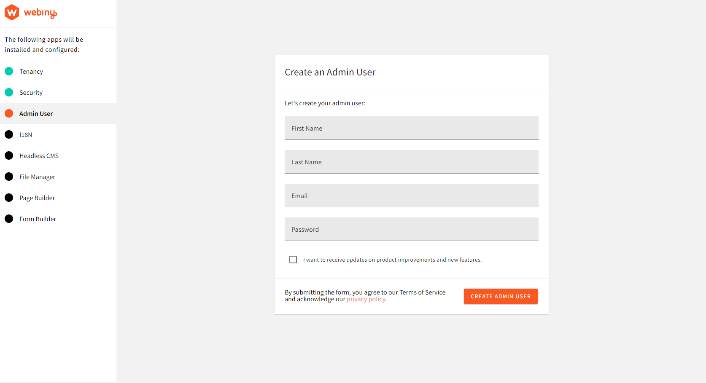

Once these setup is done, you will be redirected to the dashboard.

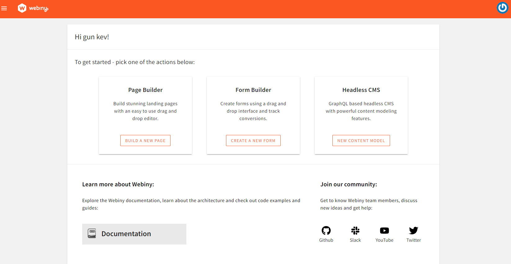

### Creating the News App Content Models

From the welcome dashboard, click on **New Content Model** in the Headless CMS to create a new content model. 

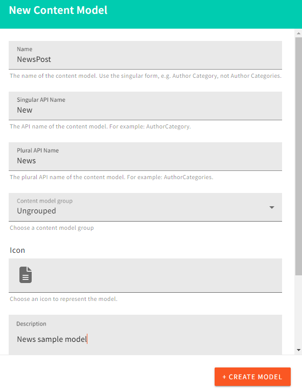

We will create a **NewsPost** in this tutorial with 6 fields

- **Title** field for the title of the News
- **CoverImage** for the image cover of the News
- **Author** which will be the author of the News’post
- **Excerpt** field which is an extract portion of the News’s content
- **Content** field will contain the body of the News
- Finally the **SlugUrl** of the News’s post

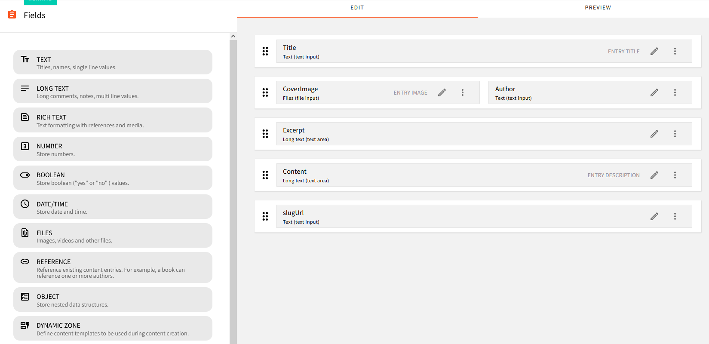

### Seeding the Database

For the first part of this tutorial, we will be creating News posts and publishing them from the dashboard while in the second part, we will fetch the **data from an external API like NewsAPI and populate it in Webiny with Axios** then display it in the frontend

From the menu, click on NewsPost(it corresponds to the name of your post model) under Headless CMS and click on the  **New Entry**. button at the top right corner of the windows

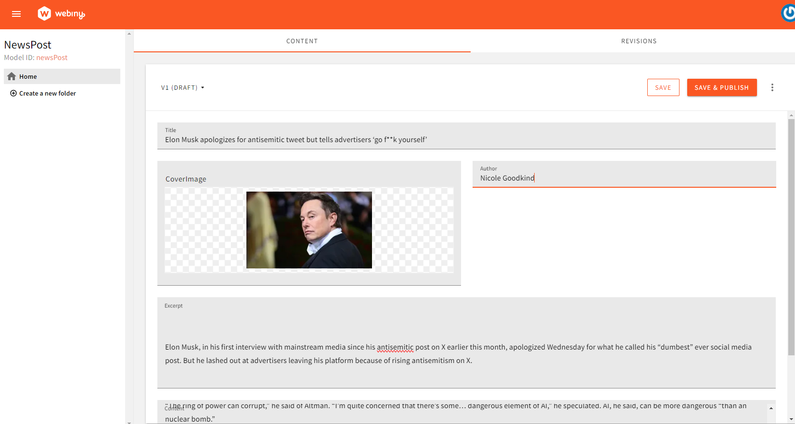

In this tutorial we have added two entries for demonstration purposes, you can add as many as you want.

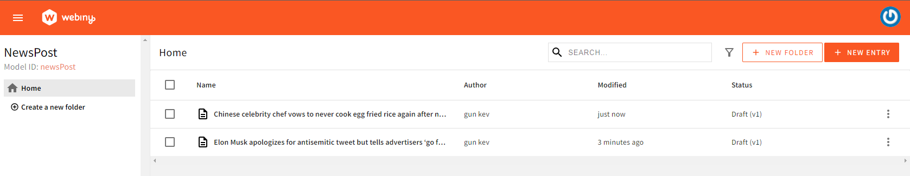

### Testing Request with GraphQL

We have created some news entries and now will like to test some requests in the GraphQL Playground. Head to the Menu and select API Playground to open the playground

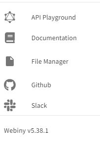

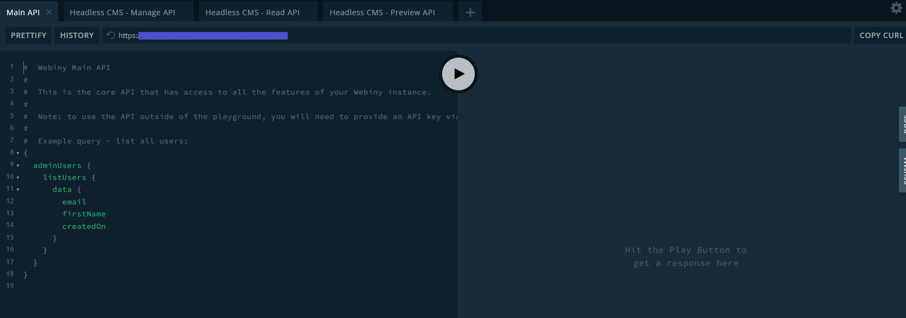

Let’s head on and test some queries to create, list and delete a news post. 

Note that we create, delete or update news posts with the Manage API. From the screenshot above, you can notice 4 types of API, the Main, Manage, Read and Preview APIs. To create, delete or update a post you need to switch to the Manage API and to get or list data you need to switch to the Read API.

**List News GraphQL Query**

```bash
{
  listNews {
    data {
      id
      title
      image
      author
      excerpt
      description
    }
  }
}
```

**Create News GraphQL Query**

```bash
mutation createNew($title:String!, $excerpt:String!, $author:String!, $description:String!, $slugUrl:String!, $image:String!) {
  createNew(data:{title:$title, excerpt:$excerpt, author:$author, description:$description, slugUrl:$slugUrl, image:$image}) {
    data {
      id
      title
      excerpt
      description
      author
      image
    }
  }
}

```

then provide the query variables

```bash
{
  "title": "Create a News post",
  "excerpt":"My post excerpt",
  "description": "My post content",
  "author": "Post author",
  "image": "https://my/imsge/url",
  "slugUrl": "my-slug-post"
}
```

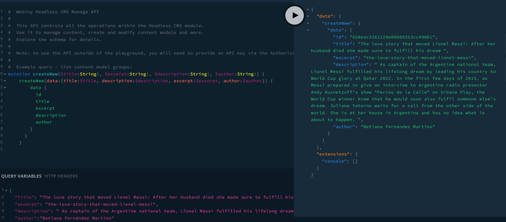

**Publish News GraphQL Query**

```bash
mutation publishNew($id:ID!) {
  publishNew(revision:$id) {
    data{
      id
      title
      excerpt
      description
      author
    }
  }
}
```

**Get an Article by Id**

```jsx
{
  getNew(where: {id:"65685ae65faa250008f67c17#0001"}) {
    data {
      title
      excerpt
      author
    }
  }
}
```

To manage and read data in Webiny we need to create an API key and give access to some services. We will be doing it in this tutorial, but first of all, we need to create a Next.js application which will be used to interact and display posts.

### Creating a Next.js Application

Run the command below to create a brand new Next.js application

```jsx
npx create-next-app@latest
```

You will be prompted to choose the type of Next.js project and other parameters. For this tutorial we are using `src` directory and Tailwind CSS. 

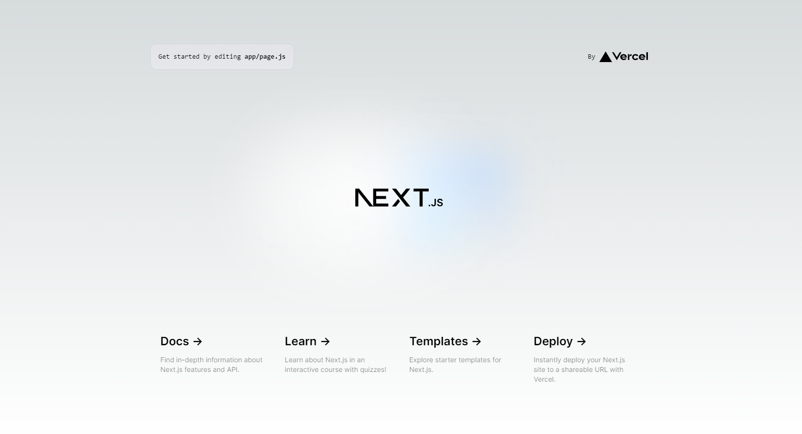

### Installing App dependencies

For this first part, we will only install `moment` used for handling date format with the command below

```bash
yarn add moment
```

### Connecting Webiny to the Next.js App

To communicate with the backend, we need to generate an API key and give access. Head to your Webiny panel, go to **Menu→ Settings→API Keys** and create a **New API Key** then click on **Save API Key.** This will generate a token like in the screenshot below

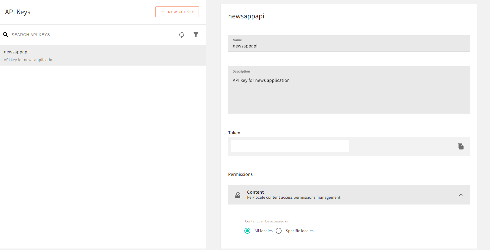

Scroll under the **Permissions** section, and give full access to Content, Page Builder, Security, File Manager and Headless CMS

Note that this is only for demonstration purposes, in a real-life application, you will need to add some restrictions and manage your [access control](https://www.webiny.com/docs/overview/features/access-control)

### Connect with Next.js

In your Next application, create an `env.local` file in the root directory then add your API token

```jsx
NEXT_PUBLIC_WEBINY_API_SECRET=your_access_token 
NEXT_PUBLIC_WEBINY_API_READ_URL=your_read_url 
NEXT_PUBLIC_WEBINY_API_MANAGE_URL=your_manage_url
```

Now we can start interaction with the backend by creating a `fetchAPI` function with two arguments: `query` and `variables`

Create a `app/lib/api.js` file and add the following code

```jsx
async function fetchAPI(query, {variables} = {}) {
  const read = process.env.NEXT_PUBLIC_WEBINY_API_READ_URL;

  const res = await fetch(read, {
    method: "POST",
    headers: {
      "Content-Type": "application/json",
      Authorization: `Bearer ${process.env.NEXT_PUBLIC_WEBINY_API_SECRET}`,
    },
    body: JSON.stringify({
      query,
      variables,
    }),
  });
  const json = await res.json();
  if (json.errors) {
    console.error(json.error);
  }
  return json.data;
}

export async function getAllNews() {
  const news = await fetchAPI(
    `query NewsPost {
       listNews {
        data {
         id
         image
         title
         excerpt
         description
         author
         createdOn
         slugUrl
        }
       }
      }
     `,
    {},
    true
  );
  return news.listNews.data;
}

export async function getNewsBySlug(slug) {
  const getSlug = await fetchAPI(
    `query NewsBySlug($NewGetWhereInput: NewGetWhereInput!) {
      listNews: getNew(where: $NewGetWhereInput) {
        data {
          id
          title
          image
          slugUrl
          excerpt
          createdOn,
          description,
          author
        }
      }
    }`,
    {
      variables: {
        NewGetWhereInput: {
          slugUrl: slug,
        },
      },
    }
  );
  return getSlug.listNews.data;
}
```

The `query` argument receives a query while the `variables` argument receives a JS object used when we need to get dynamic data like getting a specific post. As you have noticed,  we have used the native JS `fetch()`  in the `fetcAPI` to get data rather than a third-party library like Axios which we will discuss in the second part of this tutorial.

We then send the `query` and `variables` to the body and if any error occurs, we catch it in the `if` block.

Now let’s take a look at the first query:

```bash
export async function getAllNews() {
  const news = await fetchAPI(
    `query NewsPost {
       listNews {
        data {
         id
         image
         title
         excerpt
         description
         author
         createdOn
         slugUrl
        }
       }
      }
     `,
    {},
    true
  );
  return news.listNews.data;
}
```

It lists all the News in the default order but you can use the `sort: createOn_DESC` to get the list of News posts in descending order.

As for the second function `getNewsBySlug` :

```jsx
export async function getNewsBySlug(slug) {
  const getSlug = await fetchAPI(
    `query NewsBySlug($NewGetWhereInput: NewGetWhereInput!) {
      listNews: getNew(where: $NewGetWhereInput) {
        data {
          id
          title
          image
          slugUrl
          excerpt
          createdOn,
          description,
          author
        }
      }
    }`,
    {
      variables: {
        NewGetWhereInput: {
          slugUrl: slug,
        },
      },
    }
  );
  return getSlug.listNews.data;
}
```

It receives a `slug` as an argument passed a variable to the function and the `NewsBySlug` query receives the argument `NewGetWhereInput` . We use the  `NewsBySlug` to get a news post by its unique slug.

### Building the Apps Components

**Navbar Component**

In the `src/components/Navbar/Navbar.js` add the following code:

```jsx
import React from "react";
import Link from "next/link";

export default function Navbar() {
  return (
    <nav className="bg-blue-500 py-6 px-10 flex justify-between">
      <h4 className="text-white uppercase font-bold">
        <Link href="/"> News App</Link>
      </h4>
    </nav>
  );
}
```

The piece of code simply creates a navigation with a link to the home page.

**Card News component:**

In the `src/components/Card/Card.js` add the following code:

```jsx
"use client";
import React from "react";
import Link from "next/link";
import Image from "next/image";
let moment = require("moment");

export default function NewsCard({cardData}) {
  return (
    <Link href={`/${cardData.slugUrl}`} passHref>
      <div className="hover:scale-105 hover:transition-transform">
        <Image
          src={cardData.image}
          height={200}
          width={600}
          alt={cardData.slugUrl}
          className="rounded object-cover h-[14rem] w-[30rem]"
          priority
          unoptimized
        />
        <div className="mt-3 mb-3">
          <h1 className="font-bold text-[18px] text-blue-500 capitalize mb-3">
            {cardData.title}
          </h1>
          <h2 className="text-gray-500 text-[14px]">{cardData.excerpt}</h2>
          <div className="mt-3">
            <span className="text-blue-400 capitalize text-[14px]">
              {cardData.author}
            </span>
            ,
            <span className="text-blue-400 capitalize text-[14px] ml-2">
              {moment(cardData.createdOn).format("dddd, MMMM Do YYYY")}
            </span>
          </div>
        </div>
      </div>
    </Link>
  );
}
```

From the code snippet above, we pass the data we get from the API to the components. Notice the use of `moment` to convert the published date into the desired format. We pass the `slugUrl` to the  `Link` component so that it will take the user to the news post on click with the help of the `[slug.js]` that we will discuss in the next section

Now that we have created the main components of our application we can now fetch and display news posts on the home page and 

### Fetch and Display News Post

In your `src/pages/index.js` file, add the code snippet below

```jsx
// "use client";
import {useEffect, useState} from "react";
import NewsCard from "../components/Card/Card";
import {getAllNews} from "../lib/api";
import axiosClient, {addNews, url} from "@/lib/axiosApi";
export default function Home({allNews}) {
  const [news, setNews] = useState(allNews);

  return (
    <main className="md:w-[1000px] mx-auto">
      <p className="text-[20px] p-10">
        A news app is a powerful tool that allows users to stay updated with the
        latest news and information from around the world. With the rapid
        advancement of technology, news apps have become an essential part of
        our daily lives, providing instant access to news articles, videos, and
        other multimedia content . Get the latest news anywhere at any time.
      </p>

      <div className="p-10 grid sm:grid-cols-2 gap-10 grid-cols-1">
        {news.length > 0 ? (
          news.map((newspost, index) => (
            <div key={index}>
              <NewsCard cardData={newspost} />
            </div>
          ))
        ) : (
          <p>There is no post to display...</p>
        )}
      </div>
    </main>
  );
}

// get all news posts
export async function getServerSideProps() {
  let allNews = await getAllNews();
  return {
    props: {allNews},
  };
}
```

We use the data-fetching method `getServerSideProp()` to get the list of news posts from our API and pass it as props. We then pass this prop `allNews` in the `Home()` component and map through the results from the API endpoint, assigning the result to a new array to the `cardData` in the `NewsCard` component.

In case we do not find any news post, we return `There is no post to display...` to the user.

### Creating the Slug Page

The page renders the content of a news post when a user clicks on it. In the `src/pages/[slug.js]` file add the code below:

```jsx
import React from "react";
import {getNewsBySlug} from "@/lib/api";
import Image from "next/image";
let moment = require("moment");

export default function News({
  title,
  image,
  description,
  author,
  slugUrl,
  createdOn,
}) {
  return (
    <div className="md:px-60 md:py-30 p-20">
      <h1 className="text-center text-3xl md:text-5xl font-bold ">{title}</h1>
      <div className="flex justify-center py-10">
        <p className="text-blue-500 capitalize">By {author}</p>,{" "}
        <p className="ml-2 text-gray-500">
          {moment(createdOn).format("MMMM, D, YYYY")}
        </p>
      </div>
      <div className="mt-3 mb-10 flex justify-center">
        <Image
          src={image}
          height={400}
          width={1000}
          alt={slugUrl}
          className="rounded object-cover h-[30rem] w-[55rem] text-center"
          priority
          unoptimized
        />
      </div>
      <div className="text-gray-500">{description}</div>
    </div>
  );
}

// get and populate news post data
export const getServerSideProps = async (context) => {
  console.log("slug", context.query.slug);
  const newsPost = await getNewsBySlug(context.query.slug);
  console.log("newsposts", newsPost);

  return {
    props: {
      ...newsPost,
    },
  };
};
```

The `[slug.js]` uses the same logic as the `index.js`. The only difference is at the level of the `getServerSideProps` where it takes as parameter `context` which is passed to the `getNewsBySlug` function which returns the slug of a news post and finally returns all the content of the news with the help of the JavaScript spread operator `...` and render it in the `News` function.

To run the application, run `yarn dev` in the root directory and open [localhost:3000](localhost:3000) in browser.

### Conclusion & Next Step!

From this article, you should be able to create a new application with Next.js and Webiny by fetching data with the JavaScript `fetch()` function from the backend and displaying it to the end user with Next.js front.
In the [second part of the article](/blog/build-news-app-with-webiny-and-nextjs-2-of-2), we will be working with Axios and NewsAPI. You will learn how to fetch and post data using Axios from NewsAPI.

**Full source code:** https://github.com/webiny/write-with-webiny/tree/main/tutorials/nextjs-news-app

---

This article was written by a contributor to the Write with Webiny program. Would you like to write a technical article like this and get paid to do so? [Check out the Write with Webiny GitHub repo](https://github.com/webiny/write-with-webiny/).