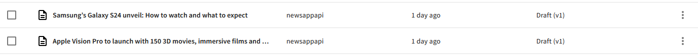
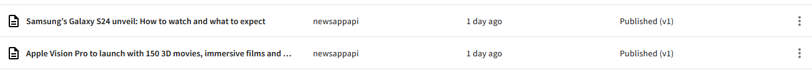
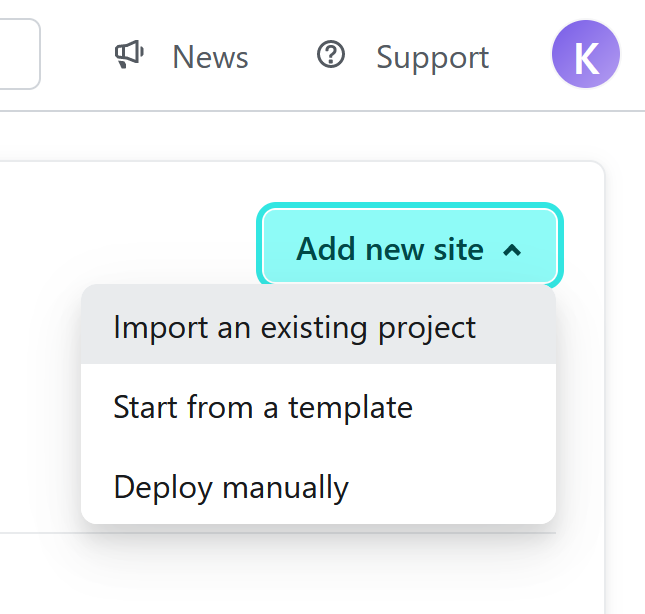
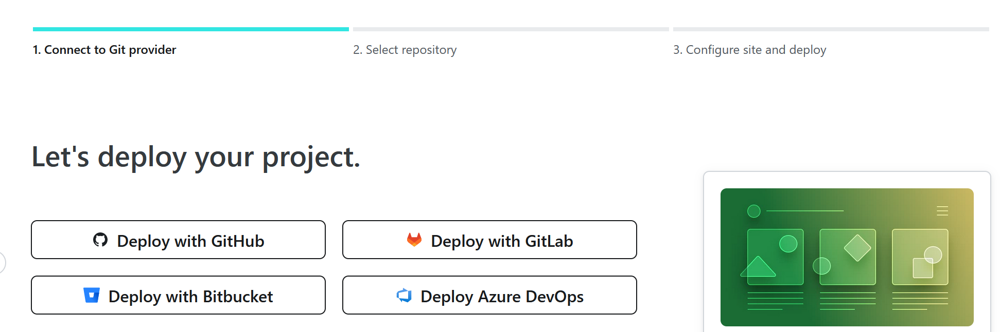
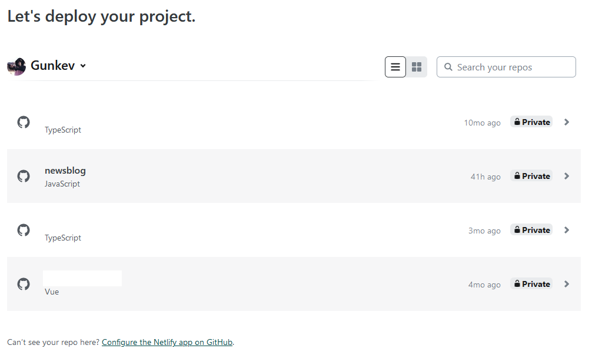
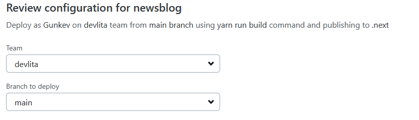
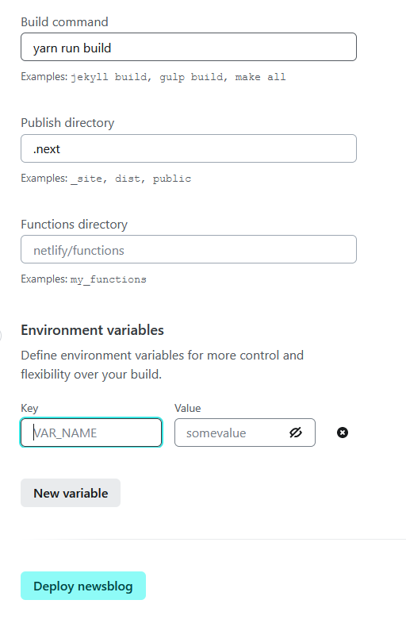

In the [first part of this tutorial](https://www.webiny.com/blog/build-news-app-with-webiny-and-nextjs-1-of-2), we learned how to create a Webiny project, build our model then add content and finally fetch and display in Next.js frontend. In this second part, we will get and store the data from a [NewsAPI](https://newsapi.org/) into Webiny and finally deploy our news application on Netlify. Below is a preview of what we will be building in this tutorial.

<video width="800px" height="auto" controls autoplay>
  <source src="./assets/build-news-app-with-webiny-and-nextjs-1-of-2/how_to_build_and_deploy_a_news_app_webiny.mp4" type="video/mp4" />
</video>

## Prerequisites

- Completion of [first part of this tutorial](https://www.webiny.com/blog/build-news-app-with-webiny-and-nextjs-1-of-2)
- Basic understanding of Next.js
- [NewsAPI](https://newsapi.org/) account for API Key

## Get and Post News Data in Webiny Using Axios and NewsAPI

### Create NewsAPI Account

Create a NewsAPI account and [generate your API Key](https://newsapi.org/account). Once you have your API Key, add it to your `env.local` file:

```bash
NEXT_PUBLIC_NEWS_API=Your News API key
NEXT_PUBLIC_NEWS_API_URL=Your News API Url
```

### Install Axios

Install axios with the code below

```jsx
yarn add axios
```

### Create Axios Client

Create `src/lib/axiosAPI.js` file, import axios and add the following code:

```jsx
import axios from "axios";

const axiosClient = axios.create({
  headers: {
    "Content-Type": "application/json",
    Authorization: `Bearer ${process.env.NEXT_PUBLIC_WEBINY_API_SECRET}`,
  },
});

export default axiosClient;
```

In the header we have the Webiny authorization since we will be making post requests to add data in Webiny and the content type is a JSON application

Now we will create two queries:

Publish News Post

```jsx
const publish = ` 
mutation publishNew($id:ID!) {
  publishNew(revision:$id) {
    data{
      id
      title
      excerpt
      description
      author
    }
  }
} 
`;
```

When you create a post in Webiny, it only saves it in the database. To publish it we need to write a `POST` request and pass the id of the post to be published in the query

Create News Post

```jsx
const create = `
mutation createNew($title:String!, $excerpt:String!, $author:String!, $description:String!, $slugUrl:String!, $image:String!) {
  createNew(data:{title:$title, excerpt:$excerpt, author:$author, description:$description, slugUrl:$slugUrl, image:$image}) {
    data {
      id
      title
      excerpt
      description
      author
      image
    }
  }
}
`;
```

This is the mutation for adding a news post, it takes as an argument the various attributes of a news post: **Title, Excerpt, Author, Description, Image** and **SlugUrl**

Now that we have our queries let’s write two functions to create and publish a news post.

```bash
export const url = `${process.env.NEXT_PUBLIC_NEWS_API_URL}domains=${domain}&pageSize=${pageSize}&from=2024-01-13&to=2024-01-16&apiKey=${process.env.NEXT_PUBLIC_NEWS_API}`;
const cleanSlug = (urls) => {
  urls = urls.replace(/\/$/, "");
  return urls.split("/").pop();
};

export async function addNews(data) {
  await axiosClient({
    url: process.env.NEXT_PUBLIC_WEBINY_API_MANAGE_URL,
    method: "POST",
    data: JSON.stringify({
      query: create,
      variables: {
        title: data.title,
        excerpt: data.description,
        author: data.author,
        description: data.content,
        slugUrl: cleanSlug(data.url),
        image: data.urlToImage,
      },
    }),
  })
    .then((res) => {
       publishNews(res.data);
    })
    .catch((err) => {
      console.log("something happened", err);
    });
}
```

In the code above, we create a post request where we pass our Webiny manage API, the `create` query and our query variables. We get the NewsAPI variables and match the variable of our content model.

This is a sample response of NewsAPI:

```bash
articles": [

    -
    {
        -
        "source": {
            "id": "engadget",
            "name": "Engadget"
        },
        "author": "Karissa Bell",
        "title": "SEC approves bitcoin ETFs (for real this time)",
        "description": "The Securities and Exchange Commission has approved\r\n the applications of 11 spot bitcoin ETFs in a highly anticipated decision that will make it much easier for people to dabble in cryptocurrency investing without directly buying and holding bitcoin. The app…",
        "url": "https://www.engadget.com/sec-approves-bitcoin-etfs-for-real-this-time-224125584.html",
        "urlToImage": "https://s.yimg.com/ny/api/res/1.2/n6iLNJ_9dtK.fT6WAXK1sA--/YXBwaWQ9aGlnaGxhbmRlcjt3PTEyMDA7aD03OTU-/https://s.yimg.com/os/creatr-uploaded-images/2024-01/3edf5140-afdd-11ee-bf7c-7918e1b9d963",
        "publishedAt": "2024-01-10T22:41:25Z",
        "content": "The Securities and Exchange Commission has approved\r\n the applications of 11 spot bitcoin ETFs in a highly anticipated decision that will make it much easier for people to dabble in cryptocurrency in… [+1453 chars]"
    },
]
```

Notice that the `description` of our new model corresponds to the `content` of the NewsAPI, the `image` matches the `urlToImage,` the `excerpt` corresponds to the `description` , and the `slugUrl` matches the `url`

Since the NewsAPI URL comes in the form `[https://tech.com/2024/12/01/my-slug-text](https://tech.com/2024/12/01/my-slug-text)` since we don’t want to store it in the Webiny like that, we will apply the `cleanSlug` function which will only keep the part after the `/` 

The first portion of the `addNews()` simply creates a draft new post in Webiny.



To publish the post we need the `publishNews()` and if any error occurs in the process, we catch it and log it in the console

```bash
export async function publishNews(data) {
  await axiosClient({
    url: process.env.NEXT_PUBLIC_WEBINY_API_MANAGE_URL,
    method: "POST",
    data: JSON.stringify({
      query: publish,
      variables: {
        id: data?.data?.createNew?.data?.id,
      },
    }),
  })
    .then((res) => {
      console.log(res.data);
    })
    .catch((err) => {
      console.log("Something happened", err);
    });
}
```

The `publishNews()` is similar to the `addNews()` excerpt that the `publishNews()` takes in the `publish` query and we only need the `id` of the post to be published.



This is the complete body of the `axiosAPI.js` file 

```jsx
import axios from "axios";

let domain = "techcrunch.com,thenextweb.com";
let pageSize = 10;
export const url = `${process.env.NEXT_PUBLIC_NEWS_API_URL}domains=${domain}&pageSize=${pageSize}&from=2024-01-13&to=2024-01-16&apiKey=${process.env.NEXT_PUBLIC_NEWS_API}`;
const cleanSlug = (urls) => {
  urls = urls.replace(/\/$/, "");
  return urls.split("/").pop();
};

// create axios client
const axiosClient = axios.create({
  headers: {
    "Content-Type": "application/json",
    Authorization: `Bearer ${process.env.NEXT_PUBLIC_WEBINY_API_SECRET}`,
  },
});

export default axiosClient;

// list of queries
const create = `
mutation createNew($title:String!, $excerpt:String!, $author:String!, $description:String!, $slugUrl:String!, $image:String!) {
  createNew(data:{title:$title, excerpt:$excerpt, author:$author, description:$description, slugUrl:$slugUrl, image:$image}) {
    data {
      id
      title
      excerpt
      description
      author
      image
    }
  }
}
`;

const publish = ` 
mutation publishNew($id:ID!) {
  publishNew(revision:$id) {
    data{
      id
      title
      excerpt
      description
      author
    }
  }
} 
`;

// publish news function
export async function publishNews(data) {
  await axiosClient({
    url: process.env.NEXT_PUBLIC_WEBINY_API_MANAGE_URL,
    method: "POST",
    data: JSON.stringify({
      query: publish,
      variables: {
        id: data?.data?.createNew?.data?.id,
      },
    }),
  })
    .then((res) => {
      console.log(res.data);
    })
    .catch((err) => {
      console.log("Something happened", err);
    });
}

// post news function
export async function addNews(data) {
  await axiosClient({
    url: process.env.NEXT_PUBLIC_WEBINY_API_MANAGE_URL,
    method: "POST",
    data: JSON.stringify({
      query: create,
      variables: {
        title: data.title,
        excerpt: data.description,
        author: data.author,
        description: data.content,
        slugUrl: cleanSlug(data.url),
        image: data.urlToImage,
      },
    }),
  })
    .then((res) => {
       publishNews(res.data);
    })
    .catch((err) => {
      console.log("something happened", err);
    });
}
```

Finally, we will add the following code to our `index.js`

```bash
import {useEffect, useState} from "react";
import axiosClient, {url, addNews} from "@/lib/axiosApi";
const [data, setData] = useState();

  useEffect(() => {
    axiosClient({
      url,
      method: "GET",
    })
      .then((response) => {
        console.clear();
        setData(response.data);
        response.data?.articles?.map((item) => {
           addNews(item);
        });
      })
      .catch((err) => {
        console.log(err);
      });
  }, []);
```

Here we pass the NewsAPI URL  in Axios to get the list of news posts, set the data then map the item in the NewsAPI response to the `addNews()` 

From Here our application should be ready for deployment. We will be deploying on Netlify. So you need to create a Git repository and push your code on that repository because we will be using it for deployment. If you don’t know how to push a code on GitHub you can follow [this tutorial](https://www.theserverside.com/blog/Coffee-Talk-Java-News-Stories-and-Opinions/How-to-push-an-existing-project-to-GitHub)

## Deploying on Netlify

[Create an account](https://app.netlify.com/signup) on Netlify or [Login](https://app.netlify.com/login), go to the **Sites** menu click on **Add new site→Import an Existing project**



On the next page, select **Deploy with GitHub**



NB: You may be prompted to authorize [Netlify to access your GitHub repo](https://docs.netlify.com/git/repo-permissions-linking/) or Configure the app on GitHub



Here you select the **newsblog** repo, select the team and branch to deploy



Add the build command, public directory and finally our environment variables and click on **Deploy newsblog**



Wait till the deployment terminates and navigate to the URL to see your application.

This is the [News App](https://starlit-pegasus-cc1650.netlify.app/) we built and deployed and you can also check the GitHub repo to view the full code source

## Conclusion

In this tutorial, we successfully created and deployed a news application using Axios, Webiny, and Next.js. In the [first part of this tutorial](https://www.webiny.com/blog/build-news-app-with-webiny-and-nextjs-1-of-2), we illustrated the process of setting up a Webiny project and a Next.js application, followed by fetching and displaying news data. In this second part, we delved into retrieving and posting news data from an external API via Axios, culminating in the deployment on Netlify. As a supplementary challenge, consider incorporating a search functionality for news posts or implementing pagination, allowing for the display of 10-20 news posts per page. [This article](https://www.webiny.com/blog/implement-pagination-webiny-headless-cms-react) provides insights into adding pagination.

**Full source code:** https://github.com/webiny/write-with-webiny/tree/main/tutorials/nextjs-news-app

---

This article was written by a contributor to the Write with Webiny program. Would you like to write a technical article like this and get paid to do so? [Check out the Write with Webiny GitHub repo](https://github.com/webiny/write-with-webiny/).
