**Building a notes app with Webiny Headless CMS and Next.js gives you the flexibility to decouple your backend from the frontend. This way, you get the best of both worlds. A highly scalable and secure backend content management application, and at the same time the advantage of choosing the best frontend platform to channel your application to your users.**

## What is Webiny?

Webiny is an open-source, developer-friendly serverless CMS powered by modern tools and technologies such as Node.js, React and a GraphQL API. It also gives you the flexibility to integrate with other tools like Gatsby, Next.js and Astro. Webiny helps you engineer, build and deploy applications on top of the serverless infrastructure. [Check this guide to understand its unique features](https://www.webiny.com/why-webiny/).

Next.js is a React-based frontend web framework. It allows you to perform server-side rendering (SSR) operations which keep API keys safe from prying eyes. It can also generate pages when the site is built using static rendering.

In this guide, we will build a Webiny content model for a notes app. We will then consume this content using the Next.js framework. So let’s dive in!

## Prerequisites

To follow along with this tutorial, ensure you have the following requirements ready:

- Node.js v14 installed on your computer.
- AWS (Amazon Web Services) developer account.
- A Hosted Webiny project on AWS. [Check this guide and learn how to create and deploy a new Webiny project to your AWS account](https://www.webiny.com/docs/get-started/install-webiny).
 - Basic knowledge of working with Next.js.

## Setting Up the Notes App Content Model

A model defines the structure of the data that your application will consume. Each application has a different content model. Here, we need to set up the primary inputs that a Note app should have.

From your AWS deployed Webiny project, head over to the Webiny Admin dashboard page. This guide is creating a Headless Webiny app. Click the **Headless CMS** card, and set up a new **New Content Model**.


On the resulting page, click on **New Model** to create the Notes model:


Type in the model name and the description on the resulting pop-up and create the model:

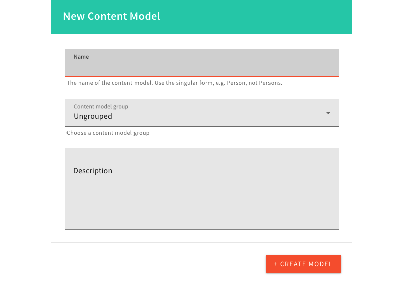

Once you have created the model, you will be directed to a fields page to insert the relevant fields/content:

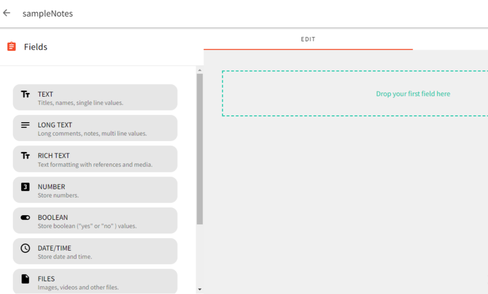

In this case, we will use two fields to create a Note: title and description. Therefore, drag the text field from the left to the right to create the title page. Do the same for the description field.

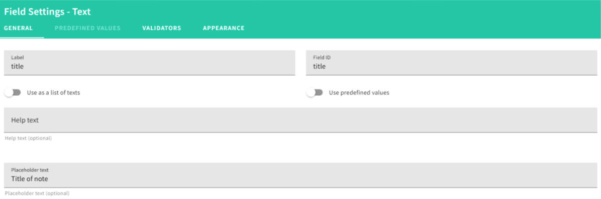

You can sort the fields by simply dragging them appropriately:

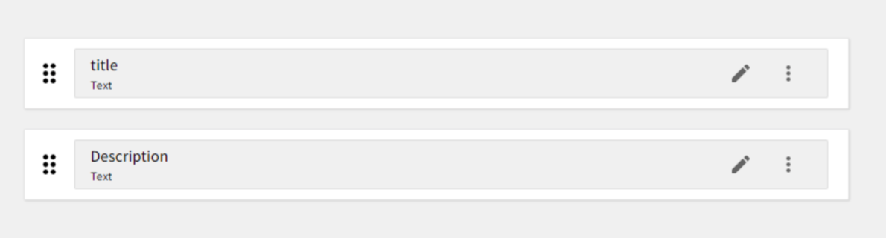

Once you have added the relevant fields, click the Save button on the top right. The resulting page will have your recently created model listed:

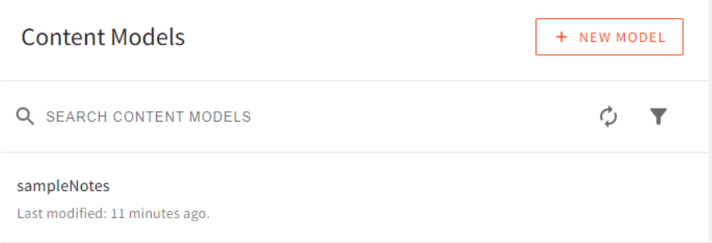

## Interacting with the Created Notes App Model

Let’s test if this model works as expected by feeding in a note record to the Model.

To insert data in the recently created model, we will do it from the Webiny API GraphQL Playground. Go ahead and launch the API Playground:

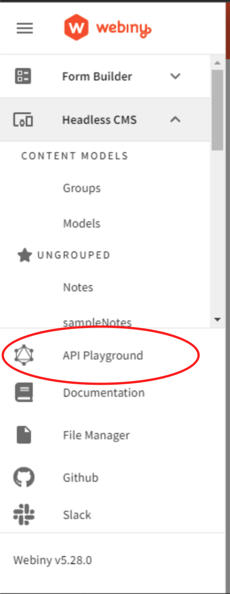

Then click on API Playground. You will be presented with a GraphQL API Playground as such:

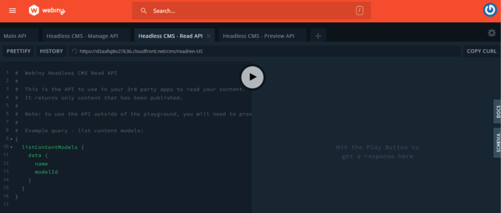

We will run the first query in this playground to check and test the model. Click on the Read API tab. On the left pane, write the following GraphQL query:

```graphql
query listSampleNotes {
  listSampleNotes {
   data {
    id
    title
    description
   }
  }
}
```
Ensure that you comment on any other pre-existing query and then hit the play button. The results on the right pane should be similar to:

```json
{
  "data": {
   "listSampleNotes": {
    "data": []
   }
  },
  "extensions": {
   "console": []
  }
}
```

The data array is empty because we have not added any sample notes yet.

To create a sample note, click on the Manage API tab and add the following GraphQL mutation:

```graphql
mutation createSampleNote($title:String!,$description:String!){
  createSampleNotes(data:{title:$title,description:$description}){
   data {
    id
    title
    description
    createdOn
   }
  }
}
```
From above, the title and the description are variables that will be supplied from the query variables section. Click on the query variables section and add the data:

```json
{
  "title":"My first Note",
  "description": "My first note is awesome."
}
```

Ensure you have commented on any other mutation on the pane, and then hit the play button.
On the right pane, you will get a similar result as such:

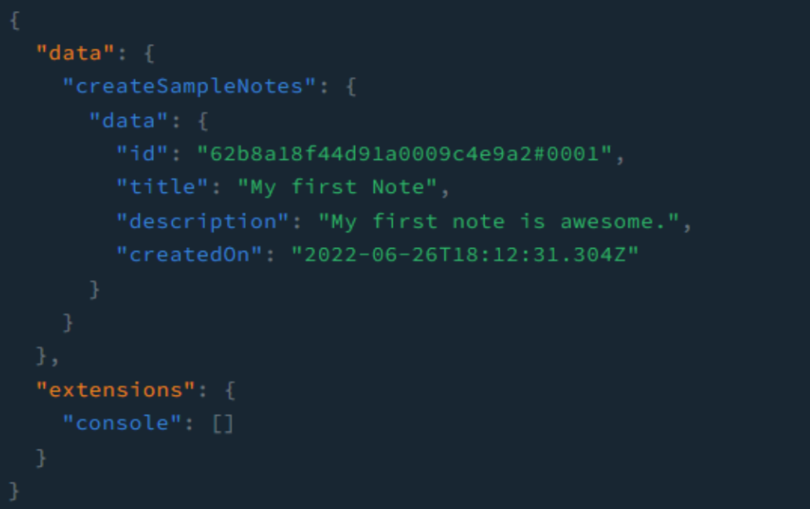

At this stage, the note created is on the preview. It won't be accessed until it is published. To check it out, click on the Preview API tab and add the below query on the left pane:

```graphql
query getSampleNotes {
  listSampleNotes {
   data{
    id
    title
    description
   }
  }
}
```

Ensure that any other query on the pane is commented on, and then hit the play button. On the right pane, you should get the recently created note as below:

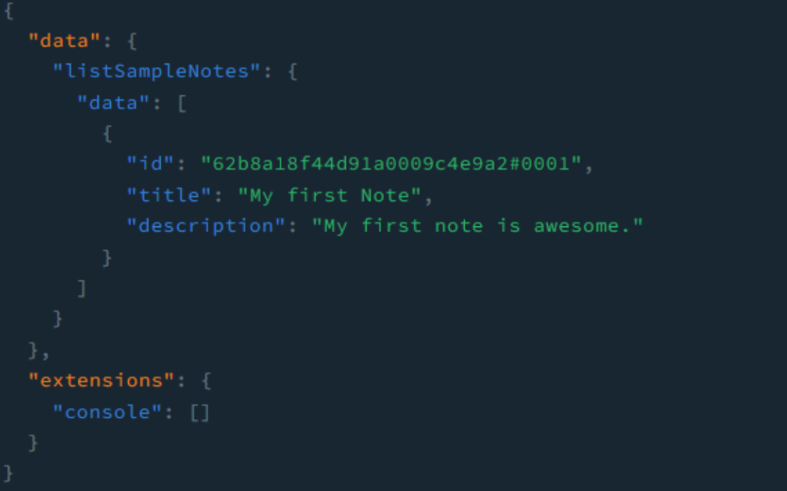

The next step is to publish it. Switch to the **Manage API** tab. On the left pane, add the following mutation:

```graphql
mutation publishSampleNote($id:ID!){
  publishSampleNotes(revision:$id){
   data {
    id
    title
    description
   }
  }
}
```

From the above mutation, we will be passing the ID variable from the query variables section. Therefore, change the data in the query variables section to:

```json
{
  "id": "id_of_the_note"
}
```
Replace the value of the id with the id of the recently created note. Ensure that any other mutation is commented. Then click on the play button.

On the right pane, you should get a response as below to suggest that the note has been successfully published:

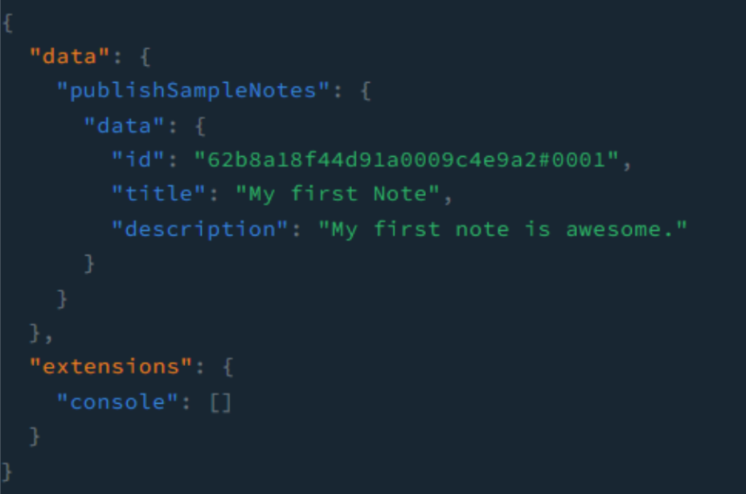

Now switch to the **Read API** tab, and hit the play button. You should have the note included in the right pane output.

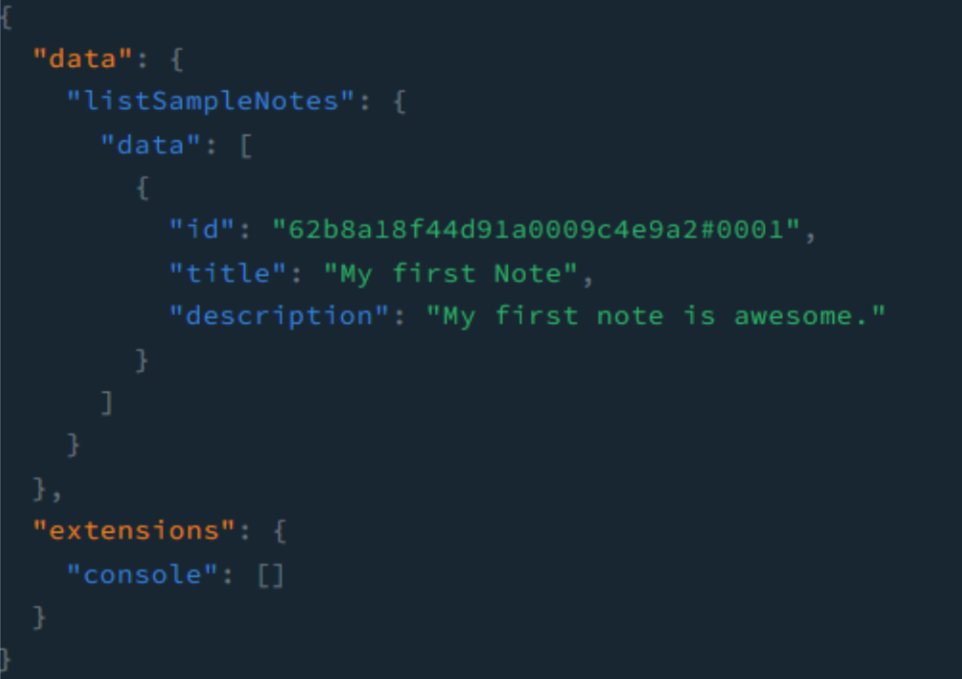

To delete a note, switch back to the Manage API tab. On the left pane, add the following mutation:

```graphql
mutation deleteSampleNote($id:ID!){
  deleteSampleNotes(revision:$id){
   data 
  }
}
```
From the above mutation, we are passing the ID variable from the query variables section as follows:

```json
{
  "id": "62b8a4e71931c2000a118a18#0001"
}

```
Ensure that you have commented out any other mutation on the left pane, and then click on the play button at the center. On the right pane, you should get a similar response as below to signify that the note has been deleted:

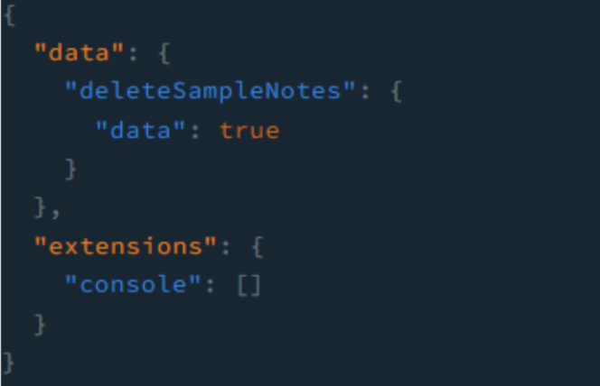

## Generate Webiny API Access Key

To connect our Next.js Application with the CMS, we need to create a Webiny API ACCESS KEY.
Click on the top hamburger icon to access Settings and select the API Keys under Access Management. Then create a New API Key.

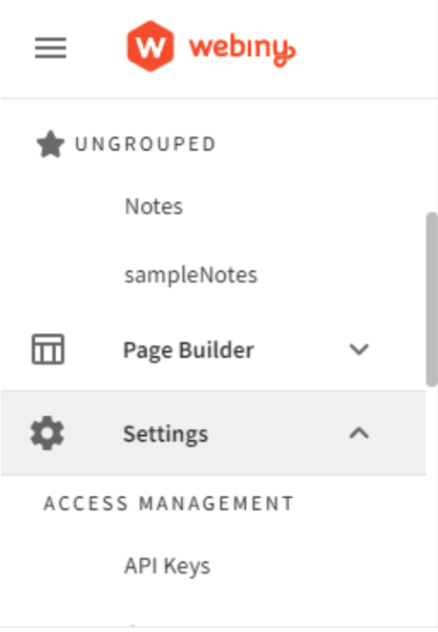


In the resulting form, add the key name and description. In the **Permissions** section, under Content, select **All Locales** that the API can be accessed on.


Webiny allows you to set Full access as well as Custom Access options for your API.

To create a Custom Access:

- Click on the **Headless CMS** section down.
- Change the **Access Level** to custom.
- Under the **GraphQL API Types**, check the Access Level your API requires, such as **Read** and **Manage**

The created content model can have different operations such as Read, Write, and Delete. To allow Next.js to perform such actions, head over to Content model Groups and select **All groups**. Then choose Read, Write and Delete **Primary actions**.

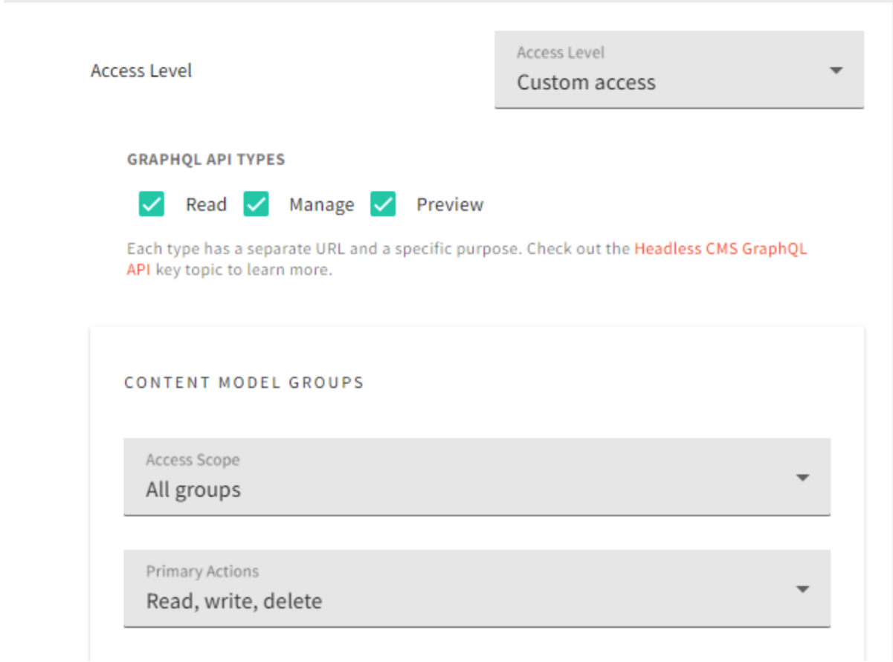

For **Content models** access, select **All models**, and Read, Write and Delete **Primary** actions.

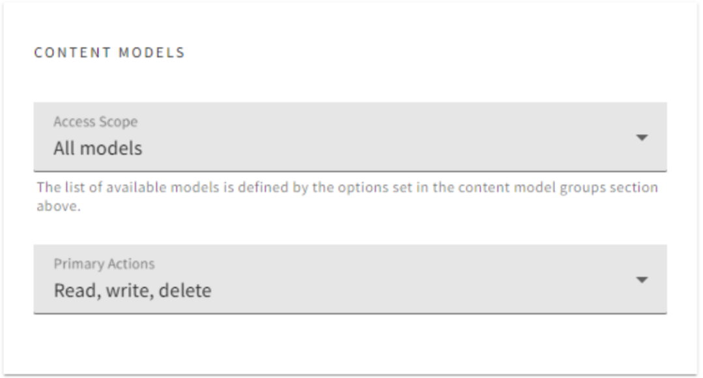

To grant the API Full access, click on the Security tab, and give Full access to all access levels.


 To manage the I18N access permissions, head over to the I18N section and grant Full access.


If you have different Admin users, Webiny allows you to manage the user access permissions. To do this, go to the **Admin users**, and grant Full access to your Admin users.


Once you have configured the correct API access management, click the Save API Key button. The created API Key should now be listed on the left side. Head over to this newly created API key and copy the token generated. We will use this token key to perform different permission to the API using Next.js.

## Setting up the Note App Frontend with Next.js

To set up the Next.js application, we will use the create next app tool to bootstrap a basic Next.js application.

First, create a new folder where you want the Next.js app to live. Then run the following command from your text editor terminal or open a terminal that points to the newly created directory:

```bash
npx create-next-app notes-app-webiny
```

This will create a local Next.js app. Once the setup is done, proceed to the newly created Next.js project directory:

```bash
cd notes-app-webiny
```

To test this out, run the command `npm run dev`. Then open http://localhost:3000 on the browser. You will be served with the Hello world version of Next.js.

Now, dive in and consume the Webiny API using this Next.js project. Create a `.env.local` file at the root directory of your project to host the Webiny API configuration as follows:

```bash
WEBINY_API_SECRET=your_access_token
NEXT_PUBLIC_WEBINY_API_READ_URL=your_read_url
NEXT_PUBLIC_WEBINY_API_MANAGE_URL=your_manage_url
```

From above:

- The **Webiny API Secret** is the access token from the API key. Head over to the Webiny API Keys dashboard and copy the token.
- To get the **Read URL**, open the Webiny **GraphQL Playground** page, and click on the Read API tab. On the top part, after the history button, copy the URL and paste it to the `NEXT_PUBLIC_WEBINY_API_READ_URL` env variable.
- To get the **Manage URL**, click on the **Manage API** tab, copy the URL, and paste it to the `NEXT_PUBLIC_WEBINY_API_MANAGE_URL` env variable.

## Establish a Communication Between Webiny and Next.js

Next.js need to communicate with Webiny, and we have the env variable ready. Next.js uses Server-Side Rendering (SSR). This way, we can interact with an API directly using Next.js and communicate with the data on the server.

To establish this server connection, head over to the pages folder and create a lib directory. In the lib directory, create an api.js file. We will define the functionalities of communicating to the Webiny Headless CMS. We will start by defining a function for sending requests to the CMS as follows:

```tsx
async function fetchAPI(query, { variables } = {},read ) {
   const url = read ? process.env.NEXT_PUBLIC_WEBINY_API_READ_URL : process.env.NEXT_PUBLIC_WEBINY_API_MANAGE_URL;
   const res = await fetch(url, {
    method: 'POST',
    headers: {
     'Content-Type': 'application/json',
     'Authorization': `Bearer ${process.env.WEBINY_API_SECRET}`
    },
    body: JSON.stringify({
     query,
     variables,
    }),
   });  
   const json = await res.json()
   if (json.errors) {
    throw new Error('Failed to fetch API')
   }  
   return json.data
}
```
The above function receives three parameters the `query` or mutation object, `variables`, and `read`. The `read` parameter will define the URL to be used. The variables will be sent for API mutation requests.
In case of any errors, the function will return them; else, it will return the data fetched.

## Create Notes App Navigation Component

Let's create a basic navigation component. In the project folder, create a **components** folder. In the **components** folder, create a **Navbar** folder and add two files: **Navbar.js**, and **navbar.module.css**. In the **navbar.module.css** file, add the following navbar styles:

```css
.navbar {
   width: 100%;
   display: flex;
   justify-content: left;
   padding: 20px;
   border-bottom: 1px solid #f4f4f4;
   margin-bottom: 20px;
}
 
.navHeading{
   font-weight: bold;
   text-transform: uppercase;
}
```

In the **Navbar.js** file, add the following basic Next.js navigation:

```tsx
import React from 'react';
import styles from './navbar.module.css';
 
export default function Navbar() {
  return (
   <nav className={styles.navbar}>
    <h4 className={styles.navHeading}>
     Notes App
    </h4>
   </nav>
  )
}
```

## Create Notes App Card Component

To display the Notes, we will create a card component that Next.js will use to display and manage the Notes. Create a **NoteCard** folder inside the **components** folder. In the **NoteCard** directory, create two files: **Notecard.js**, and **notecard.module.css**. Then create your card as follows:
In the **notecard.module.css**, add the following card styling:

```css
.card {
   padding:10px;
   border: 1px solid #f4f4f4;
   width: 80%;
   margin:0px auto 20px auto ;
   display: flex;
   justify-content: space-between;
}
 
.card h4{
   font-weight: bold;
   font-family: 'Segoe UI', Tahoma, Geneva, Verdana, sans-serif;
}
 
.card p {
   font-size: 14px;
   font-family: 'Segoe UI', Tahoma, Geneva, Verdana, sans-serif;
}
```

Then create a Note Card inside the **Notecard.js** file as follows:

```tsx
import React from 'react';
import styles from './notecard.module.css';
 
export default function NoteCard({cardData,handleDeleteNote}) {
  return (
   <div className={styles.card}>
 
    <div className={styles.cardDetails}>
     <h4>{cardData.title}</h4>
     <p>{cardData.description}</p>
    </div>
 
   </div>
  )
}
```

## Querying Notes

The card is ready to receive some data and display Notes. Let’s go ahead and get this data from Webiny and show it to a Next.js page.

In the **/lib/api.js** file, add a function to fetch all notes as follows:

```tsx
export async function getAllNotesForHome() {
   const data = await fetchAPI(
     `query Notes {
      listSampleNotes {
       data {
        id
        title
        description
       }
      }
     }
    `,
    {},
    true
   );
   return data.listSampleNotes.data
}
```

To display the Notes, head over to the **pages/index.js** file and do the following: 

### 1. Import the Necessary Components:

```tsx
import {useState} from 'react';
import {getAllNotesForHome} from './lib/api';
import Navbar from '../components/Navbar/Navbar';
import NoteCard from '../components/NoteCard/NoteCard';
```

### 2. Add Functionality to Fetch the Posts on the Server Side Using `getServerSideProps()`.

`getServerSideProps()` allow your page to fetch external data at page build time. This way, you can export a props function that fetches and returns the data, which will then be passed as props to the `NoteCard` component as follows:

```tsx
export async function getServerSideProps() {
   const allNotes = await getAllNotesForHome();
   return {
     props: { allNotes },
   }
}
```

### 3. Modify the `Home` Function 

We will also add a notes state for `allNotes`. Then render the `NoteCard` component with the data that maps to the `allNotes` props.

```tsx
export default function Home({allNotes}) {
   const [notes,setNotes] = useState(allNotes);
   return (
     <>
     <Head>
     <title>Notes App</title>
     <meta name="description" content="Notes App" />
     <link rel="icon" href="/favicon.ico" />
     </Head>
     <Navbar />   
     <div className={styles.main}>      
     {
           
       notes.length > 0 ? (
         notes.map((note,index) => (
           <div key={index}>
           <NoteCard cardData={note}/>
           </div>
         ))
         ) : (
         <p>You do not have any notes saved...</p>
       )
     }
     </div>
     </>
   )
}
```

To format the page, go ahead and update the style for the main class in the **styles/Home.module.css** file as such:

```css
.main {
  width: 50%;
  margin: 0px auto;
}
```
To test everything is working, start your development server (if the Next.js app is not already up and running) and run the following command from a terminal that points to the Next.js app directory:

```bash
npm run dev
```

Open `http://localhost:3000` from your browser. Your UI should resemble the following:

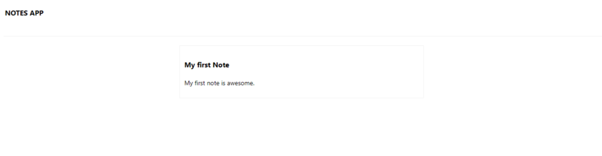

This displays the Note record we added earlier when interacting with the Webiny Note model.

## Creating a Note

Likewise, Next.js should be able to add news note records to your API. Head over to the **/lib/api.js** file, and create a function for adding notes as such:

```tsx
export async function addNote(data){
  const response = await fetchAPI(`
   mutation createNote($title:String!,$description:String!){
    createSampleNotes(data:{title:$title,description:$description}){
     data {
      id
      title
      description
      createdOn
     }
    }
   }
  `,{
   variables:{
    'title':data.title,
    'description':data.description
   }
  },false);
  return response.createSampleNotes.data;
}
```

Also, we will need a function for publishing these notes to the server:

```tsx
export async function publishNote(data){
  const response = await fetchAPI(`
   mutation publishNote($id:ID!){
    publishSampleNotes(revision:$id){
     data {
      id
      title
      description
     }
    }
   }
  `,{
   variables:{
    id:data.id
   }  
  },false);
  return response.publishSampleNotes.data;
}
```

Create a component that will render a Next.js UI to add notes. Inside the **components** folder, create an **AddNote** folder. Inside the **AddNote** folder, add two files: **AddNote.js**, and **addnote.module.css**, and create the component as follows.

Add some styling to the **addnote.module.css**:

```css
.container {
   width: 80%;
   margin: 0px auto 10px auto;
}
 
.form {
   display: block;
   width: 100%;
   padding: 0px;
   margin:0px;
}
 
.formGroup label {
   font-weight: bold;
}
 
.formGroup input[type="text"]{
   margin-top: 5px;
   border: 1px solid #f4f4f4;
   padding:10px;
   margin-right: 5px;
   width: 100%;
   margin-bottom: 10px;
}
 
.formGroup textarea {
   margin-top: 5px;
   border: 1px solid #f4f4f4;
   padding:10px;
   margin-right: 5px;
   width: 100%;
   margin-bottom: 10px;
}
 
.formGroup button {
   display: inline-block;
   padding: 10px;
   border: 1px solid #f4f4f4;
   width: 100%;
   text-align: center;
}
 
.error {
   margin:5px 0px 10px 0px;
   border: 1px solid #f4f4f4;
   padding: 10px;
   width: 100%;
   color: red;
   text-align: center;
}
 
.message {
   margin:5px 0px 10px 0px;
   border: 1px solid #f4f4f4;
   padding: 10px;
   width: 100%;
   color: green;
   text-align: center;
}

```

Then create the components inside the **AddNote.js** file by adding the following:

```tsx
import React,{useState} from 'react'
import styles from './addnote.module.css';
import {addNote,publishNote} from '../../lib/api';
 
function AddNote(props) {
 
   const [title,setTitle] = useState('');
   const [description,setDescription] = useState('');
   const [error,setError] = useState('');
   const [message,setMessage] = useState('');
 
   const onSubmit = async (e) => {
     e.preventDefault();
 
     // reset error and message.
     setError('');
     setMessage('');
 
     if(title){
       if(description) {
         let response = await addNote({ // add the note.
           title,
           description
         });
 
         response = await publishNote({ // publish the note.
           id:response.id
         });
 
         if(response) {
           // reset the fields
           setTitle('');
           setDescription('');
           setMessage("Note added successfully.");
           // append the note.
           props.addNote(response);
           // reset the show add note.
           props.resetShowAddNote();
         }
 
         
       } else {
         setError("Description is required");
       }
     } else {
       setError('Title is required');
     }
   }
 
 
   return (
     <div className={styles.container}>
       <form className={styles.form} onSubmit={onSubmit}>
         {
           error ? (
             <div className={styles.error}>
               {error}
             </div>
           ) : null
         }
 
         {
           message ? (
             <div className={styles.message}>
               {message}
             </div>
           ) : null
         }
 
         <div className={styles.formGroup}>
           <label htmlFor="title">Title</label>
           <input type="text" value={title} name="title" id="title" placeholder='Title' onChange={ (e) => setTitle(e.target.value) } />
         </div>
         <div className={styles.formGroup}>
           <label htmlFor="description">Description</label>
           <textarea name="description" value={description} rows="4" placeholder='Describe it here...' onChange={ (e) => setDescription(e.target.value)} />
         </div>
         <div className={styles.formGroup}>
           <button type="submit">Submit</button>
         </div>
       </form>
     </div>
   )
}

export default AddNote
```

To consume this component, head over to the pages/index.js file:

### 1. Import the AddNote Component:

```tsx
import AddNote from '../components/AddNote/AddNote';
```

### 2. Define a State Variable for Showing Add Note Form:

```tsx
const [showAddNote,toggleShowAddNote] = useState(false);
```

### 3. Define a Function to be Appending Notes to the State Once Added:

```tsx
const addNote = (note) => setNotes([...notes,note]);
```

### 4. Define a Function to Toggle the Show Note Form:

```tsx
const resetShowAddNote = () => toggleShowAddNote(!showAddNote);
```

### 5. Update the Render Function as Follows:

```tsx
<div className={styles.main}>
  <div className={styles.addNote}>
   <button onClick={resetShowAddNote}>
    {
     showAddNote ? "Back to Notes" : "Add a Note"
    }
   </button>
  </div>
  {
   showAddNote ? (
    <AddNote addNote={addNote} resetShowAddNote={resetShowAddNote}/> 
   ) : (      
    notes.length > 0 ? (
     notes.map((note,index) => (
       <div key={index}>
        <NoteCard cardData={note}/>
       </div>
      ))
     ) : (
      <p>You do not have any notes saved...</p>
     )
    
   )
  }
</div>
```
Ensure that your development server is up and running, and then visit the homepage (http://localhost:3000). Click the "Add a Note" button, fill in the resulting form with note details, and then click Submit.

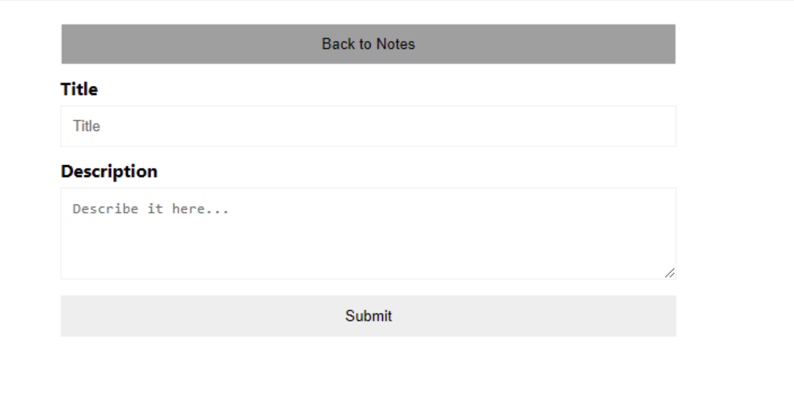
 
Once you have added a note, you will be redirected back to the notes section with the recently added notes:

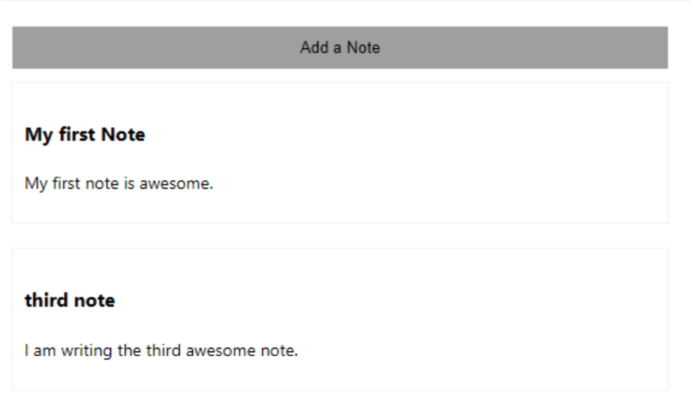

## Deleting a Note

To manage the notes, let's create a component that will allow you to delete a note.
First, go to the **lib/api.js** file, and create a function for deleting a note as follows:

```tsx
export async function deleteNote(data){
  const response = await fetchAPI(`
   mutation publishNote($id:ID!){
    deleteSampleNotes(revision:$id){
     data
    }
   }
  `,{
   variables:{
    id:data.id
   }  
  },false);
  return response.deleteSampleNotes.data;
}
```

Then in the **pages/index.js** file:

### 1. Import the Function

```tsx
import {deleteNote} from './lib/api';
```

### 2. Add a `deleteNote` Handler Function:

```tsx
const handleDeleteNote = (id) => {
   let result = deleteNote({id}); // delete the note.
   if(result){
   setNotes( notes.filter((note) => note.id !== id)); // filter the deleted note
   } else {
    throw new Error(result.error)
   }
}
```

### 3. Pass the Handler as a Prop on the NoteCard Component

```tsx
<NoteCard cardData={note} handleDeleteNote={handleDeleteNote} />
```

Since the `handleDeleteNote` is executed inside the **NoteCard** component, we need to receive this prop. Navigate to the **NoteCard** component:

### 1. Receive the Prop

```tsx
function NoteCard({cardData,handleDeleteNote}) 
```

### 2. Create a Delete Button Inside the Card Div:

```tsx
<div className={styles.cardActions}>
   <button onClick={ () => handleDeleteNote(cardData.id)}>Delete</button>
</div>
```

Finally, add the following styles to the **notecard.module.css** to format the for the delete button:

```css
.cardActions button{
   display: inline-block;
   border: 1px solid #f4f4f4;
   padding: 5px;
   background-color: darkgray;
   border-radius: 5px;
   color: #fff;
}
```
Ensure that the development server is still running. From the home page, each note will have a delete button. Click on it, and the note will get deleted from your server.

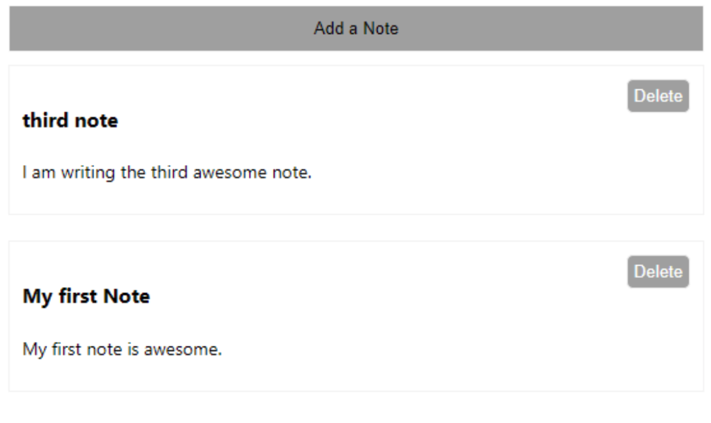

## Conclusion

This guide helped you create a notes application using Webiny Headless CMS as your data source. This gives your applications content control, access control, site reliability and decoupled engineering. 

This article was written by a contributor to the Write with Webiny program. Would you like to write a technical article like this and get paid to do so? [Check out the Write with Webiny section on our Docs](https://www.webiny.com/docs/write-with-webiny/write-with-webiny).
