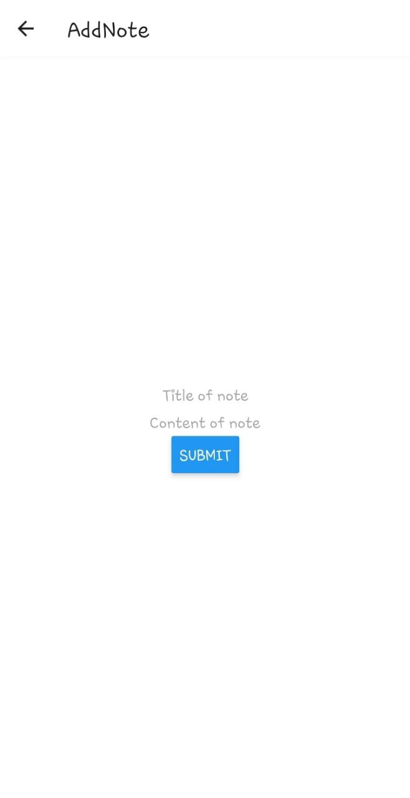

Webiny is an open-source, developer-friendly CMS that is supported by cutting-edge tools and technologies like Node, React, and a GraphQL API. You have the option to integrate with tools like Gatsby, Nextjs, and Astro through the Content Delivery API. Webiny supports developers in the design, development, and deployment of applications on top of the serverless infrastructure.

Developers can create and run applications without having to worry about managing servers thanks to Webiny's integrated page builder, form builder, file manager, admin area, and headless CMS, which runs on top of AWS Lambda, DynamoDB, and S3. Webiny provides all the tools you need, all of which are optimised to work together seamlessly and performantly, allowing users to build websites and web applications in both large and small projects without the hassle.

[React Native](https://reactnative.dev/) is a mobile app development framework. It allows you to create apps that run on Android and iOS using the React framework. With React Native you write code that can be shared across Android and iOS platforms.

In this article, we will create a notes app using React Native and Webiny Headless CMS.

## Prerequisites

To follow along with this tutorial, we’re going to assume you have already done the following:

- [Set up your AWS credentials locally](https://www.webiny.com/docs/infrastructure/aws/configure-aws-credentials)
- Ensure that you have [Node.js](https://nodejs.org/en/download/) >= 14.15.0 installed.
- Ensure that you have yarn ^1.22.0 || >=2 installed - Webiny works with both yarn versions.
- Basic understanding of [React Native](https://reactnative.dev/) and [Javascript](https://www.javascript.com/)
- Star our [GitHub Repo](https://github.com/webiny/webiny-js) 😉

## Set up a Webiny Project

To [create a Webiny project](https://www.webiny.com/docs/get-started/install-webiny), you need an AWS account and Node.js installed on your system.

Go to the directory where you want to set up your project, open the terminal, and type in the command: 

```bash
npx create-webiny-project [your project name]
```

And run the following command to deploy the project:

```bash
yarn webiny deploy
```

After the deployment is complete, you will be presented with the URL for your Webiny project, where you can enter the Admin Dashboard and begin developing the project's backend.

You can find out all the relevant URLs at any time by running the following command inside the Webiny project directory:

```bash
yarn webiny info
```

Also, the in-depth guide on Webiny installtion can be found [here](https://www.webiny.com/docs/get-started/install-webiny).

Once installation and deployment are done, you can access Admin and start managing and modeling your CMS content models immediately.

## Create a Note Model


Click on **NEW CONTENT MODEL** on dashboard to create your models. Or navigate **NEW CONTENT MODEL** > **CONTENT MODELS** > **Models** in side menu.


A New Content Model page will be launched. Click **NEW MODAL**.


The Note model will have following fiedls:

- Title - `Text` type
- Content - `Long Text` type

To add these fields to the model, drag and drop them from your panel, ensuring you select them based on the data type each field will hold.


Here is an example of adding the title field in Note model:


Once the content model is created, go ahead and add a few record entries by clicking **NEW ENTRY:**


Ensure you add several new entries using the above case and an example.

## Create an API Key to Access Content

To securely access content from Webiny Headless CMS, we will create an API Access Token. With this token, you can consume your content from any frontend tools of your choice.

Navigate to **Settings** and create a **NEW API KEY** as follows:


Provide API key details, ensuring:

- Per-locale content access permissions management is set as follows.


- Headless CMS app access permissions are set as follows.


Once you **SAVE API KEY**, a token will be generated, and copy its content. This key will be used alongside React Native to access the CMS.

Finally, you need an API endpoint to consume your data. Webiny provides that for you. Navigate to **API Playground**


Click **Headless CMS Read API** and copy the URL endpoint for reading Webiny CMS data.


Click **Headless CMS Manage API** and copy the URL endpoint for changing Webiny CMS data.


## Setting up the application

To create a React Native, we will use [Expo](https://reactnative.dev/docs/environment-setup). It provides tools and services that make it easy to develop React Native apps. This means you don't need to install and configure native build tools such as Xcode or Android Studio.

With Expo, you can use a single codebase to build mobile apps for iOS, Android, and the web. Proceed to your preferred working directory. Run the following command to bootstrap the React Native Expo application:

```bash
npx create-expo-app notes_app

```

Once the installation process is complete, we will need to install the following packages for navigation.

```bash
npx expo install @react-navigation/native @react-navigation/stack react-native-gesture-handler react-native-safe-area-context

```

- Ensure that the development server is running:

```bash
# On ios device
npx expo run ios

# On ios android
npm run android

```

## Handling Environmental Variables

We have created variables we need to use in the React Native app. This includes the API Access Key. To use these constants in React Native, we need to create environmental variables so that the application can access them where necessary.

Expo provides a few different ways to [handle environmental variables in your React Native app](https://docs.expo.dev/guides/environment-variables/). They are:

- Using the `.env` file with the expo-dotenv package
- Using the Expo CLI with the `Expo.Constants.manifest.extra` object.
- Using a `.json` file with the expo-constants package

For loading environmental variables, we will use the expo-constants package. Go ahead and install the package using the following command:

```bash
npx expo install expo-constants

```

On the project root folder, create an `app.config.js` file. Edit the file as follows:

```jsx
module.exports = {
    name: 'NotesApp',
    version: '1.0.0',
    extra: {
    manageUrl: "your_manage_url",
    readUrl:"your_read_url",
    apiKey:"your_api_key"
    },
};

```

Update the above dynamic variables as per your Webiny credentials.

## Connecting Webiny with React Native

Using the above Webiny environmental variables, let’s connect the CMS to React Native to perform mutations and queries based on the Webiny generated GraphQL endpoints.

On the project root directory, create a `store` directory. Inside it, create a `store.js` file. The file will host the application's context. Edit the file as follows, step by step:

- Import the necessary packages:

```jsx
import React,{createContext, useState} from 'react';
import Constants from 'expo-constants';

```

- Define the application context:

```jsx
const AppContext = createContext();

```

- Define the `AppContextProvider` function:

```jsx
const AppContextProvider = ({children}) => {
}

```

In React, the `createContext` function is used to create a `ReactContext` object. This object is used to pass data through the component tree without having to pass props down manually at every level. In his case, we are creating the `AppContextProvider` function to handle this instance to get data from Webiny and to pass them down through the component tree.

Inside the `AppContextProvider`, configure the `createContext` as follows:

- Define the states to hold the values that determine a component's behavior.

The state can be managed within the component itself and updated using the `setState` method. In this example, we will define the application as follows:

```jsx
const [notes,setNotes] = useState([]);
const [loading,setLoading] = useState(false);
const [error,setError] = useState('');
const apiKey = Constants.manifest.extra.apiKey;

```

- Define the function for fetching the notes:

In the above example, we create states to hold the notes data. To get notes from Webiny, we will create the `getNotes` method to fetch the notes data as follows:

```jsx
const getNotes = async() => {
    setLoading(true);
    setError('');
    try{
        let url = Constants.manifest.extra.readUrl;
        let headers = {
            "content-type":"application/json",
            "Authorization": `Bearer ${apiKey}`};
        let graphqlQuery = {
            "operationName" : "fetchNotes",
            "query": `query fetchNotes{
                listNotes{
                data{
                    id
                    title
                    content
                    published
                }
                }
            }`,
            "variables":{}
        };
        const options = {
            "method":"POST",
            "headers":headers,
            "body":JSON.stringify(graphqlQuery)
        };
        let response = await fetch(url,options);
        let data = await response.json();
        setNotes(data.data.listNotes.data);
        setLoading(false);
        setError('');
    }catch(e){
        setLoading(false);
        setError(new Error(e).message);
    }
}

```

- Define a function for adding a note:

Just as getting notes Webiny, we need to create notes and save them to the CMS. The below `addNote()` method will help add data to Webiny based on the data we have created on the CMS dashboard:

```jsx
const addNote = async (title,content) => {
    setLoading(true);
    setError('');
    try{
        let url = Constants.manifest.extra.manageUrl;
        let headers = {
            "content-type":"application/json",
            "Authorization": `Bearer ${apiKey}`};
        let graphqlQuery = {
            "operationName":"addNote",
            "query":`mutation addNote($title:String!,$content:String!){
                createNote(data:{title:$title,content:$content}){
                data{
                    id
                    title
                    content
                }
                }
            }`,
            "variables":{
                "title":title,
                "content":content
            }
        };
        const options = {
            "method":"POST",
            "headers":headers,
            "body":JSON.stringify(graphqlQuery)
        };
        let response = await fetch(url,options);
        let data = await response.json();
        setLoading(false);
        setError('');
        return data.data.createNote.data;
    }catch(error){
        setLoading(false);
        setError(new Error(error).message);
    }
}

```

- Define a function for deleting a note:

Any note published on Webiny CMS can be deleted on the front-end. Using React Native, below is how we can send a request to delete a note based on the specific note `id`:

```jsx
const deleteNote = async (id) => {
    setLoading(true);
    setError('');
    try{
        let url = Constants.manifest.extra.manageUrl;
        let headers = {
            "content-type":"application/json",
            "Authorization": `Bearer ${apiKey}`};
        let graphqlQuery = {
            "operationName":"deleteNote",
            "query":`mutation deleteNote($id:ID!){
                deleteNote(revision:$id){
                  data
                }
              }`,
            "variables":{
                "id":id,
            }
        };
        const options = {
            "method":"POST",
            "headers":headers,
            "body":JSON.stringify(graphqlQuery)
        };
        let response = await fetch(url,options);
        let data = await response.json();
        setLoading(false);
        setError('');
        if(data.data.deleteNote.data){
            setNotes(notes.filter(note => note.id !== id));
        }
        return data.data.deleteNote.data;
    }catch(error){
        setLoading(false);
        setError(new Error(error).message);
    }
}

```

- Return the states and the functions we have created:

```jsx
return (
    <AppContext.Provider value={{notes,setNotes,loading,setLoading,error,setError,getNotes,addNote,deleteNote}}>
        {children}
    </AppContext.Provider>
)

```

- Export the `AppContext`, and `AppContextProvider` so that the rest of the application can be able to access all the methods we have created:

```jsx
export {
    AppContext,
    AppContextProvider
}
```

To allow React Native to use these changes, import the `AppContextProvider` in `App.js`:

```
import {AppContextProvider} from './store/store';

```

Wrap each component rendered from the `App()` with the provider:

```jsx
<AppContextProvider>
    // rest of the components
</AppContextProvider>

```

## Setting up the Screens

In React Native, a screen is typically implemented as a component rendered to the device's screen. This will allow us to create the components that will execute our methods, such as getting the notes and displaying them, a component for adding a new note based on `addNote` etc.

Inside the project folder, create a `screens` directory. Inside the directory, create two files:

- `Home.js` - This screen will display the notes.
- `AddNote.js` - We will use this screen to create a component to add new notes to Webiny CMS.

To execute these screens, use React Native navigation to control the screen interactions. To do so, edit `App.js` as follows:

- Import the necessary packages:

```jsx
import { NavigationContainer } from '@react-navigation/native';
import { createStackNavigator } from '@react-navigation/stack';
import Home from './screens/Home';
import AddNote from './screens/AddNote';
import {AppContextProvider} from './store/store';

```

- Create a stack navigator:

```jsx
const Stack = createStackNavigator();

```

- Render the components as per their routes:

```jsx
return (
    <AppContextProvider>
    <NavigationContainer>
    <Stack.Navigator initialRouteName='Home'>
        <Stack.Screen name="Home" component={Home} options={{title:"Home"}}/>
        <Stack.Screen name="AddNote" component={AddNote} options={{title:"AddNote"}} />
    </Stack.Navigator>
    </NavigationContainer>
    </AppContextProvider>
);

```

## Displaying Notes

Using the `screens/Home.js` we have created above, let’s fetch the notes from Webiny:

- First, import the necessary packages:

```jsx
import { StatusBar } from 'expo-status-bar';
import { StyleSheet, Text, View,Button } from 'react-native';
import { useContext, useEffect } from 'react';
import { AppContext } from '../store/store';

```

- Define the render function:

```jsx
export default function App({navigation}) {
}

```

- Inside the render function:
- Extract relevant data from context:

```jsx
const {notes,getNotes,loading,error} = useContext(AppContext);

```

- Fetch the notes:

```jsx
useEffect( () => {
    getNotes();
},[]);

```

- Render the view:

```jsx
return (
    <View style={styles.container}>
    {
        loading && <Text>Loading...</Text>
    }
    {
        error && <Text>{error}</Text>
    }
    {
        notes && notes.length > 0 && notes.map((note,index) => (
            <View key={index} style={styles.notesCard}>
                <Text style={styles.notesTitle}>{note.title}</Text>
                <Text style={styles.notesSubTitle}>{note.content}</Text>
            </View>
        ))
    }

    <Button title="Add Note" onPress={ () => navigation.navigate("AddNote") } />
    <StatusBar style="auto" />
    </View>
);

```

- Define some styles to format the displayed notes:

```css
const styles = StyleSheet.create({
container: {
    padding:20
},
notesCard:{
    margin:10,
    shadowColor:"#fff",
    shadowOpacity:1
},
notesTitle:{
    fontWeight:"bold"
},
notesSubTitle:{
    fontWeight:"300"
}
});

```

- Ensure your development server is still up and running. Based on the notes available on the Webiny CMS, React Native will display them as follows:


## Adding a New Note

These changes go to `screens/AddNote.js` as follows:

- Import the relevant packages:

```jsx
import { StatusBar } from 'expo-status-bar';
import { useState,useContext } from 'react';
import { StyleSheet, Text, View,TextInput,Button } from 'react-native';
import { AppContext } from '../store/store';

```

- Define the render function:

```jsx
export default function App({navigation}) {
}

```

Inside the render function:

- Define the states:

```jsx
const [title,setTitle] = useState('');
const [content,setContent] = useState('');
const [formError,setFormError] = useState('');

```

- Extract data from context:

```jsx
const {addNote,publishNote,loading,error} = useContext(AppContext);

```

- Define a function for adding a note:

```jsx
const handleAddNote = async () => {
    setFormError('');
    if(title && content){
        try{
            let response = await addNote(title,content); // add a note
            let publishResponse = await publishNote(response.id); // publish the added note
            if(publishResponse.id){
                setTitle('');
                setContent('');
                navigation.navigate('Home'); // redirect to home
            }
        }catch(error){
            setFormError(new Error(error).message);
        }
    }else{
        setFormError("Title and Content are required");
    }
}

```

- Render the view:

```jsx
return (
    <View style={styles.container}>
    {
        formError && <Text>Form Error : {formError}</Text>
    }
    {
        error && <Text>Error adding note : {error} </Text>
    }
    <TextInput
        placeholder='Title of note'
        value={title}
        onChangeText={text => setTitle(text)}
    />
    <TextInput
        placeholder='Content of note'
        value={content}
        onChangeText={text => setContent(text)}
    />
    <Button title={
        loading ? "Loading" : "Submit"
    } onPress={() => handleAddNote() } />
    <StatusBar style="auto" />
    </View>
);

```

- Define some styles:

```css
const styles = StyleSheet.create({
    container: {
        flex: 1,
        backgroundColor: '#fff',
        alignItems: 'center',
        justifyContent: 'center',
    },
});

```



## Deleting a Note

Using the `screens/Home.js` we have created above, let’s delete a note from Webiny:

- Extract the `deleteNote` function from context:

```jsx
const {notes,getNotes,loading,error,deleteNote} = useContext(AppContext);

```

- Define a function for deleting a note:

```jsx
const handleDeleteNote = async (id) => {
    let res = await deleteNote(id);
    if(res){
        console.log("done");
    }else{
        console.log("an error occurred");
    }
}
        ```

- Add a button for deleting a note while rendering the note card:

```js
{
    notes && notes.length > 0 && notes.map((note,index) => (
        <View key={index} style={styles.notesCard}>
            <Text style={styles.notesTitle}>{note.title}</Text>
            <Text style={styles.notesSubTitle}>{note.content}</Text>
            <Button title="Delete note" color="red" onPress={() => handleDeleteNote(note.id)} />
        </View>
    ))
}

<p data-line="636" class="sync-line" style="margin:0;"></p>

```


## Conclusion

We have successfully created a React Native notes app that is consuming data form Webiny Headless CMS 🚀. In this article we learned how to setup and use the Webiny CMS, configure content models and consuming data from React Native app.

**Full source code:** https://github.com/webiny/write-with-webiny/tree/main/tutorials/react-native-notes-app

---

This article was written by a contributor to the Write with Webiny program. Would you like to write a technical article like this and get paid to do so? [Check out the Write with Webiny GitHub repo](https://github.com/webiny/write-with-webiny/).
