Serverless infrastructure has many benefits when it comes to building modern applications. These benefits include lower latency, reduced costs, quicker deployments, and many more. With a Serverless CMS like Webiny, we can build modern applications powered by serverless architecture.

In this tutorial, we're going to see how we can build a full-stack application by leveraging Webiny's' Headless CMS features.

We'll be building an image sharing app with Webiny and Nuxt.js 3, where users will view pictures posted by other users and be able to upload their own pictures.

We'll cover how Webiny works as a Serverless CMS and we'll walk through the process of creating, configuring, and deploying a Webiny project with a GraphQL API.

Then, we connect it to a Nuxt.js frontend and build out the functionality for creating and viewing images.

## A brief introduction to Serverless & Headless CMS

CMS stands for Content Management System which, as the name implies, helps manage content for applications. Traditional CMS solutions are the ones where the back end is coupled with the front end of the application. A headless CMS is one where the backend is decoupled and communication between the two parts is done using APIs that are provided by the Headless CMS.

This allows any technology of choice to be used in building the client side of the application, allowing the application to be used across multiple devices ranging from laptop computers to phones, to TVs to watches. Basically anything capable of communicating via APIs.

Serverless CMS is more or less an evolution of a typical Headless CMS, where instead of being hosted and deployed on a server or accessed as a SaaS (like in the case of a few Headless CMS options, Webiny is serverless as it uses AWS Serverless services to run.

Also, deploying and maintaining a Webiny instance is made super easy through the Webiny command-line interface (CLI).

## What is Webiny

Webiny is an open-source content management system designed for enterprises. It’s built on top of serverless infrastructure to enable great scalability and site reliability even in demanding, peak traffic conditions.

Although Webiny describes itself as an “open-source content management system” it is way more than that. It offers a rich set of features which includes:

- [Headless CMS](https://www.webiny.com/docs/overview/applications/headless-cms)
- [Page Builder](https://www.webiny.com/docs/overview/applications/page-builder)
- [Form Builder](https://www.webiny.com/docs/overview/applications/form-builder)
- [File Manager](https://www.webiny.com/docs/overview/applications/file-manager)
- [Advanced Publishing Workflow](https://www.webiny.com/docs/overview/applications/apw)
- [Admin interface](https://www.webiny.com/docs/overview/applications/admin) dashboard

In this tutorial, however, we’ll be looking extensively at the Headless CMS feature.

## What we’re building

We’ll be building a simple photo gallery app that displays Photos pictures with information such as **Caption**, **Author** Author Name and Username. Users will be able to view pictures and also upload pictures with the caption and author information that they choose.

## Prerequisites

Before getting started with this project, ensure you have the following:

- Basic knowledge of [Vue](https://vuejs.org/) and [Nuxt](https://nuxtjs.org/)
- Node.js versions **14** or greater
- If you don’t have Node.js installed, the easiest way to install it is by [downloading the official binary](https://nodejs.org/en/)
- **[Volar Extension](http://xn--volar%20extension%20%20download%20either%20enable%20take%20over%20mode%20%28recommended%29%20-k3139g...xn--%20or%20add%20typescript%20vue%20plugin%20%28volar%29%20%20download-qk612e/) (for Nuxt)**
    - Either enable **[Take Over Mode**](https://github.com/johnsoncodehk/volar/discussions/471) (recommended)
    - Or add **TypeScript Vue Plugin (Volar)** [Download](https://marketplace.visualstudio.com/items?itemName=johnsoncodehk.vscode-typescript-vue-plugin)
- Yarn installed
  - Webiny works with yarn versions >=1.22.0 and >=2
- AWS account and user credentials
  - To deploy Webiny, you must have a valid [AWS account and user credentials](https://www.webiny.com/docs/infrastructure/aws/configure-aws-credentials) set up for your system

## Setting up and deploying a Webiny project

We’ll create a new Webiny project using `create-webiny-project`, to do that, navigate to the directory we want to create our app in and run:

```bash
npx create-webiny-project webiny-photo-api
```

This is going to do a few things:

- Prepare a project folder
- Install dependencies
- Scaffold a Webiny application
- Initialize git and make an initial commit

After that, we just have to follow the prompts to continue with the installation. We’ll be asked to

- Choose the region where our app will be deployed
- Choose the database setup for our Webiny project

The installation might take a while. Make sure you’ve followed the instructions from the prerequisites and have [set up your AWS account completely](https://www.webiny.com/docs/infrastructure/aws/configure-aws-credentials).

If you’re still encountering any problems, you can always reach out to the [Webiny Community on Slack](https://www.webiny.com/slack).

Once the installation is complete, we can go ahead and deploy our Webiny project:

```bash
yarn webiny deploy
```

By executing this command, all of the project applications will first get built, and, along with needed cloud infrastructure resources, deployed into our AWS account.

_🚨Note that the first deployment can take up to 20 minutes! So, even though it might look like nothing is happening in the terminal, please be patient and let the process finish. If something went wrong, an error will be shown._

Here’s what we get after a successful deploy:

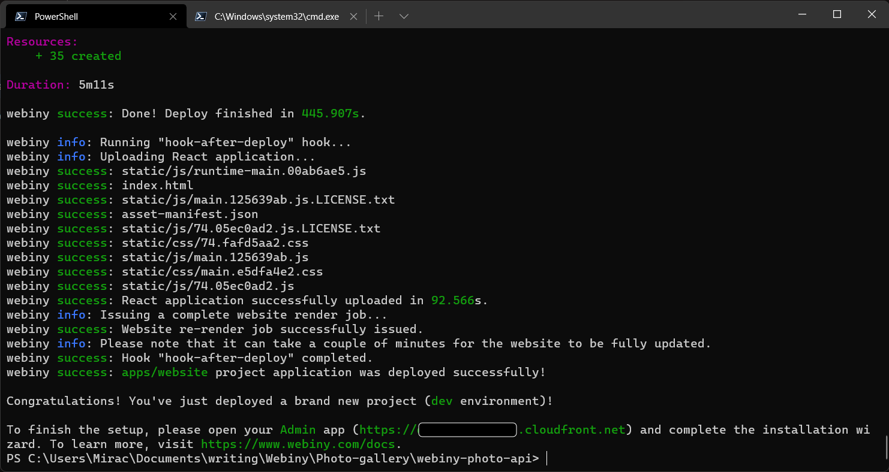

Remember: You can always run `yarn webiny info --env=dev` to view all of the relevant project URLs, including the URL of your GraphQL API:

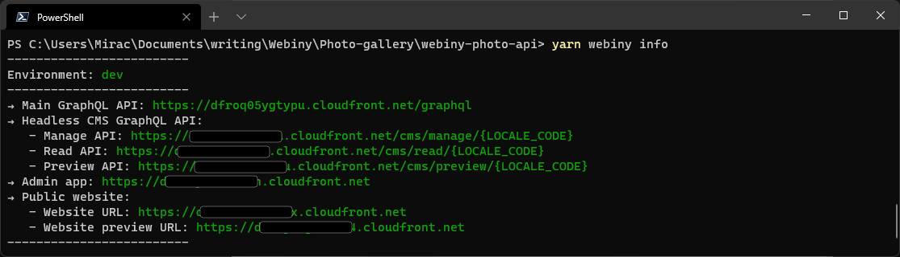

By running that command, we get the URL with which we can access the Admin app.


Once we’ve created the admin account, we can proceed to go through the remaining steps and install all the applications.


Click the **FINISH INSTALL** button to be taken to the Webiny dashboard.

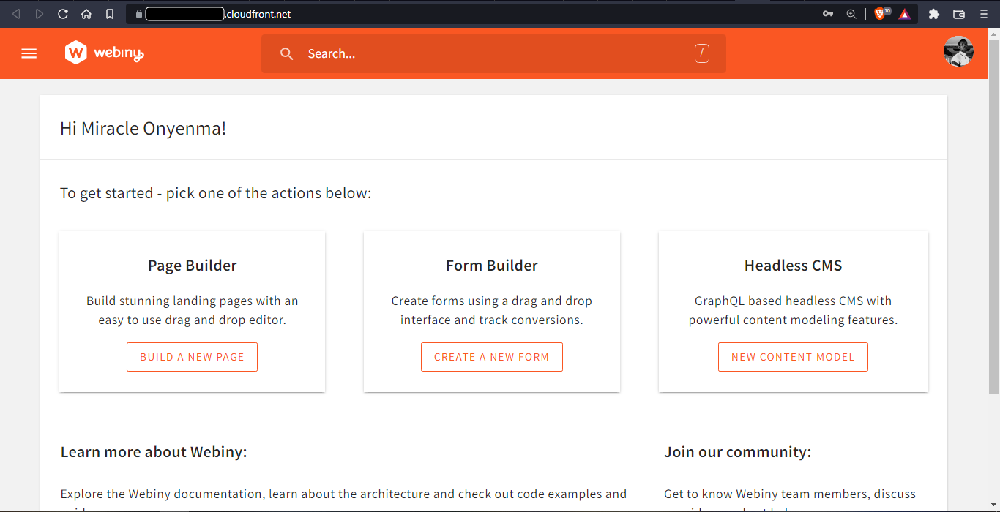

Now we have our Webiny application deployed, we can get started on structuring our content.

## Creating a Content Model

First thing we’ll need to do now is to create the models for our application. In the Webiny dashboard, click on **Create New Content Model** under the **Headless CMS** option.

A form appears where we can create our content model.

### Photo Content Model

Set up model as below:

- **Name:** “Photo”
- **Content Model Group:** Ungrouped
- **Description:** “A photo”


In the **Photo** content model, we create the following fields:

- A `text` field with the Label value “caption”


- A `files` field with the Label value “image”
- Select images only


We should now have something like this:

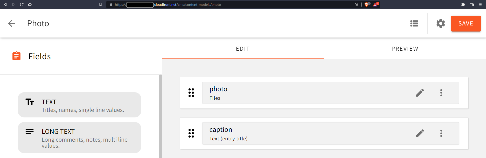

### Author content model

Set up the content model as below:

- **Name:** “author”
- **Content Model Group:** Ungrouped
- **Description:** “Author of photos”


In the **author** content model, we create the following fields:

- A `text` field with the Label value “name”


- Another `text` field with the Label value “username”

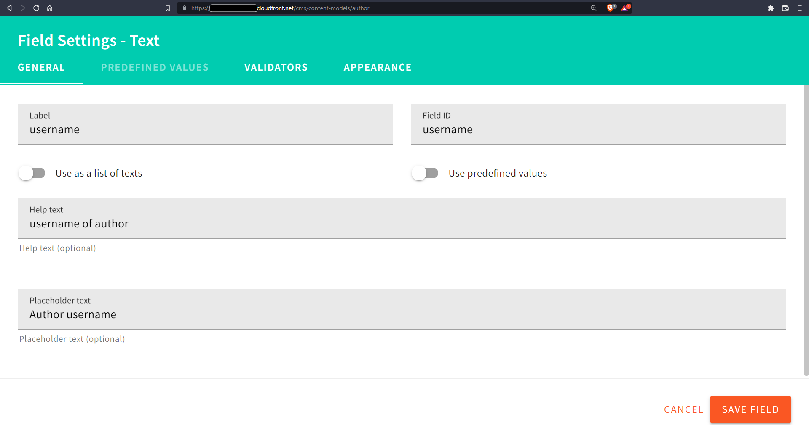

- Under the Validators tab set the following values:
    - Required to `enabled`
    - Unique to `enabled`

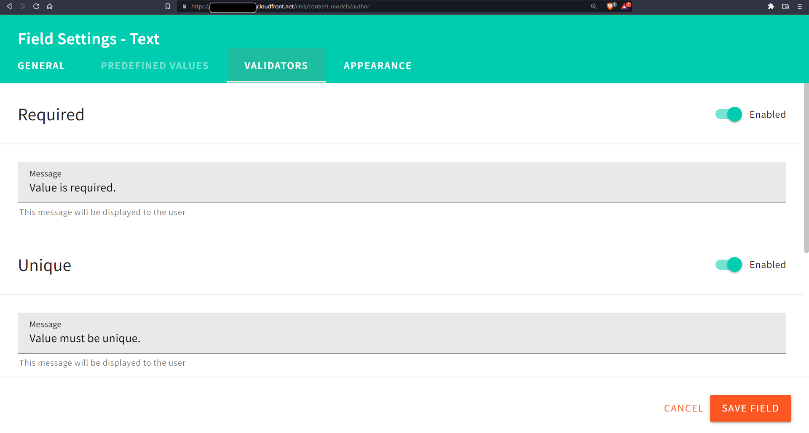

Now we need to create our first author.

### Create an author

To create a new Author entry, go to the dashboard and under **CONTENT MODELS**, select **authors**


Enter the author details and click on **SAVE & PUBLISH**


### Add Author reference field to Photo

Now that we’ve created our **author** content model, we can now add it as a relational field in our **Photos** content model.

Open the Photos model and add the Author reference field, i.e. add a  relational field with the Label value “author”


Our content structure should look like this:


### Create our first photo

Creating our first author and photo record in the UI like this allows us to test our API in the GraphQL Playground and our app to make sure we have it set up correctly and for easier debugging. 

Navigate to the Photo content type to create a new photo

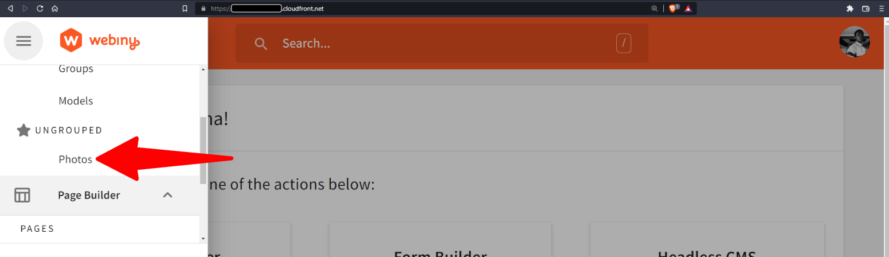

Click on **NEW ENTRY** to create a new entry, upload an image of your choice and complete the rest of the details as you wish.


Click **SAVE & PUBLISH** to save the entry and publish it to be available on the API.

Now we will be able to fetch our photos from the GraphQL API playground.

Navigate to the **API Playground** from side menu and in the **Headless CMS - Read API tab** execute this query to list all photos:

```graphql
{
  listPhotos {
    data {
      id
      caption
      photo
      author {
        name
        username
      }
    }
  }
}
```

Here’s what you should get:

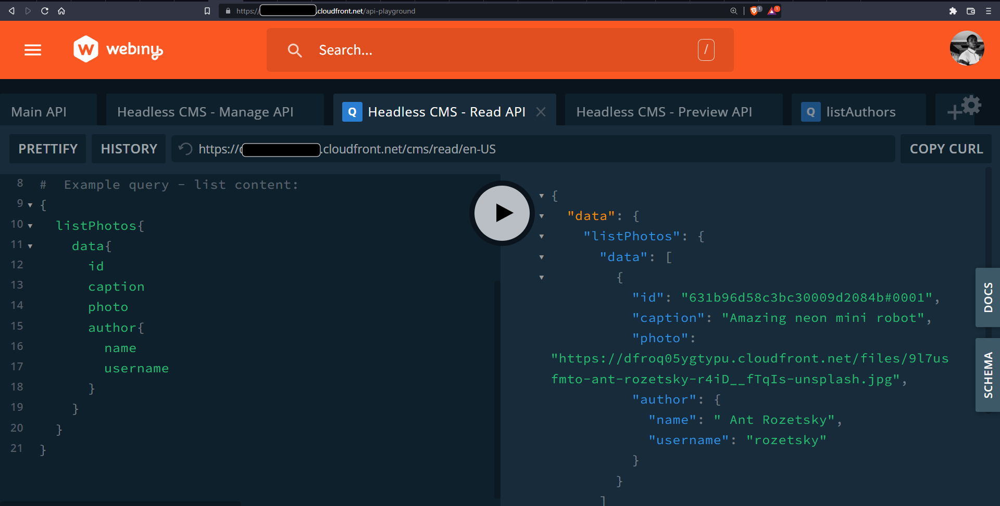

## Creating API Keys

As seen in the [docs on using the GraphQL API](https://www.webiny.com/docs/headless-cms/basics/using-graphql-api#creating-the-api-key), the GraphQL API sits behind a security layer that forbids unauthorized access. So in order to connect to it, we need to pass the value of an API key. These can be created via the Security Webiny application, by opening the **API Keys** section:


Now, let’s give our API Key a name and description. We’ll also set up some permissions. For the content, we’ll **enable All Locales**.

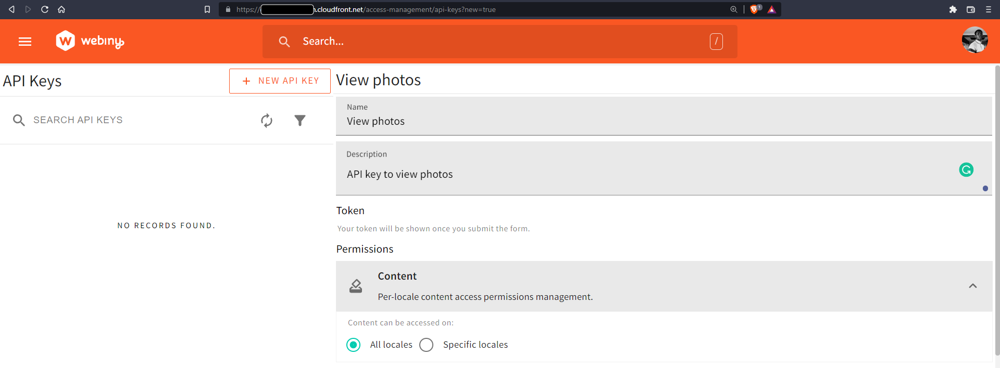

Next, in the Headless CMS section, we’ll configure the Access Level to **Custom access**.

Under the **GRAPHQL API TYPES**, we select **READ**.

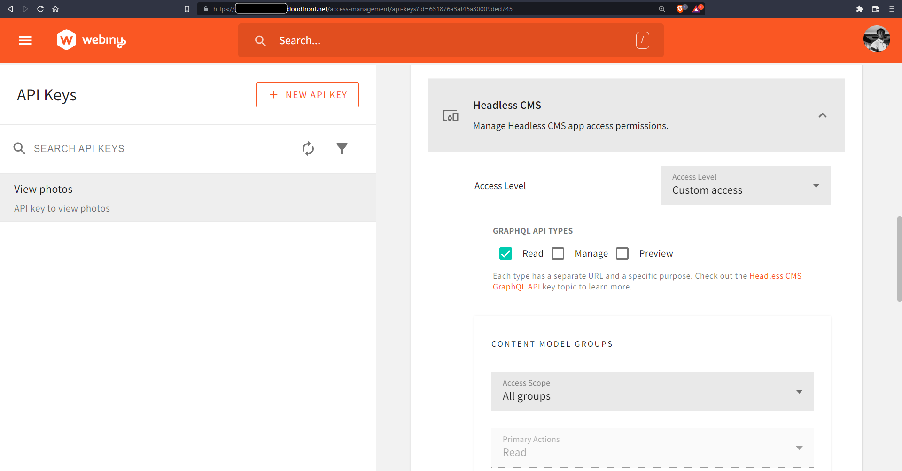

Also, under **CONTENT MODELS**, we select **Only specific models** and select:

- Photo ✅
- author ✅


Now, click the **SAVE API KEY** button and copy the token.

We can now send an external request from an API tester to our Headless CMS Read API by setting up the [Authorization header](https://www.webiny.com/docs/headless-cms/basics/using-graphql-api#creating-the-api-key) with our token.

Let’s get a list of our photos with this query:

```graphql
{
  listPhotos{
    data{
      id
      caption
      photo
      author{
        name
        username
      }
    }
  }
}
```

We get this response:

```json
{
  "data": {
    "listPhotos": {
      "data": [
        {
          "id": "631b9e8807a1f20009dce683#0001",
          "caption": "Awesome neon robot",
          "photo": "https://mywebinyinstance.cloudfront.net/files/9l7usfmto-ant-rozetsky-r4iD__fTqIs-unsplash.jpg",
          "author": {
            "name": "Ant Rozetsky",
            "username": "rozetsky"
          }
        }
      ]
    }
  },
  "extensions": {
    "console": []
  }
}
```

I've tested this with a GraphQL client as you can see in the image below. You can do the same with  like [Insomnia](https://insomnia.rest/) or [Postman](https://www.postman.com/).


Now that our API is up and running, let’s create the front end of our application with Nuxt.

## Setting up the frontend

We’ll be using Nuxt.js 3 to build out the frontend for our Photo gallery app. [Nuxt](https://nuxtjs.org/) is a web framework built on Vue.js that offers server-side rendering capabilities, automatic routing, and much more.

To set up Nuxt.js 3 using the Nuxt CLI (called "Nuxi"), run:

```bash
npx nuxi init photo-gallery
```

This creates a new project in a directory `/photo-gallery`, to install the project:

```bash
cd photo-gallery

npm install
```

**Set up Tailwind**

After a successful installation, we can now proceed to set up TailwindCSS for styling:

```bash
npm install tailwindcss postcss@latest autoprefixer@latest @tailwindcss/forms

npx tailwindcss init
```

Create a new file - `./assets/css/main.css` and add these three lines:

```css
@tailwind base;
@tailwind components;
@tailwind utilities;
```

To keep this tutorial straight to the point, I will not be focusing on the styling of the application and all styles used in building the application are available in the `main.css` file on GitHub.

Now we can configure `postcss` in `./nuxt.config.ts`

```jsx
import { defineNuxtConfig } from 'nuxt'

export default defineNuxtConfig({
  build: {
    postcss: {
      postcssOptions: {
        plugins: {
          tailwindcss: {},
          autoprefixer: {},
        },
      },
    },
  },
  css: [
    '@/assets/css/main.css',
  ],
})
```

We can also configure the content in `./tailwind.config.js`:

```jsx
/** @type {import('tailwindcss').Config} */
module.exports = {
  content: [
    "./components/**/*.{js,vue,ts}",
    "./layouts/**/*.vue",
    "./pages/**/*.vue",
    "./plugins/**/*.{js,ts}",
    "./app.vue"
  ],
  theme: {
    extend: {},
  },
  plugins: [
    require('@tailwindcss/forms'),
  ],
}
```

Great! This is a good foundation for our components that we are about to begin building.

### Create Site Header Component

Let’s create a simple `<SiteHeader/>` component with navigation. In a new file - `./components/siteHeader.vue`, enter the following:

```jsx
// ./components/siteHeader.vue
<template>
  <header class="site-header">
    <div class="wrapper">
      <figure class="site-logo">
        <h3>Photo Gallery</h3>
      </figure>
      <nav class="site-nav">
        <ul class="links">
          <li class="link">
            <NuxtLink to="/">All photos</NuxtLink>
          </li>
        </ul>
      </nav>
    </div>
  </header>
</template>
```

Now that we have a simple header, let’s create the home page. Create a new file - `./pages/index.vue`:

```jsx
// ./pages/index.vue
<script setup>
useHead({
  title: "All photos",
});
</script>
<template>
  <main class="site-main photos-page">
    <div class="wrapper">
      <section class="gallery-section">
        <div class="wrapper">
          <header>
            <h1 class="text-xl">All photos</h1>
          </header>
          <!-- Photo gallery -->
        </div>
      </section>
    </div>
  </main>
</template>
```

Finally, in `./app.vue` we have to add the `<SiteHeader/>` and `<NuxtPage/>` components:

```jsx
//  ./app.vue
<script setup>
// add page meta
useHead({
  titleTemplate: (title) => `${title} - Photo Gallery App`,
  viewport: "width=device-width, initial-scale=1, maximum-scale=1",
  charset: "utf-8",
  meta: [
    {
      name: "description",
      content: "Photo gallery app with Nuxt.js powered by Webiny",
    },
  ],
  link: [
    {
      rel: "icon",
      type: "image/png",
      href: "/favicon.png",
    },
  ],
});
</script>
<template>
  <SiteHeader />
  <NuxtPage />
</template>
```

Now, if we run our app:

```bash
npm run dev
```

We should start to see the UI we have created, something like this:


Great start! Next, we’ll see how we can fetch photos from our GraphQL API.

## Fetching photos from Webiny GraphQL API

At the core, we’ll be using the Web Fetch API to send requests. Let’s set up a few things.

### 1. Add API URL and Token to Nuxt.js Runtime Config

We’ll add our API URL and token to [Nuxt.js Runtime Config](https://v3.nuxtjs.org/guide/features/runtime-config#exposing-runtime-config) and make the values globally available in our application.

In `./nuxt.config.ts`:

```jsx
// ./nuxt.config.ts
import { defineNuxtConfig } from 'nuxt'
// https://v3.nuxtjs.org/api/configuration/nuxt.config
export default defineNuxtConfig({
  // ...
  // https://v3.nuxtjs.org/guide/features/runtime-config#exposing-runtime-config
  // Expose runtime config to the rest of the app
  runtimeConfig: {
    public: {
      readToken: process.env.WEBINY_VIEW_TOKEN,
      readAPIURL: "https://mywebinyinstance.cloudfront.net/cms/read/en-US"
    }
  }
})
```

### 2. Create `sendReq` helper function for sending GraphQL requests

Now that we have our URL and token set up in our runtime config, let’s create a helper function to send GraphQL requests. Create a new file: `./composables/sendReq.js`

```jsx
// ./composables/sendReq.js
// function to send requests
// pass GraphQL URL and request options
export const sendReq = async (graphqlURL, opts) => {
  console.log({ graphqlURL, opts });
  try {
    let res = await fetch(graphqlURL, {
      method: "POST",
      // fetch options
      ...opts,
    });
    let result = await res.json();
    console.log({ result, errors: result.error });
    // Handle request errors
    if (result.error) {
      // result.error.forEach((error) => alert(error.message));
      // Throw an error to exit the try block
      throw Error(JSON.stringify(result.error));
    } else if (result.errors) {
      result.error.forEach((error) => console.log({ error: error.message }));
      // Throw an error to exit the try block
      throw Error(JSON.stringify(result.errors));
    }
    // save result response to page data state
    return result.data;
  } catch (error) {
    console.log(error);
    return {
      errors: error,
    };
  }
};
```

With this function in the `./composables` directory, Nuxt.js automatically sets up auto-imports for our `sendReq` function in our Vue components.

The next thing we have to do now, is to create a server API route that will get all photos from our GraphQL API.

### 3. Create `getAllPhotos` API server route

In a new `./server/api/getAllPhotos.js` file:

```jsx
// ./server/api/getAllPhotos.js
import { sendReq } from "~~/composables/sendReq";
export default defineEventHandler(async (event) => {
  const { readToken, readAPIURL } = useRuntimeConfig().public;
  let photosQuery = {
    query: `{
      listPhotos{
        data{
          id
          caption
          photo
          author{
            name
            username
          }
        }
      }
    }`,
  };
  const photos = await sendReq(readAPIURL, {
    body: JSON.stringify(photosQuery),
    headers: {
      Authorization: `Bearer ${readToken}`,
      "Content-Type": "application/json",
    },
  });
  return photos;
});
```

Here, you can see that we’re importing the `sendReq` function, passing in our `readToken` and `readAPIURL` to the function, and return the result - `photos`.

Now, if we send a `GET` request to `http://localhost:3000/api/getAllPhotos`, we get our photos:


Great! Now we can display our images.

### 4. Create `ImgItem` component to display image

Let’s quickly create a `<ImgItem />` component that takes photo data as a prop and displays the image and other relevant information.

Create a new file `./components/ImgItem.vue`:

```jsx
// ./components/ImgItem.vue -->
<script setup>
const { photo, full } = defineProps(["photo", "full"]);

// encode ID in order to include the # in URL
const linkID = encodeURIComponent(photo.id);
</script>
<template>
  // template for full page view
  <article class="photo full" v-if="full">
    <header class="author-details">
      <h3 class="text-lg">{{ photo.author.name }}</h3>
      <p>@{{ photo.author.username }}</p>
    </header>
    <figure>
      <div class="img-cont">
        
        <div class="backdrop group-hover:opacity-100"></div>
      </div>
      <figcaption class="photo-caption">
        <p>{{ photo.caption }}</p>
      </figcaption>
    </figure>
  </article>

  // template for gallery preview
  <figure class="photo group" v-else>
    <NuxtLink :to="`/photo/${linkID}`">
      <div class="img-cont">
        
        <div class="backdrop group-hover:opacity-100"></div>
      </div>
      <figcaption class="details">
        <div class="author-details group-hover:opacity-100">
          <h3 class="text-lg">{{ photo.author.name }}</h3>
          <p>@{{ photo.author.username }}</p>
        </div>
        <p class="caption">
          {{ photo.caption }}
        </p>
      </figcaption>
    </NuxtLink>
  </figure>
</template>
```

Here, you can see our `<ImgItem />` component does a few things:

1. Encodes the `id` of the image due to the `#`. This is because the `#` is ignored on the Nuxt.js server side. Encoding it into the URL is one way to ensure it is picked up by the `useRoute()` composable in the dynamic page route.
2. Passes the encoded `id` as a path to `<NuxtLink>`
3. Conditionally renders a preview and large view of the photo using a full prop. Here, we render two versions of the component:
  - One for the large view when the component is used in the dynamic page route, and
  - A smaller preview for when the component is used in the home page as gallery items.

Now, on our home page, we can fetch the photo data with the `useFetch()` composable and render a list of images with the `<ImgItem />` component:

```jsx
// ./pages/index.vue
<script setup>
const { data } = await useFetch("/api/getAllPhotos");
</script>
<template>
  <main class="site-main photos-page">
    <div class="wrapper">
      <section class="gallery-section">
        <div class="wrapper">
          <header>
            <h1 class="text-xl">All photos</h1>
          </header>
          <ul v-if="data && data?.listPhotos?.data" class="gallery">
            <li
              v-for="photo in data.listPhotos.data"
              :key="photo.id"
              class="gallery-item"
            >
              <ImgItem :photo="photo" />
            </li>
          </ul>
          <div v-else class="gallery-error">
            <p>Oops.. No photos to display</p>
          </div>
        </div>
      </section>
    </div>
  </main>
</template>
```

We should now have something like this:


Well done, you have successfully rendered images from Webiny's file manager. 

Next, we will create a server route to fetch images by id in order to create a dynamic page for each photo.

### Create `photoById` server route

In a new file **`server/api/getPhotoById.js`:

```jsx
// server/api/getPhotoById.js
import { sendReq } from "~~/composables/sendReq";
export default defineEventHandler(async (event) => {
  const { readToken, readAPIURL } = useRuntimeConfig().public;
  const { id } = useQuery(event);
  const photoQuery = {
    query: `query($id: ID) {
      getPhoto(where: {id: $id}) {
        data {
          caption
          photo
          author {
            name
            username
          }
        }
      }
    }`,
    variables: { id },
  };
  const photo = await sendReq(readAPIURL, {
    body: JSON.stringify(photoQuery),
    headers: {
      Authorization: `Bearer ${readToken}`,
      "Content-Type": "application/json",
    },
  });
  return photo;
});
```

Here, in our event handler, we’ve defined our `photoQuery` with variable `id` which is accessed via the `useQuery` composable which returns query parameters from the event request URL.

We’ve also defined a `photoQuery` object with query and variables. We will pass the `id` of the photo with `variables`.

Finally, we send the request using `sendReq` and return the result.

### Create a dynamic photos page

Create a new file `./pages/photo/[id].vue`. Placing `id` within a square bracket [turns it into a dynamic route parameter](https://v3.nuxtjs.org/guide/directory-structure/pages#dynamic-routes) that we can access to match with the current URL using `useRoute`.

```jsx
// ./pages/photo/[id].vue
<script setup>
let {
  params: { id },
} = useRoute();
// encode ID again in order to include # in URL
id = encodeURIComponent(id);
const { data: photo } = await useAsyncData(id, () => {
  return $fetch(`/api/getPhotoById?id=${id}`);
});
useHead({
  title: photo?.value?.getPhoto?.data?.caption,
});
</script>
<template>
  <main class="site-main">
    <div class="wrapper">
      <section class="site-section">
        <div v-if="photo?.getPhoto" class="wrapper">
          <ImgItem :photo="photo?.getPhoto?.data" :full="true" />
        </div>
        <div v-else class="wrapper">
          <div class="gallery-error">
            <p>Oops.. It seems an error occured</p>
          </div>
        </div>
      </section>
    </div>
  </main>
</template>
```

Here, you can see that we added `:full="true"` to our `<ImgItem />` component in order to render a large version of the photo. Now, if we click on a photo from the gallery, it should take us to the photo page which would look something like this:


In the next section, we’re going to walk through how we can upload pictures and create photos from our Nuxt.js frontend securely with the help of server routes.

## Creating Photo entries from the frontend

In order to create a photo entry, we need an image. So we have to upload an image file first.

### Uploading an image to webiny

This will be done in three steps:

- Upload file to Webiny
    - Get a `PreSignedPostPayload` data with file data from Webiny
    - Upload file to the Amazon S3 bucket with the `PreSignedPostPayload` data
    - Add the file to the Webiny file manager using the `createFile` query
- Get author by username
    - If the author with the username does not exist, create and publish a new author with that username
- Create photo entry with file URL and author ID

You can find more about these steps from this [guide on uploading files to Webiny](https://www.webiny.com/blog/upload-files-to-aws-s3-using-pre-signed-post-data-and-a-lambda-function-7a9fb06d56c1/).

In order to achieve all that with our Nuxt.js frontend, we need to create an API key that will able to have full access to the CMS and file manager.

#### Create a main API key

We’ll call this new API key the “main” API key. As usual, in our Webiny dashboard, open the side menu to navigate to **SETTINGS > ACCESS MANAGEMENT > API KEYS** Create a new entry with access to all locales and full access to the Headless CMS

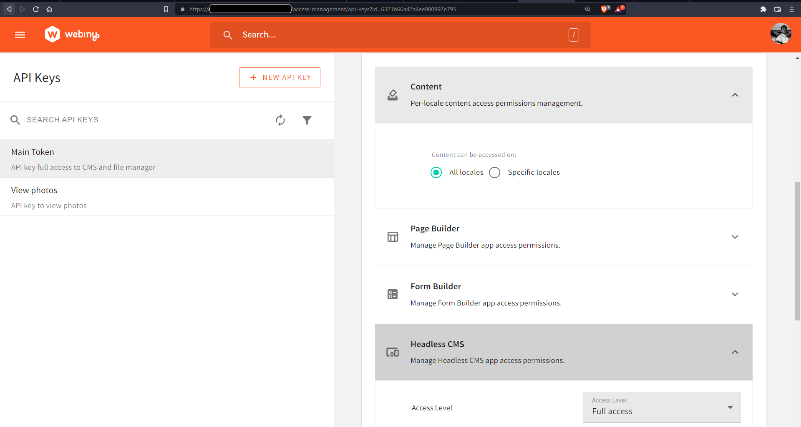

Also give it full access to the file manager:

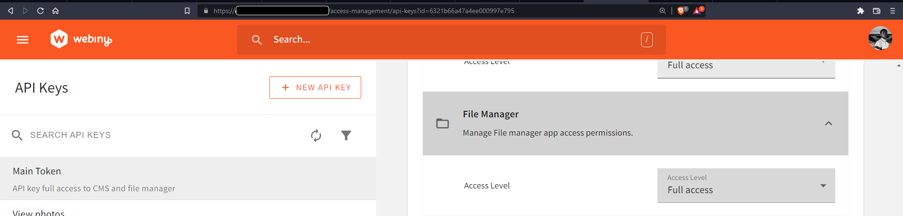

Save the API key and add it to the `.env` file of the Nuxt.js project as `WEBINY_MAIN_TOKEN`.

#### Configure Nuxt.js config

Now we can add the newly created API key along with the main and manage URLs of our  GraphQL endpoints to our nuxt.config.ts file:

```jsx
// ./nuxt.config.ts
import { defineNuxtConfig } from 'nuxt'
// https://v3.nuxtjs.org/api/configuration/nuxt.config
export default defineNuxtConfig({
  // ...
  runtimeConfig: {
    mainToken: process.env.WEBINY_MAIN_TOKEN,
    mainAPIURL: process.env.WEBINY_MAIN_URL,
    manageAPIURL: process.env.WEBINY_MANAGE_URL,
    public: {
      readToken: process.env.WEBINY_VIEW_TOKEN,
      readAPIURL: process.env.WEBINY_READ_URL
    }
  }
})
```

Here, you’ll notice that we did not add the new `mainToken`, `mainAPIURL` and `manageAPIURL` to the `public` property so that it can only be used on the server side.

Now we can proceed with our steps to upload a file to Webiny. First, we’ll create a bunch of server API routes:

- `/api/getPresignedPostData`: Receives the file `name`, `size`, and `type` of file and sends a request to get the pre-signed post-payload that will be used to upload the file. This allows the file upload to be done on the front end.
- `/api/createFile`: After the file has been uploaded, this route receives the `name`, `key`, `type`, `size` of the uploaded file and sends a `CreateFile` mutation to Webiny to add the file to the file manager.
- `/api/getAuthorByUsername`: Receives the username as a query parameter and makes a request to Webiny to see if that author exists and responds with the user information if the author exists.
- `/api/createAuthor`: Receives the username and name of the author and runs a `createAuthor` mutation to create the new author and then runs a `publishAuthor` mutation to publish the newly created author.
- `/api/createPhoto`: Receives the caption, URL of the image, and the `authorId` which is the `id` of the author. Then it runs a `createPhoto` mutation to create the photo entry. 
    Another mutation - `publishPhoto` to publish the newly created photo entry.

#### Create `getPresignedPostData` route

Create a new file - `./server/api/getPresignedPostData.post.js`

```jsx
// ./server/api/getPresignedPostData.post.js

import { sendReq } from "~~/composables/sendReq";
const { mainToken, mainAPIURL } = useRuntimeConfig();

export default defineEventHandler(async (event) => {
  const { name, type, size } = await useBody(event);

  const dataQuery = {
    query: `query($data: PreSignedPostPayloadInput!) {
      fileManager {
        getPreSignedPostPayload(data: $data) {
          data {
            data
            file {
              name
              type
              size
              key
            }
          }
        }
      }
    }
  `,
    variables: { data: { name, type, size } },
  };

  const data = await sendReq(mainAPIURL, {
    body: JSON.stringify(dataQuery),
    headers: {
      Authorization: `Bearer ${mainToken}`,
      "Content-Type": "application/json",
    },
  });

  return data ? data : (event.res.statusCode = 400);
});
```

Here, you’ll notice the `.post` in our route handler file name. This is a way to match the request HTTP method. This enables our route to handle `POST` requests. We also use the `useBody` composable in the event handler to get our data from the request body which we use as variables for our `getPreSignedPostPayload` query. We then make this request using the `sendReq` function to the `mainAPIURL` using the `mainToken`

### Create `createFile` route

Create a new file - `./server/api/createFile.post.js`

```jsx
// ./server/api/createFile.post.js
import { sendReq } from "~~/composables/sendReq";
const { mainAPIURL, mainToken } = useRuntimeConfig();
export default defineEventHandler(async (event) => {
  const { name, key, type, size, tags } = await useBody(event);

  const createFileMutation = {
    query: `mutation CreateFile($data: FileInput!) {
      fileManager {
        createFile(data: $data) {
          error {
            code
            message
            data
          }
          data {
            id
            name
            key
            src
            size
            type
            tags
            createdOn
            createdBy {
              id
            }
          }
        }
      }
    }`,
    variables: {
      data: {
        type,
        name,
        size,
        key,
        tags: tags ? tags : [],
      },
    },
  };

  const data = await sendReq(mainAPIURL, {
    body: JSON.stringify(createFileMutation),
    headers: {
      Authorization: `Bearer ${mainToken}`,
      "Content-Type": "application/json",
    },
  });

  return data ? data : (event.res.statusCode = 400);
});

```

As mentioned earlier, after the file has been uploaded, this route receives the `name`, `key`, type, `size`and `tags` of the uploaded file and adds it to the file manager by making `CreateFile` mutation.

### Create `getAuthorByUsername` route

Create a new file - `./server/api/getAuthorByUsername.js`

```jsx
// ./server/api/getAuthorByUsername.js
import { sendReq } from "~~/composables/sendReq";
export default defineEventHandler(async (event) => {
  const { readToken, readAPIURL } = useRuntimeConfig().public;
  const { username } = useQuery(event);

  const authorQuery = {
    query: `query($username: String!) {
      getAuthor(where: { username: $username }) {
        data {
          id
          name
          username
        }
      }
    }
    `,
    variables: { username },
  };
  const author = await sendReq(readAPIURL, {
    body: JSON.stringify(authorQuery),
    headers: {
      Authorization: `Bearer ${readToken}`,
      "Content-Type": "application/json",
    },
  });

  return author.getAuthor;
});

```

This route receives the author `username` as a query parameter so the `useQuery` composable is used to access it. Then it sends a `getAuthor` query to get the author by its username.

### Create `createAuthor` route

Create a new file - `./server/api/createAuthor.post.js`

```jsx
// ./server/api/createAuthor.post.js
import { sendReq } from "~~/composables/sendReq";
const { manageAPIURL, mainToken } = useRuntimeConfig();
// function to create author entry
const createAuthor = async ({ username, name, photos }) => {
  const createAuthorMutation = {
    query: `mutation($authorInput: AuthorInput!){
        createAuthor(data: $authorInput){
          data{
            id
          }
        }
      }`,
    variables: {
      authorInput: {
        username,
        name,
        photos: photos ? photos : [],
      },
    },
  };

  const res = await sendReq(manageAPIURL, {
    body: JSON.stringify(createAuthorMutation),
    headers: {
      Authorization: `Bearer ${mainToken}`,
      "Content-Type": "application/json",
    },
  });
  return res;
};

// function to publish created author entry
const publishAuthor = async (id) => {
  const publishAuthorMutation = {
    query: `mutation($id: ID!){
      publishAuthor(revision: $id){
        data{
          id
          username
          name
        }
      }
    }`,
    variables: {
      id,
    },
  };
  const res = await sendReq(manageAPIURL, {
    body: JSON.stringify(publishAuthorMutation),
    headers: {
      Authorization: `Bearer ${mainToken}`,
      "Content-Type": "application/json",
    },
  });

  return res;
};

export default defineEventHandler(async (event) => {
  try {
    const body = await useBody(event);

    // STEP 1
    // Create Author
    const createAuthorRes = await createAuthor(body);

    // get id of newly created Author
    const { id } = createAuthorRes.createAuthor.data;

    // STEP 2
    // Publish Author
    const publishAuthorRes = await publishAuthor(id);

    return publishAuthorRes.publishAuthor.data;
  } catch (error) {
    return { statusCode: (event.res.statusCode = 400), message: error };
  }
});

```

This route receives the `username`, `name` and `photos` of the author and creates the author in two steps:

- Step 1: Create author with the `createAuthor` function
- Step 2: Publish author with the `publishAuthor` function

### Create `CreatePhoto` route

Create a new file - `./server/api/createPhoto.post.js`

```jsx
// ./server/api/createPhoto.post.js

import { sendReq } from "~~/composables/sendReq";
const { manageAPIURL, mainToken } = useRuntimeConfig();

// function to create photo entry
const createPhoto = async ({ caption, url, authorId }) => {
  const createPhotoMutation = {
    query: `mutation($photoInput: PhotoInput!){
      createPhoto(data: $photoInput){
        data{
          id
          caption
          photo
          author{
            id
          }
        }
      }
    }`,
    variables: {
      photoInput: {
        caption,
        photo: url,
        author: { modelId: "author", id: authorId },
      },
    },
  };

  const res = await sendReq(manageAPIURL, {
    body: JSON.stringify(createPhotoMutation),
    headers: {
      Authorization: `Bearer ${mainToken}`,
      "Content-Type": "application/json",
    },
  });
  return res;
};
// function to publish created photo entry
const publishPhoto = async (id) => {
  const publishPhotoMutation = {
    query: `mutation($id: ID!){
      publishPhoto(revision:$id){
        data{
          id
          caption
          photo
          author{
            id
          }
          meta{
            status
            revisions{
              id
            }
          }
        }
      }
    }`,
    variables: {
      id,
    },
  };
  const res = await sendReq(manageAPIURL, {
    body: JSON.stringify(publishPhotoMutation),
    headers: {
      Authorization: `Bearer ${mainToken}`,
      "Content-Type": "application/json",
    },
  });
  return res;
};
export default defineEventHandler(async (event) => {
  try {
    const body = await useBody(event);

    // STEP 1
    // Create Photo
    const createPhotoRes = await createPhoto(body);

    // get id of newly created photo
    const { id } = createPhotoRes.createPhoto.data;

    // STEP 2
    // Publish Photo
    const publishPhotoRes = await publishPhoto(id);

    // return published photo
    return publishPhotoRes.publishPhoto.data;
  } catch (error) {

    return { statusCode: (event.res.statusCode = 400), message: error };
  }
});

```

Here, we receive `caption`, `url` and `authorId`. We also create the photo entry in two steps:

- Step 1: Create photo with the `createPhoto` function
- Step 2: Publish author with the `publishPhoto` function

Now that our routes have been created, we next have to create a new page in Nuxt.js to stitch all these together.

### Create a `PhotoForm` component

In order to be able to make all these requests above and upload a file to create a photo entry, we have to create a component to handle it. Create a new component  `./components/PhotoForm.vue` and enter the following code for the `<script>` section:

```jsx
// ./components/PhotoForm.vue
<script setup>
// get photo data from props, if any is provided
const { photoData, mode } = defineProps(["photoData", "mode"]);

// initial page state
// conditionally set default values incase photo data is not defined in props
const file = ref({
  url: photoData?.photo || "",
});
const caption = ref(photoData?.caption || "Caption");
const username = ref(photoData?.author.username || "miracleio");
const name = ref(photoData?.author.name || "");
const userId = ref(photoData?.author.id || "");

const authorExists = ref(false);
const isLoading = ref(false);
const data = ref({});

// init toast component state
const toastState = useToastState();
const setToastState = useSetToastState;
// header data to be used in POST fetch requests
let headers = {
  method: "POST",
  "Content-Type": "application/json",
};
// function to reset form state
const resetForm = (e) => {
  e.target.reset();
  file.value = null;
  caption.value = "";
  username.value = "";
  name.value = "";
  userId.value = null;
  authorExists.value = false;
  isLoading.value = false;
  data.value = {};
};
// function to handle file selection
const handleFileSelect = (e) => {
  // get file from file input button
  file.value = e.target.files[0];
  // create a temporary url to be used as `src` of preview image
  file.value.url = URL.createObjectURL(file.value);
  console.log({ file, url: file.value.url });
  // check if file selected is actually an image
  let isImage = file.value.type.includes("image");
  console.log({ isImage });
  // alert user and clear input and file values
  if (!isImage) {
    alert("Please select a valid image file");
    e.target.value = "";
    file.value = null;
  }
};
// function to get presigned payload data from webiny
const getPresignedPostData = async (fileData) => {
  console.log({ fileData });
  const res = await (
    await fetch("/api/getPresignedPostData", {
      ...headers,
      body: JSON.stringify(fileData),
    })
  ).json();
  return res.fileManager.getPreSignedPostPayload.data;
};
// function to upload file to s3 bucket
const uploadToS3 = async ({ url, fields }, file) => {
  console.log({ url, fields, file });
  const formData = new FormData();
  Object.keys(fields).forEach((key) => {
    formData.append(key, fields[key]);
  });
  // Actual file has to be appended last.
  formData.append("file", file);
  const res = await fetch(url, {
    method: "POST",
    "Content-Type": "multipart/form-data",
    body: formData,
  });
  return res;
};
// function to get payload data and upload file to s3 bucket
const uploadFile = async (fileData) => {
  // get payload data
  let preSignedPostPayload = await getPresignedPostData(fileData);
  // upload file to s3 bucket with payload data
  let upload = await uploadToS3(preSignedPostPayload.data, file.value);
  return { status: upload.status, preSignedPostPayload };
};
// function to create file in webiny dashboard
const createFile = async ({ name, key, type, size, tags }) => {
  console.log({ name, key, type, size, tags });
  const res = await (
    await fetch("api/createFile", {
      ...headers,
      body: JSON.stringify({ name, key, type, size, tags }),
    })
  ).json();
  console.log({ res });
  return res.fileManager.createFile.data;
};
// function to create photo entry
const createPhoto = async ({ caption, url, authorId }) => {
  let photoData = { caption, url, authorId };
  console.log({ photoData });
  const res = await (
    await fetch("/api/createPhoto", {
      ...headers,
      body: JSON.stringify(photoData),
    })
  ).json();
  return res;
};
// function to check if author exists
const checkAuthor = async () => {
  isLoading.value = true;
  setToastState({
    message: `Checking for @${username.value}`,
  });
  try {
    const res = await (
      await fetch(`api/getAuthorByUsername?username=${username.value}`)
    ).json();
    if (!res.data?.id) throw Error("No author found");
    userId.value = res.data.id;
    name.value = res.data.name;
    authorExists.value = true;
    isLoading.value = false;
    setToastState({
      message: `✅ Found author for @${username.value}`,
      code: "success",
    });
    return res.data;
  } catch (error) {
    console.log({ error });
    authorExists.value = false;
    setToastState({
      message: `No author found for @${username.value}.
          You can proceed to upload and a new author will be created`,
      code: "error",
    });
    isLoading.value = false;
    return null;
  }
};
// function to create author
const createAuthor = async (userData) => {
  let { username, name } = userData;
  const res = await (
    await fetch("api/createAuthor", {
      ...headers,
      body: JSON.stringify({ username, name }),
    })
  ).json();
  return res;
};
// function to handle form submit action
const handlePhotoSubmit = async (e) => {
  e.preventDefault();
  // check if author with current username exists
  let author = await checkAuthor();
  // activate loading state
  isLoading.value = true;
  // confirm whether to proceed with selected user name
  if (authorExists.value) {
    let confirmUsername = confirm(
      `The username @${username.value} is taken. Is ${name.value} the author of this image?`
    );
    // cancel process if user does not confirm to proceed
    if (!confirmUsername) return null;
  } else {
    // confirm new user creation
    let confirmUsername = confirm(
      `A new user for the username @${username.value} will be created for this photo. Is ${name.value} the author of this image?`
    );
    // cancel process if user does not confirm to proceed
    if (!confirmUsername) return null;
    // update toast state
    setToastState({
      message: `Creating new author for @${username.value}`,
    });
    // set local author state value to newly created author
    author = await createAuthor({
      username: username.value,
      name: name.value,
    });
    console.log({ author });
    // update toast state
    setToastState({
      message: `Author for @${username.value} created successfully`,
      code: "success",
    });
  }
  // get selected file details
  let { name: fileName, type, size } = file.value;
  console.log({ fileName, type, size });
  try {
    // update toast state
    setToastState({
      message: `Uploading file to storage...`,
    });
    // start upload file processes
    // rename destructured values returned by `uploadFile` in order to aviod name conflicts
    const {
      status,
      preSignedPostPayload: {
        file: { key, name: _name, size: _size, type: _type },
      },
    } = await uploadFile({ name: fileName, type, size });
    console.log({ key, _name, _size, _type });
    // throw error if uploadFile status does not return 204 code
    if (status == !204) {
      throw Error("Unable upload. An error occured");
    }
    // update toast state
    setToastState({
      message: `File uploaded successfully!`,
      code: "success",
    });
    // update toast state
    setToastState({
      message: `Adding file to dashboard...`,
    });
    // create file in webiny dashboard
    const file = await createFile({
      key,
      name: _name,
      size: _size,
      type: _type,
    });
    console.log({ file });
    console.log({ username, name, caption });
    // update toast state
    setToastState({
      message: `File added successfully!`,
      code: "success",
    });
    console.log({ caption: caption.value, url: file.src, authorId: author.id });
    // update toast state
    setToastState({
      message: `Creating photo entry...`,
    });
    // create photo entry
    const photo = await createPhoto({
      caption: caption.value,
      url: file.src,
      authorId: author.id,
    });
    console.log({ photo });
    // save final data to state
    data.value = photo;
    console.log({ data });
    // update toast state
    setToastState({
      message: `Photo created successfully!`,
      code: "success",
    });
    // reset form state
    resetForm(e);
  } catch (error) {
    console.log({ error });
    // set data to null
    data.value = null;
    error.value = error;
    // update toast state with error
    setToastState({
      message: `An error occured: ${error}`,
      code: "error",
    });
  }
  // end loading state
  isLoading.value = false;
};
</script>

```

That's quite a lot but let’s break it down and list out the functions defined here and what they do:

- `handleFileSelect(e)`: This function is fired by the `@change` handler of the file input and gets the selected file and checks if the file is an image.
If it is, it then saves the value of the selected file to `file` ref.
- `getPresignedPostData(fileData)`: Makes a request to our `/api/getPresignedPostData` endpoint with the selected file data and then returns the payload.
- `uploadToS3({ url, fields }, file)`: Takes in the `url` and `fields` data provided by the payload and `file` data contained in the component and makes a request to the `url` provided with the `fields` and `file` data to upload. Once the upload is complete, it responds with a `204` success code which the function returns.
- `uploadFile(fileData)`: Runs the previous two functions `getPresignedPostData` and `uploadToS3` and returns the upload status and payload data.
- `createFile({ name, key, type, size, tags })`: Makes a request to our `api/createFile` endpoint to add the file to our Webiny dashboard file manager.
- `createPhoto({ caption, url, authorId })`: Makes a request to `api/createPhoto` to create and publish a new photo entry
- `checkAuthor()`: Takes the username from the `username` ref and makes a request to the `api/getAuthorByUsername` which returns the author data or `null` if that author does not exist yet.
- `createAuthor(userData)`:Takes in the provided user data and makes a request to `api/createAuthor` to create and publish a new author with the details.
- `handlePhotoSubmit(e)`: Most importantly, we have this function that ties everything together and runs when the form is submitted. It:
    1. checks if author with the current username exists by assigning local variable `author` to `chechAuthor()` which returns null if the author does not exist
    2. activates loading state by setting `isLoading.value = true`
    3. Runs a condition to check if the author exists, if it does, it prompts the user to confirm if to proceed with the current user and if no author exists, it notifies the user that a new author will be created.
    4. Starts the file upload and photo creation process by running:
        - `uploadFile`
        - `createFile` and
        - `createPhoto`
    5. Saves the created photo data to component state `data.value = photo`
    6. Reset the form by running `resetForm(e)`
    7. Runs `setToastState()` at the different stages of the creation process to notify the user on the progress of the photo creation.
- `resetForm(e)`: Finally, resets the component state and clears the form

Now, let's add the `<template>` part of our component:

```html
<!-- ./components/PhotoForm.vue -->
<script setup> ... </script>
<template>
  <section class="upload-section">
    <header class="upload-header">
      <slot name="header">
        <h1>Upload a photo</h1>
      </slot>
    </header>
    <!-- Preview the image file with the URL provided -->
    <div class="file-preview">
      <div v-if="file" class="img-cont">
        
      </div>
    </div>
    <!-- Form container -->
    <div class="upload-cont">
      <form @submit="handlePhotoSubmit" id="upload-form" class="form">
        <div class="wrapper">
          <div class="form-section form-control upload">
            <input
              @change="handleFileSelect"
              type="file"
              name="photo"
              id="photo"
              accept="image/*"
              required
            />
          </div>
          <div class="form-section">
            <div class="form-control">
              <label for="caption">Caption</label>
              <input
                id="caption"
                name="caption"
                type="text"
                class="form-input"
                required
                v-model="caption"
                :disabled="isLoading"
              />
            </div>
            <div class="form-group">
              <div class="form-control">
                <label for="username">Username</label>
                <input
                  id="username"
                  name="username"
                  type="text"
                  class="form-input"
                  required
                  v-model="username"
                  @change="authorExists = false"
                  :disabled="isLoading"
                />
              </div>
              <div class="form-control">
                <label for="name">Name</label>
                <input
                  id="name"
                  name="name"
                  type="text"
                  class="form-input"
                  required
                  :value="name"
                  @change="(e) => !authorExists && (name = e.target.value)"
                  :disabled="isLoading || authorExists"
                />
              </div>
              <div class="action-cont check-user">
                <button
                  @click="checkAuthor"
                  :class="{ valid: authorExists }"
                  class="cta alt"
                  type="button"
                  :disabled="authorExists"
                >
                  {{ isLoading ? "..." : authorExists ? "✅" : "🔍" }}
                </button>
              </div>
            </div>
          </div>
          <div class="action-cont">
            <button type="submit" class="cta" :disabled="isLoading">
              {{
                isLoading
                  ? "..."
                  : authorExists
                  ? "Upload"
                  : "Upload as new Author"
              }}
            </button>
          </div>
        </div>
      </form>
    </div>
  </section>
</template>

```

Before we can run this, however, we need to set up our `toastState` composable which allows us to manage the state of our `<Toast />` component used to inform the user of the status of the process.

### Set up toastState composable

Create a new file: `./composables/toastState.js`:

```jsx
export const useToastState = () => {
  return useState("toast-state", () => ({
    message: "✅ It's Quiet now...",
    code: "success",
    active: false,
    time: 8000,
  }));
};
export const useSetToastState = ({
  message,
  code = "loading",
  active = true,
  time = 8000,
}) => {
  return useState("set-toast-state", () => {
    message && (useToastState().value.message = message);
    useToastState().value.code = code;
    useToastState().value.active = active;
    useToastState().value.time = time;
    console.log({ useToastState: useToastState().value });
  });
};

```

Here, we have two main functions:

- `useToastState` returns the state values
- `useSetToastState` modifies the `useToastState` values

Now that we have defined the state, we can create the `<Toast />` component

### Create `<Toast />` component

Create a new file - `./components/Toast.vue`

```jsx
// ./components/Toast.vue
<script setup>
// init component state
const state = useToastState();
const setState = useSetToastState;

// variable to store SetTimeout ID
let timeout;

// computed property to dynamically assign the `code` and `active` state to component class
const computedClass = computed(() => {
  let code = state.value.code;
  let active = state.value.active;
  return {
    success: code == "success",
    error: code == "error",
    loading: code == "loading",
    active,
  };
});

// Watch for change in state
// set up timeout functionality to automatically reset and hide component
watch(state.value, (value) => {
  console.log({
    message: value.message,
    code: value.code,
    active: value.active,
  });
  if (state.value.active) {
    clearTimeout(timeout);
    timeout = setTimeout(() => {
      setState({ active: false });
      console.log({ state: state.value });
    }, state.value.time);
  }
});
</script>
<template>
  <div class="toast" :class="computedClass">
    <div class="wrapper">
      <slot> {{ state.message }}</slot>
    </div>
  </div>
</template>

```

Great! Now we can create the page that will render our form.

### Create `/new` page to render the form

Create a new file - `./pages/new.vue`

```jsx
// ./pages/new.vue
<script setup>
// add page meta
useHead({
  title: "Add new",
});
</script>
<template>
  <main class="site-main new">
    <div class="wrapper">
      <PhotoForm>
        <template v-slot:header>
          <h1>Create a Photo</h1>
        </template>
      </PhotoForm>
    </div>
  </main>
</template>
```

### Add `/new` page route to site header

Back in `./components/SiteHeader.vue` we can add a link to our new page:

```html
<!-- ./components/siteHeader.vue -->
<template>
  <header class="site-header">
    <div class="wrapper">
      <!-- ... -->
      <nav class="site-nav">
        <ul class="links">
          <!-- ... -->
          <li class="link">
            <NuxtLink to="/new">New</NuxtLink>
          </li>
        </ul>
      </nav>
    </div>
  </header>
</template>
```

Now if we start our dev server, we should be able to upload images as shown in the video below:

<video width="800px" height="auto" controls autoplay>
  <source src="./assets/build-photo-sharing-app-nuxt-webiny-headless-cms/nuxt-ui-file-upload.mp4" type="video/mp4" />
</video>

## Conclusion

So far we’ve seen how we can use the Headless CMS feature of Webiny to power a photo gallery app built with Nuxt.js. We covered how to structure our CMS by creating the content models we need which includes:

- Photos content model
- Author content model

We also looked at how to create API Tokens to access content at specific permission levels.
With the API tokens, we were able to create server routes with GraphQL requests in the Nuxt.js project, which in turn allows us to fetch and create data in our Headless CMS without exposing our API tokens.

Another important concept we covered was how to upload files to our Webiny dashboard which involves:

- Get a `PreSignedPostPayload` data with file data from Webiny
- Upload file to the Amazon S3 bucket with the `PreSignedPostPayload` data
- Add the file to the Webiny file manager using the `createFile` query

With that, we were able to add the file URL to the Photo entry using the `CreatePhoto` mutation.

**Full source code:** https://github.com/webiny/write-with-webiny/tree/main/tutorials/nuxt-photo-sharing-app

---

This article was written by a contributor to the Write with Webiny program. Would you like to write a technical article like this and get paid to do so? [Check out the Write with Webiny GitHub repo](https://github.com/webiny/write-with-webiny/).

