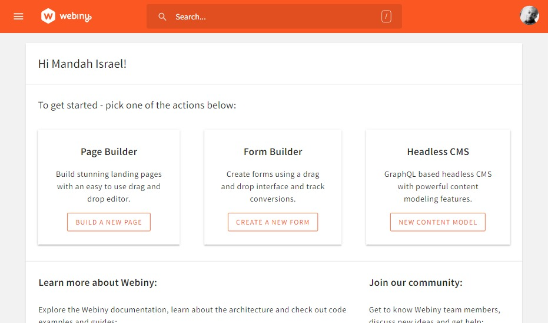
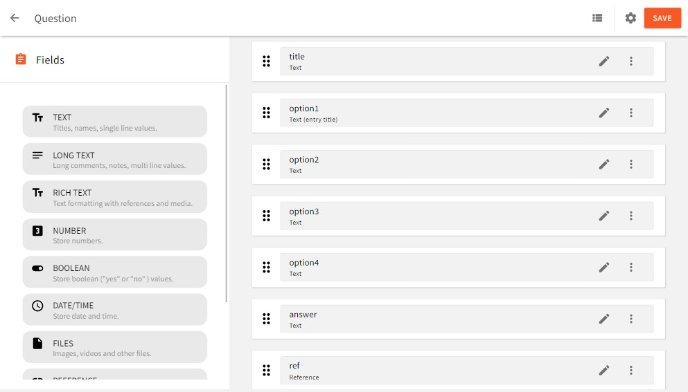
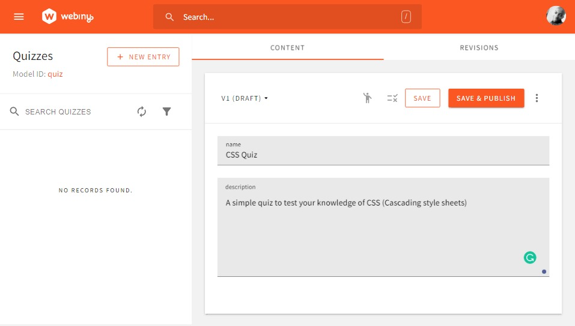
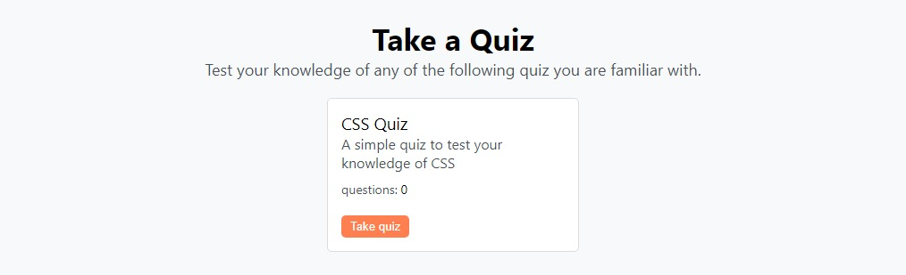
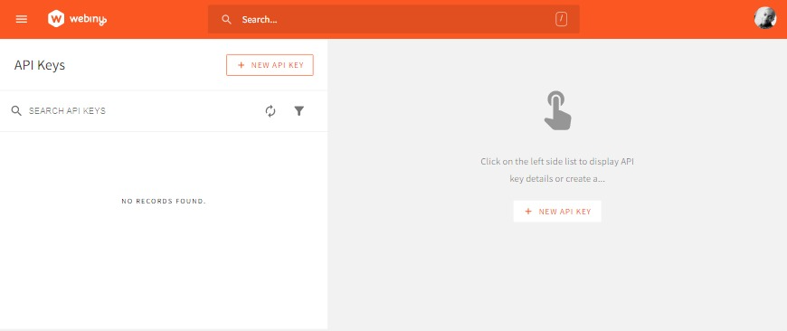

Building an application to host quizzes is a popular coding challenge. Often, though, the questions and answers are hard-coded into the application itself. But what if you needed to update them? In this tutorial, we will store questions and answers in Webiny Headless CMS and render a quiz UI using Angular.

## Prerequisites

To follow along, you need to have the following:

- Basic knowledge of Angular and GraphQL.
- Angular CLI installed.
- [AWS account](https://www.webiny.com/docs/infrastructure/aws/configure-aws-credentials) with credentials set up on your system.
- Node.js >=14 and yarn ^1.22.0 || >=2 installed in your system.

## Introduction to Webiny

Webiny is an open-source serverless CMS that offers enterprise-grade functionalities while allowing us to define our own security parameters based on our requirements. Being serverless, the infrastructure has been abstracted away allowing engineers to focus on deliverables.

Webiny includes several features, among which is its GraphQL-based Headless CMS for storing and managing content, which can then be accessed via its content delivery API using our native tools.

In this tutorial, to build a Quiz app we will be using the Webiny Headless CMS.

### Setting up our Webiny Headless CMS

To get started, we need to first create a Webiny project, deploy it and then model our content in the headless CMS using the generated Admin app.

To create a new Webiny project, enter the following command in the terminal:

```bash
npx create-webiny-project webiny-quiz
```

After running, when prompted to choose a database, select **DynamoDB** which is suitable for our use case.
Once the new project has been created, we can then cd into it and deploy it with the following commands.

```bash
cd webiny-quiz
yarn webiny deploy
```

After deployment is done a URL to the Admin app, GraphQL API endpoints, and React website will be printed out in the terminal which we will use shortly.

We can find the API endpoints at any time by running `yarn webiny info --env=dev` from the Webiny folder in the terminal.

If we don’t want to do the installation ourselves, we can get a fully featured demo by filling out this form: [http://webiny.typeform.com/to/VYffkZlR](http://webiny.typeform.com/to/VYffkZlR).

### **Defining Content Model in the Admin App**

Here we will define the structure of the content we want to store in the CMS which can be done in the generated Admin app. For our use case, we will have a **Quiz** and **Question** model. As their name implies **Quiz** will hold the quizzes like CSS quiz, React quiz, etc, while **Question** will hold the questions as well as the options and answers for all quizzes.

Now open the Admin app by clicking on its URL which was printed in the terminal earlier when we deployed our project.
If it's the first time accessing the Admin app, we will be prompted to create a default user with our details. After doing so, we will be taken to the welcome page:



Now to create our models, navigate to the **Content Models** page by clicking on **NEW CONTENT MODEL** under **Headless CMS,** and on the next page click on **New Modal** at the top of the page and we will see a prompt with a form to add some information for a new Content Model. which looks like this:

.png)

For the **Quiz** model, enter **Quiz** in the name field then click on the **CREATE MODEL** button. Once the model has been created we will be taken to a page where we can add its fields. we will be doing that shortly. For now, navigate back to the **Content Models** page, and let’s create a **Question** model following the same process as was done with the **Quiz** model.

Each model has a page where we can add different field types by dragging and dropping the needed fields in the drop zone which looks like the following:

.png)

After creating a model we will be taken to this page. You can navigate to it by clicking on thweree edit icon of a model on the **Content Models** page.

Let’s create the field for our models. For the **Quiz** model, create the following fields:

- **TEXT** field with label: `name`.
- **LONG TEXT** field with label: `description`.
    
.png)
    

Then click on the **SAVE** button at the top right of the page.
For the **Question** model:

- Six **TEXT** fields with labels: **title**, **option1**, **option2**, **option3**, **option4,** and **answer**.
- **REFERENCE** field with label **ref** and Content Models **Quiz**.
    

    

Then click on **Save.**

### Adding content

Now that we have defined our models let’s start adding content to them.
To add quizzes, in the sidebar, expand the **Headless CMS** tab, under the **UNGROUPED** section click on **Quizzes** and we will see the following page:

_1.png)

Next, click on the **NEW ENTRY** button, and on the prompt that appears, enter the name and description of the quiz, then click on **SAVE & PUBLISH** at the top right of the page.



Here we can add as many quizzes as we want.
Next, let’s add the questions. On the sidebar, click on **Questions,** then in the next page click on **NEW ENTRY** and add the title, options to choose from for answering the question, the answer to the question, and a reference to a quiz the question is for.

_2.png)

After that, click on **SAVE & PUBLISH.** Make sure to add more than one question for a quiz. It's important for the rest of the tutorial.

## Setting up the Frontend application

Here, we will start by creating a new angular app and building the UI for the Quiz app. Then later on we will integrate Webiny into it adding the functionalities.

The quiz app will contain a **quizzes** page that shows a list of quizzes created in our CMS, a **quiz** page that will display the questions for a quiz in a paginated pattern, and a **score** page that will display the total score from the answered questions in a quiz.
Here are images showing what we will be building:

_1.png)

_1.png)

.png)

### **Initiating an Angular app**

To generate a new angular app, enter the following commands in the terminal:

```bash
ng new quiz-app
```

When prompted, pick CSS for styling and add router to the app. The above will create a starter angular app called **quiz-app**.
Next, let’s install [Apollo Client](https://www.apollographql.com/docs/react/#:~:text=Apollo%20Client%20is%20a%20comprehensive,while%20automatically%20updating%20your%20UI.)) to work will GraphQL in our app. Enter the following command:

```bash
ng add apollo-angular
```

When prompted to add a URL, leave it blank. We will set that up later. Since we are using the `ng-add` command, all the required packages will be installed and the module for initializing Apollo client will be created in the **app** folder named `graphql-module.ts`.

Now let’s clean up the app a little, removing codes that are not needed. Open the created app in a code editor and first modify `src/app/app.component.html` to the following:

```jsx
<div></div>
```

Next, add the following styling to **src/styles.css**:

```css
body {
  background-color: rgb(248,249,250);
  min-width: 100vh;
  font-family: system-ui;
}

* {
  margin: 0;
  padding: 0;
}

.container {
  width: 90%;
  margin: 0 auto;
}

```

Now, let’s start the development server with the `ng serve` command.

### **Building the interfaces with Angular**

Let’s start by creating the pages and components we will be using and setting up the routes.
For pages, in the terminal, make sure you are in the root directory of the app and enter the following commands:

```bash
# For Bash
for page in quizzes quiz score; do ng g c --module app "pages/${page}"; done

# For Windows
for %n in (quizzes, quiz, score) do ng g c --module app pages/%n
```

And for the components, enter the following commands in the terminal:

```bash
# For Bash
for comp in quizCard question; do ng g c --module app "components/${comp}"; done

# For Windows
for %n in (quizCard, question) do ng g c --module app components/%n
```

After entering the above commands, here is what the folders in **src/app** will look like:

```markdown
app
 ┣ components
 ┃ ┣ question
 ┃ ┗ quiz-card
 ┣ pages
 ┃ ┣ quiz
 ┃ ┣ quizzes
 ┃ ┗ score
```

Now, let’s define the routes. In `src/app/app-routing.module.ts` add the following imports and modify the `routes` variable:

```jsx
import { QuizComponent } from './pages/quiz/quiz.component';
import { QuizzesComponent } from './pages/quizzes/quizzes.component';
import { ScoreComponent } from './pages/score/score.component';

const routes: Routes = [
  {path: '', component: QuizzesComponent},
  {path: 'quiz/:id', component: QuizComponent},
  {path: 'score', component: ScoreComponent}
];
```

Next, modify `src/app/app.component.html` to the following:

```jsx
<div>
  <router-outlet></router-outlet>
</div>
```

Now, let’s build the interface. For now, in the interface, we will be using mock data in order to add the right styling, but later on, we will fetch and display the one from our CMS.

We will start with the **quizzes** page. On the **quizzes** page, each quiz will be displayed in the form of a card which will be a component on its own. Let’s create the UI for that component.

Head over to the `app/components/quiz-card/quiz-card.component.ts` file and add the following import:

```jsx
import { Input } from '@angular/core';
```

Next, let’s add the properties we will use later on in this tutorial. Add the following lines of code before the `constructor` in the `QuizCardComponent` class:

```jsx
@Input() quizData: any;
questionsLength = 0
```

Next, modify its HTML file `quiz-card.component.html` file to the following:

```jsx
<div class="quizCard">
  <h3>CSS Quiz</h3>
  <p>A simple quiz to test your knowledge of CSS</p>
  <span>questions: <span>{{questionsLength}}</span></span>
  <button [routerLink]="['quiz', 1]">Take quiz</button>
</div>
```

Then add the following styling to `quiz-card.component.css`:

```css
.quizCard {
  background-color: white;
  padding: 15px;
  border-radius: 5px;
  border: 1px solid gainsboro;
  text-align: left;
  max-width: 250px;
  display: flex;
  justify-content: space-between;
  flex-direction: column;
}
.quizCard h3 {
  font-weight: 400;
}
.quizCard p {
  color: rgb(73,80,87);
}
.quizCard > span {
  display: block;
  margin-top: 10px;
  font-size: 14px;
  margin-bottom: 20px;
  color: rgb(73,80,87);
}
.quizCard span span {
  color: black;
}
.quizCard button {
  padding: 5px 10px;
  background-color: coral;
  border-radius: inherit;
  border: none;
  color: white;
  width: fit-content;
}
.quizCard button:hover {
  background-color: rgb(254, 111, 59);
}
```

Now, let’s render the **quizCard** component on the **quizzes** page. Head over to the `app/pages/quizzes/quizzes-component.html` file and modify it to the following:

```jsx
<div class="quizzes container">
  <h2>Take a Quiz</h2>
  <p>Test your knowledge of any of the following quiz you are familiar with.</p>
  <div class="quizzes__list">
    <app-quiz-card></app-quiz-card>
  </div>
</div>
```

Next, add the following styling to `quizzes.component.css`:

```css
.quizzes {
  text-align: center;
}
.quizzes h2 {
  font-size: 34px;
  margin-top: 20px;
}
.quizzes p {
  color: rgb(73,80,87);
  margin-bottom: 20px;
  font-size: 18px;
}
.quizzes__list {
  display: flex;
  flex-wrap: wrap;
  justify-content: center;
  gap: 5px;
  margin: 0 auto;
  max-width: 1000px;
}
app-quiz-card {
  display: flex;
}
```

With this, when we open our app in the browser, we will see the following:



Next, let’s work on the interface for the **quiz** page. Head over to the `app/components/question.component.ts` file and add the following import:

```jsx
import { Input, Output, EventEmitter } from '@angular/core';
```

Next, to add the properties we will use later on. Add the following lines of code before the `constructor` in the `QuestionComponent` class:

```jsx
@Input() question: any;
@Input() questionNumber!:number;
@Input() quiz: any;
@Input() quizLength!:number;
selectedOption = ''
@Output() nextQuestion: EventEmitter<any> = new EventEmitter();
@Output() prevQuestion: EventEmitter<any> = new EventEmitter();
```

Next, in its HTML file `question.component.html`, add the following lines of code:

```jsx
<div class="question container">
  <h2>CSS Quiz</h2>
  <p>A simple quiz to test your CSS knowledge</p>
  <div class="question__body">
    <h4>Which of this is a CSS framework</h4>
    <div class="question__bodyOpt">
      <div><span>A.</span> Jquery</div>
      <div><span>B.</span> Bootstrap</div>
      <div><span>C.</span> SASS</div>
      <div><span>D.</span> Less</div>
    </div>
    <div class="question__btn">
      <button><</button>
      <span>1/5</span>
      <button>></button>
    </div>
  </div>
</div>

```

Next, add the following styles to the `question.component.css` file:

```css
.question {
  margin-top: 30px;
  text-align: center;
}
.question h2 {
  font-size: 34px;
}
.question p {
  color: rgb(73,80,87);
  font-size: 18px;
}
.question__body {
  background-color: white;
  max-width: 800px;
  margin: 0 auto;
  margin-top: 20px;
  padding: 20px;
}
.question__body h4 {
  margin-bottom: 10px;
}
.question__bodyOpt {
  display: flex;
  flex-wrap: wrap;
  gap: 10px;
}
.question__bodyOpt > div {
  padding: 10px;
  flex-basis: calc(50% - 5px);
  flex-grow: 1;
  text-align: left;
  min-width: 200px;
  box-sizing: border-box;
  border: 1px solid gainsboro;
  cursor: pointer;
}
.question__bodyOpt > div:hover{
  background-color: gainsboro;
}
.question__bodyOpt span {
  margin-right: 20px;
}
.question__btn {
  margin-top: 10px;
  display: flex;
  color: gray;
  justify-content: space-around;
}
.question__btn button {
  background-color: transparent;
  color: gray;
  border: 1px solid gray;
  border-radius: 10px;
  height: fit-content;
  padding: 3px 20px;
}
.question__btn button:hover{
  background-color: rgb(248,249,250);
}
.question .question__submit {
  background-color: coral;
  padding: 5px 15px;
  color: white;
  border: none;
}
.question .question__submit:hover {
  background-color: rgb(254, 108, 55);
}
.selected {
  background-color: coral;
  color: white;
}
```

Then head over to the `app/pages/quiz/quiz.component.html` file and modify it to the following:

```jsx
<div class="quiz">
  <app-question></app-question>
</div>
```

With this, when you navigate to [http://localhost:4200/quiz/1](http://localhost:4200/quiz/1) in our browse we will see the following:

_3.png)

Next, let’s work on the interface for the **score** page. Head over the `app/pages/score/score.component.html` file and modify it to the following:

```jsx
<div class="score container">
  <h2>CSS Quiz</h2>
  <p>A simple quiz to test your CSS knowledge</p>
  <div class="score__body">
    <h3>Congratulation!!!</h3>
    <p>Below are your details:</p>
    <div class="score__details">
      <div>
        Total Questions Attempted: <span>5</span><br>
        Total Wrong Answered: <span>1</span><br>
        Total Correct Answers: <span>4</span><br>
      </div>
      <div>
        Score:
        <span>
          4/5
        </span>
      </div>
    </div>
  </div>
</div>

```

Now add the following styles to the **score.component.css** file:

```css
.score {
  margin-top: 30px;
  text-align: center;
}
.score h2 {
  font-size: 34px;
}
.score p {
  color: rgb(73,80,87);
  font-size: 18px;
}
.score__body {
  background-color: white;
  max-width: 800px;
  margin: 0 auto;
  margin-top: 20px;
  padding: 20px;
}
.score__details {
  display: flex;
  justify-content: space-between;
}
.score__details > div:first-child {
  text-align: left;
  color: rgb(73,80,87);
  line-height: 30px;
}
.score__details > div:first-child span {
  color: black;
}
.score__details > div:last-child span {
  display: block;
  font-size: 24px;
  padding: 20px;
  border-radius: 4px;
  background-color: coral;
  color: white;
}

```

With this, when we navigate to [http://localhost:4200/score](http://localhost:4200/score) in our browser we will see the following:

_2.png)

### **Initializing Apollo Client**

To initialize Apollo Client so that we can start using it to interact with Webiny, we need to get the API token and the correct Headless CMS API endpoint. Once we get them we will store them as environment variables in the `app/environments/environment.ts` file as follows:

```jsx
export const environment = {
  production: false,
  apiUrl: "<api-url-here>",
  apiToken: "<api-token-here>"
};
```

Note: Both the API token and URL are sensitive information. After filling them out make sure not to commit them to Git history.

To get the API token, head over to the Webiny Admin app, in the sidebar, expand the **Settings** tab and we will see **API keys** under the **ACCESS MANAGEMENT** section. Click on it and we will see the following page:



Next, click on **NEW API KEY** and a prompt will appear where we can set up our API token. First, enter the name and description of the API token.

_4.png)

Next, scroll down to the **Content** tab, expand it and select **All locales.**

_3.png)

Next, scroll to the **Headless CMS** tab, expand it and make the following changes which include selecting the API type and model we the generated token to have access to.

_2.png)

_1.png)

Then click on the **SAVE API KEY** at the bottom of the page and the API token will be visible at the top of the page:

.png)

Copy and save it as an environment variable just as described above.

Next, let's get the endpoint. in the sidebar click on **API Playground,** then in the playground click on the **Headless CMS - Read API** tab at the top of the page, copy the URL directly below the tab and supply it as environment variable.

.png)

Now to initialize Apollo Client, head over to the `src/app/graphql-module.ts` file and modify it to the following:

```jsx
import {NgModule} from '@angular/core';
import {APOLLO_OPTIONS} from 'apollo-angular';
import {ApolloClientOptions, InMemoryCache, ApolloLink } from '@apollo/client/core';
import {HttpLink} from 'apollo-angular/http';
import { setContext } from '@apollo/client/link/context';
import { environment } from './../environments/environment';

const uri = environment.apiUrl
const auth = setContext(() => {
  return {
    headers: {
      Authorization: `Bearer ${environment.apiToken}`
    }
  }
})

export function createApollo(httpLink: HttpLink): ApolloClientOptions<any> {
  return {
    link: ApolloLink.from([auth, httpLink.create({ uri })]),
    cache: new InMemoryCache(),
  };
}

@NgModule({
  providers: [
    {
      provide: APOLLO_OPTIONS,
      useFactory: createApollo,
      deps: [HttpLink],
    },
  ],
})

export classOnChanges GraphQLModule {}
```

Next, in the `src/app/app.module.ts` file, add the following import:

```jsx
import { ApolloModule } from 'apollo-angular';
```

Then, add `ApolloModule` to the import property:

```jsx
imports: [
  // ...
  ApolloModule,
],
```

With this, we can now start sending GraphQL requests to Webiny.

### **Fetching all Quiz**

To do this first let’s create a service where all our GraphQL requests will be done. Enter the following command in the terminal:

```bash
ng g s services/quiz
```

This will create a quiz service in a **services** folder in **app.**
Now, let’s write our first query which will be for fetching all quizzes in our CMS. In `app/services/quiz.service.ts` add the following import and query.

```jsx
import { Apollo, gql } from 'apollo-angular'

const GET_QUIZZES = gql`{
    listQuizzes {
      data {
        id
        name
        description
      }
    }
  }
`
```

Next, to inject Apollo into this service, modify the class constructor to the following:

```jsx
constructor(private apollo: Apollo) { }
```

Next, add the following method after the `constructor` for sending query requests to get all quizzes.

```jsx
getQuizzes() {
  return this.apollo.watchQuery<any>({
    query: GET_QUIZZES
  })
}
```

To use this function, head over to `app/pages/quizzes/quizzes.component.ts` and add the following import:

```jsx
import { QuizService } from 'src/app/services/quiz.service';
```

Then modify the `QuizzesComponent` to the following:

```jsx
export class QuizzesComponent implements OnInit {
  quizzes = []

  constructor(private quizService: QuizService) {}

  ngOnInit(): void {
    this.quizService.getQuizzes().valueChanges.subscribe(({data}) => {
      this.quizzes = data.listQuizzes.data
    })
  }
}
```

In the above code, we fetch our quizzes and store them in a `quizzes` array variable which will be iterated over in the template to display the quizzes.

Head over to the `quizzes.component.html` file and modify it to the following:

```jsx
<div class="quizzes container">
  <h2>Take a Quiz</h2>
  <p>Test your knowledge of any of the following quiz you are familiar with.</p>
  <div class="quizzes__list" *ngFor="let quiz of quizzes">
    <app-quiz-card [quizData]="quiz"></app-quiz-card>
  </div>
</div>
```

Next, modify the `app/components/quiz-card/quiz-card.component.html` file to the following:

```jsx
<div class="quizCard">
  <h3>{{quizData.name}}</h3>
  <p>{{quizData.description}}</p>
  <span>questions: <span>{{questionsLength}}</span></span>
  <button [routerLink]="['quiz', quizData.id]">Take quiz</button>
</div>
```

With this, quizzes in our CMS should now be displayed. Right now if you notice the length of the questions displayed in the quiz card is 0 which is static. Let’s fix that.

To fix this, we will use the ID of a quiz to fetch all its questions and then display their length. Head over to `app/services/quiz.services` and add the following query after `GET_QUIZZES`:

```jsx
const GET_QUESTIONS = gql`
  query GetQuestions($where:QuestionListWhereInput){
    listQuestions(where: $where) {
      data {
        title
        option1
        option2
        option3
        option4
        answer
      }
    }
  }
`
```

Next, add the following method for fetching all the questions of a quiz when the quiz id is passed to it `getQuizzes`:

```jsx
getQuestions(id:string) {
  return this.apollo.watchQuery<any>({
    query: GET_QUESTIONS,
    variables: {
      where: {ref: {id}}
    }
  })
}
```

Next, head over `app/components/quiz-card/quiz-card.component.ts` and import the quiz service:

```jsx
import { QuizService } from 'src/app/services/quiz.service';
```

Next, modify the class `constructor` and `ngOnInit` method to the following:

```jsx
constructor(private quizService: QuizService) {}

ngOnInit(): void {
  this.quizService.getQuestions(this.quizData.id).valueChanges.subscribe(({data}) => {
    this.questionsLength = data.listQuestions.data.length
  })
}
```

The above code fetches all questions for a quiz and then modifies the `questions` variable to the length of the fetched questions. With this, the problem is solved.

### **Implementing the quiz functionality**

If we click on the **Take quiz** button on a quiz in our app we will be taken to the quiz page. On the quiz page, all the questions for a quiz will be displayed in a paginated pattern, we will be able to select the answers to questions and submit the quiz to get the result. Right now it's just mock data that's been displayed with no functionalities included. Let’s work on that.

First, let’s replace the mock data with the one from our CMS and add the pagination functionality where we can go to the next or previous question if it exists by clicking a button.

Head over to the `app/services/quiz.service.ts` file let’s create a function to fetch the data for a single quiz so it can be used to replace the static on the quiz page.
Add the following query after `GET_QUESTIONS`:

```jsx
const GET_QUIZ = gql`
  query GetQuiz($where:QuizGetWhereInput!){
    getQuiz(where: $where) {
      data {
       name
       description
      }
    }
  }
`
```

Next, add the following lines of code after the `getQuestions` method:

```jsx
getQuiz(id:string) {
  return this.apollo.watchQuery<any>({
    query: GET_QUIZ,
    variables: {
      where: {id}
    }
  })
}
```

Next, head over to the `app/pages/quiz/quiz.component.ts` and add the following imports:

```jsx
import { QuizService } from 'src/app/services/quiz.service';
import { ActivatedRoute } from '@angular/router';
```

Next, modify the `QuizComponent` to the following:

```jsx
export class QuizComponent implements OnInit {

  quiz = [];
  quizLength = 0
  questions = [];
  questionNumber = 0;
  id!:string;

  constructor(
    private quizService: QuizService,
    private route: ActivatedRoute
  ) { }

  goToNext() {
    this.questionNumber++
  }
  goToPrevious() {
    this.questionNumber--
  }

  ngOnInit(): void {
    this.id = this.route.snapshot.paramMap.get('id')!
    this.quizService.getQuestions(this.id)
    .valueChanges
    .subscribe(({data}) => {
      this.questions = data.listQuestions.data
      this.quizLength = data.listQuestions.data.length
    })

    this.quizService.getQuiz(this.id)
    .valueChanges
    .subscribe(({data}) => {
      this.quiz = data.getQuiz.data
    })
  }
}
```

Above, in the `ngOnInit` method, we are fetching all questions and the quiz whose ID is attached as a parameter to the URL and storing the returned data in the corresponding properties.

We have also created a `goToNext` and `goToPrevious` method for increasing and decreasing the `questionNumber` property respectively. We are doing this because we will be using the `questionNumber` property to get a single question object in the `questions` array (`questions[questionNumber]`) which will be displayed in the UI. This way when one (1) is added `questionNumber` the next question will be displayed and when one (1) is subtracted, the previous question will be displayed creating the pagination functionality.

Next, modify its HTML file `quiz.component.html` to the following:

```jsx
<div class="quiz">
  <app-question
    [question]="questions[questionNumber]"
    [questionNumber]="questionNumber+1"
    [quiz]="quiz"
    [quizLength]="quizLength"
    (nextQuestion)="this.goToNext()"
    (prevQuestion)="this.goToPrevious()"
  ></app-question>
</div>
```

Now head over to the `app/components/question.component.html` file and modify it to the following:

```jsx
<div class="question container">
  <h2>{{quiz?.name}}</h2>
  <p>{{quiz?.description}}</p>
  <div class="question__body">
    <h4>{{question?.title}}</h4>
    <div class="question__bodyOpt">
      <div *ngFor="let option of [
        {label: 'A', value: question?.option1},
        {label: 'B', value: question?.option2},
        {label: 'C', value: question?.option3},
        {label: 'D', value: question?.option4},
      ]">
        <span>{{option.label}}.</span>{{option.value}}
      </div>
    </div>
    <div class="question__btn">
      <button
        (click)="this.prevQuestion.emit()"
        [disabled]="questionNumber === 1"><</button>
      <span>{{questionNumber}}/{{quizLength}}</span>
      <button
        (click)="this.nextQuestion.emit()"
        *ngIf="questionNumber !== quizLength"
        [disabled]="questionNumber === quizLength">></button>
      <button
        class="question__submit"
        *ngIf="questionNumber === quizLength">
        Submit
      </button>
    </div>
  </div>
</div>
```

With the above code, we are replacing the mock data with the one from our CMS, disabling the previous button when the first question is displayed and replacing the next button with a submit button when the last question is displayed.

Now let’s work on highlighting the selected option for a question. Head over the `app/services/quiz/services.ts` file and add the following property to the class:

```jsx
answers: any[] = []
```

Next, add the following method after `getQuiz` method:

```jsx
pickedAnswer(selectedOption:string, correctAnswer:string, questionNumber:number) {
  let alreadyAnswered = this.answers.filter(answer => (
    Object.values(answer).includes(questionNumber)
  )).length
  if(alreadyAnswered === 0){
    this.answers = [...this.answers, {questionNumber, selectedOption, correctAnswer}]
  }else {
    let answerIndex = this.answers.findIndex(answer => (
      questionNumber === answer.questionNumber
    ))
    this.answers[answerIndex].selectedOption = selectedOption
  }
}
```

The above method will be called whenever a question is answered. It will be used to store the selected option for the question, the correct answer to the question, and the question’s number as an object in the `answers` array property. So each answered question will be represented as an object in the `answers` array.
Doing it this way will enable us to highlight the selected option for any question,  by using its number to filter out the right object from `answers` then highlighting the option that is equal to the one in the object. Also, when we want to calculate the total score for a quiz we can compare the selected option for a question and the answer to the question present in every object in the `answers` array to find out which question was answered correctly.

Now to call the above function Head over to `app/component/question/question.components.ts` and first import the quiz service:

```jsx
import { QuizService } from 'src/app/services/quiz.service';
```

Next, inject the service and add the following method:

```jsx
constructor(private quizService: QuizService) { }

selectOption(selectedOption:string, correctAnswer:string, questionNumber:number) {
    this.selectedOption = selectedOption
    this.quizService.pickedAnswer(selectedOption, correctAnswer, questionNumber)
}
```

Next, in its HTML file `question.component.html` modify the `div` with the class name of `question__bodyOpt` to the following:

```jsx
<div class="question__bodyOpt">
  <div *ngFor="let option of [
    {label: 'A', value: question?.option1},
    {label: 'B', value: question?.option2},
    {label: 'C', value: question?.option3},
    {label: 'D', value: question?.option4},
  ]"
  (click)="selectOption(option.value, question.answer, this.questionNumber)"
  [ngClass]="{selected: selectedOption === option.value}">
    <span>{{option.label}}.</span>{{option.value}}
  </div>
</div>
```

Above, we have attached a click event to every option which calls the `selectOption` method when clicked and we a conditional adding a `selected` class to add highlighting if the value of the `selectedOption` property equals the option.
Since the `selectOption` method sets `selectedOption` to the value of the click option, whenever it's called that option will be highlighted.
This works but it's not exactly how we want it to be, because right now if we select an option in another question and go back to the previous one we will see that its selected option is no longer highlighted, which is like that because the value of `selectedOption` has been changed since we clicked on another option.

To fix this, whenever we navigate to a question the `selectedOption` property has to be reset to the option that was selected. This is where the `answers` array property in the quiz service which is modified by the `pickedAnswer` method will be of use.

Add the following lines of code after `selectOption` in the `QuestionComponent`:

```jsx
ngOnChanges() {
  let answer = this.quizService.answers.filter((answer) => (
    this.questionNumber === answer.questionNumber
  ))
  this.selectedOption = answer[0]?.selectedOption
}
```

In the above code, we are using the `ngOnChanges` lifecycle hook which runs anytime a data-bound property changes in order to reset the `selectedOption` property. With this anytime `questionNumber` (the next or previous button has been clicked) the above hook will run.

With this, the selected options will stay highlighted.

### **Calculating the score for a quiz**

The score page will display the score of a question, the wrong answers, correct answers, and attempted questions. To get all these values and make them accessible in the score page, we will create a method in the quiz service that calculates these values and store them as properties in the service, then for accessing these properties in the score page we will create another method for that.

Head over to `app/services/quiz.service.ts` and add the following properties after the `answers` property:

```jsx
attempts = 0
wrongAnswers = 0
correctAnswers = 0
quizLength = 0

```

Next, add the following methods after `pickedAnswer`:

```jsx
score(quizLength:number) {
  this.quizLength = quizLength
  this.attempts = this.answers.length
  this.wrongAnswers = 0
  this.answers.forEach((answer) => {
    if(answer.selectedOption.trim() !== answer.correctAnswer.trim()) {
      this.wrongAnswers++
    }else{
      this.correctAnswers++
    }
  })
}

getScore() {
  return {
    quizLength: this.quizLength,
    attempts: this.attempts,
    wrongAnswers: this.wrongAnswers,
    correctAnswers: this.correctAnswers
  }
}
```

Next, head over `app/components/question/question.component.ts` and import router which will use to navigate to the score page when the a quiz is submitted :

```jsx
import { Router } from '@angular/router';
```

Next, inject router by modifying the constructor to the following:

```jsx
constructor(private quizService: QuizService, private router: Router) { }
```

Next, add the following method after `selectOption` when called will call the `score` method in the service then navigate to the score page.

```jsx
score() {
  this.quizService.score(this.quizLength)
  this.router.navigate(['/score']);
}
```

Now to call the above method, in the `question.component.html` file modify the`<Submit>` button into the following:

```jsx
<button
  class="question__submit"
  (click)="score()"
  *ngIf="questionNumber === quizLength">
  Submit
</button>
```

Next, let’s display the scores and other values in the score page when a quiz is submitted. Head over to `app/pages/score/component.ts` and first import the quiz service:

```jsx
import { QuizService } from 'src/app/services/quiz.service';
```

Next, add the following variable and modify the `constructor` an `ngOnInit` method to the following:

```jsx
score: any;

constructor(private quizService: QuizService) { }

ngOnInit(): void {
  this.score = this.quizService.getScore()
}
```

Finally, modify the `score.component.html` file to the following:

```jsx
<div class="score container">
  <h2>CSS Quiz</h2>
  <p>A simple quiz to test your knowledge of CSS (Cascading style sheets)</p>
  <div class="score__body">
    <h3>Congratulation!!!</h3>
    <p>Below are your details:</p>
    <div class="score__details">
      <div>
        Total Questions Attempted: <span>{{score.attempts}}</span><br>
        Total Wrong Answered: <span>{{score.wrongAnswers}}</span><br>
        Total Correct Answers: <span>{{score.correctAnswers}}</span><br>
      </div>
      <div>
        Score:
        <span>
          {{score.correctAnswers}}/{{score.quizLength}}
        </span>
      </div>
    </div>
  </div>
</div>

```

With this, when we take a quiz and click on the submit button, we will be taken to the score page where we the results will be displayed

## Conclusion

Quiz apps include features that require one to think logically in order to create them which makes it a great coding challenge for those starting out. In this tutorial, we have learned about Webiny CMS and how we can use it to build a quiz app where our data will be coming from a CMS rather than being hardcoded, giving us the liberty to update the questions and answers for a quiz by using a ready-to-use Admin page without having to update and redeploy our code.

**Full source code:** https://github.com/webiny/write-with-webiny/tree/main/tutorials/angular-quiz-app

---

This article was written by a contributor to the Write with Webiny program. Would you like to write a technical article like this and get paid to do so? [Check out the Write with Webiny GitHub repo](https://github.com/webiny/write-with-webiny/).