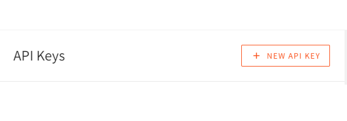

Flutter is a multi-platform development toolkit. It allows you to build native applications that can be compiled and run on different platforms, such as Android, iOS, web, and desktop. This hugely speeds up mobile development workflow and promotes code reusability.

As a developer who wants to build a full-stack flutter application, you need a server to manage your data and consume it using Flutter. Webiny allows you to run a serverless headless CMS to model your application content. It then delivers a scalable GraphQL API to consume this data.

### **Goal**

This guide will model the content for todo app using Webiny Headless CMS. We will then build a Flutter-fronted application to manage these ToDo items.

But first, let's briefly learn what a Headless CMS is and why Webiny is a good choice.

### **What is a Headless CMS**

A headless CMS is a decoupled system that separates the content(backend) from the output(fronted). A headless CMS is API driven and gives you the ability to run your content as a service.

When you run your content as a service, your content runs from a centralized managed server. This way, it's flexible to publish the content to any channel and look exactly how you want to in the individual channel.

You benefit from a number of features, such as:

- You can connect your content to tools that personalize and optimize your content delivery.
- Smart workflows
- API flexibility

### **Why use Webiny CMS**

If you are wondering which kind of CMS to use for your project, Webiny CMS is one of the outstanding headless CMS to put on your list.

Webiny is an open-source Headless CMS that allows you to easily manage your content. It is optimized to run as serverless with powerful content modeling features and scalability at its best.

Webiny then delivers your data through powerful GraphQL APIs. GraphQL structures data-driven APIs that are more flexible and efficient than the REST AND SOAP approach. It gives you the power to ask for the exact content you need from Webiny CMS.

Let's now dive in and implement our ToDo app with Flutter consuming data from a Webiny CMS.

### **Prerequisites**

To follow along with this tutorial, it is important to have the following:

- [Dart](https://dart.dev/get-dart) installed on your computer. **Note:**
If you have the [Flutter SDK](https://docs.flutter.dev/get-started/install/windows) installed, you have full Dart SDK installed and you are ready to go.
- Prior knowledge of working with the Flutter framework.
- [Node.js](https://nodejs.org/en/) >=14 installed on your computer
- An [AWS account and user credentials](https://www.webiny.com/docs/infrastructure/aws/configure-aws-credentials).

### **Setting up Webiny CMS**

To create a Webiny project, open a terminal that points to where the project will live. Then run the following command:

```bash
npx create-webiny-project webiny_app
```

This will scaffold a Webiny project that you can instantly deploy to your AWS cloud using the following command:

```bash
yarn webiny deploy
```

The installer provides step-by-step instructions on how to get Webiny live on AWS.

Once your deployment is completed, access the Webiny dashboard to manage your content.


### **Content Structure**

Content Structure sets and assembles the content model for your application. A content model contains elements like pieces of text, images, etc. A content structure is defined by all these elements of content models assembled together.

To model your application content with Webiny CMS, Click the **Headless CMS** card on the Webiny Admin dashboard page. Create a **New Content Model** as follows:


Once you **Create Model**, Webiny will allow you to add the relevant fields for your content model.


Use this dashboard to drag different elements that fit your content model. These ToDo content model fields will be defined as follows:

- A todo title (`text` field)


- A complete todo value (`boolean` field)


Once you have saved these elements, your content should have the following fields:


### **Generate Webiny API ACCESS KEY**

To connect Flutter with the Webiny CMS, you must create a Webiny API ACCESS KEY. Webiny allows you to set Full access and Custom Access options for your API.

Click on the top hamburger icon to access **Settings** and select the **API Keys** under **Access Management**.


Then create a **New API Key**.



In the resulting form, add the key name and description. In the **Permissions** section, under *Content*, select **All Locales** that the API can be accessed on.


To grant the API Full access, click on the ***Security*** tab, and give Full access to all access levels.


To manage the I18N access permissions, head over to the *I18N* section and grant Full access.


Finally, head over to the **Headless CMS** to grant full access to the API.

To create a Custom Access, head over to the **Headless CMS** section down and change the **Access Levels** based on what the generated API key can be used for.

Once you have configured the correct API access management, click the **Save API Key** button. The created API Key should now be listed on the left side. Head over to this newly created API key and copy the token generated. Keep it somewhere safe: you will use this token key to perform different permission to the API using Flutter.

### **Setting up the Flutter Project**

Proceed to your preferred working directory and run the following command to create your flutter project:

```bash
flutter create todos_webiny_app

```

Once the installation is complete, open a command line that points to the created directory to run your application:

```bash
cd todos_webiny_app

```

Test the application using the following command:

```bash
flutter run

```

A basic flutter application will be served within your testing environment as shown below:


For now, you can stop the server and dive into building a more extensive Flutter application.

First, install the third-party packages needed throughout the article. This Flutter app will use the following packages:

- [Provider](https://pub.dev/packages/provider/install): For providing overall state management for the application. To install it run:

```bash
flutter pub add provider

```

- [GraphQL Flutter](https://pub.dev/packages/graphql_flutter): For sending requests to the Webiny CMS GraphQL endpoint. To install it run:

```bash
flutter pub add graphql_flutter

```

- [Flutter Dotenv](https://pub.dev/packages/flutter_dotenv/install): Helps to load configuration environment variables from a `.env` file. To install it run:

```bash
flutter pub add flutter_dotenv

```

In the `dependencies` section of your `pubspec.yaml` file, the above packages will be installed based on the current versions:

```bash
provider: ^6.0.1
graphql_flutter: ^5.0.0
flutter_dotenv: ^5.0.2

```

Flutter Dotenv will execute Webiny configuration variables such as your API token key. To set it up create a `.env` file at the root directory of your Flutter project. This file will host the following environment variables:

```bash
ENDPOINTURL=your_queries_url
MUTATIONENDPOINTURL=your_mutation_url
WEBINYACCESTOKEN=your_access_token

```

The file will host the URLs for performing GraphQL query and mutation requests. To get the URLs, open your Webiny CMS, go into the **GraphQL API Playground**, and then copy the URL for:

- **Headless CMS - Manage API** and get mutations URL.
- **Headless CMS - Read API** and get the queries URL.

Paste the URLs to the file in the respective parameters:

Remember to set your access token from Webiny in the `WEBINYACCESTOKEN` section. Ensure the parameters `your_access_token` have your Webiny access token created in the previous steps.

To use the `.env` file, navigate to your `pubspec.yaml` and add an assets bundle with the `.env` file as follows:

```yaml
flutter:
  assets:
   - .env

```

**Note:** when publishing your project on GitHub, ensure you add `*.env` as an entry in your `.gitignore` to keep your project-specific environment variables private.

### **Setting up the Schemas**

Inside the Flutter project `lib` folder, create a `Schemas` folder. We will host the different files in this folder with the GraphQL requests for getting, adding, and deleting ToDo items. Create these files as follows:

- For adding ToDo items, create `add_task_schema.dart` file and add `createTodo` mutation as follows:

```dart
class AddTaskSchema {
    // For adding a task / todo
    static String addTaskJson = """
    mutation createTodo(\$title: String!) {
        createTodos(data: { title: \$title }){
        data{
                title
                completed
                id
            }
        }
    }
    """;

    // For publishing a todo / task
    static String publishTaskJson = """
    mutation publishTodo(\$id: ID!) {
        publishTodos(revision: \$id){
        data{
                title
                completed
                id
            }
        }
    }
    """;
}

```

- To fetch ToDo items create `get_task_schema.dart` file and add `listTodos` query as follows:

```dart
class GetTaskSchema {
    // Getting tasks
    static String getTaskJson = """
    query {
        listTodos{
        data {
            title
            completed
            createdOn
            id
        }
    }
}
""";
}

```

- To delete a todo create `delete_task_schema.dart` file and add `deleteTodo` mutation as such:

```dart
class DeleteTaskSchema {
    static String deleteJson = """
    mutation deleteTodo(\$id: ID!) {
        deleteTodos(revision: \$id){
            data
        }
    }
    """;
}

```

- Finally, set the URL endpoints to instruct the GraphQL Client to send queries and mutation requests. To do so, create the `urlEndpoint.dart` file and add the endpoints as follows:

```dart
import 'package:flutter/foundation.dart';
import 'package:graphql_flutter/graphql_flutter.dart';
import 'package:flutter_dotenv/flutter_dotenv.dart';

// For sending queries
class EndPoint {
    ValueNotifier<GraphQLClient> getClient() {
        ValueNotifier < GraphQLClient > _client = ValueNotifier(GraphQLClient(
            link: HttpLink(dotenv.get('ENDPOINTURL'), defaultHeaders: {
                'Authorization':
                    'Bearer ${dotenv.get('WEBINYACCESTOKEN')}',
            }),
            cache: GraphQLCache(store: HiveStore()),
        ));

        return _client;
    }
}

// For sending mutations
class MutationEndPoint {
    ValueNotifier<GraphQLClient> getClient() {
        ValueNotifier < GraphQLClient > _client = ValueNotifier(GraphQLClient(
            link: HttpLink(dotenv.get('MUTATIONENDPOINTURL'), defaultHeaders: {
                'Authorization':
                    'Bearer ${dotenv.get('WEBINYACCESTOKEN')}',
            }),
            cache: GraphQLCache(store: HiveStore()),
        ));

        return _client;
    }
}

```

The above code will instantiate the GraphQL Client when sending queries and mutations to the CMS. Thus, remember to set your access token from Webiny in the `defaultHeaders` section. Ensure the parameters `your_access_token` have your Webiny access tokes created in the previous steps.

### **Setting up the Providers**

Providers will host the functionalities of communicating to the CMS, i.e., getting a list of the ToDo items, adding a todo, and deleting a todo.

Each functionality will be hosted on its own file. Create the `Providers` folder on the project root directory and add these files as follows:

1. A provider to add a todo: create a `get_task_provider.dart` and add a `getTask` Provider as such:

```dart
import 'package:flutter/foundation.dart';
import 'package:todos_webiny_app/Schemas/get_task_schema.dart';
import 'package:todos_webiny_app/Schemas/urlEndpoint.dart';
import 'package:graphql_flutter/graphql_flutter.dart';

class GetTaskProvider extends ChangeNotifier {
bool _status = false;

String _response = '';

dynamic _list = [];

bool get getStatus => _status;

String get getResponse => _response;

final EndPoint _point = EndPoint();

// Getting the todos

void getTask(bool isLocal) async {
    // client
    ValueNotifier < GraphQLClient > _client = _point.getClient();

    QueryResult result = await _client.value.query(
        // request to webiny
        QueryOptions(
            document: gql(GetTaskSchema.getTaskJson),
            fetchPolicy: isLocal == true ? null : FetchPolicy.networkOnly,
        ),
    );

    if (result.hasException) {
        // exception check
        print(result.exception);
        _status = false;
        // stop loading
        if (result.exception!.graphqlErrors.isEmpty) {
            _response = "Cannot connect to API, are you connected to the internet?";
        } else {
            _response = result.exception!.graphqlErrors[0].message.toString();
        }
        notifyListeners();
    } else {
        // data log
        print(result.data);
        // stop loading
        _status = false;
        _list = result.data;
        // update listeners
        notifyListeners();
    }
}

dynamic getResponseData() {
    // destructure data sent
    if (_list.isNotEmpty) {
        final data = _list;

        // data log
        print(data['listTodos']['data']);
        // return data or empty object
        return data['listTodos']['data'] ?? {};
    } else {
        return {};
    }
}

void clear() {
    _response = '';
    // update listeners
    notifyListeners();
}
}

```

2. A provider to add a todo: create a `add_task_provider.dart` and create `AddTask` Provider as such:

```dart
import 'package:flutter/foundation.dart';
import 'package:todos_webiny_app/Schemas/add_task_schema.dart';
import 'package:todos_webiny_app/Schemas/urlEndpoint.dart';
import 'package:graphql_flutter/graphql_flutter.dart';

class AddTaskProvider extends ChangeNotifier {
bool _status = false;

String _response = '';

bool get getStatus => _status;

String get getResponse => _response;

final MutationEndPoint _point = MutationEndPoint();

// Publish task method
void publishTask({ String? id }) async {
    ValueNotifier < GraphQLClient > _client = _point.getClient(); // client
    QueryResult result = await _client.value.mutate(MutationOptions( // webiny request
        document: gql(AddTaskSchema.publishTaskJson),
        variables: {
        'id': id,
    })
    );

    if (result.hasException) { // exception check
        print(result.exception);
        _status = false;
        if (result.exception!.graphqlErrors.isEmpty) {
            _response = "Cannot connect to API, are you connected to the internet?";
        } else {
            _response = result.exception!.graphqlErrors[0].message.toString();
        }
        notifyListeners();
    } else {
        print(result.data);
        _status = false;
        _response = "Task was successfully published";
        notifyListeners();
    }
}

///Add task method
void addTask({ String? task, String? status }) async {
    _status = true;
    _response = "Please wait...";
    notifyListeners();

    ValueNotifier < GraphQLClient > _client = _point.getClient(); // client

    QueryResult result = await _client.value.mutate( // webiny request
        MutationOptions(document: gql(AddTaskSchema.addTaskJson), variables: {
            'title': task,
        }));

    if (result.hasException) { // Exception check
        print(result.exception);
        _status = false;
        if (result.exception!.graphqlErrors.isEmpty) {
            _response = "Cannot connect to API, are you connected to the internet?";
        } else {
            _response = result.exception!.graphqlErrors[0].message.toString();
        }
        notifyListeners();
    } else {
        // publish the task
        print(result.data);
        print("Now publishing the task");
        publishTask(id: result.data ? ['createTodos']['data']['id']);
    }
}

void clear() {
    _response = '';
    notifyListeners();
}
}

```

3. A provider to add a todo: create a `delete_task_provider.dart` and create a `deleteTask` Provider as such:

```dart
import 'package:flutter/foundation.dart';
import 'package:todos_webiny_app/Schemas/delete_task_schema.dart';
import 'package:todos_webiny_app/Schemas/urlEndpoint.dart';
import 'package:graphql_flutter/graphql_flutter.dart';

class DeleteTaskProvider extends ChangeNotifier {
bool _status = false;

String _response = '';

bool get getStatus => _status;

String get getResponse => _response;

final MutationEndPoint _point = MutationEndPoint();

///Add task method
void deleteTask({
    String? todoId,
}) async {
    _status = true;
    _response = "Please wait...";
    notifyListeners();
    // client
    ValueNotifier < GraphQLClient > _client = _point.getClient();

    // webiny request
    QueryResult result = await _client.value.mutate(

        MutationOptions(document: gql(DeleteTaskSchema.deleteJson), variables: {
            'id': todoId,
        }));

    if (result.hasException) {
        // Exception check
        print(result.exception);
        _status = false;
        if (result.exception!.graphqlErrors.isEmpty) {
            _response = "Cannot connect to API, are you connected to the internet?";
        } else {
            _response = result.exception!.graphqlErrors[0].message.toString();
        }
        notifyListeners();
    } else {
        print(result.data);
        _status = false;
        _response = "Task was successfully Deleted";
        // Listener update
        notifyListeners();
    }
}

void clear() {
    _response = '';
    notifyListeners();
}
}

```

### **Setting up the Screens**

The screens will form the UI that will be presented to the user. This app will have two screens:

- Home page - for viewing the todos.
- Add a todo page - for adding a todo.

The two screens will be hosted on the *Screens* directory as follows:

- The Home page: create a `home_page.dart` file using the following code block:

```dart
import 'package:flutter/material.dart';
import 'package:todos_webiny_app/Providers/delete_task_provider.dart';
import 'package:todos_webiny_app/Providers/get_task_provider.dart';
import 'package:todos_webiny_app/Screens/add_todo.dart';
import 'package:provider/provider.dart';

class HomePage extends StatefulWidget {
const HomePage({Key? key}) : super(key: key);

@override
_HomePageState createState() => _HomePageState();
}

class _HomePageState extends State<HomePage> {
bool isFetched = false;
@override
Widget build(BuildContext context) {
    return Scaffold(
    appBar: AppBar(
        title: const Text('Todo Home'),
    ),
    body: Consumer<GetTaskProvider>(builder: (context, task, child) {
        // Get task provider.
        if (isFetched == false) {
        ///Fetch the data
        task.getTask(true);

        Future.delayed(const Duration(seconds: 3), () => isFetched = true);
        }
        return RefreshIndicator(
            // For refreshing the screen
        onRefresh: () {
            task.getTask(false);
            return Future.delayed(const Duration(seconds: 3));
        },
        child: CustomScrollView(
            slivers: [
            SliverToBoxAdapter(
                child: Container(
                height: MediaQuery.of(context).size.height,
                padding: const EdgeInsets.all(20),
                child: Column(
                    children: [
                    Container(
                        margin: const EdgeInsets.all(20),
                        child: const Text("Available todo"),
                    ),
                    if (task.getResponseData().isEmpty)
                        const Text('No Todo found'),
                    Expanded(
                        child: ListView(
                        children: List.generate(task.getResponseData().length,
                            (index) {
                        final data = task.getResponseData()[index];
                        return ListTile(
                            contentPadding: const EdgeInsets.all(0),
                            title: Text(data['title']),
                            subtitle: Text(data['createdOn'].toString()),
                            leading: CircleAvatar(
                            backgroundColor: Colors.grey,
                            child: Text((index + 1).toString()),
                            ),
                            trailing: Consumer<DeleteTaskProvider>(
                                builder: (context, delete, child) {
                            WidgetsBinding.instance!
                                .addPostFrameCallback((_) {
                                if (delete.getResponse != '') {
                                ScaffoldMessenger.of(context).showSnackBar(
                                    SnackBar(
                                        content: Text(delete.getResponse)));

                                delete.clear();
                                }
                            });
                            return IconButton(
                                onPressed: () {
                                    ///Delete task
                                    ScaffoldMessenger.of(context)
                                        .showSnackBar(SnackBar(
                                    content: const Text(
                                        "Are you sure you want to delete task?"),
                                    action: SnackBarAction(
                                        label: "Delete Now",
                                        onPressed: () {
                                            delete.deleteTask(
                                                todoId: data['id']);
                                        }),
                                    ));
                                },
                                icon: const Icon(Icons.delete));
                            }),
                        );
                        }),
                    )),
                    const SizedBox(height: 150),
                    ],
                ),
                ),
            )
            ],
        ),
        );
    }),
    floatingActionButton: FloatingActionButton.extended(
        onPressed: () {
            Navigator.push(context,
                MaterialPageRoute(builder: (context) => const AddTodo()));
        },
        label: const Text('Add Todo')),
    );
}
}

```

- The add todo page: create an `add_todo.dart` file and add the following code block:

```dart
import 'package:flutter/material.dart';
import 'package:todos_webiny_app/Providers/add_task_provider.dart';
import 'package:provider/provider.dart';

class AddTodo extends StatefulWidget {
const AddTodo({Key? key}) : super(key: key);

@override
_AddTodoState createState() => _AddTodoState();
}

class _AddTodoState extends State<AddTodo> {
final TextEditingController _task = TextEditingController();
@override
Widget build(BuildContext context) {
    return Scaffold(
    appBar: AppBar(
        title: const Text('Add New Todo'),
    ),
    body: CustomScrollView(
        slivers: [
        SliverToBoxAdapter(
            child: Container(
            padding: const EdgeInsets.all(10),
            child: Column(
                children: [
                Container(
                    margin: const EdgeInsets.all(20),
                    child: const Text('Add your first todo'),
                ),

                ///Add todo task input field
                TextFormField(
                    controller: _task,
                    decoration: const InputDecoration(
                    labelText: 'Todo Task',
                    ),
                ),

                ///Add task button
                Consumer<AddTaskProvider>(builder: (context, task, child) {
                    WidgetsBinding.instance!.addPostFrameCallback((_) {
                    if (task.getResponse != '') {
                        ScaffoldMessenger.of(context).showSnackBar(
                            SnackBar(content: Text(task.getResponse)));

                        task.clear();
                    }
                    });

                    return GestureDetector(
                    onTap: task.getStatus == true
                        ? null
                        : () {
                            ///Add task button
                            ///
                            print(_task.text);
                            if (_task.text.isNotEmpty) {
                                task.addTask(
                                    task: _task.text.trim(), status: 'Pending');
                            }
                            },
                    child: Container(
                        padding: const EdgeInsets.all(15),
                        margin: const EdgeInsets.all(30),
                        decoration: BoxDecoration(
                            color: task.getStatus == true
                                ? Colors.grey
                                : Colors.blue,
                            borderRadius: BorderRadius.circular(10)),
                        child: Text(task.getStatus == true
                            ? 'Loading...'
                            : 'Save Task')),
                    );
                })
                ],
            ),
            ),
        )
        ],
    ),
    );
}
}

```

### **Setting up the main file**

The flutter `main.dart` file binds all application modules together. Inside the main file, configure all the providers and the application home page as follows:

```dart
import 'package:flutter/material.dart';
import 'package:todos_webiny_app/Providers/add_task_provider.dart';
import 'package:todos_webiny_app/Providers/get_task_provider.dart';
import 'package:graphql_flutter/graphql_flutter.dart';
import 'package:provider/provider.dart';
import 'package:flutter_dotenv/flutter_dotenv.dart';
import 'Providers/delete_task_provider.dart';
import 'Screens/home_page.dart';

void main() async {
  await initHiveForFlutter();
  //Initialize the dotenv
  //To load the .env file contents into dotenv
  // Ensure that the filename corresponds to the .env file path
  await dotenv.load(fileName: ".env");

  runApp(const MyApp());
}

class MyApp extends StatelessWidget {
  const MyApp({Key? key}) : super(key: key);

  @override
  Widget build(BuildContext context) {
    return MultiProvider(
        providers: [
          ChangeNotifierProvider(create: (_) => AddTaskProvider()),
          ChangeNotifierProvider(create: (_) => GetTaskProvider()),
          ChangeNotifierProvider(create: (_) => DeleteTaskProvider())
        ],
        child: const MaterialApp(
          home: HomePage(),
        ));
  }
}

```

### **Testing the Todo app**

Run the application by executing the following command from the terminal that points to the Flutter project folder:

```bash
flutter run lib/main.dart
```

You will see the following output in the terminal as the project begins running:


Once the application runs, it will be launched on your testing device as follows.

The home screen will be launched with the list of todos. You can use the **Add Todo** button to create new todos:


**Add Todo** button will launch a Flutter form to allow you to insert the todo details using the add-todo screen:


### **Conclusion**

This guide helped you build a decoupled full stack ToDos application. We have used Webiny as the CMS. Then consumed the CMS content using Flutter. I hope you find this tutorial helpful. Check the source code used to build this project on [GitHub repository](https://github.com/kimkimani/Todo-app-with-webiny-cms-and-flutter).