Trello is an online list-making application based on the principles of Kanban. Kanban boards help you record, organize, and manage your personal and professional work. It allows you to create virtual boards and manage your work in the form of lists and cards.

In this tutorial, we will build a Trello clone using Next.js and Webiny Headless CMS. Here is a quick preview of the application:

<video width="800px" height="auto" controls autoplay>
  <source src="./assets/build-trello-clone-nextjs-webiny-headless-cms-1-of-2/trello-clone.mp4" type="video/mp4" />
</video>


We will build the following Trello features in our application: 

- Board:
    - Create Boards
    - Rename a Board
    - Delete a Board
- Lists:
    - Create lists inside a board
    - Rename a list
    - Reorder lists by dragging
    - Delete a list
- Cards:
    - Create cards inside a List
    - Add a title, description, and image to a card
    - Modify the title, description, and image of a card
    - Reorder cards inside a list by dragging them
    - Move cards between the lists by dragging them
    - Delete a card

To build this application, we will use Webiny CMS, Next.js, Tailwind CSS (a CSS framework), and React Beautiful DND (a react library for drag and drop functionality).

## Prerequisites

To follow along with this tutorial you need to have the following:

- Basic understanding of JavaScript, React, and Next.js.
- Basic knowledge of how APIs work.
- Fair grasp of HTML and CSS.
- An active AWS account to host your Webiny instance

Now, let’s build our application step-by-step.

## Set up a Webiny Project

To [create a Webiny project](https://www.webiny.com/docs/get-started/install-webiny), you need an AWS account and Node.js installed on your system.

Go to the directory where you want to set up your project, open the terminal, and type in the command: 

```bash
npx create-webiny-project [your project name]
```

And run the following command to deploy the project:

```bash
yarn webiny deploy
```

After the deployment is complete, you will be presented with the URL for your Webiny project, where you can enter the Admin Dashboard and begin developing the project's backend.

You can find out all the relevant URLs at any time by running the following command inside the Webiny project directory:

```bash
yarn webiny info
```

Also, the in-depth guide on Webiny installtion can be found [here](https://www.webiny.com/docs/get-started/install-webiny).

## Set up a Next.js Project

In the same directory where you  set up your Webiny project, open the terminal, and type in the command to setup a Next.js project (adjacent to the Webiny project):

```bash
yarn create next-app --example with-tailwindcss trello-clone
```

This will create a project named “trello-clone” pre-configured with Tailwind CSS. If you don’t want to use this method, you can [manually configure Tailwind CSS](https://tailwindcss.com/docs/guides/nextjs) in your Next.js project.

Open the project’s root directory and open it in your code editor. Go to the `index.tsx` file and remove all the boilerplate code - HTML from the `<main>`, `<title>`, and the `<footer>` tag.

Now you have a clean installation of Next.js with Tailwind CSS. Next, we will configure our Webiny CMS instance as the backend of our application.

## Configure Webiny Instance

First, let’s configure our Webiny CMS to store the data for our application.

Visit the URL on which your Webiny instance was deployed and log in with your credentials.

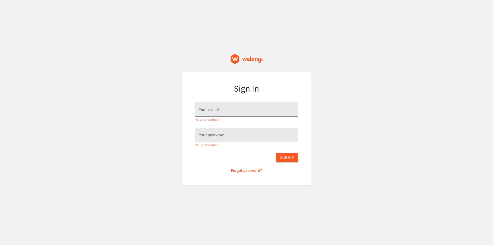


After logging in, you’ll be redirected to the dashboard.

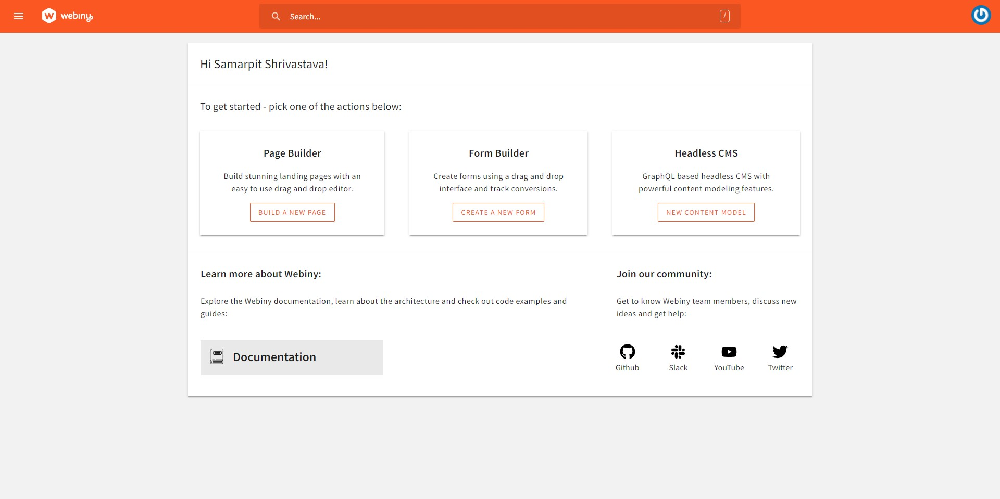

Click on the Hamburger menu on the top-left side of the screen to open the main menu. Click on the “Groups” option under the “Content Models” section inside the “Headless CMS” tab. As the name suggests, content groups allow us to categorize content models into groups.

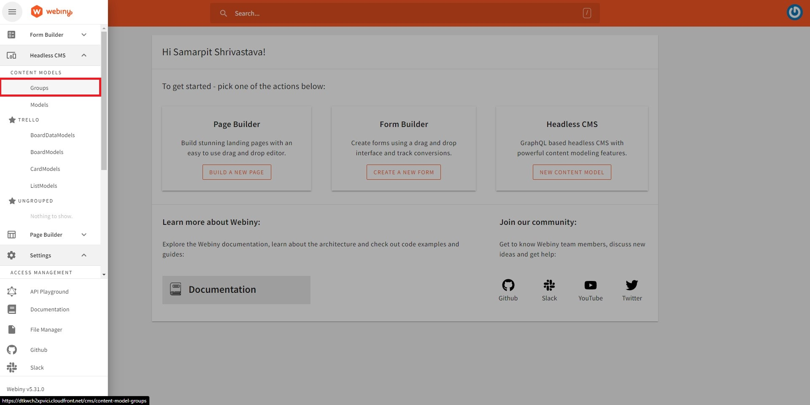

On the “Content Models” page, create a new group by clicking on the “+ New Group” button and filling in the required details. Set “Trello” as the title of the content group.

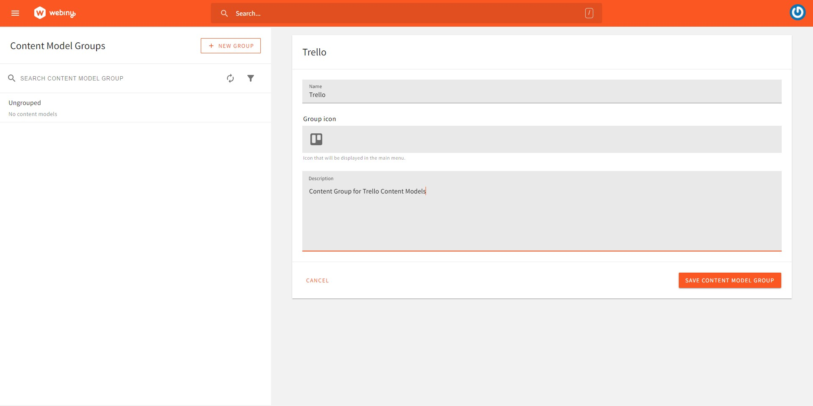

After saving the content group, go to the “Content Models” page from the main menu.

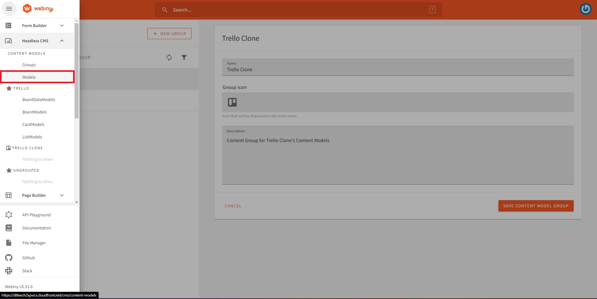

Click on the “+ New Model” button to create a new content model.

Create a content model for boards with the title “BoardModel” and select “Trello” in the “Content model group” field.


Add the following fields to the content model BoardModel:

- Board ID - ( Use the “Text” field)
- Board Title - ( Use the “Text” field)

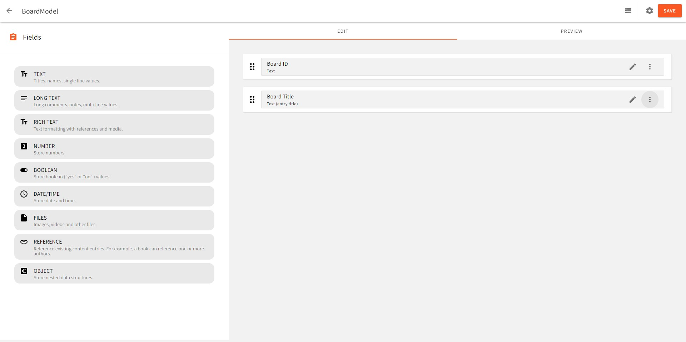

Create a content model for lists with the title “ListModel” and select “Trello” in the “Content model group” field.

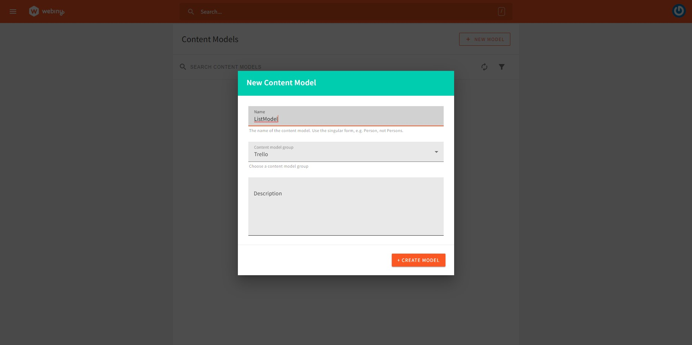

Add the following fields to the content model ListModel:

- List ID - ( Use the “Text” field)
- List Title - ( Use the “Text” field)
- List Board - ( Use the “Reference” field; Select the content model BoardModel while creating this field)

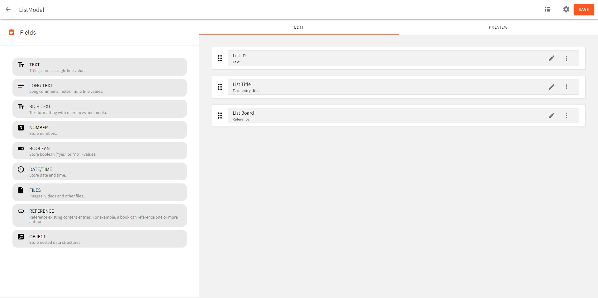

Create a content model for cards with the title “CardModel” and select “Trello” in the “Content model group” field.


Add the following fields to the content model CardModel:

- Card ID - (Use the “Text” field)
- Card Title - (Use the “Text” field)
- Card Description - (Use the “Long Text” field)
- Card Image - (Use the “Files” field)
- Card List - (Use the “Reference” field; Select the content model ListModel while creating this field)

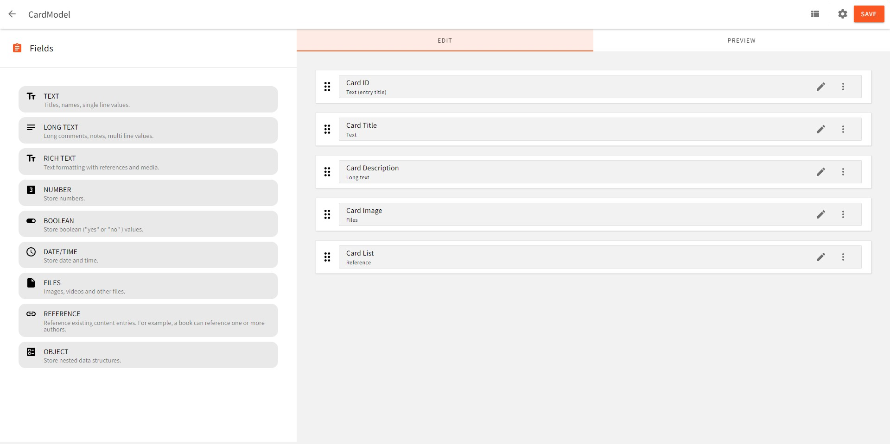

Create a content model for all the extra data related to a board with the title “BoardDataModel” and select “Trello” in the “Content model group” field. This content model will store additional information about a board like the order of lists, position of cards, card, and list count, etc., in stringified JSON format.

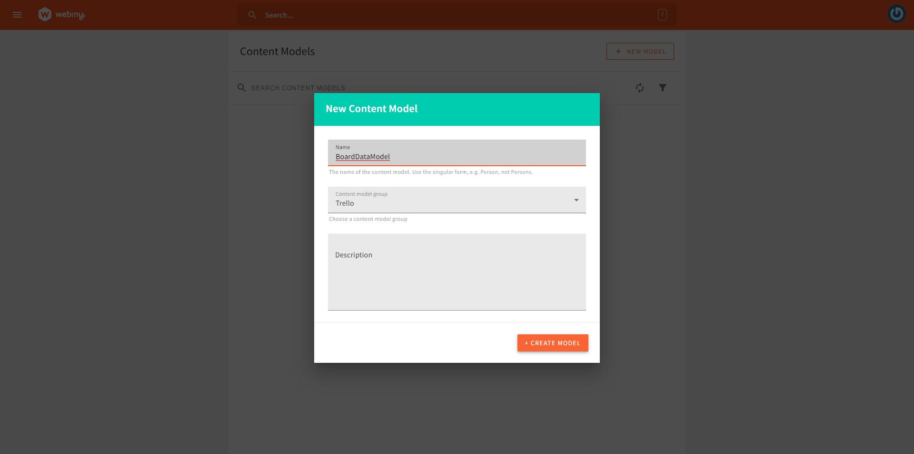

Add the following fields to the content model BoardDataModel:

- Board Data ID - ( Use the “Text” field)
- Board Data - ( Use the “Long Text” field)
- Data Board - ( Use the “Reference” field; Select the content model BoardModel while creating this field)

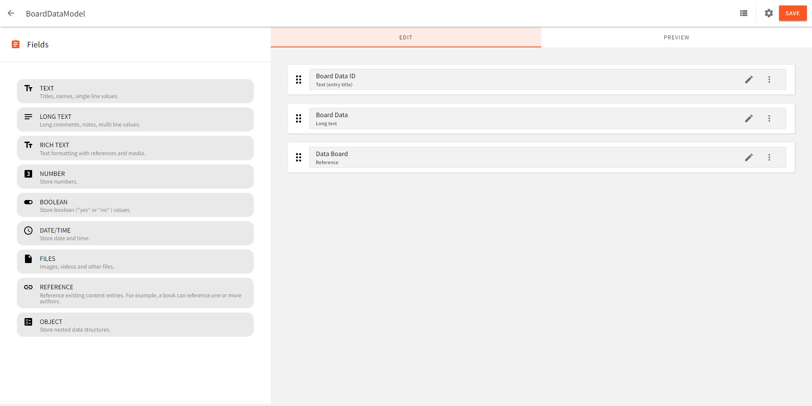

We have created the necessary content models for our application to store its data. Now let’s create an API key for our application.

To go to the API Keys page, click on “API Keys” under “Access Management” inside the settings tab in the main menu.

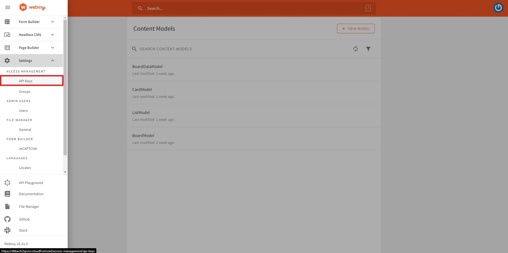

Create a new API by clicking on the “+ New API Key” button. Fill in the title and description. Your API access token will be generated automatically after you save the newly created API*.*

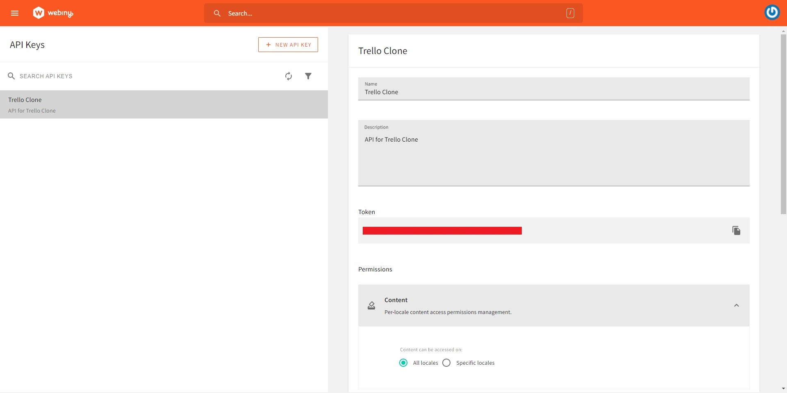

In the “Content” tab select “All Locales”.

Now open the “Headless CMS” tab. Set the “Access Level” field’s value to “Custom Access”. And, under “GraphQL API types”, check the “Read” and “Manage” checkboxes.

Under “Content Model Groups”, set the “Access Scope” field’s value to “Only specific groups” and check the box representing the content group we created - “Trello”. Set the “Primary Actions” field’s value to “Read, write, delete”.


Under “Content Models”, set the “Access Scope” field’s value to “All Models” and the “Primary Actions” field’s value to “Read, write, delete”.

Under “Content Entries”, set the “Access Scope” field’s value to “All Entries” and the “Primary Actions” field’s value to “Read, write, delete”. Check the boxes for “Publish” and “Unpublish” under “Publishing Actions”.

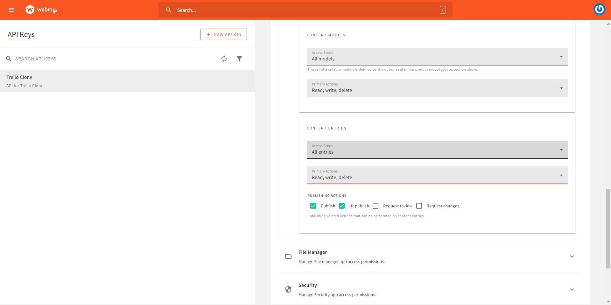

Now open the “File Manager” tab. Set the “Access Level” field’s value to “Full Access”.

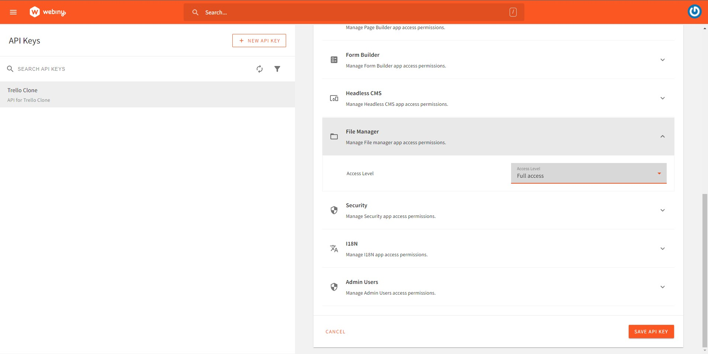

Click on the “Save API” button to save this API. After saving, your API access token will be generated.

Voila! You have configured your Webiny instance for your Trello clone application. Now we can move on to creating the front end of our application with Next.js.

## Build the application with Next.js

You need to return to the root directory of the Next.js project you set up in the previous steps and open it in your code editor.

Following will be the directory structure of our project:

```markdown
trello-clone
├── components
│	├── Board.js
│	├── BoardFile.js
│	├── Card.js
│	├── List.js
│	└── Topbar.js
│
├── lib
│	├── helpers.js
│	└── appState.js
│
├── pages
│	├── boards
│	│	└── [slug].js
│	│
│	├── _app.js / _app.tsx
│	├── boards.js / boards.tsx
│	└── index.js / index.tsx
│
└── .env.local
```

As we are using Tailwind CSS, we don’t need to create separate CSS files for our app’s components. If required, we can add any additional CSS as [styled jsx](https://nextjs.org/blog/styling-next-with-styled-jsx).

While setting up the Next.js project, we deleted all the default code from the `index.js` **file. Let us now build our application file-by-file.

### Building the Topbar component

- Create a folder named `components` in the root directory of the project. In the components folder, create a file named `Topbar.js`. This component will be the main navigation bar of our application. Add the following code to the file.
- Go to the `_app.tsx` file inside the pages folder and add the `<Topbar />` component before the `<Component />` component. The code will look like this:
    
    ```jsx
    import React from "react";
    import Link from "next/link";
     
    const Topbar = () => {
      return (
        <>
          <div className="flex p-2 bg-sky-700 items-center h-[7vh]">
            <div className="mx-0 ">
              <Link href="/">
                <h1 className="cursor-pointer text-sky-200 text-xl flex items-center font-sans italic">
                  <svg
                    className="fill-current h-8 mr-2"
                    xmlns="http://www.w3.org/2000/svg"
                    viewBox="0 0 50 50"
                  >
                    <path d="M41 4H9C6.24 4 4 6.24 4 9v32c0 2.76 2.24 5 5 5h32c2.76 0 5-2.24 5-5V9c0-2.76-2.24-5-5-5zM21 36c0 1.1-.9 2-2 2h-7c-1.1 0-2-.9-2-2V12c0-1.1.9-2 2-2h7c1.1 0 2 .9 2 2v24zm19-12c0 1.1-.9 2-2 2h-7c-1.1 0-2-.9-2-2V12c0-1.1.9-2 2-2h7c1.1 0 2 .9 2 2v12z" />
                  </svg>
                  Trello
                </h1>
              </Link>
            </div>
            <div className="flex">
              <nav>
                <ul>
                  <li>
                    <Link href="/boards">
                      <div className="cursor-pointer ml-2 px-3 py-1 text-white rounded bg-sky-500 bg-opacity-75 hover:bg-sky-600">
                        Boards
                      </div>
                    </Link>
                  </li>
                </ul>
              </nav>
            </div>
          </div>
        </>
      );
    };
     
    export default Topbar;
    ```
    
- Go to the `_app.tsx` file inside the pages folder and add the `<Topbar />` component before the `<Component />` component. The code will look like this:
    
    ```jsx
    import "../styles/globals.css";
    import type { AppProps } from "next/app";
    import Topbar from "../components/Topbar";
    
    function MyApp({ Component, pageProps }: AppProps) {
      return (
        <>
          <Topbar />
          <Component {...pageProps} />
        </>
      );
    }
    
    export default MyApp;
    ```
    
- Now you can start the server by running this command in the terminal:
    
    ```shell
    yarn dev
    ```
    
    Open the URL [http://localhost:3000/](http://localhost:3000/) in your browser and you'll see the Topbar at the top of your screen.

    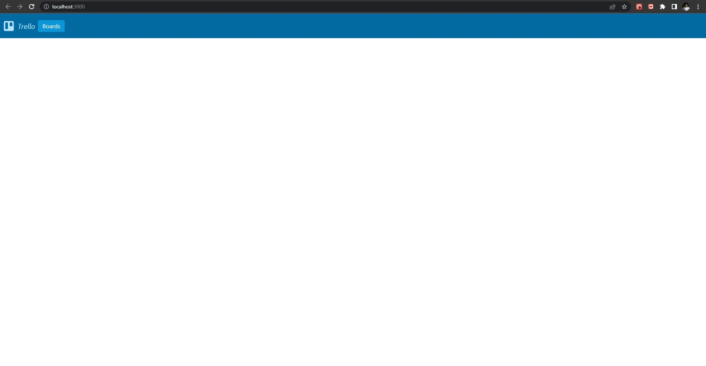    
    
    Now we will create the boards page that will allow us to create, rename, and delete boards in our application.
    

### Fetching Boards List

- In order to display the list of boards on a page, we first need to fetch the list of boards from the backend. We fetch the data from the server by calling an API.
- Create a folder named `lib` in the root directory of the project. In the lib folder, create a file named `helpers.js`. This file will act similarly to a controller in MVC architecture. It will fetch the data from the server and return it to the view components.
- In the file `helpers.js`, add the following code:
    
    ```jsx
    async function fetchAPI(query, { variables } = {}, read) {
      const url = read
        ? process.env.NEXT_PUBLIC_WEBINY_API_READ_URL
        : process.env.NEXT_PUBLIC_WEBINY_API_MANAGE_URL;
      const res = await fetch(url, {
        method: "POST",
        headers: {
          "Content-Type": "application/json",
          Authorization: `Bearer ${process.env.NEXT_PUBLIC_WEBINY_API_SECRET}`,
        },
        body: JSON.stringify({
          query,
          variables,
        }),
      });
      const json = await res.json();
      if (json.errors) {
        throw new Error("Failed to fetch API", json.errors);
      }
      return json.data;
    }
    ```
    
    The above function will make an API call to the server and return its response. as JSON
    
- Now, add the following code to `helpers.js`:
    
    ```jsx
    export async function getBoards() {
      const boards = await fetchAPI(
        `query GetBoards {
          listBoardModels{
            data{
              id,
              boardId,
              boardTitle,
              entryId
            }
          }
        }`,
        {},
        true
      );
      return boards.listBoardModels.data;
    }
    ```
    
    The above function will fetch a list of all the published BoardModel models in our Webiny instance. In the response, we will get the values of the fields `id`, `boardId`, and `boardTitle` of the model BoardModel.
    
- Create a file named `.env.local` in the root folder of the project and add the following code to the file:
    
    ```markdown
    NEXT_PUBLIC_WEBINY_API_READ_URL = [Read URL of your Webiny instance]
    NEXT_PUBLIC_WEBINY_API_MANAGE_URL = [Manage URL of your Webiny instance]
    NEXT_PUBLIC_WEBINY_API_MAIN_URL = [Main URL of your Webiny instance]
    NEXT_PUBLIC_WEBINY_API_SECRET = [Your API access token]
    ```
    
    To find out the read and manage URL of your Webiny instance, click on the “API Playground” in the main navigation menu.
    
    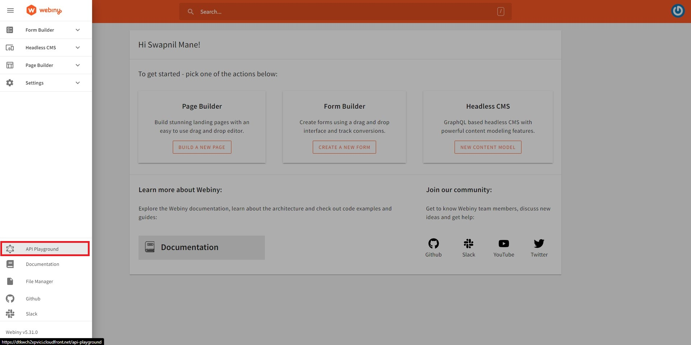
    
    There are 4 tabs in the API playground.
    
    Click on the “Headless CMS - Read API” tab. The URL in the field below the tab is your read URL. Copy and paste it in front of the variable `NEXT_PUBLIC_WEBINY_API_READ_URL` inside the `.env.local` file.

    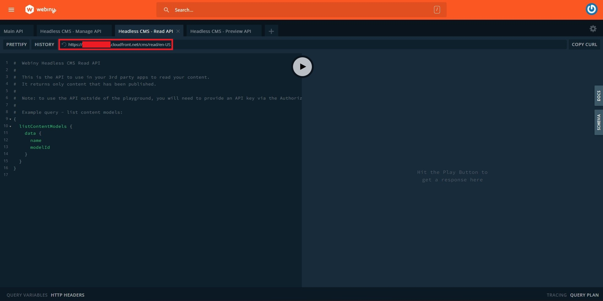    
    
    Click on the “Headless CMS - Manage API” tab. The URL in the field below the tab is your manage URL. Copy and paste it in front of the variable `NEXT_PUBLIC_WEBINY_API_MANAGE_URL` inside the `.env.local` file.

    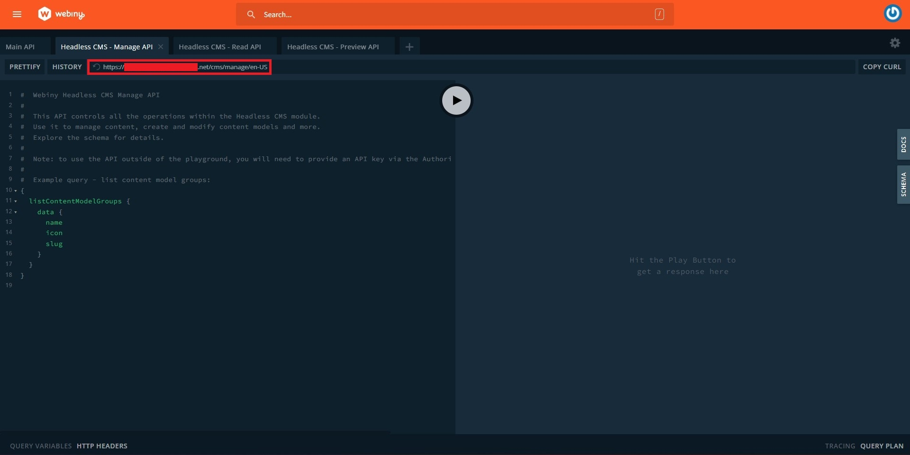    
    
    Click on the “Headless CMS - Manage API” tab. The URL in the field below the tab is your main URL. Copy and paste it in front of the variable `NEXT_PUBLIC_WEBINY_API_MAIN_URL` inside the `.env.local` file.
    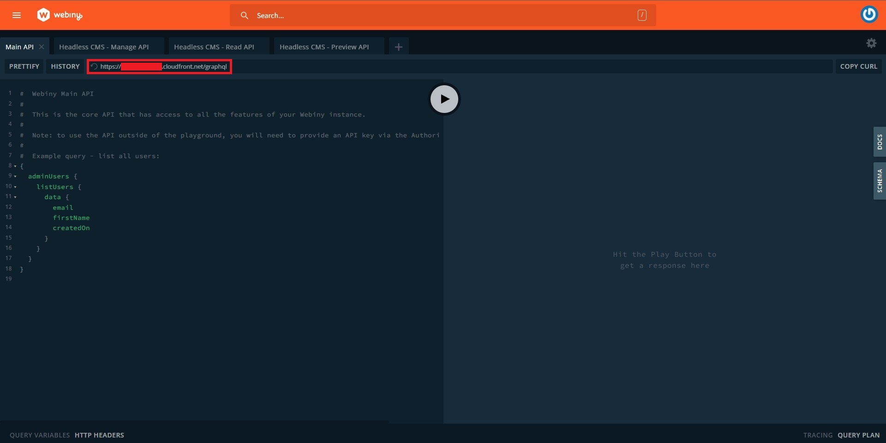    

    You can find out your API access token by going to the API keys page and clicking on the (Trello Clone) API you created in the previous steps.
    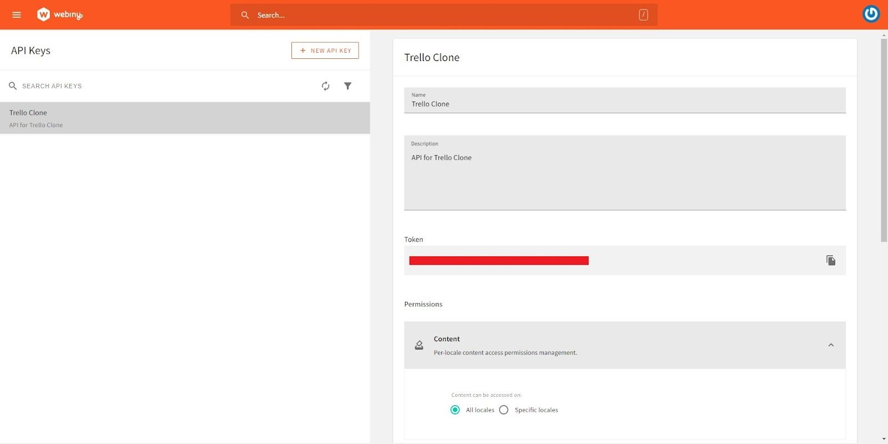
    
    Copy and paste the secret key in front of the variable `NEXT_PUBLIC_WEBINY_API_SECRET` inside the `.env.local` file.
    
- To fetch and view some data, we need to have it stored in the database. So, let’s add some dummy data to the BoardModel content model.
    
    Go to the “Content Models” page, hover over the “BoardModel” content model, and click on the “View Content” icon.
    
    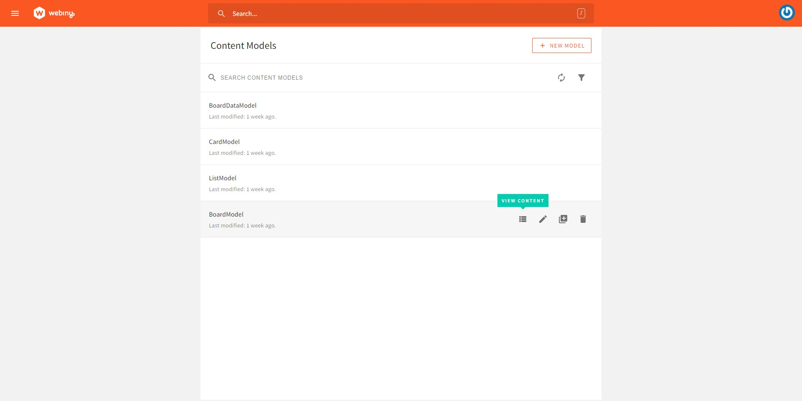
    
    On the BoardModels content page, click on the “+ New Entry” button, fill in the Board ID and Board Title fields, and click on the “Save & Publish” button.
    
    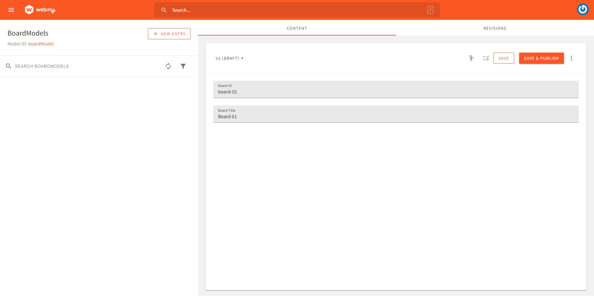

    Add as many entries as you want.
    
- Now let us create the boards page. In the `pages` folder, create a file named `boards.js` and add the following code to it:
    
    ```jsx
    import React from "react";
    import BoardFile from "../components/BoardFile";
    import {
      createBoardModel,
      createBoardDataModel,
      getBoards,
      updateBoardModel,
    } from "../lib/helpers";
    import { useState } from "react";
    
    const Boards = (props) => {
      const [boardListState, setBoardListState] = useState(props.boards);
      const onAddBoardClick = () => {
        document.getElementById("board-adder").classList.toggle("hidden");
      };
    
      const onCancelButtonClick = () => {
        document.getElementById("board-title-value").value = null;
        onAddBoardClick();
      };
    
      async function onAddButtonClick() {}
    
      return (
        <>
          <div className=" h-93vh flex flex-row flex-wrap p-5">
            {/* Start: Add new board button */}
            <div className="relative mr-5 mt-5">
              <div
                className="flex flex-col items-center justify-center rounded w-44 h-32 px-6 bg-gray-200 cursor-pointer text-gray-600 font-bold hover:bg-gray-300 transition-colors"
                onClick={onAddBoardClick}
              >
                <p>+</p>
                <p>Add</p>
                <p> Board</p>
              </div>
    
              <div
                id="board-adder"
                className="hidden bg-white top-0 -right-64 absolute w-64 h-max z-10 p-4  border-2 rounded shadow-md"
              >
                <form>
                  <div className=" w-full ">
                    <label className="  italic ">Board's Title</label>
                    <input
                      id="board-title-value"
                      type="textarea"
                      className="rounded w-full border-[1px] p-1 mt-2"
                    />
                  </div>
                  <div className="mt-2">
                    <input
                      type="button"
                      className={`mr-2 bg-sky-600 rounded px-2 py-1 text-white hover:bg-sky-700 transition-colors`}
                      value="Add"
                      onClick={onAddButtonClick}
                    />
                    <input
                      type="button"
                      className={`mr-2 bg-gray-600 rounded px-2 py-1 text-white hover:bg-gray-700 transition-colors`}
                      value="Cancel"
                      onClick={onCancelButtonClick}
                    />
                  </div>
                </form>
              </div>
            </div>
            {/* End: Add new board button */}
            {/* Start: Display the list of boards in tiles format */}
            {boardListState.map((board, index) => {
              return (
                <BoardFile
                  index={index}
                  key={board.boardId}
                  board={board}
                  boardListState={boardListState}
                  setBoardListState={setBoardListState}
                />
              );
            })}
            {/* End: Display the list of boards in tiles format */}
          </div>
        </>
      );
    };
    
    export async function getServerSideProps(context) {
      return {
        props: {
          boards: await getBoards(),
        },
      };
    }
    
    export default Boards;
    ```
    
    [getServerSideProps](https://nextjs.org/docs/basic-features/data-fetching/get-server-side-props) is a Next.js function that only runs on the server side during the request time. A page that uses `getServerSideProps` is pre-rendered by Next.js using the data returned by this function.
    
    The data returned by this function (props in the code above) is passed to the component-rendering function as a parameter (props in the code above).
    
    On reloading the page you’ll see a button to add a board.
    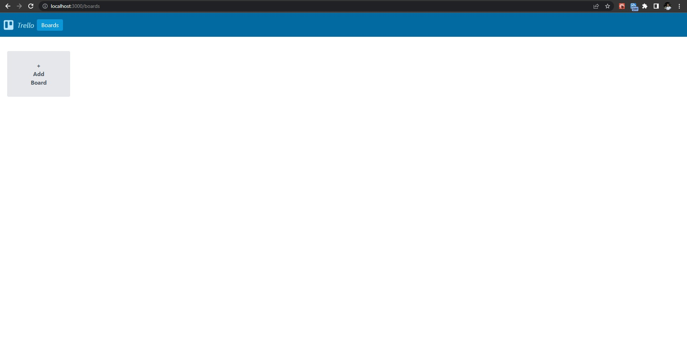
    
    You’ll notice when you try to create a board by clicking on the “Add” button, nothing happens. We will add this functionality later.
    
    `BoardFile` is a component that displays each board as a tile on the boards page. But, we haven’t created this component. So, let’s create it.
    
- Create a file named `BoardFile.js` in the `components` folder and add the following code to it
    
    ```jsx
    import React from "react";
    import Link from "next/link";
    import {
      deleteBoardDataModel,
      deleteBoardModel,
      getBoardDataModelByBoardEntryId,
      getBoardLists,
    } from "../lib/helpers";
    
    const BoardFile = (props) => {
      const boardId = props.board.boardId;
    
      const onBoardMenuClick = (event) => {
        event.preventDefault();
        let targetBoardId = props.board.boardId;
        document
          .getElementById("board-menu-" + targetBoardId)
          .classList.toggle("hidden");
      };
    
      const onRenameBoardClick = (event) => {
        event.preventDefault();
        let targetBoardId = props.board.boardId;
        document
          .getElementById("board-editor-" + targetBoardId)
          .classList.toggle("hidden");
    
        document
          .getElementById("board-menu-" + targetBoardId)
          .classList.toggle("hidden");
      };
    
      async function onDeleteBoardClick(event) {
        event.preventDefault();
      }
    
      async function onSaveRenameButtonClick(event) {
        event.preventDefault();
      }
    
      return (
        <div className="flex flex-row relative mr-5 mt-5">
          <Link
            href={{
              pathname: "/boards/" + boardId,
            }}
          >
            <div className="w-44 h-32 border-2 rounded flex items-center justify-center cursor-pointer border-gray-500 hover:bg-sky-600 hover:text-white hover:border-sky-600 transition-colors relative">
              <div className="absolute right-0 top-0 z-9">
                <div className=" absolute top-0 right-0 cursor-pointer rounded transition-colors hover:bg-white p-[2px]">
                  <svg
                    onClick={onBoardMenuClick}
                    xmlns="http://www.w3.org/2000/svg"
                    width="20"
                    height="20"
                    viewBox="0 0 24 24"
                    fill="none"
                    stroke="#000000"
                    strokeWidth="2"
                    strokeLinecap="round"
                    strokeLinejoin="round"
                  >
                    <circle cx="12" cy="12" r="1"></circle>
                    <circle cx="19" cy="12" r="1"></circle>
                    <circle cx="5" cy="12" r="1"></circle>
                  </svg>
                </div>
    
                <div
                  id={`board-menu-${boardId}`}
                  className="relative top-7 right-1 rounded bg-white border-[1px] border-gray-400 w-40  cursor-pointer transition-colors  hidden"
                >
                  <ul className="text-black transition-colors">
                    <li
                      className="hover:bg-gray-500 hover:text-white  transition-colors rounded px-1 py-1"
                      onClick={onRenameBoardClick}
                    >
                      Rename Board
                    </li>
                    <li
                      className="hover:bg-red-700 hover:text-white transition-colors rounded px-1 py-1"
                      onClick={onDeleteBoardClick}
                    >
                      Delete Board
                    </li>
                  </ul>
                </div>
              </div>
              <div>
                <p className="font-bold">{props.board.boardTitle}</p>
              </div>
            </div>
          </Link>
          <div
            id={`board-editor-${boardId}`}
            className="z-20 hidden absolute -right-64 bg-white w-64 h-max p-4  border-2 rounded shadow-md"
          >
            <form className="flex flex-col">
              <div className="flex flex-col mb-2">
                <label className="italic">Board's Title</label>
                <input
                  id={`board-rename-input-${boardId}`}
                  type="textarea"
                  className="rounded w-full border-[1px] p-1 mt-2"
                />
              </div>
              <div className="flex flex-row ">
                <input
                  type="button"
                  value="Save"
                  className={`mr-2 bg-sky-600 rounded px-2 py-1 text-white hover:bg-sky-700 transition-colors`}
                  onClick={onSaveRenameButtonClick}
                />
                <input
                  type="button"
                  value="Cancel"
                  className={`mr-2 bg-gray-600 rounded px-2 py-1 text-white hover:bg-gray-700 transition-colors`}
                  onClick={onCancelRenameButtonClick}
                />
              </div>
            </form>
          </div>
        </div>
      );
    };
    
    export default BoardFile;
    ```
    
    Now reload the boards page or click on the ’Boards’ link on the Topbar. You’ll see the list of boards you published visible in a tile format on the boards page.
    
    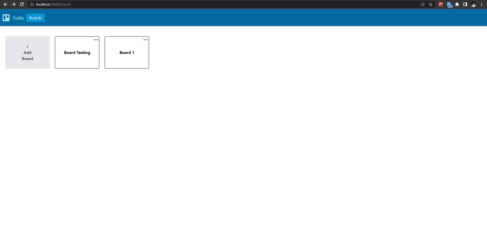
    
    You’ll notice that when you try deleting the board by clicking on the “Delete Board” option in the board menu or renaming the board by clicking on the “Save” button, nothing happens.
    
    That is what we have defined the functions `onDeleteBoardClick` and `onSaveRenameButtonClick` for. We will come back to this later. For now, leave those functions as they are.
    
    Also, you’ll notice when you click on a board’s thumbnail, you are taken to a page corresponding to its Board ID (see the URL in the browser’s URL tab), but the page shows the error - 404 | This page could not be found.
    
    This is because the page with that URL has not been defined. So, let’s define a [dynamic navigation route](https://nextjs.org/docs/routing/dynamic-routes) for a board corresponding to its Board ID.
    
- Create a folder named `boards` in the pages folder. Inside this folder, create a file named `[slug].js` and add the following code:
    
    ```jsx
    import React from "react";
    import { useRouter } from "next/router";
    
    const slug = () => {
      const router = useRouter();
      const { slug } = router.query;
    
      return <p>Board: {slug}</p>;
    };
    
    export default slug;
    ```
    
    This file will act as a dynamic page file which will match the path /boards/[board-id]. The matched path parameter will be sent as a query parameter to the page, and it will be merged with the other query parameters.
    
    Now when you click on a Board thumbnail, you’ll be taken to a page displaying the text “Board: [Board ID]”. We will build this page to work with the dynamic data of our application later.
    

### Adding a Board

- Add the following code to the `helpers.js` file:
    
    ```jsx
    export async function createBoardModel(params) {
      const board = await fetchAPI(
        `mutation createBoardModel($boardId:String!,$boardTitle:String!){
          createBoardModel(data:{boardId:$boardId,boardTitle:$boardTitle}){
            data{
              id,
            }
          }
        }`,
        {
          variables: {
            boardId: params.boardId,
            boardTitle: params.boardTitle,
          },
        },
        false
      );
      const boardData = await publishBoardModel(board.createBoardModel.data.id);
      return boardData;
    }
    
    export async function publishBoardModel(id) {
      const board = await fetchAPI(
        `mutation publishBoardModel($id:ID!){
          publishBoardModel(revision:$id){
            data{
              id,
              boardId,
              boardTitle
            }
          }
        }`,
        {
          variables: {
            id: id,
          },
        },
        false
      );
      return board.publishBoardModel.data;
    }
    export async function createBoardDataModel(params) {
      const boardDataModel = await fetchAPI(
        `mutation createBoardDataModel($dataModelId:String!,$boardId:ID!, $boardData:String!){
          createBoardDataModel(data:{boardDataId:$dataModelId,boardData:$boardData,dataBoard:{modelId:"boardModel",id:$boardId}}){
            data{
              id,
              boardDataId,
              dataBoard{
                id,
              }
            }
          }
        }`,
        {
          variables: {
            dataModelId: params.dataModelId,
            boardId: params.boardId,
            boardData: params.boardData,
          },
        },
        false
      );
      const modelData = await publishBoardDataModel(
        boardDataModel.createBoardDataModel.data.id
      );
      return modelData;
    }
    
    export async function publishBoardDataModel(id) {
      const dataModel = await fetchAPI(
        `mutation publishBoardDataModel($id:ID!){
          publishBoardDataModel(revision:$id){
            data{
              id,
              boardDataId,
              boardData,
            }
          }
        }`,
        {
          variables: {
            id: id,
          },
        },
        false
      );
      return dataModel.publishBoardDataModel.data;
    }
    ```
    
- Add the following code to the `onAddButtonClick` function inside the `boards.js` file:
    
    ```jsx
    async function onAddButtonClick() {
      let boardTitle = document.getElementById("board-title-value").value;
      let boardIdNum = Math.trunc(
        Math.floor(Math.random() * 10000000) + Date.now()
      );
    
      if (boardTitle.length === 0) {
        alert("Please enter a title for the board.");
        return;
      }
    
      let createBoard = await createBoardModel({
        boardId: "board-" + boardIdNum,
        boardTitle: boardTitle,
      });
    
      const boardDataModel = {
        "board-list-order": [],
        "board-card-order": {},
        "board-card-count-id": 0,
        "board-card-count": 0,
        "board-list-count-id": 0,
        "board-list-count": 0,
      };
    
      let createBoardData = await createBoardDataModel({
        dataModelId: "bdm-" + boardIdNum,
        boardId: createBoard.id,
        boardData: JSON.stringify(boardDataModel),
      });
    
      const newBoardList = [createBoard, ...boardListState];
      setBoardListState(newBoardList);
    
      onCancelButtonClick();
    }
    ```
    
- Now when you create a new board by clicking on the “Add” button, a new entry will be created in the BoardModel content model in your Webiny instance. Only click the “Add” button once and wait for board to be added.
    
    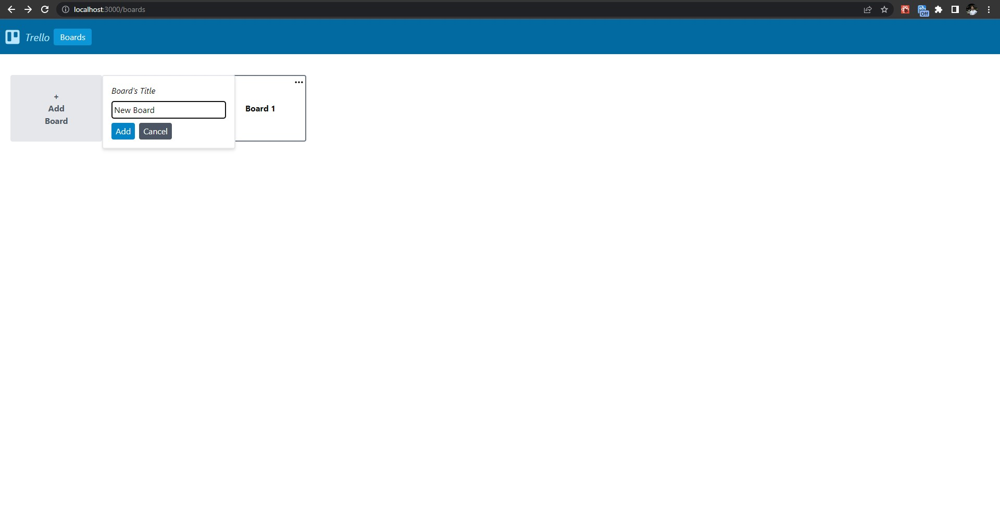
    
    Apart from BoardModel, one more entry will be created inside the BoardDataModel content model in reference to the newly created board. This BoardDataModel entry will store the additional information about a board like the order and count of cards and lists inside the board, and ID numbers for creating new IDs for lists and cards.
    

### Deleting a Board

- Add the following code to the `helpers.js` file:
    
    ```jsx
    export async function deleteBoardModel(id) {
      const board = await fetchAPI(
        `mutation deleteBoardModel($id:ID!){
          deleteBoardModel(revision:$id){
            data
          }
        }`,
        {
          variables: {
            id: id,
          },
        },
        false
      );
      return board.deleteBoardModel.data;
    }
    
    export async function deleteBoardDataModel(id) {
      const dataModel = await fetchAPI(
        `mutation deleteBoardDataModel($id:ID!){
          deleteBoardDataModel(revision:$id){
            data
          }
        }`,
        {
          variables: {
            id: id,
          },
        },
        false
      );
      return dataModel.deleteBoardDataModel.data;
    }
    
    export async function getBoardDataModelByBoardEntryId(boardEntryId) {
      const boardDetails = await fetchAPI(
        `query getBoardDataModelByBoardEntryId($entryId:String!){
          listBoardDataModels(where:{dataBoard:{entryId:$entryId}}){
            data{
              id,
              entryId,
              boardDataId,
              boardData
            }
          }
        }`,
        {
          variables: {
            entryId: boardEntryId,
          },
        },
        true
      );
      return boardDetails.listBoardDataModels.data[0];
    }
    
    export async function getBoardLists(boardEntryId) {
      const listModels = await fetchAPI(
        `query getBoardLists($entryId:String!){
          listListModels(where:{listBoard:{entryId:$entryId}}){
            data{
              id,
              entryId,
              listId,
              listTitle
            }
          }
        }`,
        {
          variables: {
            entryId: boardEntryId,
          },
        },
        true
      );
      return listModels.listListModels.data;
    }
    ```
    
- Add the following code to the `onDeleteBoardClick` function inside the `BoardFile.js` file:
    
    ```jsx
    async function onDeleteBoardClick(event) {
      event.preventDefault();
      let targetBoardId = props.board.boardId;
      let newBoardList = [...props.boardListState];
      let boardLists = await getBoardLists(props.board.id);
      if (boardLists.length === 0) {
        let boardDataModel = await getBoardDataModelByBoardEntryId(props.board.entryId);
        let deleteBoard = await deleteBoardModel(props.board.id);
        let deleteBoardData = await deleteBoardDataModel(boardDataModel.id);
        if (deleteBoard && deleteBoardData) {
          newBoardList.splice(props.index, 1);
          props.setBoardListState(newBoardList);
          document
            .getElementById("board-menu-" + targetBoardId)
            .classList.toggle("hidden");
        } else {
          document
            .getElementById("board-menu-" + targetBoardId)
            .classList.toggle("hidden");
          alert("Unable to delete the selected board");
        }
      } else {
        document
          .getElementById("board-menu-" + targetBoardId)
          .classList.toggle("hidden");
        alert("Cannot delete a non-empty board.");
      }
    }
    ```
    
    Now you can delete a board from the board menu. When you delete a board, the content entries in BoardModel and BoardDataModel content models corresponding to that board get unpublished. Only click the “Delete Board” option once and wait for board to be deleted.
    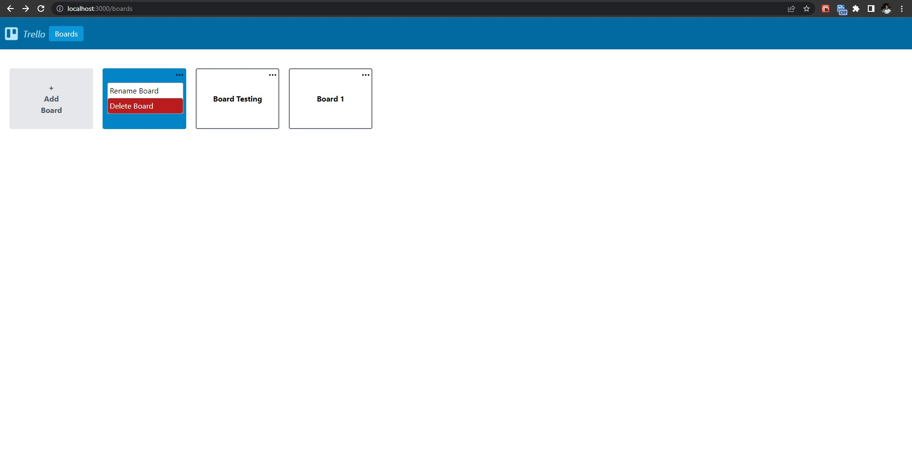
    

We have added the functionality of creating and deleting boards to our app. Before moving on to lists and cards, we need to configure some other things in our project.

1. Install React Beautiful DND in your application
    
    React Beautiful DND is a React library that adds drag-and-drop functionality to React components.
    
    To install React Beautiful DND, run the following command in the terminal in the root directory of your project:
    
    ```shell
    yarn add react-beautiful-dnd
    ```
    
2. Turn off React strict mode
    
    It is needed for nested components in React Beautiful DND to work properly.
    
    To turn off React strict mode open the `next.config.js` file in the root directory. Inside the `module.exports` object, set the value of “reactStrictMode” to false.
    
    The code will look like this:
    
    ```jsx
    module.exports = {
      reactStrictMode: false,
    };
    ```
    
3. Configure Hostname for images
    
    Next.js needs to know from which domain it should allow images in your project.
    
    In the `next.config.js` file, add your domain name to the array of domains from which images should be allowed. The code will look like this:
    
    ```jsx
    module.exports = {
      reactStrictMode: false,
      images: {
        domains: ["dc2xxxxxxxxx.cloudfront.net"] /*Put your domain here*/,
      },
    };
    ```
    
4. Define the Context for the application
    
    Context is a feature of React that provides a way to pass data through the component tree without having to pass props down manually at every level.
    
    In the `lib` folder, create a file named `appState.js` and add the following code:
    
    ```jsx
    import { createContext, useContext, useState } from "react";
    
    const AppContext = createContext();
    
    export function Wrapper({ children }) {
      const [state, setState] = useState({});
    
      return (
        <AppContext.Provider value={{ state, setState }}>
          {children}
        </AppContext.Provider>
      );
    }
    export function useAppContext() {
      return useContext(AppContext);
    }
    
    export default AppContext;
    ```
    
    Now go to the `_app.tsx` file and wrap the HTML returned by the component inside the context Wrapper. The code will look like this:
    
    ```jsx
    import "../styles/globals.css";
    import type { AppProps } from "next/app";
    import { Wrapper } from "../lib/appState";
    import Topbar from "../components/Topbar";
    
    function MyApp({ Component, pageProps }: AppProps) {
      return (
        <Wrapper>
          <Topbar />
          <Component {...pageProps} />
        </Wrapper>
      );
    }
    
    export default MyApp;
    ```
    

We can now move forward to adding the functionality of creating, deleting, and moving lists and cards inside the boards in our app.


## Conclusion

Congratulations! We have completed the first part of this tutorial and learned about how to setup a Webiny project and connect it with a Next.js application. 
So far, we've built board-related functionality; in the second part of this tutorial, we'll build a full Trello clone with list and card management.
[Let's check out the second part of this tutorial](/blog/build-trello-clone-nextjs-webiny-headless-cms-2-of-2/)!

**Full source code:** https://github.com/webiny/write-with-webiny/tree/main/tutorials/trello-clone

---

This article was written by a contributor to the Write with Webiny program. Would you like to write a technical article like this and get paid to do so? [Check out the Write with Webiny GitHub repo](https://github.com/webiny/write-with-webiny/).