Welcome to the second part of the tutorial series on how to build a Trello clone with Next.js and Webiny Headless CMS.
[In the previous tutorial](/blog/build-trello-clone-nextjs-webiny-headless-cms-1-of-2/), we've built board-related functionality, and in the second part of this tutorial,
we'll build a full Trello clone with list and card management. Let's start with featching lists and cards!

### Fetching Board Data (Lists and Cards)

- Let’s first add some dummy content to our database to fetch in our app.
    
    Add a new Board named “Test Board” in your application.
    
    In your Webiny CMS instance, go to ListModel content model and add the following three entries as you did in BoardModel content model:
    
    1. List ID : “list-1-b-t1” ; List Title : “List 1” ; List Board : “Test Board”
    2. List ID : “list-2-b-t1” ; List Title : “List 2” ; List Board : “Test Board”
    3. List ID : “list-3-b-t1” ; List Title : “List 3” ; List Board : “Test Board”
    
    Now go to the CardModel content model and add the following entries:
    
    1. Card ID: “card-1-b-t1” ; Card Title : “Card Title 1” ; Card Description : “Card Description 1” ; Card Image : [Add any image of your choice] ; Card List : “List 1”
    2. Card ID: “card-2-b-t1” ; Card Title : “Card Title 2” ; Card Description : “Card Description 2” ; Card Image : [Add any image of your choice] ; Card List : “List 1”
    3. Card ID: “card-3-b-t1” ; Card Title : “Card Title 3” ; Card Description : “Card Description 3” ; Card Image : [Add any image of your choice] ; Card List : “List 2”
    4. Card ID: “card-4-b-t1” ; Card Title : “Card Title 4” ; Card Description : “Card Description 4” ; Card Image : [Add any image of your choice] ; Card List : “List 2”
    5. Card ID: “card-5-b-t1” ; Card Title : “Card Title 5” ; Card Description : “Card Description 5” ; Card Image : [Add any image of your choice] ; Card List : “List 3”
    6. Card ID: “card-6-b-t1” ; Card Title : “Card Title 6” ; Card Description : “Card Description 6” ; Card Image : [Add any image of your choice] ; Card List : “List 3”
    
    Finally, go to BoardDataModel content model, edit the entry that was created on creating the “Test Board”, and set the following text as the value of the “Board Data” field:
    
    ```markdown
    {"board-card-count":6,"board-card-count-id":6,"board-list-count":3,"board-list-count-id":3,"board-list-order":["list-1-b-t1","list-2-b-t1","list-3-b-t1"],"board-card-order":{"list-1-b-t1":["card-1-b-t1","card-2-b-t1"],"list-2-b-t1":["card-3-b-t1","card-4-b-t1"],"list-3-b-t1":["card-5-b-t1","card-6-b-t1"]}}
    ```
    
    This is a stringified JavaScript object in which we store the additional information related to our board.
    
    Please note that this JavaScript object is created using the IDs of lists and cards. If you have not created the list and card content models in the previous step with exactly the IDs mentioned above, then your app might not work in the next step (You may modify the above string accordingly).
    
- Delete all the previously written code in the `[slug].js` file and add the following code:
    
    ```jsx
    import React from "react";
    import { useEffect } from "react";
    import { useRouter } from "next/router";
    import dynamic from "next/dynamic";
    import {
      getBoardByBoardId,
      getBoardDataModelByBoardEntryId,
      getBoardLists,
      getListCards,
    } from "../../lib/helpers";
    const Board = dynamic(() => import("../../components/Board"), { ssr: false });
    import { useAppContext } from "../../lib/appState";
    
    const slug = (props) => {
      const context = useAppContext();
      const router = useRouter();
      const { slug } = router.query;
      const newState = {
        [slug]: props.boardState,
      };
      useEffect(() => {
        context.setState(newState);
      }, []);
      return (
        <>
          <Board slug={slug} boardId={props.boardState["board-id"]} state={newState} />
        </>
      );
    };
    
    export async function getServerSideProps(context) {
      let boardState = {
        "board-db-id": null,
        "board-id": null,
        "board-title": null,
        "board-cards": {},
        "board-lists": {},
        "board-list-order": [],
        "board-card-count-id": null,
        "board-card-count": null,
        "board-list-count-id": null,
        "board-list-count": null,
      };
    
      const slug = context.params.slug;
      let board = await getBoardByBoardId(slug);
      boardState = {
        ...boardState,
        "board-db-id": board.id,
        "board-id": board.boardId,
        "board-title": board.boardTitle,
      };
    
      let bdm = await getBoardDataModelByBoardEntryId(board.entryId);
      const boardDataModel = JSON.parse(bdm.boardData);
    
      boardState = {
        ...boardState,
        "board-data-model-db-id": bdm.id,
        "board-list-order": boardDataModel["board-list-order"],
        "board-card-count-id": boardDataModel["board-card-count-id"],
        "board-card-count": boardDataModel["board-card-count"],
        "board-list-count-id": boardDataModel["board-list-count-id"],
        "board-list-count": boardDataModel["board-list-count"],
      };
    
      const boardLists = await getBoardLists(board.entryId);
      Object.keys(boardLists).forEach((key, index) => {
        boardState = {
          ...boardState,
          "board-lists": {
            ...boardState["board-lists"],
            [boardLists[key]["listId"]]: {
              "list-db-id": boardLists[key]["id"],
              "list-db-entry-id": boardLists[key]["entryId"],
              "list-id": boardLists[key]["listId"],
              "list-title": boardLists[key]["listTitle"],
              "list-cards-ids": boardDataModel["board-card-order"][
                boardLists[key]["listId"]
              ]
                ? boardDataModel["board-card-order"][boardLists[key]["listId"]]
                : [],
            },
          },
        };
      });
    
      for (const list of boardState["board-list-order"]) {
        const listCards = await getListCards(
          boardState["board-lists"][list]["list-db-entry-id"]
        );
        Object.keys(listCards).forEach((key, index) => {
          boardState = {
            ...boardState,
            "board-cards": {
              ...boardState["board-cards"],
              [listCards[key]["cardId"]]: {
                "card-db-id": listCards[key]["id"],
                "card-db-entry-id": listCards[key]["entryId"],
                "card-id": listCards[key]["cardId"],
                "card-title": listCards[key]["cardTitle"],
                "card-description": listCards[key]["cardDescription"],
                "card-cover-image": listCards[key]["cardImage"],
              },
            },
          };
        });
      }
    
      return {
        props: {
          boardState: boardState,
        },
      };
    }
    
    export default slug;
    ```
    
- Add the following code to the `helpers.js` file:
    
    ```jsx
    export async function getBoardByBoardId(boardId) {
      const boardDetails = await fetchAPI(
        `query getBoardByBoardId($boardId:String!){
          getBoardModel(where:{boardId:$boardId}){
            data{
              id,
              entryId,
              boardId,
              boardTitle
            }
          }
        }`,
        {
          variables: {
            boardId: boardId,
          },
        },
        true
      );
      return boardDetails.getBoardModel.data;
    }
    
    export async function getListCards(listEntryId) {
      const cardModels = await fetchAPI(
        `query getListCards($entryId:String!){
          listCardModels(where:{cardList:{entryId:$entryId}}){
            data{
              id,
              entryId,
              cardId,
              cardTitle,
              cardImage,
              cardDescription
            }
          }
        }`,
        {
          variables: {
            entryId: listEntryId,
          },
        },
        true
      );
      return cardModels.listCardModels.data;
    }
    ```
    
- In the `components` folder, create a file named `Board.js` and add the following code:
    
    ```jsx
    import React from "react";
    import List from "./List";
    import { DragDropContext, Droppable } from "react-beautiful-dnd";
    import Head from "next/head";
    import { useAppContext } from "../lib/appState";
    import styles from "../styles/Board.module.css";
    
    const Board = (props) => {
      let boardId = props.boardId;
      const context = useAppContext();
    
      /*onDragEnd*/
      async function onDragEnd(result) {}
      /*onDragEnd*/
    
      const onPlusList = () => {
        document.getElementById("list-adder-" + boardId).classList.toggle("hidden");
      };
    
      const onCancelListClick = () => {
        document.getElementById("list-adder-" + boardId).classList.toggle("hidden");
    
        document.getElementById("list-adder-title-input-" + boardId).value = null;
      };
    
      async function onAddListClick() {}
    
      return (
        <div className="bg-sky-600 w-full min-h-fit max-h-fit font-sans">
          <Head>
            <title>Trello Board - {context.state[boardId]["board-title"]}</title>
          </Head>
    
          <div className="flex text-white mt-0 p-4 mb-4 justify-center h-[4vh]">
            <h2>{context.state[boardId]["board-title"]}</h2>
          </div>
          <div className="flex px-4 items-start overflow-x-scroll min-h-[87vh] max-h-[100vh] overflow-y-hidden pb-5">
            <DragDropContext onDragEnd={onDragEnd}>
              <Droppable droppableId={boardId} type="list" direction="horizontal">
                {(provided, snapshot) => (
                  <div
                    className={`flex flex-row ${styles.listsContainer}`}
                    ref={provided.innerRef}
                    {...provided.droppableProps}
                  >
                    {context.state[boardId]["board-list-order"].map(
                      (listId, index) => {
                        return (
                          <List
                            key={listId}
                            index={index}
                            boardid={boardId}
                            listid={listId}
                          />
                        );
                      }
                    )}
                    <div className="rounded bg-gray-300  flex-no-shrink w-64 p-2 mr-3 h-min">
                      <div
                        id={`list-adder-${boardId}`}
                        className="bg-white pb-2 rounded mt-2 max-w-62 border-b border-grey cursor-pointer  transition-colors hover:bg-gray-100 relative hidden"
                      >
                        <form className="mx-2 py-2">
                          <div className="form-group my-1 flex flex-col">
                            <label
                              htmlFor={`list-adder-title-input-${boardId}`}
                              className={` text-gray-400 italic `}
                            >
                              List Title
                            </label>
                            <h5 className="list-title">
                              <textarea
                                id={`list-adder-title-input-${boardId}`}
                                className={`bg-transparent w-full resize-y border rounded border-gray-400 p-1`}
                                rows="1"
                              />
                            </h5>
                          </div>
    
                          <div className={` flex flex-row mt-3`}>
                            <input
                              type="button"
                              className={`mr-2 bg-sky-600 rounded px-2 py-1 text-white transition-colors hover:bg-sky-700`}
                              value="Add"
                              id={`list-adder-save-button-input-${boardId}`}
                              onClick={onAddListClick}
                            />
                            <input
                              type="button"
                              className={`mr-2 bg-gray-600 rounded px-2 py-1 text-white transition-colors hover:bg-gray-700`}
                              value="Cancel"
                              id={`list-adder-cancel-button-input-${boardId}`}
                              onClick={onCancelListClick}
                            />
                          </div>
                        </form>
                      </div>
                      <div
                        className="flex justify-between py-1 w-full cursor-pointer"
                        onClick={onPlusList}
                      >
                        Add List
                      </div>
                    </div>
    
                    {provided.placeholder}
                  </div>
                )}
              </Droppable>
            </DragDropContext>
          </div>
        </div>
      );
    };
    
    export default Board;
    ```
    
- In the `components` folder, create a file named `List.js` and add the following code:
    
    ```jsx
    import React from "react";
    import Card from "./Card";
    import { useAppContext } from "../lib/appState";
    import { Droppable, Draggable } from "react-beautiful-dnd";
    import { useState } from "react";
    
    const List = (props) => {
      const context = useAppContext();
    
      let newImage = null;
    
      const [listTitle, setListTitle] = useState(
        context.state[props.boardid]["board-lists"][props.listid]["list-title"]
      );
    
      const onImageChangeHandler = (event) => {
        newImage = event.target.files[0];
      };
    
      const onListMenuClick = () => {
        document
          .getElementById("list-menu-" + props.listid)
          .classList.toggle("hidden");
      };
    
      const onCancelClick = () => {
        document
          .getElementById(`card-adder-` + props.listid)
          .classList.toggle("hidden");
    
        document.getElementById("card-adder-image-input-" + props.listid).value =
          null;
        document.getElementById("card-adder-title-input-" + props.listid).value =
          null;
        document.getElementById(
          "card-adder-description-input-" + props.listid
        ).value = null;
      };
    
      const onAddCardClick = () => {
        var cardAdder = document.getElementById("card-adder-" + props.listid);
        cardAdder.classList.toggle("hidden");
        var topPos = cardAdder.offsetTop;
    
        document.getElementById("cardsHolder-" + props.listid).scrollTop = topPos;
      };
    
      const onTitleChange = (event) => {};
    
      const onTitleFocusOut = () => {};
    
      async function onAddCardButtonClick() {}
    
      async function onDeleteList() {}
    
      return (
        <Draggable
          key={props.listid}
          draggableId={`${props.listid}`}
          index={props["index"]}
        >
          {(provided) => (
            <div
              className={`rounded bg-gray-300 flex-no-shrink w-64 p-2 mr-3 h-min`}
              {...provided.draggableProps}
              ref={provided.innerRef}
            >
              <style jsx>
                {`
                  /* width */
                  .listbody::-webkit-scrollbar {
                    width: 5px;
                  }
    
                  /* Track */
                  .listbody::-webkit-scrollbar-track {
                    background: #f1f1f16b;
                    opacity: 0.5;
                    border-radius: 10px;
                  }
    
                  /* Handle */
                  .listbody::-webkit-scrollbar-thumb {
                    background: #888;
                    border-radius: 10px;
                  }
    
                  /* Handle on hover */
                  .listbody::-webkit-scrollbar-thumb:hover {
                    background: #555;
                  }
                `}
              </style>
              <div
                className="relative flex justify-between py-2 w-full"
                {...provided.dragHandleProps}
              >
                <h3 className={`text-sm font-bold`}>
                  <textarea
                    className={`p-[2px] bg-transparent resize-none w-48 focus:bg-white  listTitleTextArea listTitleTextAreaDisabled`}
                    value={listTitle}
                    onChange={onTitleChange}
                    onBlur={onTitleFocusOut}
                    rows="1"
                  />
                </h3>
                <div className="absolute right-0 z-10">
                  <div
                    onClick={onListMenuClick}
                    className=" absolute top-0 right-0 cursor-pointer rounded transition-colors hover:bg-gray-400 p-[2px]"
                  >
                    <svg
                      xmlns="http://www.w3.org/2000/svg"
                      width="20"
                      height="20"
                      viewBox="0 0 24 24"
                      fill="none"
                      stroke="#000000"
                      strokeWidth="2"
                      strokeLinecap="round"
                      strokeLinejoin="round"
                    >
                      <circle cx="12" cy="12" r="1"></circle>
                      <circle cx="19" cy="12" r="1"></circle>
                      <circle cx="5" cy="12" r="1"></circle>
                    </svg>
                  </div>
    
                  <div
                    id={`list-menu-${props.listid}`}
                    className="relative top-7 rounded bg-white border-[1px] border-gray-400 w-40 px-2 py-1 cursor-pointer transition-colors hover:bg-red-700 hover:text-white hidden"
                    onClick={onDeleteList}
                  >
                    <ul>
                      <li>Delete List</li>
                    </ul>
                  </div>
                </div>
              </div>
              <div
                id={`cardsHolder-${props.listid}`}
                className={`text-sm mt-2 overflow-x-hidden max-h-[70vh]  listbody`}
              >
                <Droppable droppableId={props.listid} type="card">
                  {(provided) => (
                    <div
                      className="min-h-[5px] "
                      ref={provided.innerRef}
                      {...provided.droppableProps}
                    >
                      {context.state[props.boardid]["board-lists"][props.listid][
                        "list-cards-ids"
                      ].map((cardid, index) => {
                        return (
                          <Card
                            key={cardid}
                            index={index}
                            cardid={cardid}
                            listid={props.listid}
                            boardid={props.boardid}
                          />
                        );
                      })}
                      {provided.placeholder}
                    </div>
                  )}
                </Droppable>
                <div
                  id={`card-adder-${props.listid}`}
                  className="bg-white pb-2 rounded mt-2 max-w-62 border-b border-grey cursor-pointer hidden transition-colors hover:bg-gray-100 relative"
                >
                  <form className="mx-2 py-2">
                    <div className={`form-group my-1`}>
                      <label
                        htmlFor={`card-adder-image-input-${props.listid}`}
                        className={` text-gray-400 italic`}
                      >
                        Cover Image
                      </label>
                      <input
                        id={`card-adder-image-input-${props.listid}`}
                        type="file"
                        accept="image/*"
                        className={`max-w-full`}
                        onChange={onImageChangeHandler}
                      />
                    </div>
    
                    <div className="form-group my-1 flex flex-col">
                      <label
                        htmlFor={`card-adder-title-input-${props.listid}`}
                        className={` text-gray-400 italic `}
                      >
                        Title
                      </label>
                      <h5 className="card-title font-bold">
                        <textarea
                          id={`card-adder-title-input-${props.listid}`}
                          className={`bg-transparent w-full resize-y border rounded border-gray-400 p-1`}
                          rows="1"
                        />
                      </h5>
                    </div>
    
                    <div className="form-group  my-1 flex flex-col">
                      <label
                        htmlFor={`card-adder-description-input-${props.listid}`}
                        className={` text-gray-400 italic`}
                      >
                        Description
                      </label>
                      <textarea
                        id={`card-adder-description-input-${props.listid}`}
                        className={`bg-transparent w-full resize-y border rounded border-gray-400 p-1`}
                        rows="2"
                      />
                    </div>
                    <div className={` flex flex-row mt-3`}>
                      <input
                        type="button"
                        className={`mr-2 bg-sky-600 rounded px-2 py-1 text-white transition-colors hover:bg-sky-700`}
                        onClick={onAddCardButtonClick}
                        value="Add"
                        id={`card-adder-save-button-input-${props.list}`}
                      />
                      <input
                        type="button"
                        className={`mr-2 bg-gray-600 rounded px-2 py-1 text-white transition-colors hover:bg-gray-700`}
                        onClick={onCancelClick}
                        value="Cancel"
                        id={`card-adder-cancel-button-input-${props.listid}`}
                      />
                    </div>
                  </form>
                </div>
              </div>
    
              <div className="w-full cursor-pointer" onClick={onAddCardClick}>
                <p className="mt-3 text-gray-500">Add a card...</p>
              </div>
            </div>
          )}
        </Draggable>
      );
    };
    
    export default List;
    ```
    
- In the `components` folder, create a file named `Card.js` and add the following code:
    
    ```jsx
    import React from "react";
    import { useAppContext } from "../lib/appState";
    import { useState } from "react";
    import Image from "next/image";
    import { Draggable } from "react-beautiful-dnd";
    
    const Card = (props) => {
      const context = useAppContext();
    
      const [isCardEditing, setCardEditing] = useState({
        [props.cardid]: {
          state: false,
        },
      });
    
      const [values, setValues] = useState({
        title:
          context.state[props.boardid]["board-cards"][props.cardid]["card-title"],
        description:
          context.state[props.boardid]["board-cards"][props.cardid][
            "card-description"
          ],
        image:
          context.state[props.boardid]["board-cards"][props.cardid][
            "card-cover-image"
          ],
      });
    
      const cardImage = () => {
        if (
          isCardEditing &&
          context.state[props.boardid]["board-cards"][props.cardid][
            "card-cover-image"
          ] &&
          context.state[props.boardid]["board-cards"][props.cardid][
            "card-cover-image"
          ] != ""
        ) {
          return (
            <Image
              src={values.image}
              className="w-full  rounded-t"
              alt="..."
              width="1920"
              height="1080"
            />
          );
        } else {
          return;
        }
      };
    
      const onEditButtonClick = () => {
        const newState = (isCardEditing = {
          ...isCardEditing,
          [props.cardid]: {
            state: true,
          },
        });
        setCardEditing(newState);
        enableEditingValues();
      };
    
      const onCancelEdit = () => {
        let oldTitle =
          context.state[props.boardid]["board-cards"][props.cardid]["card-title"];
        let oldDescription =
          context.state[props.boardid]["board-cards"][props.cardid][
            "card-description"
          ];
        let oldImage =
          context.state[props.boardid]["board-cards"][props.cardid][
            "card-cover-image"
          ];
    
        const newValuesState = {
          title: oldTitle,
          description: oldDescription,
          image: oldImage,
        };
        setValues(newValuesState);
    
        const newCardEditingState = (isCardEditing = {
          ...isCardEditing,
          [props.cardid]: {
            state: false,
          },
        });
        setCardEditing(newCardEditingState);
        disableEditingValues();
      };
    
      const enableEditingValues = () => {};
    
      const disableEditingValues = () => {};
    
      const onTitleChange = (event) => {};
    
      const onDescriptionChange = (event) => {};
    
      async function onSaveEdit() {}
    
      async function onDelete() {}
    
      return (
        <Draggable
          key={context.state[props.boardid]["board-cards"][props.cardid]["card-id"]}
          draggableId={`${
            context.state[props.boardid]["board-cards"][props.cardid]["card-id"]
          }`}
          index={props["index"]}
        >
          {(provided, snapshot) => (
            <div
              className="bg-white pb-2 rounded mt-2 border-b border-grey cursor-pointer transition-colors hover:bg-gray-100 relative"
              {...provided.draggableProps}
              {...provided.dragHandleProps}
              ref={provided.innerRef}
            >
              <div className={`w-full rounded`}>{cardImage()}</div>
              <div
                className={`absolute right-2 top-2 border-2 border-white rounded bg-white transition-colors hover:bg-gray-300 hover:border-gray-200 cursor-pointer ${
                  isCardEditing[props.cardid]["state"] ? `hidden` : `visible`
                }`}
                onClick={onEditButtonClick}
              >
                <svg
                  xmlns="http://www.w3.org/2000/svg"
                  width="20"
                  height="20"
                  viewBox="0 0 24 24"
                  fill="none"
                  stroke="#000000"
                  strokeWidth="2"
                  strokeLinecap="round"
                  strokeLinejoin="round"
                >
                  <path d="M20 14.66V20a2 2 0 0 1-2 2H4a2 2 0 0 1-2-2V6a2 2 0 0 1 2-2h5.34"></path>
                  <polygon points="18 2 22 6 12 16 8 16 8 12 18 2"></polygon>
                </svg>
              </div>
              <form className="mx-2 py-2">
                <div className="form-group my-1 flex flex-col">
                  <label
                    htmlFor={`card-editor-title-input-${props.cardid}`}
                    className={` text-gray-400 italic ${
                      isCardEditing[props.cardid]["state"]
                        ? `visible`
                        : `hidden h-0`
                    }`}
                  >
                    Title
                  </label>
                  <h5 className="card-title font-bold">
                    <textarea
                      id={`card-editor-title-input-${props.cardid}`}
                      className={`bg-transparent w-full ${
                        isCardEditing[props.cardid]["state"]
                          ? `resize-y border rounded border-gray-400 p-1`
                          : `resize-none`
                      }`}
                      value={values.title}
                      rows="1"
                      onChange={onTitleChange}
                      disabled
                    />
                  </h5>
                </div>
    
                <div className="form-group  my-1 flex flex-col">
                  <label
                    htmlFor={`card-editor-description-input-${props.cardid}`}
                    className={` text-gray-400 italic ${
                      isCardEditing[props.cardid]["state"] ? `visible` : `hidden`
                    }`}
                  >
                    Description
                  </label>
                  <textarea
                    id={`card-editor-description-input-${props.cardid}`}
                    className={`bg-transparent w-full ${
                      isCardEditing[props.cardid]["state"]
                        ? `resize-y border rounded border-gray-400 p-1`
                        : `resize-none`
                    }`}
                    value={values.description}
                    rows="2"
                    onChange={onDescriptionChange}
                    disabled
                  />
                </div>
                <div
                  className={` flex flex-row mt-3 ${
                    isCardEditing[props.cardid]["state"] ? `visible` : `hidden`
                  }`}
                >
                  <input
                    type="button"
                    data-listid={props.listid}
                    className={`mr-2 bg-sky-600 rounded px-2 py-1 text-white transition-colors hover:bg-sky-700`}
                    onClick={onSaveEdit}
                    value="Save"
                    id={`card-editor-save-button-input-${props.cardid}`}
                  />
                  <input
                    type="button"
                    data-list={props.listid}
                    className={`mr-2 bg-gray-600 rounded px-2 py-1 text-white transition-colors hover:bg-gray-700`}
                    onClick={onCancelEdit}
                    value="Cancel"
                    id={`card-editor-cancel-button-input-${props.cardid}`}
                  />
    
                  <input
                    type="button"
                    data-list={props.listid}
                    className={`mr-2 bg-red-600 rounded px-2 py-1 text-white transition-colors hover:bg-red-700`}
                    onClick={onDelete}
                    value="Delete"
                    id={`card-editor-cancel-button-input-${props.cardid}`}
                  />
                </div>
              </form>
            </div>
          )}
        </Draggable>
      );
    };
    
    export default Card;
    ```
    
- Now click on the “Test Board” board. The cards and lists you added to your Webiny instance are displayed in the trello board view.
    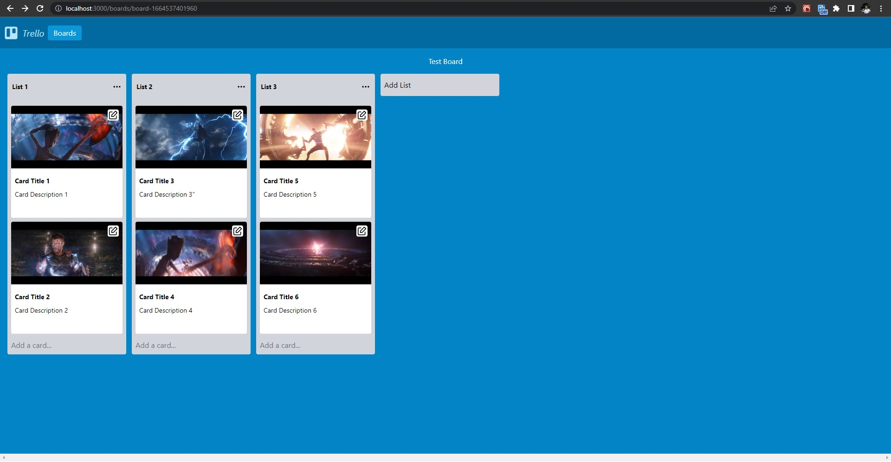

You can drag and move lists horizontally. You can also drag cards inside a list and from one list to another.

But right now, you won’t be able to reorder the cards and lists. After dropping a card or list, the view will come back to its initial state.

To persist in the reordered state we need to update the state of our app’s context and we also need to modify the data stored in the BoardDataModel content model.

### Reordering Lists and Cards

- Add the following code to the `helpers.js` file:
    
    ```jsx
    export async function updateBoardDataModel(params) {
      const boardDataModel = await fetchAPI(
        `mutation updateCreateBoardDataModel($dataModelId:ID!,$boardData:String!){
          createBoardDataModelFrom(revision:$dataModelId,data:{boardData:$boardData}){
            data{
              id,
              boardDataId,
              boardData,
            }
          }
        }`,
        {
          variables: {
            dataModelId: params.dataModelId,
            boardData: params.boardData,
          },
        },
        false
      );
      const modelData = await publishBoardDataModel(
        boardDataModel.createBoardDataModelFrom.data.id
      );
      return modelData;
    }
    ```
    
- Add the following import to the `[slug].js` file:
    
    ```jsx
    import { updateBoardDataModel } from "../../lib/helpers";
    ```
    
    Add the following (function) code to the `[slug].js` file (outside the `slug` function) as shown:
    
    ```jsx
    const slug = (props) => {
      //...
    };
    
    export async function buildUpdatedBoardDataModel(boardState, context) {
      let updatedBoardDataModel = {
        "board-card-count": boardState["board-card-count"],
        "board-card-count-id": boardState["board-card-count-id"],
        "board-list-count": boardState["board-list-count"],
        "board-list-count-id": boardState["board-list-count-id"],
        "board-list-order": boardState["board-list-order"],
        "board-card-order": {},
      };
    
      Object.keys(boardState["board-lists"]).forEach((listKey) => {
        updatedBoardDataModel["board-card-order"][listKey] =
          boardState["board-lists"][listKey]["list-cards-ids"];
      });
      let update = await updateBoardDataModel({
        dataModelId: boardState["board-data-model-db-id"],
        boardData: JSON.stringify(updatedBoardDataModel),
      });
    
      context.state[boardState["board-id"]]["board-data-model-db-id"] = update.id;
    }
    
    export async function getServerSideProps(context) {
      //...
    }
    ```
    
- Add the following import to the `Board.js` file:
    
    ```jsx
    import { buildUpdatedBoardDataModel } from "../pages/Boards/[slug]";
    ```
    
    Add the following code to the `onDragEnd` function inside the `Board.js` file :
    
    ```jsx
    async function onDragEnd(result) {
      const { destination, source, draggableId, type } = result;
    
      if (!destination) {
        return;
      }
      if (
        destination.droppableId === source.droppableId /*is in same column*/ &&
        destination.index === source.index /*is at same place(index) as before*/
      ) {
        return;
      }
    
      if (type === "list") {
        const newListOrder = Array.from(context.state[boardId]["board-list-order"]);
        newListOrder.splice(source.index, 1);
        newListOrder.splice(destination.index, 0, draggableId);
    
        const newState = {
          ...context.state,
          [boardId]: {
            ...context.state[boardId],
            "board-list-order": newListOrder,
          },
        };
        context.setState(newState);
        buildUpdatedBoardDataModel(newState[boardId], context);
        return;
      }
    
      const start =
        context.state[boardId]["board-lists"][
          source.droppableId
        ]; /*Initial column */
      const finish =
        context.state[boardId]["board-lists"][
          destination.droppableId
        ]; /*Final column */
    
      if (start === finish) {
        const newCardIds = Array.from(start["list-cards-ids"]);
        newCardIds.splice(source.index, 1);
        newCardIds.splice(destination.index, 0, draggableId);
    
        const newList = {
          ...start /*Copies all the arguments as initial column*/,
          "list-cards-ids": newCardIds /*Overwrites the taskIds with new values*/,
        };
    
        const newState = {
          ...context.state,
          [boardId]: {
            ...context.state[boardId],
            "board-lists": {
              ...context.state[boardId]["board-lists"],
              [newList["list-id"]]: newList /*Overwrites column*/,
            },
          },
        };
    
        buildUpdatedBoardDataModel(newState[boardId], context);
        context.setState(newState);
      }
    
      // Moving from one list to another list
      else if (start != finish) {
        const startCardIds = Array.from(start["list-cards-ids"]);
        startCardIds.splice(source.index, 1);
        const newStart = {
          ...start,
          "list-cards-ids": startCardIds,
        };
        const finishCardIds = Array.from(finish["list-cards-ids"]);
        finishCardIds.splice(destination.index, 0, draggableId);
        const newFinish = {
          ...finish,
          "list-cards-ids": finishCardIds,
        };
    
        const newState = {
          ...context.state,
          [boardId]: {
            ...context.state[boardId],
            "board-lists": {
              ...context.state[boardId]["board-lists"],
              [newStart["list-id"]]: newStart,
              [newFinish["list-id"]]: newFinish,
            },
          },
        };
    
        buildUpdatedBoardDataModel(newState[boardId], context);
        context.setState(newState);
      }
    }
    ```
    
- Now you can reorder lists by dragging and dropping them. You can reorder cards inside lists and between lists. And, the reordered state persists even after reloading the page as the data gets updated on the server side too.
    
    

### Adding a List

- Add the following code to the `helpers.js` file:
    
    ```jsx
    export async function createListModel(params) {
      const list = await fetchAPI(
        `mutation createListModel($listId:String!, $listTitle:String!, $boardId:ID!){
          createListModel(data:{listId:$listId, listTitle:$listTitle, listBoard:{modelId:"boardModel",id:$boardId}}){
            data{
              id
            }
          }
        }`,
        {
          variables: {
            boardId: params.boardId,
            listId: params.listId,
            listTitle: params.listTitle,
          },
        },
        false
      );
      const publishedList = await publishListModel(list.createListModel.data.id);
      return publishedList;
    }
    
    export async function publishListModel(id) {
      const list = await fetchAPI(
        `mutation publishListModel($id:ID!){
          publishListModel(revision:$id){
            data{
              id,
              entryId,
              listId,
              listTitle
            }
          }
        }`,
        {
          variables: {
            id: id,
          },
        },
        false
      );
      return list.publishListModel.data;
    }
    ```
    
- Add the following import to the top of the `Board.js` file:
    
    ```jsx
    import { createListModel } from "../lib/helpers";
    ```
    
    Add the following code to the `onAddListClick` function inside the `Board.js` file:
    
    ```jsx
    async function onAddListClick() {
      let title = document.getElementById(
        "list-adder-title-input-" + boardId
      ).value;
      if (title != "") {
        let currentListCountId = context.state[boardId]["board-list-count-id"];
        let currentListCount = context.state[boardId]["board-list-count"];
        let boardIdNum = context.state[boardId]["board-id"].replace("board-", "");
        let newListId = "list-" + (currentListCountId + 1) + "-b-" + boardIdNum;
        let newList = await createListModel({
          boardId: context.state[boardId]["board-db-id"],
          listId: newListId,
          listTitle: title,
        });
    
        if (newList.listId) {
          let newState = {
            ...context.state,
            [boardId]: {
              ...context.state[boardId],
              "board-lists": {
                ...context.state[boardId]["board-lists"],
                [newListId]: {
                  "list-db-id": newList.id,
                  "list-db-entry-id": newList.entryId,
                  "list-id": newListId,
                  "list-title": title,
                  "list-cards-ids": [],
                },
              },
              "board-list-order": [
                ...context.state[boardId]["board-list-order"],
                newListId,
              ],
              "board-list-count-id": currentListCountId + 1,
              "board-list-count": currentListCount + 1,
            },
          };
          context.setState(newState);
          buildUpdatedBoardDataModel(newState[boardId], context);
        } else {
          alert("Failed to create new list");
        }
    
        onCancelListClick();
      } else {
        alert("Please enter a title for the List");
      }
    }
    ```
    
- Now you can add a list by entering a list title and clicking on the “Add” button inside the “Add List” form. Only click the “Add” button once and wait for the list to be added.

    Adding a new list:
    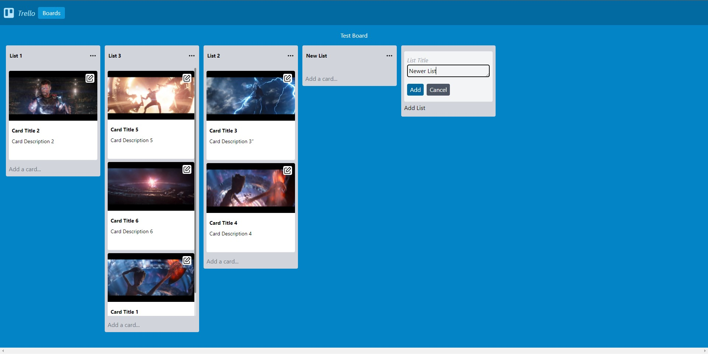

    Preview: 
    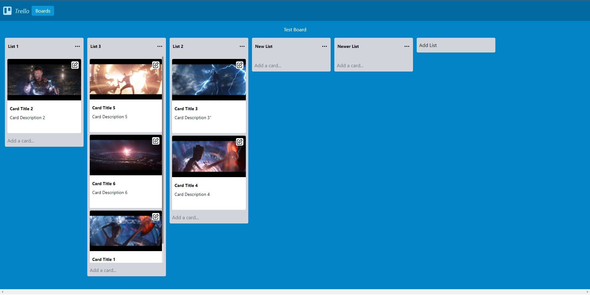

### Adding a Card

- Add the following code to the `helpers.js` file:
    
    ```jsx
    async function fetchMainAPI(query, { variables } = {}) {
      const url = process.env.NEXT_PUBLIC_WEBINY_API_MAIN_URL;
      const res = await fetch(url, {
        method: "POST",
        headers: {
          "Content-Type": "application/json",
          Authorization: `Bearer ${process.env.NEXT_PUBLIC_WEBINY_API_SECRET}`,
        },
        body: JSON.stringify({
          query,
          variables,
        }),
      });
      const json = await res.json();
      if (json.errors) {
        throw new Error("Failed to fetch API", json.errors);
      }
      return json.data;
    }
    
    export async function createCardModel(params) {
      const card = await fetchAPI(
        `mutation createCardModel(
          $cardId:String!,
          $cardTitle:String!,
          $cardDescription:String!,
          $cardImage:String!,
          $listId:ID!)
        {
          createCardModel(data:{
            cardId:$cardId,
            cardTitle:$cardTitle,
            cardDescription:$cardDescription,
            cardImage:$cardImage,
            cardList:{modelId:"listModel",id:$listId}})
          {
            data{
              id
            }
          }
        }`,
        {
          variables: {
            listId: params.listId,
            cardId: params.cardId,
            cardTitle: params.cardTitle,
            cardDescription: params.cardDescription,
            cardImage: params.cardImage,
          },
        },
        false
      );
      const publishedCard = await publishCardModel(card.createCardModel.data.id);
      return publishedCard;
    }
    
    export async function publishCardModel(id) {
      const card = await fetchAPI(
        `mutation publishCardModel($id:ID!){
          publishCardModel(revision:$id){
            data{
              id,
              entryId,
              cardId,
              cardTitle,
              cardImage,
              cardDescription
            }
          }
        }`,
        {
          variables: {
            id: id,
          },
        },
        false
      );
      return card.publishCardModel.data;
    }
    
    export async function getPreSignedPostImageData(image) {
      const preSignedPostPayload = await fetchMainAPI(
        `query getPreSignedPostPayloadData($data: PreSignedPostPayloadInput!) {
          fileManager {
            getPreSignedPostPayload(data: $data) {
              data {
                data
                file {
                  name
                  type
                  size
                  key
                }
              }
            }
          }
        }`,
        {
          variables: {
            data: {
              name: image.name,
              type: image.type,
              size: image.size,
            },
          },
        }
      );
    
      return preSignedPostPayload.fileManager.getPreSignedPostPayload.data;
    }
    
    export async function uploadToS3Bucket({ url, fields }, file) {
      const formData = new FormData();
      Object.keys(fields).forEach((key) => {
        formData.append(key, fields[key]);
      });
      // Actual file has to be appended last.
      formData.append("file", file);
      const res = await fetch(url, {
        method: "POST",
        "Content-Type": "multipart/form-data",
        body: formData,
      });
      return res;
    }
    
    export async function createImageFile(file) {
      const createFile = await fetchMainAPI(
        `mutation CreateFile($data: FileInput!) {
          fileManager {
            createFile(data: $data) {
              error {
                code
                message
                data
              }
              data {
                id
                name
                key
                src
                size
                type
                tags
                createdOn
                createdBy {
                  id
                }
              }
            }
          }
        }`,
        {
          variables: {
            data: {
              type: file.type,
              name: file.name,
              size: file.size,
              key: file.key,
              tags: [],
            },
          },
        }
      );
    
      return createFile.fileManager.createFile.data;
    }
    ```
    
- Add the following imports to the `List.js` file:
    
    ```jsx
    import { createCardModel, createImageFile, getPreSignedPostImageData, uploadToS3Bucket} from "../lib/helpers";
    import { buildUpdatedBoardDataModel } from "../pages/Boards/[slug]";
    ```
    
    Add the following code to the `onAddCardButtonClick` function inside the `List.js` file:
    
    ```jsx
    async function onAddCardButtonClick() {
        let image = newImage;
        let title = document.getElementById(
          "card-adder-title-input-" + props.listid
        ).value;
        let description = document.getElementById(
          "card-adder-description-input-" + props.listid
        ).value;
        let imgSrc = "";
    
        if (title) {
          if (image) {
            let preSignedPostPayloadData = await getPreSignedPostImageData(image);
            let uploadToS3BucketData = await uploadToS3Bucket(
              preSignedPostPayloadData.data,
              image
            );
            let createFileData = await createImageFile(
              preSignedPostPayloadData.file
            );
            imgSrc = createFileData.src;
          }
          let currentCardCountId =
            context.state[props.boardid]["board-card-count-id"];
          let currentCardCount = context.state[props.boardid]["board-card-count"];
          let boardIdNum = context.state[props.boardid]["board-id"].replace(
            "board-",
            ""
          );
          let newCardId = "card-" + (currentCardCountId + 1) + "-b-" + boardIdNum;
          let addCard = await createCardModel({
            listId:
              context.state[props.boardid]["board-lists"][props.listid][
                "list-db-id"
              ],
            cardId: newCardId,
            cardTitle: title,
            cardDescription: description,
            cardImage: imgSrc,
          });
          if (addCard.id) {
            const newState = {
              ...context.state,
              [props.boardid]: {
                ...context.state[props.boardid],
                "board-cards": {
                  ...context.state[props.boardid]["board-cards"],
                  [newCardId]: {
                    "card-db-id": addCard.id,
                    "card-db-entry-id": addCard.entryId,
                    "card-id": newCardId,
                    "card-title": title,
                    "card-description": description,
                    "card-cover-image": imgSrc,
                  },
                },
                "board-lists": {
                  ...context.state[props.boardid]["board-lists"],
                  [props.listid]: {
                    ...context.state[props.boardid]["board-lists"][props.listid],
                    "list-cards-ids": [
                      ...context.state[props.boardid]["board-lists"][props.listid][
                        "list-cards-ids"
                      ],
                      newCardId,
                    ],
                  },
                },
                "board-card-count-id": currentCardCountId + 1,
                "board-card-count": currentCardCount + 1,
              },
            };
            context.setState(newState);
            onCancelClick();
            buildUpdatedBoardDataModel(newState[props.boardid], context);
          } else {
            onCancelClick();
            alert("Failed to Add Card");
          }
        } else {
          alert("Please enter a title for the Card");
        }
      }
    ```
    
- Now you can add a card by entering a card title and card description, choosing a card image, and clicking on the “Add” button inside the “Add Card” form. Only click the “Add” button once and wait for the card to be added. 

    Add a new card:
    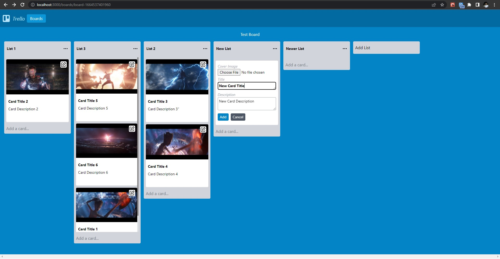
    
    Preview:
    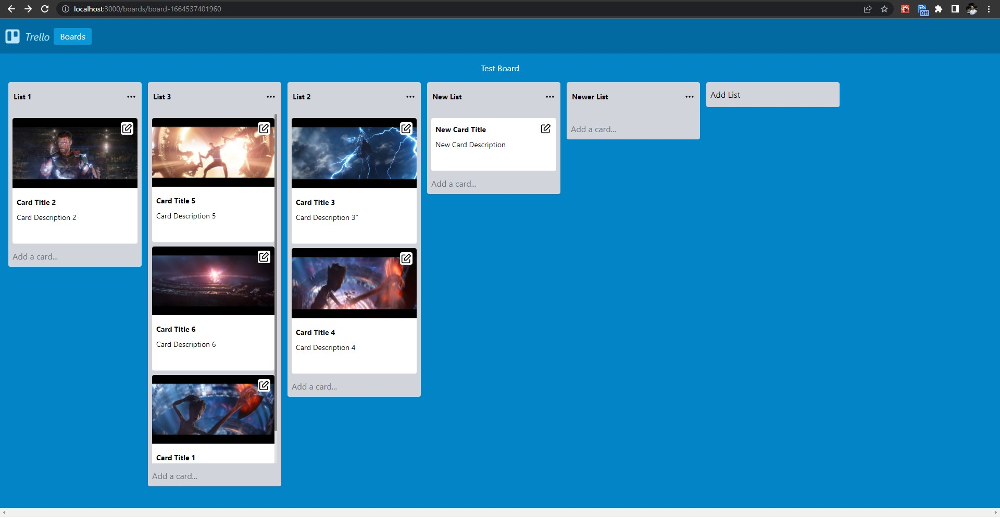
    

### Deleting a List

- Add the following code to the `helpers.js` file:
    
    ```jsx
    export async function deleteListModel(id) {
      const deleteList = await fetchAPI(
        `mutation deleteListModel($id:ID!){
          deleteListModel(revision:$id){
            data
          }
        }`,
        {
          variables: {
            id: id,
          },
        },
        false
      );
      return deleteList.deleteListModel.data;
    }
    ```
    
- Add the following import to the `List.js` file:
    
    ```jsx
    import { deleteListModel } from "../lib/helpers";
    ```
    
    Add the following code to the `onDeleteList` function inside the `List.js` file:
    
    ```jsx
    async function onDeleteList() {
      let listCards =
        context.state[props.boardid]["board-lists"][props.listid]["list-cards-ids"];
      if (listCards.length === 0) {
        let deleteList = await deleteListModel(
          context.state[props.boardid]["board-lists"][props.listid]["list-db-id"]
        );
        if (deleteList) {
          const newState = { ...context.state };
    
          let listIndex = newState[props.boardid]["board-list-order"].indexOf(
            props.listid
          );
    
          newState[props.boardid]["board-list-order"].splice(listIndex, 1);
          delete newState[props.boardid]["board-lists"][props.listid];
          newState[props.boardid]["board-list-count"]--;
    
          buildUpdatedBoardDataModel(newState[props.boardid], context);
          context.setState(newState);
        }
      } else {
        onListMenuClick();
        alert("Cannot delete a non-empty list.");
      }
    }
    ```
    
- Now you can delete a list by clicking on “Delete List” inside the list menu. Only click the “Delete List” option once and wait for the list to be deleted.

    Delete a list:
    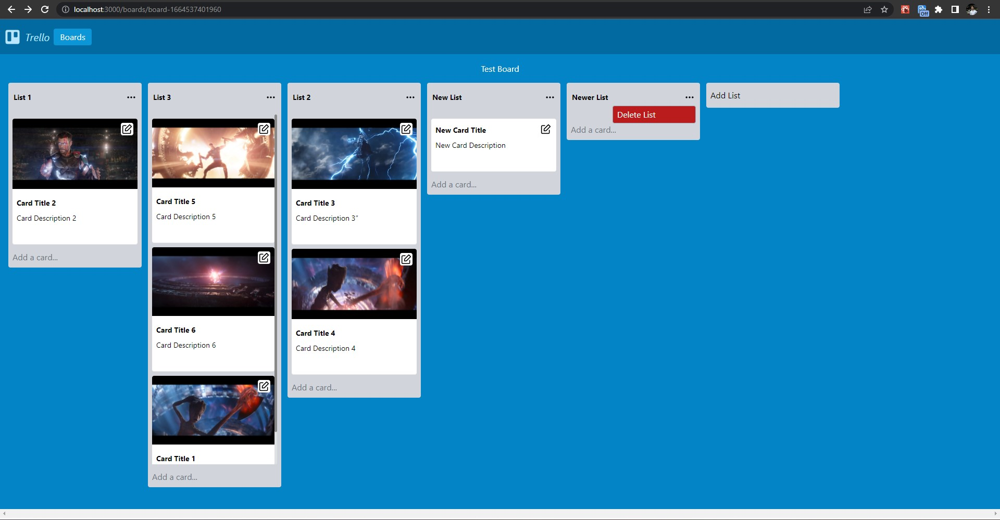
    
    Preview:
    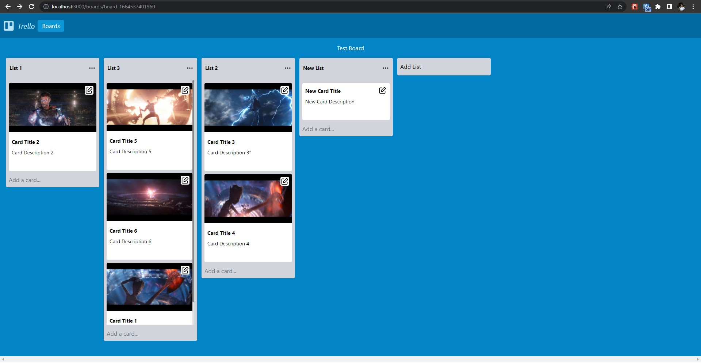
    

### Deleting a Card

- Add the following code to the `helpers.js` file:
    
    ```jsx
    export async function deleteCardModel(id) {
      const card = await fetchAPI(
        `mutation deleteCardModel($id:ID!){
          deleteCardModel(revision:$id){
            data
          }
        }`,
        {
          variables: {
            id: id,
          },
        },
        false
      );
      return card.deleteCardModel.data;
    }
    ```
    
- Add the following imports to the `Card.js` file:
    
    ```jsx
    import { deleteCardModel } from "../lib/helpers";
    import { buildUpdatedBoardDataModel } from "../pages/Boards/[slug]";
    ```
    
    Add the following code to the `onDelete` function inside the `Card.js` file:
    
    ```jsx
    async function onDelete() {
      let deleteCard = await deleteCardModel(
        context.state[props.boardid]["board-cards"][props.cardid]["card-db-id"]
      );
      if (deleteCard) {
        const newState = { ...context.state };
        let index = newState[props.boardid]["board-lists"][props.listid][
          "list-cards-ids"
        ].indexOf(props.cardid);
        newState[props.boardid]["board-lists"][props.listid][
          "list-cards-ids"
        ].splice(index, 1);
        delete newState[props.boardid]["board-cards"][props.cardid];
        newState[props.boardid]["board-card-count"]--;
        context.setState(newState);
        buildUpdatedBoardDataModel(newState[props.boardid], context);
      }
    }
    ```
    
- Now you can delete a card by clicking on the “Delete” button inside the card edit form. Only click the “Delete Card” option once and wait for the card to be deleted.

    Delete a card:
    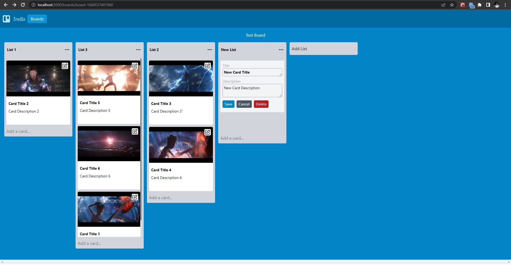
    
    Preview:
    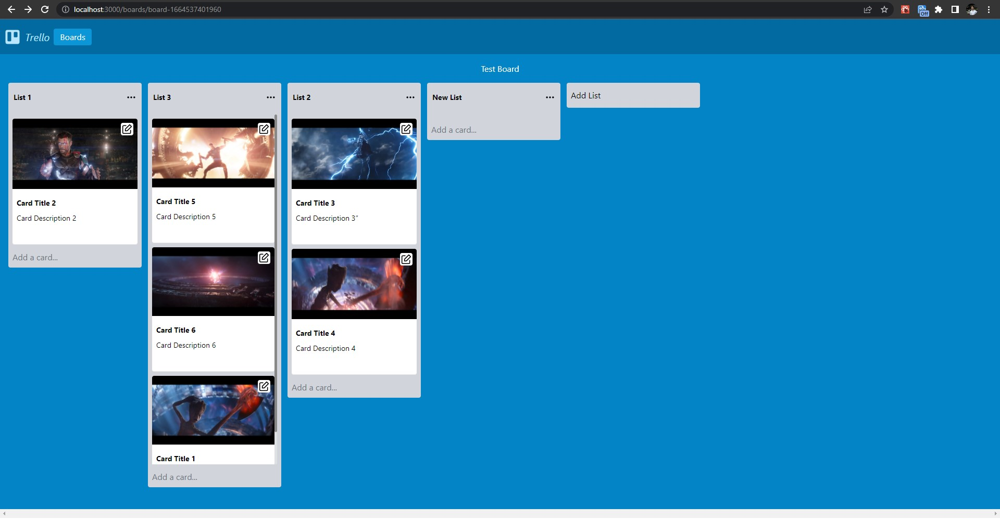
    

### Updating a Board (Title):

- Add the following code to the `helpers.js` file:
    
    ```jsx
    export async function updateBoardModel(params) {
      const board = await fetchAPI(
        `mutation updateBoardModel($id:ID!,$title:String!){
          createBoardModelFrom(revision:$id,data:{boardTitle:$title}){
            data{
              id,
            }
          }
        }`,
        {
          variables: {
            id: params.id,
            title: params.title,
          },
        },
        false
      );
      const newBoard = publishBoardModel(board.createBoardModelFrom.data.id);
      deleteBoardModel(params.id);
      return newBoard;
    }
    ```
    
- Add the following import to the `BoardFile.js` file:
    
    ```jsx
    import { updateBoardModel } from "../lib/helpers";
    ```
    
- Add the following code to the `onSaveRenameButtonClick` function inside the `BoardFile.js` file:
    
    ```jsx
    async function onSaveRenameButtonClick(event) {
        event.preventDefault();
        let targetBoardId = props.board.boardId;
        let newBoardsList = [...props.boardListState];
        let newBoardTitle = document.getElementById(
          "board-rename-input-" + targetBoardId
        ).value;
        let renamedBoard = await updateBoardModel({
          id: props.board.id,
          title: newBoardTitle,
        });
        newBoardsList.splice(props.index, 1, renamedBoard);
        props.setBoardListState(newBoardsList);
    
        document
          .getElementById("board-editor-" + targetBoardId)
          .classList.toggle("hidden");
      }
    ```
    
- Now you can rename a board by clicking on the “Rename Board” button. 

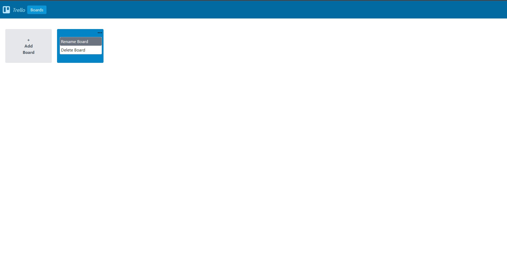

Click the “Save” button once and wait for the board to be updated.

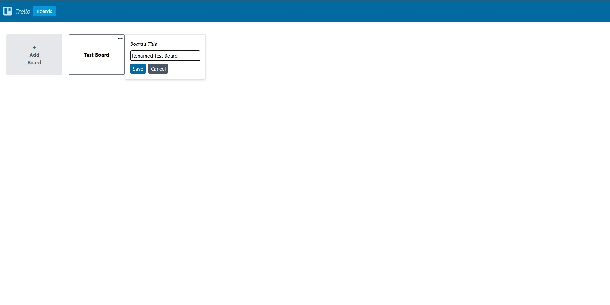

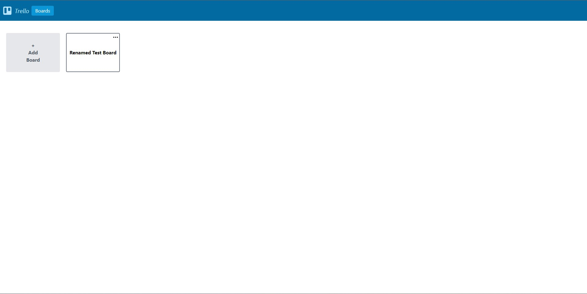

### Updating a List (Title):

- Add the following code to the `helpers.js` file:
    
    ```jsx
    export async function updateListModel(params) {
      const list = await fetchAPI(
        `mutation updateListModel($id:ID!,$title:String!){
          createListModelFrom(revision:$id,data:{listTitle:$title}){
            data{
              id,
            }
          }
        }`,
        {
          variables: {
            id: params.id,
            title: params.title,
          },
        },
        false
      );
      const newList = publishListModel(list.createListModelFrom.data.id);
      deleteListModel(params.id);
      return newList;
    }
    ```
    
- Add the following import to the List.js file:
    
    ```jsx
    import {  updateListModel } from "../lib/helpers";
    ```
    
- Add the following code to the `onTitleChange` function inside the `List.js` file:
    
    ```jsx
    const onTitleChange = (event) => {
        setListTitle(event.target.value);
      };
    ```
    
- Add the following code to the `onTitleFocusOut` function inside the List.js file:
    
    ```jsx
    const onTitleFocusOut = async () => {
        let updatedList = await updateListModel({
          id: context.state[props.boardid]["board-lists"][props.listid][
            "list-db-id"
          ],
          title: listTitle,
        });
        const newTitleState = {
          ...context.state,
          [props.boardid]: {
            ...context.state[props.boardid],
            "board-lists": {
              ...context.state[props.boardid]["board-lists"],
              [props.listid]: {
                ...context.state[props.boardid]["board-lists"][props.listid],
                "list-db-id": updatedList.id,
                "list-title": listTitle,
              },
            },
          },
        };
        context.setState(newTitleState);
      };
    ```
    
- Now you can rename a list by clicking on the title and simply edit it.
    
    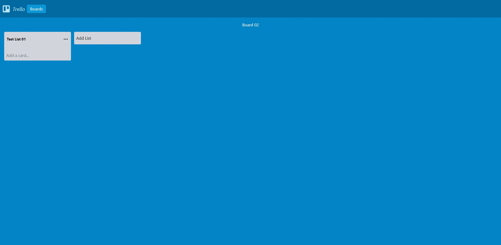

    

    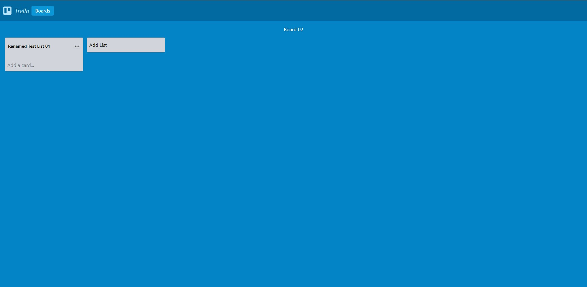    
    

### Updating a Card (Title & Description)

- Add the following code to the `helpers.js` file:
    
    ```jsx
    export async function updateCardModel(params) {
      const card = await fetchAPI(
        `mutation updateCardModel($id:ID!,$title:String,$description:String){
          createCardModelFrom(revision:$id,data:{cardTitle:$title,cardDescription:$description}){
            data{
              id
            }
          }
        }`,
        {
          variables: {
            id: params.id,
            title: params.title,
            description: params.description,
          },
        },
        false
      );
      const newCard = publishCardModel(card.createCardModelFrom.data.id);
      deleteCardModel(params.id);
      return newCard;
    }
    ```
    
- Add the following import to the `Card.js` file:
    
    ```jsx
    import { updateCardModel } from "../lib/helpers";
    ```
    
- Add the following code to the `enableEditingValues`, `disableEditingValues`, `onTitleChange`,  and `onDescriptionChange` functions inside the `Card.js` file respectively:
    
    ```jsx
    const enableEditingValues = () => {
        let titleArea = document.getElementById(
          "card-editor-title-input-" + props.cardid
        );
        let descriptionArea = document.getElementById(
          "card-editor-description-input-" + props.cardid
        );
        titleArea.removeAttribute("disabled");
        descriptionArea.removeAttribute("disabled");
      };
    
    const disableEditingValues = () => {
        let titleArea = document.getElementById(
          "card-editor-title-input-" + props.cardid
        );
        let descriptionArea = document.getElementById(
          "card-editor-description-input-" + props.cardid
        );
        titleArea.setAttribute("disabled", "");
        descriptionArea.setAttribute("disabled", "");
      };
    
    const onTitleChange = (event) => {
        const newTitleState = {
          ...values,
          title: event.target.value,
        };
        setValues(newTitleState);
      };
    ```
    
- Add the following code to the `onSaveEdit` function inside the `Card.js` file:
    
    ```jsx
    const onSaveEdit = async () => {
        let updatedCard = updateCardModel({
          id: context.state[props.boardid]["board-cards"][props.cardid][
            "card-db-id"
          ],
          title: values.title,
          description: values.description,
        });
        const newState = {
          ...context.state,
          [props.boardid]: {
            ...context.state[props.boardid],
            "board-cards": {
              ...context.state[props.boardid]["board-cards"],
              [props.cardid]: {
                ...context.state[props.boardid]["board-cards"][props.cardid],
                "card-db-id": updatedCard.id,
                "card-title": values.title,
                "card-description": values.description,
              },
            },
          },
        };
        context.setState(newState);
    
        const newCardEditingState = (isCardEditing = {
          ...isCardEditing,
          [props.cardid]: {
            state: false,
          },
        });
        setCardEditing(newCardEditingState);
        disableEditingValues();
      };
    ```
    
- Now you can change the title and description of a card by editing the fields and clicking on the “Save” button inside the edit card form.

    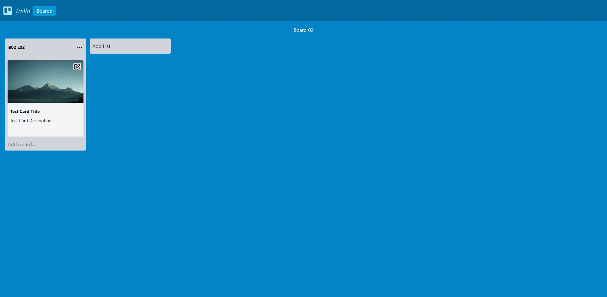

    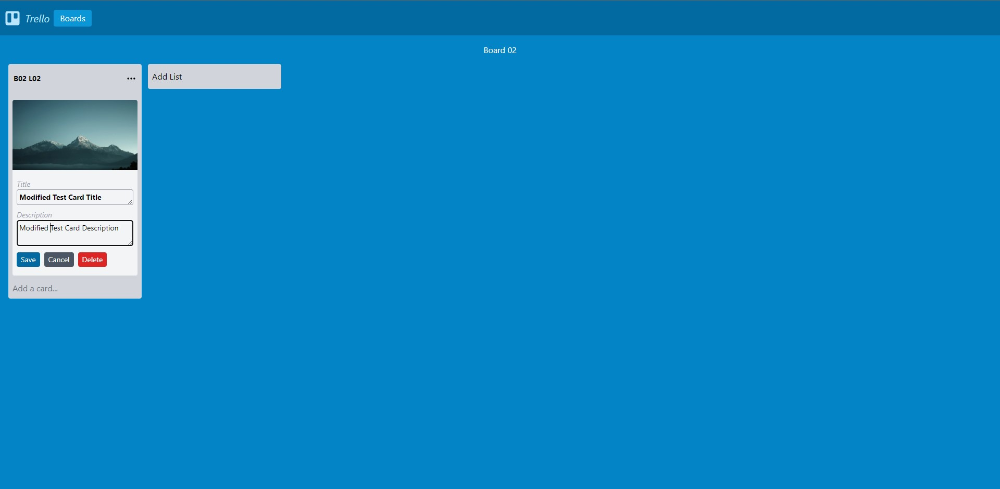

    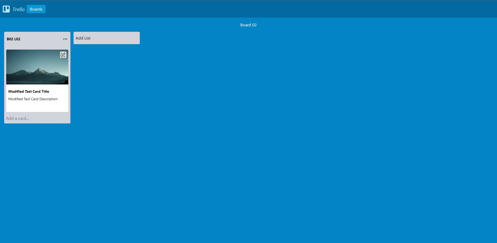


## Conclusion

We have successfully created a Trello clone Application where a user can create edit and delete boards, lists, and cards. We learned how to integrate the Webiny CMS into our Next.js Application.
Thanks for reading!

**Full source code:** https://github.com/webiny/write-with-webiny/tree/main/tutorials/trello-clone

---

This article was written by a contributor to the Write with Webiny program. Would you like to write a technical article like this and get paid to do so? [Check out the Write with Webiny GitHub repo](https://github.com/webiny/write-with-webiny/).