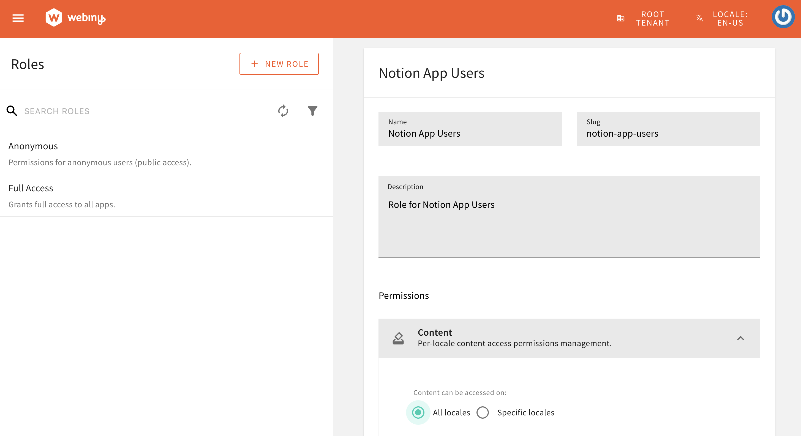

Welcome to the first part of our blog series where we’ll be building a Notion clone using Next.js and Webiny. This series will guide you step-by-step through the process of creating a fully functional clone of Notion, the popular note-taking and collaboration application.

In this first article, we'll introduce the project and walk you through the initial setup of Webiny infrastructure, mainly on how to set up a new User Pool in Webiny for Notion App users authentication. Learn more about setting up Webiny Infrastructure in the official documentation [here](https://www.webiny.com/docs/headless-cms/notes-app/webiny-infrastructure-setup).

<video width="800px" height="auto" controls autoplay>
  <source src="./assets/building-notion-clone-nextjs-webiny-part-1/notion-clone-demo.mp4" type="video/mp4" />
</video>

## Prerequisites

1. Node.js >=18
2. yarn ^1.22.21 || >=2
3. [AWS account and User credentials](https://www.webiny.com/docs/infrastructure/aws/configure-aws-credentials)
4. Basic understanding of Next.js and GraphQL

## Getting Started with Webiny

Webiny [headless CMS](https://www.webiny.com/enterprise-serverless-cms/headless-cms/) is GraphQL-based, with powerful content modeling features, and it’s serverless, so optimized for scalability by default.

The first step is to create a new Webiny application using the command below:

```bash
npx create-webiny-project notion-clone-backend
```

Upon executing the command, you will be prompted to choose an AWS region and the database for your project deployment. We will be using **DynamoDB.**

Once the project has been created, open and deploy it with the command below:

```bash
cd notion-clone-backend && yarn webiny deploy
```

This deploy command downloads the necessary dependencies and automatically deploys the application to your AWS account with a list of URLs for the admin panel, website, and GraphQL. More details on [Webiny installation can be found here](https://www.webiny.com/docs/get-started/install-webiny).

## Webiny Infrastructure Setup

This section focuses on creating the necessary infrastructure on the Webiny side and enabling authentication for the Notion users.

### Notion App User Pool and User Pool Client

The first step is to set up an AWS Cognito User Pool and User Pool Client specifically for Notion App users. All users who sign up through our Notion App (React App) will be created in this User Pool.

1. To get started, we first scaffold a new workspace extension in the `/extensions/notionApp` folder, via the following command:

```bash
yarn webiny scaffold workspace \
--name notionApp \
--dependencies @webiny/api-headless-cms
```

This command will create `notionApp` extensions in `<webiny-project-home>/extensions/` location.

2. In the `extensions/notionApp/src` directory, create the `configureNotionAppCognitoUserPool.ts` and `applyNotionAppEnvVariables.ts` files.

**configureNotionAppCognitoUserPool.ts**
```tsx
import * as aws from "@pulumi/aws";
import * as pulumi from "@pulumi/pulumi";
import { CorePulumiApp } from "@webiny/pulumi-aws";

// We mark resources as protected if deploying via CI/CD and into one of the specified environments.
const protectResource = (app: CorePulumiApp) => {
    return "CI" in process.env && ["prod", "staging"].includes(app.params.run["env"]);
};

export type CustomCoreOutput = {
    notionAppUserPoolId: string;
    notionAppUserPoolRegion: string;
    notionAppUserPoolClient: string;
    notionAppUserPoolArn: string;
};

export const configureNotionAppCognitoUserPool = (app: CorePulumiApp) => {

    const userPool = app.addResource(aws.cognito.UserPool, {
        name: "notion-app-users",
        config: {
            schemas: [
                {
                    attributeDataType: "String",
                    name: "email",
                    required: false,
                    developerOnlyAttribute: false,
                    mutable: true,
                    stringAttributeConstraints: {
                        maxLength: "2048",
                        minLength: "0"
                    }
                },
                {
                    attributeDataType: "String",
                    name: "family_name",
                    required: false,
                    developerOnlyAttribute: false,
                    mutable: true,
                    stringAttributeConstraints: {
                        maxLength: "2048",
                        minLength: "0"
                    }
                },
                {
                    attributeDataType: "String",
                    name: "given_name",
                    required: false,
                    developerOnlyAttribute: false,
                    mutable: true,
                    stringAttributeConstraints: {
                        maxLength: "2048",
                        minLength: "0"
                    }
                },
                {
                    attributeDataType: "String",
                    name: "wby_tenant",
                    required: false,
                    developerOnlyAttribute: false,
                    mutable: true,
                    stringAttributeConstraints: {
                        maxLength: "30",
                        minLength: "0"
                    }
                },
                {
                    attributeDataType: "String",
                    name: "wby_notion_app_group",
                    required: false,
                    developerOnlyAttribute: false,
                    mutable: true,
                    stringAttributeConstraints: {
                        maxLength: "50",
                        minLength: "0"
                    }
                }
            ],
            passwordPolicy: {
                minimumLength: 8,
                requireLowercase: false,
                requireNumbers: false,
                requireSymbols: false,
                requireUppercase: false,
                temporaryPasswordValidityDays: 7
            },
            autoVerifiedAttributes: ["email"],
            aliasAttributes: ["preferred_username"],
        },
        opts: { protect: protectResource(app) }
    });

    const userPoolClient = app.addResource(aws.cognito.UserPoolClient, {
        name: "notion-app",
        config: {
            userPoolId: userPool.output.id,
            explicitAuthFlows: [
                "ALLOW_USER_SRP_AUTH",
                "ALLOW_CUSTOM_AUTH",
                "ALLOW_REFRESH_TOKEN_AUTH"
            ],

            supportedIdentityProviders: ["COGNITO"]
        }
    });

    app.addOutputs({
        notionAppUserPoolId: userPool.output.id,
        notionAppUserPoolRegion: String(process.env.AWS_REGION),
        notionAppUserPoolArn: userPool.output.arn,
        notionAppUserPoolClient: userPoolClient.output.id
    });
};
```


**applyNotionAppEnvVariables**
``` tsx applyNotionAppEnvVariables.ts

import { ApiPulumiApp } from "@webiny/pulumi-aws";
import { getStackOutput } from "@webiny/cli-plugin-deploy-pulumi/utils";

export const applyNotionAppEnvVariables = (app: ApiPulumiApp) => {
    const core = getStackOutput({
        folder: "apps/core",
        env: app.params.run["env"]
    });

    if (!core) {
        throw new Error("Core application is not deployed.");
    }

    app.setCommonLambdaEnvVariables({
        NOTION_APP_COGNITO_REGION: core["notionAppUserPoolRegion"],
        NOTION_APP_COGNITO_USER_POOL_ID: core["notionAppUserPoolId"]
    });

    // Add permission to GraphQL Lambda policy to interact with the Notion App User Pool
    app.resources.graphql.policy.config.policy(policy => {
        if (typeof policy === "string") {
            return policy;
        }

        return {
            ...policy,
            Statement: [
                ...policy.Statement,
                {
                    Sid: "PermissionForNotionAppCognitoUserPool",
                    Effect: "Allow",
                    Action: "cognito-idp:*",
                    Resource: `${core["notionAppUserPoolArn"]}`
                }
            ]
        };
    });
};

```

3. Now export the `configureNotionAppCognitoUserPool` and `applyNotionAppEnvVariables` modules.
Add the following content in the `extensions/notionApp/src/index.ts` file.

``` tsx index.ts
export * from "./configureNotionAppCognitoUserPool";
export * from "./applyNotionAppEnvVariables";
```

4. In the core app configuration, add the Cognito User Pool for Notion App users by updating the `apps/core/webiny.application.ts` file with the following changes.

```diff apps/core/webiny.application.ts
import { createCoreApp } from "@webiny/serverless-cms-aws";
+ import { configureNotionAppCognitoUserPool } from "notion-app"

export default createCoreApp({
-    pulumiResourceNamePrefix: "wby-"
+    pulumiResourceNamePrefix: "wby-",
+    pulumi(app) {
+        configureNotionAppCognitoUserPool(app);
+    }
});

```

7. Add environment variables related to the Notion App's Cognito User Pool to the Webiny API application by updating the `apps/api/webiny.application.ts` file with the following changes.

```diff apps/api/webiny.application.ts
import { createApiApp } from "@webiny/serverless-cms-aws";
+ import { applyNotionAppEnvVariables } from "notion-app";

export default createApiApp({
-    pulumiResourceNamePrefix: "wby-",
+    pulumiResourceNamePrefix: "wby-",
+    pulumi(app) {
+        applyNotionAppEnvVariables(app);
+    }
});
```

### Add Cognito Authenticator for Notion App Users

Add the Cognito Authenticator for Notion App users. This authenticator will be responsible for authenticating and authorizing the Notion App users. Add the following Cognito Authenticator to the `apps/api/graphql/src/security.ts` file.

```diff apps/api/graphql/src/security.ts
    cognitoAuthentication({
        region: String(process.env.COGNITO_REGION),
        userPoolId: String(process.env.COGNITO_USER_POOL_ID),
        identityType: "admin"
    }),
+    cognitoAuthentication({
+        region: String(process.env.NOTION_APP_COGNITO_REGION),
+        userPoolId: String(process.env.NOTION_APP_COGNITO_USER_POOL_ID),
+        identityType: "notion-app-users",
+        getIdentity({ token, identityType}) {
+            return {
+                id: token.sub,
+               type: identityType,
+               displayName: `${token.given_name} ${token.family_name}`,
+               email: token.email,
+               firstName: token.given_name,
+               lastName: token.family_name,
+               group: token["custom:wby_notion_app_group"]
+           }
+       }
+   }),

```

### Add Types for Environment Variables

Since we have used `process.env.NOTION_APP_COGNITO_REGION` and `process.env.NOTION_APP_COGNITO_USER_POOL_ID` in
the `security.ts` file above, let's add these types to the `types/env/index.d.ts` file.
This file is located at `<project-root>/types/env/index.d.ts`.

```diff types/env/index.d.ts
        COGNITO_USER_POOL_ID?: string;
        COGNITO_REGION?: string;
+       NOTION_APP_COGNITO_REGION?: string;
+       NOTION_APP_COGNITO_USER_POOL_ID?: string;
```

### Deploy the Core and API Applications

The next step is to deploy the Core and API applications. This will create the necessary infrastructure and enable the Cognito authenticator for Notion App users that we created earlier.

Please run the following commands to deploy the Core and API applications in the development environment. If you are deploying to another environment, replace "dev" with the appropriate environment in the command.

```bash
yarn webiny deploy apps/core --env dev
yarn webiny deploy apps/api --env dev
```

---

After deployment, you will receive the following values as output:
- `notionAppUserPoolId`
- `notionAppUserPoolRegion`
- `notionAppUserPoolArn`
- `notionAppUserPoolClient`

Please save these values, as they will be needed when creating the React App.

If you lost these values, don't worry. You can also retrieve them from the `your-webiny-project-root/.pulumi/apps/core/.pulumi/stacks/core/dev.json` file within your Webiny project.

Since we've deployed the `dev` environment for the demo, we're seeing the `dev.json` file. If you've deployed your project in a different environment, you'll find a file named after your environment, such as `your-env-name.json` stack file .

---

With the [`webiny watch`](/docs/{version}/core-development-concepts/basics/watch-command) command running, any changes to the application code will be automatically rebuilt and redeployed to the cloud.

---

### Create Role for Notion App Users

Now, we will create a role for Notion App users and define the permissions for this role. In our scenario, users can read, write, and delete only the content entries they have created.

Navigate to the Roles section under Access Management.


**Step 1:** Enter the Role Name, Slug, Description, and set All locales or Specific locales permissions based on your use case.

**Please note that the `slug` is important and should match the one we defined in the Cognito Authenticator for Notion App Users. For our use case, the `slug` should be `notion-app-users`.**

Additionally, under the Permissions/Content section, select "**All locales**" (as shown in the image below). For this demo, we've chosen "All locales." However, for your app, you can opt to select specific locales if needed.




**Step 2:** Set the custom access level for the Headless CMS. Grant Read access to the content model group and content model. For Content Entries, set the scope to `Only entries created by the user`. Refer to the screenshot below for details.


### Create Document Model to Store Notion Documents

As the final step on the Webiny side, we'll create a Document Content Model to store Notion documents that will be created by users. If you're new to creating models in Webiny, refer to the [Create Content Model](webiny.com/docs/user-guides/headless-cms/essentials/create-content-model) user guide.

We'll set up a Document content model with the following fields:

---

| Field       | Field Type |
| :---------- | :--------- |
| Title        | Text       |
| Content | Long text  |
| parentDocument | Reference (will refer to the Document model itself) |
| coverImage | File |
| icon | File |


---

**Step 1**: Create the Document Model.

**Step 2**: Add mentioned Fields above to the Document Model.

### Conclusion & Next Step!

Most of our infrastructure setup on the Webiny side complete, the next step is to create a Next.js app and the necessary models to store information for our Notion clone. Stay tuned for the next part of this blog series!
If you have any questions or feedback related to this tutorial, please feel free to reach out to us on the <ExternalLink href="https://webiny.com/slack/">Community Slack</ExternalLink>!

This article was written by a contributor to the Write with Webiny program. Would you like to write a technical article like this and get paid to do so? [Check out the Write with Webiny GitHub repo](https://github.com/webiny/write-with-webiny/).