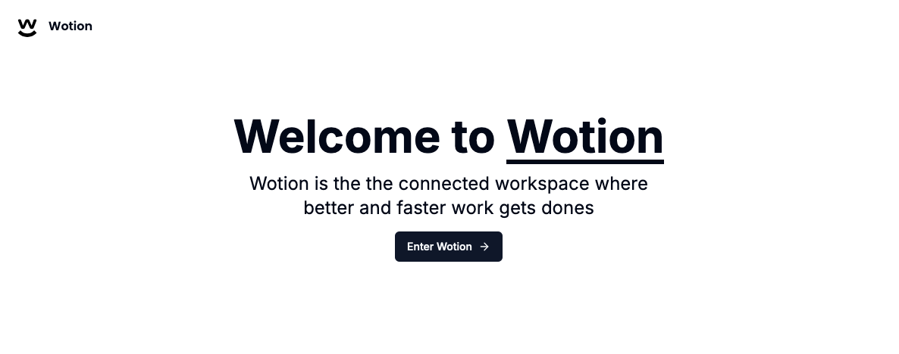

Great, we're all set with the [Webiny setup](https://www.webiny.com/blog/building-notion-clone-nextjs-webiny-part-1). Now, let's start building the frontend of our Notion Clone using Next.js. In this section, we will set up the Next.js app and build the Home Page. The Home Page will look something like this:



## **Setup Next.js App**

Let's create the Next.js app using the following command:

```graphql
npx create-next-app@latest wotion --ts --eslint --tailwind --no-src-dir --app --import-alias "@/*"

```

This command includes several arguments to set up a new project non-interactively.

## **Add shadcn UI Library to the Project**

We'll be using `shadcn/ui` for our UI components. Let's add it to our Next.js project.

First, navigate to the project root:

```bash
cd wotion

```

Then, initialize the `shadcn/ui` library with the following command:

```bash
npx shadcn-ui@latest init

```

When prompted, select all the default options.

```bash
npx shadcn-ui init -y
Need to install the following packages:
shadcn-ui@0.8.0
Ok to proceed? (y) y

✔ Which style would you like to use? › Default
✔ Which color would you like to use as base color? › Slate
✔ Would you like to use CSS variables for colors? … no / yes

✔ Writing components.json...
✔ Initializing project...
✔ Installing dependencies...

Success! Project initialization completed. You may now add components.
```

Once this command is successful, we’ll add all the components needed for this application.

We will need the following Shadcn components, so let’s add them to our project.

```bash
npx shadcn-ui@latest add avatar button dropdown-menu input popover skeleton
```

## Project Structure Setup

Let's create a home page for our Wotion app and reorganize some directories according to Next.js best practices.

1. Create a `(marketing)` folder within the `app` directory.
2. Move the `app/pages.tsx` file into the `(marketing)` directory.
3. Replace the content of the `(marketing)/page.tsx` file with the following:

```bash
export default function Home() {
  return (
      <div>Welcome to Wotion!</div>
  );
}

```

Update the app's metadata by replacing the content in `app/layout.tsx` with the following:

```bash
export const metadata: Metadata = {
  title: "Wotion",
  description:
      "The connected workspace where better and faster work gets done."
};
```

Now, run the project to ensure everything is working as expected.

```jsx
npm run dev
```

Once the app is ready, you will see a screen displaying the message:

```bash
Welcome to Wotion!
```

## Home Page Setup

### Header

1. In the `(marketing)` directory, create a `_components` folder.
2. Inside the `_components` folder, create a new file named `heading.tsx`.

```bash
"use client";
import { Button } from "@/components/ui/button";
import { ArrowRight } from "lucide-react";

export const Heading = () => {
    return (
        <div className="max-w-3xl space-y-4">
            <h1 className="text-3xl sm:text-5xl md:text-6xl font-bold"> Welcome to <span className="underline">Wotion</span>{" "} </h1>
            <h3 className="text-base sm:text-xl md:text-2xl">
                Wotion is the the connected workspace where <br /> better and faster work gets dones </h3>
            <Button> Enter Wotion <ArrowRight className="h-4 w-4 ml-2" /> </Button>
        </div>
    );
};
```

### Logo

Download the logo from [here](https://github.com/sachinmmane/wotion/blob/main/public/logo.svg) and place it in the `public` directory.

Next, create a `logo.tsx` file in the `_components` directory with the following content:

```jsx
import Image from "next/image";
import { Poppins } from "next/font/google";

import { cn } from "@/lib/utils";

const font = Poppins({
    subsets: ["latin"], weight: ["400", "600"],
});

export const Logo = () => {
    return (
        <div className="hidden md:flex items-center gap-x-2">
            <Image src="/logo.svg" height="40" width="40" alt="logo" />
            <p className={cn("font-semibold", font.className)}>Wotion</p>
        </div>
    );
};
```

### Navigation Bar

Next, we will create a fixed navigation bar for the public page.

To make the navigation bar fixed and add a bottom border when the page is scrolled, we'll create a custom hook.

1. In the root directory of your project (`wotion`), create a new folder named `hooks`.
2. Inside the `hooks` folder, create a file named `use-scroll-top.tsx` with the following content:

```jsx
import { useState, useEffect } from "react";

export const useScrollTop = (threshold = 10) => {

    const [scrolled, setScrolled] = useState(false);
    useEffect(() => {
        const handleScroll = () => {
            if (window.scrollY > threshold) { setScrolled(true);
            }else {
                setScrolled(false);
            }
        };
        window.addEventListener("scroll", handleScroll);
        return () => window.removeEventListener("scroll", handleScroll); },
        [threshold]
    );

return scrolled;
};
```

Now, create a `navbar.tsx` file in the `(marketing)/_components` directory.

```jsx
"use client";

import { useScrollTop } from "@/hooks/use-scroll-top";
import { cn } from "@/lib/utils";
import { Logo } from "./logo";

export const Navbar = () => { const scrolled = useScrollTop();
    return ( <div className={cn( "z-50 bg-background fixed top-0 felx items-center w-full p-6", scrolled && "border-b shadow-sm" )} > <Logo /> </div> ); };
```

Now, update the `(marketing)/page.tsx` file with the following content:

```jsx
import { Heading } from "./_components/heading";

const MarketingPage = () => {
  return (
      <div className="min-h-screen flex flex-col">
        <div className="flex flex-col items-center justify-center md:justify-start text-center gap-y-8 px-6 pb-10 flex-1">
          <Heading />
        </div>
      </div>
  );
};

export default MarketingPage;

```

Now, let's create a layout for the home page, designed as a marketing page.

Create a `layout.tsx` file in the `(marketing)` directory.

```jsx
import { Navbar } from "./_components/navbar";

const MarketingLayout = ({ children }: { children: React.ReactNode }) => {
  return (
    <div className="min-h-full">
      <Navbar />
      <main className="min-h-full pt-40">{children}</main>
    </div>
  );
};

export default MarketingLayout;
```

Now, when you run the app using the `npm run dev` command, you should see the Navbar and Heading displayed on the Home Page.


This article was written by a contributor to the Write with Webiny program. Would you like to write a technical article like this and get paid to do so? [Check out the Write with Webiny GitHub repo](https://github.com/webiny/write-with-webiny/).
