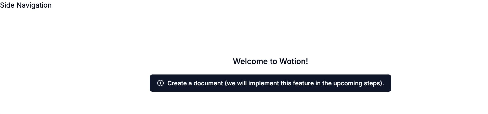

Having implemented the [login functionality](https://www.webiny.com/blog/building-notion-clone-nextjs-webiny-part-3), we are now ready to create documents. In this part of the tutorial, we will create documents and create a placeholder page for side navigation. Once we complete this section, our application will look like this.

<video width="800px" height="auto" controls autoplay>
    <source src="./assets/building-notion-clone-nextjs-webiny/part-4/create-document.mp4" type="video/mp4" />
</video>

We will be using the following GraphQL APIs provided by Webiny. As mentioned in the first part of our tutorial, we created a Document model. Once a model is created in Webiny, it provides default APIs to interact with the model. We will use the **CreateDocument** mutation to create an entry in the document model.

Since Webiny provides these GraphQL APIs, let's first set up a GraphQL client to interact with these APIs.

## GraphQL Client Setup

1. Add environment variables by creating a `.env.local` file at the root of your project. In this file, add your manage GraphQL API endpoint. For more details on obtaining this URL, [please refer to the relevant documentation](https://www.webiny.com/docs/headless-cms/basics/graphql-api#api-playground).

```bash
NEXT_PUBLIC_GRAPHQL_API_URI=https://xxxxxxxx.cloudfront.net/cms/manage/en-US
```

2. Create a `(graphql)` directory inside the `app` directory.

3. Create a file named `client.js` inside the `graphql` directory with the following content:

```js
import { ApolloClient, InMemoryCache, createHttpLink } from "@apollo/client";
import { setContext } from "@apollo/client/link/context";
import { fetchAuthSession } from "aws-amplify/auth";

// Create an HTTP link
const httpLink = createHttpLink({
  // Use the GraphQL API URI from the environment variable
  uri: process.env.NEXT_PUBLIC_GRAPHQL_API_URI
});

// Set up authentication context for the client
const authLink = setContext(async (_, { headers }) => {
  // Fetch the authentication session
  const { idToken } = (await fetchAuthSession()).tokens ?? {};

  // Return the headers with authentication token and additional headers
  return {
    headers: {
      ...headers,
      Authorization: idToken ? `Bearer ${idToken}` : "",
      "x-tenant": "root",
    },
  };
});

// Create the Apollo Client instance
const client = new ApolloClient({
  link: authLink.concat(httpLink),
  cache: new InMemoryCache(),
});

export default client;

```

Next.js automatically loads environment variables from `.env.local` files, so you typically do not need any extra configuration. However, make sure you restart your development server after adding or changing environment variables.

## **CreateDocument** Mutation

Now let’s define the mutations and queries that we will need to create, update, and list documents.

1. **CreateDocument** - to create an entry in the document model.
2. **ListDocuments** - to list all the documents.

Create a `mutations.js` file in the `app/graphql` directory.

```js
import { gql } from "@apollo/client";

export const CREATE_DOCUMENT_MUTATION = gql`
  mutation CreateDocument($data: DocumentInput!) {
    createDocument(data: $data) {
      data {
        title
        createdBy {
          id
          displayName
        }
        isArchived
        parentDocument {
          id
          modelId
          entryId
        }
        content
        coverImage
        icon
        isPublished
      }
      error {
        data
        code
        stack
      }
    }
  }
`;
```

For queries, create a file named `queries.js` in the `app/graphql` directory.

```js
import { gql } from "@apollo/client";

export const LIST_DOCUMENTS_QUERY = gql`
  query ListDocuments {
    listDocuments {
      data {
        id
        title
        createdBy {
          id
          displayName
        }
        isArchived
        parentDocument {
          id
          modelId
          entryId
        }
        content
        coverImage
        icon
        isPublished
      }
    }
  }
`;

```

## Placeholder pages for Side Navigation and Document

Let’s start with implementing side navigation. We will first create a main layout, which will contain our side navigation and document.

### Main Layout

1. Create  a `(main)` directory in `app` directory.

2. Inside `(main)` directory create `layout.tsx` file

```js
"use client";

import {ApolloProvider} from "@apollo/client";
import client from "@/app/(graphql)/client";
import {useAuthenticator} from "@aws-amplify/ui-react";

import {redirect} from "next/navigation";

import {Spinner} from "@/components/spinner";
import Navigation from "./_components/navigation";
import {DocumentProvider} from "@/context/document-context";

const MainLayout = ({children}: { children: React.ReactNode }) => {
    const {authStatus} = useAuthenticator((context) => [context.authStatus]);

    if (authStatus === "configuring") {
        return (
            <div className="h-lvh flex items-center justify-center">
                <Spinner size="lg"/>
            </div>
        );
    }

    if (authStatus === "unauthenticated") {
        return redirect("/");
    }

    return (
        <div className="h-full flex">
            <ApolloProvider client={client}>
                <DocumentProvider>
                    <div className="h-svh">
                      <Navigation/>
                    </div>
                    <main className="flex-1 h-full overflow-y-auto">{children}</main>
                </DocumentProvider>
            </ApolloProvider>
        </div>
    );
};

export default MainLayout;
```

### Side Navigation Placeholder Page

Now, let’s implement side navigation. We will list all the documents in the side navigation, and any new document created will be shown here. For now, we will just create a placeholder for the navigation.

1. Inside the `main` directory, create a directory named `_components`.
2. Inside the `_components` directory, create a file named `navigation.tsx`.

```js
"use client";

const Navigation = () => {
    return (
        <>
            <div>Side Navigation</div>
        </>
    );
};

export default Navigation;
```

### Document Placeholder Page

Let’s create a placeholder page for the document, which will be served on the `/documents` route.

1. Create a `(routes)/documents` directory inside the `main` directory. Note that you will create the `documents` directory inside the `(routes)` directory.
2. Create a `page.tsx` file inside the `documents` directory.

```js
"use client";
import {PlusCircle} from "lucide-react";

import {Button} from "@/components/ui/button";

const DocumentsPage = () => {
    return (
        <div className="mt-20 h-full flex flex-col items-center justify-center space-y-4">
            <h2 className="text-lg font-medium">Welcome to Wotion!</h2>
            <Button>
                <PlusCircle className="h-4 w-4 mr-2"/>
                Create a note (we will implement this feature in the upcoming steps).
            </Button>
        </div>
    );
};

export default DocumentsPage;

```

Great! So far, we have created placeholder pages for side navigation and the document. When a logged-in user clicks on the `Get Wotion Free ->`  button on the home screen, they will be shown this document page.



## Create Document

Now let’s implement the feature to create a document.

1. Let’s implement a `useCreateDocument` hook to create a document.
Create a `use-create-document.tsx` file in the `hooks` directory, located in your project root.

```js
import { useMutation } from "@apollo/client";
import { toast } from "sonner";
import { CREATE_DOCUMENT_MUTATION } from "@/app/(graphql)/mutations";
import { LIST_DOCUMENTS_QUERY } from "@/app/(graphql)/queries";

const useCreateDocument = () => {
  const [createDocument] = useMutation(CREATE_DOCUMENT_MUTATION, {
    refetchQueries: [{ query: LIST_DOCUMENTS_QUERY }],
    awaitRefetchQueries: true,
  });

  const handleCreateDocument = async (parentDocumentId: any = null) => {
    const promise = createDocument({
      variables: {
        data: {
          title: "Untitled",
          parentDocument: parentDocumentId
            ? { id: parentDocumentId, modelId: "document" }
            : null,
        },
      },
    });

    toast.promise(promise, {
      loading: "Creating a new Document...",
      success: "New Document created!",
      error: "Failed to create a new Document.",
    });

    return promise;
  };

  return handleCreateDocument;
};

export default useCreateDocument;

```

2. In the code above, you have seen that we used toast to show a toaster message to the user when a new document is created. For this, we used the [Sonner npm package](https://www.npmjs.com/package/sonner), which provides a toast component for React-based applications. Please install this package by running the following command from the project root:

```js
npm i sonner
```

And update the `app/layout.tsx` file to include the Toaster component in the project.

```diff
(...)

+ import {Toaster} from "sonner";

(...)

export default function RootLayout({
  children,
}: Readonly<{
  children: React.ReactNode;
}>) {
  return (
    <html lang="en">
      <body className={inter.className}>
+      <Toaster position="bottom-center" />
      <Auth>
        {children}
      </Auth>
      </body>
    </html>
  );
}
```

3. Update the document page to use the `use-create-document` hook that we created in step 1.

Update the `app/(main)/(routes)/documents/page.tsx` file. Now, when a user clicks on `Create a Document`, a document will be created.

```js
"use client";
import {PlusCircle} from "lucide-react";

import {Button} from "@/components/ui/button";
import useCreateDocument from "@/hooks/use-create-document";

const DocumentsPage = () => {
    const handleCreateDocument = useCreateDocument();
    return (
        <div className="mt-20 h-full flex flex-col items-center justify-center space-y-4">
            <h2 className="text-lg font-medium">Welcome to Wotion!</h2>
            <Button onClick={() => handleCreateDocument(null)}>
                <PlusCircle className="h-4 w-4 mr-2"/>
                Create a Document
            </Button>
        </div>
    );
};

export default DocumentsPage;
```

Great, now when we click on the `Create a Document` button, our document will be created.

<video width="800px" height="auto" controls autoplay>
    <source src="./assets/building-notion-clone-nextjs-webiny/part-4/create-document.mp4" type="video/mp4" />
</video>

### Next Step! Part 5 - Side Navigation and List Child Pages

After implementing the document creation feature, the next step in this tutorial is to [add a side navigation menu that will list all documents](https://www.webiny.com/blog/building-notion-clone-nextjs-webiny-part-5).

If you have any questions or feedback related to this tutorial, please feel free to reach out to us on the <ExternalLink href="https://webiny.com/slack/">Community Slack</ExternalLink>!

This article was written by a contributor to the Write with Webiny program. Would you like to write a technical article like this and get paid to do so? [Check out the Write with Webiny GitHub repo](https://github.com/webiny/write-with-webiny/).