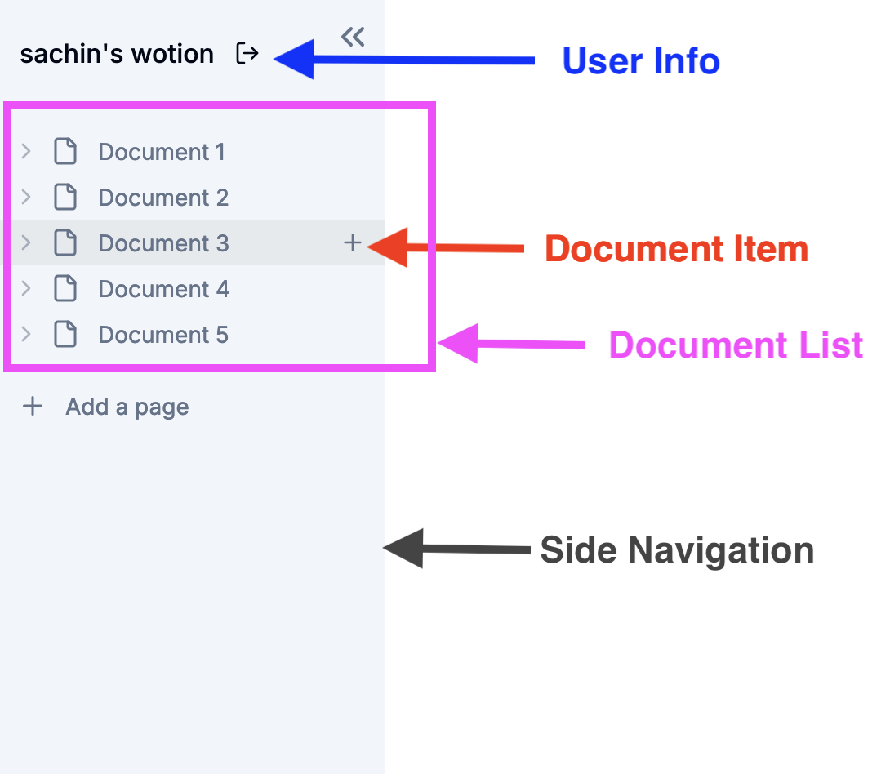

After implementing the [document creation feature](https://www.webiny.com/blog/building-notion-clone-nextjs-webiny-part-4), the next step in this tutorial is to add a side navigation menu that will list all documents.

The side navigation, as illustrated in the image below, will be organized into three main sections:

1. **User Info**: This section will display the username and provide a logout option.
2. **Document Item**: Each document item will display the document name and include an option to add a new child page.
3. **Document List**: This section will display all the document items.



### User Info

Let's begin by creating a section in the side navigation that displays the username and includes a logout option (for now, we’ll only display the logout icon. The functionality will be implemented in a future tutorial).

Create a `user-info.tsx` file in the `app/(main)/_components` directory.

```tsx
'use client'

import { useAuthenticator } from '@aws-amplify/ui-react'
import { Button } from '@/components/ui/button'
import { LogOut } from 'lucide-react'

export const UserInfo = () => {
    const { user, signOut } = useAuthenticator((context) => [context.user])

    return (
        <div className="mb-3 p-4 items-center flex">
            <p className="font-medium truncate">{user.username}&apos;s wotion</p>
            <Button
                onClick={signOut}
                variant="ghost"
                size="sm"
                className="right-5"
                aria-label="logout"
            >
                <LogOut className="h-4 w-4" />
            </Button>
        </div>
    )
}

export default UserInfo

```

### Document Item

The document item will display the document name and include an option to add a new child page. We’ll utilize this document item in the `document-list.tsx` file, which is mentioned below.

Create a `document-item.tsx` file in the `app/(main)/_components` directory.

```tsx
"use client";

import {
    LucideIcon,
    ChevronDown,
    ChevronRight,
    Plus,
} from "lucide-react";
import { useRouter } from "next/navigation";
import { cn } from "@/lib/utils";
import { useDocumentContext } from "@/context/document-context";
import useCreateDocument from "@/hooks/use-create-document";
import { Skeleton } from "@/components/ui/skeleton";

interface ItemProps {
    id?: string;
    documentIcon?: string;
    active?: boolean;
    expanded?: boolean;
    isSearch?: boolean;
    level?: number;
    onExpand?: () => void;
    onClick: () => void;
    label: string;
    icon: LucideIcon;
}

export const DocumentItem = ({
                         id,
                         active,
                         documentIcon,
                         isSearch,
                         level = 0,
                         onExpand,
                         expanded,
                         label,
                         onClick,
                         icon: Icon,
                     }: ItemProps) => {
    const router = useRouter();
    const { documents } = useDocumentContext();

    const document = documents.find((doc) => doc.id === id);
    let title = document ? document.title : "";

    const handleExpand = (
        event: React.MouseEvent<HTMLDivElement, MouseEvent>
    ) => {
        event.stopPropagation();
        onExpand?.();
    };

    const ChevronIcon = expanded ? ChevronDown : ChevronRight;

    const handleCreate = useCreateDocument();

    const handleCreateChildDocument = async (
        event: React.MouseEvent<HTMLDivElement, MouseEvent>
    ) => {
        event.stopPropagation();
        handleCreate(id);
    };

    return (
        <div
            onClick={onClick}
            role="button"
            style={{
                paddingLeft: level ? `${level * 12 + 12}px` : "12px",
            }}
            className={cn(
                "group min-h-[27px] text-sm py-1 pr-3 w-full hover:bg-primary/5 flex items-center text-muted-foreground fount-medium",
                active && "bg-primary/5 text-primary"
            )}
        >
            {!!id && (
                <div
                    role="button"
                    className="h-full rounded-sm hover:bg-neutral-300 mr-1"
                    onClick={handleExpand}
                >
                    <ChevronIcon className="h-4 w-4 shrink-0 text-muted-foreground/50" />
                </div>
            )}
            {documentIcon ? (
                <div className="shrink-0 text-[18px] mr-2">{documentIcon}</div>
            ) : (
                <Icon className="shrink-0 h-[18px] mr-2 text-muted-foreground" />
            )}
            <span className="truncate">{label}</span>
            {isSearch && (
                <kbd className="ml-auto pointer-events-none inline-flex h-5 select-none items-center gap-1 rounded border bg-muted px-1.5 fonto-mono text-[10px] font-medium text-muted-foreground opacity-100">
                    <span className="text-xs">⌘</span>K
                </kbd>
            )}
            {!!id && (
                <div className="ml-auto flex items-center gap-x-2">
                    <div
                        onClick={handleCreateChildDocument}
                        className="opacity-0 group-hover:opacity-100 h-full ml-auto rounded-sm hover:bg-neutral-300"
                    >
                        <Plus className="h-4 w-4 text-muted-foreground" />
                    </div>
                </div>
            )}
        </div>
    );
};

DocumentItem.Skeleton = function ItemSkeleton({ level }: { level?: number }) {
    return (
        <div
            style={{
                paddingLeft: level ? `${level * 12 + 25}px` : "12px",
            }}
            className="flex gap-x-3 py-[3px]"
        >
            <Skeleton className="h-4 w-4" />
            <Skeleton className="h-4 w-[30%]" />
        </div>
    );
};

```

### Document List

In this component, we'll fetch all the documents using the `LIST_DOCUMENTS_QUERY` and incorporate the document item component that we defined earlier.

Create the `document-list.tsx` file in the `app/(main)/_components` directory.

```tsx
"use client";

import { useQuery } from "@apollo/client";
import { useParams } from "next/navigation";
import { useRouter } from "next/navigation";
import { useState, useEffect } from "react";
import { DocumentItem } from "./document-item"
import { cn } from "@/lib/utils";
import { FileIcon } from "lucide-react";
import { LIST_DOCUMENTS_QUERY } from "@/app/(graphql)/queries";
import { useDocumentContext } from "@/context/document-context";

interface DocumentListProps {
    parentDocumentId?: string | null;
    level?: number;
}

export const DocumentList = ({
                                 parentDocumentId = null,
                                 level = 0,
                             }: DocumentListProps) => {
    const params = useParams();
    const router = useRouter();
    const { documents, setDocuments } = useDocumentContext();

    const [expanded, setExpanded] = useState<Record<string, boolean>>({});
    const { loading, error, data } = useQuery(LIST_DOCUMENTS_QUERY);

    useEffect(() => {
        if (data) {
            setDocuments(data.listDocuments.data);
        }
    }, [data, setDocuments]);

    const onExpand = (documentId: string) => {
        setExpanded((preExpanded) => ({
            ...preExpanded,
            [documentId]: !preExpanded[documentId],
        }));
    };

    const onRedirect = (documentId: string) => {
        router.push(`/documents/${documentId}`);
    };

    if (loading) {
        return (
            <>
                <DocumentItem.Skeleton level={level} />
                <DocumentItem.Skeleton level={level} />
                <DocumentItem.Skeleton level={level} />
            </>
        );
    }

    if (error) {
        return <p>Error loading documents</p>;
    }

    const renderDocuments = (parentDocumentId: string | null, level: number) => {
        const filteredDocuments = documents.filter((doc: any) =>
            doc.parentDocument
                ? doc.parentDocument.id === parentDocumentId
                : parentDocumentId === null
        );

        if (filteredDocuments.length === 0 && level > 0) {
            return (
                <p
                    style={{
                        paddingLeft: level ? `${level * 12 + 25}px` : undefined,
                    }}
                    className={cn("text-sm font-medium text-muted-foreground/80")}
                >
                    No Pages inside
                </p>
            );
        }

        return filteredDocuments.map((document: any) => (
            <div key={document.id}>
                <DocumentItem
                    id={document.id}
                    onClick={() => onRedirect(document.id)}
                    label={document.title || "Untitled"}
                    icon={FileIcon}
                    documentIcon={document.icon}
                    active={params.documentId === document.id}
                    level={level}
                    onExpand={() => onExpand(document.id)}
                    expanded={expanded[document.id]}
                />
                {expanded[document.id] && (
                    <DocumentList parentDocumentId={document.id} level={level + 1} />
                )}
            </div>
        ));
    };

    return <>{renderDocuments(parentDocumentId, level)}</>;
};

```

### Side Navigation

With all the components for the side navigation in place, let's integrate them into our side navigation.

Update the `app/(main)/_components/navigation.tsx` file with the following content.

```tsx
'use client'
import { ElementRef, useRef, useState } from 'react'
import { useParams } from 'next/navigation'
import {
    ChevronsLeft,
    MenuIcon,
    Plus
} from 'lucide-react'

import { cn } from '@/lib/utils'

import UserInfo from './user-info'
import { DocumentItem } from './document-item'
import { DocumentList } from './document-list'
import useCreateDocument from '@/hooks/use-create-document'

const Navigation = () => {
    const params = useParams()
    const handleCreateDocument = useCreateDocument()
    const sidebarRef = useRef<ElementRef<'aside'>>(null)
    const navbarRef = useRef<ElementRef<'div'>>(null)
    const [isResetting, setIsResetting] = useState(false)
    const [isCollapsed, setIsCollapsed] = useState(false)

    const resetWidth = () => {
        if (sidebarRef.current && navbarRef.current) {
            setIsCollapsed(false)
            setIsResetting(true)

            sidebarRef.current.style.width = '240px'

            navbarRef.current.style.setProperty('width', 'cacl(100% - 240px')
            navbarRef.current.style.setProperty('left', '240px')

            setTimeout(() => setIsResetting(false), 300)
        }
    }

    const collapse = () => {
        if (sidebarRef.current && navbarRef.current) {
            setIsCollapsed(true)
            setIsResetting(true)
            sidebarRef.current.style.width = '0'
            navbarRef.current.style.setProperty('width', '100%')
            navbarRef.current.style.setProperty('left', '0')

            setTimeout(() => setIsResetting(false), 300)
        }
    }

    return (
        <>
            <aside
                ref={sidebarRef}
                className={cn(
                    'group/sidebar h-full bg-secondary overflow-y-auto relative flex w-60 flex-col z-[99999]',
                    isResetting && 'transition-all ease-in-out duration-300'
                )}
            >
                <div
                    onClick={collapse}
                    role="button"
                    className="h-6 w-6 text-muted-foreground rounded-sm hover:bg-neutral-300 absolute top-3 right-2 opacity-0
          group-hover/sidebar:opacity-100 transition"
                >
                    <ChevronsLeft className="h-6 w-6" />
                </div>
                <div>
                    <UserInfo />
                </div>
                <div>
                    <DocumentList />
                    <div className="py-4">
                        <DocumentItem
                            onClick={() => handleCreateDocument(null)}
                            label="Add a page"
                            icon={Plus}
                        />
                    </div>
                </div>
            </aside>
            <div
                ref={navbarRef}
                className={cn(
                    'absolute top-0 z-[99999] left-60 w-[calc(100%-240px)]',
                    isResetting && 'transition-all ease-in-out duration-300'
                )}
            >
                <nav className="bg-transparent px-3 py-2 w-full">
                    {isCollapsed && (
                        <MenuIcon
                            onClick={resetWidth}
                            role="button"
                            className="h-6 w-6 text-muted-foreground"
                        />
                    )}
                </nav>
            </div>
        </>
    )
}

export default Navigation

```

Now, let's run the application, and you should see the side navigation in action.

