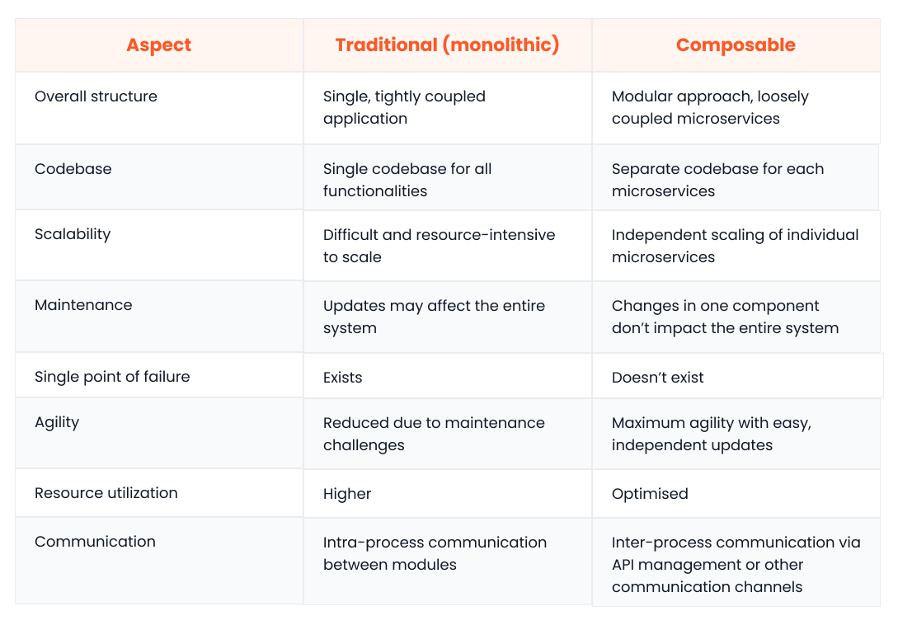

In the digital age, which is as dynamic and ever-shifting as a bustling metropolis, speed, agility, and adaptability are no longer just desirable — they are critical. Traditional software development approaches fail to keep pace with this relentless activity. They often result in rigid, monolithic systems that can’t quickly adapt to evolving business architecture needs or market demands.

To address the limitations of traditional software, an increasing number of businesses are turning to composable technologies. Instead of building giant monoliths, composable solutions focus on creating systems using discrete, interchangeable building blocks. These building blocks can be dynamically orchestrated and rearranged to meet the unique and changing requirements of modern businesses.

In the following sections, we will explore composable architecture in more detail, covering its core characteristics, benefits, and challenges and comparing it with microservices and traditional architectures.

## What is composable architecture?

At its core, composable architecture is an approach to designing and building applications by assembling independent, self-contained, and interchangeable components. Each component serves a specific purpose and has well-defined boundaries.

The easiest way to visualize a composable application architecture is to think of it as a Lego set. Just like you can assemble and rearrange Lego bricks to construct various structures, you can put together composable architecture components in countless configurations to create diverse and dynamic applications.

This is in sharp contrast to traditional or monolithic architectures, in which the entire application is represented by one large, all-encompassing monolith. Changes made to one part of the application can cascade through the whole system, making monolithic applications inherently inflexible.

Composable application architectures, however, foster a “loose coupling” of smaller, agile components. This ensures that changes in one component have minimal, if any, impact on others, making composable technologies more flexible and easier to maintain.

### The MACH approach

MACH stands for Microservices, API-first (application programming interfaces), Cloud Native and [Headless](https://www.webiny.com/blog/headless-cms-vs-traditional-cms). It is a set of principles that play a crucial role in enabling composability:

- **Microservices**: The building blocks or components of composable solutions are often called “microservices”. Each microservice has its own codebase, deployment process, configurations and scalability options. This modularity allows DevOps teams to work autonomously, deploy changes more frequently and scale distinct apps independently.
- **API-first**: This principle emphasizes the use of a clear and consistent API management approach to enable communication between components. Since application programming interfaces are interoperable by design, they ensure a predictable flow of data across the system, even when individual components are replaced.
- **Cloud-native**: Composable architectures realize their full potential in the cloud. Modern cloud offerings, such as serverless and auto-scalable architectures, provide unparalleled levels of scalability, elasticity and resilience. These characteristics perfectly complement the inherent flexibility and dynamism of a composable system.
- **Headless**: This design approach decouples an app’s front end from its back end. This allows developers to build tailored user experiences for different touchpoints, including websites, smartphone apps, kiosks, conversational interfaces and smartwatches.

One example of a composable architecture in action is [Webiny](https://www.webiny.com/), an open-source [headless Content Management System (CMS)](https://www.webiny.com/enterprise-serverless-cms/headless-cms). Since Webiny is API-first, developers can use the same headless backend instance to fetch content for all digital channels, using their preferred frontend tech stack.

It’s also a cloud-native platform that runs on [AWS’s serverless offerings](https://www.webiny.com/features/multi-tenancy-site-management) and streamlines integration with other cloud services. Another aspect of its composability is that you can use Pulumi IaC to dynamically adapt your infrastructure as and when needed.

## Traditional (monolithic) vs. composable architecture

As mentioned above, traditional and composable architectures are fundamentally different. In the following subsections, we will delve deeper into their differences.

### Traditional (monolithic) architecture

In a traditional architecture, applications are structured as monolithic entities. This means that all functionalities of a system, including user interface, database integrations, payment processing, caching, searching and more, are encapsulated within a single application.

Here are some core characteristics of a monolithic architecture:

- **Single codebase**: Everything resides in a single codebase, which leads to tight coupling and dependencies between functionalities.
- **Limited scalability**: Scaling the entire application can be cumbersome and resource-intensive due to its monolithic nature. For example, if you want to scale a monolith horizontally, you’d need to replicate the entire application, even if only a specific part needs scaling.
- **Difficult updates and maintenance**: Changes in one function often require other parts of the application to be adapted as well, which makes it hard to maintain monolithic applications. Consider a scenario where a change is required in a logger module. Since the module is tightly coupled with several other modules, you have to make modifications in several other areas of the application where the logger is being used.
- **Single point of failure**: A bug or a failure in any part of the monolith can bring down the entire application. Imagine an inconsequential issue in a logger module causing a critical application to crash.
- **Reduced agility**: The unified codebase and maintenance challenges inherent in monolithic business architecture significantly hinder agility. Development teams find it hard to ship changes quickly due to the ripple effect of modifications.
- **Resource intensiveness**: A monolithic application consumes resources even when certain functionalities are not in use.

### Composable architecture

In contrast, a composable approach promotes modularity and flexibility. They focus on building a composable system with interchangeable, loosely coupled components (microservices) that can be dynamically orchestrated. This means that there may be a separate microservice for each core functionality, including user interface, database integration, authentication and logging.

Here are some core characteristics of composable architectures:

- **Separate repositories**: The code for each microservice typically resides in a separate repository. This enables developers to work on different features independently and simultaneously.
- **Loose coupling**: Different components in a composable enterprise architecture communicate via APIs or other external communication channels. This minimizes interdependencies and simplifies independent deployment.
- **Easier maintenance, maximum agility**: Changes in one component don’t require alterations in the entire system, simplifying maintenance and boosting agility. For example, you can seamlessly add visual tweaks to the “user interface” component without having to make any changes in the back-end components.
- **Independent, easier scalability**: Microservices can be scaled independently. This leads to optimize resource utilization and cost efficiency. For example, you can choose to scale the “web server” microservice to have more instances during high-traffic periods while keeping other services at their regular scale.
- **Resilient by default (fault tolerance)**: In a composable architecture, due to the modular and loosely coupled nature of components, a failure in one component is less likely to bring down the entire system. For example, suppose a bug in a log archival microservice causes it to crash. However, this crash doesn’t disrupt the functionality of any other microservice, like authentication or data processing, and the system continues to operate seamlessly.

### Key differences summarized

Here’s a comparison table that summarizes the main differences between composable and traditional architectures:

## Composable architecture vs. microservices

While microservices are fundamental building blocks of composable architectures, they are also a distinct architectural approach in themselves.

This means that even though all composable architectures leverage microservices, not all microservices implementations necessarily lead to a fully composable architecture. In the following sections, let’s explore these nuances in more detail.

### But first – what is a microservices architecture?

In a microservices architecture, each microservice acts as an autonomous and self-contained unit responsible for a specific business capability. Some key characteristics of microservices include:

- **Small size**: Microservices are purpose-built for specific tasks, which makes them significantly smaller in size and lighter in memory footprint compared to monoliths.
- **Technology agnostic**: Since microservices communicate via standardized interfaces like APIs, developers have the freedom to choose the tech stack best suited for each microservice. For example, they may use React for front-end development and C++ to build the processing layer.
- **Decentralized governance**: Each microservice has its own development lifecycle, which allows teams to autonomously develop, test, deploy and scale their respective services.

### Differences and similarities

Now, let’s explore the similarities and differences between microservices and composable services.

### Modularity

**Microservices architecture**: Focuses on dividing applications into small, independent services.

**Composable architecture**: Applies modularity to a broader range of business and technology components, including infrastructure and third-party solutions.

### Scope and scale

**Microservices architecture**: Primarily a software development approach.

**Composable architecture**: Encompasses a broader organizational strategy, including business processes, technology infrastructure and data management, beyond just software development.

### Interoperability

**Both**: Use APIs for integration.

**Composable architecture**: Implements a higher level of interoperability across several business architecture components, including software, data sources and operational processes. This enables them to be easily assembled and reconfigured to meet changing needs.

### Management and complexity

**Microservices architecture**: It can get hard to manage a large number of independent services, especially for understaffed development teams.

**Composable architecture**: Even more complexity is added to the overall system when you are managing a wider range of services that includes non-software components.

### Flexibility and agility

**Both**: Aim to increase flexibility and agility through modularity and independent operability.

**Composable architecture**: Goes beyond software adaptability and strives for “business agility”. A composable architecture makes it possible to adapt business processes, data and other components to changing market demands.

## Benefits of composable architecture

Here are some more benefits of composable architecture:

- **Enhanced collaboration**: Composable architectures break down organizational silos by eliminating the need to “tightly couple” components. This encourages collaborative problem-solving.
- **Rapid innovation and time to market**: Independent components allow for rapid experimentation and faster development with new features and functionalities. This enables organizations to test, learn, adapt and launch quickly.
- **Customization**: Composable enterprise architectures are purpose-built to create tailored solutions by assembling and reconfiguring components to meet personalized business needs. This ease of customization enables businesses to achieve a formidable competitive advantage.
- **Cost efficiency**: Since components can be scaled independently, resources are allocated precisely where they are needed. This prevents overprovisioning and promotes cost savings.
- **A future-proof architecture**: The modular nature enables dedicated teams to work on the continuous improvement of individual components, without any unexpected side effects. Additionally, it allows for the seamless replacement of components with better alternatives that may emerge in the future. For example, a well-designed composable architecture offers you the flexibility to switch between different cloud infrastructures without affecting the entire system.

## Challenges and considerations

Even though composable architectures promises several benefits, there are a few challenges and considerations that businesses should be aware of:

- **Increased attack surface**: The larger number of exposed APIs and microservices increases the attack surface of a composable architecture. This is why they require more stringent security controls compared to a monolithic architecture.
- **Integration challenges**: As the number of microservices grows, it can become challenging to ensure seamless and secure communication across the infrastructure.
- **Performance monitoring**: It can also be hard to identify bottlenecks and optimize performance across the entire architecture, especially in a hybrid-cloud setup.
- **Governance and standards**: With each component potentially having unique configurations and resource utilization, establishing standardized, infrastructure-wide policies can be a challenge.
- **Organizational change management**: It’s worth noting that to implement a truly composable architecture, you may have to make significant changes in organizational structure, processes and culture. For example, you may have to restructure teams into smaller, specialized units. Or you may have to hire people with expertise in microservices development, API design and distributed systems.

## Composable architecture in practice

Composable business solutions have wide-ranging use cases. Let’s explore how they can benefit businesses across various industries:

### E-commerce

- Harness composable commerce by integrating e-commerce platforms with CRMs and CMSs to offer customised omnichannel experiences.
- Add, edit or remove product pages at scale with ease.

### Technology providers

- Tap into a rapidly growing market by offering pre-built, modular components that fit into existing architectures seamlessly.
- Scale and innovate rapidly to meet evolving client needs.

### Media and entertainment

- Build tailored streaming services and content recommendations.
- Expand to new digital touchpoints and/or channels with ease.

### Financial institutions

- Seamlessly introduce new payment gateways and risk management systems into their ecosystem.
- Leverage independent microservices for real-time data analysis and fraud risk assessment.

### Healthcare

- Enable interoperability between disparate systems like EHRs (Electronic Health Records), imaging systems and patient management platforms.
- Facilitate secure and compliant transfer of sensitive data across all the healthcare systems.

## Future of composable architecture

The future belongs to composability, where businesses increasingly leverage independent, reusable components to build adaptable and agile applications. This shift will not only revolutionize how organizations function but also reshape the entire technology ecosystem.

As the demand for composable business solutions grows, technology providers are expected to adapt their offerings. Gartner predicts that by 2026, the top 20 cloud services and SAAS vendors will offer “component marketplaces” to support the “composable strategies” of their customers.

Other [insightful predictions from](https://www.gartner.com/en/doc/predicts-2023-composable-applications-accelerate-business-innovation) Gartner include:

- By 2026, we will notice a decline in the revenue growth of “enterprise service providers”, as more businesses shift towards vendors that offer modular options.
- By 2024, at least 50% of cloud providers will leverage composability to offer their customers adaptable, composable infrastructure solutions.
- By 2025, composability will enable the creation of an estimated 60% of new custom business applications using reusable components and business services.

As we move forward, the software landscape will inevitably become more interconnected and interoperable. Businesses will be able to mix and match components from different vendors to create bespoke solutions at will. Today, this level of flexibility and customisation requires substantial engineering effort and cost. However, as composable business architectures gain traction, they should become more and more accessible.

## Conclusion

Composable architectures are ideal for modern businesses aiming to meet dynamic market demands and customer expectations through digital transformation. They boost collaboration, productivity and agility, all while being inherently more scalable and cost-effective.

However, before you build or transition to composable software, it’s important to consider potential implications related to security, governance and organizational change management.

Webiny's [open-source](https://www.webiny.com/features/open-source), headless [CMS+](https://www.webiny.com/features/cms-plus) is here to support you on your journey towards a composable approach across digital channels. [Click here to learn more about Webiny today.](https://www.webiny.com/)