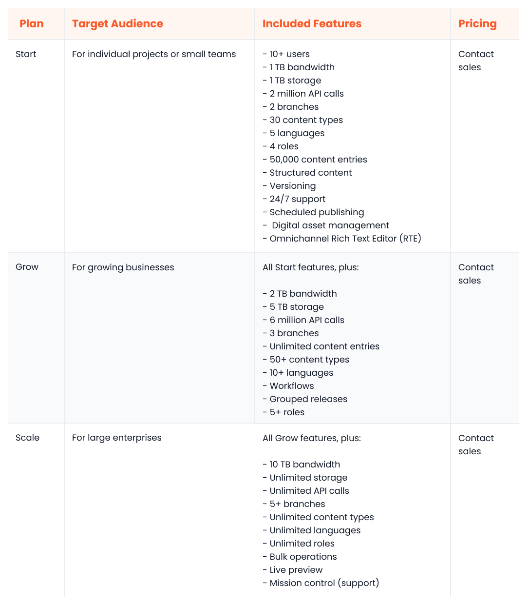
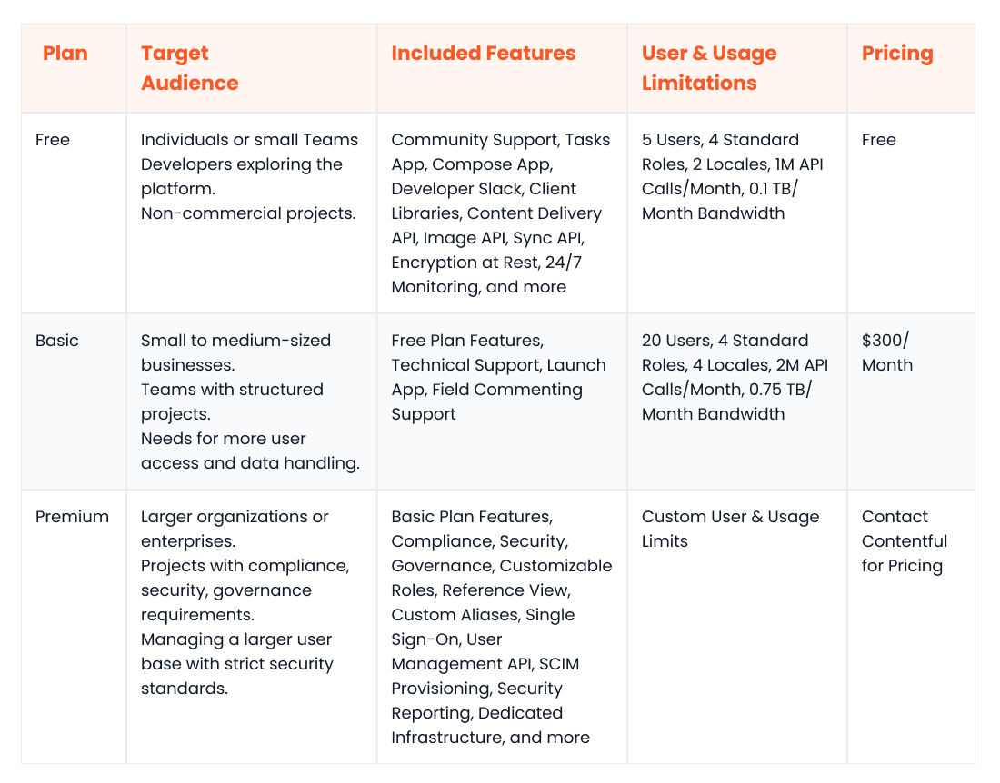

In the modern digital era, content needs to be accessible and adaptable across several devices and channels, not just websites. Traditional content management systems (CMSs) with tightly coupled front ends and back ends are architecturally incapable of delivering this omnichannel flexibility.

This is why more and more businesses are turning towards [headless content management system](https://www.webiny.com/enterprise-serverless-cms/headless-cms). These platforms decouple the presentation layer from the back end to allow marketers and developers greater flexibility over how content is delivered.

Digital teams can use a centralized content repository to serve content to as many channels as needed, including websites, mobile apps, kiosks, and conversational interfaces.

In the headless CMS industry, two names stand out for their extensive feature sets, established communities, and proven track records: Contentstack and Contentful. But which one is a better fit for your specific needs?

This article will perform a detailed headless CMS platform comparison of Contentstack vs. Contentful across key categories like ease of use, performance, scalability, and more.

We’ll also introduce [Webiny](https://www.webiny.com/), an emerging, enterprise-ready Contentstack and Contentful CMS  alternative that’s challenging the established players with its unparalleled customizability and auto-scalable architecture.

By the end, you should have a clear idea of the platform that best aligns with your business’s goals.

## Overview of Contentstack

Contentstack is a popular headless CMS that’s compatible with both Microsoft Azure and AWS cloud environments. It’s a fully cloud-native SaaS platform that uses a microservices-based architecture, efficient load balancing, and a global CDN to ensure optimal performance and scalability.

Contentstack offers taxonomies, a feature that makes it easy to classify and organize content according to your requirements. You can use hierarchical structuring or relational mapping to build a more organized content repository that streamlines navigability and searching.

Another standout Contentstack feature is “branches”, which allows you to create different copies of your content stack. Inside each branch, you can manage a separate set of content models, languages, assets, and other configurations tailored to individual projects.

Other notable Contentstack features are:

- Workflows
- Built-in localization live preview
- An AI assistant
- SOC 2 Type II and ISO 270001 compliance
- Dynamic content
- Image presets
- A rich text editor
- CLI tooling

Contentstack caters to businesses of different sizes with [three paid packages and a free trial](https://www.contentstack.com/pricing). It’s worth noting that all packages enforce bandwidth limitations, and only the highest-tier package comes with unlimited API calls and storage.

## Overview of Contentful

Contentful is a leading content platform and Contentstack alternative that streamlines the content management experience for all digital team members. It uses a multi-region delivery infrastructure (MRDI), powered by AWS, to ensure reliable and efficient content delivery across the globe.

The Compose app by Contentful enables marketers and editors to build and publish web pages without any developer assistance. Compose also makes it possible to create multilingual pages, schedule pages, or add pages to a release.

The Contentful Studio acts as the centralized hub within the platform. Its customizable interface enables users to tweak the workspace to match their specific needs with regards to brands, channels, or regions. It also offers AI-powered content and image generation tools to boost productivity and reduce time to market.

Other useful Contentful features include:

- Built-in localization
- Real-time collaboration
- Preview-based publishing
- Live preview
- Workflows
- A visual modeler
- Rich-text
- Markdown editors
- Content versioning
- Digital asset management

Contentful has multiple [pricing plans](https://www.contentful.com/pricing/) to accommodate users with different budgets and scalability requirements. Individuals building small-scale projects can get started for free, whereas enterprise customers can choose the Premium plan that comes with a few handy compliance and governance features.

## Headless CMS comparison: Contentstack vs. Contentful

Both Contentstack and Contentful offer reliability and efficiency in managing digital content, making either a solid option. However, to help you make an informed choice that perfectly aligns with your business’s needs, we’ll present a comprehensive evaluation checklist in the following sections.

## Ease of use

#### Contentstack

Contentstack is generally considered an easy-to-use platform for both technical and non-technical members of a digital team. The “modular blocks” feature enables marketers to build dynamic pages on the go via a drag-and-drop interface. The built-in AI assistant allows content creators to leverage ChatGPT natively for content creation.

For developers, Contentstack offers native SDKs and starter kits to speed up the development process. It also comes with a CLI for automating common tasks via built-in commands.

#### Contentful

Contentful also scores highly in the usability department, making it a great Contentstack CMS alternative. The Studio enables marketers to build visually appealing pages at scale. It features a native “presence indicator” which allows team members to collaborate in a shared workspace efficiently.

As a viable alternative to Contentstack, Contentful also offers starter kits to help developers get started faster. Developers can also find useful resources, including tutorials and hands-on courses, on the dedicated Developer Portal.

## Data query and content modeling

#### Contentstack

Contentstack boasts several features to build structured and scalable content models, including taxonomies, custom fields, global fields, modular blocks, and content types.

Developers can also create content types programmatically by submitting their JSON schemas via the API.

For efficient data querying, Contentstack provides a GraphQL content delivery API, which supports filtering, sorting, pagination, and batch query execution.

#### Contentful

Contentful makes it easy to model and organize your content using features like field groups, references, an AI content type generator, and a visual modeler. Users also have the option to create different “spaces” for individual projects, with each space having its own content model.

Similar to Contentstack, Contentful comes with a GraphQL content API which allows developers to fetch filtered, sorted, and paginated data.

## Customizability

#### Contentstack

As a Contentful alternative, Contentstack gives you the freedom to build fully customizable decoupled front ends for your apps. However, since it’s a proprietary platform, you can’t customize core back-end functionalities, like modeling or data storage. Nevertheless, users have the option to install extensions or add-ons to augment some of the platform’s capabilities.

#### Contentful

Like Contentstack, Contentful is a closed-source headless solution, allowing you to build personalized front ends. However, it offers no way to customize core back-end features.

That said, the Contentful Studio offers some interface customization options for marketers and content creators. Users can also install third-party extensions from the marketplace.

## Performance and scalability

#### Contentstack

Contentstack has a fault-tolerant distributed architecture that delivers high levels of performance and scalability. Users also have the option to create branches to provision new clients or sites on the same instance. However, it’s important to note that the number of branches is not unlimited, which may be a constraint for scaling projects.

#### Contentful

Contentful leverages a globally distributed infrastructure, efficient load balancing, and self-healing Kubernetes clusters to provide a resilient and scalable platform. Users can provision additional spaces and organizations dynamically to manage new clients or projects via the same instance.

## Integration ecosystem

#### Contentstack

Contentstack has a mature marketplace where you’ll find third-party apps and extensions for different use cases, including A/B testing, marketing, development, asset management, personalization, and translation.

Moreover, it offers contentstack-express, a Node.js based app framework to develop your own custom plugins.

#### Contentful

Contentful also has a developed ecosystem and marketplace where you can find integrations across different categories, including marketing, personalization, collaboration, commerce, editor productivity, and commerce. Additionally, it provides an app framework to develop custom integrations for any business-specific use cases, making it a great alternative to Contentstack.

## Community and support

#### Contentstack

Contentstack has a thriving community of users and contributors who collaborate via the official forums. Moreover, there are several learning resources available on the Contentstack website, including comprehensive documentation, podcasts, CMS guides, and a blog.

Contentstack offers 24/7 technical support with uptime SLAs to all customers, putting it in the lead as a Contentful alternative.

#### Contentful

Contentful has a larger community of developers, users, and enthusiasts who stay in touch via the official Discord server and forums.

On the Contentful site, you will find a plethora of learning resources, including a developer portal, extensive documentation, hands-on courses, whitepapers, eBooks, and a blog. Contentful offers technical support to all paid customers, with uptime SLAs only available to enterprise customers.

## Open-source

#### Contentstack

Contentstack is a proprietary solution which means that your developers can’t access its source code. Moreover, since it’s fully managed, you have no control over how your data is stored, or how your infrastructure is configured.

#### Contentful

Contentful is a proprietary, closed-source solution with no open-source components. Like Contentstack, it’s fully managed, hence you can’t choose to store your data or configure your infrastructure as per any regulatory requirements you may have. Those seeking greater customization may wish to look further for a Contentstack CMS alternative.

## Pricing

#### Contentstack

Contentstack offers three plans, with pricing details for each only available upon request.

The Start plan caters to small teams or individual projects, providing the least amount of bandwidth, storage, and API call allowances. The Grow plan is geared towards growing businesses and provides slightly higher resource limits. The Scale package is well-suited for large enterprises as it features unlimited storage and API calls (with a bandwidth limit of 10TB).

Here’s a tabular overview of [Contentstack’s plans](https://www.contentstack.com/pricing):

#### Contentful

Contentful has a transparent pricing structure with three plans.

The Free plan is a good starting point for individuals building hobby projects; it’s free of cost. The Basic plan caters to small teams, costing $300/month. The Premium plan is ideal for enterprises with advanced security and compliance requirements; to get a price for this package, contact the sales team at Contentful.

Here’s a tabular overview of [Contentful’s pricing](https://www.contentful.com/pricing/):

## Security

#### Contentstack

Contentstack is widely considered a secure and reliable platform. Here are some reasons why:

- All data is encrypted at rest and in transit using industry-standard encryption algorithms.
- Contentstack is SOC-2 Type 2 and ISO 270001 certified.
- All user passwords are stored in hashed form to prevent unauthorized exposure.
- There are options to enable two-factor authentication and SSO.

#### Contentful

Contentful also takes security seriously. Here are some security-related highlights of the platform:

- Contentful is ISO 270001 compliant.
- All data is encrypted at rest and in transit using AWS’s military-grade encryption services.
- Annual penetration tests and periodic data backups are performed.
- AWS GuardDuty is used for proactive threat detection and mitigation.

## Webiny: The new generation of headless CMS

Contentstack and Contentful are established headless CMS solutions, but they have certain limitations. Neither provides the ability to customize the backend or host within your own environment. Additionally, Contentstack’s non-transparent pricing structure can be a hurdle for some organizations.

Enter [Webiny](https://www.webiny.com/why-webiny), a Contentful and Contentstack alternative that’s an open-source, enterprise-grade headless CMS platform, that bridges these gaps. It delivers the same reliability as Contentstack and Contentful while offering [unparalleled customization](https://www.webiny.com/features/development-framework), scalability, and self-hosting freedom.

Let’s look at a few reasons why Webiny’s platform is becoming one of the go-to CMS options for forward-thinking [enterprises](https://www.webiny.com/enterprise).

### Self-hosted

Webiny rewrites the rules for enterprise-grade CMSs by allowing you to [host within your own AWS environment](https://www.webiny.com/features/self-hosted-headless-cms), and with upcoming support for other cloud platforms, it gives you unparalleled control over your infrastructure, data, and security policies.

### Serverless

Webiny runs on the [serverless infrastructure inside your AWS account](https://www.webiny.com/features/aws-serverless-infrastructure), delivering unprecedented levels of scalability and fault tolerance. Moreover, you can use Pulumi Infrastructure as code (IaC) to have full programmatic control over your infrastructure’s configuration and layout.

### Open source

Webiny is available as an [open source software under the MIT license](https://www.webiny.com/features/open-source). This means that, unlike Contentstack or Contentful, you can customize any aspect of the back end. You can rewrite the data storage layer, finetune the APIs, tweak the search algorithms, or tailor any other core functionality to meet your business’s needs.

### Cost savings

Being free and open source, Webiny slashes costs right off the bat. Moreover, with no servers to provision or manage, you can further expect up to an 80% decrease in maintenance costs compared to VM-based deployments.

[Click here to view Webiny’s pricing plans.](https://www.webiny.com/pricing)

### Secure

Webiny prioritizes security over everything else. Here are a few security-centric features of the platform:

- All source code is periodically scanned using CodeQL for any vulnerabilities or security hotspots.
- All third-party dependencies are scanned using Dependabot to reduce the chances of supply-chain attacks.
- With no servers to manage, the chances of misconfigurations and human errors are reduced.
- Webiny supports AWS Cognito by default but also allows you to integrate with any external identity providers.
- Enterprise customers can choose to deploy Webiny inside an existing Amazon Virtual Private Cloud (VPC).

## Contentstack vs. Contentful summary: which headless CMS is the best?

Contentstack and Contentful are both battle-tested headless CMSs, but they may not be the ideal fit for modern enterprises. They have mature ecosystems and dependable architectures, but they lack two key ingredients that every modern enterprise craves: customizability and governance.

If you are looking for an enterprise-grade, fully customizable, self-hosted headless CMS, then [Webiny](https://www.webiny.com/) is a viable Contentstack and Contentful open-source alternative.

Its serverless architecture can scale better than its counterparts, and its open-source nature and self-hosting capabilities give you full control over everything. Moreover, it has some unique features that both Contentstack and Contentful lack, such as [native multi-tenancy](https://www.webiny.com/features/multi-tenancy-site-management) and IaC.

[Experience the power of Webiny CMS firsthand — book your no obligation 30-minute demo here.](https://www.webiny.com/forms/product-demo)
