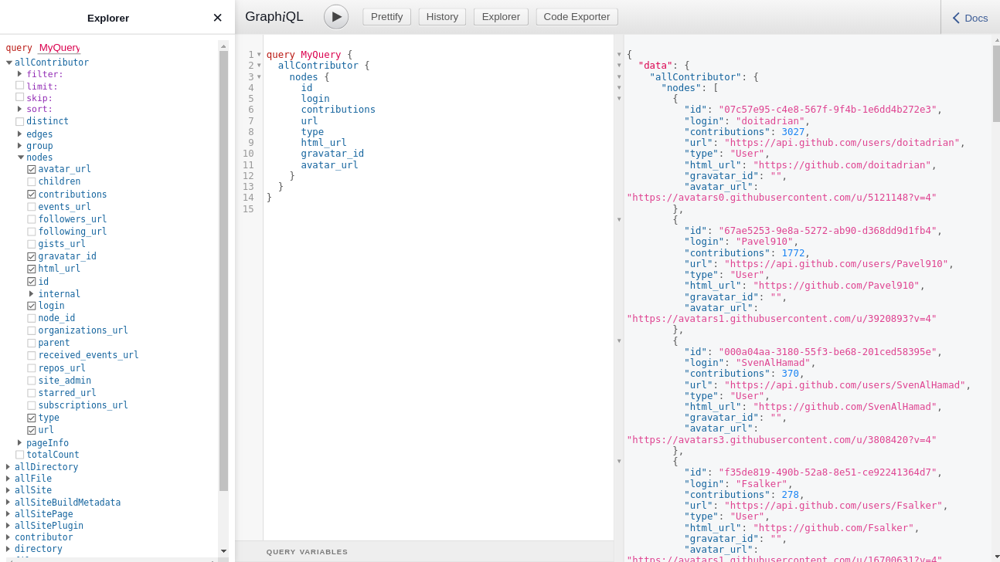

In this tutorial, we'll be creating a Gatsby source plugin, which will fetch all contributors to a given Github repo. We'll also learn how to use that plugin in a Gatsby site to render a list of contributors.

Let's take a sneak peek 😉 of what we'll get in the end:


---

## The big picture:

One question that you might ask is: **What is a source plugin?**

Source plugins "source data" from remote or local locations into a format that Gatsby can process.

First, we'll build a plugin with the following behavior:

1. Make an API request to the Github API.
2. Convert the data returned by the API to Gatsby's node system.
3. Accept plugin options to customize how our plugin works.

And then, we'll do the following steps to using that plugin:

1. Configure our plugin in our site's `gatsby-config.js` file.
2. Write GraphQL queries to access our plugin's data.

---

## How to create a source plugin for Gatsby

We'll follow a simple step-by-step process to build the plugin:

#### Set up projects for plugin development

We'll set up an example site and create a plugin inside it to begin building.

1. **Set up an example site**

Let's create a new Gatsby site with the `gatsby new` command, based on the hello world starter.

```
gatsby new example-site https://github.com/gatsbyjs/gatsby-starter-hello-world
```

This site generated by the `new` command is where we install the plugin. It will give us a place to test the code for our plugin.

2. **Set up a source plugin**

Let's create a new Gatsby plugin with the `gatsby new` command, this time based on the plugin starter.

```
gatsby new source-plugin https://github.com/gatsbyjs/gatsby-starter-plugin
```

This command will create our plugin in a separate project from our example site.

3. **Install the plugin in the example site**

We're going to install the plugin in the example-site to make sure it works. Gatsby can only run plugins that are included in `gatsby-config.js`, so let's do that.
Here is what the config will look like:

```
module.exports = {
    /* Your site config here */
    plugins: [require.resolve(`../source-plugin`)],
}
```

_Note: Restart the development server, after changing the `gatsby-config.js` file. Otherwise, changes made to the config won't reflect in the project._

---

#### Source data and create nodes

Now that we've setup the project for development, it's time to fill in the details.

The `gatsby-node.js` file is the place where the logic responsible for sourcing the data lives.

In that file, Gatsby exposes an API sourceNodes. There we'll use a Gatsby function named createNode. As the name suggests, it handles the creation of a new node.

Let's add the following code in our `gatsby-node.js` file:

`gist:ashu96/88d9976a78737dbf36037deff98f1536`

Now we have all the structure and logic for creating `gatsby nodes` in place.

Let's add the real thing, the logic for fetching real data from the Github API. We'll use `node-fetch` to make an API call. You're welcome to use any alternative library of your choice.

Add it as a dependency by running:

```
npm install node-fetch
```

After installing the dependency, we'll make necessary changes to the `gatsby-node.js` file. And after that, the code will look as follows:

`gist:ashu96/406ff0b3940534318105566117fa495d`

Let's restart the example-site project and visit [http://localhost:8000/\_\_\_graphql](http://localhost:8000/___graphql)



As we can see there is a new query `allContributor` available for us to use.

As it is, our plugin works fine. But, there is a _small problem_. It only fetches the contributor of a particular Github repo. And there is no way to change that value, which makes it hard to reuse by others. Let's fix this right away.

_We can pass options into a plugin through a `gatsby-config.js` file._

Let's update the `gatsby-config.js` file in our example-site. We'll change the plugin from a string to an object with a `resolve` and `options` key.

After the changes the file will look like this:

```
module.exports = {
/* Your site config here */
  plugins: [
  {
   resolve: require.resolve(`../source-plugin`),
   // These options will be available in Gatsby node API
   options: {
    repo: "webiny/webiny-js",
   },
  },
 ],
}
```

Now that we've added the repo as an option to our plugin, let's update our plugin source code to use that instead of the hard coded value.

We'll make the following change:

```
// ... some code
// use repo name from plugin options
const repoName = pluginOptions.repo;
// construct the API URL
const githubRepoURL = `https://api.github.com/repos/${repoName}/contributors`;
// remaing code is removed for brevity
```

---

#### Using data from the source plugin in a site

Now, our source plugin is ready. Let's use its data to render the contributors list in our example-site.

In our example-site, we'll now query data from pages.

Add the following code to file at `example-site/src/pages/index.js`:

`gist:ashu96/96286744cfe19185700ab392110e8fe6`

Here we're using the GraphQL query `allContributor` to get all contributor's data. As mentioned earlier, this data is generated by our source plugin.

After making these changes our example-site home page will look something like this:


---

### Summary

We've written a Gatsby plugin that:

- can be configured with an entry in your `gatsby-config.js` file
- requests data from an API
- pulls the API data into Gatsby's node system
- allows the data to be queried with GraphQL

---


You did it!! 🚀 You now know how to create a source plugin for Gatsby.

You're welcome to check out the complete source code for [example-site](https://github.com/Ashu96/gatsby-github-plugin-example-site) and [source plugin](https://github.com/Ashu96/gatsby-plugin-github-contributors).

If you like the post please share it on Twitter.
Webiny has a very welcoming Community! If you have any questions, please join us on [slack](https://www.webiny.com/slack/).
You can also follow us on Twitter [@WebinyCMS](https://twitter.com/WebinyCMS).
