import OnPagePromo from "../components/ui/on-page-promo/on-page-promo"

## Introduction

Marketplace applications give users the ability to share and sell products online. In this tutorial we will build a marketplace application for software developers to sell code, tech articles and full applications. We'll be using [Tailwind](https://tailwindcss.com) to style the app, and state management library [Pinia](https://pinia.vuejs.org) to create type safe Vue Stores.

## What we will build

Here is a mockup of the marketplace application. This is the product page along with buttons that will change based on whether a user is the seller of the item.  

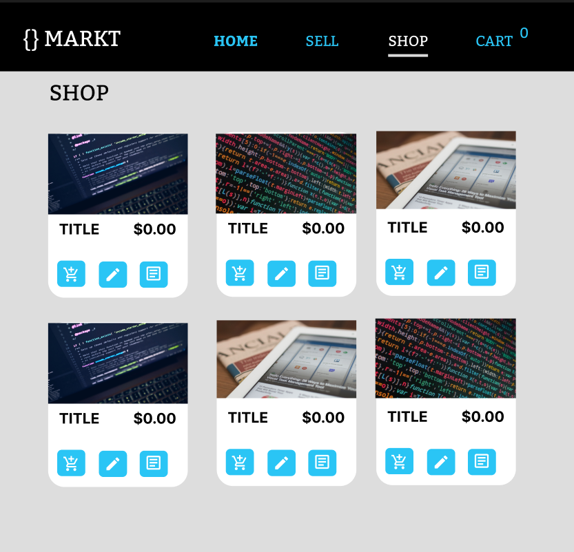

This article will focus on the Webiny CMS and how to connect it to your Vue.js application. We will be using:

- Vue.js using Vite
- GraphQL
- Tailwind CSS
- Pinia

### What you will need

- Basic knowledge of **GraphQL**, **Vue.js** and **Tailwind CSS**
- Amazon AWS Account
- [**Webiny CMS** installed on your local Machine](https://www.webiny.com/docs/get-started/install-webiny)

### We will learn:

- Webiny Headless CMS
- Integrating Webiny CMS using Vue Apollo
- How to use Pinia for state management

We will focus on Webiny CMS first by creating our Content Models to be used in the Vue Application.

**NOTE:** We will not be integrating any authentication in this tutorial, however it is **strongly advised**  that for production code you implement a robust **user authentication** flow.

## Create a new Webiny project

In order to create a Webiny project you must have **Node.js** and **AWS** account, more prerequisites can be found in the documentiation  - [https://www.webiny.com/docs/get-started/install-webiny](https://www.webiny.com/docs/get-started/install-webiny)

Open the Terminal in the Command Line and `**cd`** into the directory where you want to keep your Webiny project. Next, run the command line below:

```bash
npx create-webiny-project [your project name]
```

Once you have created the project you need to deploy it to AWS so it can be built and we can access all the features Webiny provides. 

```bash
yarn webiny deploy
```

Once the deployment has finish, you will be presented with the URL for your webiny project where you can access the Admin Dashboard and start creating the backend for the project.

## Creating Categories

For this application we will have three types of Products: Code Snippets, Tutorials and Full Applications. We will start the content models by creating our **Categories** Content Model.

In the Webiny Headless CMS menu choose **Models** then **New Model,** give your model the name **Categories** and a description

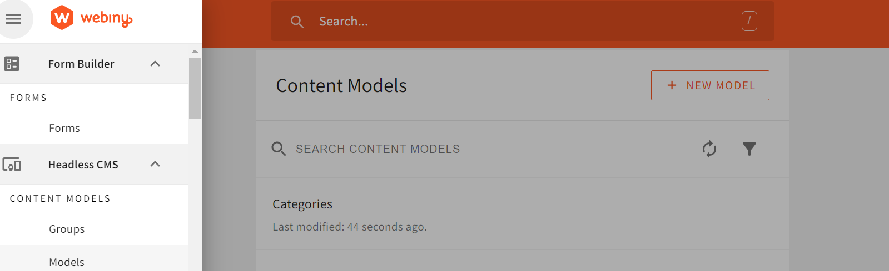

Once created we must now flesh out our model with the information we need to create a category. You will be presented with the drag and drop user interface for the model. The category content model will have two **text** fields: 

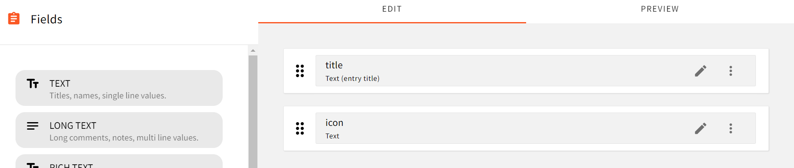

- **Title [text] -** Name of the category
- **Icon [text] -** the icon name that corresponds to our **Google Material Icons**

**Save** the Model

Under the **Headless CMS** scroll down until you find the **Categories** model you just created.

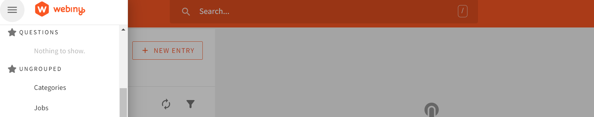

Next create a **New Entry** and populate the fields:

- *title*: **Code Snippet**
- *icon*: **code**

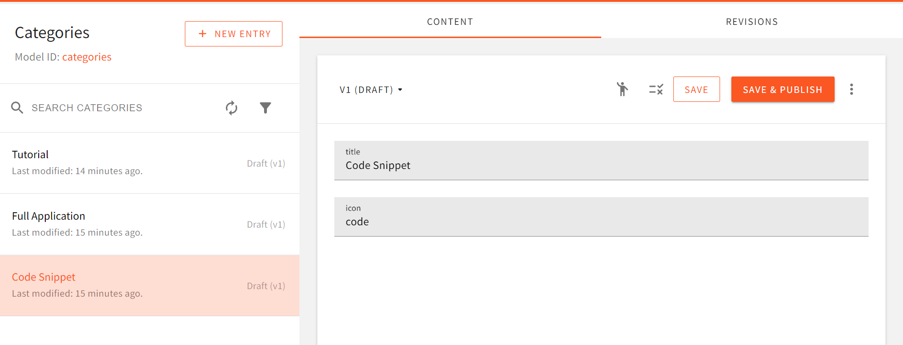

## Creating Sellers Model

Let’s create the Content Model for Sellers, we will need a Name and Username so that sellers can **manage** their products. The Seller Model will have two fields

- **Name** - Text
- **Username** - Text

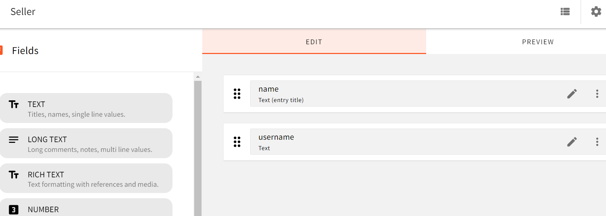

Once you have saved the **Sellers** Model, create an entry.

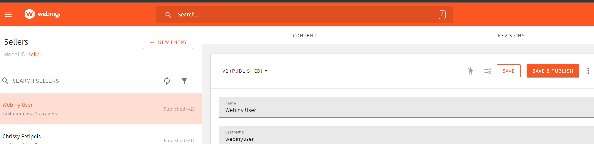

# Creating Products Model

Let’s create the **Content Model** for our Products. This will house all the information we need for each product in our App. 

Create a new Content Model called **Products**

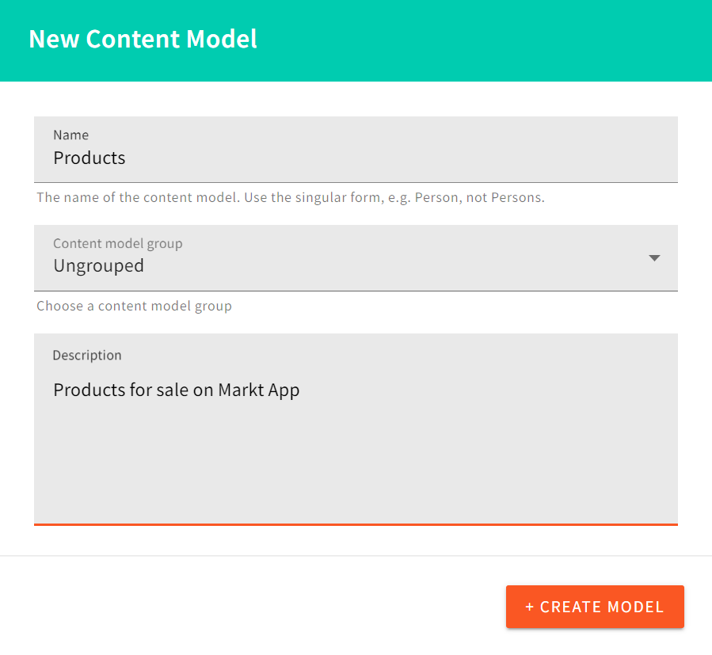

The model will contain these fields:

- **Title: Text**
- **Desc**: Text
- **Price**: Number
- **Category**: Text
- **Seller:** Text
- **Link**: Text

This is what the Model should look like when completed:

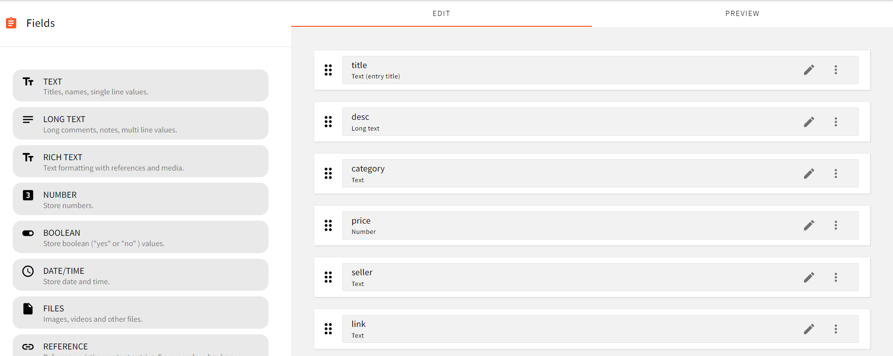

*NOTE: This model could also contain a product image and give users the ability to sell all sorts of products but the tutorial will not be implementing this feature.* 

Let’s create a few entries on the Webiny CMS. We will be able to create them from the Vue.js application later.

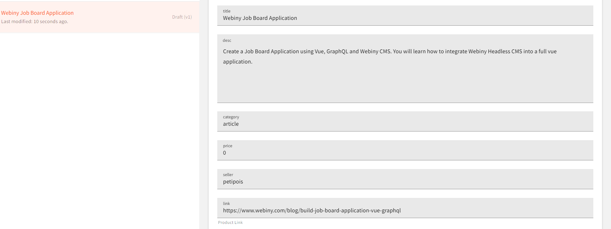

Now that we have all our models and a few entries we will get the API Keys we need to access the content from the Vue.js application.

Under settings open the API Keys option

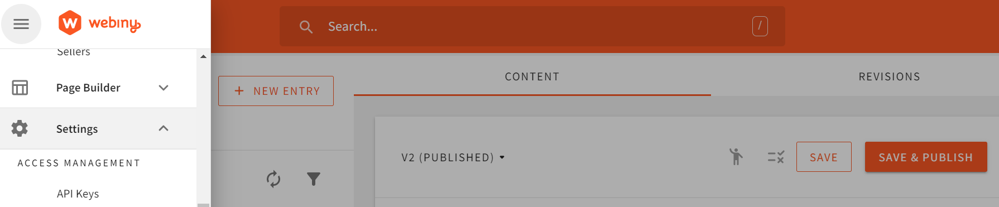

Create a new api key, in this example I have named the api key ProductsAPI

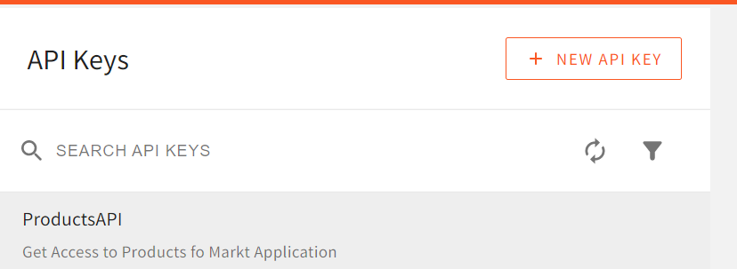

For the user to have the ability to read, write and delete entries we need to change the access level to **Full Access.**

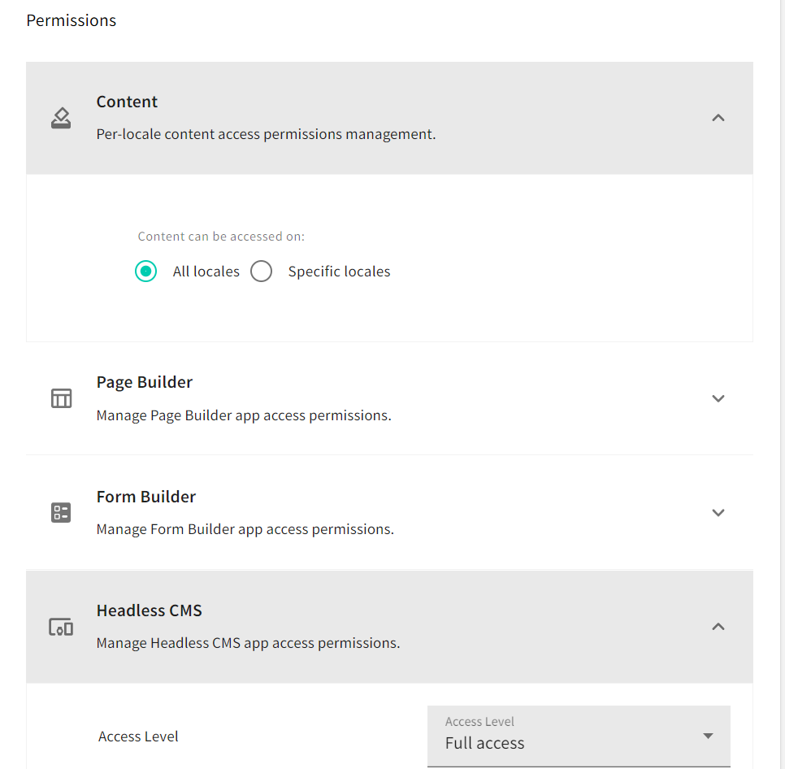

**Note**: If you want to restrict certain models from the user you can choose **Custom Access**.

Once you have saved the API it will provide you with a token. Copy this token and put it in a safe place we will use this later.

<OnPagePromo />

# Creating our Vue Application

We will be using Vite.js to create our project. In a separate location to your webiny application, using the Command prompt terminal, create a new **Vue** project and following the prompts to create a vue application using javascript.

```bash
npm create vite@latest markt-webiny
cd markt-webiny
npm install
```

## Installing the dependencies

We need to install a few dependencies for our app, Vue Router, Vue Apollo and Tailwind CSS. 

### Adding Vue Router

We will be using **vue-router** for our application. Install it by opening the terminal inside Visual Studio Code and typing this command

```bash
npm install vue-router@4
```

Next, inside the **index.js** file that we created under the **router** folder create the routes we need for our application.

```jsx
import { createRouter, createWebHistory } from "vue-router";
import Home from "../views/Home.vue";
import Cart from "../views/Cart.vue";
import Products from "../views/Products.vue";
import Create from "../views/Create.vue";
const routes = [
  {
    path: "/",
    name: "Home",
    component: Home,
  },
  {
    path: "/new",
    name: "Create",
    component: Create,
    meta: {
      requiresAuth: true,
    },
  },
  {
    path: "/products",
    name: "Products",
    component: Products,
  },
  {
    path: "/cart",
    name: "Cart",
    component: Cart,
  },
];

const router = createRouter({
  history: createWebHistory(),
  routes,
});

/* Check that the user is logged in if not show alert and redirect to the home page */
router.beforeEach((to, from, next) => {
  if (to.matched.some((record) => record.meta.requiresAuth)) {
    if (localStorage.getItem("user")) {
      next();
    } else {
      alert("You must register to sell products");
      next("/");
    }
  } else {
    next();
  }
});
export default router;
```

We also added a route guard so that we can determine if a user can manage a product or not. 

### Adding Tailwind CSS

Let’s also add Tailwind CSS to our Vite application the documentation for this can be found here.

[Install Tailwind CSS with Vite - Tailwind CSS](https://tailwindcss.com/docs/guides/vite)

*You could add you own styling and skip this step if you want.*

## Installing **Vue Router & Vue Apollo**

```bash
npm i vue-router@4
npm install --save graphql graphql-tag @apollo/client
npm install --save @vue/apollo-composable
```

Open the **index.js file** under **src/routes** and enter the code below:

```jsx
/** router/index.js */
import { createRouter, createWebHistory } from "vue-router";
import Home from '../views/Home.vue'
import Cart from '../views/Cart.vue'
import Products from '../views/Products.vue'
import Product from '../views/Product.vue'
import Create from '../views/Create.vue'
const routes = [
  {
    path: "/",
    name: "Home",
    component: Home,
  },
  {
    path: "/new",
    name: "Create",
    component: Create,
  },
  {
    path: "/products",
    name: "Products",
    component: Products,
  },
  {
    path: "/cart",
    name: "Cart",
    component: Cart,
  },
];

const router = createRouter({
  history: createWebHistory(),
  routes,
});

export default router;
```

Now that we have created our routes let’s integrate this in our application using the **main.js** file.

```jsx
/** main.js */
import { createApp } from "vue";
import "./index.css";
import { DefaultApolloClient } from "@vue/apollo-composable";
import {
  ApolloClient,
  createHttpLink,
  InMemoryCache,
} from "@apollo/client/core";

import App from "./App.vue";
import router from "./router/index.js";

const httpLink = createHttpLink({
  uri: import.meta.env.VITE_CMSAPI,
  headers: {
    Authorization: "Bearer " + import.meta.env.VITE_TOKEN,
  },
});
const cache = new InMemoryCache();
const apolloClient = new ApolloClient({
  link: httpLink,
  cache,
});
createApp(App)
  .provide(DefaultApolloClient, apolloClient)
  .use(router)
  .mount("#app");
```

### Environment variables

You will need to create an .env file to contain your token and api keys for this application. 

```bash
VITE_TOKEN=[YOUR PRODUCTSAPI TOKEN]
VITE_CMSAPI=[your webiny api url]
```

If you've misplaced your Webiny API URL, type `yarn webiny info` in your Webiny directory, or navigate to the API Playground using the user interface.

**NOTE:** In this example code, we are using your API token on the client. This is not a secure solution. If you intend using this code, please integrate a more secure way to use your API key, perhaps using a server-side function or a proxy.

## Adding icons

We will be using **[Google Material Icons](https://fonts.google.com/icons?icon.query=person&icon.set=Material+Icons)** to add some style to each product category.

Open the **index.html** and add link the Material Icons stylesheet

```html
<!DOCTYPE html>
<html lang="en">
  <head>
    <meta charset="UTF-8" />
    <link rel="icon" type="image/svg+xml" href="/vite.svg" />
    <link href="https://fonts.googleapis.com/icon?family=Material+Icons" rel="stylesheet">
    <meta name="viewport" content="width=device-width, initial-scale=1.0" />
    <title>Webiny Markt App</title>
  </head>
  <body>
    
    <div id="app"></div>
    <script type="module" src="/src/main.js"></script>
  </body>
</html>
```

## Pinia

[Pinia 🍍](https://pinia.vuejs.org/) is a state management library that makes it easy to manage data across our application. [You can learn more about Pinia library on their website](https://pinia.vuejs.org/introduction.html).

## Webiny API Playground

Another great feature of Webiny is the API Playground you can learn more about [from the Webiny Documentation](https://www.webiny.com/docs/headless-cms/basics/using-graphql-api). We will use it to test our GraphQL syntax to access and manage the data from our Content Models.

## Sellers Model

First we will load all of them into our **Pinia Store** and then we will add the functionality in our Home.vue file to check if the username in the input field matches one the **Sellers Model**. We will make the query to list all the data in the **Sellers Model** then we will test the syntax in the API Playground.

In the **API Playground** we have a **GraphQL** editor where we can test any GraphQL syntax on our Models. There are four different APIs listed: **Main**, **Manage**, **Read** and **Preview**. We are going to be using the Manage API for this tutorial.

```graphql
{ 
  listSellers {
    data {
      id
      name
      username
    }
  }
}

```
Enter the **GraphQL Query** above on the left panel, and click the **Play** button to test it. You should see the results shown below:

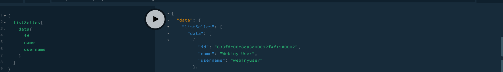

Now we know the query was successful we can create a new file under the **stores** folder called **users.js** and enter the code below:

```jsx
/* stores/uses.js */

import { defineStore } from "pinia";
import { reactive, ref } from "vue";

import { useQuery } from "@vue/apollo-composable";
import gql from "graphql-tag";

export const useUserStore = defineStore("user", () => {
  const sellers = reactive([]);
  let allSellers;
  let user = ref({});
/* Check if we already are logged in*/
  if (localStorage.getItem("user")) {
    user = JSON.parse(localStorage.getItem("user"));
  }

/* List all the sellers in the Webiny CMS*/
  const loadSellers = () => {
    const ALL_SELLER_QUERY = gql`
      query {
        listSelles {
          data {
            id
            name
            username
          }
        }
      }
    `;

    const { loading, result, error } = useQuery(ALL_SELLER_QUERY);
    if (result) {
      allSellers = result;
    }
  };

/* Update the sellers array with Webiny CMS data*/
  const updateSellers = () => {
    sellers.value = allSellers.value.listSelles.data;
  };
  const login = (username) => {
    updateSellers();
    sellers.value.forEach((element) => {
      if (element.username === username.value) {
        let loadedUser = {
          id: element.id,
          name: element.name,
          username: element.username,
        };
        user = loadedUser;
        localStorage.setItem("user", JSON.stringify(user));
      }
    });

    window.location.reload();
  };
  const logout = () => {
    localStorage.removeItem("user");
    window.location.reload();
  };
  return {
    user,
    login,
    logout,
    loadSellers,
  };
});
```

## Cart Store

We will create our cart store to keep track of the user’s cart and their purchases through our application. We will store all of these into `localStorage`.

```jsx
/** stores/cart.js */
import { defineStore } from "pinia";
import { computed, reactive, ref } from "vue";

export const useCartStore = defineStore("useCartStore", () => {
  const cart = reactive([]);
  const purchases = reactive([]);
  /* If there any purchases push them to the purchases array* */
  if (localStorage.getItem("purchases")) {
    let savedPurchases = JSON.parse(localStorage.getItem("purchases"));
    savedPurchases.forEach((element) => {
      purchases.push(element);
    });
  }
  let currentUser;
  if (localStorage.getItem("user")) {
    currentUser = JSON.parse(localStorage.getItem("user"));
  }

  /* If there any items stored in the cart push them to the cart array* */
  if (localStorage.getItem("cart")) {
    let savedCart = JSON.parse(localStorage.getItem("cart"));
    savedCart.forEach((element) => {
      cart.push(element);
    });
  }
  const addToCart = (product) => {
    if (cart.length == 0) {
      cart.push(product);
    } else {
      let hasProduct = cart.some((item) => item["id"] === product.id);
      if (hasProduct) {
        alert("This product is already in your cart");
      } else {
        cart.push(product);
      }
    }
    localStorage.setItem("cart", JSON.stringify(cart));
  };
  const removeFromCart = (id) => {
    let newCart = cart.filter((product) => {
      return product.id != id;
    });
    localStorage.setItem("cart", JSON.stringify(newCart));
    window.location.reload();
  };
  const savePurchases = (product) => {
    purchases.push({
      currentUser,
      ...product,
    });
    localStorage.setItem("purchases", JSON.stringify(purchases));
    removeFromCart(product.id);
  };
  const total = computed(() => {
    let temp = 0;
    cart.forEach((element) => {
      temp += parseFloat(element.price);
    });
    return temp;
  });
  return { cart, addToCart, total, removeFromCart, purchases, savePurchases };
});
```

## Home Page

Now that we have both the user and cart Pinia stores we can create our Home page of our application.  This will show a login screen if there is no user in the localStorage or the User’s profile and purchases if logged in. Reminder: don't use this method of authentication in a production application.

```jsx
/** views/Home.vue */
<template>
  <div v-if="!store.user.username"
    class="p-4 m-4 mx-auto w-full max-w-sm bg-white rounded-lg border border-gray-200 shadow-md">
    <form class="space-y-6" @submit.prevent="handleLogin()">
      <h5 class="text-xl font-medium text-gray-900">Markt Login </h5>
      <div>
        <label for="email" class="block mb-2 text-sm font-medium text-gray-300">Username</label>
        <input type="text" v-model="username" class="bg-gray-50 border border-gray-300 text-gray-900 text-sm rounded-lg focus:ring-blue-500
          focus:border-blue-500 block w-full p-2.5 " placeholder="Enter username" required />
      </div>
      <div class="flex items-start">
        <button type="submit" class="w-full rounded-md p-2 text-white bg-blue-400 hover:bg-blue-500">
          <span class="material-icons">login</span>
        </button>
      </div>
    </form>
    <p class="text-sm my-2">For testing purposes type - webinyuser </p>
  </div>
  <div v-else>
    <div class="m-2 mx-auto w-full max-w-sm bg-white rounded-lg border border-gray-200 shadow-m ">
      <div class="flex flex-col items-center pb-10">
        <span class="material-icons text-gray-900 text-5xl">person</span>
        <h5 class="mb-1 text-xl font-medium text-gray-900">{{store.user.name}}</h5>
        <span class="text-sm text-gray-500">{{store.user.username}}</span>
        <div class="flex mt-4 space-x-3 md:mt-6">
          <button @click="handleLogout"
            class="inline-flex items-center py-2 px-4 text-sm font-medium text-center text-white bg-blue-700 rounded-lg hover:bg-blue-800 focus:ring-4 focus:outline-none focus:ring-blue-300">
              Log Out
          </button>
        </div>
      </div>
    </div>
    <div v-for="item in cartStore.purchases" :key="item.id" class="p-2 shadow-md border-black border-2 m-2">
      <div v-if="item.currentUser.username===store.user.username">
        <div class="flex justify-between">
          <div>
            <span class="material-icons text-5xl">{{item.category}}</span>
            <h2 class="font-bold">{{item.title}}</h2>
          </div>
          <a :href=item.productLink target="_blank" rel="noopener noreferrer">{{item.productLink}}</a>
        </div>
      </div>
    </div>
  </div>
</template>

<script setup>
import { ref } from "vue";
import { useCartStore } from "../stores/cart";
import { useUserStore } from "../stores/users";
const store = useUserStore();
const cartStore = useCartStore();
const username = ref('')
const handleLogin = () => {
  store.login(username)
  username.value = ""
}
const handleLogout = () => {
  store.logout()
  router.push("/")
}
</script>
```

The above code has the following result:

If the user is not logged in they see a login screen:

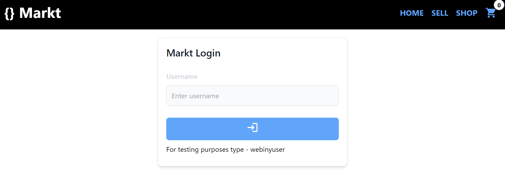

If the user is logged in they see a Name, Username and "Log out" button:

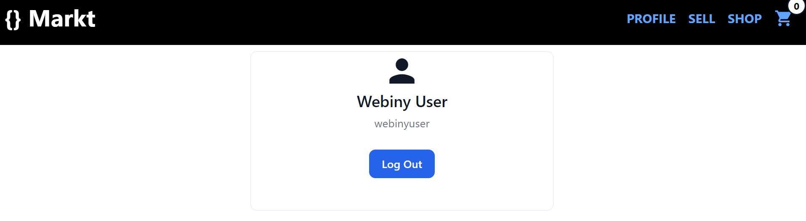

## Showing Products data

Next we need to get all the data from the Product Model. We will create another store called **products.js** and add the GraphQL we need to list all of the products. We will add the functionality to view all the products.

```graphql
query {
      listProducts {
        data {
          id
          title
          desc
          seller
          category
          productLink
          price
        }
      }
    }
```

As before, run this query in the GraphQL Playground to verify we have all the data as expected:

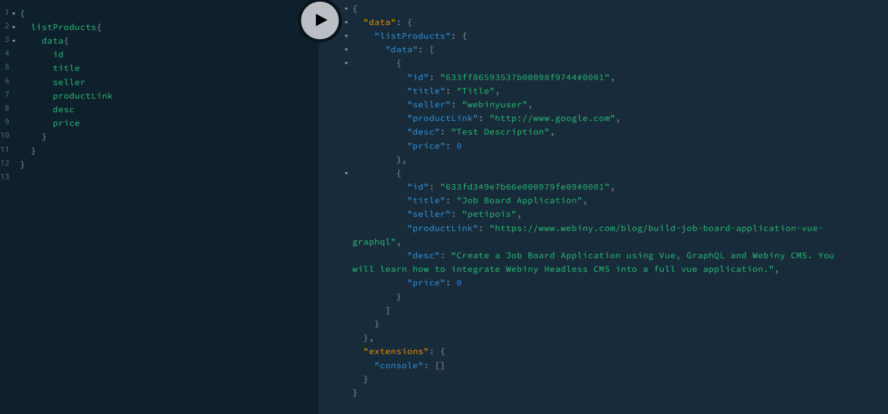

## Product data Store

This is the **products.js** file with our Pinia Product Store, where we will put all the code related to our Products model. We will handle GraphQL queries and mutations here.

```jsx
/** stores/products.js */
import { defineStore } from "pinia";
import { reactive, ref } from "vue";

import { useQuery, useMutation } from "@vue/apollo-composable";
import gql from "graphql-tag";

export const useProductStore = defineStore("products", () => {
  const products = reactive([]);
  let allProducts;

  const user = JSON.parse(localStorage.getItem("user"));

  const ALL_PRODUCTS_QUERY = gql`
    query {
      listProducts {
        data {
          id
          title
          desc
          seller
          category
          productLink
          price
        }
      }
    }
  `;

  const { loading, result, error } = useQuery(ALL_PRODUCTS_QUERY);
  allProducts = result;
  
  const updateProducts = () => {
    allProducts.value.listProducts.data.forEach((element) => {
      products.push(element);
    });
  };
  
  const DELETE_PRODUCT = gql`
    mutation ($id: ID!) {
      deleteProducts(revision: $id) {
        data
      }
    }
  `;

  const { mutate: deleteProduct } = useMutation(DELETE_PRODUCT, (product) => ({
    variables: {
      id: product,
    },
  }));
  const removeFromWebiny = (product) => {
    deleteProduct(product).then(() => {
      window.location.reload();
    });
  };
  return {
    result,
    updateProducts,
    allProducts,
    products,
    removeFromWebiny,
  };
});
```

## Products view

We will add the code to view all the products and if the user is logged in they cannot buy their own items but they will be able to update or delete them.

```jsx
/** views/Products.vue*/
<script setup>
import { useMutation, useQuery } from '@vue/apollo-composable'
import gql from 'graphql-tag'
import { reactive, ref } from 'vue';
import { useCartStore } from '../stores/cart';
import { useProductStore } from '../stores/products';
import { useUserStore } from '../stores/users';
let isEditing = ref(false);
const loadedProduct = reactive({})

const editProduct = (product) => {
  openEdit.value = true;
  loadedProduct.id = product.id
  loadedProduct.title = product.title
  loadedProduct.desc = product.desc;
  loadedProduct.price = product.price
  isEditing.value = true
}

const UPDATE_PRODUCT = gql`
    mutation updateProduct(
      $id: ID!
      $title: String!
      $desc: String!
      $price: Number!
    ) {
      updateProducts(
        revision: $id
        data: { title: $title, desc: $desc, price: $price }
      ) {
        data {
          title
          desc
          price
        }
      }
    }
  `;
const { mutate: updateProduct } = useMutation(UPDATE_PRODUCT, () => ({
  variables: {
    id: loadedProduct.id,
    title: loadedProduct.title,
    desc: loadedProduct.desc,
    price: loadedProduct.price,
  },
}));

const updateWebiny = () => {
  console.log(loadedProduct)
  updateProduct().then(() => {
    window.location.reload();
  });
};

const viewProduct = (product) => {
  openView.value = true;
  loadedProduct.title = product.title
  loadedProduct.desc = product.desc;
  loadedProduct.price = product.price
  loadedProduct.seller = product.seller
}
const openEdit = ref(false)
const openView = ref(false)
const store = useProductStore();
const userStore = useUserStore();
const cartStore = useCartStore();
</script>
<template>

<!-- POPUP -->
  <div v-if="openView" class="shadow-md  rounded-lg fixed top-0 right-0 left-0  w-full md:inset-1 bg-white h-1/2">
    <button @click="openView=false"
      class="inline-flex items-center  p-2 m-1 text-sm font-medium text-center text-white bg-blue-300 rounded-lg hover:bg-black">
      <span class="material-icons">close</span></button>
    <h1 class="text-3xl font-bold m-2">{{loadedProduct.title}}</h1>
    <div class="p-2">
      <p>{{loadedProduct.desc}}</p>
      <div class="flex justify-between">
        <h2 class="font-bold text-3xl">${{loadedProduct.price.toFixed(2)}}</h2>
        <div class="flex">
          <h1 class="bg-blue-100 text-blue-800 text-lg font-medium inline-flex items-center px-2.5 py-0.5 rounded">
            <span class="material-icons">account_circle</span>
            {{loadedProduct.seller}}
          </h1>
        </div>
      </div>
    </div>
  </div>
<!-- POPUP -->

  <div v-if="openEdit" class="shadow-md p-2 rounded-lg fixed top-0 right-0 left-0  w-4/4 md:inset-5 bg-white h-3/4">
    <button @click="openEdit=false" class="m-1 p-2 text-white bg-black hover:bg-blue-400 rounded-md">
      <span class="material-icons">
          close
      </span>
    </button>

    <h1 class="text-3xl font-bold m-2">Edit Product</h1>
    <form @submit.prevent="updateWebiny()" class="flex flex-col mx-auto p-2">
      <input 
        type="text" 
        placeholder="Title" 
        v-model="loadedProduct.title"
        class="bg-gray-50 border border-gray-300 text-gray-900 text-sm rounded-lg focus:ring-blue-500 focus:border-blue-500 block w-full p-2.5" 
      />
      <input 
        type="number" 
        placeholder="Price" 
        step="0.01" 
        v-model="loadedProduct.price"
        class="bg-gray-50 border border-gray-300 text-gray-900 text-sm rounded-lg focus:ring-blue-500 focus:border-blue-500 block w-full p-2.5" 
      />
      <textarea 
        v-model="loadedProduct.desc"
        placeholder="Description" 
        name="" id="" 
        cols="5" 
        rows="5"
        class="bg-gray-50 border border-gray-300 text-gray-900 text-sm rounded-lg focus:ring-blue-500 focus:border-blue-500 block w-full p-2.5"
       />
      <button type="submit"
        class="items-center p-2 m-1 text-sm font-medium text-center text-white bg-blue-300 rounded-lg hover:bg-black">
        <span class="material-icons">save</span></button>
    </form>
  </div>
  <div v-if="store.result" class="flex flex-wrap m-2">
    <div class="m-1" v-for="product in store.result.listProducts.data" :key="product.title">
      <div class="m-2 mx-auto w-60 h-60 overflow-hidden max-w-sm bg-white rounded-lg border border-gray-200 shadow-md">
        <div class="flex flex-col items-center p-2 text">
          <span
            class="material-icons text-center rounded-md bg-white p-4 shadow-md text-black text-5xl">{{product.category}}</span>
        </div>
        <div class="p-2">
          <h5 class=" text-xl text-left font-medium text-gray-900">{{product.title}}</h5>
          <h5 class="text-3xl font-medium text-gray-900">${{product.price.toFixed(2)}}</h5>
          <h5 class="text-sm font-medium text-gray-900">posted by: {{product.seller}}</h5>
          <div class="flex">
            <button @click="viewProduct(product)"
              class="inline-flex items-center p-2 m-1 text-sm font-medium text-center text-white bg-blue-300 rounded-lg hover:bg-black">
              <span class="material-icons">description</span></button>
            <button @click="cartStore.addToCart(product)" v-if="product.seller!=userStore.user.username"
              class="inline-flex items-center text-sm p-2 m-1 font-medium text-center text-white bg-blue-300 rounded-lg hover:bg-black">
              <span class="material-icons">add_shopping_cart</span></button>
            <div v-else> <button @click="editProduct(product)"
                class="inline-flex items-center p-2 m-1 text-sm font-medium text-center text-white bg-blue-300 rounded-lg hover:bg-black">
                <span class="material-icons">edit</span>
              </button>
              <button @click="store.removeFromWebiny(product)"
                class="inline-flex items-center p-2 m-1 text-sm font-medium text-center text-white bg-blue-300 rounded-lg hover:bg-black">
                <span class="material-icons">delete</span>
              </button>
            </div>

          </div>
        </div>
      </div>
    </div>
  </div>
  <div v-else>
    No Products
  </div>
</template>
```

Here's the completed product view:

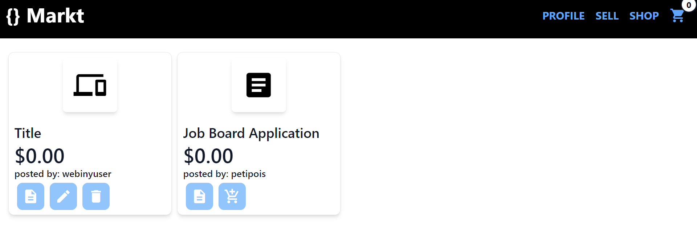

## The Shopping Cart

The `Cart.vue` file will keep track of all the items we add to our cart from the products page. We will get all the information from our `cart.js` Pinia Store.

```html
<!-- views/Cart.vue  -->
<template>
    <div class="flex justify-between">
        <h3 class="p-2 text-3xl font-bold">Cart Total: {{store.cart.length}}</h3>
        <h3 class="p-2 text-3xl font-bold">{{store.total.toFixed(2)}}</h3>
    </div>
    <div v-for="item in store.cart" :key="item.id" class="p-2 shadow-md border-black border-2 m-2">
        <div class="flex justify-between">
            <div>
                <span class="material-icons text-5xl">{{item.category}}</span>
                <h2 class="font-bold">{{item.title}} - {{item.price}}</h2>
            </div>
            <button class="text-blue-400 p-2 rounded-sm" @click="store.savePurchases(item)">
              <span class="material-icons p-2 text-center">
                  money
              </span>    
            </button>
            <button class="text-blue-400 p-2 rounded-sm" @click="store.removeFromCart(item.id)">
              <span class="material-icons p-2 text-center">
                    remove_circle
                </span>
              </button>
        </div>
    </div>
</template>

<script setup>
import { useCartStore } from '../stores/cart';

const store = useCartStore();

</script>
```

Here's the finished cart:

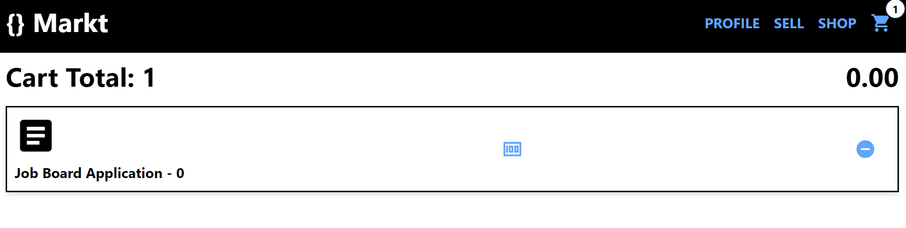


## Creating a Product

This is where we will add a new product to the Webiny CMS. As a standard practice we will test the mutation on the Webiny API Playground.

This is the GraphQL syntax we will use to create a new project:

```graphql
query {
  listCategories {
    data {
      id
      title
      iconName
    }
  }
}
```

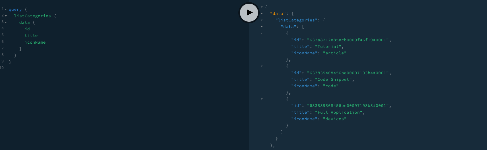

Webiny API Playground - query test and result

```graphql
mutation createProducts(
  $seller: String!
  $title: String!
  $desc: String!
  $price: Number!
  $category: String!
  $link: String!
) {
  createProducts(
    data: {
      title: $title
      desc: $desc
      price: $price
      productLink: $link
      seller: $seller
      category: $category
    }
  ) {
    data {
      title
      desc
      price
      productLink
      seller
      category
    }
  }
}
```

## Create.vue

```jsx
<script setup>
import { useMutation, useQuery } from '@vue/apollo-composable';
import { useUserStore } from "../stores/users";

import gql from 'graphql-tag';
import { reactive, ref } from 'vue';
import router from '../router';
const store = useUserStore();
const product = ref({
  title: 'Product Name',
  price: 0.00,
  desc: 'Lorem ipsum dolor sit amet consectetur adipisicing elit. Eum, dolore omnis deserunt unde sapiente quasi delectus magni? Placeat consequuntur veritatis nobis. Ad nobis iste repellat voluptatum quam eveniet libero ullam!',
  link: "hhtp://www.webiny.com"
})
const category = ref('article')
const categories = reactive([])
const GET_CATEGORIES = gql`
query {  
  listCategories
  {
    data{
      id
      title
    iconName   }
  }
}`

const { result, error } = useQuery(GET_CATEGORIES);
if (result) {
  categories.push(result)
} else {
  console.log("No Categoies")
}
const ADD_PRODUCT_MUTATION = gql`
mutation createProducts(
  $seller: String!
  $title: String!
  $desc: String!
  $price: Number!
  $category: String!
  $link: String!
) {
  createProducts(
    data: {
      title: $title
      desc: $desc
      price: $price
      productLink: $link
      seller: $seller
      category: $category
    }
  ) {
    data {
      title
      desc
      price
      productLink
      seller
      category
    }
  }
}

`
const { mutate: createProducts } = useMutation(ADD_PRODUCT_MUTATION, () => ({
  variables: {
    title: product.value.title,
    desc: product.value.desc,
    category: category.value,
    price: product.value.price,
    link: product.value.link,
    seller: store.user.username
  },
}))
function uploadProduct() {
  createProducts().then(() => {
    console.log(product.value)
    alert("You have successfully added a new product")
    router.push("/products")
  })
}

</script>

<template>
  <h2 class="text-3xl font-bold text-center uppercase">Sell</h2>
  <span class="material-icons text-5xl p-2 text-center">
    {{category}}
  </span>
  <form @submit.prevent="uploadProduct" class=" mx-auto p-2 w-full shadow-md">
    <input 
      type="text" 
      placeholder="Title" 
      v-model="product.title"
      class="bg-gray-50 border border-gray-300 text-gray-900 text-sm rounded-lg focus:ring-blue-500 focus:border-blue-500 block w-full p-2.5" 
    />
    <input 
      type="number" 
      placeholder="Price" 
      step="0.01" 
      v-model="product.price"
      class="bg-gray-50 border border-gray-300 text-gray-900 text-sm rounded-lg focus:ring-blue-500 focus:border-blue-500 block w-full p-2.5" 
    />
    <textarea 
      v-model="product.desc"
      placeholder="Description" 
      name="" 
      id="" 
      cols="5" 
      rows="5"
    />
      class="bg-gray-50 border border-gray-300 text-gray-900 text-sm rounded-lg focus:ring-blue-500 focus:border-blue-500 block w-full p-2.5"
    <select 
      name="" 
      id="" 
      v-model="category" 
      v-if="result"
      class="bg-gray-50 border border-gray-300 text-gray-900 text-sm rounded-lg focus:ring-blue-500 focus:border-blue-500 block w-full p-2.5"
    >
      <option :value="cat.iconName" v-for="cat in result.listCategories.data" :key="cat.id">
        {{cat.title}}
      </option>
    </select>
    <input 
      type="text" 
      placeholder="URL link to Product" 
      v-model="product.link"
      class="bg-gray-50 border border-gray-300 text-gray-900 text-sm rounded-lg focus:ring-blue-500 focus:border-blue-500 block w-full p-2.5" 
    />
    <button 
      type="submit"
      class="text-white bg-blue-400 hover:bg-black font-medium rounded-lg text-sm  sm:w-auto px-5 py-2.5 text-center w-full">
        <span class="material-icons">upload</span></button>
  </form>
</template>

```

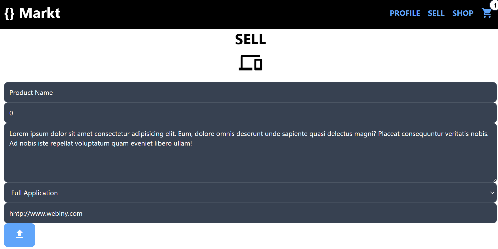

## Managing Products

The application is created so that only the seller who uploaded the product can manage it. If they did not then the can only purchase the item. The following code is already inside the **products.js** and the **Products.vue** file, however I wanted to explicitly extract the functions here.

## Delete Product

In order to delete a product from the CMS we need the products id as shown below:

```graphql
  const DELETE_PRODUCT = gql`
    mutation ($id: ID!) {
      deleteProducts(revision: $id) {
        data
      }
    }
  `;

  const { mutate: deleteProduct } = useMutation(DELETE_PRODUCT, (product) => ({
    variables: {
      id: product,
    },
  }));
```

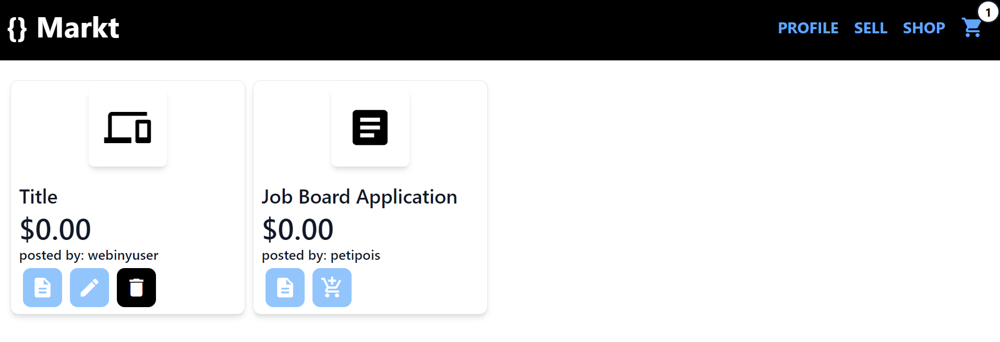

shop page with the ability to manage a product.

## Update Product

The application only allows the seller to update the *title*, *description* and the *price*. So in our GraphQL mutation we will only capture those and mutate them.

```graphql
 mutation updateProduct(
      $id: ID!
      $title: String!
      $desc: String!
      $price: Number!
    ) {
      updateProducts(
        revision: $id
        data: { title: $title, desc: $desc, price: $price }
      ) {
        data {
          title
          desc
          price
        }
      }
    }
```

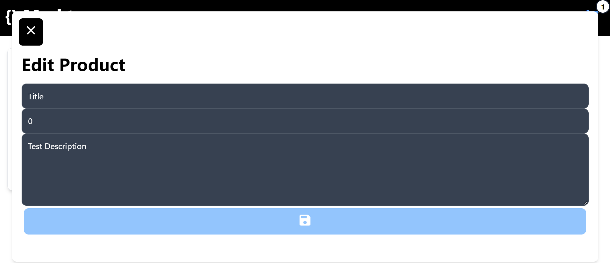

updating a product

In the terminal run this code:

```bash
npm run dev
```

## Conclusion

We have successfully created a Marketplace Application where a user can **Login**, **Manage** and **Purchase p**roducts. We learned how to integrate the **Webiny CMS** into our Vue.js Application using **Vue Apollo** along with the state management library **Pinia**.  

Full source code - [https://github.com/petipois/webiny-marketplace-app](https://github.com/petipois/webiny-marketplace-app)

[GitHub - petipois/webiny-marketplace-app: Webiny Marketplace Application for Tech Article](https://github.com/petipois/webiny-marketplace-app)