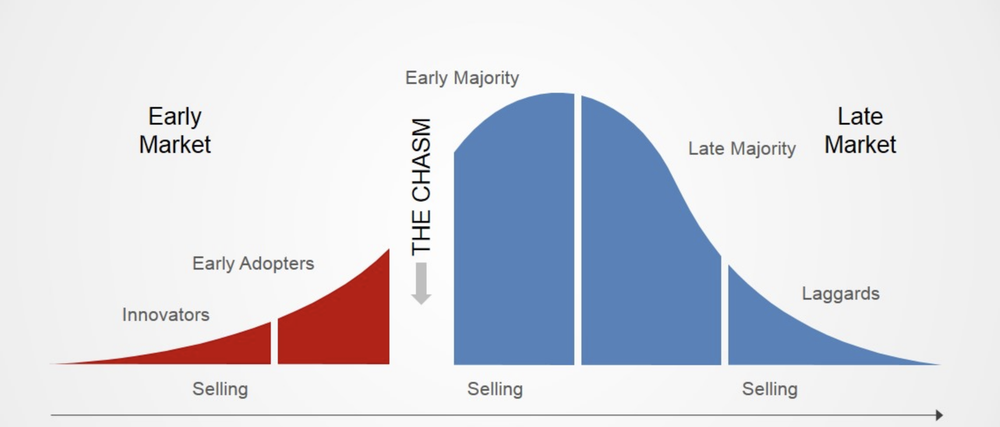
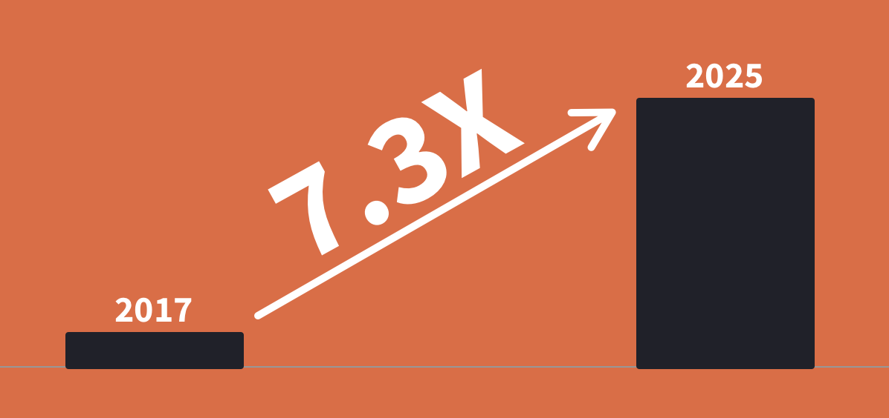

In 1991 [Geoffrey A. Moore](https://en.wikipedia.org/wiki/Geoffrey_Moore) wrote a book called [Crossing the Chasm](https://www.amazon.com/Crossing-Chasm-Marketing-High-Tech-Mainstream/dp/0060517123). It’s a book about how to market and sell tech products to customers. Regardless of the fact, the book was written almost 30 years ago, it’s still true to the letter today.

The main premise of the book is around this simple graph:

The image illustrates 5 different market segments, or personas, to which we are marketing and selling our product. We start with innovators and early adopters and move into the more mature phase where we are talking to late majority and laggards.

Between each of the segments, there is a chasm. Chasm is what our product needs to bridge for in order to gain trust and access to the next segment in line. It’s all about crossing the gap. Products which don’t succeed in doing it, they fail.

## We are at the start line

#### The position of the serverless market today.

Looking at the serverless market today, I would say we are still in the innovators' segment. This is good from the market growth perspective — it means the market will grow several folds if successful. This is also bad because there are many chasms up ahead which serverless needs to cross.

There are several reasons why I believe we are in this market segment.

### Market growth

Just 3 years ago the serverless market cap was ~$3bn and early market research shows the market cap in 2025 will be ~$22bn. There is also no indication the market growth will slow down afterwards.

Other research estimates the overall cloud computing market will be worth around ~$285bn by 2025 ([source](https://www.prnewswire.com/news-releases/cloud-computing-market-share-is-estimated-to-reach-us-285-3-billion-by-the-end-of-2025--with-a-cagr-of-29-2---valuates-reports-300946299.html)), meaning the serverless market, which is a subsegment of the cloud market, will only make ~7.7% of the total cloud market.

If serverless is truly the future of development, as Werner Vogels the CTO of Amazon said, then serverless has a long way to go to get there. It will probably take another 20 years, if not more.

### Current users

There are enterprises which run on serverless today, but in most cases, it’s only a part of their infrastructure which is serverless. Also if you google around the internet on serverless case studies you’ll find the same 10 or 20 examples over and over again — this is Netflix, CocaCola and a handful of others.

What I’m saying is there are examples of enterprise users, but not a lot considering the scale of how many enterprises are in the cloud today.

### Community

The serverless community is a great vibrant place with a lot of exciting people to meet. People are friendly and ready to help each other out. It’s a stable and healthy foundation which will keep growing and I’m super excited about it.

People like [Jeremy Daly](https://twitter.com/jeremy_daly), [Yan Cui](https://twitter.com/theburningmonk), [Danilo Poccia](https://twitter.com/danilop), [Gojko Adzic](https://twitter.com/gojkoadzic) and many others are moving the community forward, by creating great content, newsletters and more. Conference organizers — such as [ServerlessDays](https://serverlessdays.io/) give the opportunity for newcomers, as well as experts, to network and learn more about serverless as well as support their local serverless meetups.

However, this is still all small scale compared to some tech communities like the JavaScript or Wordpress communities. There is still a long way for the serverless community to grow to reach such a scale, and I can’t wait for it to get there.

## Serverless Chasms

#### What does serverless need to do to mature and to cross the first few chasms?

### Know-how

The serverless market is quite low on know-how, tutorials and articles in general, from which developers can learn how to build stuff. Yes, there are many articles teaching you how to deploy a hello world application to an AWS Lambda, but it’s quite scarce when it comes to more advanced examples.

There is also a lack of proven approaches, architectures and best practices. It still feels like a trial and error approach in many cases.

The recently launched [Amazon Builders’ Library](https://aws.amazon.com/builders-library/) has great potential in helping the community by providing examples of how teams internally at Amazon are tackling some of those design decisions. I’m hoping to see many more great articles published there.

### Developer tools and libraries

Today we have great tools to deploy serverless applications, such as [Serverless Framework](https://serverless.com/), and tools for monitoring them, such as [Lumigo](https://lumigo.io/) and [Thundra](https://www.thundra.io/).

Those are all in essence, low-level tools. There is still a big gap when it comes to offerings which help you build solutions using serverless technologies. Compare the non-serverless market and the solutions there. You have platforms like [Wordpress](https://wordpress.org/), [Drupal](https://www.drupal.org/), [Magento](https://magento.com/), [Odoo](https://www.odoo.com/) and many others.

There are only early indications of such solutions in the serverless market. One of the first ones in this field is [Webiny Serverless CMS](https://www.webiny.com/).

As we close this particular chasm, it will become much easier for the rest of the market to start adopting serverless solutions.

### Funding

Funding is really important for any market. It fuels market development, as well as the creation of new offerings and solutions, which in return attract more customers and increase the market cap.

The serverless market is on the radar for many different investment funds, however, those funds are still observing this market from a distance. A few investments ([source](https://techcrunch.com/2020/01/16/epsagon-scores-16m-series-a-to-monitor-modern-development-environments/), [source](https://techcrunch.com/2020/01/22/triggermesh/), [source](https://techcrunch.com/2020/01/22/thundra-nabs-4m-series-a-to-secure-and-troubleshoot-serverless-workloads/?utm_source=home&amp;utm_medium=topbar&amp;utm_campaign=Series%20A%20Funding), [source](https://techcrunch.com/2019/10/29/webiny-announces-347k-seed-to-build-open-source-serverless-cms/)) are signalling market potential to the wider investment groups.

Many of these startups are pre-revenue and they need this funding to survive and to develop their solutions. In a way, you could say that the development of tools and libraries is heavily reliant on market funding.

If we all want to see this market grow well beyond the $22bn cap in 2025, there’ll have to be more investments in this space.

It’s not often such big market changes happen. Using serverless a single developer can create a super scalable application, that previously required a team of 5 or more infrastructure, devops and other types of engineers.

As a general conclusion, I want to leave you with a though. If you like the direction in which serverless is going, think about how you can help the maker and the community. Be that a blog post, a useful library, or even a simple tweet to raise awareness and help people find about it. Let’s close the chasms together!