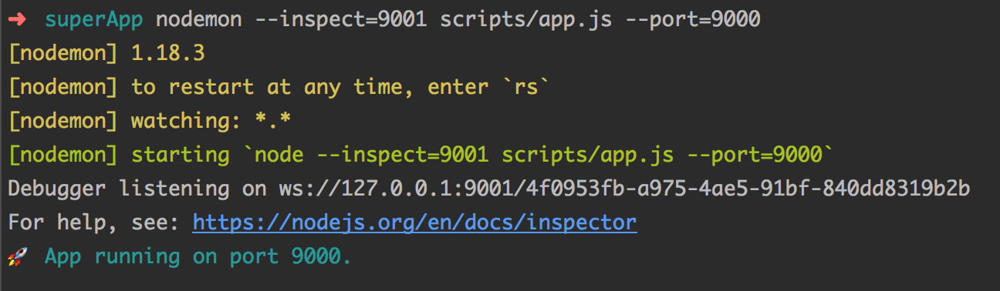
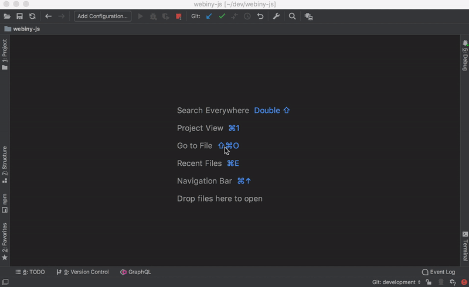
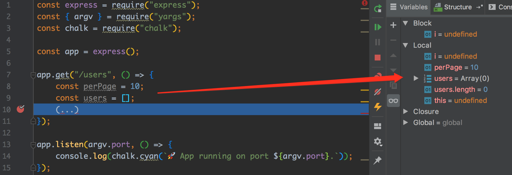

As developers, finding and resolving bugs within our applications is something we do every day. That's why it is important that we have our development environment and tools ready for the task.

At one point in time, as developers who also live in the JavaScript / Node.js world, I'm sure we've all used the famous "`console.log` driven development" (a.k.a. CLDD) methodology in order to debug our app 😉. And while in certain cases this can still be a quick way to perform code inspection, in general, it is a very slow and painful approach to determine what's wrong with our code. A much better alternative is to use the Node.js debugger, which is a tool I basically can't live without these days.

(To learn more about the Node.js's debugger, check out the [official documentation](https://nodejs.org/api/debugger.html)).

The other day, I wanted to debug a locally running Node.js / Express powered API endpoint, using my favorite IDE  -  [WebStorm](https://www.jetbrains.com/webstorm/). And although the process to set it up ultimately wasn't too complicated, at the time of writing this article, I still couldn't find an easy step-by-step guide on how to do it. So, in this short article, we'll see how to set this up in just two simple steps.

Let's go!

## 1. Start the server

The first step is to start your Node.js server, but with the special `--inspect` switch. If you were wondering what exactly it does, there is a good and short explanation over at the [official docs](https://nodejs.org/en/docs/guides/debugging-getting-started/): _"When started with the `--inspect` switch, a Node.js process listens for a debugging client. By default, it will listen at host and port 127.0.0.1:9229. Each process is also assigned a unique UUID_".

Doesn't sound too complicated, right?

Note that you don't have to use the default `9229` port. In the following command, I'm using port `9001`:

```bash
nodemon scripts/app.js --port=9000 --inspect=9001
```

So, 9001 is the port on which the Node.js process will listen for the debugging client (in my case - Webstorm IDE's client). The port `9000` will be used by my Express app.

Note that the `--port=9000` argument is handled in my application code, and it's here because you usually want to give developers the ability to change the port on which the application will be running on their local machine. The following is the code that makes this possible:

```javascript
const express = require("express");

// https://www.npmjs.com/package/yargs
const { argv } = require("yargs");

// https://www.npmjs.com/package/chalk
const chalk = require("chalk");

const app = express();

(...)

app.listen(argv.port, () => {
    console.log(chalk.cyan(`🚀 App running on port ${argv.port}.`));
});
```

Now, if you were to run the above command, you should receive the following output:



Notice the message **Debugger listening on ws://127.0.0.1:9001/...**. If you see this, then we're ready for the next step! 

(💡 Quick tip: for easier local Node.js backend application development, make sure you utilize the [`nodemon`](https://www.npmjs.com/package/nodemon) library.

## 2. Webstorm

Now, on the WebStorm side, we need to add a new **Run/Debug** configuration. More specifically, a new **Attach to Node.js/Chrome** configuration. The following video shows how to do it:



Make sure that, when filling in the **Port** field, you use the one on which the Node.js process is listening for the debugger client, in our case 9001.

Also, note that once you've created the **Run/Debug** configuration, you click on the green "bug" icon. Don't forget to do that because this is what actually makes the Webstorm IDE's debugging client / Node.js connection.

Alright, now it's just a matter of placing breakpoints in the code and that's it! 

## Try it out

Go and place a breakpoint in your code. You do that by clicking right by the line number, after which you should see a red dot, indicating that a breakpoint has been set.

Now, try to issue an HTTP request to your Express app. If you've done everything correctly, your code execution should pause at the first breakpoint and you should see all of the variables and their values in the **Debug Tool Window**:



And that's it! Use **F7 (Step Into)**, **F8 (Step Over)**, and **F9 (Run to next breakpoint)** keys to quickly navigate over your code and find what you're looking for faster.

## Conclusion

As I've mentioned, the setup process isn't too complicated, but still, in my initial research, I couldn't find a clean and simple step-by-step guide on how to do it properly.

Despite the fact that, when it comes to running JavaScript code,  these days I'm more interested in serverless technologies (like [AWS Lambda](https://aws.amazon.com/lambda/)), I still sometimes like to use the good old Express for creating small prototypes or proof of concepts. I find that for these cases, it is still a good tool to have around.

I hope you've managed to follow along and that you've succeeded in setting up your debugging environment. If you have any questions or suggestions, feel free to let me know! 🙂

---

Thanks for reading! My name is Adrian and I work as a full stack developer at [Webiny](https://www.webiny.com/). In my spare time, I like to write about my experiences with some of the modern frontend and backend web development tools, hoping it might help other developers. If you have any questions, comments or just wanna say hi, feel free to reach out to me via [Twitter](https://twitter.com/adrians5j).