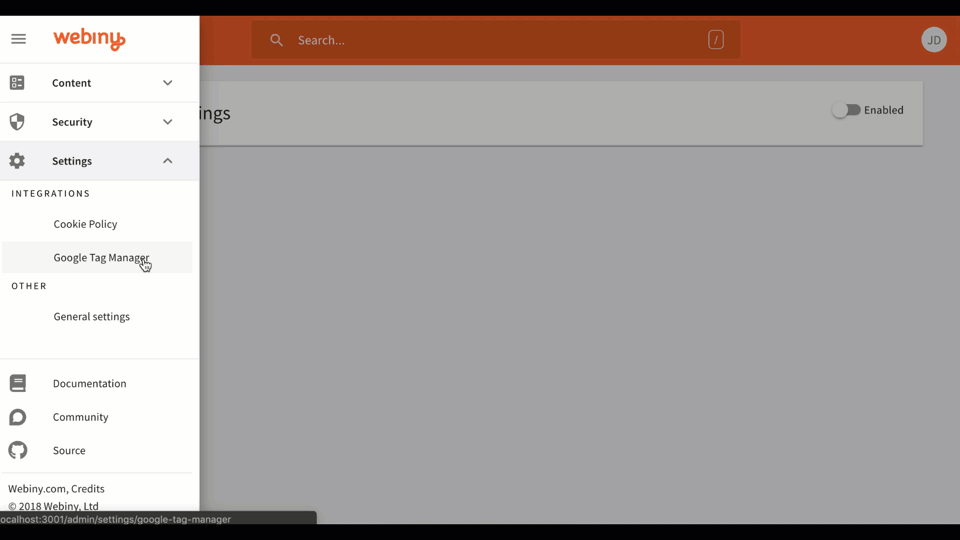

I’d like to take the opportunity to show the progress we’ve made with our project. The number 1,000 doesn’t really mean anything, but it does prove our commitment to it. We’ve been continuously working and adding features for the past 10 months and below are some of the highlights for this dev diary update.

### Several new components

We’ve added numerous new components to the page editor. Some of the components are YouTube embed, Vimeo, Twitter, Instagram and several others. Here’s a quick preview:

### Say hello to icons

Icons are a crucial element of most websites; hence, we’ve embedded the entire [FontAwesome](http://fontawesome.com/) library directly into the editor. You can search for icons, adjust their sizes and color as well as embed icons directly into buttons.

### Integrations

This is just a fancy word for plugins. :) Integrations at Webiny are sets of plugins of different types that work together to add new functionality to the system. Usually an integration contains several plugins for the API, UI, maybe a new CMS element, etc.

Since integrations consist of simple plugins, they allow developers to hook into any part of the Webiny system, making them a very powerful and flexible way of building new features for your system.

Here is a demo of two integrations that we’ve already built. One is the Google Tag Manager, which adds the GTM javascript code to your website automatically, while the second one is a cookie policy integration that displays a notification to your visitors that they need to accept your cookie policy in order to browse your website. There will be a few more integrations we plan to create before our official launch — stay tuned.

### Project Status Update

The end is near. :) Just a few last polishes on the CMS editor and the integrations and we’re done with the Webiny Content Management System modules. 🍾🎉

Next up is the work on Webiny Cloud — the hosting platform. Good news is that we have already scratched the surface on the deployment mechanisms and the server side render option, which we will offer as part of the platform. The design of the management platform as well as the architecture are already done.

There is an interesting story behind the architecture — we essentially had to design our own proxy and API gateway since the existing offering for managing serverless applications is quite limited. We’ll leave the details for another time.

Stay tuned for the next update.
