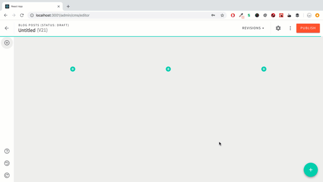
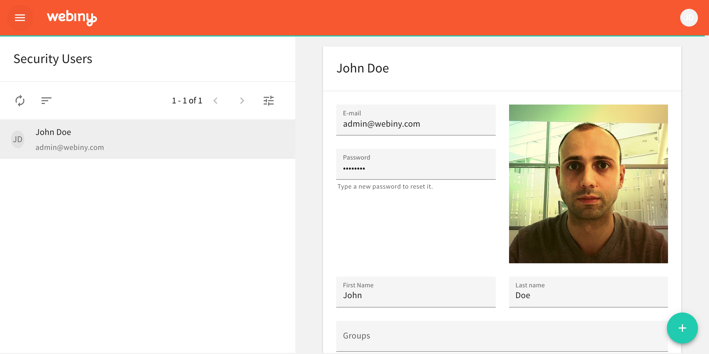

Read all about it, here are the latest developments in an episode called — **Webiny, the serverless CMS.**

### Visual Page Builder

Initially we called it a “Page Editor”, but considering the amount of things you can do with it, it’s much more than just a page editor. So now we call it a “Visual Page Builder”.

Since the last update, we’ve completely refined the UI, made it simpler and more intuitive to use and added some code optimizations under the hood so it runs buttery smooth.

Building pages is now a fun experience that you’ll enjoy and want to come back, making you create more content which is more engaging and appealing to your visitors.

And if you are a developer, you will be pleased to hear that everything you see in the editor is a **plugin**. New features can be added, everything that is already in can be modified, replaced or removed completely. Before we finally publish the editor we will add documentation for every type of plugin and add Flow types for each one of them to make developing new plugins much smoother.

### Page Theme

Building page themes can be rather daunting and painful experience. Knowing which internal functions you need to call and include in which places, how all pieces are glued together, and going through frustrating experience of why things are not working as expected can put anyone off. For us, building a modern CMS means we can change and improve on existing things.

This train of thought lead us to design a new type of theme. One that is very simple to create, even when doing it for the first time.

A theme in Webiny is nothing more than a simple JS file and a set of (S)CSS files. No need to write any code or logic to make a theme (you CAN if you need to do advanced things, but you don’t have to). It’s simple, but the end result in combination with the Visual Page Builder is quite amazing and you’ll ask yourself, why didn’t this exist before?

Also, one cool thing that the theme enables us to do is creating variants of certain elements. For example, a button can have multiple variants, and you define them via the theme file. The variants then show up as advanced options for that element in the Visual Page Builder. Here is the button example:

### **Image Editor**

Images are a crucial part of any website. Upon launch we will have a full featured image editor where you’ll be able to crop and resize on your screen, as well as apply certain filters. One of the options that we’ll probably keep for the next release is an image manager, basically the option to browse and organize your images like a library.

### Users, Roles, Groups and Tokens

Security in Webiny is quite powerful but simple at the same time. **Scopes** are the core of the security layer. They define which GraphQL fields a user can access. Available Scopes are defined in API datasources and become available in the Security interface where you create Roles. Once you create a Role, you can assign it to a Token, a Group, or a User.

**Token** is basically an API key you can give to a 3rd party to access your system. It’s access scopes are controlled by the Roles/Groups assigned to it.

**Group** is nothing more than a preset of one or more Roles making it easier to organize scopes once your system begins to grow and more and more apps add their own scopes.

**User** is just a standard user in your system. Groups and Roles are attached to the User to control his access scopes.

### Project Status Update

Finally, I just want to give you an overall view of the project status. On almost all fronts we are making steady progress and we expect to close off all the milestones in the next few weeks, when the CMS will be complete and ready for production testing.

Our progress is also available on our GitHub, under projects, where you can see all active tasks.

[https://github.com/webiny/webiny-js](https://github.com/Webiny/webiny-js)

After the CMS testing is done, we will start working on our Cloud Platform, where you will be able to host your Webiny website in a serverless environment for free, but there will also be certain paid options available, depending on your needs.

That’s all folks — until the next update.