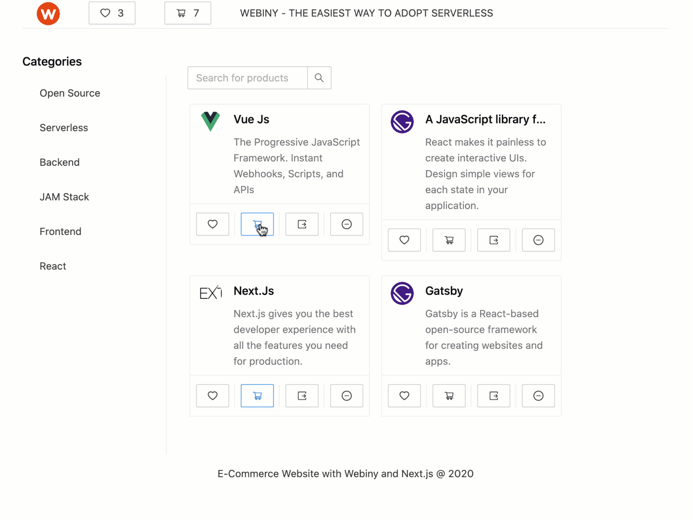

In this starter tutorial we will uses the <ExternalLink href="http://docs.webiny.com/docs/webiny-apps/headless-cms/features/content-modeling?utm_source=Webiny-blog&utm_medium=webiny-headless-cms-features-docs&utm_campaign=webiny-blog-e-commerce-tutorial-oct-19&utm_content=webiny-headless-cms-features-docs&utm_term=W00180">Webiny Headless CMS</ExternalLink> and <ExternalLink href=""> Next.js </ExternalLink>
to create a simple e-commerce website, where you can buy Swag from Open Source Projects such as Webiny, Next.js, Gatsby, etc, with an integrated
shopping cart by <ExternalLink href="https://checkout.stripe.dev/preview">Stripe Payment Intents</ExternalLink>.

While working on this starter, I shared my progress on Twitter and <ExternalLink href="https://twitter.com/joshuaackerman">Josh</ExternalLink> from Stripe <ExternalLink href="https://twitter.com/joshuaackerman/status/1305857426059653122?s=20">reached out</ExternalLink> for being available for any feedback regarding improvements, developer experience and documentation,
thank you Josh!

Without further ado let's get started.



TLDR; <ExternalLink href="http://www.github.com/webiny/webiny-examples">Get the code here</ExternalLink>

## Main Features

In this tutorial, we will go through the main functionalities of the e-commerce starter
project with Webiny + Next.js + Stripe. You will learn how to create a Webiny Headless CMS
back-end project and your content models, how to set up the front-end with Next.js and Ant Design
UI framework, how to set up Next.js with Apollo GraphQL to query the content models data into the
front-end, and how to integrate Next.js with Stripe Checkout to add the payment service.

TLDR; <ExternalLink href="http://www.github.com/webiny/webiny-examples">Get the code here</ExternalLink>.

> For the sake of the time saving, we will link here the project GitHub links, for you to go through
> the Next.js `pages` and `components` you will create, so we can focus more on the main features
> such as:
>
> - Webiny Headless CMS for the back-end project
> - Next.js + Ant Design React UI Library to create the front-end project
> - Next.js + Apollo GraphQL to query the content model data
> - Next.js + Stripe to create the payment intents

## 1. Webiny Headless CMS for the back-end

Webiny provides several serverless websites such as the Headless CMS, Page Builder,
Form Builder and File Manager. In this starter we are going to use the Headless CMS only.

> To create a Webiny Headless CMS project, run the following command:
>
> ```powershell
> yarn create-webiny-project backend --template=cms
> ```
>
> And continue with the <ExternalLink href="http://docs.webiny.com/docs/get-started/quick-start?utm_source=Webiny-blog&utm_medium=webiny-h3-tutorial&utm_campaign=webiny-blog-e-commerce-tutorial-oct-19&utm_content=webiny-quick-start-guide&utm_term=W00214">Webiny quick start</ExternalLink> steps to set up the Webiny project.

Now, let's go and create the content models we need for the e-commerce project.

We are going to create two content models, the `products` and `category`

- Products
  - 6 Created Products
- Category
  - 3 Created Categories

> If you are new to <ExternalLink href="https://www.webiny.com/serverless-app/headless-cms?utm_source=Webiny-blog&utm_medium=webiny-website-headless-cms&utm_campaign=webiny-blog-e-commerce-oct-19&utm_content=webiny-blog-e-commerce-nextjs&utm_term=W00177">Webiny Headless CMS</ExternalLink>,
> learn more about its features <ExternalLink href="http://docs.webiny.com/docs/webiny-apps/headless-cms/features/content-modeling?utm_source=Webiny-blog&utm_medium=webiny-headless-cms-features-docs&utm_campaign=webiny-blog-e-commerce-tutorial-oct-19&utm_content=webiny-headless-cms-features-docs&utm_term=W00180">here</ExternalLink>. 🚀

Let's go through the images below and create the content models for products and categories.

The `Products` content model.


The `Products` content model, will contain the fields as shown in the image:

- Title - `Text`
- Image - `Files`
- Price - `Number`
- Description - `Long text`
- Permalink - `Text`, and
- Category - `Reference(multiple values)`.

When adding a `Reference field`, you can toggle the `Use as a list of references` switch in field settings, to do a multi-select. In this case, a product can have multiple categories.


The `Category` content model.


The `Category` content model will contain the fields such as:

- Title - `Text(entry title)`
- Products - `Reference(multiple values)`

We toggle the `Use as a list of references` for the category can have multiple Products.

## 2. Next.js + Ant Design to create the frontend

When building a website, you have to decide how you are going to build your frontend, what library are you going to use? Do you need to build it from scratch?
Which UI framework is the fastest to set up and learn how to use? etc.
If you are in a hurry for your project idea, well, there are a numerous of UI frameworks 🚀

We decided to build the front-end using <ExternalLink href="https://nextjs.org/">Next.js</ExternalLink> React framework with the <ExternalLink href="https://ant.design/components/overview/">Ant Design</ExternalLink> React UI library.

> <ExternalLink href="https://nextjs.org/">
>   Next.js
> </ExternalLink> is a React Framework, that gives you the best developer experience with all the features you need for production: hybrid static & server rendering ⚡, Typescript support, smart bundling, route pre-fetching, and more.

> <ExternalLink href="https://ant.design/components/overview/">
>   Ant Design{" "}
> </ExternalLink> React UI library provides plenty of UI components to enrich your web applications.

Now, that we picked the tools, let's start building a simple e-commerce website 🚀

### Next.js + Ant Design Set Up

Next.js provides plenty of examples on their <ExternalLink href="https://github.com/vercel/next.js/tree/canary/examples"> GitHub repo</ExternalLink>.
They provide an Ant Design UI library example too, depending on your requirements, you can choose between the `with-ant-design-less`, `with-ant-design-pro-layout-less`, and `with-ant-design`.
We will use the <ExternalLink href="https://github.com/vercel/next.js/tree/canary/examples/with-ant-design-less">`with-ant-design-less`</ExternalLink>.

Create the `webiny-starter-e-commerce-nextjs-stripe` folder, and inside this folder create a `next.js` project with
`npx create-next-app frontend` command . By following the example of `next.js` with ant design less, we need to add these 3 files to our `next.js` project:

- `next-config.js`

`gist:AlbionaHoti/9f019ba783ac516b4c25cc6d58638946`

- `.babelrc`

`gist:AlbionaHoti/b9069135eb3810a2b8c5e6a46737d3e6`

- `/assets/antd-custom.less`

`gist:AlbionaHoti/463e4769b881cb732e9362f95d656933`

Now we are good to continue building our pages and components 🙂

### Next.js Pages

> In Next.js, a page is a React Component exported from a .js, .jsx, .ts, or .tsx file in the pages directory. Each page is associated with a route based on its file name. Example: If you create `pages/about.js` that exports a React component, it will be accessible at `/about`.

We will create pages such as `Home`, `Checkout`, and **?**`Product` pages. The `Checkout` page is one of the most important pages, we will learn why shortly!

- <ExternalLink href="">Home page</ExternalLink>


The home page will look as in the image above. To build the home page, we used different Ant Design components, such as `Grid`, `Menu`, `Header`, etc.

- <ExternalLink href="">Checkout page</ExternalLink>


We mentioned that the `checkout` page is one of the most important ones, because here we will use the Next.js `getServerSideProps` lifecycle method, to perform server side only behavior. With this lifecycle method, we don't need to create an API to handle the intent creation (for the Stripe integration). We will handle it directly inside our checkout page.

- **?**<ExternalLink href="">Product page</ExternalLink> - `hacktoberfest` issue

This year Webiny is participating in the <ExternalLink href="https://www.webiny.com/blog/webiny-hacktoberfest-2020?utm_source=Webiny-blog&utm_medium=webiny-hacktoberfest-blog&utm_campaign=webiny-blog-e-commerce-tutorial-oct-19&utm_content=webiny-hacktoberfest-2020&utm_term=W00181">Hacktoberfest challenge</ExternalLink>.
For now, the e-commerce starter project doesn't have a `product` page. This is an open issue and if you are interested to contribute to the project,
check out the issue <ExternalLink href="http://www.github.com/webiny">here</ExternalLink>.

### ANTD Components

The <ExternalLink href="">antd</ExternalLink> provides plenty of UI components to enrich your web applications, for this project we will use several Ant design react components, such as: `Grid`, `Menu`, `Layout`, `List`, `Cart`, `Modal`, etc.

- <ExternalLink href="">Product Card</ExternalLink>

The card as shown below


- <ExternalLink href="">Product List</ExternalLink>


- <ExternalLink href="">Layout Component</ExternalLink>

- <ExternalLink href="">Header Component</ExternalLink>


- <ExternalLink href="">Categories Component</ExternalLink> - Menu


- <ExternalLink href="">Products Cart</ExternalLink>


- <ExternalLink href="">Search products</ExternalLink>


- **?**Filter products by Category
  - <ExternalLink href="">hacktoberfest issue</ExternalLink>


## 3. Next.js + Apollo GraphQL to fetch data from the backend

We created the back-end project with Webiny Headless CMS, in case you didn't go through our features page, let's have a quick look at the powerful features of [Webiny Headless CMS](https://www.webiny.com/serverless-app/headless-cms) 🙂

- <ExternalLink href="https://docs.webiny.com/docs/webiny-apps/headless-cms/features/content-modeling/?utm_source=Webiny-blog&utm_medium=webiny-headless-cms-content-modeling&utm_campaign=webiny-blog-e-commerce-tutorial-oct-19&utm_content=webiny-headless-cms-content-modeling&utm_term=W00182">
    Content Modeling
  </ExternalLink>
- <ExternalLink href="https://docs.webiny.com/docs/webiny-apps/headless-cms/features/localization?utm_source=Webiny-blog&utm_medium=webiny-headless-cms-content-modeling&utm_campaign=webiny-blog-e-commerce-tutorial-oct-19&utm_content=webiny-headless-cms-content-localization&utm_term=W00183">
    Content Localization{" "}
  </ExternalLink>
- <ExternalLink href="https://docs.webiny.com/docs/webiny-apps/headless-cms/features/graphql-playground?utm_source=Webiny-blog&utm_medium=webiny-headless-cms-graphql-api&utm_campaign=webiny-blog-e-commerce-tutorial-oct-19&utm_content=webiny-headless-cms-graphql-api&utm_term=W00184">
    GraphQL API + Playground
  </ExternalLink> - Both our management and our distribution API are powered by GraphQL. On top of that, Webiny exposes a GraphQL Playground you can use to easily test and debug your API calls.
- <ExternalLink href="https://docs.webiny.com/docs/webiny-apps/file-manager/getting-started/?utm_source=Webiny-blog&utm_medium=webiny-headless-cms-file-manager&utm_campaign=webiny-blog-e-commerce-tutorial-oct-19&utm_content=webiny-headless-cms-file-manager&utm_term=W00189">
    Asset Management
  </ExternalLink>
- <ExternalLink href="https://docs.webiny.com/docs/webiny-apps/headless-cms/features/environments?utm_source=Webiny-blog&utm_medium=webiny-headless-cms-environments&utm_campaign=webiny-blog-e-commerce-tutorial-oct-19&utm_content=webiny-headless-cms-environments&utm_term=W00185">
    Environments
  </ExternalLink> Creating a new environment copies all the data and all the models from the current environment. This allows you to make changes and prepare new content in the background, while still serving production content without interruption.
- <ExternalLink href="https://docs.webiny.com/docs/webiny-apps/headless-cms/features/aliases?utm_source=Webiny-blog&utm_medium=webiny-headless-cms-aliases&utm_campaign=webiny-blog-e-commerce-tutorial-oct-19&utm_content=webiny-headless-cms-aliases&utm_term=W00186">
    Aliases
  </ExternalLink>
- <ExternalLink href="https://docs.webiny.com/docs/webiny-apps/headless-cms/features/access-tokens?utm_source=Webiny-blog&utm_medium=webiny-headless-cms-access-tokens&utm_campaign=webiny-blog-e-commerce-tutorial-oct-19&utm_content=webiny-headless-cms-access-tokens&utm_term=W00187">
    Access Tokens
  </ExternalLink> - The authentication and permissions are part of the Webiny core package and they also pass on to the Headless CMS. Create users, user groups, roles and permissions to control who and how they access the system.
- <ExternalLink href="https://docs.webiny.com/docs/webiny-apps/headless-cms/features/content-modeling-groups?utm_source=Webiny-blog&utm_medium=webiny-headless-cms-content-modeling-groups&utm_campaign=webiny-blog-e-commerce-tutorial-oct-19&utm_content=webiny-headless-cms-content-modeling&utm_term=W00188">
    Content Model Groups
  </ExternalLink>
- Device & Frontend Agnostic

We mentioned earlier that Next.js provides plenty of examples 🎉 Well, they provide an example of Next.js with Apollo too! Our goal is to fetch the `products`, and `categories` in the front-end from our headless cms back-end project. To do that, we will set up Next.js with Apollo GraphQL.

In the root of your project, create a folder/file - `lib/apolloClient.js`, and paste the below snippet in it:

`gist:AlbionaHoti/54c3a3186606e4f21905d1a10b26e078

Now, let's integrate the `apolloClient` to our Next.js app, find the `_app.js` file in the `pages` folder, and paste the below code:

`gist:AlbionaHoti/d8d1c489eb027bb11a62d5037b82db34`

As a last step for this integration, we will now use the `getStaticProps` lifecycle method of Next.js to pre-render the page at build time and return the props with data from our GraphQL API.

Now go at the `pages/index.js` file, and paste the below snippet:

:gist:AlbionaHoti/6bb59c708db0556cf2b2c4cff756975a`

Now that we have access to our content models and the data, we can render our products and categories on the home page.

## 4. Next.js + Stripe to create the payment intents

In this starter we will use the <ExternalLink href="https://stripe.com/docs/payments/payment-intents">Stripe </ExternalLink> Payment intents API with Next.js and follow best practices as set out by Stripe and the industry.

To set up the Next.js project using Stripe, we have to create a <ExternalLink href="https://stripe.com/">Stripe account</ExternalLink>, and get the `Secret key`, and the `Publishable key` from <ExternalLink href="https://dashboard.stripe.com/test/apikeys">Stripe Developer API Keys Dashboard</ExternalLink>.

Again, follow up the project here, to get all the necessary code files for the project, we will focus only on the main parts of setting up the Stripe with Next.js.

### Server and Client Side

As mentioned early that on the `checkout` page we will use the `getServerSideProps` life cycle method of Next.js, where we will create the Payment intent.

Create the `checkout.js` file in the `pages` folder, and paste the following snippet:

`gist:AlbionaHoti/a2355927e3a79f2db0bd6c78c47a929d`

Let's go through the code and explain what are we doing here.

For the server side, in the `getServerSideProps` life cycle method we are storing a cookie where we check, if a payment intent was created or not, and for that we are using the `nookies` library. Make sure to update the `STRIPE_SECRET_KEY_HERE`, and the `STRIPE_PUBLISHABLE_KEY_HER`with your keys.

Now, from the client side, we are using the client side Stripe libraries: `@stripe/stripe-js` and `@stripe/react-stripe-js` to create a secure `paymentMethod` which contains our card information that is passed onto Stripe.

We created `stripePromise` to pass the `Elements` provider, and with the `stripePromise` and the `Elements` provider we are going to wrap the `CheckoutForm` component where we pass the `paymentIntent` from props to CheckoutForm.

### Checkout Form

Regarding the `CheckoutForm` component, create a file in the `components/CheckoutForm.js` and paste the following snippet:

`gist:AlbionaHoti/e4b6d3c0c8b283c397245559c0edb63b`

Let's go through the code and understand what are we doing here. `@stripe/react-stripe-js` exposes hooks and components that we can use, such as:

- `CardElement`
- `useStripe`
- `useElements`

The two stripe hooks, we will be using inside the `handleSubmit` function to have a reference to `stripe` and `elements`.

Now, regarding the stripe intent confirmation, Stripe provides the `confirmCardPayment` which accepts 3 arguments: the `client_secret`, and the optional `data`, and `options`.

From the props of `paymentIntent`, we have access to the `client_secret`, and on line 94, we update the handleSubmit function to send a request to Stripe to confirm the Payment intent.

The other important bits, are the `request` to `/api/payment_intents` and the `CardElement` where Stripe provides a fully secure and baked credit card input with expiry, CVV and zip/post code. For the `/api/payment_intents` we update the payment intent with the newly cart amount from the React context as shown at the line `82`.

Paste the following snippet in your `api/payment_intents.js` file:

`gist:AlbionaHoti/f3a8fb683ca6f0adbae83361a77db6e0`

# Conclusion


