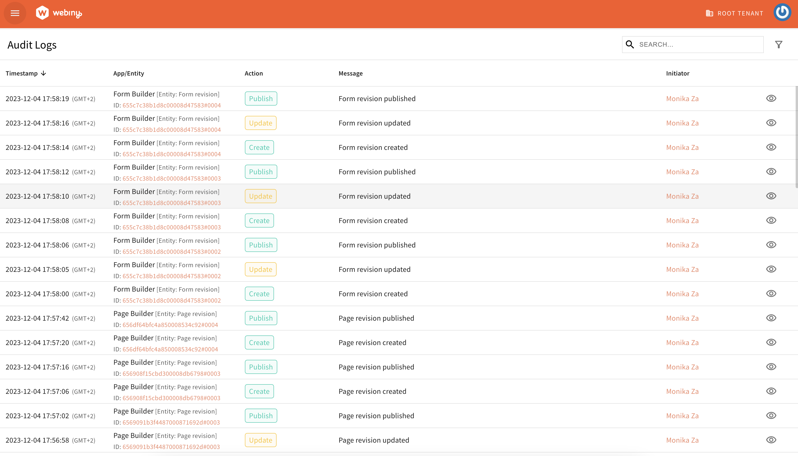
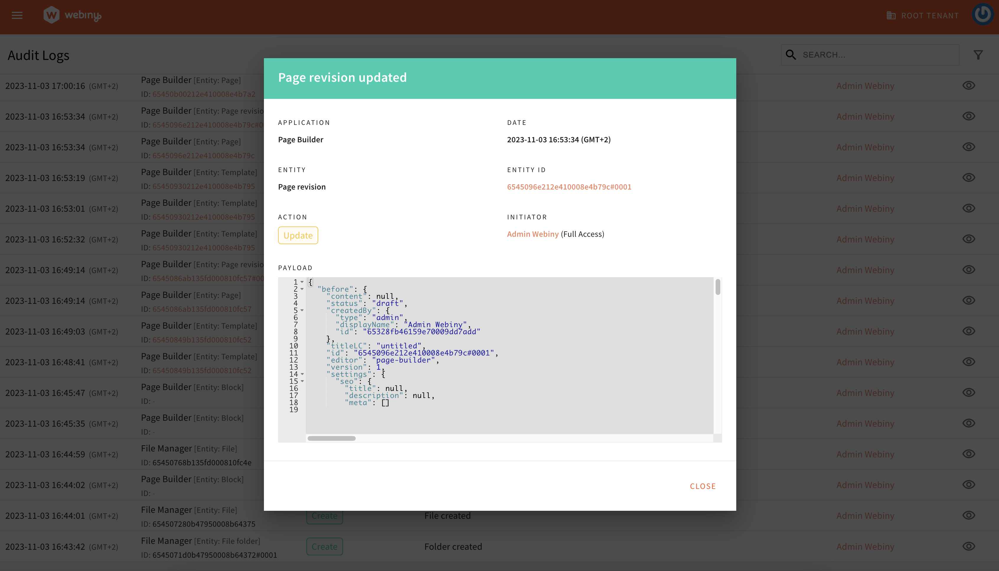

For our Enterprise customers, we introduced the option to have a monitoring solution which tracks the changes across the entire Webiny application suite. 

Audit Logs keep full track record of all the read/ update/ delete operations to help organizations monitor, investigate, and resolve any potential issues. The app can help with detecting and triaging **security incidents** and boosting **user accountability**. The logs can be analyzed to understand the sequence of events, identify the root cause, and track down the source of the issue. 

The capabilities we have added to this first version of Audit Logs are listed below:
## Tracking Changes

Audit Logs capture changes made to the Advanced Publishing Workflow, File Manager, Form Builder, Headless CMS, i18n, Mailer, Page Builder and Security.

## Filtering

Reviewing all the logs to find what one needs could be overwhelming, so Webiny offers great filtering capability to help users find the relevant record(s) quickly.

<video width="800px" height="auto" controls autoplay>
  <source src="./assets/feat-audit-logs-blog-post/al-filtering.mp4" type="video/mp4" />
</video>

## Direct Link to the Record Changed

Audit Logs provide a convenient way to quickly access the modified record through a direct link. This link takes the user straight to the altered record, except in cases where the record has been deleted.

<video width="800px" height="auto" controls autoplay>
  <source src="./assets/feat-audit-logs-blog-post/al-link.mp4" type="video/mp4" />
</video>

## View the Payload

Audit Logs offer the ability to see the full payload for the action.

This new application will become an important component of any enterprise’s security infrastructure, providing visibility into your organization’s CMS activities, enhancing user accountability, and supporting compliance with regulations in some industries. If you would like to try it out, get in touch with us.
If you have suggestions on how we can enhance this further, please share them with us on our [Slack channel](https://www.webiny.com/slack/) or use the [Idea Board](https://github.com/webiny/webiny-js/discussions/categories/ideas) to submit your improvement suggestions.

