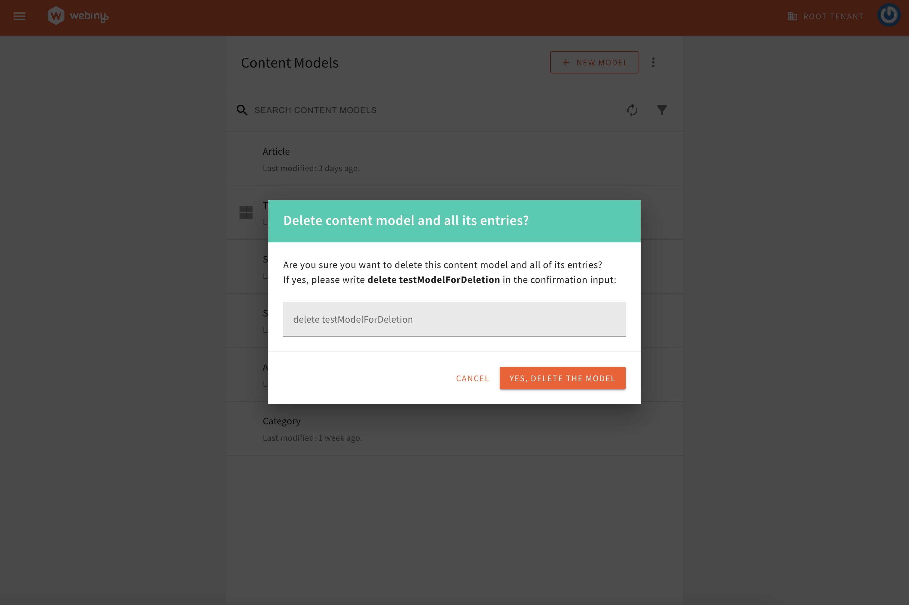
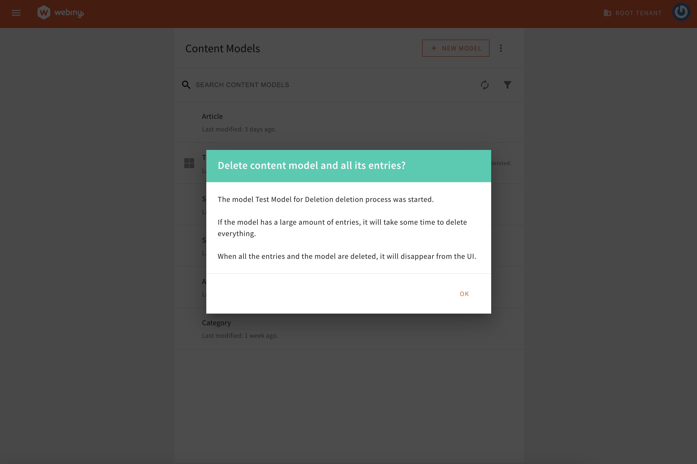
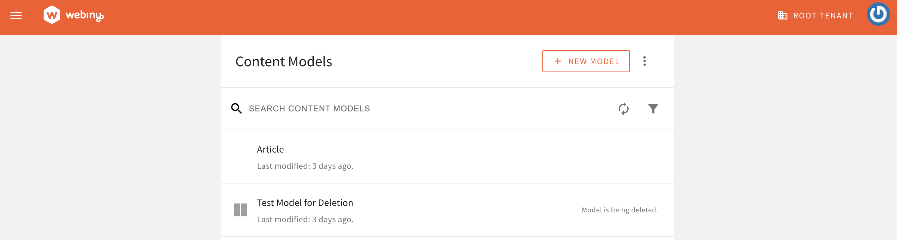

Creating the right content data structure is pivotal for the success of your Content Management Strategy. This may take a few trials and errors. Starting from scratch with the build of your content models every time can be painful, so we want to offer you the opportunity to work iteratively without having to delete the unnecessary subsets of data manually. 

If you have been using Webiny for a while, the existing schema could have to go through restructuring of the content models at some point. This could be complex to manage, especially when outdated or unnecessary models accumulate over time. To make it easier for developers and admins to maintain clean and efficient content structure, we’re introducing a new feature: **Deletion of the Full Headless CMS Model**, including all associated records, folders, and references.

This feature empowers users to permanently delete a content model and all its associated data directly from the **Models** menu. Read on to learn about the feature, the steps involved, and how it helps keep your content management system optimized.

## Why We Built This Feature

Deleting a content model in its entirety can be a delicate process due to the interconnected nature of the modern CMS structure. A model could be referenced across multiple areas, APIs, or external systems. Users needed a robust yet intuitive way to:

- Remove unused or deprecated content models.
- Ensure that all associated entries, references, and lifecycle events are handled properly.
- Receive clear warnings and a validation process before taking irreversible actions.

This new feature addresses these challenges by providing a **secure, guided process** for deletion.

## Feature Overview

The **“Delete Model and Content”** action is available in the **Models** menu in Webiny 5.42.0 or later versions. Represented by a repurposed T**rash icon**, this feature allows you to delete a content model and all associated data, including:

- Entries and folders in the model.
- References to the model across the system will be emptied.

This action is **irreversible**, and we’ve designed it with multiple safeguards to ensure no accidental deletions.

## Step-by-Step Walkthrough

**Step 1: Trigger the Delete Action**

Navigate to the **Models** menu, locate the model you wish to delete, and click the **trash icon** next to it. This will initiate the deletion process.
<video width="800px" height="auto" controls autoplay>
<source src="./assets/feature-overview-model-deletion/md-intro.mp4" type="video/mp4" />
</video>

**Step 3: Final Confirmation**

After the warning, users must re-confirm their intent by typing the **model name** into an input field. This step ensures that only deliberate deletions proceed.

Once the model name is entered correctly, users can click **Yes, Delete the Model** to proceed.

**Step 4: Deletion Execution**

The system will process the deletion in the background, permanently removing:

- The model itself.
- All associated data, entries, and references.
- Any linked content across the CMS will be updated and the values will be removed from the UI.

Once again, it is important to note that the deletion will trigger all relevant lifecycle events and hooks that are triggered in the event of manual deletion.

While the model is being deleted a message will inform users of the work in progress. Users will be able to cancel this action by hovering over the Model is being deleted text, but the records that were already deleted will not be recoverable.

Note that the deletion using this functionality will NOT be reflected in the Audit Logs.

The **Delete Model and Content** feature is now live in Webiny 5.42.0. Take control of your content models and maintain a sleek CMS schema with this powerful functionality. Remember, this action is irreversible—so use it carefully!

We’d love to hear your feedback on this feature. Let us know how it improves your workflow or if there are additional functionalities you’d like to see. We are available on [our Slack channel](https://www.webiny.com/slack/).
